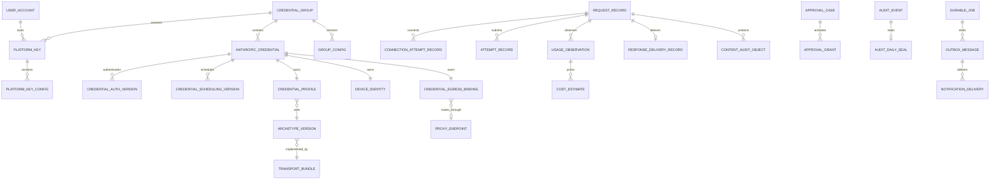

# Claude Code 企业网关数据库设计

> 状态：详细设计基线  
> 上位文档：[功能模块规划](functional-modules.md)、[技术架构](technical-architecture.md)、[领域模型](domain-model.md)  
> 适用范围：首个单实例 Linux Rust 交付版本  
> 数据库基线：PostgreSQL 16+

## 1. 文档目的与决策权威

本文把已确认的 18 个功能模块、Rust 单体技术架构和领域聚合落实为 PostgreSQL Schema、约束、索引、分区、事务与 migration 方案。它回答以下实施问题：

1. 每个领域事实存在哪张表，谁是权威写者；
2. Platform Key、Credential Group、Credential、Profile、Device、Egress 的一对一和不可变关系如何由数据库保护；
3. `revision`、`token_version`、`profile_epoch`、`device_epoch`、`egress_epoch` 如何更新；
4. Request、Connection Attempt、Messages Attempt、Usage、Cost、PLAN、Quota 如何关联；
5. 哪些对象进入分区，哪些对象只保留当前投影，哪些对象明确只在内存；
6. Secret、Content Audit、管理审计、备份和删除账本如何分域；
7. Rust/SQLx migration、首次初始化、在线升级与回滚如何执行。

决策优先级为：功能规划 > 技术架构 > 领域模型 > 本文。若 Schema 细节将改变客户端合同、透明响应原则、Profile 连续性、账号去重、安全边界或已确认默认值，应先修订上位文档。字段长度、索引参数和分区预创建数量可在压测后调整，只要保持本文不变量。

## 2. 持久化原则

### 2.1 PostgreSQL 是持久事实源

平台北向只承载 Anthropic/Claude Code Gateway 协议，南向只连接 Anthropic 官方 API。Schema 没有 Tenant、Provider 路由或模型自动切换抽象；User 只是平台人员身份，Platform Key 固定绑定一个 Group。Credential 主类型为 Claude Code 订阅 OAuth/Setup Token，Console API Key 仅作为兼容业务或内部 Count Tokens 配置。

PostgreSQL 保存：

- User、密码摘要、MFA 与管理登录会话；
- Platform Key、Credential Group、Credential 及其版本化配置；
- Credential Profile、Device Identity、Egress Binding、Proxy、Archetype 与 Bundle；
- Credential token、refresh token、Setup Token、Console API Key、Managed Browser Session 等密文；
- Credential 冷却、认证状态、token version、quota/PLAN 当前投影；
- Request、Attempt、Connection Attempt、Response Delivery、Usage 与 Cost 元数据；
- Versioned Artifact、Active Pointer、Model Catalog、价格和能力快照；
- Approval、Content Audit 对象元数据、AuditEvent、Deletion Ledger；
- Durable Job、Transactional Outbox、Alert、Notification、Backup、Restore Drill 与 Upgrade 记录。

以下对象仅存在于进程内：

- `PlatformKeyConcurrencyPermit`、`GroupConcurrencyPermit`；
- `QueueTicket`、DRR deficit、队列位置；
- `SessionActivityClaim`、活跃会话槽、AffinityEntry；
- `CredentialLease`、实时 RPM token bucket；
- Socket、连接池、TLS Session/HPACK 状态、Transport task；
- 在途 SSE、客户端 writer、非流式临时响应缓冲及其临时密钥。

进程重启从持久事实重建配置与 Credential 资格，不续接半个请求、Lease 或 SSE。客户端重试形成新的 `RequestId`。

首版在线依赖只有 Linux Rust 单体和 PostgreSQL；实时调度状态不引入 Redis 或外部消息队列。代理、Content Audit 对象存储与备份仓库按已启用能力接入。

### 2.2 写模型与读模型分离

- 核心聚合表保护强不变量，管理列表和“请求/使用记录”使用 Projection 或物化聚合表。
- 原始 Request/Response Body 默认不进 PostgreSQL；`full_encrypted` 时正文进入 Content Audit 对象存储，数据库只保存密文对象元数据。
- 高频观测采用 append-only history + 单行 current projection；调度读取 current projection，审计读取 history。
- 配置内容采用不可变版本 + Active Pointer；Request 接受后冻结版本 ID。

### 2.3 默认隔离级别与时间

- 普通 CRUD、Job 领取和遥测写入使用 `READ COMMITTED`。
- 账号激活、Profile/Egress 变更、Active Pointer 切换、审批决策等跨聚合强事务使用显式行锁与乐观版本；出现写偏差风险的短事务可使用 `SERIALIZABLE` 并做有界重试。
- 所有持久时间使用 `timestamptz`，连接启动后执行 `SET TIME ZONE 'UTC'`。
- 请求内 deadline 来自进程单调时钟；数据库只保存 wall-clock 起止时间与最终耗时。
- 数据库事务内严禁等待 Anthropic、OAuth、Browser、Proxy、对象存储上传或客户端 IO。

## 3. Schema、角色与权限

### 3.1 逻辑 Schema

| Schema | 内容 | 主要写者 |
|---|---|---|
| `iam` | User、密码、MFA、管理会话、Platform Key | Identity/Access service |
| `gateway` | Group、Credential、Profile、Device、Egress、Proxy | Group/Credential service |
| `catalog` | Archetype、Bundle、Artifact、Model、价格、能力与规则 | Catalog/Config service |
| `telemetry` | Request、Attempt、Connection、Usage、Cost、Quota、PLAN 聚合 | Request/Usage service |
| `security` | Encrypted Secret、Approval、Content Audit 元数据、Audit 链、Deletion Ledger | Security service |
| `ops` | Job、Outbox、Alert、Notification、Backup、Restore、Upgrade | Job/Operations service |

### 3.2 数据库角色

| 角色 | 权限 |
|---|---|
| `gateway_migrator` | Schema owner；仅 migration/restore 流程使用 |
| `gateway_runtime` | 业务表所需 SELECT/INSERT/UPDATE；没有 DDL、TRUNCATE、角色管理权限 |
| `gateway_readonly` | 脱敏管理查询和诊断；无密文列直接读取授权 |
| `gateway_backup` | 备份工具所需最小权限；与运行时凭据分离 |

首版单体可以只建立一个运行时连接池，但 SQL 路径仍按 Repository 限定。`security.encrypted_secret`、`security.content_audit_object` 等高敏表不授予通用只读角色。

### 3.3 扩展策略

首版核心 Schema 不依赖 PostgreSQL 扩展：

- UUIDv7 由 Rust 生成；
- 密码使用应用层 Argon2id；
- envelope encryption、HMAC 与内容哈希由 Rust KeyProvider/crypto adapter 完成；
- 用户名与邮箱由应用生成规范化列，不依赖 `citext`；
- 模糊检索后续若确有需要，再单独评估 `pg_trgm`。

这样可降低托管 PostgreSQL、离线恢复和版本升级差异。

## 4. 通用字段与编码约定

### 4.1 ID 与外部表示

所有实体 ID 在数据库中为 `uuid`，由应用生成 UUIDv7。API 展示时添加类型前缀，如 `usr_`、`key_`、`grp_`、`cred_`、`req_`；前缀不入数据库列。ID 分配后永久保持唯一且不复用。

请求类表同时保存 `request_month date`，值为 `accepted_at` 的 UTC 月首日，用于分区键。应用可从 UUIDv7 时间推导目标月，再用 `(request_month, request_id)` 定位记录。

### 4.2 版本与数字

| 语义 | PostgreSQL 类型 | 约束 |
|---|---|---|
| `revision` | `bigint` | `>= 1`，每次成功更新 `+1` |
| `artifact_version` | `bigint` | 同 scope/kind 内从 1 单调递增 |
| `token_version` | `bigint` | `>= 1`，Credential 内 CAS |
| `profile/device/egress_epoch` | `bigint` | `>= 1`，身份边界变化时递增 |
| Duration | `bigint` 毫秒 | 范围由 CHECK 和领域构造器共同验证 |
| Byte count | `bigint` | `>= 0` |
| Token count | `bigint` | nullable 且 `>= 0` |
| Weight/ratio | `numeric(20,9)` | 正数或 `0..1` |
| 金额 | `numeric(38,12)` | 带独立 `currency_code` |

金额与 token 计算不使用浮点列。计价结果保存 price snapshot、算法版本和输入完整度，以便历史解释。

### 4.3 Code 与 JSONB

领域枚举以小写 `text` code 保存，不绑定 PostgreSQL enum。稳定闭集状态通过 CHECK 约束；新增状态通过 migration 同步扩展约束。Storage adapter 遇到未知 code 时 fail closed，并创建 Schema compatibility alert。

`jsonb` 仅用于：

- 不可变 Versioned Artifact payload；
- 经过 allowlist 的 PLAN raw；
- Bundle manifest、证据摘要与可演进的 redacted detail；
- Job/Event payload envelope；
- 不参与核心约束的错误摘要。

归属、状态、版本、调度限制、epoch、金额和时间等核心字段使用显式列。

### 4.4 哈希与网络类型

- 内容哈希保存为 `hash_algorithm text + hash_digest bytea`；首版算法固定 `sha256`。
- keyed lookup digest 保存 `digest_key_version bigint + digest bytea`。
- IP 地址与 allowlist 使用 `inet`/`cidr`；来源 IP 保存前先按可信代理链解析。
- URL、对象路径与代理地址分解为 scheme/host/port/object_key，避免把认证信息放入 URL 文本。

### 4.5 通用审计列

可变聚合默认包含：

```sql
revision   bigint      NOT NULL CHECK (revision >= 1),
created_at timestamptz NOT NULL,
updated_at timestamptz NOT NULL
```

不可变版本默认包含 `created_by`、`created_at`、`content_hash`。数据库触发器固定 `created_at`，更新只允许白名单状态列；业务变更的 before/after digest 进入 `security.audit_event`。

## 5. 总体关系图



关键基数：

```text
Platform Key N ── 1 User
Platform Key N ── 1 Credential Group
Credential Group 1 ── N Anthropic Credential
Anthropic Credential 1 ── 1 Credential Profile
Anthropic Credential 1 ── 1 Device Identity
Anthropic Credential 1 ── 1 Credential Egress Binding
Environment Archetype 1 ── N Profile
Proxy Endpoint 1 ── 0..N Egress Binding（默认最多 5 个 active binding）
Request 1 ── 0..3 Connection Attempt
Request 1 ── 0..3 Messages Attempt
```

## 6. User、密码、MFA 与管理会话

### 6.1 `iam.user_account`

| 列 | 类型 | 说明 |
|---|---|---|
| `id` | uuid PK | UserId |
| `username` | text | 原始用户名 |
| `username_normalized` | text UNIQUE | Unicode/大小写规范化结果 |
| `display_name` | text | 可按留存策略脱敏 |
| `email` | text | 原始邮箱 |
| `email_normalized` | text UNIQUE | 规范化邮箱 |
| `role_code` | text | `platform_admin` / `user` |
| `status_code` | text | `invited`、`mfa_pending`、`active`、`disabled`、`locked`、`archived` |
| `password_credential_id` | uuid FK | 当前密码摘要 |
| `revision` | bigint | 乐观锁 |
| `created_at/updated_at/archived_at` | timestamptz | 生命周期 |

主要约束：

- `archived_at IS NOT NULL` 当且仅当 `status_code='archived'`；
- 用户名永久占用，归档后 `username_normalized` 仍保留；
- 归档命令先验证名下所有 Platform Key 已 `revoked`；
- 首版角色只含 `platform_admin` 与 `user`。

### 6.2 `iam.password_credential`

保存 Argon2id PHC 字符串、参数版本、创建时间、强制修改标记与最近修改时间。密码摘要不进入 `security.encrypted_secret`，也没有可逆 reveal 路径。旧摘要在成功改密事务中标为 `superseded_at`，短期保留用于审计后按安全策略清理。

### 6.3 `iam.mfa_enrollment`

| 列 | 说明 |
|---|---|
| `user_id` | PK/FK，一个 User 一条当前 enrollment |
| `totp_secret_id` | FK → `security.encrypted_secret` |
| `state_code` | `pending` / `active` / `disabled` |
| `algorithm/digits/period_seconds` | TOTP 参数 |
| `verified_at` | 首次成功绑定时间 |
| `revision` | CAS |

TOTP secret 只在校验器短暂解密。恢复码若后续加入，使用独立 one-way digest 表，而非加入 TOTP 密文。

### 6.4 `iam.management_session`

管理 UI 登录态使用随机 session token 的 keyed digest：

- `id`、`user_id`、`token_digest`、`digest_key_version`；
- `created_at`、`last_seen_at`、`expires_at`、`revoked_at`；
- `mfa_verified_at`；
- `source_ip`、`user_agent_summary`、`session_revision`。

索引：`UNIQUE(token_digest)`；`(user_id, revoked_at, expires_at)`。User disabled/locked/archived 时同事务插入 session-revoke outbox，运行时认证同时读取 User revision，避免旧缓存继续授权。

### 6.5 `iam.management_step_up_grant`

Step-up 是 purpose-scoped 的短期授权记录，不是 Session 上的通用开关。列包含 `id`、`management_session_id`、`user_id`、`purpose_code`、`auth_context_digest`、`verified_at`、`expires_at`、`consumed_at` 与 `created_at`。索引覆盖 `(management_session_id, purpose_code, expires_at)`；CHECK 保证 `consumed_at >= verified_at`。

高风险 command 必须验证同一用户、同一 Session、purpose 匹配、认证上下文未变化且 grant 有效。Secret reveal 等一次性 purpose 在业务事务中原子写入 `consumed_at`；不同 purpose 不共享 grant。

## 7. Secret 与 KeyProvider 元数据

### 7.1 `security.encrypted_secret`

```sql
CREATE TABLE security.encrypted_secret (
    id                  uuid PRIMARY KEY,
    secret_kind_code    text        NOT NULL,
    provider_role_code  text        NOT NULL,
    cipher_suite_code   text        NOT NULL,
    ciphertext          bytea       NOT NULL,
    nonce               bytea       NOT NULL,
    wrapped_dek         bytea       NOT NULL,
    key_version         bigint      NOT NULL CHECK (key_version >= 1),
    lookup_digest       bytea,
    digest_key_version  bigint,
    display_prefix      text,
    created_at          timestamptz NOT NULL,
    rotated_at          timestamptz,
    destroyed_at        timestamptz,
    CHECK ((lookup_digest IS NULL) = (digest_key_version IS NULL))
);

CREATE UNIQUE INDEX uq_secret_lookup_digest
    ON security.encrypted_secret (lookup_digest)
    WHERE lookup_digest IS NOT NULL AND destroyed_at IS NULL;
```

`provider_role_code` 固定分域为 `business`、`content_audit`、`backup`、`audit_integrity`。普通业务 Secret 的密文记录位于 PostgreSQL；Content Audit 使用独立用途域，Backup key 与 Audit Integrity 根密钥由数据库外 KeyProvider 负责。

### 7.2 `security.business_key_material`

功能规划已确认首版普通应用主密钥与 Credential/Platform Key/Proxy 等普通业务密文同库。专表保存 `key_version`、受限 key material、state `active/decrypt_only/retired/destroyed`、created/activated/retired 时间和 checksum。只有 `gateway_runtime` 的 KeyProvider adapter 可读；普通 Repository、管理查询、导出和日志均无读取路径。

该选择提供静态数据保护和统一轮换，但数据库备份同时包含业务密文与 Business key material，安全隔离强度低于外部 KMS。KeyProvider port 保持稳定，后续可迁移至权限文件、Vault/KMS。Content Audit KeyProvider 使用独立用途域；Backup 与 Audit Integrity 根密钥明确位于数据库和备份仓库之外。

轮换采用：插入新 active version → 新写使用新版本 → Durable Job 分批重包旧 DEK → 旧版本进入 decrypt_only → 引用清零后 retired/destroyed。每次状态变化进入双人审批范围、Audit 链和 Backup manifest。

### 7.3 Secret 归属

Secret 本表不使用 `owner_type/owner_id` 多态外键。各业务表正向引用 `secret_id`：

- Platform Key → 一个可 reveal secret；
- Credential auth version → access/refresh/setup/console secret；
- Device Identity → installation/client/profile seed/session HMAC secret；
- Proxy → authentication secret；
- Auto Reauth material → Cookie Jar/Web Storage secret；
- Notification destination → SMTP/WebHook/Server酱3 secret。

各引用列默认 `ON DELETE RESTRICT`。Secret 销毁流程先确认所有业务引用已退役，再进行 DEK 加密擦除并写 Deletion Ledger。

### 7.4 Secret reveal

`iam.platform_key_secret_reveal` 只保存 reveal 事实：`key_id`、`revealed_by`、`purpose`、`management_session_id`、`revealed_at`、`audit_event_id`。完整 secret 仍从 `encrypted_secret` 临时解密，不在 reveal 表复制。每次 reveal 要求 step-up MFA、权限校验、审计链可写，HTTP 响应使用 `Cache-Control: no-store`。

## 8. Platform Key 与访问配置

### 8.1 `iam.platform_key`

| 列 | 约束 |
|---|---|
| `id` | PK |
| `owner_user_id` | FK User，创建后固定 |
| `group_id` | FK Group，创建后固定 |
| `name` | owner 内唯一的活动显示名 |
| `secret_id` | UNIQUE FK encrypted_secret |
| `status_code` | `active/disabled/expired/revoked` |
| `expires_at` | nullable |
| `revision` | CAS |
| timestamps | 生命周期 |

数据库触发器 `iam.reject_platform_key_rebind()` 拒绝更新 `owner_user_id`、`group_id`、`secret_id`。Key 到期 Job 通过 `expires_at` 把 active/disabled 更新为 expired；管理员设置未来到期时间可恢复 expired。`revoked` 为终态。

### 8.2 `iam.platform_key_config`

每次配置变更插入不可变版本：

| 字段组 | 列 |
|---|---|
| 身份 | `id`、`platform_key_id`、`config_version`、`content_hash` |
| Endpoint | `allow_messages`、`allow_models` |
| Body | `body_limit_bytes` |
| Messages 桶 | `messages_rpm` 默认 60、`messages_burst` 默认 10 |
| Models 桶 | `models_rpm` 默认 60、`models_burst` 默认 10 |
| 并发 | `concurrency_limit` 默认 5、`concurrency_retry_after_ms` 默认 2000 |
| 策略 | `ruleset_artifact_id` nullable、`requested_content_audit_code` |
| 版本 | `created_by`、`created_at` |

`concurrency_limit` 是每枚 Platform Key 独立的硬上限：运行时满载即返回该 Key 冻结的 retry-after，调用不会进入 Group 队列。不同 Key 可配置不同值；首版不接入充值额度自动换算。

子表：

- `iam.platform_key_model_allowlist(config_id, model_id)`；空集配合 `model_scope_code='all_published'`；
- `iam.platform_key_ip_allowlist(config_id, network cidr)`；空集表示来源不限；
- `iam.platform_key_endpoint_permission` 可由两个布尔列投影，无需额外 ACL 对象。

唯一约束：`UNIQUE(platform_key_id, config_version)`、`UNIQUE(platform_key_id, content_hash)`。

### 8.3 `iam.platform_key_active_config`

```sql
platform_key_id uuid PRIMARY KEY REFERENCES iam.platform_key(id),
config_id       uuid UNIQUE NOT NULL REFERENCES iam.platform_key_config(id),
revision        bigint NOT NULL,
activated_by    uuid NOT NULL REFERENCES iam.user_account(id),
activated_at    timestamptz NOT NULL
```

切换事务锁定 Key 与 Active Config 行，验证新 config 确属该 Key，更新 pointer revision，写 AuditEvent 与 Outbox。Request 接受时把 `config_id/config_version` 冻结到 RequestRecord。

### 8.4 认证查询路径

1. 对客户端 secret 计算 keyed digest；
2. 通过 `uq_secret_lookup_digest` 定位 secret；
3. 连接 `platform_key`、User、Group 与 active config；
4. 检查 status、expiry、endpoint、IP、model、body 上限；
5. 原始 secret 立即离开请求对象，只保留 AccessContext。

Key 缺失、格式错误、查无记录、过期、禁用和吊销等失败进入按月分区的 `security.platform_key_auth_event`：endpoint、outcome code、来源 IP、可信代理解析摘要、输入长度类别、可选 display prefix digest 与时间。表中不保存原 Key、完整 lookup digest 或请求 Body；客户端仍只看到统一认证错误合同。

常用覆盖索引：

```sql
CREATE INDEX ix_platform_key_owner_list
    ON iam.platform_key (owner_user_id, created_at DESC, id);

CREATE INDEX ix_platform_key_expiry_scan
    ON iam.platform_key (expires_at, id)
    WHERE status_code IN ('active','disabled') AND expires_at IS NOT NULL;
```

## 9. Credential Group 与版本化策略

### 9.1 `gateway.credential_group`

保存 `id`、`name`、`status_code`、逻辑 `owner_partition_id`、`owner_binding_revision`、`revision` 和时间。首版 owner 仍在同一进程内；表中没有 task handle、实例内存地址或活跃 generation。

Group 状态：`active ↔ disabled`，随后可进入终态 `archived`。归档前由 application service 验证排空已完成。

### 9.2 `gateway.group_config`

每个版本为不可变行，核心列如下：

| 类别 | 列与默认值 |
|---|---|
| 客户端 | 两行子表 `group_accepted_client_class`，至少一项 |
| 模型 | `model_scope_code` + `group_model_allowlist` |
| 认证池 | `auth_pool_policy_code`、`console_fallback_enabled=false` |
| 托管 | `fully_managed_required=false` |
| 出口 | `egress_policy_code=auto` |
| Group 限制 | `concurrency_limit NULL`、`messages_rpm NULL`、`messages_burst NULL` |
| Credential 默认 | `credential_default_concurrency=5`、`credential_default_rpm=60` |
| 队列 | `queue_capacity_rule_code`、`queue_capacity_value`、`pre_upstream_timeout_ms=30000`、`full_retry_after_ms=2000`、`wait_timeout_retry_after_ms=5000` |
| Session | `session_capacity_enabled=false`、`max_active_sessions NULL`、`session_idle_ttl_ms=1800000`、`session_slot_wait_ms=5000`、`affinity_ttl_ms=86400000` |
| Retry | `max_messages_attempts=3`、`max_connection_attempts=3`、`preferred_wait_ms=2000`、`min_retry_budget_ms=5000`、`cancel_grace_ms=2000` |
| Timeout | connect 5000、non-stream upstream 300000、stream idle 30000、client write idle 120000、non-stream delivery 300000 |
| Streaming | `stream_pending_bytes_max=1048576` |
| Non-stream buffer | memory 8 MiB、hard 64 MiB；实例级预算属于系统配置 artifact |
| Snapshot | `enforcement_artifact_id`、ruleset、capability、background catalog、price refs；active Group 必须引用同 Group 的 active Enforcement Artifact |
| 审计 | `content_audit_policy_code`、`content_audit_retention_days` 默认 7、`content_audit_direction_limit_bytes` 默认 64 MiB |
| Token Estimate | mode、Console Count Key ref、内部 RPM 60、local fallback |

CHECK 约束至少覆盖：

- connect timeout 1–30 秒；stream idle 5–600 秒；
- messages/connection attempts 均为 1–3，首版 Active 配置固定 3；
- 固定 queue capacity 必须为正数；按公式配置时编译结果最多为 `2 × effective concurrency`；
- Session disabled 时 `max_active_sessions IS NULL`，enabled 时为正数；
- Content Audit retention 为 1–365 天；
- Group concurrency/RPM 的 NULL 表示默认不限；
- `proxy_required` 与无可用 Proxy 的状态由资格投影处理，不在配置发布时假造 Proxy。

### 9.3 `gateway.group_active_config`

结构与 Platform Key active pointer 相同。发布事务验证所有 snapshot 引用处于 eligible/active、内容哈希正确、Group Enforcement 与 Profile Attribution 相容，然后原子切换 pointer，写 Audit/Outbox，并通过 PostgreSQL NOTIFY 提示热加载。周期轮询仍以 pointer 为权威。

### 9.4 Group 成员查询

Credential 的 `group_id` 是成员关系权威。Group 不保存 credential ID 数组。索引：

```sql
CREATE INDEX ix_credential_group_membership
    ON gateway.anthropic_credential (group_id, lifecycle_code, id);
```

管理页面中的成员数、active 数、cooldown 数来自 Projection/聚合查询，调度器启动时按 Group 加载合格 Credential。

## 10. Anthropic Credential、认证版本与调度配置

### 10.1 `gateway.anthropic_credential`

核心列：

| 列 | 说明 |
|---|---|
| `id` | CredentialId |
| `group_id` | 当前 Group；迁移 commit 时更新 |
| `account_uuid` | Anthropic account 全局去重键，验证前 nullable |
| `purpose_code` | `business` / `verification_only` |
| `auth_kind_code` | `oauth_subscription` / `setup_token_subscription` / `console_api_key` |
| `lifecycle_code` | `pending_verify/pending_profile/pending_egress/pending_reauth_strategy/active/disabled/revoked/archived` |
| `attachment_code` | `attached/draining/detached/attaching` |
| `attachment_target_group_id` | 迁移中目标 Group |
| `attachment_deadline` | 默认 5 分钟 drain deadline |
| `auth_state_code` | healthy/expiring/refreshing/reauth... |
| `auth_next_at` | 重试/等待时间 |
| `capacity_state_code` | available/limited/cooldown/half_open |
| `capacity_reason_code` | 限制或 cooldown 来源 |
| `cooldown_until` | 429 等持久冷却 |
| `cooldown_consecutive_count` | 默认阶梯计数 |
| `half_open_probe_budget` | half-open 时正数 |
| `transport_state_code` | ready/transport_unavailable |
| `management_class_code` | fully_managed/non_managed |
| `token_version` | token CAS |
| `active_auth_version_id` | 当前 auth material |
| `revision` | 聚合 CAS |

全局唯一约束：

```sql
CREATE UNIQUE INDEX uq_credential_account_uuid
    ON gateway.anthropic_credential (account_uuid)
    WHERE account_uuid IS NOT NULL;
```

该索引覆盖全部 Group 与生命周期。正常添加发现重复时返回 409；人工恢复入口锁定并更新原 Credential。Archived 记录仍保留 account UUID，因此新建流程也会识别历史对象。

### 10.2 `gateway.credential_auth_version`

每次 token refresh、同账号重认证或认证类型显式迁移创建新版本：

| 列 | 说明 |
|---|---|
| `id` | auth version ID |
| `credential_id` | FK |
| `token_version` | 与 Credential 新 token version 一致 |
| `auth_kind_code` | 认证类型 |
| `access_secret_id` | OAuth/Setup 获取的 access token |
| `refresh_secret_id` | OAuth refresh token，可空 |
| `setup_token_secret_id` | 仅 bootstrap 交换中的短期引用；终态销毁并置空 |
| `console_api_key_secret_id` | Console API Key，可空 |
| `verified_account_uuid` | 本次验证结果 |
| `issued_at/expires_at` | token 生命周期 |
| `created_by_operation_id` | refresh/reauth operation |
| `superseded_at` | 退役时间 |

CHECK 根据 `auth_kind_code` 验证 secret 组合。`setup_token_subscription` 可持有交换所得 access/refresh material而不改变 auth kind；Setup Token 原文只在 Enrollment 交换期存在。`UNIQUE(credential_id, token_version)`。旧版本在短暂 rollback/审计窗口后销毁密文，历史 Attempt 只保存 token version，不引用可用 token 正文。

Token CAS 事务：

```sql
-- 伪 SQL：先验证新 token account_uuid，再执行
INSERT INTO gateway.credential_auth_version (... token_version = :expected + 1 ...);

UPDATE gateway.anthropic_credential
SET active_auth_version_id = :new_auth_id,
    token_version = token_version + 1,
    auth_state_code = 'healthy',
    revision = revision + 1,
    updated_at = :now
WHERE id = :credential_id
  AND token_version = :expected_token_version
  AND account_uuid = :verified_account_uuid;
```

影响行数为零时丢弃新密文版本并返回 CAS conflict；Profile、Device、Egress 和各 epoch 保持原值。

### 10.3 `gateway.credential_enrollment`

Credential 添加/恢复是有 TTL 的过程聚合，独立持久化以支持 OAuth callback、重试、进程重启与严格清理：

| 列 | 说明 |
|---|---|
| `id` | EnrollmentId |
| `mode_code` | `create/recover` |
| `target_group_id` | 目标 Group |
| `auth_method_code` | oauth_pkce/setup_token/existing_oauth/console_api_key |
| `pending_credential_id` | Create 流程预建对象，可空 |
| `recovery_credential_id` | Recover 原对象；仅 recover 必填 |
| `expected_credential_revision` | Recover CAS 输入 |
| `state_code` | created/resolving_egress/awaiting_user_action/exchanging_material/verifying_account/deduplicating/provisioning_identity/configuring_reauth/activation_check/recovering_existing/succeeded/cancelled/expired/failed |
| `next_action_code` | wait_for_egress/open_authorization_url/submit_setup_material/submit_existing_oauth_material/complete_oauth_callback/complete_browser_login/retry/manual_recovery/none |
| `egress_binding_id/egress_epoch` | 授权链路冻结出口 |
| `pkce_state_digest/callback_nonce_digest` | keyed digest，可空 |
| `pkce_verifier_secret_id` | 临时加密 secret，可空 |
| `identified_account_uuid` | 验证后填入、去重前仍不激活 |
| `material_secret_refs_json` | 仅存 SecretId allowlist，不含正文 |
| `attempt_count/expires_at/consumed_at` | 有界过程与一次性 callback |
| `revision/created_at/updated_at` | CAS 与审计时间 |

CHECK 保证 create/recover 的 pending/recovery 引用组合、终态 `next_action=none`、callback consumed 只出现一次。默认 TTL 30 分钟，OAuth callback 接受窗 10 分钟且不越过 TTL。终态清理临时 secret、Browser context 和未提交 Egress 预分配；Create 在账号验证后执行全局唯一检查，Recover 只 CAS 更新同账号的原 Credential。

### 10.4 `gateway.credential_scheduling_config`

不可变版本保存：priority、weight、max concurrency、Messages RPM/burst、模型 scope override、thinking/cache override、System Attribution requirement、Session capacity override。`gateway.credential_active_scheduling_config` 维护 active pointer。

Group concurrency/RPM 默认 `NULL=unlimited`。Credential 默认并发 5、Messages RPM 60 在创建 Credential 首版调度配置时物化；Group 后续修改 Credential 默认值只作用于未显式覆盖字段时，并在编译快照中记录来源。Credential override 只收紧 Group scope/capability。

### 10.5 Transport blocker

`gateway.credential_transport_blocker` 使用 `(credential_id, blocker_code, source_object_id)` 唯一键，保存 first/last seen、evidence digest、state、resolved_at。`transport_state_code` 是 blocker 集合的当前投影：存在 active blocker 即 `transport_unavailable`。

网络/Proxy/Bundle 故障只改变 blocker/transport 投影，不触碰 auth state、Profile、Device 或 Egress epoch。

### 10.6 Group 迁移记录

`gateway.credential_group_migration` 保存 source/target Group、state、drain deadline、checkpoint、发起人、commit/rollback 时间和 revision。Commit 事务更新 Credential.group_id/attachment、migration、Audit/Outbox。旧 affinity 只在内存，Outbox 发出清理命令；Profile、Device、Egress、PLAN、quota、usage/history 均沿用原 CredentialId。

## 11. Credential Profile、Device Identity 与 Session 派生

### 11.1 `gateway.device_identity`

每个 Credential 恰好一条设备实例：

| 列 | 约束 |
|---|---|
| `id` | uuid PK |
| `credential_id` | UNIQUE FK |
| `device_epoch` | bigint >= 1 |
| `installation_id_secret_id` | UNIQUE FK secret |
| `installation_id_digest` | UNIQUE keyed digest，检测误复用 |
| `client_id_secret_id` | UNIQUE FK secret |
| `client_id_digest` | UNIQUE keyed digest |
| `profile_seed_secret_id` | UNIQUE FK secret |
| `session_hmac_secret_id` | UNIQUE FK secret |
| `created_at/rebuilt_at` | 生命周期 |
| `revision` | CAS |

`installation_id_digest` 和 `client_id_digest` 使用业务域独立 digest key，仅用于唯一约束，不用于认证。Archetype 可共享，以上四类 secret 及其 `secret_id` 均禁止跨 Credential 复用。

### 11.2 `gateway.credential_profile`

```sql
CREATE TABLE gateway.credential_profile (
    id                    uuid PRIMARY KEY,
    credential_id         uuid NOT NULL UNIQUE
                              REFERENCES gateway.anthropic_credential(id),
    device_identity_id    uuid NOT NULL UNIQUE
                              REFERENCES gateway.device_identity(id),
    archetype_version_id  uuid NOT NULL
                              REFERENCES catalog.environment_archetype_version(id),
    egress_binding_id     uuid NOT NULL UNIQUE
                              REFERENCES gateway.credential_egress_binding(id),
    lifecycle_code        text NOT NULL,
    profile_epoch         bigint NOT NULL CHECK (profile_epoch >= 1),
    session_derivation_version text NOT NULL,
    allocation_cohort     text NOT NULL,
    allocation_evidence  jsonb NOT NULL,
    revision              bigint NOT NULL CHECK (revision >= 1),
    created_at            timestamptz NOT NULL,
    updated_at            timestamptz NOT NULL
);
```

跨表 deferred constraint trigger 验证 Profile、Device、Egress 三条记录的 `credential_id` 相同。Credential 进入 active 前，Profile lifecycle 必须 active，Archetype/Bundle 必须可加载，Egress binding 必须 active。

### 11.3 Profile 变更历史

`gateway.credential_profile_change` 为 append-only：

- `credential_id/profile_id`；
- `change_kind_code`：`archetype_upgrade`、`egress_rebind`、`device_rebuild`；
- before/after archetype、profile/device/egress epoch；
- approval case、cohort、reason、actor、时间、AuditEvent。

更新矩阵由事务约束：

| 操作 | profile epoch | device epoch | egress epoch |
|---|---:|---:|---:|
| token refresh / 同账号 reauth / Group 迁移 | 保持 | 保持 | 保持 |
| Archetype cohort 升级 | +1 | 保持 | 保持 |
| Egress rebind | +1 | 保持 | +1 |
| Device rebuild | +1 | +1 | 保持 |

普通 `UPDATE credential_profile` 只允许生命周期和 revision；Archetype/epoch 变更必须由存储过程式 Repository command 完成，并同时写 history、Audit 与 Outbox。

### 11.4 Session 数据边界

上游 Session ID 按以下输入在内存派生：

```text
derivation version
+ CredentialId
+ PlatformKeyId
+ normalized BaseSessionId
+ field purpose
```

数据库保存 `session_derivation_version` 和加密 `session_hmac_secret_id`，不保存每次派生的上游 Session ID。AgentId 不进入派生输入；RequestRecord 只保存 Base Session/Agent 的 keyed digest 与匿名/显式分类，支持公平性和问题定位，同时降低会话标识泄露。

Affinity、活跃会话槽与 idle timer 只在 GroupExecutor 内存中存在。默认 idle 30 分钟释放槽，affinity 身份保留 24 小时；重启后按新请求重新形成运行态，不通过历史 Request 复活旧 Lease。Session capacity 默认关闭且可由管理员启用；Schema 没有单 Session 请求并发上限，因此 main + 9 subagent 可作为同一 Base Session 下十个 Agent 调度单元并发竞争 Group/Credential 容量。

## 12. Proxy 与 Credential Egress Binding

### 12.1 `gateway.proxy_endpoint`

| 列 | 说明 |
|---|---|
| `id/name` | 标识与显示名 |
| `proxy_type_code` | `http_connect` / `socks5` |
| `host/port` | 分解地址 |
| `auth_secret_id` | nullable encrypted secret |
| `lifecycle_code` | `active/draining/disabled/archived` |
| `health_code` | unknown/probing/healthy/unhealthy_* |
| `stability_code` | `static/dynamic` |
| `expected_exit_ip` | nullable inet |
| `observed_exit_ip` | nullable inet |
| `max_active_bindings` | 默认 5，正整数 |
| `last_probe_at/last_success_at` | 健康时间 |
| `revision` | CAS |

活动 binding 数通过事务中锁定 Proxy 行并计数保护；首版不设置 Proxy 请求并发或 RPM 列。`auto` 分配在同一事务中选择 `active + healthy + static` 且未满的 Proxy，按 `active_bindings/max_active_bindings` 最小排序，比例相同时按稳定 Proxy ID 排序。Proxy `draining` 拒绝新绑定，已有 Credential 在 drain 截止前继续；`disabled` 使绑定 Credential 添加 blocker；`archived` 为终态，只允许在零 active/pending binding 后进入并保留历史引用。

### 12.2 `gateway.credential_egress_binding`

每个 Credential 恰好一条：

| 列 | 说明 |
|---|---|
| `id` | EgressBindingId |
| `credential_id` | UNIQUE FK |
| `mode_code` | `direct/proxy` |
| `proxy_id` | proxy 模式必填，direct 模式为空 |
| `stability_code` | `static/dynamic` |
| `lifecycle_code` | pending/active/transport_unavailable/rebinding |
| `egress_epoch` | >=1 |
| `expected_exit_ip` | nullable inet |
| `observed_exit_ip` | nullable inet |
| `observed_at` | 最近观测 |
| `revision` | CAS |

CHECK：`mode_code='proxy'` 与 `proxy_id IS NOT NULL` 等价。代理池为空且 Group egress policy 为 auto 时，新 Credential 可建立 direct binding；`proxy_required` 时保持 pending_egress。已有 direct/proxy binding 不因一次请求临时改变。

### 12.3 `gateway.egress_observation`

append-only 记录 DNS、CONNECT/SOCKS5、TLS pass-through、ALPN、出口 IP 和延迟结果。列含 binding/proxy、probe kind、result code、resolved endpoint、exit IP、certificate passthrough evidence digest、observed_at。健康 current projection 写回 Proxy/Binding，原始观测按运维明细留存策略分区。

### 12.4 漂移与重绑事务

首次确认出口漂移：

1. 锁定 binding 与 Credential；
2. binding → `transport_unavailable`，写 active blocker；
3. 保持 proxy_id、egress_epoch、Profile 和 Device；
4. 写 Alert、Audit/Outbox；
5. 由管理员显式执行 direct/proxy rebind；
6. rebind 成功时 `egress_epoch + 1`、`profile_epoch + 1`，写 change history，旧 PoolKey 进入 drain。

Proxy 必须 TLS pass-through。发现 TLS interception 时健康状态进入 `unhealthy_tls_passthrough`，其全部绑定 Credential 退出新请求调度，认证状态保持原值。

## 13. Environment Archetype、Transport Bundle 与证据

### 13.1 `catalog.environment_archetype`

Archetype root 保存稳定逻辑 ID、名称、OS family、arch、runtime family、client family、创建时间。具体版本位于 `catalog.environment_archetype_version`：

- `archetype_id`、`artifact_version`；
- OS family/build、arch；
- Bun/Node/runtime family/version；
- Claude Code/client family/version；
- capture cohort、renderer/serializer/profile schema version；
- UA、Header order、System Attribution、Metadata 与 Session 格式的非秘密模板；
- lifecycle `draft/verified/canary/active/retired`；
- content hash、evidence set ID、created by/time。

唯一键覆盖 `(archetype_id, artifact_version)` 与完整 category/capture cohort 组合。新 Credential 只从 active 且有容量的版本分配；存量 Profile 由显式 cohort migration 更新。

### 13.2 `catalog.transport_bundle`

| 列 | 说明 |
|---|---|
| `id`、`bundle_version` | Bundle 标识与版本 |
| `source_archetype_version_id` | 唯一来源 ArchetypeVersion，包含 capture cohort |
| `protocol_code` | `h1/h2`，与 Bundle 应用规格一一对应 |
| `engine_abi_version` | Linux 单体 Transport Engine ABI |
| `source_os_family` | 真实采集来源 |
| `runtime_family/version` | Bun/Node 等来源运行时 |
| `object_location` | Bundle Store 对象键 |
| `manifest_json` | allowlisted manifest |
| `content_hash` | 内容地址 |
| `canonicalization_code/canonical_hash` | `jcs_rfc8785` 与 SHA-256 |
| `signature_domain/signature_algorithm/key_id/signature` | `transport_bundle_v1` 域的 Ed25519 detached signature |
| `lifecycle_code` | draft/verified/canary/active/retired |
| `runtime_state_code` | loadable/quarantined |
| `min/max_engine_version` | 兼容范围 |
| timestamps | 构建、验证、激活、隔离时间 |

Bundle 二进制不进入普通 PostgreSQL large object；生产从受限 Bundle Store 读取，启动时按 RFC 8785 JCS 生成 canonical bytes、计算 SHA-256，并以 Bundle 专用 key domain 验证 Ed25519 detached signature、provenance、evidence 与 ABI。Release 使用独立签名 key domain，二者不得交叉接受。`runtime_state=quarantined` 时所有引用 Profile 产生 transport blocker。

### 13.3 映射与容量

`catalog.archetype_bundle_binding(archetype_version_id, bundle_id, protocol_code)` 以 `UNIQUE(bundle_id)` 强制每个 Bundle 版本只绑定一个 ArchetypeVersion/capture cohort/protocol；同一 ArchetypeVersion 的 H1/H2 或不同 evidence 必须形成不同 Bundle。绑定值必须与 Bundle 内 `source_archetype_version_id/protocol_code` 相同。

`catalog.archetype_capacity_policy` 保存新 Credential 分配容量、权重和 cohort。它只控制分配，不限制已有 Profile 的业务并发。

### 13.4 证据表

- `catalog.evidence_set`：id、kind、source run、content hash、状态、验证者、时间；
- `catalog.evidence_item`：非秘密 Header/Attribution/Metadata/Session/TLS/H2 observation 的结构化摘要；
- `catalog.capture_run`：Windows/macOS/Linux 离线 runner 版本、Claude Code 版本、capture tool 版本、环境摘要、outcome；
- `catalog.replay_verification`：reference/replay case、expected/actual digest、差异分类、pass/fail；
- `catalog.bundle_runtime_incident`：wire conflict、隔离、回滚和恢复记录。

生产环境只加载已签名 Bundle；三 OS Capture Tooling 不在生产请求链，也不要求长期在线。Linux 单体通过 Bundle/BoringSSL/有序 H1/H2 实现被采集证据确认的传输表现。

## 14. 通用 Versioned Artifact 与 Active Pointer

### 14.1 `catalog.versioned_artifact`

```sql
CREATE TABLE catalog.versioned_artifact (
    id                  uuid PRIMARY KEY,
    artifact_kind_code  text        NOT NULL,
    scope_type_code     text        NOT NULL,
    scope_id            uuid,
    artifact_version    bigint      NOT NULL CHECK (artifact_version >= 1),
    lifecycle_code      text        NOT NULL,
    payload_json        jsonb,
    object_location     text,
    hash_algorithm      text        NOT NULL,
    hash_digest         bytea       NOT NULL,
    schema_version      text        NOT NULL,
    evidence_set_id     uuid,
    created_by          uuid        NOT NULL REFERENCES iam.user_account(id),
    created_at          timestamptz NOT NULL,
    retired_at          timestamptz,
    quarantine_reason_code text,
    UNIQUE NULLS NOT DISTINCT
      (artifact_kind_code, scope_type_code, scope_id, artifact_version),
    UNIQUE NULLS NOT DISTINCT
      (artifact_kind_code, scope_type_code, scope_id, hash_digest),
    CHECK ((payload_json IS NOT NULL) <> (object_location IS NOT NULL))
);
```

Artifact 类型至少包含 Client Profile、Capability Snapshot、RuleSet、Group Enforcement、Background Catalog、Price Snapshot、PLAN Mapping、Notification Policy 与系统运行参数。Bundle 使用专表，但沿用相同生命周期语义。

### 14.2 `catalog.active_artifact_pointer`

使用 PostgreSQL 16 的 `UNIQUE NULLS NOT DISTINCT (artifact_kind_code, scope_type_code, scope_id)`；引用 `artifact_id` 并保存 pointer revision、activated by/at。这样 global scope 的 `scope_id=NULL` 也只有一个 Active Pointer。Deferred constraint trigger 校验 pointer 与 Artifact 的 kind/scope 完全一致，且目标处于允许激活的生命周期。

### 14.3 内容不可变

数据库 trigger 只允许 Artifact 的 lifecycle、retired/quarantine metadata 变化；payload/object location/hash/schema version 一经插入保持固定。内容变化创建新 artifact version。发布/回滚均只移动 Active Pointer，不覆盖旧行。

### 14.4 热加载通知

Active Pointer 事务写 Outbox，并执行小型 `pg_notify('gateway_config_changed', compact_pointer_key)`。NOTIFY 只作为低延迟提示；应用每 30 秒按 pointer revision 轮询校验，漏通知时仍能收敛。Payload 保持短小，不携带完整配置或 secret。

### 14.5 Policy Artifact 发布证据

`catalog.artifact_rollout_evidence` 以 Artifact ID 为主键，保存 typed 编译报告、验证者与时间、Shadow 开始/最短结束时间、平台实际执行的确定性样本数、显式/疑似观察计数、风险接受审批及单调 revision。Background Catalog 与 Enforcement 对每个 kind/scope 分别最多存在一个 Shadow 和一个 Active 版本。

Background `throttle|reject` 激活要求 Shadow 已满 7 天。确定性样本达到 100 时消费 `background_catalog_activate` 审批；不足时消费 `background_catalog_risk_acceptance` 审批。两类审批均以 Artifact content hash 作为 `action_snapshot_digest`。Enforcement 激活/回滚消费 `enforcement_activate` 审批，并在同一事务创建引用目标 Artifact 的新 Group Config，而非原地修改当前配置。

## 15. Model Catalog、规则、能力与价格

### 15.1 `catalog.model_definition`

保存模型稳定 ID、Anthropic 上游 model string、display name、status `discovered/reviewing/published/deprecated/disabled`、discovered_at、last_verified_at、source snapshot、disable reason 与 revision。新发现模型先进入 discovered，再由管理员进入 reviewing 并明确选择 published 或 disabled。只有 published 可用于新请求；deprecated/disabled 从 callable projection 移除，客户端请求模型字符串不做自动改写。因消失而 disabled 的模型重新出现后只可进入 reviewing/re-publish 流程，deprecated 没有直接恢复边。

`catalog.model_alias` 只用于管理搜索或兼容识别，数据面不会根据 alias 换模型。

### 15.2 `catalog.model_capability`

按 immutable Capability Snapshot 保存：

- model_id；
- max input/output tokens、stream、thinking、cache 等能力；
- 参数路径、类型、required/forbidden/conditional；
- conditional 声明式规则树；
- source `official/verified/manual_override`；
- evidence、review_at、review status。

人工 override 默认 90 天复核，提前 14/3/1 天产生提醒；逾期只标记 `review_overdue` 和告警，线上 Active Snapshot 保持当前值。

### 15.3 RuleSet 与 Group Enforcement

RuleSet、Group Enforcement payload 进入 Versioned Artifact。为了高效加载，发布时生成编译索引：

- `catalog.compiled_rule_index(artifact_id, match_dimension, match_value, priority, rule_digest)`；
- `catalog.artifact_dependency(artifact_id, depends_on_artifact_id, dependency_kind)`。

模块 06 的通用请求治理只使用 Group/Key RuleSet；OS、Device、TLS/H2 和上游 Session renderer 属于 Archetype/Profile，不进入普通 RuleSet。

System 策略 code 固定：`preserve`、`strip_client`、`replace`、`strip_all`。`strip_all` 的编译结果禁止 ProfileFactory 恢复 System Attribution。

### 15.4 `catalog.price_entry`

Price Snapshot 内的关系化索引：model_id、usage dimension、unit size、unit price、currency、effective_from/to、source、artifact_id。Cost calculation 只引用已冻结 price snapshot；价格变化不会重算历史结果，除非创建显式 recalculation version。

## 16. RequestRecord 与分区设计

### 16.1 为什么按请求月共分区

在 200 RPS 参考吞吐下，Request/Attempt/Usage 明细会快速增长。首版按 `request_month` 月度 RANGE 分区，并让所有子记录携带相同分区键：

- 一次请求及其所有 Attempt/Usage 位于同一月；
- 默认 30 天明细留存可通过 detach/drop 整月分区高效执行；
- RequestId 为 UUIDv7，应用可推导月份并做分区裁剪；
- 主键和外键都包含 `request_month`，满足 PostgreSQL 分区唯一约束。

### 16.2 `telemetry.request_record`

```sql
CREATE TABLE telemetry.request_record (
    request_month              date        NOT NULL,
    request_id                 uuid        NOT NULL,
    accepted_at                timestamptz NOT NULL,
    owner_user_id              uuid        NOT NULL,
    platform_key_id            uuid        NOT NULL,
    group_id                   uuid        NOT NULL,
    key_config_id              uuid        NOT NULL,
    group_config_id            uuid        NOT NULL,
    ruleset_artifact_id        uuid,
    enforcement_artifact_id    uuid        NOT NULL,
    capability_artifact_id     uuid        NOT NULL,
    client_profile_artifact_id uuid,
    price_artifact_id          uuid        NOT NULL,
    client_class_code          text        NOT NULL,
    client_version_summary     text,
    client_detection_code      text        NOT NULL,
    source_ip                  inet,
    base_session_digest        bytea,
    base_session_kind_code     text,
    agent_digest               bytea,
    requested_model_id         uuid        NOT NULL,
    response_mode_code         text        NOT NULL,
    traffic_class_code         text        NOT NULL,
    portability_code           text        NOT NULL,
    effective_content_audit_code text      NOT NULL,
    request_bytes              bigint      NOT NULL CHECK (request_bytes >= 0),
    phase_code                 text        NOT NULL,
    terminal_kind_code         text,
    client_commit_code         text        NOT NULL,
    final_http_status          integer,
    platform_error_code        text,
    upstream_error_type        text,
    pre_upstream_started_at    timestamptz,
    pre_upstream_deadline_at   timestamptz,
    upstream_total_started_at  timestamptz,
    upstream_total_deadline_at timestamptz,
    accepted_to_queue_ms       bigint,
    queue_duration_ms          bigint,
    total_duration_ms          bigint,
    response_bytes             bigint,
    usage_completeness_code    text,
    final_cost_amount          numeric(38,12),
    final_cost_currency        text,
    completed_at               timestamptz,
    record_revision            bigint      NOT NULL DEFAULT 1,
    PRIMARY KEY (request_month, request_id)
) PARTITION BY RANGE (request_month);
```

`owner_user_id/platform_key_id/group_id` 是接受时不可变归属快照。即使对象日后归档，记录仍可独立展示；另外保存受控的 key/group display snapshot，避免列表依赖活对象名称。

### 16.3 请求阶段更新

Edge 先为所有数据面调用生成 RequestId。Platform Key 鉴权成功、形成 User/Key/Group AccessContext 后立即创建 RequestRecord，位置早于 endpoint permission、Body/字段校验、Key 并发/RPM 和 Group Gate，因此这些拒绝同样可进入请求记录。Key 缺失、格式错误或查无记录时没有完整归属，进入独立安全认证事件和聚合指标；`/healthz`、`/readyz` 明确不创建 RequestRecord。之后只由 Request Aggregate writer 按 `record_revision` 更新 phase/terminal/timing 汇总：

```sql
UPDATE telemetry.request_record
SET phase_code = :next_phase,
    terminal_kind_code = :terminal,
    ...,
    record_revision = record_revision + 1
WHERE request_month = :month
  AND request_id = :request_id
  AND record_revision = :expected_revision;
```

状态转换同时由 Rust 状态机和数据库 transition trigger/检查函数验证。Request 顶层没有 final Credential 列；跨 Credential retry 的身份只存在于每条 Attempt。

### 16.4 请求索引

每个月分区建立：

- `(owner_user_id, accepted_at DESC, request_id)`：用户自己的记录；
- `(platform_key_id, accepted_at DESC, request_id)`；
- `(group_id, accepted_at DESC, request_id)`；
- `(terminal_kind_code, accepted_at DESC)` partial，排查失败；
- `(requested_model_id, accepted_at DESC)`；
- BRIN `(accepted_at)`，用于大范围时间扫描。

来源 IP、Session digest、Agent digest 不进入默认 B-tree；安全事件调查按批准范围和时间窗口查询。

### 16.5 阶段、决策与资源事件

为了完整表达一个 Request 在多个 Gate、retry 和释放阶段的事实，使用三个共分区子表：

- `telemetry.request_stage_timing`：stage code、ordinal、started/ended、elapsed、shared deadline、remaining budget、outcome；Group concurrency、Group RPM、实例 buffer admission 分别成行，共享同一个默认 30 秒 pre-upstream deadline；
- `telemetry.request_decision_event`：parser/validator/rule/probe/background/portability/scheduler/retry decision、稳定 reason code、命中 rule/capability/enforcement snapshot、redacted summary；
- `telemetry.request_resource_event`：resource type `key_permit/group_permit/queue_ticket/credential_lease/session_claim/response_reservation`、token/lease digest、generation、acquire/release/forced_release、时间和 outcome。

Resource Event 是事实记录，不是实时计数权威。真正的 Permit/Lease 仍由内存所有者管理；事件用于证明固定获取顺序、每项只释放一次和故障路径资源归还。

### 16.6 其他端点记录

`telemetry.request_record` 专指通过 Platform Key 认证的 `/v1/messages` 业务调用。`/v1/models` 使用轻量 `telemetry.endpoint_access_event`，保存 Key、endpoint、cache hit、独立 RPM outcome、status、latency 和时间，不占 Messages RPM/Key 并发，也不产生 Credential usage。

`/healthz`、`/readyz` 只进入来源 IP 限速聚合与实例指标，无 Platform Key、Session、Agent、RequestRecord 或 Credential usage。内部 Token Estimate 使用第 19.3 节专表。

## 17. Connection Attempt、Messages Attempt 与 Transport Event

### 17.1 `telemetry.connection_attempt_record`

每个 Request 最多三条，发生于当前请求尚未写出上游字节的连接建立阶段：

- `(request_month, request_id, connection_attempt_id)` PK/unique；
- `connection_attempt_no`，CHECK `1..3`，UNIQUE `(month, request_id, no)`；
- planned credential/profile/profile epoch/archetype/bundle/egress/proxy/protocol；
- stage：resolver/proxy_connect/tcp/tls/alpn/pool_acquire；
- outcome/reason code；
- DNS/connect/tunnel/TLS/ALPN 各阶段耗时；
- started/completed；
- `promoted_attempt_id` nullable。

Connection Attempt 对应的新连接若写出当前请求任意上游字节，则创建 Messages Attempt，并把 `promoted_attempt_id` 回填。Deferred FK `(request_month, request_id, promoted_attempt_id)` 指向同 Request 的 Attempt。

### 17.2 `telemetry.attempt_record`

Attempt 的创建点是首个上游请求字节写出。每个 Request 最多三条：

| 字段组 | 列 |
|---|---|
| 序号 | attempt_id、attempt_no 1..3 |
| 身份 | credential_id、token_version、profile_id/profile_epoch、device_identity_id/device_epoch |
| Transport | archetype_version_id、bundle_id/bundle_version、egress_binding_id/egress_epoch、proxy_id、protocol、pool_key_digest |
| 请求 | final request digest、serializer version、session derivation version |
| 提交 | first_upstream_byte_at、headers_at、first_response_byte_at、completed_at |
| 结果 | upstream status、Anthropic request id、outcome/retry reason、body/stream bytes |
| Usage | usage completeness projection |

Attempt 还保存 `attempt_reason_code`（initial/oauth_refresh_replay/network_retry/rate_limit_retry/overload_retry/credential_switch）、前序 attempt ID、全局 upstream deadline 以及 attempt 开始/结束时的 remaining budget。非流式多个 Attempt 共享 Request 唯一的 300 秒 upstream total deadline，不会为 attempt 2/3 重新计时。

Request 与 Attempt 关系约束：

```sql
UNIQUE (request_month, request_id, attempt_no)
CHECK (attempt_no BETWEEN 1 AND 3)
FOREIGN KEY (request_month, request_id)
    REFERENCES telemetry.request_record(request_month, request_id)
```

Attempt Identity 是历史快照；后续 Credential token/Profile/Egress 变化不回写旧 Attempt。

### 17.3 `telemetry.transport_event`

健康连接池复用不消耗 ConnectionAttempt 预算，只写轻量 Transport Event：`pool_reused`、`connection_created`、`connection_draining`、`h2_goaway`、`cancel_sent`、`cancel_confirmed`、`backpressure_pause/resume`。高频事件采用有界批写，detail 只含稳定 reason code 和 redacted timing。

### 17.4 Attempt 创建事务

首字节提交采用 `AttemptPlan + submission intent + promotion`：

1. 若全文审计生效且整个 Request 尚未写出过任何上游字节，确认首次 FinalUpstreamRequest 审计对象 committed；一旦任一 Attempt 已写出上游字节，后续 retry Final 走 best-effort 旁路，失败只形成 `audit_gap`；
2. 在内存创建 AttemptPlan，并在 `telemetry.attempt_submission_intent` 写入 planned identity、next attempt no 和 `armed`；Intent 明确不是 Attempt，也不占 Messages attempt 计数；
3. Transport 执行第一次上游 write；返回 `n=0/error` 时把 Intent 标为 `aborted_before_first_byte`，仍保持 Attempt 数为零；
4. write 返回 `n>0` 时立即在短事务中插入 AttemptRecord、把 Intent 标为 `promoted`，并回填当前 ConnectionAttempt 的 `promoted_attempt_id`；`first_upstream_byte_at` 使用 Transport 事件时间；
5. 进程若在 write 与 promotion 之间退出，重启补偿把仍为 `armed` 的 Intent 标为 `commit_unknown`。旧请求不会续接或自动重试，内部完整性告警明确指出该崩溃窗口，也不会把三次纯建连失败统计成 Attempt。

`attempt_submission_intent` 与 Request 明细共分区，默认只保存 request、planned identity digest、armed/promoted/aborted/commit_unknown 状态和时间，不保存 Body 或 token。正常路径 promotion 事务很短；数据面统计只读取 AttemptRecord。

## 18. Response Delivery 与缓冲元数据

### 18.1 `telemetry.response_delivery_record`

每 Request 最多一条：

- mode `stream/non_stream`；
- upstream status、client status；
- header commit state/time；
- first/last client byte time；
- bytes received/sent；
- buffer tier `none/memory/encrypted_temp_file`；
- peak buffered/pending bytes；
- backpressure pause count/duration；
- delivery status/outcome；
- client write idle/total timeout snapshot。

它只保存元数据，不保存响应 Body、SSE event 或临时文件路径。

### 18.2 非流式缓冲

默认 8 MiB 内存阈值、64 MiB 单响应硬上限、2 GiB 实例总预算和 32 个 reservation 属于冻结系统/Group 配置。加密临时文件名和每文件 key 只在内存；完成、失败、取消、超时或重启清扫后即删除。数据库可记录 `buffer_tier` 与 outcome，用于容量调优，但没有可领取响应对象。

### 18.3 SSE

SSE 的 1 MiB 待发送窗口、暂停/恢复、120 秒 client write idle 和 2 秒 cancel grace 只属于 Request runtime。数据库记录最终 timing/bytes/completeness。已经发给客户端的原始字节保持原样，终态不追加网关自定义 SSE event。

## 19. Usage、Cost、Token Estimate 与聚合

### 19.1 `telemetry.usage_observation`

一条 Request 可有多条 observation：

| 列 | 说明 |
|---|---|
| `id` | observation ID |
| `request_month/request_id` | FK Request |
| `attempt_id` | nullable；Attempt 级来源时填写 |
| `source_code` | `official/local_estimate/console_count/cancel_estimate` |
| `completeness_code` | `complete/partial/unknown` |
| `model_id` | 请求模型 |
| `input/output/cache_creation/cache_read_tokens` | nullable bigint |
| `algorithm_version` | estimator/parser 版本 |
| `observed_at` | 观测时间 |
| `is_final_basis` | 是否为 Request 当前成本依据 |

同 Request 同时最多一条 `is_final_basis=true`，通过 partial unique index 保证。官方 usage 到达后可替换本地估算作为 final basis，但历史 observation 保留。

### 19.2 `telemetry.cost_estimate`

引用 Usage Observation 与 Price Snapshot：

- input/cache/output 分项金额；
- total amount、currency；
- price artifact/entry；
- usage basis/completeness；
- calculator version、calculated_at；
- supersedes_cost_id、is_current。

使用 partial unique index 保证每个 Request 只有一条 `is_current=true`。订阅 OAuth/Setup 的 `amount_semantics_code` 固定为 `estimated_api_value`，表示按 Anthropic API 标准价格折算的等价使用价值，并非订阅实际账单；Console API Key 可标记为 `api_price_estimate`。订阅 Credential 调度、权重和 PLAN 均保持原值。

### 19.3 `telemetry.token_estimate`

Count Tokens 只供内部业务链使用，没有北向公开路由。表保存 Request、mode `local/console/local_fallback`、estimated input tokens、estimator/model snapshot、Console Count credential ref（若使用）、outcome、latency、observed_at。Console 调用使用独立内部 60 RPM token bucket，不占 Messages RPM、Key 并发、Group 队列或 Credential Lease。

### 19.4 小时与日聚合

- `telemetry.usage_hourly`：hour、User/Key/Group/Credential/model、requests、success/errors、token、cost、latency buckets；默认 180 天；
- `telemetry.usage_daily`：day、User/Key/Group/Credential/model、相同聚合维度；默认 2 年；
- 聚合不保存 request ID、Session、Agent、来源 IP 或可恢复正文；
- 幂等键为 `(bucket, dimensions, aggregation_version)`；
- 先形成聚合并写 checkpoint，之后才 drop 到期明细分区。

管理“请求/使用记录”页面以 RequestRecord 为主表，联接 final usage/cost；图表优先读取小时/日聚合。User 只能导出自己的数据，PlatformAdmin 可按权限导出全部。

## 20. Credential Quota、429 冷却与订阅 PLAN

### 20.1 Quota history 与 current projection

`telemetry.credential_quota_observation` 按 `observed_month` 分区，保存：

- credential、window kind `five_hour/seven_day/model_specific`；
- utilization ratio、reset_at、rate_limited_until；
- source、confidence、observed_at；
- upstream header digest、parser version。

`telemetry.credential_quota_current` 以 `(credential_id, window_kind, model_id)` 为主键，保存最新可信值和 source observation ID。调度读取 current projection，但首版 PLAN 不参与任何评分。

### 20.2 429 冷却

Credential 根表保存当前 `cooldown_until`、连续 429 次数和 source。更新事务同时插入 `telemetry.credential_cooldown_event`。优先采用可信上游 Header；缺失或异常时默认阶梯 60/120/300/900 秒，单次默认上限 15 分钟。成功响应或管理员显式解除将计数清零并写 Audit/Outbox。

进程启动把未来 `cooldown_until` 转换为单调 deadline；已过期值进入 half-open/available 投影。实时 RPM bucket 仍只在内存，数据库不按请求更新令牌数。

### 20.3 `telemetry.subscription_plan_observation`

订阅 Credential 周期采集：

| 列 | 说明 |
|---|---|
| `credential_id` | OAuth/Setup Credential |
| `adapter_code` | `oauth_profile/claude_cli_bootstrap` |
| `raw_allowlisted_json` | 允许留存的套餐字段 |
| `raw_digest` | 完整性与去重 |
| `normalized_plan_code` | 识别结果或 `unknown/not_applicable` |
| `temporary_display_name` | 管理员临时 UI 文案 |
| `mapping_artifact_id` | PLAN Mapping Snapshot |
| `freshness_code` | fresh/stale/unknown/not_applicable |
| `observed_at/normalized_at` | 时间 |
| `outcome_code/failure_summary` | 采集结果 |

Console API Key 记录 current projection 为 `not_applicable`，周期采集范围将其排除。未知 raw 保存 allowlisted 字段并形成 warning；临时展示名称只作用于 UI，raw、normalized_plan、映射状态、Credential 资格和调度均保持原值。

### 20.4 `telemetry.subscription_plan_current`

每 Credential 一行，引用最新 observation。PLAN Mapping 发布/回滚后创建幂等批 Job，只读取已保存 raw 并重算 current/history mapping 结果，不调用上游。Active Mapping Pointer 与 batch job 在同事务通过 Outbox 关联。

订阅 Credential 默认每 24 小时创建一次采集 Job；最近一次成功观测距当前不超过 48 小时为 fresh，超过 48 小时且存在历史成功值为 stale，从未成功或来源不支持为 unknown。单次失败只更新 last attempt/failure，48 小时内的成功值仍为 fresh，Credential 认证与调度状态保持原值。

## 21. Credential Maintenance 与 Managed Browser Session

### 21.1 `gateway.maintenance_operation`

保存 Credential 自动维护的每次有限状态操作：

| 列 | 说明 |
|---|---|
| `id` | operation ID |
| `credential_id` | 目标 Credential |
| `kind_code` | verify/refresh/reauthenticate/manual_recovery/auth_method_migration/plan_collect/browser_health |
| `trigger_code` | enrollment/scheduled/expiry_guard/upstream_401/admin/manual_recovery/strategy_health |
| `conflict_class_code` | auth_material_write/plan_collect/browser_health |
| `state_code` | planned/leased/running/verifying_account/committing/waiting_backoff/waiting_egress/needs_attention/succeeded/failed/cancelled/expired |
| `expected_credential_revision` | 开始时 CAS 输入 |
| `expected_token_version` | refresh/reauth CAS 输入 |
| `egress_binding_id/egress_epoch` | 认证链路冻结出口 |
| `generation` | 防止旧 lease/worker 回写 |
| `adapter_code/version` | OAuth/Setup/Browser adapter |
| `attempt_count/next_attempt_at` | 重试 |
| `started_at/heartbeat_at/completed_at` | 生命周期 |
| `outcome_code/error_summary` | 脱敏结果 |
| `job_id` | Durable Job |

同一 Credential 的冲突 maintenance class 通过 partial unique index 限制一个 `planned/leased/running/verifying_account/committing/waiting_*` operation。Singleflight 只合并进程内同时调用，持久幂等依赖 `operation id + generation + expected token_version`。

### 21.2 `gateway.auto_reauth_strategy`

一条 Credential 可配置多个演进策略，首版仅启用 `managed_browser_session`：

- `id`、`credential_id`、`kind_code`、`priority`；
- `state_code`：pending/healthy/degraded/invalid/disabled；
- `active_material_version_id`；
- `adapter_version`、`last_verified_at`、`next_health_check_at`；
- `last_failure_code`、`revision`、时间。

`fully_managed_required=true` 的 Group 只接纳至少一个 healthy strategy 的 Credential。Strategy 失效时 Credential 进入 `pending_reauth_strategy` 或对应自动恢复状态，退出新请求调度。

### 21.3 `gateway.managed_browser_material_version`

每次静默授权成功或 Cookie 状态轮换创建不可变版本：

- strategy、material version；
- cookie jar secret、web storage secret、可选 browser profile state secret；
- browser/runtime adapter version；
- account UUID verified；
- cookie expiry summary、health check result；
- created/activated/superseded time。

不同 Credential 的 Browser material、Profile、Cookie store、Storage partition 和认证连接完全隔离。密文只在独占浏览器上下文启动前短暂解密到受控内存/临时隔离目录，操作结束即清理。

### 21.4 自动恢复状态提交

refresh token 失效但 Browser Session 有效：

1. Job 领取 maintenance operation；
2. 冻结 Credential 当前 Egress；绑定 Proxy 时整个浏览器授权链路走该 Proxy，direct binding 时直连；
3. 使用 Cookie 静默授权；需要 consent 且网页登录态有效时在同一隔离上下文完成；
4. 验证新 token 的 `account_uuid` 与原值相同；
5. 同事务插入 auth/material 新版本，CAS token_version，恢复 auth state，更新 operation/job，写 Audit/Outbox；
6. Profile、Device、Session HMAC、Archetype、Egress 与 affinity 保持稳定。

若页面进入登录、验证码、账号选择、Passkey、TOTP 或 SSO，operation 进入 needs_attention，Credential → `manual_recovery_required` 并通知管理员。所有认证材料都失效后，管理员从原 Credential 的恢复入口重新走账号添加；相同 account UUID 恢复原对象，其他账号材料丢弃。

## 22. Approval、Content Audit、Legal Hold 与删除

### 22.1 `security.approval_case`

| 列 | 说明 |
|---|---|
| `id` | ApprovalCaseId |
| `kind_code` | key_full_audit/group_audit_policy/content_read/device_rebuild/keyprovider_change/legal_hold/manual_delete 等 |
| `scope_type_code/scope_id` | Key、Group、Audit object set、Credential 等 |
| `requested_by/reason/requested_at` | 申请事实 |
| `request_step_up_grant_id` | purpose 匹配的申请侧 step-up |
| `action_snapshot_digest/resource_revision` | 冻结动作 payload、目标与版本 |
| `expires_at` | 授权截止 |
| `state_code` | pending/approved/rejected/expired/revoked |
| `decided_by/decided_at/decision_note` | 决策 |
| `decision_step_up_grant_id` | purpose 匹配的决定侧 step-up |
| `consumed_at` | 一次性执行事实 |
| `revision` | CAS |

CHECK：`decided_by <> requested_by`；approved/rejected 必须有决定者和时间；两位主体在决策时均为 active PlatformAdmin，且两份 StepUpGrant purpose 与动作类型匹配。执行时重新核对 `action_snapshot_digest/resource_revision` 并在业务事务中原子写 `consumed_at`。Key 全文授权默认 7 天、单次最长 30 天；Content Audit Read Case 最长 4 小时。

### 22.2 `security.approval_grant`

ApprovalCase 决策后形成便于在线校验的投影：case、kind、scope、effective_at/expires_at、revoked_at、grant revision。`UNIQUE(case_id)`；按 `(kind, scope_type, scope_id, expires_at)` 查询。Grant 是审批的派生事实，源 Case/AuditEvent 永久可解释。

### 22.3 Effective Content Audit

Request 接受时计算并冻结：

```text
Group allow   + Key metadata                  → metadata_only
Group allow   + Key full + valid grant        → full_encrypted
Group require + active approved group policy  → full_encrypted
Group forbid  + 任意 Key 请求                 → metadata_only
```

冻结结果存入 RequestRecord；Key 和 Group 后续变更不影响已接受请求。

### 22.4 `security.content_audit_object`

```sql
CREATE TABLE security.content_audit_object (
    id                    uuid PRIMARY KEY,
    request_month         date        NOT NULL,
    request_id            uuid        NOT NULL,
    owner_user_id         uuid        NOT NULL,
    platform_key_id       uuid        NOT NULL,
    group_id              uuid        NOT NULL,
    attempt_id            uuid,
    attempt_no            smallint,
    object_kind_code      text        NOT NULL,
    storage_state_code    text        NOT NULL,
    store_backend_code    text        NOT NULL,
    object_key            text        NOT NULL UNIQUE,
    wrapped_dek           bytea       NOT NULL,
    nonce                 bytea       NOT NULL,
    key_version           bigint      NOT NULL,
    hash_algorithm        text        NOT NULL,
    content_hash          bytea       NOT NULL,
    byte_len              bigint      NOT NULL CHECK (byte_len >= 0),
    capture_completeness_code text    NOT NULL,
    truncated_at_bytes    bigint,
    audit_gap_code        text,
    retention_until       timestamptz NOT NULL,
    legal_hold_count      integer     NOT NULL DEFAULT 0 CHECK (legal_hold_count >= 0),
    created_at            timestamptz NOT NULL,
    committed_at          timestamptz,
    deleted_at            timestamptz,
    deletion_ledger_id    uuid,
    CHECK (attempt_no IS NULL OR attempt_no BETWEEN 1 AND 3)
);
```

`object_kind_code`：OriginalRequest、FinalUpstreamRequest、UpstreamResponse。FinalUpstreamRequest 可有多条，使用预分配的 attempt ID/ordinal 标识；首次 Final 在首字节前必须 committed。认证 Header、x-api-key 和代理凭据在写审计副本前剥离。每个方向默认审计上限 64 MiB；响应侧达到上限时 metadata 标记 truncated，客户端原始响应继续透传。

Content Audit 留存最长可达 365 天，而普通 Request 明细默认 30 天，因此 `request_month/request_id/attempt_id` 是经应用事务校验的历史软引用，不建立指向分区明细的 FK。对象自身冻结 User/Key/Group 归属，删除 Request 分区不会级联或阻塞全文对象；管理读取使用这组归属快照、Approval Scope 与 Deletion Ledger 解释。

### 22.5 对象存储提交协议

数据库外对象采用：

```text
生成随机 DEK/nonce
→ 加密写临时 object key
→ 校验 ciphertext hash/size
→ DB 插入 metadata(state=staged)
→ finalize/rename object
→ DB CAS state=committed
```

`full_encrypted` 在调度前要求 OriginalRequest committed；取得 Lease 后、首个上游字节前要求首次 FinalUpstreamRequest committed。首字节后的 retry Final 或响应审计故障只形成 critical `audit_gap`，保持既定 retry 与原始响应透传。Orphan sweeper 根据 staged timeout 清理临时对象。

### 22.6 Legal Hold 与读取

- `security.legal_hold`：approval case、scope query digest、review_at、state、created/released time；
- `security.legal_hold_object`：hold 与 audit object 多对多；
- hold active 时增加 object `legal_hold_count`，留存 Job 跳过；
- `security.content_audit_access`：Read Case、object、reader、purpose、decrypted_at、export package、AuditEvent；
- 无永久明文索引；导出为一次性加密包，默认 24 小时清理。

### 22.7 删除顺序

到期或批准手工删除执行：

1. 检查 `legal_hold_count=0`；
2. 插入 `security.deletion_ledger`，记录 object hash、reason、request reference、planned time；
3. 销毁 wrapped DEK/密文对象；
4. 回填 deleted_at、storage state 与结果；
5. 写 AuditEvent/Outbox。

默认全文留存 7 天，Group 可配 1–365 天。普通 Request 明细留存变化不自动延长或缩短全文对象。

## 23. 管理审计链与 Deletion Ledger

### 23.1 `security.audit_event`

管理与安全审计按 `event_day` 日分区：

- event ID、day、daily sequence；
- actor type/id、management session；
- action code、target type/id；
- reason、source IP、user-agent summary；
- before/after digest；
- redacted detail JSON；
- occurred_at；
- previous hash、event hash、hash algorithm。

`UNIQUE(event_day, daily_sequence)` 和 `(event_day, event_id)`。审计表只开放 INSERT；修正通过新的 correction event 表达。

### 23.2 `security.audit_chain_head`

每 UTC 日一行：day、last sequence、last event hash、revision。Audit append 事务 `SELECT ... FOR UPDATE` 当前日 head，计算下一事件 hash，插入 event，再更新 head。管理写量远低于数据面请求量，这个单行串行点可接受；Request/Usage 不逐条进入管理审计链。

### 23.3 `security.audit_daily_seal`

日切 Job 保存 day、event count、first/last hash、root hash、HMAC seal、Audit Integrity key version、backup object key、sealed/verified time与状态。启动、每小时和恢复时校验最近链与 seal；缺口、重排、seal mismatch 或审计写失败触发 critical Alert，并暂停 secret reveal、全文案件、权限/密钥/Group Enforcement/备份策略等高风险管理写，现有数据面继续服务。

### 23.4 `security.deletion_ledger`

删除账本采用追加式 hash chain，至少保存：

- ledger ID/sequence/time；
- object domain/type/id；
- 不可逆 object/content digest；
- deletion reason、approval case、retention policy version；
- ciphertext deletion 与 DEK destruction 结果；
- previous/event hash；
- backup replay watermark。

恢复实例在 ready 前重放 ledger，确保旧备份中已经删除的 Content Audit 对象再次执行加密擦除。账本本身进入备份 manifest。

### 23.5 留存

普通管理 AuditEvent 默认 30 天且可配置；Daily Seal、Deletion Ledger 与备份 lineage 使用独立更长策略，确保仍在保留的备份可验证。清理分区前先验证 seal 已外部复制，并生成不含敏感 detail 的长期完整性摘要。

## 24. Durable Job 与 Transactional Outbox

### 24.1 `ops.durable_job`

```sql
CREATE TABLE ops.durable_job (
    id                  uuid PRIMARY KEY,
    kind_code           text        NOT NULL,
    scope_type_code     text        NOT NULL,
    scope_id            uuid,
    idempotency_key     text        NOT NULL,
    payload_json        jsonb       NOT NULL,
    state_code          text        NOT NULL,
    scheduled_at        timestamptz NOT NULL,
    attempt_count       integer     NOT NULL DEFAULT 0,
    lease_owner         text,
    lease_generation    bigint,
    lease_expires_at    timestamptz,
    heartbeat_at        timestamptz,
    checkpoint_json     jsonb,
    next_retry_at       timestamptz,
    last_error_code     text,
    last_error_summary  text,
    revision            bigint      NOT NULL DEFAULT 1,
    created_at          timestamptz NOT NULL,
    completed_at        timestamptz,
    UNIQUE (kind_code, idempotency_key)
);
```

领取查询：

```sql
SELECT id
FROM ops.durable_job
WHERE state_code IN ('scheduled','retry_wait','leased','running')
  AND COALESCE(next_retry_at, scheduled_at) <= now()
  AND (lease_expires_at IS NULL OR lease_expires_at < now())
ORDER BY scheduled_at, id
FOR UPDATE SKIP LOCKED
LIMIT :batch;
```

领取后写 lease owner/generation/expiry 并提交，实际外部工作在事务外执行。长 Job 分页更新 checkpoint/heartbeat。Handler 必须同时使用 idempotency key 与领域 revision/token_version 防重复副作用。

### 24.2 Job kind

至少包括：

- Credential verify/refresh/reauth/PLAN；
- Model/Capability/Price/Background Catalog 同步；
- PLAN mapping history renormalization；
- Proxy/Egress/Bundle 健康与漂移检测；
- Content Audit orphan/retention/legal hold/deletion；
- usage 小时/日聚合与明细留存；
- Audit seal/verify；
- Platform Key expiry、临时文件清扫；
- Notification delivery；
- partition create/drop；
- backup validation、restore drill、upgrade preflight。

### 24.3 `ops.outbox_message`

| 列 | 说明 |
|---|---|
| `id/event_id` | message 与领域事件 ID |
| `topic_code` | 稳定 topic |
| `aggregate_type/id/revision` | 来源 |
| `payload_schema_version` | 序列化合同 |
| `payload_json` | redacted event envelope |
| `state_code` | pending/publishing/published/retry_wait/dead_letter |
| `available_at/lease/attempt` | 投递状态 |
| `created_at/published_at` | 时间 |

`UNIQUE(event_id)` 与 `UNIQUE(aggregate_type, aggregate_id, aggregate_revision, topic_code)` 支持幂等。业务聚合变化与 Outbox 同事务提交。Published 代表内部 consumer 已确认，不代表外部通知已送达。

### 24.4 Consumer checkpoint

`ops.event_consumer_checkpoint(consumer_code, event_id, processed_at, result_digest)` 防止重放重复副作用。对可由 current state 重建的热加载事件，consumer 只把事件当提示并重新读取 Active Pointer；对通知和审计封链等副作用，使用 event ID 幂等。

### 24.5 活跃与历史拆分

Job/Outbox 当前表保持小：succeeded/published 超过配置窗口后搬入按月分区的 `ops.durable_job_history`、`ops.outbox_history`。dead letter/needs attention 直到管理员处理后才归档。

## 25. Alert、Notification 与导出

### 25.1 `ops.alert`

保存 severity `info/warning/critical`、object type/id、rule id、state `open/acknowledged/resolved/silenced`、first/last seen、occurrence count、redacted evidence、ack user/time、resolution note、silence until、revision。

Partial unique index 保证同 `(object_type, object_id, rule_id)` 只有一个 open/acknowledged/silenced Alert。重复事件更新计数与 last_seen；恢复事件把当前 Alert 置 resolved 并产生独立 recovery notification。

### 25.2 `ops.notification_destination`

支持 Email、HMAC Webhook、Server酱3：

- owner scope `system/user`；
- channel、display name、address/URL 的脱敏部分；
- secret/config secret refs；
- enabled、event/severity subscription；
- revision、last verified time。

Webhook URL 拆分并经过 SSRF allowlist 校验；HMAC key、SMTP password、Server酱3 SendKey 进入 encrypted secret。

### 25.3 `ops.notification_delivery`

引用 event/alert/destination，保存 dedupe key、state、attempt、next attempt、last HTTP/SMTP outcome、delivered_at。默认退避 1/5/15/30 分钟。Payload 只含脱敏对象摘要和管理链接，不携带 Credential token、Browser material、Proxy password 或 Content Audit 正文。

### 25.4 导出

`ops.export_job` 是 Durable Job 的领域投影：requester、scope、filter digest、format、row estimate、state、encrypted package object key、wrapped DEK、expires_at 默认 24 小时、download count。User scope 强制注入 `owner_user_id=requester`；PlatformAdmin 可选择全局范围。每次生成和下载写 AuditEvent。

## 26. Backup、Restore Drill 与 Upgrade

### 26.1 `ops.backup_run`

保存 kind `wal_archive/base_backup/object_snapshot/manifest`、source DB system ID/timeline、LSN start/end、Content Audit/Bundle/Deletion Ledger watermark、manifest hash、Backup key version、repository、started/completed、bytes、outcome/error。

备份目标：连续 WAL 归档间隔不超过 5 分钟，每日加密基线，至少一个异机或异存储副本，RPO ≤5 分钟。

### 26.2 `ops.restore_drill`

引用 backup run/manifest，记录隔离环境 ID、恢复点、开始时间、DB recovered、object/ledger replay、Schema/hash/audit chain/decryption checks、serving simulation time、measured RPO/RTO、销毁时间和 outcome。每周完整性校验、每月全量恢复演练；45 天内无成功演练保持 critical Alert。演练环境网络策略关闭 Anthropic、Browser reauth 与外部通知发送。

### 26.3 `ops.release_manifest` 与 `ops.upgrade_run`

Release Manifest 保存应用版本、Rust target、migration range、Bundle ABI、签名、hash、兼容版本和创建时间。Upgrade Run 保存 from/to release、preflight、drain、migration、binary switch、ready verification、rollback release、各阶段时间/outcome。

数据库 migration 与 Bundle 激活分别推进：migration 成功不自动激活新 Bundle；Bundle 回滚也不回退 Schema。所有 release 必须声明 minimum compatible schema version 与 minimum/maximum Bundle ABI。

### 26.4 Schema 版本

`ops.schema_migration` 保存 migration version、name、checksum、started/completed、application release、outcome。运行时启动只接受“数据库版本位于当前 release 支持范围”；checksum 变化视为完整性异常。

## 27. 索引、分区、留存与容量

### 27.1 分区表清单

| 表 | 分区键 | 周期 | 默认明细留存 |
|---|---|---|---|
| Request/Attempt/Connection/Response/Usage/Cost/Transport Event | request_month | 月 | 30 天 |
| Quota/PLAN observation | observed_month | 月 | 与请求明细独立、可配 |
| Egress observation | observed_month | 月 | 可配运维窗口 |
| AuditEvent | event_day | 日或月的日范围 | 30 天 |
| Job/Outbox history | completed_month | 月 | 可配 |
| Usage hourly | bucket_month | 月 | 180 天 |
| Usage daily | bucket_year | 年/月 | 2 年 |

Content Audit 对象 metadata 不跟随 Request 分区一起 drop；它按 `retention_until`、Legal Hold 和 Deletion Ledger 独立清理。

### 27.2 分区生命周期

- Partition Job 默认预创建未来 3 个月和当前/历史必要分区；
- 新月边界前 7 天若目标分区缺失产生 critical Alert；
- 默认分区只作为短时保护，出现写入即 critical Alert 并自动创建正确分区后迁移；
- drop 前检查小时/日聚合 watermark、导出 Job、Content Audit 引用与备份 watermark；
- 先 detach，等待一个维护观察窗，再 drop；每一步写 Operations/Audit 记录。

### 27.3 索引原则

- 所有 FK 显式建索引；
- 高频列表使用 `(scope_id, time DESC, id)` keyset pagination，避免大 OFFSET；
- 状态扫描使用 partial index，只覆盖 active/pending/open 行；
- 大型 append-only 时间表增加 BRIN 时间索引；
- JSONB 默认无 GIN，只有稳定管理查询经压测证明后才增加表达式/GIN 索引；
- Secret ciphertext、Body digest、error detail 不建立全文索引。

### 27.4 估算与监控

每次容量评审至少测量：

- Request/Attempt/Usage 每行平均字节与每日行数；
- 各分区 heap/index/TOAST 大小；
- WAL bytes/request、checkpoint、autovacuum lag；
- Request insert/update p95/p99；
- Job/Outbox backlog 与最老年龄；
- active config/cache reload 查询；
- Audit chain append 和 seal 时间；
- 备份吞吐、恢复实测 RPO/RTO。

200 RPS 与 1,000 并发 SSE 的发布压测必须包含真实 telemetry 写入，而非只测无数据库空路径。

### 27.5 留存策略表

`ops.retention_policy` 保存 domain code、scope、detail/hourly/daily days、revision、active from、approval case（高风险策略）、created by/time。首版默认：Request/Attempt/Usage 明细 30 天、小时聚合 180 天、日聚合 2 年、管理 Audit 30 天、Content Audit 7 天且 Group 可在 1–365 天内覆盖。

## 28. 事务、约束、CAS 与锁顺序

### 28.1 强事务边界

| 用例 | 同一事务内容 |
|---|---|
| 创建 Platform Key | secret、Key 固定 owner/group、初始 config/pointer、Audit、Outbox |
| Credential 激活 | account UUID 去重、auth、Profile、Device、Egress、状态、Audit、Outbox |
| token refresh/reauth | auth/material version、token CAS、auth state、operation/job、Audit、Outbox |
| Group migration commit | Credential group/attachment、migration checkpoint、Audit、Outbox |
| Archetype/Device/Egress 变更 | Profile/Epoch、history、blocker、Audit、Outbox |
| Artifact 发布/回滚 | pointer CAS、发布记录、Audit、Outbox |
| 审批决策 | Case、Grant、策略投影、Audit、Outbox |
| Job 副作用 | 聚合变化、job checkpoint/state、Outbox |

对象存储使用第 22 章 staged/finalize 协议，数据库事务只保存已验证的对象 metadata。

### 28.2 乐观锁模板

```sql
UPDATE gateway.anthropic_credential
SET ..., revision = revision + 1, updated_at = :now
WHERE id = :id AND revision = :expected_revision;
```

零行更新映射为 `revision_conflict`。Token 同时校验 token_version；Active Pointer 同时校验 pointer revision；epoch 命令同时校验 current profile/device/egress epoch。

### 28.3 锁顺序

跨聚合锁定顺序固定：

```text
User/PlatformKey
→ CredentialGroup
→ AnthropicCredential
→ CredentialProfile/Device/Egress/Proxy
→ Artifact/ActivePointer
→ Job
→ AuditChainHead
```

同类型多行按 UUID 字节序锁定。Proxy binding 变更锁 Proxy 后锁 Credential/Egress 时会逆于主顺序，因此 application service 统一采用 `Credential → Egress → Proxy`，Proxy 容量用原子条件更新或 advisory key，避免形成反向锁链。

### 28.4 数据库约束与领域约束分工

数据库直接保护：唯一性、FK、非空、正数、闭集状态、1:1、attempt 上限、active pointer 所属、account UUID 全局去重、Proxy active binding 容量提交。

Rust 领域层保护：状态转换图、Group/Key/Credential scope 交集、Capability conditional、Profile 字段连续性、请求可移植性、retry 决策、Response commit/释放语义。关键跨表不变量再由 deferred constraint trigger 或事务末尾 validator 复核。

### 28.5 幂等键

- 管理创建：`(actor, endpoint, idempotency_key)`，默认保留 24 小时；
- Job：`(kind, idempotency_key)`；
- Outbox：DomainEventId；
- Token refresh：CredentialId + expected token version；
- PLAN 重算：mapping artifact + credential；
- 聚合：bucket + dimension + aggregation version；
- Content Audit：request + attempt + object kind + ordinal。

`iam.api_idempotency_record` 保存 request digest、result resource/status、expires_at；同 key 不同 payload 返回 conflict。

## 29. Migration、初始化、备份与恢复顺序

### 29.1 Migration 文件规则

- 位置：`crates/gateway-storage/migrations/`；
- 名称：`YYYYMMDDHHMMSS_description.sql`；
- 已发布 migration 内容保持固定，修正以新 migration 表达；
- SQLx offline metadata 与 migration checksum 随 release manifest 固化；
- 每个 migration 标记 expand、backfill、switch、contract 阶段及预估锁时间。

### 29.2 Expand/Contract

单实例首版也采用向前兼容步骤：

1. Expand：新增 nullable 列/新表/新索引；大索引使用 `CREATE INDEX CONCURRENTLY` 的独立非事务 migration；
2. Backfill：Durable Job 小批更新并保存 checkpoint；
3. Switch：新 release 双读/新写，完成一致性检查；
4. Contract：至少经过一个已验证 release 和备份窗口后移除旧列；
5. destructive contract 前生成影响报告、备份和 rollback 条件。

### 29.3 首次管理员初始化

启动流程在 migration 完成后执行：

1. 取得固定 advisory lock；
2. 事务内查询 `iam.user_account` 是否为空；
3. 为空时读取必需的 `GATEWAY_BOOTSTRAP_ADMIN_USERNAME/PASSWORD` 及可选显示字段；缺少任一必需值时保持 not-ready，不生成或输出随机密码；配置齐全时创建唯一 PlatformAdmin、密码摘要、pending MFA、Audit/Outbox；
4. 提交后在日志中只输出初始化成功和用户名，不输出密码；
5. 已存在任意 User 时永久忽略全部 `GATEWAY_BOOTSTRAP_ADMIN_*` 环境变量。

无需独立安装向导。初始管理员第一次登录必须改初始密码并绑定 TOTP，随后状态从 `mfa_pending` 进入 active。

### 29.4 启动顺序

```text
加载环境与 KeyProvider
→ 连接 PostgreSQL
→ 校验 oneshot migrator 已完成 migration、checksum 与当前二进制兼容范围（runtime 不执行 DDL）
→ 首次管理员初始化
→ 校验 Audit chain/Deletion Ledger
→ 加载 Active Artifact/Bundle/Profile/Egress
→ 恢复 Credential cooldown 与 Durable Job
→ 创建未来分区并检查备份/恢复演练状态
→ 启动 GroupExecutor
→ ready
```

active Credential 引用缺失/隔离 Bundle 时对应 Credential 退出调度；全局 Active 配置、KeyProvider、Schema 或审计/删除账本完整性异常会阻止 ready。

### 29.5 备份覆盖范围

Backup manifest 必须覆盖 PostgreSQL、WAL、Content Audit metadata/ciphertext、Bundle/配置附件、Deletion Ledger、Audit seal、release/schema lineage。非流式临时缓冲、内存队列、Lease、连接池、in-flight SSE 与 Browser 临时工作目录明确排除。

恢复顺序：验证 manifest/signature → 恢复基线/WAL → 校验 Schema/Audit → 恢复对象 → 重放 Deletion Ledger → 校验 Bundle/Artifact hash → 以 maintenance mode 启动 → readiness preflight → serving。

## 30. 一致性验证、模块覆盖与后续入口

### 30.1 18 个模块覆盖

| 模块 | 主要 Schema |
|---|---|
| 01 客户端接入与识别 | Request client fields、client detection metadata |
| 02 客户端凭证与访问控制 | Platform Key、Access snapshot、encrypted secret |
| 03 统一入口与实例路由 | Group owner binding；实时 Executor generation 保持内存 |
| 04 请求解析与标准化 | Request identity、Body size 与解析结果元数据 |
| 05 请求参数校验 | Capability Snapshot、校验 outcome/reason metadata |
| 06 通用请求调整与优化 | Rule/Enforcement Artifact、Request snapshot |
| 07 模型与兼容性中心 | Model、Capability、Price Snapshot |
| 08 规则与配置管理 | Versioned Artifact、Active Pointer、dependency/index |
| 09 Anthropic 凭据与分组管理 | Group、Credential、Auth Version、状态/迁移 |
| 10 凭据调度与选择 | Scheduling Config、Cooldown；实时 Permit/Queue/Lease 保持内存 |
| 11 凭据身份与请求拟态 | Profile、Device、Archetype、epoch/history |
| 12 Anthropic 上游连接 | Bundle、Proxy、Egress、Connection/Transport Event |
| 13 错误、超时与重试 | Request terminal、Attempt/Connection outcome 与 retry reason |
| 14 Anthropic 响应透明透传 | Response Delivery metadata；Body/SSE 不入普通表 |
| 15 Usage、凭据遥测与可观测性 | Request/Attempt/Usage/Cost/Quota/PLAN/聚合 |
| 16 管理控制台与管理 API | 全部聚合、Projection、Approval、Export |
| 17 系统运行、后台任务与在线升级 | Job、Outbox、Backup、Restore、Upgrade、Retention |
| 18 安全与审计 | Secret、Content Audit、Audit Chain、Deletion Ledger |

### 30.2 Schema 不变量检查表

1. Platform Key 的 owner/group/secret 引用创建后固定；换关系或 secret 创建新 Key。
2. `account_uuid` 在全部 Credential/Group/状态中唯一；恢复入口更新原对象。
3. Active Credential 恰好有一个 Profile、Device 和 Egress Binding，三者属于同一 Credential。
4. Archetype 可共享，Device secret、Session HMAC、Profile seed 与 Egress Binding 按 Credential 隔离。
5. token refresh 只增加 token_version；同账号 reauth 保持 Profile/Device/Egress epoch。
6. Archetype、Device、Egress 变化遵守 epoch 矩阵并留下 history/Audit。
7. 每个 Proxy 默认最多五个 active binding；无 Proxy 总请求并发/RPM基线。
8. Request 顶层无 final Credential；每 Attempt 固化完整 Credential/Profile/Bundle/Egress 身份。
9. 每 Request 最多三条 Connection Attempt、三条 Messages Attempt；二者分别计数。
10. 换 Credential 时只复用 GenericAdjustedRequest 和通用 Snapshot，FinalUpstreamRequest 重新构造。
11. Response Body/SSE 只走原始透传；普通表与临时缓冲均不形成可恢复响应。
12. Usage/Cost 保存来源、完整度、算法与价格版本；PLAN 只展示。
13. QueueTicket、Permit、Lease、Affinity、Session Slot、Socket 与在途 SSE 均无持久表。
14. `full_encrypted` 正文位于独立对象存储；Secret、审计 metadata 与访问案件分域。
15. 业务变化与 Outbox 同事务；外部 IO 位于事务外。
16. 明细清理前已生成长期聚合并满足备份/删除账本条件。

### 30.3 Migration 验证门禁

每次 Schema release 自动执行：

- 从空库执行全部 migration；
- 从前两个受支持 release 升级；
- dump/restore 后 checksum、FK、row count、Audit chain 与 active pointer 校验；
- 账号全局唯一、Key rebind、Profile 1:1、epoch/CAS、attempt 1..3、Proxy 1:5 的并发测试；
- 分区边界、跨月 Request 子记录、retention detach/drop 测试；
- Job lease 过期接管、Outbox 重放、idempotency 冲突测试；
- Content Audit staged/finalize/orphan/delete/Legal Hold/ledger replay 测试；
- 200 RPS mocked 数据面写入和 1,000 SSE 并发下的数据库 p95/p99、WAL 与 vacuum 测试；
- 日备份、WAL 恢复和隔离恢复演练。

### 30.4 Reader Check

| 问题 | 直接答案 |
|---|---|
| 实时并发和公平队列存表吗？ | 不存；Permit、QueueTicket、Lease、Session Slot 由单实例内存所有者管理 |
| 进程重启怎样恢复 Credential 429？ | 从 Credential `cooldown_until` 和 quota current projection 恢复，实时 RPM bucket 重新初始化 |
| 为什么 Request 顶层没有 Credential？ | 一个 Request 可跨 Credential retry，身份属于 Attempt |
| 连接失败尚未写上游字节时记在哪里？ | ConnectionAttemptRecord；成功写出首字节后才 promotion 到 Attempt |
| 100 个 Credential 可共享哪些数据？ | 可共享 Archetype/Bundle；各自 Device secret、Session HMAC、Profile/Egress 记录保持唯一 |
| 同 Credential 五个会话是否建五个 Profile？ | 一个 Profile；Session ID 按 Base Session 派生，同一 Base Session 的各 Agent 共享，不逐会话建 Profile 行 |
| Proxy 池为空如何建 Credential？ | Group `auto` 建 direct binding；`proxy_required` 保持 pending_egress |
| Count Tokens 对外开放吗？ | 仅内部 TokenEstimate 记录与服务，没有北向路由 |
| PLAN 会改变调度权重吗？ | 不会；PLAN 表没有调度外键或评分输入 |
| 全文 Body 放哪里？ | 加密对象存储；PostgreSQL 保存 wrapped DEK、hash、位置、留存和访问元数据 |
| Key 为什么可再次复制完整 secret？ | Key secret 以 envelope ciphertext 保存，step-up MFA 后临时 reveal 并写审计 |
| 明细默认保留多久？ | Request/Attempt/Usage 30 天，小时聚合 180 天，日聚合 2 年；全文默认 7 天独立计算 |

### 30.5 下一步详细设计路线

数据库设计完成后，按依赖顺序继续：

1. `planning/api-contract.md`：北向 Anthropic 兼容接口、管理 API、错误、分页、幂等、ETag 与权限矩阵；
2. `planning/scheduler-design.md`：Key/Group/Credential 限流、公平 DRR、Session/Affinity、Lease、队列 deadline 和 retry 演算；
3. `planning/request-pipeline.md`：解析、Capability 校验、System 策略、GenericAdjustedRequest、Profile 应用、审计提交点和透明响应；
4. `planning/credential-lifecycle.md`：添加、去重、验证、refresh、Managed Browser reauth、迁移、冷却和恢复状态机；
5. `planning/transport-engine.md`：Bundle ABI、BoringSSL/H1/H2、PoolKey、Proxy、连接恢复、取消与真实测试向量；
6. `planning/admin-console.md`：信息架构、页面、操作权限、审批、告警和请求/使用记录；
7. `planning/security-design.md`：threat model、KeyProvider、secret 生命周期、Content Audit 与 Managed Browser 隔离；
8. `planning/operations-runbook.md`：部署、systemd、代理、备份恢复、升级、告警和故障处置；
9. `planning/test-strategy.md`：协议回归、状态机属性测试、故障注入、安全、性能、soak、备份恢复和发布门禁；
10. `planning/implementation-roadmap.md`：Slice backlog、依赖、验收条件和里程碑；
11. 实施骨架：Rust workspace、migration、domain newtype/state machine、Repository port、配置加载与最小 `/healthz`/`readyz`；
12. 按“身份与配置 → Credential/Profile → Scheduler → 请求链 → Transport → 管理/运维”纵向迭代。

其中 API Contract 是下一份交付物。它先冻结客户端和管理面的可观察合同，随后 Scheduler、Request Pipeline 与 Credential Lifecycle 可以在同一数据模型上展开。

### 30.6 首版物理表清单

该清单是 migration 拆分基线；同一行中的 history/child 表仍各自建物理表。

| Schema | 表 |
|---|---|
| `iam` | `user_account`、`password_credential`、`mfa_enrollment`、`management_session`、`management_step_up_grant` |
| `iam` | `platform_key`、`platform_key_config`、`platform_key_model_allowlist`、`platform_key_ip_allowlist`、`platform_key_active_config`、`platform_key_secret_reveal`、`api_idempotency_record` |
| `gateway` | `credential_group`、`group_config`、`group_accepted_client_class`、`group_model_allowlist`、`group_active_config` |
| `gateway` | `anthropic_credential`、`credential_auth_version`、`credential_enrollment`、`credential_scheduling_config`、`credential_active_scheduling_config`、`credential_transport_blocker`、`credential_group_migration` |
| `gateway` | `device_identity`、`credential_profile`、`credential_profile_change` |
| `gateway` | `proxy_endpoint`、`credential_egress_binding`、`egress_observation` |
| `gateway` | `maintenance_operation`、`auto_reauth_strategy`、`managed_browser_material_version` |
| `catalog` | `environment_archetype`、`environment_archetype_version`、`transport_bundle`、`archetype_bundle_binding`、`archetype_capacity_policy` |
| `catalog` | `evidence_set`、`evidence_item`、`capture_run`、`replay_verification`、`bundle_runtime_incident` |
| `catalog` | `versioned_artifact`、`active_artifact_pointer`、`artifact_dependency`、`compiled_rule_index` |
| `catalog` | `model_definition`、`model_alias`、`model_capability`、`price_entry` |
| `telemetry` | `request_record`、`request_stage_timing`、`request_decision_event`、`request_resource_event`、`endpoint_access_event` |
| `telemetry` | `attempt_submission_intent`、`connection_attempt_record`、`attempt_record`、`transport_event`、`response_delivery_record` |
| `telemetry` | `usage_observation`、`cost_estimate`、`token_estimate`、`usage_hourly`、`usage_daily` |
| `telemetry` | `credential_quota_observation`、`credential_quota_current`、`credential_cooldown_event`、`subscription_plan_observation`、`subscription_plan_current` |
| `security` | `business_key_material`、`encrypted_secret`、`platform_key_auth_event`、`approval_case`、`approval_grant` |
| `security` | `content_audit_object`、`content_audit_access`、`legal_hold`、`legal_hold_object` |
| `security` | `audit_event`、`audit_chain_head`、`audit_daily_seal`、`deletion_ledger` |
| `ops` | `durable_job`、`durable_job_history`、`outbox_message`、`outbox_history`、`event_consumer_checkpoint` |
| `ops` | `alert`、`notification_destination`、`notification_delivery`、`export_job` |
| `ops` | `backup_run`、`restore_drill`、`release_manifest`、`upgrade_run`、`schema_migration`、`retention_policy` |

实施时先创建 identity/secret/config 根表，再创建 Credential/Profile/Egress/Catalog，随后创建 request 分区族，最后接入 Job/Outbox/Audit/Operations。每批 migration 都要有从空库和前一 release 升级的双路径测试。
