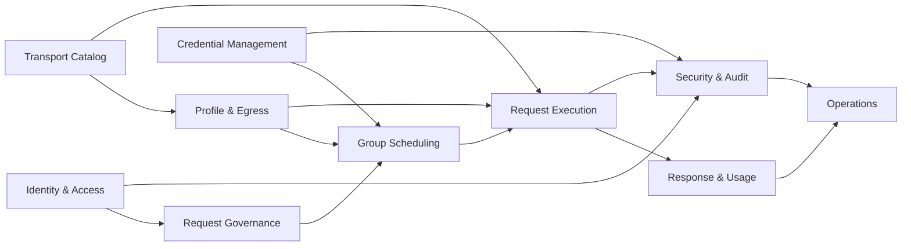
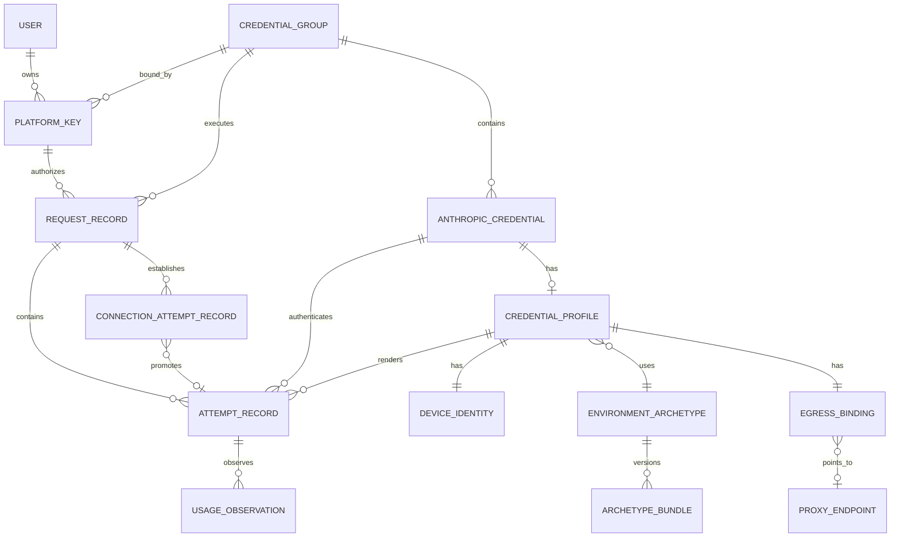

# Claude Code 企业网关领域模型

> 文档状态：详细设计基线  
> 产品基线：[功能模块规划](./functional-modules.md)  
> 技术架构：[技术架构](./technical-architecture.md)  
> 目标版本：首个可交付单实例版本

## 1. 文档目的与决策权威

本文把 18 个功能模块和 Rust 单体架构转换为统一领域语言，冻结以下内容：

- 哪些对象是持久聚合，哪些只是单次请求或进程内运行态；
- 每个状态由谁拥有、允许哪些转换、转换需要哪些前置条件；
- ID、Snapshot、revision、epoch、generation 和 attempt number 分别表达什么；
- Request、Attempt、Credential、Profile、Egress、Usage 和审计记录怎样关联；
- Rust 类型、数据库 Schema、管理 API 和状态机测试必须共同遵守的全局不变量。

决策优先级：

1. [功能模块规划](./functional-modules.md)定义产品语义、默认值和客户端合同。
2. [技术架构](./technical-architecture.md)定义单体组件、运行时所有权、调用方向和资源释放顺序。
3. 本文定义领域对象、命令、事件和状态转换；下游 Schema/API/代码只能细化表达。
4. 若下游实现需要改变 Key/Group/Credential 关系、请求透明性、调度公平性、Profile 身份连续性或重试边界，必须先修订上位文档。

本文刻意排除 SQL DDL、HTTP 字段全集、管理页面布局和 BoringSSL ABI；这些分别进入后续 Schema、API、Transport 设计。示例 Rust 只表达类型约束，不是最终源码。

## 2. 建模原则

### 2.1 聚合只保护自身强不变量

- `PlatformKey`、`CredentialGroup`、`AnthropicCredential`、`CredentialProfile`、`ProxyEndpoint`、`VersionedArtifact`、`RequestAggregate` 是独立聚合根。
- 聚合之间只保存 typed ID、冻结 Snapshot 或受控引用；严禁在一个聚合对象中嵌入整棵其他聚合并跨表隐式保存。
- 单事务只原子修改必须同时成立的事实。跨聚合工作通过 application service、Domain Event 和 transactional outbox 编排。

### 2.2 持久事实与运行态分开

- PostgreSQL 保存身份、配置、密文、状态、冷却、版本、请求记录、Job 和审计等可恢复事实。
- QueueTicket、permit、Lease、Socket、连接池、in-flight Body/SSE、Tokio task 和 DRR cursor 只属于进程内运行态。
- 进程重启后根据持久事实重新建立 owner、Credential 资格和配置 Cache；旧 in-flight 请求结束，平台不推测续接。

### 2.3 单一写者与显式命令

- Group 调度运行态只有对应 `GroupExecutor` 可写；Request 生命周期只有对应 `RequestTask` 可推进。
- Credential 持久更新通过 `CredentialService` 的版本化命令执行；refresh/reauth 对同 Credential singleflight。
- 状态变化来自命令与事实事件，不允许 Repository setter 或 HTTP Handler 直接改字段。

### 2.4 不可变 Snapshot 与 attempt-scoped 身份

- RuleSet、Capability、Enforcement、Price、PLAN Mapping、Background Catalog 和 Bundle 均以不可变版本发布。
- Request 冻结通用 `RequestSnapshotSet`；Attempt 另外冻结所选 Credential 的 token/Profile/Bundle/Egress 版本。
- 跨 Credential 只复用 `GenericAdjustedRequest`，再按新 Credential 重建 `FinalUpstreamRequest`。

### 2.5 显式状态优于布尔组合

`disabled=true + expired=true + refreshing=true` 这类互相冲突的布尔组合禁止成为领域真相。生命周期、认证维护、传输阻断、冷却和发布状态分别使用 enum/子状态，并由 Eligibility Projection 汇总为是否可调度。

### 2.6 时间、重试和释放均可证明

- 持久时间使用 UTC timestamp；运行中 deadline 使用单调时钟。
- 重试区分 ConnectionAttempt 与 Anthropic Messages Attempt。
- permit、Reservation、Lease 和 Buffer owner 都是不可复制的类型化令牌；释放幂等，重复释放形成不变量告警。

### 2.7 Secret 与原始响应是特殊类型

- token、Cookie、代理密码、Session HMAC、Profile seed 和完整 Platform Key 使用 secret wrapper，排除普通 Debug/Serialize/Clone。
- Anthropic Body/SSE 使用 `RawUpstreamBytes`，主链只允许有界缓存、旁路观察和原始写出，严禁以普通 JSON DTO 回写。

## 3. 领域边界与上下文映射

| Bounded Context | 聚合/核心对象 | 权威写者 | 主要上游 | 主要下游 |
|---|---|---|---|---|
| Identity & Access | User、PlatformKey、AccessPolicy | AccessService | 管理面 | DataPlaneRouter、Audit |
| Request Governance | ClientProfile、Capability、RuleSet、Enforcement、Request DTO | PolicyEngine | Active Snapshot Catalog | Group Scheduling |
| Group Scheduling | CredentialGroup、GroupRuntime、Queue、Affinity、Lease | GroupExecutor | Access/Governance | Profile/Transport |
| Credential Management | AnthropicCredential、AuthMaterial、AutoReauthStrategy、PLAN Observation | CredentialService/Maintenance | 管理面、官方授权端点 | Group Scheduling |
| Profile & Egress | CredentialProfile、DeviceIdentity、EgressBinding、ProxyEndpoint | Profile/Egress Service | Bundle Catalog、Proxy Health | ProfileFactory、Transport |
| Transport Catalog | EnvironmentArchetype、ArchetypeBundle、EvidenceSet | Bundle Catalog | Capture Tooling | Transport Engine |
| Request Execution | RequestAggregate、Attempt、ConnectionAttempt、ResourceLedger | RequestTask | Group/Profile | Response/Usage |
| Response & Usage | ResponseDelivery、UsageObservation、CostEstimate | ResponsePipeline/UsageService | Transport events | Request view、Quota Projection |
| Security & Audit | AuditPolicy、ApprovalCase、ContentAuditObject、AuditChain | SecurityService | 全部管理/数据面 | Audit Store、管理员 |
| Operations | DurableJob、OutboxMessage、Notification、Alert | JobRuntime/Notification worker | Domain Events | 外部渠道、控制台 |

18 个功能模块覆盖关系：

| 功能模块 | 主要领域落点 |
|---|---|
| 01 客户端接入与识别 | ClientContext、ClientClass、BaseSessionIdentity |
| 02 客户端凭证与访问控制 | User、PlatformKey、AccessContext |
| 03 统一入口与实例路由 | RequestAggregate、ExecutorBinding、GroupServingState |
| 04 请求解析与标准化 | Raw/Structured/Classified Request |
| 05 请求参数校验 | ValidatedRequest、CapabilitySnapshot |
| 06 通用请求调整与优化 | RuleSet、Enforcement、GenericAdjustedRequest |
| 07 模型与兼容性中心 | ModelDefinition、CapabilityConflictReview、Snapshot |
| 08 规则与配置管理 | VersionedArtifact、ActivePointer、ApprovalCase |
| 09 Anthropic 凭据与分组管理 | CredentialGroup、AnthropicCredential、维护状态 |
| 10 凭据调度与选择 | GroupRuntime、FairQueue、Affinity、CredentialLease |
| 11 凭据身份与请求拟态 | CredentialProfile、DeviceIdentity、Session 派生 |
| 12 Anthropic 上游连接 | EgressBinding、Proxy、Bundle、PoolKey、TransportAttempt |
| 13 错误、超时与重试 | RetryDecision、Attempt、ConnectionAttempt、Deadline |
| 14 Anthropic 响应透明透传 | RawUpstreamResponse、StreamingDelivery、NonStreamBuffer |
| 15 Usage、凭据遥测与可观测性 | UsageObservation、Cost、Quota、Request Projection |
| 16 管理控制台与管理 API | Domain Command、Projection、Approval、导出权限 |
| 17 系统运行、后台任务与在线升级 | DurableJob、Outbox、Bundle lifecycle |
| 18 安全与审计 | SecretRecord、ContentAuditObject、AuditEvent/Chain |

上下文依赖方向：



跨 Context 只传递：

- typed ID 与不可变 Snapshot ID；
- command/result DTO；
- Domain Event；
- 一次性资源句柄；
- 已脱敏的 Projection。

`gateway-domain` 可共享 ID、值对象、enum、事件 envelope 和纯状态机，但不得把某 Context 的 Repository、网络 client 或数据库 row 放进 Shared Kernel。

## 4. 标识、引用、时间与版本语义

### 4.1 Typed ID

每种实体使用独立 newtype，底层首选 UUIDv7；外部可见 ID 加稳定前缀，内部严禁用裸字符串互换：

```rust
UserId            // usr_...
PlatformKeyId     // key_...
GroupId           // grp_...
CredentialId      // cred_...
ProfileId         // prof_...
DeviceIdentityId  // dev_...
EgressBindingId   // egr_...
ProxyId           // prx_...
ArchetypeId       // arch_...
BundleId          // bdl_...
RequestId         // req_...
AttemptId         // att_...
ConnectionAttemptId
LeaseId
JobId
AuditEventId
```

ID 一经分配永不复用。客户端可见 `request_id` 与内部 `RequestId` 表示同一逻辑值；不得回显数据库 sequence、Credential ID 或其他内部拓扑 ID。

### 4.2 六种变化标识

| 类型 | 语义 | 示例 | 比较规则 |
|---|---|---|---|
| `revision` | 可变聚合的乐观锁版本 | PlatformKey revision | 更新必须 `expected_revision == current` |
| `artifact_version` | 不可变配置内容版本 | RuleSet v12 | 新内容创建新记录，旧记录保留 |
| `snapshot_id` | 一组已编译配置的稳定引用 | Capability Snapshot | Request 冻结后保持原引用 |
| `epoch` | 身份/池隔离边界变化 | device/profile/egress epoch | 递增后旧连接键与旧派生结果失效 |
| `token_version` | Credential secret CAS 序号 | access token v9 | 只接受基于当前版本的更新 |
| `generation` | 进程内 owner/令牌世代 | GroupExecutor generation | 重建后拒绝旧世代迟到事件 |

`attempt_no` 和 `connection_attempt_no` 只是某 Request 内的有界序号，不承担版本或并发控制语义。

### 4.3 时间

- 持久化：`created_at`、`updated_at`、`observed_at`、`expires_at`、`cooldown_until`、`retired_at` 使用 UTC。
- Request 接受时同时记录 wall clock 与 monotonic origin；所有请求内 deadline 从单调时钟计算。
- 从数据库恢复的 cooldown 用 UTC 判断是否仍在未来，再转换为本进程 monotonic deadline。
- TTL 值属于冻结配置；已建立的 deadline 不随热加载延长或缩短。

### 4.4 内容地址与算法版本

- Bundle、Snapshot、审计对象、导出和 release evidence 使用 `ContentHash`（算法 + digest）。
- Session 派生记录 `SessionDerivationVersion`。输入、命名空间和稳定性在本文冻结；`UUIDFromDigestV1` 的精确字节截取、UUID version/variant 位和测试向量由 Transport/Profile 详细设计补齐。
- serializer、token estimator、price calculator、traffic classifier 和 PLAN mapper 都必须记录算法版本，历史结果按当时版本解释。

## 5. 核心关系总图



关键基数：

```text
Owner User 1 ── N Platform Key
Platform Key  N ── 1 Credential Group（创建时固定）
Credential Group 1 ── N Anthropic Credential
Credential Group N ── 1 logical owner Executor
Anthropic Credential 1 ── 1 Credential Profile
Credential Profile N ── 1 Environment Archetype
Credential Profile 1 ── 1 Device Identity
Credential Profile 1 ── 1 Egress Binding
Proxy Endpoint 1 ── 0..N Egress Binding（默认最多 5 个 active 绑定）
Request 1 ── 0..3 Anthropic Messages Attempt
Request 1 ── 0..3 ConnectionAttempt（新连接恢复预算）
ConnectionAttempt 0..1 ── 0..1 promoted Attempt
Attempt 1 ── 0..N UsageObservation
```

`PlatformKey.owner_user_id` 与 `PlatformKey.group_id` 都是创建时不可变引用。Credential 显式迁移 Group 时保持 Credential/Profile/Egress 身份连续；Platform Key 不随之迁移。

## 6. Identity & Access 聚合

### 6.1 User Aggregate

```rust
struct User {
    id: UserId,
    username: Username,
    display_name: String,
    email: EmailAddress,
    role: UserRole,
    status: UserStatus,
    password_credential: PasswordCredentialRef,
    mfa: MfaEnrollment,
    revision: Revision,
    created_at: DateTime<Utc>,
    updated_at: DateTime<Utc>,
}

enum UserRole { PlatformAdmin, User }
enum UserStatus { Invited, MfaPending, Active, Disabled, Locked, Archived }
```

状态转换：

```text
普通创建: invited → active（修改临时密码 + 绑定 TOTP）
初始管理员: mfa_pending → active（修改初始密码 + 绑定 TOTP）
active ↔ disabled
active/disabled → locked → active（管理员解锁）
invited/mfa_pending/active/disabled/locked → archived（终态）
```

User 是平台人员身份，不等于 Anthropic account。首版没有应用主体或 viewer 角色，也没有用户自助注册。

首次启动且数据库没有任何 User 时，Bootstrap service 从必需的 `GATEWAY_BOOTSTRAP_ADMIN_USERNAME`、`GATEWAY_BOOTSTRAP_ADMIN_PASSWORD` 与可选显示字段创建唯一 PlatformAdmin，初始状态 MfaPending。缺少任一必需值时应用保持 not-ready，不生成或输出随机密码。数据库已有 User 后，后续启动永久忽略 `GATEWAY_BOOTSTRAP_ADMIN_*`，环境值不会重置账号。

### 6.2 PlatformKey Aggregate

```rust
struct PlatformKey {
    id: PlatformKeyId,
    owner_user_id: UserId,       // immutable
    group_id: GroupId,           // immutable
    name: KeyName,
    secret: PlatformKeySecretRecord,
    status: PlatformKeyStatus,
    expires_at: Option<DateTime<Utc>>,
    endpoint_permissions: EndpointPermissionSet,
    model_scope: ModelScope,
    ruleset_snapshot_id: Option<SnapshotId>,
    body_limit: ByteLimit,
    messages_rate: TokenBucketConfig,
    models_rate: TokenBucketConfig,
    concurrency_limit: NonZeroU32,
    concurrency_retry_after: Duration,
    ip_allowlist: IpAllowlist,
    requested_content_audit: ContentAuditMode,
    revision: Revision,
}

enum PlatformKeyStatus { Active, Disabled, Expired, Revoked }
```

`PlatformKeySecretRecord` 包含：

- `lookup_digest`：日常认证用 keyed digest；
- `ciphertext`：受控再次展示完整 secret；
- `display_prefix`：列表掩码；
- `key_version` 与 `key_provider_ref`；
- `created_at`、最近 reveal 审计引用。

状态转换：

```text
active ↔ disabled
active/disabled → expired（expires_at 到期）
expired → active（管理员设置新的未来 expires_at）
active/disabled/expired → revoked（终态）
```

Key 没有原位 secret 轮换状态机。换 secret 时创建新 Key、迁移客户端，再禁用或吊销旧 Key。

### 6.3 ManagementSession 与 purpose-scoped StepUpGrant

```rust
struct StepUpGrant {
    id: StepUpGrantId,
    session_id: ManagementSessionId,
    user_id: UserId,
    purpose: StepUpPurpose,
    auth_context_digest: Digest,
    verified_at: DateTime<Utc>,
    expires_at: DateTime<Utc>,
    consumed_at: Option<DateTime<Utc>>,
}
```

Step-up 不作为 Session 上的通用布尔值：每个高风险 command 必须声明 purpose，并验证同一用户、同一 Session、purpose 匹配、认证上下文未变化且 grant 未过期。Secret reveal 等一次性动作消费 grant；同一风险域允许短时复用的动作仍记录每次使用。不同 purpose 之间不互认。

### 6.4 AccessContext

成功鉴权形成不可变值对象：

```rust
struct AccessContext {
    request_id: RequestId,
    user_id: UserId,
    key_id: PlatformKeyId,
    group_id: GroupId,
    key_revision: Revision,
    endpoint_permissions: EndpointPermissionSet,
    effective_model_scope: ModelScope,
    effective_body_limit: ByteLimit,
    effective_content_audit: EffectiveContentAuditMode,
}
```

原始 Platform Key secret 在形成 AccessContext 后离开请求对象。`owner_user_id` 与 `group_id` 创建后保持固定；变更所属用户或 Group 必须创建新 Key。Key 上排除客户端类别字段，客户端准入只由 Group 管理。

### 6.5 聚合不变量

1. `owner_user_id` 和 `group_id` 在所有 update command 中都是只读字段。
2. `Revoked` 没有恢复边；`Archived` User 没有登录或新建 Key 权限。
3. 默认 Key：Messages 60 RPM/burst 10、并发 5；Models 使用独立 60 RPM/burst 10。
4. `full_encrypted` 的生效值必须同时满足 Group 边界和有效双人审批。
5. reveal 需要 owner/admin 权限、step-up MFA、用途和 AuditEvent；响应带 `no-store`。

## 7. Credential Group 聚合

### 7.1 持久聚合

```rust
struct CredentialGroup {
    id: GroupId,
    name: GroupName,
    status: GroupStatus,
    owner_binding: ExecutorBinding,
    accepted_client_classes: NonEmptySet<ClientClass>,
    model_scope: ModelScope,
    authentication_pool_policy: AuthenticationPoolPolicy,
    fully_managed_required: bool,
    egress_policy: GroupEgressPolicy,
    limits: GroupLimits,
    queue_policy: QueuePolicy,
    session_capacity: SessionCapacityPolicy,
    retry_policy: RetryPolicy,
    timeout_policy: TimeoutPolicy,
    enforcement_snapshot_id: SnapshotId,
    ruleset_snapshot_id: SnapshotId,
    capability_snapshot_id: SnapshotId,
    content_audit_policy: GroupContentAuditPolicy,
    token_estimate_policy: TokenEstimatePolicy,
    revision: Revision,
}

enum GroupStatus { Active, Disabled, Archived }
```

Credential 成员关系以 `AnthropicCredential.group_id` 为权威，Group 不内嵌无限增长的 Credential 列表；`GroupMembershipIndex` 是查询 Projection。

### 7.2 核心策略值对象

```rust
enum ClientClass { ClaudeCodeCli, NonClaudeCodeCli }
enum ModelScope { AllPublished, Allowlist(NonEmptySet<ModelId>) }
enum GroupEgressPolicy { Auto, ProxyRequired, Direct }
enum GroupContentAuditPolicy { Allow, Require, Forbid }

struct GroupLimits {
    concurrency: Option<NonZeroU32>, // None = unlimited
    messages_rate: Option<TokenBucketConfig>,
    credential_default_concurrency: NonZeroU32, // default 5
    credential_default_rpm: NonZeroU32,         // default 60
}

struct QueuePolicy {
    capacity: QueueCapacityRule,   // default <= 2 × effective concurrency
    pre_upstream_timeout: Duration, // default 30s
    full_retry_after: Duration,     // default 2s
    wait_timeout_retry_after: Duration, // default 5s
}
```

`AuthenticationPoolPolicy` 默认同一认证大类；显式 mixed 时 Subscription OAuth/Setup 为主池，Console API Key fallback 默认关闭。PLAN 不属于该策略的权重输入。

```rust
struct SessionCapacityPolicy {
    enabled: bool,                         // default false
    max_active_sessions: Option<NonZeroU32>,
    idle_ttl: Duration,                    // default 30m
    slot_queue_timeout: Duration,          // default 5s
    affinity_ttl: Duration,                // default 24h
}

struct RetryPolicy {
    max_messages_attempts: u8,             // fixed default 3
    max_connection_attempts: u8,           // fixed default 3 per Request
    preferred_wait: Duration,               // default 2s
    min_retry_budget: Duration,             // default 5s
    cancel_grace: Duration,                 // default 2s
}

struct TimeoutPolicy {
    upstream_connect: Duration,             // default 5s, range 1..30s
    upstream_non_stream_total: Duration,    // default 300s
    upstream_stream_idle: Duration,         // default 30s, range 5..600s
    client_write_idle: Duration,            // default 120s
    client_write_total_non_stream: Duration,// default 300s
}

struct TokenEstimatePolicy {
    mode: TokenEstimateMode,                // default local_estimate
    console_api_key_ref: Option<ConsoleCountKeyRef>,
    internal_rate: TokenBucketConfig,       // default 60 RPM
    local_fallback: bool,
}
```

`enabled=false` 时 max_active_sessions 必须为空；`enabled=true` 时必须为正数。流式 upstream idle 始终存在，不接受 disabled 值。

### 7.3 生命周期与 serving 状态

持久生命周期：

```text
active ↔ disabled
active/disabled → archived（终态）
```

运行时另有 `GroupServingState`：

```rust
enum GroupServingState {
    Loading { generation: Generation },
    Serving { generation: Generation },
    Draining { generation: Generation, deadline: Instant },
    OwnerUnavailable { generation: Generation },
}
```

- Group disabled：拒绝新请求，结束尚未取得 Lease 的队列项，已开始请求继续，Credential 自动维护继续。
- Group archived：保留历史，不再恢复服务。
- owner drain/unavailable 不篡改持久 GroupStatus；客户端只看到对应通用管理/服务错误。

### 7.4 owner Executor 绑定

`ExecutorBinding` 记录逻辑 partition ID 与持久 revision，不记录 Tokio task handle。首版所有 owner 位于同一进程；`ExecutorRegistry` 将 Active Group 映射到一个 `GroupExecutorGeneration`。

同一 `GroupId` 在同一时刻最多一个 Serving generation。重建 generation 后，旧 generation 的 grant/release/cooldown 消息必须被拒绝并记录。

### 7.5 聚合不变量

1. `accepted_client_classes` 至少一项，且只含两种已定义类别。
2. Credential override 可收紧模型、容量和能力，严禁放宽 Group Enforcement。
3. `fully_managed_required=true` 时，非 Fully Managed Credential 没有 Active 资格。
4. `strip_all` 与要求 System Attribution 的 Credential 互斥。
5. `GroupStatus::Archived` 为终态；Group 归档前必须完成显式排空。

## 8. Credential Enrollment 与 Anthropic Credential 聚合

### 8.1 CredentialEnrollment 过程聚合

```rust
struct CredentialEnrollment {
    id: EnrollmentId,
    mode: EnrollmentMode, // Create | Recover
    target_group_id: GroupId,
    auth_method: EnrollmentAuthMethod,
    pending_credential_id: Option<CredentialId>,
    recovery_credential_id: Option<CredentialId>,
    expected_credential_revision: Option<Revision>,
    state: EnrollmentState,
    next_action: EnrollmentNextAction,
    egress_snapshot: Option<EgressBindingSnapshot>,
    pkce_state_digest: Option<KeyedDigest>,
    pkce_verifier_secret_id: Option<SecretId>,
    callback_nonce_digest: Option<KeyedDigest>,
    identified_account_uuid: Option<AnthropicAccountUuid>,
    material_secret_refs: Vec<SecretId>,
    attempt_count: u32,
    expires_at: DateTime<Utc>,
    revision: Revision,
}
```

状态固定为 `created → resolving_egress → awaiting_user_action → exchanging_material → verifying_account → deduplicating → provisioning_identity → configuring_reauth → activation_check → succeeded`；任一非终态可进入 `cancelled|expired|failed`，Recover 流程另含 `recovering_existing`。`next_action` 是闭集，且回调、PKCE、Setup/Existing material 与临时 Browser context 在终态销毁。

普通 Create 必须先验证得到 `account_uuid`，再做全平台去重；命中时返回 409 并清理 pending 对象。Recover 只允许指向原 Credential，验证同一账号后以 revision/token-version CAS 更新；账号不一致时丢弃候选材料。Enrollment 是短期过程聚合，AnthropicCredential 才是长期账号身份。

### 8.2 AnthropicCredential 聚合结构

```rust
struct AnthropicCredential {
    id: CredentialId,
    group_id: GroupId,
    account_uuid: Option<AnthropicAccountUuid>,
    purpose: CredentialPurpose,
    auth: CredentialAuth,
    lifecycle: CredentialLifecycle,
    attachment: GroupAttachmentState,
    auth_state: CredentialAuthState,
    capacity_state: CredentialCapacityState,
    transport_state: CredentialTransportState,
    management_class: CredentialManagementClass,
    profile_id: Option<ProfileId>,
    egress_binding_id: Option<EgressBindingId>,
    scheduling: CredentialSchedulingPolicy,
    plan_state: SubscriptionPlanState,
    token_version: TokenVersion,
    revision: Revision,
}

enum CredentialAuth {
    OAuthSubscription(OAuthSecretRef),
    SetupTokenSubscription(SubscriptionTokenMaterialRef),
    ConsoleApiKey(ConsoleApiKeySecretRef),
}

enum CredentialPurpose { Business, VerificationOnly }
```

```rust
struct CredentialSchedulingPolicy {
    priority: i32,
    weight: PositiveWeight,
    max_concurrent_requests: NonZeroU32,
    messages_rate: TokenBucketConfig,
    model_scope_override: Option<ModelScope>,
    supports_thinking: CapabilityOverride,
    supports_cache: CapabilityOverride,
    system_attribution_requirement: AttributionRequirement,
    session_capacity_override: Option<SessionCapacityPolicy>,
}

enum AttributionRequirement { Optional, Required }
```

Credential override 只能收紧 Group 范围；默认并发 5、Messages RPM 60。

订阅 OAuth/Setup 是主类型；Console API Key 是兼容业务类型，也可作为内部 Count Tokens 的独立配置，但两者的身份、usage 和调度域分开。

Setup Token 原文只属于 Enrollment bootstrap，交换终态后销毁。交换出的 access/refresh material 进入 `SetupTokenSubscription` 自身的 token-version 生命周期，并可复用 OAuth 的 refresh/CAS 执行机制；auth kind 只有通过显式、同账号的认证迁移 command 才改变。

### 8.3 正交状态

为避免互斥布尔，Credential 使用五个正交子状态，再投影成管理 UI 的规范标签。

```rust
enum CredentialLifecycle {
    PendingVerify,
    PendingProfile,
    PendingEgress,
    PendingReauthStrategy,
    Active,
    Disabled,
    Revoked,
    Archived,
}

enum GroupAttachmentState {
    Attached,
    Draining { target: GroupId, deadline: DateTime<Utc> },
    Detached { previous: GroupId, target: GroupId },
    Attaching { target: GroupId },
}

enum CredentialAuthState {
    Healthy,
    Expiring,
    Refreshing,
    ReauthRetrying { next_at: DateTime<Utc> },
    ReauthWaitingEgress { next_at: DateTime<Utc> },
    ManualRecoveryRequired,
    NeedsAdminReauth,
    AuthBroken,
}

enum CredentialCapacityState {
    Available,
    Limited { reason: LimitReason },
    Cooldown { until: DateTime<Utc>, source: CooldownSource },
    HalfOpen { probe_budget: NonZeroU8 },
}

enum CredentialTransportState {
    Ready,
    Unavailable { blockers: NonEmptySet<TransportBlocker> },
}
```

Canonical status projection 按 `Archived/Revoked/Disabled → pending → attachment → auth → transport → capacity → Active` 的优先级输出产品状态名。调度资格不依赖一段状态字符串，而由所有子状态和当前 Group/Profile/Egress/Bundle 条件共同计算。

### 8.4 创建与激活

```text
pending_verify
→ account_uuid verified + global dedupe
→ pending_profile
→ pending_egress
→ pending_reauth_strategy（仅 Group 要求且策略未健康）
→ active
```

激活前置条件：

1. 认证材料已验证并得到 `account_uuid`（Console API Key 保存稳定账号/组织标识能力允许的结果）；
2. 全平台同 account UUID 没有另一 Credential；
3. 目标 Group 可接纳认证类型和管理等级；
4. 一对一 Profile、Device Identity 和 Egress Binding 已建立；
5. Archetype Bundle 可由当前 Linux Engine 执行；
6. auth、transport、capacity 子状态允许新调度。

持久生命周期转换：

```text
pending_* → active
active ↔ disabled
pending_*/active/disabled → revoked
disabled/revoked → archived（终态）
```

Revoked 不回到 Active；需要继续使用同账号时由管理员按既定恢复/新增规则处理。

### 8.5 Group 迁移

```text
attached(active)
→ draining
→ detached
→ attaching(target)
→ attached(active)
```

默认 drain 最长 5 分钟。迁移事务更新 Credential.group_id、attachment、审计和 outbox；成功后清理旧 Group affinity。Credential ID、account UUID、Profile、Device Identity、Session secret、Egress Binding、quota 历史和 usage 保留。失败时按迁移 checkpoint 回滚原 Group。

### 8.6 管理等级与全局去重

```rust
enum CredentialManagementClass {
    FullyManaged { active_strategy_ids: NonEmptySet<ReauthStrategyId> },
    NonManaged,
}
```

`account_uuid` 建立全局唯一约束，覆盖所有 Group 和所有非临时删除状态。正常重复创建返回 409。只有现有对象处于 `ManualRecoveryRequired` 且从该对象恢复入口发起时，才将账号添加流程转换为恢复原 Credential。

### 8.7 聚合不变量

1. 一个 Credential 同时只属于一个 Group，并且恰好指向一个 Profile 与一个 Egress Binding 后才可 Active。
2. token 更新必须 compare-and-swap `token_version`，新 token 的 account UUID 必须与原值相同。
3. 网络/Proxy/Bundle 故障只更新 transport blocker，保持认证健康原值。
4. Revoked/Archived 没有调度资格；Archived 为终态。
5. Active Credential 的 Profile、Device 和 Egress 引用禁止在普通请求或 refresh 中替换。

## 9. Credential Profile 聚合

### 9.1 聚合结构

```rust
struct CredentialProfile {
    id: ProfileId,
    credential_id: CredentialId, // globally unique
    archetype_ref: ArchetypeRef,
    device_identity: DeviceIdentity,
    egress_binding_id: EgressBindingId,
    lifecycle: ProfileLifecycle,
    profile_epoch: ProfileEpoch,
    revision: Revision,
}

struct DeviceIdentity {
    id: DeviceIdentityId,
    device_epoch: DeviceEpoch,
    installation_id: Secret<DeviceId>,
    client_id: Secret<ClientId>,
    profile_seed: Secret<ProfileSeed>,
    session_hmac_key: Secret<SessionHmacKey>,
    created_at: DateTime<Utc>,
}

enum ProfileLifecycle { Pending, Active, Upgrading, Disabled }
```

Profile 是 Archetype 类别、唯一 Device 实例、Egress 引用和生命周期的聚合；Platform Key、Client Profile 和 Group 均不拥有它。

### 9.2 Profile epoch 与字段连续性

| 操作 | profile_epoch | device_epoch | Archetype | Device secret | Egress/epoch |
|---|---:|---:|---|---|---|
| access token refresh | 保持 | 保持 | 保持 | 保持 | 保持 |
| 同账号 reauth | 保持 | 保持 | 保持 | 保持 | 保持 |
| Group/owner 迁移 | 保持 | 保持 | 保持 | 保持 | 保持 |
| 显式 Archetype cohort 升级 | +1 | 保持 | 替换为已批准版本 | 保持 | 保持 |
| 显式 Egress rebind | +1 | 保持 | 保持 | 保持 | egress_epoch +1 |
| 高风险 Device rebuild | +1 | +1 | 默认保持 | 全部重建 | 保持 |
| 不同 Anthropic 账号 | 新 Profile | 新 Device | 重新分配 | 全新 | 新 Binding |

任何 epoch 递增都使旧完整 Pool Key 失效。旧连接进入 drain/evict，后续 Attempt 只读取新 epoch。

### 9.3 Session 派生

```text
input namespace =
  SessionDerivationVersion
  + CredentialId
  + PlatformKeyId
  + normalized BaseSessionId
  + field purpose

digest = HMAC(session_hmac_key, namespace)
upstream_session_id = ArchetypeRenderer(digest)
```

AgentId 不进入上游 Session UUID 派生：同一 Base Session 的 main 与 subagent 共享一个稳定的上游 Session 身份；AgentId 只参与公平队列、短期 affinity 和内部观测。匿名 Base Session 仅由 `(PlatformKeyId, ClientClass)` 建立 30 分钟复用键，不引入 IP、连接、RequestId、prompt 或随机值。

- renderer 的格式、字符集、长度、UUID 位和字段位置来自 verified Archetype；
- 同 Credential、Key、Base Session 在同一 derivation version 下稳定；AgentId 不改变该结果；
- 不同 Credential 因密钥不同得到隔离结果；
- affinity 的 model 维度不自动进入上游 Session ID；如真实证据要求，再由新 derivation version 显式引入。

### 9.4 Archetype 分配与升级

- 新 Credential 从兼容、有容量且 Active 的 Archetype 中确定性加权分配，记录 cohort 和分配依据。
- 新模板默认只作用于新 Credential。
- 存量 Profile 通过显式 cohort 迁移；迁移先建 candidate、跑兼容检查，再原子切 active ArchetypeRef 并递增 profile epoch。
- 同一 OS/runtime/Claude Code 版本可能存在多个稳定 capture cohort；ArchetypeRef 必须包含 cohort，不只按表面版本匹配。

### 9.5 聚合不变量

1. `credential_id`、DeviceIdentityId、installation/client ID、profile seed 和 Session HMAC 在 active Profile 中一对一唯一。
2. Archetype 可被多个 Profile 引用，DeviceIdentity 实例严禁复用。
3. `ProfileLifecycle::Active` 要求 Archetype Bundle 可执行且 Egress Binding active。
4. `strip_all` 生效时 ProfileFactory 抑制 System Attribution；Profile 权限低于 Group Enforcement。
5. Device rebuild 是独立高风险 command，必须清除相关 affinity 并审计。

## 10. Egress 与 Proxy 聚合

### 10.1 ProxyEndpoint Aggregate

```rust
struct ProxyEndpoint {
    id: ProxyId,
    kind: ProxyKind,
    address: HostPort,
    credential_ref: Option<ProxyCredentialSecretRef>,
    lifecycle: ProxyLifecycle,
    health: ProxyHealth,
    stability: EgressStability,
    expected_exit_ip: Option<IpAddr>,
    observed_exit_ip: Option<IpAddr>,
    max_credential_bindings: NonZeroU32, // default 5
    revision: Revision,
}

enum ProxyKind { HttpConnect, Socks5 }
enum ProxyLifecycle { Active, Draining { deadline: DateTime<Utc> }, Disabled, Archived }
enum ProxyHealth {
    Unknown,
    Probing,
    Healthy,
    UnhealthyDns,
    UnhealthyConnect,
    UnhealthyAuth,
    UnhealthyTunnel,
    UnhealthyTlsPassthrough,
}
enum EgressStability { Static, Dynamic }
```

创建/修改后必须完成 DNS、TCP、认证、CONNECT/SOCKS5、TLS pass-through、ALPN 和出口观察。健康检查成功才能参与新绑定。代理凭证支持覆盖更新，管理面只显示掩码。

### 10.2 CredentialEgressBinding Aggregate

```rust
struct CredentialEgressBinding {
    id: EgressBindingId,
    credential_id: CredentialId, // unique
    mode: EgressMode,
    proxy_id: Option<ProxyId>,
    stability: EgressStability,
    lifecycle: EgressBindingLifecycle,
    observed_exit: ExitObservation,
    egress_epoch: EgressEpoch,
    revision: Revision,
}

enum EgressMode { Direct, Proxy }
enum EgressBindingLifecycle { Pending, Active, TransportUnavailable, Rebinding }
```

Group 的 `auto|proxy_required|direct` 只在创建或显式 rebind command 中解析：

- `auto`：有健康代理容量则绑定最少者，否则创建 direct Binding；
- `proxy_required`：无容量时保持 pending；
- `direct`：直接创建服务器出口 Binding。

解析后，Binding 只保存 `Direct|Proxy`，运行请求无需再次解释 Group mode。

### 10.3 漂移与重绑

- static proxy 出口与 expected 值不一致：Binding/Credential 进入 transport unavailable，等待管理员确认或 rebind。
- dynamic proxy/direct 出口变化：记录 observation，不暂停调度。
- proxy A → B、proxy ↔ direct：必须执行 `RebindCredentialEgress`，递增 egress epoch 与 profile epoch、逐出旧 Pool Key、写审计。
- proxy 临时故障只产生 blocker，不自动切 direct 或其他 proxy。

### 10.4 Proxy 排空

```text
active → draining → disabled
disabled + zero binding → archived（终态）
```

进入 draining 后停止新绑定，现有绑定停止接收新请求，已开始请求继续到默认 5 分钟 deadline。结束后相关 Credential 为 transport unavailable。Disabled Proxy 更新配置并完成连续两次全路径健康检查后，可由管理员重新进入 Active。只有解除全部 active/pending Binding 后才可进入 Archived；归档清除认证 secret、保留历史摘要，并且没有恢复边。

### 10.5 聚合不变量

1. 每个 Credential 恰好一个 Binding；多个 Binding 可指向同一 Proxy。
2. active Proxy 的绑定数不超过 `max_credential_bindings`，默认 5。
3. 首版没有 Proxy 总请求并发/RPM；各 Key/Group/Credential 限制仍为容量边界。
4. Proxy 必须 TLS pass-through；证书替换或 TLS 终止首次确认即隔离。
5. Egress secret、出口历史和 proxy 地址禁止进入客户端错误。
6. `ProxyLifecycle::Archived` 为终态，且 active/pending Binding 数必须为零。

## 11. Client、Session、Agent 与 Affinity

### 11.1 ClientContext

```rust
struct ClientContext {
    class: ClientClass,
    classifier_version: VersionId,
    evidence: ClientEvidenceSummary,
    original_user_agent: Option<SensitiveHeaderValue>,
    client_request_id: Option<ClientRequestId>,
    base_session: BaseSessionIdentity,
    agent_id: AgentId,
    peer: TrustedPeerContext,
}
```

ClientClass 只取 `ClaudeCodeCli|NonClaudeCodeCli`。分类基于 UA、Session/Agent Header、X-App/Stainless、Anthropic Version/Beta、Metadata 和 System Attribution 等组合结构证据；证据不足落入 NonClaudeCodeCli。客户端自报类型不是权威字段。

原客户端 UA/来源只供内部诊断，FinalUpstreamRequest 使用 Credential Profile 的身份。

### 11.2 Base Session 归一化

```rust
enum BaseSessionIdentity {
    Explicit { id: BaseSessionId, source: SessionSignalSource },
    Anonymous { id: AnonymousBaseSessionId },
}
```

提取优先级：

1. `X-Claude-Code-Session-Id`；
2. 新版 `metadata.user_id.session_id`；
3. legacy `_session_<UUID>`；
4. 缺失时按 `PlatformKeyId + ClientClass` 建立可复用 Anonymous Base Session。

来源 IP、Prompt 文本、请求时间和随机 RequestId 不参与 Session 猜测。原 Session 值经规范化、长度校验和 keyed digest 后用于内部键，明文不进入指标 label。

### 11.3 Agent

Agent ID 从已验证 Agent 信号提取；缺失时使用稳定 `main`。一个 main 加九个 subagent 形成一个 Base Session、十个 Agent/请求调度单元。平台默认没有单 Session 并发上限。

```rust
struct AgentKey {
    key_id: PlatformKeyId,
    base_session_id: StableSessionKey,
    agent_id: AgentId,
    model_id: ModelId,
}
```

### 11.4 AffinityEntry

`AffinityEntry` 是 GroupExecutor 内存状态，不是强持久聚合：

```rust
struct AffinityEntry {
    key: AgentKey,
    preferred_credential_id: CredentialId,
    status: AffinityStatus,
    established_at: Instant,
    last_used_at: Instant,
    expires_at: Instant, // default 24h
}

enum AffinityStatus { Preferred, SpilloverObserved, MigrationPending, Migrated }
```

- preferred Credential 仅因并发满时短等默认 2 秒；随后可移植请求 spill。
- 单次 spill、短 429 或普通均衡只记录 observation，保持 preferred 原值。
- 持久故障/长配额窗口且新 Credential 成功承载后，原子迁移 preferred。
- Credential 恢复后不自动抢回。
- 进程重启可丢失热 affinity；Request/Attempt 历史仍保留，新的 affinity 从真实请求重新建立。

### 11.5 SessionActivity 与可选槽位

```rust
struct SessionSlotKey {
    credential_id: CredentialId,
    key_id: PlatformKeyId,
    base_session_id: StableSessionKey,
}

struct SessionActivity {
    active_request_count: u32,
    slot_state: SessionSlotState,
    idle_release_at: Option<Instant>,
}

enum SessionSlotState { Disabled, Acquired, IdleCountdown, Released }
```

槽功能默认关闭。启用后，同一 Base Session 的 main/subagent 在同一 Credential 上共用一个槽；若不同 Agent spill 到多个 Credential，会在实际使用的每个 Credential 各占一个槽。活跃计数归零后等待 30 分钟释放，affinity 历史仍按 24 小时保留。新 Session 等槽最多 5 秒。

## 12. 模型、规则与版本化配置

### 12.1 通用不可变制品

```rust
struct VersionedArtifact<T> {
    id: ArtifactId,
    scope: ArtifactScope,
    version: ArtifactVersion,
    content_hash: ContentHash,
    lifecycle: ArtifactLifecycle,
    payload: T,
    evidence: EvidenceRefs,
    created_by: ActorId,
    created_at: DateTime<Utc>,
}

enum ArtifactLifecycle {
    Draft,
    Validating,
    Eligible,
    Shadow,
    Canary,
    Active,
    Retired,
    Quarantined,
}
```

每个 `(artifact_kind, scope)` 只有一个 ActivePointer。Artifact 内容永不原地更新；发布、回滚和 cohort 切换只更换指针。Quarantined 版本没有新请求引用资格。

### 12.2 Artifact 类型

- `ClientProfileVersion`
- `CapabilitySnapshot`
- `RuleSetSnapshot`
- `GroupEnforcementSnapshot`
- `BackgroundCatalogVersion`
- `PriceSnapshot`
- `PlanMappingSnapshot`
- `NotificationPolicyVersion`
- `ArchetypeBundle`（生命周期另有 verified 证据要求）

### 12.3 Model Catalog

```rust
struct ModelDefinition {
    id: ModelId,
    lifecycle: ModelLifecycle,
    capability_snapshot_id: SnapshotId,
    price_snapshot_id: SnapshotId,
    observed_sources: EvidenceRefs,
}

enum ModelLifecycle { Discovered, Reviewing, Published, Deprecated, Disabled }
```

状态转换为 `Discovered → Reviewing → Published|Disabled`；官方弃用使 Published 进入 Deprecated，官方目录消失或确认失效使 Published 进入 Disabled。只有 Published 进入 `/v1/models` 可调用集合。因消失而 Disabled 的模型重新出现后只能重新进入 Reviewing 并由管理员发布；Deprecated 没有直接恢复边。模型 ID 不做自动重写或 fallback。

Capability 字段规则使用：

```rust
enum FieldAction { Required, Allowed, Forbidden }
struct ConditionalFieldRule { path: JsonPointer, action: FieldAction, when: Predicate }
```

新模型字段通过数据化规则扩展，而不是累积 `if model == ...` 分支。来源冲突产生 `CapabilityConflictReview`，管理员决策后生成新 Snapshot。

被动验证从真实业务成功/错误响应提取脱敏证据。主动验证默认关闭，只由 PlatformAdmin 手工发起，并选择 `CredentialPurpose::VerificationOnly` 的专用 Credential 和已审核模板；它退出普通业务调度/affinity，但仍消耗自身并发、RPM、订阅额度并记录 Usage/Cost。验证结果只生成 Evidence/Conflict Review，不直接切换 Active Snapshot。

### 12.4 Group Enforcement 与流量目录

```rust
struct GroupEnforcementPolicy {
    system_policy: SystemPolicy,
    explicit_probe_action: TrafficAction,
    explicit_background_action: TrafficAction,
    strict_failure_mode: StrictFailureMode,
}

enum SystemPolicy {
    Preserve,
    StripClient,
    Replace { template_snapshot_id: SnapshotId },
    StripAll,
}
enum TrafficAction { Observe, Throttle(TrafficRatePolicy), Reject }
```

- Explicit Probe throttle 使用独立每 `(PlatformKey, ProbeTemplate)` 2 RPM/burst 2 与 Group 30 RPM/burst 10；发生在 Key concurrency 前。
- Explicit Background 默认 Observe；throttle 使用独立每 `(PlatformKey, BackgroundTemplate)` 5 RPM/burst 5 与 Group 60 RPM/burst 20，之后仍进入正常 Key/Group 调度。
- Suspected Probe/Background 永远只观察。
- 平台不为 Messages probe 伪造 Anthropic 成功响应。

`BackgroundCatalogVersion` 保存已审核模板、显式标记规则、稳定结构特征和 classifier version。短文本只是一项观察信号，不得单独触发干预。

### 12.5 请求生效配置

```rust
struct RequestSnapshotSet {
    access_policy_version: VersionId,
    group_config_version: VersionId,
    client_profile_version: VersionId,
    capability_snapshot_id: SnapshotId,
    ruleset_snapshot_id: SnapshotId,
    enforcement_snapshot_id: SnapshotId,
    background_catalog_version: VersionId,
    price_snapshot_id: SnapshotId,
}
```

合并顺序：平台硬边界 → Group Enforcement → Group RuleSet → Key RuleSet/Client compatibility → 最终 Enforcement 复核。下层只能在允许范围内调整，`strip_all` 等强制结果不得被 Profile 恢复。

### 12.6 发布不变量

1. Request 冻结后，其 SnapshotSet 在所有 retry 中保持原值。
2. 发布需要 schema/semantic validation 与 compile；失败时 ActivePointer 保留旧值。
3. runtime conflict 隔离当前 Snapshot、回滚指针；触发请求按平台错误结束，不在请求内换版本。
4. Price Snapshot 按 Request 接受时冻结，历史金额不追溯重算；PLAN Mapping 是例外，只重算展示归一化值并保留 raw。

## 13. 请求对象演进

### 13.1 类型流水线

```text
RawRequestEnvelope
→ AuthenticatedEnvelope
→ StructuredRequest
→ ClassifiedRequest
→ ValidatedRequest
→ GenericAdjustedRequest
→ FinalUpstreamRequest(attempt scoped)
→ RawUpstreamResponse
```

| 类型 | 必要内容 | 允许的下一步 | 禁止内容/行为 |
|---|---|---|---|
| RawRequestEnvelope | Method、path、有序 Header、受限 Body、peer、cancel token | route/auth/body read | 上游 Credential |
| AuthenticatedEnvelope | AccessContext、Key/Group、request ID | parse/classify | 原 Platform Key secret |
| StructuredRequest | Messages DTO、未知字段树、原始 Body handle | capability validation | Profile 字段 |
| ClassifiedRequest | ClientClass、TrafficClass、Session/Agent | Key/probe gates | 根据短 Prompt 直接认定 probe |
| ValidatedRequest | model、stream、diagnostics、SnapshotSet | Generic policy | Credential/Egress 选择 |
| GenericAdjustedRequest | 冻结业务语义、可移植性、确定性字节 | 每次 attempt 的 ProfileFactory | token/device/session secret |
| FinalUpstreamRequest | 当前 Credential 认证、Profile、Session、Transport requirements | 只执行当前 Attempt | 跨 Credential 复用 |
| RawUpstreamResponse | status、有序 Header、原始 Body/SSE byte stream | Header policy + raw relay/buffer | 主链 JSON/SSE 重序列化 |

### 13.2 Body 表示

```rust
enum ReplayableRequestBody {
    Original(Arc<SensitiveBytes>),
    DeterministicJson {
        bytes: Arc<SensitiveBytes>,
        serializer_version: VersionId,
        mutation_audit: Arc<[MutationRecord]>,
    },
}
```

无通用调整时优先保留原始业务 Body；发生调整后用版本固定的确定性 serializer 生成。请求 Body 只驻留内存，严禁落入普通临时目录、日志或 Transport Bundle。

### 13.3 Traffic 与 Portability

```rust
enum TrafficClass { Normal, ExplicitProbe, SuspectedProbe, InternalUpstreamProbe,
                    ExplicitBackground, SuspectedBackground }

enum RequestPortability {
    Portable,
    Pinned { credential_id: CredentialId, reason: PinReason },
}
```

普通自包含 Messages 默认 Portable。continuation、文件/容器 ID、账号级资源和未知扩展为 Pinned。Portability 是校验结果，不由调度器临时猜测。

### 13.4 FinalUpstreamRequest 身份封装

FinalUpstreamRequest 必须携带 `AttemptIdentitySnapshot`：Credential ID、token version、Profile/device/profile epoch、Archetype/Bundle、Egress/epoch、Session derivation version。Transport 仅使用该冻结对象，不反查业务数据库。

## 14. Request Aggregate 与状态机

### 14.1 聚合结构

```rust
struct RequestAggregate {
    id: RequestId,
    user_id: UserId,
    key_id: PlatformKeyId,
    group_id: GroupId,
    client: ClientSummary,
    accepted_at: DateTime<Utc>,
    response_mode: ResponseMode,
    phase: RequestPhase,
    commit_state: ClientCommitState,
    snapshots: Option<RequestSnapshotSet>,
    portability: Option<RequestPortability>,
    resource_ledger: ResourceLedger,
    attempts: Vec<AttemptId>,
    terminal: Option<RequestTerminal>,
    revision: Revision,
}

enum ResponseMode { Stream, NonStream }
```

RequestAggregate 的持久 Projection 是 `RequestRecord`；活跃聚合由 RequestTask 单写。高频 phase 可通过事件批量持久化，但终态、attempt 关系、usage 和审计要求字段必须形成持久事实。

### 14.2 Phase 状态机

```text
accepted
→ authenticated
→ parsed_and_classified
→ key_rate_accepted
→ key_permitted
→ governed
→ audit_preflighted   (full encrypted only)
→ queued
→ reserved          (non-stream only)
→ leased
→ connecting
→ submitting
→ submitted
→ receiving
├─→ delivering      (stream)
└─→ ready_to_deliver → delivering (non-stream)
→ finished
```

metadata-only 请求从 governed 直接进入 queued。任一非终态可按规则进入 `cancelling → finished`。Probe reject/throttle、解析或鉴权失败会从对应早期阶段直接进入 finished，且不会创建后序资源。

关键互斥转换：

```text
queued            → granted | cancelled
leased            → submitting | cancelled
receiving         → ready_to_deliver | discarding
ready_to_deliver  → delivering | discarding
delivering        → completed | cancelled | write_failed | timed_out
```

### 14.3 Client commit

```rust
enum ClientCommitState {
    NotCommitted,
    HeadersCommitted { at: DateTime<Utc> },
    BodyStarted { at: DateTime<Utc>, delivered_bytes: u64 },
    Completed { delivered_bytes: u64 },
}
```

commit 状态单调前进。流式响应在转发上游 Header 时 commit；非流式在完整 Body 已缓冲、大小验证和 Header 策略完成后 commit。任何 commit 后故障只关闭/复位客户端通道，不生成第二个错误响应。

### 14.4 终态

```rust
enum RequestTerminalKind {
    Succeeded,
    UpstreamError,
    PlatformError,
    CancelledByClient,
    DeadlineExceeded,
    ClientDeliveryFailed,
    ClientDeliveryTimeout,
}

struct RequestTerminal {
    kind: RequestTerminalKind,
    code: OutcomeCode,
    at: DateTime<Utc>,
    client_response_committed: bool,
    usage_completeness: UsageCompleteness,
}
```

只有一个终态可赢得 compare-and-transition。客户端取消与 writer error 竞态按先观察到的确定事件决定 `CancelledByClient|ClientDeliveryFailed`，后到事件仅作诊断。

### 14.5 聚合不变量

1. Request 永远绑定入口时的 User、Key、Group 和 SnapshotSet。
2. `attempts.len() <= 3`；零上游字节的连接恢复不增加该列表。
3. `ClientCommitState != NotCommitted` 后，retry eligibility 永久为 false。
4. terminal 写入后拒绝新的 queue grant、Lease、Attempt、Response chunk 或第二终态。
5. Request 顶层不保存“最终 Credential”；每个 Credential 归属必须从 AttemptRecord 读取。

## 15. 准入资源与类型化令牌

### 15.1 ResourceLedger

```rust
struct ResourceLedger {
    key_permit: Option<KeyConcurrencyPermit>,
    group_permit: Option<GroupConcurrencyPermit>,
    queue_ticket: Option<QueueTicket>,
    session_claims: SmallVec<[SessionActivityClaim; 2]>,
    response_reservation: Option<ResponseReservation>,
    credential_lease: Option<CredentialLease>,
    transport_handle: Option<TransportStreamHandle>,
    response_buffer_owner: Option<ResponseBufferOwner>,
}

enum TokenState { Acquired, Releasing, Released }
```

每个令牌包含 token ID、RequestId、owner generation 和原子 TokenState；业务对象通过 move 转移所有权。释放第二次返回 `AlreadyReleased` 并产生 invariant event，计数保持原值。

### 15.2 固定获取顺序

```text
Key RPM token consumption
→ KeyConcurrencyPermit
→ Group RPM wait/ticket
→ GroupConcurrencyPermit
→ ResponseReservation (non-stream)
→ SessionActivityClaim / optional slot
→ CredentialLease
→ TransportStreamHandle
→ ResponseBufferOwner
```

具体 Session claim 可在 Credential 选定时与 Lease 原子建立。任何实现都必须遵循一条全局序，遇到失败按反序释放；retry 前先归还旧 Lease/Transport，再申请新 Lease。

### 15.3 语义与计数范围

| 资源 | 计数对象 | 等待 | 正常释放 |
|---|---|---|---|
| KeyConcurrencyPermit | 该 Key 已接纳的 Messages | 满时立即 429 | 客户端交付/终态；主动取消立即 |
| GroupConcurrencyPermit | Group 已准入的请求 | Group 公平队列 | 客户端交付/终态；主动取消立即 |
| QueueTicket | 当前 Group/Reservation 队列位置 | 受共享 deadline | grant/cancel/timeout |
| SessionActivityClaim | Credential 上该 Base Session 活跃引用 | 槽满最多 5 秒 | 请求终态减引用；槽 idle 30m 后释放 |
| ResponseReservation | 非流式最大缓冲预算 | 独立 User→Key 队列 | 缓冲交付或销毁后 |
| CredentialLease | Credential 真实上游并发 | Group 调度 | 上游结束/取消确认/2s grace |
| TransportStreamHandle | Socket/H2 stream 使用权 | Transport pool | 边界完整回池或逐出/reset |
| ResponseBufferOwner | 内存/加密文件唯一 owner | 已有 Reservation | 交付/丢弃和密钥清零后 |

Token bucket consume 形成 `RateTokenConsumed` 事件，但不是可归还 permit。未实际进入 gate 的拒绝不得消耗后序资源。

### 15.4 默认容量值对象

- Platform Key：并发 5；Messages 60 RPM/burst 10。
- Group：并发/RPM默认 unlimited；公平队列默认不超过有效并发 2 倍。
- Credential：并发 5；Messages RPM 60。
- 非流式：64 MiB 逻辑 Reservation、实例 2 GiB、32 个保障槽、等待队列 64。
- 提交前多个队列共享一个 30 秒绝对 deadline。

这些值在 Request 接受时冻结为 `EffectiveAdmissionPolicy`；管理员热更新只影响后续请求。

## 16. 公平队列与调度运行态

### 16.1 GroupRuntime

```rust
struct GroupRuntime {
    group_id: GroupId,
    generation: Generation,
    config: Arc<CompiledGroupConfig>,
    serving_state: GroupServingState,
    group_rate: Option<TokenBucketState>,
    group_concurrency: PermitPool,
    credentials: HashMap<CredentialId, CredentialRuntime>,
    fair_queue: FairQueueTree,
    affinities: HashMap<AgentKey, AffinityEntry>,
    session_slots: HashMap<SessionSlotKey, SessionActivity>,
    outstanding_leases: HashMap<LeaseId, LeaseRuntime>,
}
```

该对象只在对应 GroupExecutor task 内修改，不持久化完整快照。配置热加载以更高 `config_version` 的 command 替换只读 config，并保持现有 Request 的冻结值。

### 16.2 FairQueueTree

```text
OwnerUserNode
└── PlatformKeyNode
    └── BaseSessionNode
        └── AgentNode
            └── FIFO<RequestQueueEntry>
```

每层使用 deficit round-robin 或经证明等价的 work-conserving 算法。节点字段至少包括 weight、deficit、cursor、非空子节点集合和 queued count。空节点立即裁剪；新节点从受限 initial quantum 开始，避免通过创建大量 Session 抢占历史 deficit。

`RequestQueueEntry` 保存 RequestId、QueueTicketId、User/Key/Session/Agent key、enqueue sequence、绝对 deadline、portability、preferred Credential 和已冻结的有效策略引用；不保存原始 token 或完整 Body 副本。

### 16.3 QueueTicket 状态机

```rust
enum QueueTicketState {
    Queued,
    Granted { at: Instant },
    Cancelled { at: Instant },
    TimedOut { at: Instant },
}
```

只有 `Queued → Granted|Cancelled|TimedOut`。grant 和 cancel 由 GroupExecutor 单写者串行处理；RequestTask 用 ticket ID + generation 接收结果。迟到 grant 遇到 Request terminal 时立即归还相关 permit，不启动后序工作。

### 16.4 排队判断

- 确定性没有可调度 Credential：立即 503，不入队。
- 所有合格 Credential 都在可信 cooldown，最早恢复落在剩余 30 秒预算内：保留公平队列位置。
- 最早恢复超过预算：立即 Group 级 429，`retry-after` 使用聚合最早时间。
- 只有并发暂满：进入公平队列。
- preferred Credential 并发满：该 Agent 最多等 2 秒；Portable 请求随后允许 spill。
- Pinned 请求只等待原 Credential；截止后 503。

ReservationPool 使用独立 Owner User → Platform Key 两级公平队列，仍复用请求的 `pre_upstream_deadline`。请求从 Group RPM、Group concurrency 到 Reservation 时只继承剩余时间。

### 16.5 公平性不变量

1. 有空闲且合格的 Credential 时，调度器必须推进某个可运行请求。
2. 同一层持续非空节点在有限轮次内获得服务，权重只改变份额，不制造永久饥饿。
3. 一个 Session 的历史存在不预留容量；错开请求只占实际活跃/排队资源。
4. main/subagent 是 Agent 叶节点，默认没有 per-session 并发 cap。
5. 取消、timeout、Group disable 和 generation 重建都会从所有索引移除同一 QueueTicket，且只移除一次。

## 17. Credential Lease、Attempt 与连接恢复

### 17.1 CredentialRuntime 与资格投影

```rust
struct CredentialRuntime {
    id: CredentialId,
    static_view: Arc<CredentialSchedulingView>,
    concurrent_inflight: u32,
    rpm: TokenBucketState,
    quota_windows: QuotaPressureSet,
    cooldown: Option<CooldownState>,
    half_open: Option<HalfOpenState>,
    active_sessions: HashMap<SessionSlotKey, SessionActivity>,
    transport_health: TransportHealthProjection,
}
```

`EligibilityDecision` 必须返回结构化原因：

```rust
enum EligibilityDecision {
    Eligible(EligibilityScoreInputs),
    TemporarilyBlocked { reasons: NonEmptySet<BlockReason>, earliest_retry: Option<Instant> },
    DeterministicallyIneligible { reasons: NonEmptySet<BlockReason> },
}
```

资格包含 Group/客户端/模型/认证类、Credential purpose/lifecycle/auth、并发/RPM、5h/7d/model quota、Profile/Bundle、Egress、thinking/cache、System Attribution 和可移植性。VerificationOnly Credential 排除普通业务候选。

### 17.2 评分

硬过滤后按顺序：

1. 健康 Agent affinity；
2. 管理员 priority 层；
3. `max(5h, 7d, model)` quota pressure；
4. 并发/RPM 与 Transport/Egress 健康；
5. 管理员 weight 的确定性加权选择；
6. 稳定 tie-breaker。

PLAN、套餐展示名称和 estimated cost 排除在评分输入类型之外。

### 17.3 CredentialLease

```rust
struct CredentialLease {
    lease_id: LeaseId,
    request_id: RequestId,
    group_id: GroupId,
    credential_id: CredentialId,
    token_version: TokenVersion,
    profile_id: ProfileId,
    profile_epoch: ProfileEpoch,
    device_epoch: DeviceEpoch,
    bundle_id: BundleId,
    bundle_version: ArtifactVersion,
    egress_binding_id: EgressBindingId,
    egress_epoch: EgressEpoch,
    acquired_at: Instant,
    generation: Generation,
}
```

发放 Lease 与 Credential 并发计数、RPM consume、可选 SessionActivityClaim 在 GroupExecutor 内原子完成。Lease 是并发计数唯一凭证；数据库不是实时锁。

### 17.4 AttemptPlan、AttemptRecord 与 ConnectionAttemptRecord

连接开始前创建内存 `AttemptPlan`；它只代表“准备使用某个 Lease 提交”，还不是 Anthropic Messages attempt。

```rust
struct ConnectionAttemptRecord {
    id: ConnectionAttemptId,
    request_id: RequestId,
    connection_attempt_no: u8, // 1..=3 per Request
    planned_credential_id: CredentialId,
    planned_profile_epoch: ProfileEpoch,
    planned_egress_epoch: EgressEpoch,
    stage: ConnectionStage,
    outcome: ConnectionOutcome,
    started_at: DateTime<Utc>,
    ended_at: DateTime<Utc>,
    promoted_attempt_id: Option<AttemptId>,
}
```

当 Transport 写出首个上游请求字节时，AttemptPlan 原子提升为 `AttemptRecord`：

```rust
struct AttemptRecord {
    id: AttemptId,
    request_id: RequestId,
    attempt_no: u8, // 1..=3
    identity: AttemptIdentitySnapshot,
    phase: AttemptPhase,
    first_upstream_byte_at: DateTime<Utc>,
    request_complete_at: Option<DateTime<Utc>>,
    response_headers_at: Option<DateTime<Utc>>,
    response_complete_at: Option<DateTime<Utc>>,
    outcome: Option<AttemptOutcome>,
}

enum AttemptPhase { Submitting, Submitted, WaitingHeaders, Receiving, Completed, Failed, Cancelled }
```

ConnectionAttempt 直接归属 Request，并可选链接提升后的 Attempt；因此三次建连都在首字节前失败时仍有连接证据，而 Attempt 数为零。每个 Request 总 ConnectionAttempt 上限为 3；Messages Attempt 上限也为 3。

### 17.5 RetryDecision

```rust
struct RetryDecision {
    allowed: bool,
    reason: RetryReason,
    credential_strategy: CredentialRetryStrategy,
    backoff: Duration,
    remaining_attempts: u8,
    remaining_deadline: Duration,
}
```

允许条件必须全部成立：客户端未 commit、Body 可重放、错误类别允许、Messages attempts <3、ConnectionAttempts 未超对应建连预算、总 deadline 剩余至少 5 秒、下一候选可用。

默认序列：

- 401：Attempt 1 → 当前 Credential singleflight refresh → Attempt 2；再次 401 时，Portable 请求可用 Attempt 3 换 Credential。
- 429：消费可信 Retry-After；缺失时冷却 60/120/300/900 秒，默认单次最长 15 分钟。Portable 请求可重新调度。
- 500/502/503/504/529：总 deadline 内有界退避，可按 portability 换 Credential。
- 确定性 4xx：结束并原样返回。

### 17.6 Deadline

- `pre_upstream_deadline`：第一次进入提交前等待时创建，默认 30 秒。
- `upstream_total_deadline`：非流式 attempt 1 首个上游字节时创建，默认 300 秒，所有 Attempt 共享。
- `stream_upstream_idle_timeout`：默认 30 秒，5–600 秒，流式始终启用；客户端背压暂停上游读取时暂停该计时。
- `connect_timeout`：每次新连接默认 5 秒，1–30 秒，且受剩余总 deadline 限制。
- `cancel_grace`：默认 2 秒。

## 18. Response、Buffer 与客户端交付

### 18.1 RawUpstreamResponse

```rust
struct RawUpstreamResponse {
    attempt_id: AttemptId,
    status: HttpStatus,
    ordered_headers: OrderedHeaderBlock,
    content_encoding: Option<ContentEncoding>,
    body: RawUpstreamBody,
}

enum RawUpstreamBody { Sse(RawByteStream), NonStream(RawByteStream) }
```

Header 分为：hop-by-hop 删除、平台内部消费、客户端可转发三组。Anthropic Credential 级限流 Header 只更新内部状态，客户端接收平台 Key/Group 语义。Body、SSE、Content-Encoding 字节保持上游原值。

### 18.2 StreamingDelivery

```rust
struct StreamingDelivery {
    state: StreamDeliveryState,
    pending_bytes: usize,
    pending_limit: usize, // default 1 MiB
    last_client_progress_at: Instant,
    upstream_idle_clock: PausableDeadline,
}

enum StreamDeliveryState { AwaitingHeaders, Committed, Relaying, Backpressured, Completed, Cancelled, TimedOut, Failed }
```

pending 到 1 MiB 时暂停上游读取；恢复后原序继续。只有存在待发送字节时计算 120 秒 client write idle。流式没有总交付时长。commit 后上游故障、客户端断开或超时只结束 stream，不追加平台 SSE error。

### 18.3 NonStreamBuffer

```rust
enum NonStreamBufferState {
    Memory { bytes: SensitiveBytes },
    EncryptedTempFile { handle: EncryptedTempHandle, len: u64 },
    ReadyToDeliver { len: u64 },
    Delivering { delivered: u64, total: u64 },
    Discarding,
    Released,
}
```

- 8 MiB 以内留内存；越过阈值迁移到每文件随机 DEK 的加密临时文件。
- 单响应硬上限默认 64 MiB；超过后取消上游、平台 500、结束 retry。
- Reservation 按硬上限预留，默认实例 2 GiB/32 个保障槽，等待队列 64。
- Body 完整缓冲后立即释放 Credential Lease，再进入 `ReadyToDeliver`。
- 客户端交付 idle 120 秒、total 300 秒；Reservation 与 Key/Group permit 持有到交付/丢弃完成。

### 18.4 Buffer 所有权竞态

```text
receiving → ready_to_deliver | discarding
ready_to_deliver → delivering | discarding
delivering → completed | cancelled | failed | timed_out
```

客户端在完整缓冲后、commit 前取消时，discarding 获胜：usage complete、Attempt success、Request cancelled，Body 销毁。commit 后取消保留已发字节，销毁余下部分。纯 writer error 且没有先行取消证据时归 ClientDeliveryFailed。

### 18.5 ResponseDeliveryRecord

记录 response mode、upstream status、Header/Body commit 时点、observed/received/delivered bytes、backpressure 时长、buffer tier、delivery outcome 和取消证据顺序。不持久化普通响应 Body；全文审计另走 ContentAuditObject。

### 18.6 资源释放

- 客户端主动取消：Key/Group permit 与 Session 活跃引用立即释放；Lease 在 Transport 确认或 2 秒 grace 后释放；Reservation 在缓冲销毁后释放。
- 非流式上游完整：Lease 立即释放；permit/Reservation 等客户端交付终态。
- 流式正常完成：上游结束后 Lease 释放，客户端 writer 完成后 permit 释放。
- H1 边界不完整逐出连接；H2 reset 当前 stream，连接级异常才关闭 connection。

## 19. Usage、成本、配额与 PLAN

### 19.1 UsageObservation

```rust
struct UsageObservation {
    id: UsageObservationId,
    request_id: RequestId,
    attempt_id: Option<AttemptId>,
    source: UsageSource,
    completeness: UsageCompleteness,
    input_tokens: OptionalCount,
    output_tokens: OptionalCount,
    cache_creation_input_tokens: OptionalCount,
    cache_read_input_tokens: OptionalCount,
    model_id: ModelId,
    observed_at: DateTime<Utc>,
    algorithm_version: Option<VersionId>,
}

enum UsageSource { AnthropicOfficial, LocalEstimate, ConsoleCountTokens, CancelEstimate }
enum UsageCompleteness { Complete, Partial, Unknown }
```

每个 Attempt 可有零到多个 Observation。归并规则优先完整官方值；partial/unknown 严禁归零。取消后本地估算放在独立 Observation，保持官方状态原值；若取消确认前到达最终官方 usage，可幂等升级为 Complete。

### 19.2 CostEstimate

```rust
struct CostEstimate {
    request_id: RequestId,
    price_snapshot_id: SnapshotId,
    model_id: ModelId,
    usage_basis: UsageObservationId,
    currency: Currency,
    amount: Decimal,
    completeness: UsageCompleteness,
    calculator_version: VersionId,
}
```

金额基于已用 token 与 Request 接受时冻结的模型 Price Snapshot，明确标记 estimated。partial/unknown 只计算已知部分并展示完整性，严禁伪装为 Anthropic 账单。

### 19.3 QuotaWindowObservation

```rust
enum QuotaWindowKind { FiveHour, SevenDay, Model(ModelId) }

struct QuotaWindowObservation {
    credential_id: CredentialId,
    kind: QuotaWindowKind,
    utilization: Ratio,
    resets_at: Option<DateTime<Utc>>,
    rate_limited_until: Option<DateTime<Utc>>,
    source: QuotaSource,
    confidence: Confidence,
    observed_at: DateTime<Utc>,
}
```

调度压力取 `max(5h, 7d, model)`。已知窗口默认到 95% 停止新分配；未来 reset/cooldown 持久化，重启后继续遵守。已过期状态先进入 HalfOpen。TPM 首版只观察。

### 19.4 SubscriptionPlanState

```rust
struct SubscriptionPlanState {
    adapter: Option<PlanSourceAdapter>,
    raw: Option<EncryptedOrRedactedPlanRaw>,
    normalized_plan: NormalizedPlan,
    mapping_snapshot_id: Option<SnapshotId>,
    freshness: PlanFreshness,
    observed_at: Option<DateTime<Utc>>,
    last_refresh_attempt_at: Option<DateTime<Utc>>,
    last_failure: Option<PlanFailureClass>,
}

enum PlanSourceAdapter { OAuthProfile { version: VersionId }, ClaudeCliBootstrap { version: VersionId } }
enum PlanFreshness { Fresh, Stale, Unknown, NotApplicable }
```

- OAuth 固定 oauth_profile；Setup Token 固定 claude_cli_bootstrap；失败时不跨 Adapter。
- 默认 24 小时刷新；最后成功不超过 48 小时为 Fresh，超出为 Stale，从未成功为 Unknown。
- Console API Key 为 NotApplicable/API PAYG。
- PLAN 只供展示、过滤和审计；调度、并发、RPM、quota guard 与路由代码排除该字段。

### 19.5 TokenEstimate

```rust
enum TokenEstimateMode { LocalEstimate, ConsoleApi, LocalFallback }

struct TokenEstimate {
    request_id: RequestId,
    mode: TokenEstimateMode,
    input_tokens: u64,
    confidence: Confidence,
    estimator_version: VersionId,
    created_at: DateTime<Utc>,
}
```

输入来自 GenericAdjustedRequest + 冻结 Snapshot。Console 模式使用独立 Console API Key 与 Group 内部默认 60 RPM 预算；订阅 Credential 不参与。Estimate 不占客户端 Key 并发/RPM、Group 公平队列或业务 Lease，也不作为北向 API 返回。

### 19.6 统一请求视图

管理 Projection 将 RequestRecord、Attempt、ConnectionAttempt、Usage、Cost 和 Delivery 合并为一条可展开记录。User 只查询/导出自己 Key 的数据；PlatformAdmin 可查询/导出全局。

## 20. Credential 维护与自动重认证

### 20.1 MaintenanceOperation

```rust
struct CredentialMaintenanceOperation {
    id: MaintenanceOperationId,
    credential_id: CredentialId,
    kind: MaintenanceKind,
    trigger: MaintenanceTrigger,
    conflict_class: ConflictClass,
    expected_revision: Revision,
    expected_token_version: TokenVersion,
    state: MaintenanceState,
    egress_snapshot: EgressBindingSnapshot,
    generation: u64,
    attempt_count: u32,
    next_retry_at: Option<DateTime<Utc>>,
    started_at: DateTime<Utc>,
    finished_at: Option<DateTime<Utc>>,
    outcome: Option<MaintenanceOutcome>,
}

enum MaintenanceKind { Verify, Refresh, Reauthenticate, ManualRecovery, AuthMethodMigration, PlanCollect, BrowserHealth }
enum MaintenanceTrigger { Enrollment, Scheduled, ExpiryGuard, Upstream401, Admin, ManualRecovery, StrategyHealth }
enum ConflictClass { AuthMaterialWrite, PlanCollect, BrowserHealth }
enum MaintenanceState { Planned, Leased, Running, VerifyingAccount, Committing, WaitingBackoff, WaitingEgress, NeedsAttention, Succeeded, Failed, Cancelled, Expired }
```

同 Credential、同冲突域的维护动作 singleflight。业务 401 等待同一次 Refresh 结果；PLAN refresh 与 token refresh 可并行的前提是两者更新的字段版本互不重叠。

### 20.2 Refresh

```text
planned
→ running(token endpoint through frozen Egress)
→ verifying_account
→ committing(CAS token_version)
→ succeeded | failed
```

提前 refresh 时旧 access token 仍有效可继续业务；401 触发或 token 已失效时暂停新 Lease。CAS 失败表示另一维护动作已提交更新，当前结果丢弃并重新读取，不覆盖较新 token。

### 20.3 AutoReauthStrategy

```rust
struct AutoReauthStrategy {
    id: ReauthStrategyId,
    credential_id: CredentialId,
    kind: ReauthStrategyKind,
    health: StrategyHealth,
    material_ref: ReauthMaterialSecretRef,
    adapter_version: VersionId,
    revision: Revision,
}

enum ReauthStrategyKind { ManagedBrowserSession }
enum StrategyHealth { Pending, Healthy, Degraded, Invalid }
```

首版每个 Credential 可配置 ManagedBrowserSession。不同 Credential 的 browser profile、Cookie Jar、Storage partition、授权连接和材料引用完全隔离。

首次接入由用户在该 Credential 独占的受管浏览器 context 完成一次登录；后续 refresh token 失效场景由系统自动维护。Reauth Material 排除账号密码、OTP、TOTP、Passkey 和企业 SSO secret。

### 20.4 ManagedBrowserSessionMaterial

加密材料包含完整 Cookie Jar（含属性/期限）、必要 Local/Session Storage、浏览器身份版本和最近轮换时点。解密只发生在受限 browser context 的运行内存中；新的 Set-Cookie 与 Storage 通过 token version/strategy revision 原子合并。

自动链路：

```text
refresh token invalid
→ current Cookie Jar silent authorize
→ authorization code
→ token exchange
→ account_uuid verification
→ atomic token + browser state commit
```

静默路径需要页面/consent 时，恢复同一隔离 context 自动继续。若出现登录、验证码、账号选择、Passkey、TOTP 或 SSO challenge，Operation 结束，Fully Managed Credential 进入 ManualRecoveryRequired 并通知管理员。

### 20.5 Egress 连续性

authorize、consent、code、token exchange、profile/bootstrap、account verification 全程使用 Operation 冻结的当前 Egress：Proxy Binding 走原代理，Direct Binding 走服务器直连。代理暂时不可用时进入 ReauthWaitingEgress 并按策略重试，严禁临时切 direct 或其他 proxy。

### 20.6 账号一致性与人工恢复

- 新 token 只有在 account UUID 等于原 Credential 时提交。
- 不一致结果连同新 browser state 一起丢弃，原 Credential 进入 ManualRecoveryRequired。
- refresh token 与 Browser Session 都失效后，管理员从原 Credential 恢复入口重新走账号添加流程。
- 恢复为同账号：更新原对象，保留 ID、Group、Profile、Device、Egress、affinity、usage 和审计。
- 恢复为其他账号：原对象保持待恢复，其他账号走新 Credential 创建。

管理员手工重认证复用同一状态机；日常维护由系统 schedule 或 401 自动触发。维护调用不占 Messages Attempt、业务 RPM/并发或 Session affinity。

## 21. Transport、Archetype 与 Bundle

### 21.1 EnvironmentArchetype

```rust
struct EnvironmentArchetype {
    id: ArchetypeId,
    key: ArchetypeKey,
    lifecycle: ArchetypeLifecycle,
    active_bundle_id: Option<BundleId>,
    capacity: ArchetypeCapacity,
    revision: Revision,
}

struct ArchetypeKey {
    os_family: OsFamily,
    os_build: String,
    arch: CpuArch,
    runtime_family: RuntimeFamily,
    runtime_version: String,
    client_family: ClientFamily,
    client_version: String,
    capture_cohort: CaptureCohortId,
}

enum ArchetypeLifecycle { Draft, Verified, Canary, Active, Retired }
```

capture cohort 是匹配键的一部分。同 OS/client/runtime/binary hash 出现两个稳定 wire cohort 时，生成两个 Archetype/Bundle 版本，不合并成随机画像。

### 21.2 ArchetypeBundle

```rust
struct ArchetypeBundle {
    id: BundleId,
    archetype_id: ArchetypeId,
    version: ArtifactVersion,
    lifecycle: BundleLifecycle,
    runtime_state: BundleRuntimeState,
    manifest: BundleManifest,
    content_hash: ContentHash,
    signature: ArtifactSignature,
    evidence_set_id: EvidenceSetId,
    engine_compatibility: EngineCompatibility,
}

enum BundleLifecycle { Draft, Verified, Canary, Active, Retired }
enum BundleRuntimeState { Loadable, Quarantined { reason: BundleQuarantineReason } }
```

Manifest 包含 TLS ClientHello/ALPN、H1 request line/Header order/case/framing 或 H2 SETTINGS/frame/pseudo-header/flow-control、连接复用与 keepalive 行为；不含 token、代理密码、Cookie 或业务正文。

### 21.3 EvidenceSet

```rust
struct EvidenceSet {
    id: EvidenceSetId,
    source_platform: CapturePlatform,
    capture_manifest_hash: ContentHash,
    official_reference_runs: TestRunSummary,
    controlled_reference_runs: TestRunSummary,
    replay_results: TestRunSummary,
    transport_matrix_results: TestRunSummary,
    secret_scan_result: GateResult,
    created_at: DateTime<Utc>,
}
```

Bundle 进入 Verified/Canary/Active 必须引用通过的匹配平台证据。Windows PASS 只批准对应 Windows cohort；macOS/Linux 分别拥有独立 EvidenceSet。Capture Tooling 在研发/发布环境按需运行，不属于生产常驻组件，也不接触生产 Credential。

采集流水线由对应 OS runner 自动启动真实 Claude Code、受控 endpoint、Collector 和 TLS/H1/H2 Probe，生成 Manifest、差异和签名候选 Bundle；管理员负责审查/发布，而非逐 Credential 人工使用。生产 Linux Engine 可加载多个已验证 OS Bundle，但每个 Bundle 仍保留真实来源平台和 cohort 声明。

### 21.4 TransportAttempt

```rust
struct TransportAttempt {
    request_id: RequestId,
    attempt_plan_id: AttemptPlanId,
    identity: AttemptIdentitySnapshot,
    profile: Arc<CompiledTransportProfile>,
    egress: EgressBindingSnapshot,
    request: FinalUpstreamRequest,
    deadlines: AttemptDeadlines,
    cancellation: CancellationToken,
}
```

上位规划中的逻辑 Transport Worker 在首版实现为单体内 Transport Engine task。它无 Credential/Group 状态，只消费冻结 Attempt 并发出连接、提交、Header、Body、usage observation、取消和池化事件。

南向协议枚举首版只有 HTTP/1.1 与 HTTP/2，响应为 JSON 或 SSE；没有 WebSocket 连接，也不做 WS/SSE 转换。

### 21.5 完整 PoolKey

```rust
struct PoolKey {
    credential_id: CredentialId,
    profile_epoch: ProfileEpoch,
    bundle_id: BundleId,
    bundle_version: ArtifactVersion,
    egress_binding_id: EgressBindingId,
    egress_epoch: EgressEpoch,
    authority: Authority,
    sni: ServerName,
    protocol: HttpProtocol,
}
```

不同 PoolKey 严禁共享连接、TLS Session/Ticket、H2/HPACK 状态。Base Session/Agent 不进入 PoolKey，同 Credential 多会话可以安全复用匹配连接。

TLS Session Resumption 能力保留且默认关闭；启用前必须实现按完整 PoolKey 分域的 Ticket Store，并通过同键恢复成功与跨任一维度零恢复的 reference/replay Gate。

### 21.6 Transport 与路径健康

错误域：resolver、direct egress、proxy、Bundle runtime、Anthropic incident。瞬时故障在同路径 60 秒窗口连续三次后打开 circuit；代理认证/TLS interception/Bundle wire conflict 首次确认即隔离。恢复默认要求 60 秒间隔的连续两次完整成功。

Transport 事件只改变对应路径和 Credential transport blocker，不触发 token refresh，也不替换 Profile/OS/Egress。

## 22. 内容审计、安全与审批

### 22.1 EffectiveContentAuditMode

```rust
enum ContentAuditMode { MetadataOnly, FullEncrypted }

fn effective(group: GroupContentAuditPolicy,
             key: ContentAuditMode,
             approval: Option<&ApprovedAuditGrant>)
             -> EffectiveContentAuditMode;
```

- Allow：默认 metadata；Key 有有效双人审批时 full encrypted。
- Require：已通过双人审批并激活的 Group 策略强制 full encrypted；各 Key 无需重复申请 grant。
- Forbid：已通过双人审批并激活的 Group 策略强制 metadata，Key 请求值被收紧。

Key 级 grant 默认 7 天、单次最长 30 天；Group require/forbid 变更也属于双人审批。

### 22.2 ApprovalCase Aggregate

```rust
struct ApprovalCase {
    id: ApprovalCaseId,
    kind: ApprovalKind,
    scope: ApprovalScope,
    requested_by: UserId,
    request_step_up_grant_id: StepUpGrantId,
    reason: NonEmptyText,
    action_snapshot_digest: Digest,
    requested_at: DateTime<Utc>,
    expires_at: DateTime<Utc>,
    state: ApprovalState,
    decided_by: Option<UserId>,
    decision_step_up_grant_id: Option<StepUpGrantId>,
    decided_at: Option<DateTime<Utc>>,
    revision: Revision,
}

enum ApprovalKind {
    KeyFullAudit,
    GroupAuditPolicy,
    ContentRead,
    DeviceRebuild,
    KeyProviderChange,
    LegalHold,
    ManualDelete,
}

enum ApprovalState { Pending, Approved, Rejected, Expired, Revoked }
```

`decided_by != requested_by`，两者都必须是 Active PlatformAdmin，且请求与决策分别绑定 purpose 匹配的 StepUpGrant。`action_snapshot_digest` 冻结被批准动作的范围与版本，执行时必须再次比对，避免审批后替换内容。Approved 只在 expires_at 前有效；续期创建新 Case。

`ApprovalKind` 是上述七项闭集；新增类型必须先发布新合同版本。解密查看 ContentAuditObject 必须绑定一个已批准、范围匹配且未过期的 Read Case；每次读取另写 AuditEvent，审批本身不返回正文。

### 22.3 ContentAuditObject

```rust
struct ContentAuditObject {
    id: ContentAuditObjectId,
    request_id: RequestId,
    attempt_id: Option<AttemptId>,
    kind: AuditObjectKind,
    ciphertext_location: AuditObjectLocation,
    wrapped_dek: WrappedDataKey,
    nonce: AeadNonce,
    content_hash: ContentHash,
    byte_len: u64,
    retention_until: DateTime<Utc>,
    key_version: KeyVersion,
}

enum AuditObjectKind { OriginalRequest, FinalUpstreamRequest, UpstreamResponse }
```

时点：

1. 调度前完成 store preflight 并保存去除认证秘密的 OriginalRequest；
2. 取得 Lease、应用 Profile 后，在首个上游字节前保存首次 FinalUpstreamRequest 的审计副本；该副本剥离 Authorization、x-api-key、代理凭证等可复用 secret，保留非秘密 Profile 结构；
3. 响应 Body/SSE 通过旁路 writer 保存，不参与客户端字节构造；
4. 首字节前 required 审计失败时终止请求；首字节后产生 audit_gap，保持 retry/响应合同。

每对象使用随机 DEK/AEAD，Content Audit KeyProvider 与业务密钥分离。默认保留 7 天，Group 可配 1–365 天。

### 22.4 SecretRecord

所有高敏数据使用：

```rust
struct EncryptedSecretRecord {
    secret_kind: SecretKind,
    ciphertext: Ciphertext,
    wrapped_dek: WrappedDataKey,
    key_version: KeyVersion,
    lookup_digest: Option<KeyedDigest>,
    created_at: DateTime<Utc>,
    rotated_at: Option<DateTime<Utc>>,
}
```

只有 Platform Key 需要 lookup digest 和受控 reveal；Credential token、Cookie、Session HMAC、Profile seed、代理密码只提供使用/覆盖接口。

KeyProvider role 固定分为 Business、ContentAudit、Backup、AuditIntegrity。首版 Business key material 与普通业务密文同库存储并明确接受这一隔离限制；ContentAudit 使用独立用途域，Backup 与 AuditIntegrity 根密钥必须位于业务数据库和备份仓库之外。key version 轮换采用新写新版本、后台重包旧密文、读取兼容旧版本的渐进方式。

### 22.5 AuditEvent 与完整性链

```rust
struct AuditEvent {
    id: AuditEventId,
    actor: ActorIdentity,
    action: AuditAction,
    target: AuditTarget,
    reason: Option<NonEmptyText>,
    source: AuditSource,
    before_digest: Option<ContentHash>,
    after_digest: Option<ContentHash>,
    occurred_at: DateTime<Utc>,
    previous_hash: ContentHash,
    event_hash: ContentHash,
}
```

每日 AuditEvent 形成 HMAC hash chain，根值使用数据库外 Audit Integrity key 封存。secret reveal、Profile/Device/Egress 变更、配置发布/回滚、审批、导出、删除和密钥轮换都必须入链。

## 23. Job、Outbox、Notification 与 Alert

### 23.1 DurableJob Aggregate

```rust
struct DurableJob {
    id: JobId,
    kind: JobKind,
    scope: JobScope,
    idempotency_key: IdempotencyKey,
    payload: EncryptedOrRedactedJobPayload,
    state: JobState,
    schedule_at: DateTime<Utc>,
    attempt_count: u32,
    lease: Option<JobLease>,
    checkpoint: Option<JobCheckpoint>,
    last_error: Option<JobErrorSummary>,
    revision: Revision,
}

enum JobState { Scheduled, Leased, Running, RetryWait, Succeeded, DeadLetter, NeedsAttention, Cancelled }
```

领取使用数据库租约、heartbeat 和 `FOR UPDATE SKIP LOCKED`。lease 到期可由本实例新 generation 重新领取；handler 必须依据 idempotency key/checkpoint 安全恢复。

JobKind 至少覆盖 Credential refresh/reauth/PLAN、Catalog/Price/Model 同步、Bundle 验证/漂移、临时文件清扫、usage 聚合、审计封链、通知、备份校验与恢复演练。

### 23.2 Transactional Outbox

```rust
struct OutboxMessage {
    id: OutboxMessageId,
    topic: DomainTopic,
    aggregate_id: AggregateId,
    aggregate_revision: Revision,
    payload: DomainEventEnvelope,
    state: OutboxState,
    available_at: DateTime<Utc>,
}

enum OutboxState { Pending, Publishing, Published, RetryWait, DeadLetter }
```

业务聚合变化和 OutboxMessage 同事务提交。consumer 以 EventId 幂等；Published 只代表内部消费者确认，不代表 Email/WebHook 已送达。

### 23.3 Notification

```rust
struct NotificationDelivery {
    id: NotificationId,
    event_id: DomainEventId,
    channel: NotificationChannel,
    destination_ref: NotificationDestinationId,
    dedupe_key: DedupeKey,
    state: DeliveryState,
    attempt_count: u32,
    next_attempt_at: Option<DateTime<Utc>>,
}

enum NotificationChannel { Email, HmacWebhook, ServerChan3 } // Server酱3
enum DeliveryState { Pending, Sending, Delivered, RetryWait, DeadLetter, Cancelled }
```

默认退避 1/5/15/30 分钟。同对象/规则/状态在去重窗口聚合；恢复事件单独发送 recovery 通知。

### 23.4 Alert Aggregate

```rust
struct Alert {
    id: AlertId,
    severity: AlertSeverity,
    object_ref: DomainObjectRef,
    rule_id: AlertRuleId,
    state: AlertState,
    first_seen_at: DateTime<Utc>,
    last_seen_at: DateTime<Utc>,
    occurrence_count: u64,
    evidence_summary: RedactedEvidence,
    acknowledged_by: Option<UserId>,
    resolution_note: Option<String>,
}

enum AlertSeverity { Info, Warning, Critical }
enum AlertState { Open, Acknowledged, Resolved, Silenced }
```

恢复事实将 Open/Acknowledged 转为 Resolved；Silenced 只抑制通知，不删除事件或自动修复资源。

### 23.5 Application、Backup 与 Upgrade 记录

```rust
enum ApplicationLifecycle { Starting, Serving, Draining, ShuttingDown }

struct BackupRun {
    id: BackupRunId,
    kind: BackupKind,
    started_at: DateTime<Utc>,
    completed_at: Option<DateTime<Utc>>,
    manifest_hash: Option<ContentHash>,
    key_version: KeyVersion,
    outcome: RunOutcome,
}

struct RestoreDrillRecord {
    id: RestoreDrillId,
    backup_run_id: BackupRunId,
    started_at: DateTime<Utc>,
    recovered_to_serving_at: Option<DateTime<Utc>>,
    measured_rpo: Option<Duration>,
    measured_rto: Option<Duration>,
    outcome: RunOutcome,
}

struct UpgradeRun {
    id: UpgradeRunId,
    from_release: ReleaseId,
    to_release: ReleaseId,
    manifest_hash: ContentHash,
    state: UpgradeState,
    rollback_release: ReleaseId,
}
```

ApplicationLifecycle 是单体运行态：只有 Serving 通过 ready；进入 Draining 先撤销 ready，再停止新流量。Backup 目标 RPO ≤5 分钟、RTO ≤60 分钟；每周校验、每月恢复演练，最近成功演练距当前不超过 45 天。UpgradeRun 记录签名校验、排空、migration、切换与回滚结果。

## 24. Domain Command

### 24.1 Command Envelope

```rust
struct CommandEnvelope<C> {
    command_id: CommandId,
    actor: ActorIdentity,
    correlation_id: CorrelationId,
    causation_id: Option<CausationId>,
    idempotency_key: Option<IdempotencyKey>,
    expected_revision: Option<Revision>,
    issued_at: DateTime<Utc>,
    payload: C,
}
```

管理 Command 必须包含 Actor、expected revision 和审计上下文；RequestTask/GroupExecutor 内部 Command 使用 generation、RequestId 和资源 token ID 防止迟到消息。

### 24.2 Identity & Access Commands

- `CreateUser`、`ActivateUser`、`DisableUser`、`UnlockUser`、`ArchiveUser`
- `CreatePlatformKey`、`DisablePlatformKey`、`ReactivatePlatformKey`
- `ExtendPlatformKeyExpiry`、`RevokePlatformKey`、`RevealPlatformKeySecret`
- `RequestContentAuditGrant`、`ApproveContentAuditGrant`、`RevokeContentAuditGrant`

刻意排除 `TransferPlatformKeyOwner`、`RebindPlatformKeyGroup` 和原位 RotateKey。

### 24.3 Group/Credential/Profile Commands

- `CreateGroup`、`UpdateGroupConfig`、`DisableGroup`、`ArchiveGroup`、`DrainGroupOwner`
- `BeginCredentialEnrollment`、`CompleteCredentialVerification`、`ActivateCredential`
- `DisableCredential`、`RevokeCredential`、`ArchiveCredential`
- `BeginCredentialGroupMigration`、`CommitCredentialGroupMigration`、`RollbackCredentialGroupMigration`
- `RefreshCredential`、`ReauthenticateCredential`、`RecoverCredential`
- `AssignArchetype`、`MigrateProfileCohort`、`RebuildDeviceIdentity`
- `BindCredentialEgress`、`RebindCredentialEgress`
- `CreateProxy`、`UpdateProxySecret`、`DrainProxy`、`DisableProxy`

### 24.4 Config/Bundle Commands

- `CreateArtifactDraft`、`ValidateArtifact`、`PublishShadow`
- `PromoteCanary`、`ActivateArtifact`、`RollbackActivePointer`、`RetireArtifact`
- `ImportCaptureManifest`、`VerifyBundleEvidence`、`QuarantineBundle`
- `DeprecateModel`、`DisableModel`、`ResolveCapabilityConflict`

### 24.5 Request Runtime Commands

- `AdmitRequest`、`EnqueueRequest`、`CancelQueueTicket`、`GrantQueueTicket`
- `AcquireResponseReservation`、`AcquireCredentialLease`、`ReleaseCredentialLease`
- `StartConnectionAttempt`、`PromoteAttemptOnFirstByte`
- `RecordUpstreamHeaders`、`RecordRawChunkObservation`、`CompleteAttempt`
- `CommitClientHeaders`、`CompleteClientDelivery`、`CancelRequest`、`FinishRequest`

Request Runtime Command 不从公共管理 API 暴露，由 typed internal port 使用。

### 24.6 Command 处理合同

处理结果只能是：`Accepted(events, new_revision)`、`Rejected(domain_error)` 或 `IdempotentReplay(previous_result)`。Command handler 只依据聚合状态、冻结 Snapshot 和显式依赖结果；不得读取未声明的全局可变状态。

## 25. Domain Event

### 25.1 Event Envelope

```rust
struct DomainEventEnvelope<E> {
    event_id: DomainEventId,
    aggregate_type: AggregateType,
    aggregate_id: AggregateId,
    aggregate_revision: Revision,
    correlation_id: CorrelationId,
    causation_id: CausationId,
    actor: ActorIdentity,
    occurred_at: DateTime<Utc>,
    schema_version: EventSchemaVersion,
    payload: E,
}
```

Event 使用已经发生的过去式事实；不携带可复用 secret、业务 Body 或完整错误堆栈。

### 25.2 核心事件目录

**Access**

- `PlatformKeyCreated`、`PlatformKeyDisabled`、`PlatformKeyExpired`、`PlatformKeyRevoked`
- `PlatformKeySecretRevealed`、`AccessRejected`

**Group/Scheduler**

- `GroupConfigActivated`、`GroupServingStateChanged`
- `RequestQueued`、`QueueTicketGranted`、`QueueTicketCancelled`、`QueueTicketTimedOut`
- `AffinityEstablished`、`AffinityMigrated`、`SessionSlotAcquired`、`SessionSlotReleased`

**Credential/Profile/Egress**

- `CredentialEnrolled`、`CredentialActivated`、`CredentialStatusProjected`
- `CredentialTokenRefreshed`、`CredentialReauthRequired`、`CredentialRecovered`
- `CredentialCooldownStarted`、`CredentialCooldownEnded`
- `ProfileCohortMigrated`、`DeviceIdentityRebuilt`
- `EgressBound`、`EgressDriftDetected`、`EgressRebound`
- `ProxyHealthChanged`、`BundleQuarantined`

**Request/Transport/Usage**

- `RequestAccepted`、`RequestGoverned`、`CredentialLeaseGranted`
- `ConnectionAttemptCompleted`、`AnthropicAttemptStarted`、`AnthropicAttemptCompleted`
- `ClientResponseCommitted`、`RequestCancelled`、`RequestFinished`
- `UsageObserved`、`UsageCompletenessUpgraded`、`CostEstimated`

**Security/Operations**

- `ApprovalRequested`、`ApprovalGranted`、`ApprovalRejected`、`ApprovalExpired`
- `ContentAuditObjectStored`、`AuditGapDetected`、`AuditChainSealed`
- `JobDeadLettered`、`AlertOpened`、`AlertResolved`、`NotificationDelivered`

### 25.3 Event 消费规则

- 每个 consumer 以 EventId 去重；Projection 还校验 aggregate revision 单调性。
- 乱序事件进入短暂 pending/reload，不直接覆盖较新状态。
- 安全/审计事件必须与业务事务同提交；纯 metrics event 可有界丢弃，但需计数。
- Schema 演进采用显式 `schema_version` 和 upcaster；禁止复写历史 event payload。

## 26. 事务、一致性与并发控制

### 26.1 单聚合更新

所有管理更新使用 `aggregate_id + expected_revision`：

```sql
UPDATE aggregate
SET ..., revision = revision + 1
WHERE id = :id AND revision = :expected_revision
```

影响行数为零时返回 revision conflict；客户端重新读取后决定重试。secret/token 更新额外校验 key/token version。

### 26.2 强事务边界

| 用例 | 同事务必须提交 |
|---|---|
| 创建 Platform Key | Key、lookup digest、ciphertext、owner/group 固定引用、AuditEvent、Outbox |
| Credential 激活 | account UUID 唯一检查、auth secret、Profile、Device、Egress、状态、Audit/Outbox |
| token refresh/reauth | 新 secret、token_version CAS、auth state、MaintenanceRecord、Audit/Outbox |
| Credential Group 迁移 commit | 新 group_id、attachment、旧 affinity 清理指令、Audit/Outbox |
| Profile cohort/Device/Egress 变化 | 新引用/epoch、旧版本历史、Audit/Outbox |
| 配置发布/回滚 | immutable Artifact、ActivePointer、Audit/Outbox |
| 审批决策 | ApprovalCase、有效 Grant Projection、Audit/Outbox |
| Job 业务副作用 | 聚合变化、job checkpoint/state、Outbox |

数据库外 Content Audit object/Backup 采用“先写临时对象 → 校验 hash → DB commit metadata → finalize object”的协议；孤儿对象由 Job 清扫。required 审计在 DB/object finalize 未确认前不进入上游提交。

### 26.3 实时运行态一致性

- Key permit 由实例 AccessRuntime 原子池维护；Group permit/Queue/Lease/Session claim 由 GroupExecutor 单写。
- RequestTask 与 GroupExecutor 消息携带 RequestId、resource token ID 和 generation。
- GroupExecutor 先更新内存计数再返回 grant；RequestTask 失联时 supervisor/取消 token 触发归还。
- 进程 crash 后全部实时 permit/Lease 消失；Anthropic 侧可能已经收到请求，客户端按新 Request 重试，系统不从数据库重建旧 Lease。

### 26.4 Singleflight 与 CAS

- Credential refresh/reauth：key 为 CredentialId + maintenance conflict class。
- Capability/Bundle compile：key 为 content hash。
- Notification：key 为 destination + dedupe key。
- PLAN history renormalization：key 为 mapping snapshot + credential ID。

singleflight 只合并同时运行的相同工作，不替代持久 idempotency。所有结果提交仍校验 revision/token version/active pointer。

### 26.5 数据库锁顺序

必须跨多个聚合加锁时，按 `(aggregate_type_order, aggregate_id)` 排序：User/Key → Group → Credential → Profile/Egress → Artifact → Job/Audit。禁止在持有数据库事务期间等待 Anthropic、OAuth、Browser、Proxy、客户端或文件上传。

### 26.6 删除与历史

业务对象采用 disabled/revoked/archived 生命周期；物理删除由留存 Job 执行并写 Deletion Ledger。Request/Audit/Usage 的引用可指向已归档对象；Projection 使用保留的显示摘要，不依赖活对象仍存在。

## 27. Rust 类型映射

### 27.1 crate 归属

| 类型 | crate |
|---|---|
| typed ID、值对象、enum、纯状态机、Domain Event | `gateway-domain` |
| Request DTO、Capability/Rule/Profile 编译结果 | `gateway-policy` |
| GroupRuntime、Queue、Affinity、Session、Lease | `gateway-scheduler` |
| TransportAttempt、PoolKey、RawUpstreamResponse | `gateway-transport` |
| Repository row mapping、transaction、encrypted stores | `gateway-storage` |
| Credential maintenance、Usage、Job、Notification | `gateway-services` |
| HTTP DTO、Auth adapter、错误映射 | `gateway-api` |

### 27.2 newtype 与受限构造

```rust
#[repr(transparent)]
pub struct GroupId(Uuid);

pub struct Revision(u64);
pub struct ProfileEpoch(NonZeroU64);
pub struct ByteLimit(NonZeroU64);
pub struct Ratio(Decimal); // constructor enforces 0..=1

pub struct Secret<T>(secrecy::SecretBox<T>);
```

字段保持 private，通过 `try_new` 验证。Repository 反序列化也必须走 checked constructor 或受控 `from_persisted`，不得让非法数据库值进入 domain。

### 27.3 聚合 API

```rust
impl PlatformKey {
    pub fn disable(&mut self, cmd: DisablePlatformKey)
        -> Result<NonEmptyVec<DomainEvent>, DomainError>;
}

impl RequestStateMachine {
    pub fn apply(&mut self, event: RequestLifecycleEvent)
        -> Result<RequestTransition, InvalidTransition>;
}
```

聚合方法返回事件，不执行 SQL/HTTP。Application service 负责读取、调用、事务保存和 Outbox。

### 27.4 enum 与数据库

Domain enum 不直接依赖 PostgreSQL enum，以版本化字符串 code 持久化；storage adapter 对未知 code fail closed 并产生 schema compatibility alert。外部 API enum 与 domain enum 分离，避免新增内部状态意外暴露客户端。

首版核心持久 code：

| Domain 类型 | 持久 code |
|---|---|
| UserStatus | `invited`, `mfa_pending`, `active`, `disabled`, `locked`, `archived` |
| PlatformKeyStatus | `active`, `disabled`, `expired`, `revoked` |
| GroupStatus | `active`, `disabled`, `archived` |
| CredentialLifecycle | `pending_verify`, `pending_profile`, `pending_egress`, `pending_reauth_strategy`, `active`, `disabled`, `revoked`, `archived` |
| CredentialAuthState | `healthy`, `expiring`, `refreshing`, `reauth_retrying`, `reauth_waiting_egress`, `manual_recovery_required`, `needs_admin_reauth`, `auth_broken` |
| CredentialCapacityState | `available`, `limited`, `cooldown`, `half_open` |
| CredentialTransportState | `ready`, `transport_unavailable` |
| ProfileLifecycle | `pending`, `active`, `upgrading`, `disabled` |
| ProxyLifecycle | `active`, `draining`, `disabled`, `archived` |
| BundleLifecycle | `draft`, `verified`, `canary`, `active`, `retired` |
| ContentAuditMode | `metadata_only`, `full_encrypted` |
| ClientClass | `claude_code_cli`, `non_claude_code_cli` |
| RequestTerminalKind | `succeeded`, `upstream_error`, `platform_error`, `cancelled_by_client`, `deadline_exceeded`, `client_delivery_failed`, `client_delivery_timeout` |
| UsageCompleteness | `complete`, `partial`, `unknown` |
| JobState | `scheduled`, `leased`, `running`, `retry_wait`, `succeeded`, `dead_letter`, `needs_attention`, `cancelled` |

`draining|detached|attaching` 属于 GroupAttachmentState，不覆盖 CredentialLifecycle；UI 的规范状态投影必须同时返回 canonical code 和 blockers，避免用单字符串丢失正交事实。

### 27.5 时间与随机性

domain service 依赖 `Clock`、`IdGenerator`、`SecureRandom` trait。测试使用虚拟时钟和确定性 seed；生产 Device/Profile secret 只使用系统 CSPRNG。持续时间使用 `Duration`，持久 timestamp 使用 UTC，严禁混用 wall clock 计算进程内 elapsed。

### 27.6 大对象与零拷贝边界

- Snapshot、GenericAdjustedRequest 和 CompiledTransportProfile 用 `Arc` 共享不可变内容。
- Secret 类型默认无 Clone/Debug/Serialize；需要临时借用时使用 closure 暴露最小范围。
- RawUpstreamBytes 使用有界 chunk/Bytes，不进入 domain event。
- SQL Row、Axum Request、BoringSSL handle 和 Browser object 在 adapter 层终止。

### 27.7 测试接口

- 每个状态机提供 table-driven transition test 与非法边 test。
- Queue/Retry/Epoch/资源释放提供 property test。
- Domain Event 进行 schema snapshot test。
- Secret 类型编译期检查 Debug/Serialize 暴露；日志使用 redacted wrapper。

### 27.8 Error 类型

```rust
enum DomainError {
    Authentication(AuthenticationError),
    Permission(PermissionError),
    Validation(ValidationError),
    RateLimited(RateLimitDecision),
    Capacity(CapacityDecision),
    Conflict(ConflictError),
    InvalidTransition(InvalidTransition),
    PreconditionFailed(PreconditionError),
    NotFound(NotFoundError),
    InvariantViolation(InvariantViolation),
}

struct TransportError {
    phase: TransportPhase,
    scope: FailureScope,
    retryability: Retryability,
    upstream_request_bytes_written: u64,
    client_response_committed: bool,
    redacted_detail: RedactedDiagnostic,
}
```

DomainError 与北向 HTTP error 分离，由 `gateway-api` 的唯一 ErrorMapper 映射。Anthropic 已返回的状态/Body 走 RawUpstreamResponse，不包装为 DomainError。`OutcomeCode` 是稳定内部枚举，客户端只接收已确认的 Anthropic 兼容错误类型、message 和平台 request ID。

## 28. 全局不变量

### 28.1 身份与归属

1. 一把 Platform Key 固定属于一个 User、固定绑定一个 Group。
2. Platform Key 与 Anthropic Credential 是两类身份；Key 不保存上游 Profile。
3. 一个 Credential 同时只属于一个 Group；全平台 account UUID 唯一。
4. 一个 Credential 恰好一个 Profile、一个 Device Identity、一个 Egress Binding。
5. Profile/Device/Session secret 严禁跨 Credential 复用；Archetype 可共享。
6. Client Profile 只描述原客户端，Credential Profile 才进入上游身份。

### 28.2 Group 与调度

7. 一个 Group 同时只有一个 Serving GroupExecutor generation。
8. Platform Key 并发在 Group 前是硬上限，包含排队、上游执行和客户端交付；满时立即 429。
9. Group 公平层级固定为 User → Key → Base Session → Agent，且 work-conserving。
10. 默认没有单 Session 并发上限；可选槽按 Base Session/实际 Credential 计数。
11. PLAN/套餐、估算金额和用户角色不参与 Credential 评分。
12. Lease 是 Credential 并发的唯一计数凭证，重复 release 保持计数原值并告警。

### 28.3 Profile、Egress 与 Transport

13. token refresh、同账号 reauth、Group/owner 迁移保留 Profile/Device/Egress。
14. Archetype 升级、Egress rebind、Device rebuild 都是显式、带 epoch、可审计操作。
15. static Egress 漂移暂停对应 Credential；运行请求不会临时换 direct/proxy。
16. Proxy 必须 TLS pass-through；一台 Proxy 可绑定多 Credential，但不共享 Profile、连接池或限制。
17. PoolKey 包含 Credential/Profile/Bundle/Egress/authority/protocol 全维度。
18. 声明 OS、Archetype cohort、Bundle 证据和 Engine 实际 wire 行为必须一致。
19. 启用某 OS Archetype 需要其独立 evidence；生产仍是 Linux 单体。

### 28.4 请求、Attempt 与响应

20. GenericAdjustedRequest 在 Request 全生命周期不可变；每个 Attempt 单独生成 FinalUpstreamRequest。
21. Pinned 请求只使用原 Credential；Portable 请求才可在 commit 前跨 Credential。
22. 每 Request 最多三次 Messages Attempt；首个上游请求字节是 Attempt 计数点。
23. 每 Request 总连接恢复记录最多三次；零上游字节时 Messages Attempt/usage 为零。
24. 非流式最多三次 Attempt 共用同一 300 秒上游 deadline；retry 不重置。
25. 流式 idle timeout 始终启用，默认 30 秒；commit 后停止 retry。
26. Anthropic Body/SSE 字节保持原始顺序与内容；Header 只按显式策略处理。
27. 非流式完整缓冲后才 commit；超过 64 MiB 停止并返回平台错误。
28. 客户端取消、write error 和完成竞态只能产生一个 Request terminal。

### 28.5 资源与一致性

29. 资源按固定顺序获取、反序释放；跨 Credential 前归还旧 Lease。
30. 客户端取消立即释放 Key/Group permit；Lease 等 Transport 确认或 2 秒 grace。
31. 非流式上游完整后 Lease 释放，Reservation/permit 继续到交付或销毁。
32. in-flight Request、Queue、Lease、Socket、Buffer 不持久恢复。
33. 配置以 immutable Artifact + ActivePointer 发布；运行中 Request 使用冻结 Snapshot。
34. token/配置并发更新分别使用 token_version/revision CAS。

### 28.6 安全、Usage 与运维

35. secret、Cookie、代理密码、Session HMAC 和业务 Body 排除普通日志/Trace/指标。
36. full encrypted 审计受 Group 边界与双人审批约束，使用独立 KeyProvider。
37. usage partial/unknown 严禁记零；成本只按已知值并标记 estimated。
38. Credential 级 Anthropic 限流 Header 只供内部消费，客户端看到 Key/Group 语义。
39. PLAN Mapping 可重算展示值，但不得触发调度、限流、路由或 Credential 状态变化。
40. 关键业务变化与 Outbox/Audit 同事务；外部通知采用幂等重试。
41. Bundle/程序/迁移的发布证据绑定精确 hash；局部 PASS 不等于系统 GA。

## 29. 典型场景演算

### 29.1 三个 Credential、十个客户端、每个四并发

假设三个 Credential 各并发 5，Group 无额外并发上限，每个客户端使用不同的 Platform Key 且 Key 上限至少 4：

1. 40 个 Request 分别通过 Key permit；
2. GroupExecutor 最多发放 15 个 CredentialLease；
3. 其余 25 个进入 User→Key→Session→Agent 公平队列；
4. 任一 Lease 释放后，DRR 从不同 Key 轮转发放；
5. 没有 Session 获得固定 5 个配额，也没有某个客户端长期占满凭据池。

若 40 个请求共用一把默认并发 5 的 Platform Key，只有前 5 个获得 Key permit，其余 35 个在 Key 层立即 429，均不进入 Group 队列。

### 29.2 一个 main 加九个 subagent

分类结果是一个 Base Session、十个 AgentKey。默认槽关闭，十个请求作为十个调度单元公平竞争；Agent affinity 可把不同 Agent 放到不同 Credential。开启 Session Slot 后，它们在同一 Credential 共用一个槽；spill 到第二个 Credential 时才在第二个 Credential 建立另一个槽。

### 29.3 Portable 请求遇到 OAuth 401

```text
Attempt 1(Credential A) → 401
→ A singleflight refresh
→ Attempt 2(A, new token_version) → 401
→ release A Lease
→ acquire B Lease
→ GenericAdjustedRequest + Profile B
→ Attempt 3(B)
```

三个 Attempt 各自保存身份快照；RequestSnapshotSet 保持原值。B 成功且满足持久迁移条件后更新 Agent affinity。

### 29.4 Proxy 认证失败

Proxy 首次明确认证失败进入 UnhealthyAuth；其 active Binding 形成 transport blocker，绑定 Credential 投影为 TransportUnavailable。Credential auth state、Profile、Device、egress epoch 保持原值。Portable 请求可换到绑定其他 Egress 的 Credential；Pinned 请求等待原 Credential 到 deadline 后 503。

### 29.5 refresh token 失效但 Browser Session 有效

MaintenanceOperation 冻结当前 Egress → Cookie silent authorize/consent → token exchange → account UUID 一致性校验 → CAS token_version → 合并新 Cookie/storage → Credential 回到 Healthy。全程保持 Profile、Device、Session HMAC、Archetype、Egress 与 affinity。

### 29.6 全部认证材料失效

Credential 进入 ManualRecoveryRequired 并退出调度。管理员从原 Credential 恢复入口运行账号添加流程；同 account UUID 恢复原对象，其他 account UUID 的材料被丢弃并按新建流程另行处理。

### 29.7 `strip_all` Group

PolicyEngine 在 GenericAdjustedRequest 中删除顶层 system 并设置 attribution suppression。调度过滤 `system_attribution_requirement=required` 的 Credential；ProfileFactory 对 optional Credential 也不会再添加 System Attribution。最终请求仍应用 Credential 的 Header/Metadata/Session/Transport 身份。

### 29.8 非流式完整缓冲后客户端取消

Anthropic Body 完整 → Attempt success + usage complete → Lease 释放 → Buffer ReadyToDeliver。若客户端取消先赢得 `ready_to_deliver → discarding`，Request terminal 为 CancelledByClient；Key/Group permit 立即释放，Buffer/DEK 销毁后 Reservation 释放，不重试 Anthropic。

### 29.9 Archetype cohort 升级

管理员选择 cohort → candidate Bundle 通过独立证据 Gate → Profile 进入 Upgrading → 原子替换 ArchetypeRef → profile epoch +1 → 旧 PoolKey drain → Profile Active。Device epoch/secret、Session HMAC 与 Egress epoch 保持原值。

### 29.10 内部 Count Tokens

已接受 Request 的 GenericAdjustedRequest 进入 TokenEstimateService；Group 配置 local 时本地估算，配置 console 时使用独立 Console API Key 和 60 RPM 内部桶，失败可 local fallback。该流程不创建业务 Lease/Attempt，北向响应合同保持原样。

## 30. Reader Check 与后续入口

### 30.1 读者问答

| 问题 | 本文直接答案 | 位置 |
|---|---|---|
| Key 的 User 或 Group 能否修改？ | 两者都是创建时不可变引用；新关系创建新 Key | 6 |
| Credential 的状态为什么拆成四个子状态？ | 生命周期、认证、容量、传输是正交事实，Eligibility 再统一投影 | 8 |
| 100 个 Credential 共享什么、隔离什么？ | 可共享 Archetype；Device/Profile secret、Session HMAC、Binding 记录隔离 | 9、10 |
| 一个 Proxy 能绑多少 Credential？ | 默认 5，可配置；没有 Proxy 总请求并发基线 | 10 |
| 同 Credential 的五个原始会话是什么关系？ | 共享 Profile/Pool；每个 Base Session 派生独立稳定 Session，同一 Base Session 的 main/subagent 共享该上游 Session 身份 | 9、11 |
| main+9 subagent 占几个槽？ | 同一 Credential 上一个 Base Session 槽、十个 Agent 调度单元 | 11 |
| Key 并发 5 满后去哪里排队？ | Key 层立即 429，不进入 Group | 15、29 |
| Group 排队怎样保证公平？ | User→Key→Base Session→Agent 的 work-conserving DRR | 16 |
| 没发出上游字节时有什么记录？ | ConnectionAttemptRecord；Attempt/usage 仍为零 | 17 |
| 跨 Credential retry 复用什么？ | 只复用 GenericAdjustedRequest 与通用 Snapshot；重新应用新 Profile | 13、17 |
| 客户端取消后为什么 Lease 可能仍存在？ | Key/Group permit 立即释放，Lease 等真实 Transport 终止或 2s grace | 15、18 |
| PLAN 会影响调度吗？ | 不会，调度输入类型排除 PLAN | 17、19、28 |
| Browser 自动重认证会换代理吗？ | 沿用冻结的 Credential Egress；Proxy 故障时等待 | 20 |
| Transport Worker 是否单独部署？ | 首版是 Linux 单体内 Engine task；三 OS Capture 只离线运行 | 21 |
| 全文审计写失败会怎样？ | 首字节前 required 失败终止；首字节后记录 audit gap | 22 |
| 进程重启后会续接 SSE/Lease 吗？ | 不续接；只从持久事实重建 owner/资格/配置 | 2、26、28 |

### 30.2 本文留给后续设计的参数

- `UUIDFromDigestV1` 精确算法、测试向量和迁移合同；
- Raw/Structured/Generic Request 的平台硬 Body 上限和内存预算；
- DRR quantum、initial deficit、权重范围和大规模节点复杂度；
- 管理 API 的 resource path、幂等键时效、分页与 ETag；
- Event/Outbox schema 的精确序列化格式与保留窗口；
- Bundle ABI、签名算法、Linux BoringSSL 构建和供应链；
- Credential/Proxy/Bundle health projection 的告警阈值可配置边界；
- Console API Key 可获得的稳定账号/组织去重标识规则。

### 30.3 下一份交付物

[数据库设计](./database-schema.md) 已落实持久聚合、revision/token/epoch、全局唯一约束、Request/Attempt/Usage、Job/Outbox/Audit、加密字段与 migration。下一步创建 `planning/api-contract.md`，冻结数据面与管理面的资源、字段、错误、分页、幂等、ETag 和权限矩阵；随后 Scheduler 与 Request Pipeline 可基于同一 Domain/Schema 展开。
