# Claude Code 企业网关功能模块规划

> 文档状态：功能规划基线  
> 规划范围：Claude Code CLI、Harness 等 Anthropic 协议客户端经平台访问 Anthropic 官方 API  
> 本轮目标：明确平台定位、模块边界、请求治理、凭据与拟态模型、透明响应原则以及后续讨论入口

## 1. 平台定位

本平台是一个**理解 Anthropic 协议、可受控调整请求、对响应保持透明的企业级 Claude Code 网关**。

```text
Claude Code CLI / Harness / Anthropic SDK / 其他兼容客户端
                         │
                         ▼
             Claude Code 企业网关平台
                         │
                         ▼
                Anthropic 官方 API
```

平台边界如下：

- 北向仅支持 Anthropic API 与 Claude Code Gateway 所需协议，不提供 OpenAI 兼容协议。
- 南向上游仅为 Anthropic 官方 API，不接入 Bedrock、Vertex、自定义中转或其他模型 Provider。
- 平台解析请求、执行协议与业务规则校验、按显式规则调整请求、选择 Anthropic Credential、应用凭据级身份 Profile，并将最终请求发送给 Anthropic。
- 平台对 Anthropic 返回的状态码、JSON Body 和 SSE 字节流保持透明；只处理连接级必需 Header，以及将单凭据限流信息转换为平台分组级限流信息。
- 官方 Messages 上游使用 HTTPS 请求和 JSON/SSE 响应；平台首版不增加私有 WebSocket 北向协议，也不把 WebSocket 作为 Anthropic 南向传输。
- 平台不是多 Provider 聚合器，也不是面向外部客户的多租户 SaaS。人员、应用、平台 Key、权限与审计是企业内部访问治理模型。
- 商业计费、余额、套餐不在当前范围；平台只记录 Anthropic usage 与估算成本。
- 生产首版部署为一个 Linux Rust 单体应用加 PostgreSQL；代理池是可选基础设施。Windows、macOS、Linux 真实环境只在离线采集阶段按需使用，生产不依赖三套 OS 节点。
- Linux 单体依据签名 Archetype Bundle 模拟/重放真实采集的 TLS、HTTP/1.1 或 HTTP/2 和 Header 表现。该能力描述传输线级拟态，不把 Linux 请求宣称为真实 Windows/macOS 来源。

## 2. 核心术语

| 术语 | 定义 | 明确不代表什么 |
|---|---|---|
| 平台 API Key（Platform Key） | 客户端访问平台的凭证，固定绑定一个 Credential Group | 不是 Anthropic 凭据；不拥有上游 Credential Profile |
| Owner User（所属用户） | 直接拥有并管理 Platform Key 的平台登录用户；首版一把 Key 只归属一个用户 | 不等同于 Anthropic 账号，也不是应用/服务主体 |
| Credential Group | 可供一个或多个平台 Key 使用的 Anthropic Credential 集合 | 不是租户；不跨 Executor 并发共享凭据状态 |
| owner Executor | 唯一负责某个 Group 运行时状态、凭据选择和上游调用编排的逻辑执行分区；首版位于 Linux 单体进程内 | 不是 Key owner；当前不自动故障转移 |
| Anthropic Credential | 上游认证实体，包括 API Key、OAuth/Setup Token 及 refresh token | 不等同于平台 API Key |
| Fully Managed Credential（全托管凭据） | 已配置并验证至少一种自动重认证策略，能够在 refresh token 失效后由平台继续执行同账号自动恢复的 Anthropic Credential | 不表示 token 永不过期，也不允许跳过 `account_uuid` 一致性校验 |
| Auto Reauth Strategy | Credential 级可执行、可健康检查的自动重认证策略，封装所需的加密材料、交互适配器和生命周期状态 | 不是普通 refresh；首版只使用 Managed Browser Session，不自动处理其失效后的重新登录、OTP、TOTP 或 SSO |
| Credential Reauth Material | Auto Reauth Strategy 使用的高敏加密材料集合，只在重认证执行期间按需解密到内存 | 不是 Platform Key，也不在管理界面回显或供普通请求读取 |
| Managed Browser Session | 首个 Auto Reauth Strategy：每个 Credential 独占的托管浏览器认证上下文，保存加密 Cookie Jar 与必要 Web Storage，并持续吸收上游 Cookie 轮换 | 不是 Messages 请求传输 Worker，不与其他 Credential 共享浏览器状态，也不把网页浏览器 UA 冒充 Claude Code API UA |
| PLAN Source Adapter | 按 Credential 认证类型选择、调用并解析特定订阅等级来源的版本化采集适配器 | 每种认证类型只有明确主路径；来源失败不会擅自跨用其他认证端点 |
| PLAN Mapping Snapshot | 将 profile/bootstrap 原始套餐字段确定性归一化为平台 PLAN 展示值的不可变版本快照 | 通过单一 Active 指针生效；只处理展示数据，不参与调度、限流或路由 |
| Credential Profile | 固定属于一个 Anthropic Credential 的上游身份聚合对象，由 Environment Archetype、Credential Device Identity、Credential Egress Binding 和版本生命周期组成 | 不属于平台 Key，也不直接等于真实客户端身份 |
| Environment Archetype | 经过 Windows、macOS 或 Linux 真实环境自动采集、验证和发布的 OS/runtime/协议栈类别模板 | 不是设备实例；可以被多个 Credential Profile 自然共享 |
| Credential Device Identity | 每个 Credential 唯一且稳定的 device/client 标识、Profile seed 和 Session HMAC 密钥 | 不是可共享模板，也不是客户端传入的真实设备身份 |
| Credential Egress Binding | Credential 稳定使用的出口身份：可以是固定 CONNECT/SOCKS5 代理，也可以是网关服务器直连出口；包含 mode、出口稳定性策略、观测出口和 egress epoch | 不是请求级临时路由，也不允许在激活后静默切换 proxy/direct |
| TransportCore / CompiledTransportEngine / TransportTask | Linux Rust 生产单体内唯一的 TransportCore 管理生命周期与池；每个 Bundle/hash/backend/ABI/protocol 编译为不可变 CompiledTransportEngine；每次 Connection/Messages Attempt 由短生命周期 TransportTask 执行 | 旧文中的“Transport Emulation Engine/Transport Worker”均是这三层的逻辑总称；不是独立跨 OS Worker，也不声称请求实际来自 Windows/macOS |
| Capture Tooling | 仅在研发/发布阶段于 Windows、macOS、Linux 真实环境中运行的离线采集与验证工具链 | 不是生产请求链依赖，不接触生产 Credential |
| Archetype Bundle | 由离线采集证据生成并签名的版本化拟态规则包，供生产环境校验、Canary、激活和回滚 | 不是可执行凭据，也不包含 token、代理密码或业务正文 |
| Client Profile | 平台识别真实客户端及执行兼容校验所用的内部配置 | 不会原样透传为上游身份 |
| Group Enforcement Policy | Credential Group 级不可下调的请求强制约束，当前覆盖测活处理、System 净化和严格失败行为 | 不是普通 RuleSet；Client Profile 或平台 Key 不能覆盖或放宽 |
| Traffic Classification | 平台对请求标记的 `NORMAL`、`EXPLICIT_PROBE`、`SUSPECTED_PROBE` 或 `INTERNAL_UPSTREAM_PROBE` | 不是仅凭 Prompt 长度或关键词做出的语义猜测 |
| 通用调整结果 | 在尚未选择上游凭据前，由显式规则生成的候选请求 | 尚未应用 Credential Profile，不能直接发给 Anthropic |

贯穿文档的所有关系均遵循以下约束：

```text
Owner User 1 ── N Platform Key
Platform Key  N ── 1 Credential Group
Credential Group N ── 1 owner Executor
Credential Group 1 ── N Anthropic Credential
Anthropic Credential 1 ── 1 Credential Profile
Credential Profile N ── 1 Environment Archetype
Credential Profile 1 ── 1 Credential Device Identity
Credential Profile 1 ── 1 Credential Egress Binding
TransportCore 1 ── N CompiledTransportEngine
CompiledTransportEngine 1 ── N TransportTask
CompiledTransportEngine N ── 1 Environment Archetype Version / Bundle
Capture Tooling N ── N Environment Archetype / Archetype Bundle
```

## 3. 总体调用链

```mermaid
flowchart LR
    C["Claude Code CLI / Harness 等客户端"]
    K["平台 API Key 鉴权"]
    E["统一入口 Edge"]
    G["Key 绑定的 Credential Group"]
    X["Group owner Executor"]
    P["解析与校验"]
    TC["流量分类 / 测活隔离"]
    GP["Group 强制策略 / 通用请求调整"]
    S["组内 Credential 调度"]
    CP["Credential Profile 应用"]
    TE["单体内 TransportCore\nN CompiledEngine / N TransportTask"]
    PX["Credential Egress Binding：固定代理或稳定直连出口"]
    A["Anthropic 官方 API"]
    R["状态 / Header 策略 / Body 与 SSE 透明透传"]

    C --> K --> E --> G --> X --> P --> TC --> GP --> S --> CP --> TE --> PX --> A --> R --> C
```



一次请求的完整过程是：

1. 客户端使用平台 API Key 调用统一入口。平台识别真实客户端、Owner User、会话与请求上下文。
2. 入口验证平台 Key，获得它固定绑定的 Credential Group，并查询该 Group 唯一的 owner Executor。
3. Edge 删除平台认证信息，携带签名后的内部上下文，将原始请求和连接控制权路由给 owner Executor。
4. Executor 保留原始报文，同时生成结构化视图；先解析，再按固定模型能力和 Client Profile 校验。
5. 平台先判定 `NORMAL`、显式测活、疑似测活或内部上游探测；只有专用端点、获授权的显式标记或 Key 级预注册模板可以把请求短路为测活，启发式评分只观察、不改变请求路径。
6. Group Enforcement Policy 先限制下游允许的规则动作，再由显式 RuleSet 执行可审计的通用调整，最后复核不可下调约束；未触发调整时优先保留原始 Body。
7. 调度器只在 Key 绑定的 Group 内选择一个健康、兼容且有容量的 Anthropic Credential；候选还必须拥有 Active Archetype、可用的拟态传输实现和健康一致的 Egress Binding。
8. 平台删除真实客户端的上游身份信息，应用该 Credential 的 Environment Archetype、Device Identity 和版本化 Session 渲染结果，完成最终校验与序列化。
9. owner Executor 在同一 Linux 单体进程内调用 Transport Emulation Engine；引擎按 Archetype Bundle 选择已验证的 ClientHello/ALPN，并按证据选择 HTTP/1.1 请求行与 framing 或 HTTP/2 settings/帧，保留 Header 顺序和连接行为，在代理隧道内创建到 Anthropic 的端到端 TLS。
10. 引擎经 Credential 固定绑定且不终止 TLS 的 CONNECT/SOCKS5 代理连接 `api.anthropic.com`，设置正确 Host/SNI，并删除平台来源与转发 Header。Anthropic 看到的是采集后重放的协议表现，不是生产主机真实 Linux 默认栈。
11. 在响应尚未向客户端提交前，错误策略可按请求可移植性在组内进行有界重试；换 Credential 时必须从通用调整结果重新应用新 Profile、Archetype 和 Egress Binding。
12. 一旦向客户端提交任何响应 Header 或 Body，停止重试与换凭据。真正来自 Anthropic 的 JSON Body 与 SSE 按原始字节透传；本地测活响应明确标记来源，不冒充上游原始响应。

## 4. 功能模块总览

| 编号 | 模块 | 核心产出 |
|---:|---|---|
| 01 | 客户端接入与识别 | 原始请求、ClientContext |
| 02 | 客户端凭证与访问控制 | 已授权的平台 Key 上下文 |
| 03 | 统一入口与实例路由 | 到 owner Executor 的内部流 |
| 04 | 请求解析与标准化 | Raw Request + Structured Request |
| 05 | 请求参数校验 | PASS / WARNING / FIXABLE / REJECT |
| 06 | 通用请求调整与优化 | 与凭据无关的候选请求 |
| 07 | 模型与兼容性中心 | 已发布模型能力和兼容基线 |
| 08 | 规则与配置管理 | 冻结的 RuleSet Snapshot |
| 09 | Anthropic 凭据与分组管理 | Group、Credential、Profile 与出口生命周期 |
| 10 | 凭据调度与选择 | 含传输资格的 Credential Lease |
| 11 | 凭据身份与请求拟态 | Profile、最终请求与 Transport Requirements |
| 12 | Anthropic 上游连接 | 传输拟态、固定/直连出口与原始响应流 |
| 13 | 错误、超时与重试 | 最终尝试结果和尝试轨迹 |
| 14 | Anthropic 响应透明透传 | 客户端响应字节流 |
| 15 | Usage、凭据遥测与可观测性 | 指标、日志、Trace、成本估算 |
| 16 | 管理控制台与管理 API | 管理面与自助服务能力 |
| 17 | 系统运行、后台任务与在线升级 | Linux 单体、离线采集工具与 Archetype Bundle Catalog |
| 18 | 安全与审计 | 密钥保护、审计与应急控制 |

## 5. 十八个功能模块

### 01. 客户端接入与识别

**模块目标**

为 Claude Code CLI、Harness、Anthropic SDK 和自定义兼容客户端提供一致入口，同时保留真实客户端信息供平台内部兼容判断和观察。

**输入与输出**

- 输入：HTTP 请求、连接信息、平台 API Key、客户端 Header、请求路径和原始 Body。
- 输出：原始请求句柄、初步 `ClientContext`、初步 Traffic Classification、入口级拒绝结果或交给访问控制模块的请求。

**详细职责**

- 北向只支持 `/v1/messages`、`/v1/models`，并提供 `/healthz`、`/readyz` 两类语义不同的轻量端点；`/v1/messages/count_tokens` 不在公开路由表中，Count Tokens 仅作为平台内部估算组件。`/v1/gateway/availability` 延后演进，本期不实现。
- 客户端请求 `/v1/messages/count_tokens` 时按未知 `/v1/*` 路径处理：先执行统一 Platform Key 鉴权，异常 Key 返回 401，有效 Key 返回既定 404 `not_found_error`；平台不会通过 403、`Allow`、端点目录或其他 Header 暗示内部 Count Tokens 能力。
- 未知 `/v1/*` 路径仍先进入统一 Platform Key 鉴权：Key 缺失或异常时返回既定 401；Key 有效后才返回 HTTP 404 Anthropic `not_found_error`/`The requested resource could not be found.`。404 只带 JSON content-type 和同值平台 `request-id`，不返回 `retry-after` 或支持端点列表，也不占 Key 并发、Group 队列或 Credential Lease。
- 已知北向路径使用错误 HTTP Method 时同样先执行 Platform Key 鉴权；Key 有效后返回 HTTP 405 `invalid_request_error`/`Method not allowed.`。`Allow` 只列该路径的方法：`/v1/messages` 为 `POST`，`/v1/models` 为 `GET`；首版 `HEAD`、`OPTIONS` 也按 405 处理。该拒绝发生在 Key 并发、端点权限、Group 队列和 Credential Lease 之前，不带 `retry-after`。`/v1/messages/count_tokens` 始终属于未知路径，因此不会进入 405 分支或出现在 `Allow`。
- `/v1/models` 返回该 Platform Key 的稳定授权模型目录：`published` 模型与 Group 模型范围、Key 模型白名单的交集。它不因 Credential 冷却、并发占满、排队、代理故障或临时无可调度凭据而改变；实时业务容量只在当前管理控制台和告警中展示。
- `/v1/models` 需要 Platform Key 鉴权和 `models` 端点权限，但不占 Platform Key 并发、Messages RPM、Group 队列、Credential Lease 或 Session/Agent affinity。它使用独立的每 Key token bucket，默认 60 RPM、burst 10，可由管理员逐 Key 调整。
- 客户端只分为 `claude_code_cli` 与 `non_claude_code_cli` 两类。真正由 Harness 拉起的 Claude Code CLI 归入前者；Harness SDK/HTTP 调用归入后者。
- 通过组合证据自动分类：Claude Code 风格 UA，加上 Session/Agent Header、X-App/Stainless、Anthropic Version/Beta、`metadata.user_id` 结构、System Attribution 中至少两项结构信号。证据不足一律归入 `non_claude_code_cli`；该分类只表达协议兼容特征，不证明二进制来源。
- 生成客户端类型与版本、平台请求 ID、客户端请求 ID、会话线索、来源地址和 `Client Profile` 等上下文。
- 执行 Header、Body、路径、连接数及入口基础速率限制。完成 Platform Key 鉴权后，以平台硬上限和该 Key 请求体上限的较小值流式限制 Body；可信 `Content-Length` 已超限时立即拒绝，chunked/未知长度在实际读取越界时停止继续读取。
- Body 超限统一返回 HTTP 413 Anthropic `request_too_large`/`Request is too large.`，发生在完整 JSON 解析和业务资源申请之前；该请求不占 Platform Key 并发、不进入 Group 队列、不申请 Credential Lease。
- 保留真实客户端 UA、Stainless Header 等信息供内部诊断，但标记为不可直接上送。
- 对普通 `/v1/messages` 测活默认只观察。可按 Group 配置 `observe/throttle/reject`，确定性模板或显式标记才允许干预；平台不为 Messages 测活伪造 Claude 成功响应。
- Claude Code 更新、遥测、错误上报、标题/建议生成等非必要后台流量使用独立 `Background Traffic Catalog` 分类；Catalog 条目必须绑定 Claude Code/Client Profile 版本、端点、强结构证据和采集来源。确定性命中标记为 `EXPLICIT_BACKGROUND`，启发式命中只标记 `SUSPECTED_BACKGROUND`。短 Prompt、低 max_tokens、固定时间间隔或单一 UA 不足以形成确定性分类。Windows Claude Code 2.1.220 与 2.1.241 受控实测均观察到先于主请求出现的标题请求候选：`output_config.format.type=json_schema`、object schema 的唯一 property/required 均为 `title`；该结果只进入版本化候选与 Shadow，尚不自动发布阻断动作。

**明确边界**

- 不解析 Messages 业务语义，不选择上游 Credential，不应用拟态 Profile。
- 不承担 Anthropic 响应处理，也不把入口地址视为上游请求字段。
- 不以 Prompt 很短、包含 `ping`/`hi` 或 `max_tokens` 很小作为确定性测活依据。

**与其他模块的依赖**

- 依赖模块 02 获得身份与授权；向模块 03 提供原始连接和 ClientContext。

**已确认的产品决策**

- 北向只支持 Anthropic/Claude Code Gateway 协议。
- Client Profile 与 Credential Profile 是两个独立概念；真实客户端身份只供平台内部使用。
- `/healthz` 只表示进程存活且不访问上游；`/readyz` 只用于部署基础设施就绪；两者无需 Platform Key，使用独立的来源 IP token bucket，默认 120 RPM、burst 20，不进入任何 Key、Group 或 Credential 限额。
- `/healthz` 成功时固定返回 HTTP 200 `{"status":"ok"}`；`/readyz` 就绪时返回 HTTP 200 `{"status":"ready"}`，未就绪时返回 HTTP 503 `{"status":"not_ready"}`。无鉴权响应不包含版本、数据库、Bundle、后台任务、Group、Credential、拓扑或失败原因；详细诊断仅在管理控制台和内部日志中展示。
- `/readyz` 始终要求 PostgreSQL/迁移、当前有效配置、Business KeyProvider、TransportCore、请求链所需 Active Bundle及 serving 生命周期；冷启动/恢复完整性校验还要求 Audit Integrity KeyProvider。请求可能命中 `full_encrypted` 时另要求 ContentAudit KeyProvider；Backup KeyProvider 故障只阻止新备份并告警。冷启动/恢复发现 Audit Chain 或 Deletion Ledger 缺口时保持 not-ready；运行中才发现时数据面继续 ready，但冻结高风险管理动作。
- 通知、模型同步、usage 聚合、留存、导出和其他非关键后台任务失败只产生告警，不改变 ready；某个或全部 Group 无 Credential、Credential 冷却/满载、代理故障或无业务容量也不改变实例 ready，只在管理控制台与告警中表达。
- Group 管理可接受的客户端类别，新 Group 默认两类都接受；客户端类别不在 Platform Key 上配置。类别不允许时在进入队列、Credential 调度和 attempt 之前拒绝，配置变更不打断已开始的 SSE。

### 02. 客户端凭证与访问控制

**模块目标**

用平台 API Key 管理人员和应用对网关的访问，并将每把 Key 确定性地映射到一个 Credential Group。

**输入与输出**

- 输入：平台 API Key、ClientContext、请求端点、目标模型和来源信息。
- 输出：`AccessContext`，包含 Owner User ID、Key ID、绑定 Group、权限与限制；或 Anthropic 风格的拒绝响应。

**详细职责**

- 每把 Platform Key 直接归属一个平台登录用户（Key Owner），支持签发、禁用、恢复、过期和吊销；首版不提供应用主体、共享负责人、Key family 或轮换语义，更换密钥时创建新 Key。
- Platform Key 缺失、格式错误、不存在、过期、禁用或吊销时统一返回 HTTP 401 Anthropic `authentication_error`，客户端 message 固定为 `Invalid API key.`；所有状态共享同一 Body/Header 形态，不提供 `retry-after`，防止通过响应差异枚举 Key 是否存在或曾经有效。
- Platform Key 鉴权覆盖所有 `/v1/*` 请求，包括未知路径；因此未知路径上的缺失/异常 Key 仍使用统一 401。只有 Key 有效时，入口才将未知路径映射为 404 `not_found_error`，且本次鉴权成功不产生 Key 并发占用。
- Platform Key 的 Owner User 创建后不可修改或转移；需要更换用户时，吊销旧 Key，并在新用户下创建一把新 Key。
- 每把 Key 固定绑定且只绑定一个 Credential Group，并可配置模型白名单。
- 支持 `messages`、`models` 端点权限、模型白名单、RuleSet、请求体大小、并发/RPM、IP allowlist 和内容审计模式。内容审计有效值为 `metadata_only|full_encrypted`，默认 `metadata_only`；普通 Request/Attempt/Usage 元数据始终按模块 15 记录，只有 `full_encrypted` 捕获业务 Body/SSE。客户端类别只由 Group 管理；availability 权限随延后端点一并后置。
- Platform Key 的 `full_encrypted` 只能由 Platform Admin 发起，必须由另一位 Platform Admin 批准并填写原因、范围和到期时间；Key 级授权默认 7 天、单次最长 30 天，可续期但每次重新双人审批。Group 可配置 `content_audit_policy=allow|require|forbid`，默认 `allow`：`require` 强制组内全部 Key 全文审计，`forbid` 强制只保留元数据，Key 不能放宽 Group 结论；Group 策略变更同样属于双人审批的高风险操作。
- Platform Key 请求体上限受平台硬上限约束；客户端超限响应不返回平台硬上限或该 Key 的具体数值，Platform Admin 和 Key Owner 可在控制台查看其有权查看的生效配置。
- 有效 Platform Key 调用未授权端点时返回 HTTP 403 Anthropic `permission_error`，message 固定为 `This request is not permitted.`；客户端响应不列出该 Key 已授权端点，不提供 `retry-after`。模型不在 Group/Key 授权范围继续使用独立的模型不可用 HTTP 400 约定，不并入端点权限错误。
- Platform Key secret 同时保存独立认证哈希与字段级加密密文：日常请求只使用哈希鉴权，受控 reveal 才解密密文。列表默认显示前缀/掩码，允许 Platform Admin 查看任意完整 secret，Key Owner 只可查看自己名下 Key。
- 查看/复制完整 secret 必须执行 step-up MFA/二次身份验证并填写用途；每次 reveal 记录操作者、Key ID、来源 IP、时间和用途。响应使用 `Cache-Control: no-store`，不得进入日志、Trace、导出或浏览器持久缓存，页面默认 60 秒自动隐藏。
- Key 默认永不过期，可选 `expires_at`；状态为 `active/disabled/expired/revoked`。到期不打断已开始的 SSE，管理员可为 expired Key 设置新到期时间后恢复；revoked 为最终状态。到期提醒默认提前 7 天与 1 天，可配置。
- 每把 Key 的硬并发默认 5，可由管理员逐 Key 调整。占用范围为正在执行加上已进入 Group 队列的请求；达到上限立即返回 HTTP 429 `rate_limit_error`/`Rate limit exceeded.`，不进入平台队列。`retry-after` 默认 2 秒并可由管理员逐 Key 调整；客户端不获得当前并发数、硬上限或 Group/Credential 状态。
- Messages RPM 默认 60，使用 token bucket，默认 burst 10，可逐 Key 调整。RPM gate 在 Key 并发占用前执行；超限立即返回 HTTP 429 `rate_limit_error`/`Rate limit exceeded.`，`retry-after` 为下一枚令牌等待时间向上取整且至少 1 秒，不进入 Group 队列。`/v1/models` 使用独立的每 Key 60 RPM/burst 10，不占业务限额。Count Tokens 没有北向端点或 Platform Key 权限/RPM 域；内部估算沿用 Group 配置并使用独立内部预算，不额外占用 Platform Key 并发或 Messages RPM。
- IP allowlist 默认不限制，支持 IPv4/IPv6 CIDR。来源地址只信任直连 peer，或全局明确配置的 trusted proxies；拒绝发生在限流和 Group 调度之前，统一返回 HTTP 403 `permission_error`/`This request is not permitted.`。客户端不获得其来源 IP、允许 CIDR、trusted proxy 或判定链路，也不获得 `retry-after`。
- 提供 Key Owner 自助查看自身 usage、估算成本和客户端配置的基础数据。

**明确边界**

- 平台 Key 不是 Anthropic Credential，不携带 OAuth token，也不拥有 Credential Profile。
- 不按请求临时切换 Group，不以模型路由结果改变 Key 与 Group 的固定关系。
- Platform Key 不携带客户端类型，也不允许请求临时轮换或切换 Group。
- Platform Key 的所属用户和 Credential Group 都是创建时确定的不可变关系；管理 API 不提供 ownership transfer 或 rebind Group 操作。

**与其他模块的依赖**

- 依赖模块 16 提供管理入口，模块 18 提供密钥与审计保障；向模块 03 输出绑定 Group。

**已确认的产品决策**

- 一把平台 Key 固定绑定一个 Group。
- 一把平台 Key 固定归属一个 Owner User；用户不可转移。
- 默认并发硬上限 5、Messages RPM 60/burst 10；管理员可分别调整每把 Key。未来可依据充值额度调整额度，但商业充值逻辑不进入当前基线。
- 内容审计默认 `metadata_only`；Key 级 `full_encrypted` 默认授权 7 天、最长 30 天并需双人审批。Group `allow|require|forbid` 是 Key 不可放宽的强制边界。

### 03. 统一入口与实例路由

**模块目标**

在 Linux 单体的统一北向入口后，将请求路由到 Credential Group 的唯一逻辑 owner Executor 分区，同时保持流式响应、取消和背压语义，并为未来拆分实例保留边界。

**输入与输出**

- 输入：已认证 AccessContext、Group ID、原始请求流和客户端连接状态。
- 输出：交给 owner Executor 分区的内部请求、健康状态，或 Group 不可用的 Anthropic 风格 503。

**详细职责**

- 维护 Group 到逻辑 owner Executor 分区的唯一所有权映射；首版所有分区位于同一进程。
- 删除平台 API Key，生成不可由客户端伪造的进程内 AccessContext 后交给 Executor 分区；未来跨进程时再替换为短期签名上下文与 mTLS。
- 进程内转交原始 Body、响应流、取消信号和背压，不在 Edge 层解析 Anthropic 业务字段。
- `/healthz` 由单体本地回答；`/readyz` 只检查数据库、配置和关键内部组件；本期不提供面向客户端的 Group 聚合 availability 端点。
- 管理员转移 Group 时，停止新流量、排空旧 owner、释放所有权、由新 owner 加载后再开放；转移期间的新请求按 Group 非服务管理状态返回既定 HTTP 403，不进入任一 owner 队列。
- 首版使用一个 Linux 单体实例对外提供统一地址。
- Group 的唯一 owner Executor 分区不可用时立即返回 HTTP 503 `api_error`/`Service temporarily unavailable.`；不排队、不自动选择其他 owner、不执行平台重试、不返回 `retry-after`，并释放临时 Platform Key 并发。该状态触发 critical 告警，客户端不获得 Executor、分区、实例或拓扑信息。

**明确边界**

- Edge 不做请求调整、凭据选择、上游重试或响应 Body/SSE 解析。
- 同一 Group 不允许同时由两个 Executor 活跃承载。

**与其他模块的依赖**

- 依赖模块 02 的 Group 绑定，模块 09 的 Group 元数据，模块 17 的单体进程与 Executor 分区生命周期。

**已确认的产品决策**

- Group 只有一个逻辑 owner Executor，凭据运行时状态只属于该分区。首版单体内不存在三 OS Worker 或跨节点凭据共享。
- 多实例部署、owner 自动故障转移和跨实例运行态共享继续延后；当前进程不可用时由部署层体现为整体不可用。

### 04. 请求解析与标准化

**模块目标**

在不丢失 Anthropic 未知扩展字段的前提下，建立可校验、可调整的结构化请求视图。

**输入与输出**

- 输入：原始路径、Header、Body 字节、初步 Traffic Classification 和已授权的 Probe 上下文。
- 输出：`RawRequest`、端点专属 `StructuredRequest`、字段存在性信息、规范化 Probe 指纹、Session 线索和特征摘要。

**详细职责**

- 对北向 Messages、Models/探测端点使用独立 DTO 与解析器；内部 Count Tokens 接收由 Messages 解析、校验和通用调整阶段生成的受控 `GenericAdjustedRequest` 投影，不解析客户端发来的独立 Count Tokens 报文。
- 同时保留原始报文和结构化视图，区分字段缺失、显式 `null` 与具体值。
- 保留未知顶层字段、内容块、工具字段及 JSON Schema 扩展。
- 提取 model、stream、tools、thinking、cache、media、context management、beta、尺寸等特征。
- 对允许注册模板的请求执行确定性规范化，并以 `platform_key_id + client_profile + endpoint + normalized_body` 计算 Probe 指纹。动态字段忽略采用安全白名单，只允许每请求 UUID/关联 ID（如 `x-client-request-id`）、`traceparent/tracestate`、已识别 Claude Session Header/Metadata，以及 Client Profile 明确登记的时间戳/nonce；管理员不得通过通配符忽略整个 `metadata` 或 Header 集合。认证和平台路由 Header 原本就不进入 Probe 指纹，不作为动态忽略项。
- `model`、messages 角色与正文、System、tools、thinking、`max_tokens/temperature/stream`、beta、context management 及其他影响语义或执行方式的字段必须始终参与模板匹配。模板在移除白名单动态字段后仍必须唯一描述一类明确测活请求，否则拒绝发布。
- Session 原始标识按 `X-Claude-Code-Session-Id` → 新版 `metadata.user_id.session_id` → legacy `_session_<UUID>` 的顺序提取并校验长度/字符；三者缺失且没有其他可靠客户端上下文时，为每个请求生成唯一 `Request Trace`，同时按 `Platform Key + 客户端类别` 获取可复用的 `Anonymous Base Session`。前者只供请求追踪，后者用于公平队列、会话槽、Credential affinity 和上游 Session 派生，两者不得混用。
- 对非法 JSON、必需 Body 为空、错误 Content-Type 或无法解析的基础结构统一产生 HTTP 400 Anthropic `invalid_request_error`，message 固定为 `Invalid request body.`；客户端响应不包含解析器名称、字节偏移、原始片段或内部 DTO 信息。该拒绝发生在完整业务校验和业务资源申请前，不占 Platform Key 并发、Group 队列或 Credential Lease。
- 为后续序列化记录字段顺序/原始片段是否可复用等信息；无调整时优先复用原始 Body。

**明确边界**

- 解析只描述请求，不决定其是否合法，不修改字段，不查询或选择 Credential。
- 解析器不根据短文本、固定周期等启发式信号自行决定本地短路。

**与其他模块的依赖**

- 使用模块 07 的端点和字段定义；向模块 05、06 提供双视图请求。

**已确认的产品决策**

- 使用 Raw + Structured 双视图。
- 未知 Anthropic 字段默认保留并透传，而不是因为平台尚未认识就删除。
- 无稳定 Session 线索的非 Claude Code 请求采用“每请求 Request Trace + 可复用 Anonymous Base Session”双层身份，不按请求创建新的上游 Session。

### 05. 请求参数校验

**模块目标**

在调用 Anthropic 前发现确定性的协议错误、模型能力冲突和企业策略违规，并把可修复项交给显式调整流程。

**输入与输出**

- 输入：StructuredRequest、Client Profile、Traffic Classification、模型能力快照、Key/Group 限制、Group Enforcement Snapshot 和 RuleSet Snapshot。
- 输出：`PASS`、`WARNING`、`FIXABLE` 或 `REJECT` 的诊断集合。

**详细职责**

- 校验端点必填字段、类型、范围、大小、枚举、消息角色和内容块结构。
- 校验 tool_use/tool_result 配对与顺序，工具名称、`input_schema` 结构、`properties`、`required` 及尺寸。
- 校验 thinking、预算、temperature、max_tokens、cache_control、beta Header 与 Body 字段、context management、媒体限制等组合。
- 通过版本化 Capability Registry 校验已知模型是否支持 tools、thinking、cache、context management 和输出能力。字段动作只允许 `required/allowed/forbidden`，并允许随新模型追加规则而不修改处理代码。
- 条件能力以可选 `when` 包裹字段动作与约束；`when` 使用受限声明式规则树，逻辑组合仅允许 `all/any/not`，条件仅允许字段 `exists/equals/in` 和数值比较，命中后只能应用 `required/allowed/forbidden`、类型/枚举及范围约束。执行顺序与结果必须确定，可输出命中的条件路径和诊断原因。
- 多条规则对同一路径同时命中时，字段动作按固定表合并：`allowed + required = required`，相同动作保持不变；`forbidden` 与 `allowed/required` 的组合属于规则冲突，`forbidden + forbidden` 仍为 `forbidden`。动作合并不读取规则顺序。
- `required` 只判断字段路径是否存在，字段存在且值为 `null` 时不产生“缺失”诊断；随后按有效 `types` 独立校验，只有允许类型集合包含 `null` 才通过。字段动作和允许类型必须来自当前请求冻结的模型 Capability Snapshot，即官方能力基线与已发布人工 override 的合成结果，不使用平台全局可空假设。
- 官方资料只把字段标为 optional/可选时，只表示请求可以省略该字段，不自动把 `null` 加入允许类型。只有模型对应的官方 Schema、明确官方说明或经过审核并发布的可靠证据确认可空，`types` 才包含 `null`；缺少此类证据时，显式 `null` 按类型错误处理。
- 单棵 `conditional` 规则树采用固定引擎边界：最大嵌套深度 8、最大节点数 128、单个 `all/any` 最多 32 个直接子节点。该限制只约束一条条件规则，不限制一个模型拥有的 Capability 规则总量；超过任一上限的候选 Snapshot 在发布前判定为配置无效，线上不得截断规则树或执行部分判断。
- Capability 规则不使用声明顺序作为覆盖优先级。发布校验必须检测同一可达条件下针对同一路径的互斥动作或无交集约束；发现冲突时候选 Snapshot 保持不可发布，当前线上 Snapshot 继续服务，请求校验只读取已经通过冲突检查的冻结版本。
- 多条兼容字段约束同时命中时按交集形成最终约束：`types` 和 `enum` 取集合交集，数值/字符串长度/数组数量的下界取较大值、上界取较小值，`required_children` 取并集。求交结果为空或下界超过上界时转为阻断性规则冲突，不按规则顺序覆盖。
- 已发布 Snapshot 若因检查缺陷在运行时产生冲突，当前请求必须在调用 Anthropic 前终止并返回 HTTP 500 `api_error`/`Internal server error.`；Header 只返回 JSON content-type、同值 `request-id` 和 `retry-after: 1`。该请求不得切换 Snapshot 或执行平台自动重试，并立即释放 Platform Key 并发。平台随即隔离故障 Snapshot，并在客户端可按 1 秒提示发起新请求前，将新请求原子回滚到前一个已发布版本；若没有可回滚版本，则暂停该模型的新请求，后续请求按既定“模型不可用”HTTP 400 合同处理并等待管理员修复。内部代码固定为 `CAPABILITY_RUNTIME_CONFLICT`，触发 critical 告警；客户端不获得冲突字段、规则、Snapshot 或回滚细节。
- 字段引用分为三个命名空间：Body 使用 `body:/...` 的受限 JSON Pointer，例如 `body:/thinking/type`；Header 使用规范化小写名，例如 `header:anthropic-beta`；请求上下文使用白名单键，例如 `request:endpoint`。Body 仅额外支持数组段 `*`，如 `body:/tools/*/input_schema`，不支持递归搜索、过滤器、函数或动态路径拼接。
- 条件字段路径包含数组 `*` 并解析出多个值时，规则必须显式声明 `any_match` 或 `all_match`，不设隐式默认值；类型、枚举、范围等字段约束逐一应用于所有匹配项，任一匹配项失败即生成校验诊断。
- 通配符路径解析为零个值时，`exists`、`any_match` 和 `all_match` 均返回 `false`，避免空集合使 `all_match` 意外命中；普通字段约束对零匹配不产生诊断，只有该路径同时声明 `required` 时生成字段缺失错误。规则需要表达相反条件时，通过外层 `not` 显式反转。
- 单条 Body 路径允许多层数组通配符，例如 `body:/messages/*/content/*/type`；每条路径最多 3 个 `*`，单条规则在单次请求中最多展开 1024 个值。任一上限超出时立即停止该请求的能力求值，返回 HTTP 400 Anthropic 风格 `invalid_request_error`，内部诊断代码为 `CAPABILITY_PATH_EXPANSION_LIMIT`，不得截断结果后继续判断。
- `equals`、`in` 和 `enum` 采用严格 JSON 类型比较，不执行字符串、数字或布尔值之间的自动转换；字符串 `"1"` 与数字 `1`、字符串 `"true"` 与布尔值 `true` 均不相等。`integer` 与 `number` 共享数值比较域，因此 `1` 与 `1.0` 相等；大于、小于等数值比较只接受 `integer/number`，数字字符串不参与数值解析。
- `equals`、`in` 和 `enum` 的候选值只允许 `string/integer/number/boolean/null` 标量。`object` 通过 `exists`、`required_children` 或具体子字段路径判断，`array` 通过 `min_items/max_items` 或 `*` 展开后的元素判断；Capability Snapshot 中出现对象或数组整体比较时视为配置错误并阻止发布。
- Capability 字段类型采用有限、版本化的类型系统：支持 `string/integer/number/boolean/object/array/null`，单个字段可声明多个允许类型；约束支持 `enum`、数值 `minimum/maximum`、字符串 `min_length/max_length`、数组 `min_items/max_items` 和对象 `required_children`。类型或约束失败时生成字段级诊断。
- 客户端 `tool.input_schema` 仍作为业务请求数据保留；平台只执行既有的基础 JSON Schema 结构、`properties/required` 关系与尺寸校验，不把其中的业务 Schema 展开为 Capability Registry 规则。
- 请求指向 `discovered/reviewing/deprecated/disabled`，或不在 Group/Platform Key 授权范围内的模型时，统一在调用上游前返回 HTTP 400 Anthropic 风格 `invalid_request_error`，客户端消息只表述“该模型当前不可用于此 Platform Key”。
- 应用 Client Profile 的兼容基线、平台 Key 模型白名单与 Group 能力约束。
- 校验 Group Enforcement Policy 与请求结构是否兼容；严格纯净策略遇到无法安全识别的 System 结构时产生 `REJECT`，而不是带未知提示词继续发送。
- 生成包含字段路径、问题代码、严重级别和可执行修复动作 ID 的诊断。
- 阻断性的字段、类型、范围、组合或模型能力校验失败统一返回 HTTP 400 `invalid_request_error`；客户端 message 只呈现排序后第一个阻断诊断的安全字段路径和简短公开原因，例如 `max_tokens: must be greater than 0.`。其余诊断保留在内部，不把 Capability Snapshot、规则 ID、Group 策略、override 来源或内部动作 ID 暴露给客户端。

**明确边界**

- 不自动修改请求；未知字段在 compatible 模式下透传、在 strict 模式下拒绝。未知 Model ID 首次出现时登记为 `discovered` 并触发管理员通知，在管理员完成审核前不进入业务请求路径。
- 不伪造 Anthropic 已接受某种未知语义；平台自产错误必须有可识别的内部 request ID。
- 模型拒绝响应不暴露 Credential、Group 模型范围、`discovered/reviewing/deprecated/disabled` 内部状态、发现证据或管理员操作；真实原因只写入受权限控制的请求记录和审计。

**与其他模块的依赖**

- 强依赖模块 07 的版本化能力数据、模块 08 的规则快照；FIXABLE 项交给模块 06。

**已确认的产品决策**

- 采用四级校验结果。
- 已知非法组合按 Registry 返回 400；未知字段默认兼容透传、strict 可拒绝；未知模型进入人工审核流程，只有 `published` 后才允许请求。
- 模型待审核、弃用、停用或越出授权范围均向客户端统一表现为 HTTP 400 `invalid_request_error`，内部保留精确拒绝原因。
- Capability 字段类型允许显式联合；采用有限约束集合，避免把模型能力校验扩展成完整 JSON Schema 执行引擎。
- Capability 字段动作只有必需、允许、禁止三种；`when` 只是动作和约束的生效条件。字段是否被模型实际使用可作为说明性元数据，不参与校验或请求修改。

### 06. 通用请求调整与优化

**模块目标**

依据显式、版本化、可审计的规则，对请求做与具体 Anthropic Credential 无关的确定性调整。

**输入与输出**

- 输入：Raw/Structured Request、校验诊断、ClientContext、AccessContext、Traffic Classification、模型能力、冻结的 Group Enforcement Snapshot 与 RuleSet Snapshot。
- 输出：`GenericAdjustedRequest`，或提交调度前产生的 Probe Policy Rejection；同时输出变更 diff、命中规则及二次校验结果。

**详细职责**

- 按固定流水线执行修复、默认值/上限、system、tools、thinking、cache、beta、metadata 等动作；Group Enforcement 先限制允许的规则动作，并在最终通用校验前复核强制结果。
- 支持参数设值、删除、限幅，System 内容的替换、删除、重排、合并，以及工具和缓存声明的受控调整。
- System 策略支持 `preserve`、`strip_client`、`replace`、`strip_all`：分别表示保留业务 System、删除客户端 System 但允许凭据 Attribution、替换为平台固定 System，以及删除全部 System 并禁止模块 11 再注入 Attribution。
- `strip_all` 最终省略顶层 `system` 字段；内部 Count Tokens 只从 Messages 已冻结的同一 Enforcement Snapshot 和 token-relevant 调整结果生成输入，重试和换 Credential 继续沿用该 Snapshot。
- System 净化只处理 Anthropic 结构化顶层 `system` 及已识别的身份/归因区块，不按关键词扫描或删除 `messages[].content` 中的普通业务内容；tools、tool_choice 和 thinking 不因 System 净化被删除。
- 将每次变更记录为规则版本、字段路径、变更前后摘要和原因。
- 调整后执行最终通用校验；没有任何调整时标记可继续使用原始 Body。
- `preserve`/`strip_client` 模式保留策略允许的业务 System，使模块 11 只处理身份/归因区块；`strip_all` 通过显式抑制标志阻止 Profile 注入任何 System Attribution。
- 对 Group 动作为 `throttle` 的 `EXPLICIT_PROBE`，在进入模块 10 前同时扣减每 Key/模板桶和 Group 聚合桶；任一桶超限即立即返回 HTTP 429，不进入等待队列，也不执行平台自动重试。该请求不占 Platform Key 并发、不进入 Group 公平队列、不申请 Credential Lease；入口鉴权、解析、分类和 Probe 超限遥测仍正常执行。
- 对 Group 动作为 `reject` 的 `EXPLICIT_PROBE`，在进入模块 10 前立即生成 HTTP 403 Probe Policy Rejection；错误类型固定为 `permission_error`，平台不自动重试。启发式得到的 `SUSPECTED_PROBE` 不允许进入该分支。
- Group 对 `EXPLICIT_BACKGROUND` 配置 `observe|throttle|reject`，默认 `observe`。`throttle` 使用与 Probe 分离的两级桶：每 `(Platform Key, Background Template)` 默认 5 RPM/burst 5、Group 聚合默认 60 RPM/burst 20；超限复用通用 429，且仍须通过正常 Messages RPM/并发/调度。`reject` 复用通用 403 `permission_error`。`SUSPECTED_BACKGROUND` 永远只观察；任何动作都不生成本地成功响应、不把请求改造成其他 Messages，也不把客户端引导到直连 Anthropic。

**明确边界**

- 默认透明，只有显式规则才修改语义字段。
- 不提供任意 JavaScript/Rust/Go/Shell、网络访问或默认开放的任意 JSON Patch。
- 不改写客户端指定的 `model`。
- 不执行需要响应反向映射的调整，例如重命名工具后再改写 tool_use/tool_result。
- 该阶段尚未选择 Credential，因此不注入凭据、凭据 UA、会话和指纹。
- 疑似测活只附加分类与分数，不改变业务请求、不生成本地成功响应；只有确定性 `EXPLICIT_PROBE` 才按 Group 策略短路。

**与其他模块的依赖**

- 依赖模块 05、07、08；输出供模块 10 选择凭据，并供模块 11 生成最终请求。

**已确认的产品决策**

- 固定处理顺序，动作白名单化。
- System 可重组但属于高风险规则；模型绝不自动改写。
- Group 强制 `strip_all` 不得被 Client Profile、平台 Key 或 Credential Profile 放宽；启用、变更或关闭均属于高风险受审操作。

### 07. 模型与兼容性中心

**模块目标**

维护平台可以确认支持的 Anthropic 模型、能力、价格和客户端兼容基线，为校验与调度提供唯一事实源。

**输入与输出**

- 输入：Anthropic Models API 发现结果、官方资料基线、人工修订和发布审批。
- 输出：版本化、已发布的 Model Capability Snapshot 与 `Client Profile Snapshot`；后者是术语表中 Client Profile 的版本化快照。

**详细职责**

- 定期通过 Anthropic Models API 及客户端请求发现并记录新 Model ID；新模型先进入 `discovered`，立即生成管理员告警并转入 `reviewing`，审核期间不对任何 Group 开放。Platform Admin 核验能力、价格与兼容性后，明确选择 `published` 或 `disabled`。
- 记录模型 ID/别名、上下文与输出限制、工具、thinking、cache、context management、structured output、service tier、count_tokens 和 beta 要求。
- Capability 规则以参数路径为索引，字段动作只支持 `required/allowed/forbidden`，并可配置类型、枚举、数值/长度/数量范围；条件规则使用可选 `when`，由 `all/any/not`、`exists/equals/in` 和数值比较组成。发布前执行 Schema 校验、路径存在性检查、循环依赖检测和样例求值。
- 每棵 `conditional` 树最大深度 8、最多 128 个节点，单个 `all/any` 最多 32 个直接子节点；这些是防止异常配置和不可控求值成本的引擎硬边界，与模型 Capability 规则条数分开计算。编辑、导入和候选生成阶段均执行同一静态计数，超限 Snapshot 不进入 Shadow/Canary。
- 规则合成和发布前执行冲突分析：同一可达条件下，同一路径出现 `required` 与 `forbidden`、`allowed` 与 `forbidden` 等互斥动作，或类型、枚举、数值/长度/数量范围求交后为空，均形成阻断性冲突。冲突不按规则顺序、创建时间或规则 ID 自动取舍；候选 Snapshot 不进入 Shadow/Canary，已发布 Snapshot 保持不变。
- 非冲突动作采用确定性收紧合成：`allowed` 与 `required` 合并为 `required`，相同动作保持原动作，多个 `forbidden` 仍为 `forbidden`。编译后的有效动作保存所有贡献规则 ID；任何包含 `forbidden` 与非 `forbidden` 的组合都进入阻断性冲突流程。
- 可同时成立且有交集的约束采用确定性收紧合成：允许类型与枚举值分别求交；`minimum/min_length/min_items` 取最大下界；`maximum/max_length/max_items` 取最小上界；对象 `required_children` 求并集。编译后的 Snapshot 保存最终有效约束及贡献规则 ID，供请求诊断、diff 和审计追溯。
- 运行时冲突视为 Capability 引擎或发布检查故障，而不是客户端参数错误：记录冻结 Snapshot、模型、字段、命中条件和冲突规则 ID，返回平台自产 500，触发高优先级通知与审计，并把该 Snapshot 标记为 `runtime_quarantined`。后续请求切回前一个已发布 Snapshot；缺少前序版本时，模型保持授权目录记录但新 Messages 请求返回能力配置暂不可用，直至管理员发布修复版本。
- Capability 字段路径采用版本化的 `body/header/request` 命名空间；Body 为受限 JSON Pointer 并只允许 `*` 数组通配符，Header 名统一小写，请求上下文键必须来自固定白名单。编辑、导入和发布时拒绝递归、过滤器、函数和未登记上下文键。
- 包含 `*` 的条件必须显式保存多值聚合方式：`any_match` 表示至少一个匹配值满足条件，`all_match` 表示所有匹配值均满足条件。字段约束不使用聚合方式，而是对每个匹配项独立执行并汇总字段级诊断。
- 通配符零匹配采用非真语义：`exists=false`、`any_match=false`、`all_match=false`。普通类型、枚举和范围约束在零匹配时跳过；`required` 独立负责报告缺失。样例求值和生产执行必须使用完全相同的空集合规则。
- Body 路径允许串联多个 `*` 以覆盖嵌套数组，但发布时每条路径最多接受 3 个通配符；运行时单条规则最多物化 1024 个匹配值。超过路径上限的 Snapshot 拒绝发布，运行时超过展开上限的请求返回确定性的 400 校验错误并记录命中规则、路径和实际计数，禁止静默截断或部分求值。
- 条件值和枚举值保留其 JSON 类型，`equals/in/enum` 按类型和值严格比较；唯一的跨类型等价是 `integer` 与 `number` 进入同一精确数值比较域。数值比较运算符的规则常量必须是数值，实际字段为其他类型时条件判定为 `false`，若该字段另有数值类型约束则同时产生对应类型诊断。
- 复合值不参与整体相等或枚举比较：`equals/in/enum` 的规则常量必须是标量；对象使用存在性、必需子字段和子路径规则，数组使用数量约束或通配符元素规则。编辑、导入、候选生成和发布校验均执行此限制，避免依赖对象键顺序或数组整体表示。
- Capability 字段约束采用有限模型：`types` 可从 `string/integer/number/boolean/object/array/null` 中多选，另支持 `enum`、数值 `minimum/maximum`、字符串 `min_length/max_length`、数组 `min_items/max_items` 和对象 `required_children`。约束结构自身版本化，并随 Capability Snapshot 固化。
- 字段存在性与可空性分离建模：`required` 表示路径必须存在，`null` 是否有效由 `types` 是否包含 `null` 决定。两者均按模型记录官方来源、证据和已发布 override；模型之间不得共享未经证据确认的必填或可空结论，官方能力变化按候选 Snapshot 流程发布。
- Capability 采集和人工编辑必须区分 `optional` 与 `nullable`：前者映射为字段动作 `allowed`，后者才向允许类型加入 `null`。官方仅说明“可选”时保持原非空类型；可靠证据明确支持可空后，才通过候选 Snapshot 和既定审核发布流程改变线上类型。
- 已发布模型被检测到能力变化时创建不可变的候选 Capability Snapshot，保存与当前线上版本的字段级 diff、证据来源和发现时间，并提醒 Platform Admin；当前已发布 Snapshot 继续服务，不被后台同步直接覆盖。
- 有效 Capability Snapshot 按“官方基线 → 已发布人工 override”逐字段合成，override 优先。官方同步与 override 冲突时保留当前人工值，生成包含官方新值、人工值、来源证据和影响范围的冲突候选并通知 Platform Admin，不直接覆盖线上规则。
- 不同官方资料对同一字段给出不一致结论时，平台生成结构化 Capability Conflict Review，不自动选择某个值覆盖线上规则。审核单必须包含模型、端点、字段、冲突类型，当前线上值/Snapshot/生效时间，各候选值及其官方链接、页面标题、适用模型/API 版本、发布时间、采集时间、关键摘要和内容指纹；资料适用性按同一端点、精确模型、API 版本和发布时间单独标注。
- Capability Conflict Review 同时汇总已脱敏的受控验证结果，包括测试值、认证类型、HTTP 状态/错误、验证时间，但不得展示 Credential、Token、System Prompt 或请求秘密；并计算受影响 Group/Platform Key、近期相关请求量、预计新增通过/拒绝量和 Shadow 差异。平台可以给出带理由与置信度的建议，但建议不直接生效。
- 能力证据验证分为两类：被动验证默认开启，只从真实业务请求及 Anthropic 成功/错误响应提取脱敏的字段、模型、认证类型和结果证据，不额外产生上游请求；主动验证默认关闭，只能由 Platform Admin 手工发起，并允许管理员全局关闭。
- 主动验证必须选择标记为 `verification_only` 的专用 Credential 和已审核测试模板；该 Credential 仍属于一个 Group 并由 owner Executor 维护 Profile、刷新、Egress 和真实上游限额，但退出普通业务调度。验证使用独立 Session，不进入业务公平队列或业务 affinity；仍占用该 Credential 的并发、RPM、订阅额度并记录 usage/估算成本。缺少可用验证 Credential 时，仅展示官方资料和被动证据。
- 主动验证模板必须是完整、合理且与待验证字段直接相关的 Messages 请求，不使用 `hi`、`ping` 等短报文，不定时运行，也不自动重试形成重复流量。每次操作记录发起管理员、目的、模型、字段、模板版本、Credential、请求结果和消耗；这属于显式能力验证，不属于周期性健康探针。
- Platform Admin 必须在“保留当前值、接受候选值、手工填写其他值”中明确选择并填写理由；决定生成新的候选 Capability Snapshot，仍按 Shadow → Canary → 全量发布。所有候选证据、平台建议、管理员选择、理由和后续发布结果进入审计，当前线上 Snapshot 在新版本正式发布前保持不变。
- 每条人工 override 必须记录创建人、理由、证据、作用字段、创建/最近复核时间和 `review_at`；默认复核周期 90 天，可由管理员调整单条复核日期。平台在 `review_at` 前 14/3/1 天提醒，逾期后标记 `review_overdue` 并持续告警，但不自动移除 override、不回退官方值，也不改变当前线上 Snapshot。
- 管理员复核时选择续期、修改或移除：仅续期更新复核元数据并审计，不改变 Capability Snapshot 内容；修改或移除会创建新的不可变候选 Snapshot，并按 Shadow → Canary → 全量发布后生效。
- 记录分版本价格快照，用于 usage 成本估算。检测到 input/output/cache 等计价变化时生成候选 Price Snapshot，保存币种、各计价类别、证据来源、发现时间和建议生效时间，并提醒 Platform Admin；后台同步不直接改变当前价格。
- Platform Admin 核验候选价格和生效时间后发布；价格发布不经过 Shadow/Canary。达到生效时间后，新发生的 usage 使用新 Price Snapshot，历史 RequestRecord/UsageObservation 始终保留原价格快照和计算结果，不追溯重算。
- 为 Claude Code、Harness、Anthropic SDK 和自定义客户端维护兼容基线与版本范围，包括 Session Header/Metadata 格式和 System Attribution 要求。
- Anthropic 明确标记弃用的已发布模型立即转为 `deprecated`；已确认消失或实际不可用的模型转为 `disabled`。两种状态均立即从 `/v1/models` 和所有 Group 可用范围移除，拒绝该模型的新请求并通知 Platform Admin；不自动改写为其他模型。正在执行的请求不由控制面强制中断，按其真实上游结果结束。
- `deprecated` 在上游弃用标记仍存在时保持锁定，不提供管理员一键恢复。因消失或不可用而自动 `disabled` 的模型重新被 Anthropic 发现时转入 `reviewing`，保留原 Model ID 和历史版本，但不直接恢复业务流量；管理员重新核验能力、价格和兼容性后，按新模型发布流程显式发布。
- 支持有审计的人工 override、发布、停用和回滚；候选能力版本由管理员审核后按 Shadow → Canary → 全量发布，失败时回滚到前一个已发布 Snapshot。除“上游已确认不可用”的自动禁用外，系统只负责发现、取证和提醒，不自动完成模型或能力版本的发布、停用决策。
- 每个请求在进入校验流水线时冻结 Model Capability Snapshot 版本；该请求的调整、重试和跨 Credential attempt 始终使用同一版本，新版本只影响发布后进入的请求。
- Group 模型范围采用 `all_published` 或 `allowlist`：模型进入 `published` 后自动加入所有 `all_published` Group；`allowlist` Group 保持原列表，必须由管理员显式加入。Platform Key 模型白名单继续作为 Group 范围之内的二次收窄。
- `/v1/models` 以 Capability Registry 的 `published` 集合为基线，按 Group 范围和 Platform Key 白名单过滤；`discovered/reviewing/deprecated/disabled` 一律不返回。该目录表示授权而不是瞬时容量，Credential 临时状态不参与列表计算。

**明确边界**

- 不根据客户端模型自动选择“相近模型”，不实施模型降级或切换。
- 自动发现不等于自动开放；价格数据只用于估算，不形成账单。
- Capability Registry 不执行 JavaScript、Rust、Go、Shell、正则代码、网络调用、数据库查询、时间或随机逻辑；条件只能读取当前请求的白名单字段路径，避免能力判断依赖运行环境或产生副作用。
- 字段路径不得越过请求边界读取 Platform Key、Group、Credential、Profile、运行时负载或秘密；这些属于授权、调度和规则模块，不属于模型能力事实。
- Capability Registry 只校验客户端 `tool.input_schema` 的基础结构、`properties/required` 关系与尺寸；工具参数的业务 Schema 由客户端和模型负责，平台不将其展开成模型能力规则或据此重写。
- Capability Registry 不以“模型可能忽略字段”为请求处理动作；这类信息只作为说明性元数据。合法且允许的字段保持原样，字段删除只能由模块 06 的显式 RuleSet 执行。

**与其他模块的依赖**

- 向模块 05、06、10、15 提供能力与价格；由模块 17 执行同步任务，模块 16 提供人工审核。

**已确认的产品决策**

- 新发现模型由系统提醒 Platform Admin，审核期间不开放；只有管理员发布后才可请求，管理员也可将其标记为 disabled。无论哪种状态都不自动换模型。
- 以官方能力为基线，允许审计后的人工修订；不改写模型。
- 发布模型自动进入 `all_published` Group，但不改变任何 Group 或 Platform Key 的显式模型白名单。
- 已发布模型的能力变化只生成候选版本；线上 Snapshot 在管理员审核并完成 Shadow/Canary 发布前保持不变。
- 价格变化同样先生成候选快照并由管理员确认，但不执行 Shadow/Canary；发布只影响生效时间之后的 usage，历史估算金额不回算。
- 上游明确弃用的模型自动进入 `deprecated`，已确认消失或不可用的模型自动进入 `disabled`；两者均通知管理员并停止新请求，但不强制中断已开始请求，也不自动切换到其他模型。
- `deprecated` 不提供直接恢复；自动 `disabled` 模型重新出现后进入 `reviewing`，经管理员重新审核发布后才恢复请求资格。
- 已发布人工 override 高于官方同步基线；冲突由管理员选择继续保留 override、修订 override 或接受官方值，任何选择都生成新的不可变 Capability Snapshot 并按既定发布流程生效。
- 人工 override 默认每 90 天复核并提前 14/3/1 天提醒；复核逾期只标记和告警，不自动改变线上规则。续期只更新复核记录，修改或移除必须发布新 Snapshot。
- 条件能力使用受限声明式规则树，不允许任意脚本；新模型和新参数通过新增版本化数据规则扩展，而不是修改请求处理代码。
- 字段动作固定为 `required/allowed/forbidden`；`when` 属于条件包装，字段效果说明属于元数据，二者都不是第四种动作。
- 字段动作合并时 `required` 比 `allowed` 更严格，因此二者同时命中取 `required`；`forbidden` 与二者任一同时命中均视为冲突，不形成隐式优先级。
- `required` 与 `null` 类型分别表达“必须出现”和“值可为空”；实际规则以模型官方能力基线及已发布 override 为准，不把某个模型的可空结论推广到其他模型。
- 官方字段标记“可选”只决定字段可省略，不代表值可为 `null`；可空必须有独立官方或已审核证据。
- 单棵条件树按深度 8、节点 128、`all/any` 直接子节点 32 的固定上限校验；超限规则无法发布，正常客户端请求内容不受该项限制。
- 同一条件和字段的动作或约束冲突必须在发布前解决；规则顺序不产生覆盖优先级，冲突候选版本不影响当前线上 Snapshot。
- 兼容约束通过集合/区间交集收紧，`required_children` 通过并集累加；最终约束必须可追溯到所有贡献规则。
- 线上发现冲突时当前请求返回 500 且不发送上游；故障 Snapshot 自动隔离，新请求回滚到前一个已发布版本，当前请求不跨 Snapshot 重试。
- 字段寻址使用 `body:/...`、`header:<lowercase-name>` 和 `request:<whitelisted-key>`；Body 只允许精确段和数组 `*`，不引入完整 JSONPath。
- 通配符条件必须明确选择 `any_match` 或 `all_match`；通配符字段约束覆盖全部匹配项，任一项失败即产生诊断。
- 通配符零匹配时三个存在/聚合判定均为 `false`；普通约束跳过，`required` 报告缺失。
- 单条路径最多使用 3 个 `*`，单条规则每次请求最多展开 1024 个值；超限返回 400，求值结果不得截断。
- 条件和枚举采用严格 JSON 类型比较，不自动解析数字或布尔字符串；`integer/number` 作为同一数值域比较。
- `equals/in/enum` 只接受标量；对象按子字段、数组按数量或通配符元素表达能力条件。
- 字段类型支持显式联合，约束限定为枚举、数值范围、字符串长度、数组数量和对象必需子字段；Capability Registry 采用有限模型，而非完整 JSON Schema 引擎。

### 08. 规则与配置管理

**模块目标**

让请求治理规则可继承、可模拟、可灰度、可审批、可回滚，并保证单次请求使用一致配置快照。

**输入与输出**

- 输入：管理员配置、作用域、动作、条件、审批与发布指令。
- 输出：不可变 RuleSet 与 Group Enforcement 版本、解析后的有效配置、发布状态和请求级 Snapshot ID。

**详细职责**

- 按全局默认 → 匹配的 Client Profile → Credential Group → 平台 Key 合并规则，后应用的作用域优先级更高；这是多作用域合并顺序，不表示这些实体存在父子从属关系。
- Group Enforcement Policy 与普通 RuleSet 分离：它是 Group 级不可下调约束，先约束可合并动作，再在执行结果上复核；Client Profile 和平台 Key 可以收紧但不能放宽。
- 对条件冲突、无效动作、模型能力矛盾和可能破坏透明响应的规则做静态检查。
- 管理 `preserve`、`strip_client`、`replace`、`strip_all` System 模式，以及 Messages 测活的 `observe`、`throttle`、`reject` 动作；注册模板必须绑定 Group、客户端类别、端点和规范化 Body 指纹。
- `Background Traffic Catalog` 与 Messages Probe Catalog 分开版本化；条目来源限于真实客户端采集、官方客户端能力要求或管理员提供的可复现样例，必须绑定适用客户端版本范围和强字段证据。Group 背景流量 `throttle/reject` 发布前至少完成 7 天 Shadow 且覆盖 100 个确定性命中样例；样本不足时保持 Shadow 并允许双人审批的显式风险接受。未知客户端版本和 Catalog 未覆盖形态一律按普通业务或 `SUSPECTED_BACKGROUND` 观察。
- 管理 Group `content_audit_policy=allow|require|forbid` 及版本化字段级审计脱敏规则；该策略与普通 RuleSet 分离并在请求接收时冻结。`require/forbid`、脱敏范围放宽、全文授权续期均属于高风险变更，必须展示近 7 天预计请求数/字节、存储影响和敏感字段风险，并由第二位 Platform Admin 审批。
- 测活模板的动态忽略路径只能从版本化安全字段目录选择，不接受任意路径、通配符、正则或整对象忽略；发布校验必须证明模板仍保留模型、消息正文和全部语义/执行字段，并在样例集中保持唯一性。
- Group 选择 `throttle` 时启用两级额外 Token Bucket：每个 `(Platform Key, Probe Template)` 默认 `2 RPM/burst 2`，同一 Group 的全部 `EXPLICIT_PROBE` 默认 `30 RPM/burst 10`；请求必须同时通过两级桶。两级阈值均可由管理员按 Group 调整，`observe` 不启用该额外限速，`SUSPECTED_PROBE` 不进入这两级桶。
- 启发式测活规则只产生 `SUSPECTED_PROBE`、分数和观察事件，配置系统禁止它直接生成本地响应或吞掉请求。
- 提供样例请求模拟、命中解释、前后 diff 和影响范围预览。
- 支持 Shadow、Canary、全量三个发布阶段，以及指定版本回滚。
- 对 System 全量替换、字段删除等高风险动作要求第二位 Platform Admin 审批，创建者不得自审。
- 请求进入处理流水线时同时冻结 RuleSet Snapshot 与 Group Enforcement Snapshot，重试沿用同一组版本。

**明确边界**

- 不执行任意代码或外部网络调用。
- 不允许规则改变平台 Key 到 Group 的绑定，也不允许突破模型白名单与安全硬限制。
- 不允许普通 RuleSet 覆盖 Group Enforcement，不允许用全局短文本/关键词模板把业务请求确定为测活。

**与其他模块的依赖**

- 模块 06 消费规则；模块 16 管理与审批；模块 17 负责 PostgreSQL 配置分发；模块 18 记录审计。

**已确认的产品决策**

- 使用四层继承、Shadow/Canary/全量发布和不可变版本。
- Group Enforcement 独立版本化且不可被下级作用域放宽；System `strip_all` 和 Messages 测活 `throttle/reject` 规则按高风险变更审批。
- 首版通过 PostgreSQL 与内部 reload/polling 分发，不引入 Redis。
- Content Audit Group 策略、脱敏范围放宽和 Background Traffic `throttle/reject` 均走影响预览、Shadow/证据门槛与双人审批；未知客户端版本只观察。

### 09. Anthropic 凭据与分组管理

**模块目标**

安全管理 Anthropic Credential 的接入、验证、刷新、状态和分组，并保证每个 Group 只有一个运行时 owner。

**输入与输出**

- 输入：Anthropic API Key、OAuth/Setup Token 授权结果、已有 access/refresh token、Group 配置与管理员操作。
- 输出：加密 Credential、自动实例化的 Credential Profile、固定出口绑定、Group 成员关系、生命周期状态与 owner 绑定。

**详细职责**

- 支持 Console API Key、OAuth access/refresh token 和 Setup Token。
- 支持完整 PKCE/Setup 授权流程，以及导入已有 access/refresh token。
- 管理 `pending_verify`、`pending_profile`、`pending_egress`、`pending_reauth_strategy`、`active`、`expiring`、`refreshing`、`reauth_retrying`、`reauth_waiting_egress`、`manual_recovery_required`、`limited/cooldown`、`transport_unavailable`、`auth_broken`、`needs_admin_reauth`、`disabled/revoked/archived` 等状态；`needs_admin_reauth` 只用于非全托管 Credential，Managed Browser Session 也失效的全托管 Credential 进入 `manual_recovery_required`。
- 对 API Key 做掩码展示与有效性验证；对 OAuth state、PKCE verifier 和回调执行时效、绑定与重放保护。
- Group 可通过 `all_published` 或 `allowlist` 配置模型范围，并配置成员优先级/权重、并发/RPM、出口池分配策略、普通规则、Group Enforcement Policy 和兼容约束；Credential 可进一步覆盖其优先级、权重、容量、模型、固定 Egress Binding、thinking/cache 能力，但不能放宽 Group Enforcement。
- Group 状态为 `active/disabled/archived`。disabled 立即拒绝新请求但不打断已开始请求/SSE，结束尚未取得 Lease 的队列项，且继续 Credential 自动维护；archived 保留历史且不再恢复使用。disabled、archived 及 owner 转移排空等 Group 非服务管理状态统一返回 HTTP 403 `permission_error`/`This request is not permitted.`，不返回 `retry-after`，不进入 owner/队列/Credential 调度，也不自动生成故障告警。
- Group 配置 `accepted_client_classes`，可接受 `claude_code_cli`、`non_claude_code_cli` 中的一类或两类；新 Group 默认两类都接受。此配置不下放到 Platform Key。
- Group 配置 Credential 维护门槛：启用 `fully_managed_required` 后，只允许已经配置且健康验证通过至少一种 Auto Reauth Strategy 的 Fully Managed Credential 加入、迁入或恢复 `active`；只有 access/refresh token、没有自动重认证策略的 Credential 标记为 `non_managed`，不得进入该 Group。未启用该门槛的 Group 可以接纳 `non_managed` Credential，但必须在调度与管理面明确显示维护等级。
- Credential 可显式迁移 Group，状态机为 `active → draining → detached → attach → active`，默认 drain 5 分钟可配；清除旧 Group affinity，保留 Profile、Device、Session 密钥、Egress Binding 和 quota 历史，失败回滚。
- OAuth refresh 在 owner Executor 内 singleflight，使用 token version 防止旧结果覆盖；尊重 Retry-After，对 5xx 有界重试，对不可重试 4xx 标记需重新认证。
- Group 配置 `egress_mode=auto|proxy_required|direct`，默认 `auto`：有可用代理容量时分配固定代理，没有代理池或无可用代理时创建稳定的 direct Egress Binding；`proxy_required` 无代理容量时保持 `pending_egress`；`direct` 始终使用网关服务器直连出口。
- 代理分配从 Group 允许且健康的代理中选择当前绑定数最少者；单个代理默认最多绑定 5 个 Credential，管理员可按代理调整。direct 模式允许多个 Credential 共享服务器出口 IP，但仍分别持有 Binding、egress epoch、Profile 和连接池。
- 只有 Archetype、Device Identity、生产拟态引擎能力和有效 Egress Binding 全部就绪的 Credential 才能进入 `active`；Archetype Bundle 缺失、所用代理不可用，或 static 出口发生未确认漂移时进入 `transport_unavailable`。dynamic 出口变化只记录，不停止调度。
- 固定代理发生确定性认证失败时，代理进入 `unhealthy_auth`，其全部绑定 Credential 因 Egress 不可用进入 `transport_unavailable` 并退出新请求调度，但 Credential 的 Anthropic OAuth/Setup Token/API Key 认证状态保持原值。代理连续两次完整健康检测成功后清除该阻断并重新计算每个绑定 Credential 的调度资格；存在其他阻断原因的 Credential 保持对应状态。
- 连接健康按实际故障域维护，不把网络层错误计入 Anthropic Credential 认证健康：本地解析路径使用 `upstream_dns_degraded`，direct 出口使用 `direct_egress_degraded`，代理使用 `unhealthy_dns|unhealthy_connect|unhealthy_tunnel|unhealthy_tls_passthrough`，Archetype Bundle 使用 `runtime_quarantined`，跨至少两个独立 Egress/解析路径的共同异常使用实例级 `anthropic_dns_incident|anthropic_connectivity_incident|anthropic_tls_incident`。受阻路径绑定的 Credential 统一以 `transport_unavailable` 退出新请求调度，已开始请求继续按既定取消/完成合同执行。
- 瞬时 DNS、connection refused/reset 或代理 502/503 类连接故障采用同一路径 60 秒窗口连续 3 次失败阈值；单次只记观察并允许当前请求使用剩余 connection attempt。明确代理认证、代理协议不兼容、TLS 被终止/重签、证书主机名/信任失败或 Bundle 线级回归冲突属于确定性故障，首次确认即隔离对应故障域。自动恢复要求默认 60 秒健康间隔下连续两次 DNS + TCP + CONNECT（如适用）+ TLS/ALPN 完整检测成功；Bundle 隔离只能通过已验证版本回滚或新 Bundle 发布恢复。
- 凭据接入以 Claude 订阅 OAuth/Setup Token 为主，Console API Key 只作为兼容类型。新建前必须先选择目标 Group，并在识别出 Anthropic `account_uuid` 后执行全平台去重；任何状态、任何 Group 已存在同账号时默认返回 409 提示现有掩码记录，不新建、不覆盖。唯一例外是现有 Credential 为 `manual_recovery_required` 且管理员显式从账号添加流程发起恢复，此时流程切换为恢复原 Credential，不创建重复记录。
- 支持 OAuth PKCE、Setup Token、已有 access/refresh/cookie 导入和 Console API Key 四种接入方式。新建向导固定执行：选择 Group → 选择认证方式 → 创建 pending Credential/确定 Egress Binding → 通过该 Binding 完成授权、token exchange 和账号识别 → `account_uuid` 全局去重 → 分配 Device Identity/Archetype/Profile、初始化 PLAN 状态并执行激活检查。订阅 OAuth/Setup Token 执行相应 Source Adapter 采集；Console API Key 直接初始化为 `subscription_plan_status=not_applicable`、`billing_mode=api_payg`。
- token exchange、Profile/bootstrap、业务请求、refresh 和 reauth 始终沿用 Credential 当前 Egress Binding；proxy Binding 走固定代理，direct Binding 走服务器直连出口。
- OAuth 维护默认由系统自动执行：提前 singleflight refresh；401 时立即刷新并在 attempt 上限内重放；refresh token 失效且存在有效 Credential Reauth Material 时，通过当前 Egress Binding 执行同账号自动重认证。每次真正提交到 Anthropic 的 Messages 请求均占用一次 attempt，401 后同 Credential 重放也不例外；refresh/token endpoint 调用本身属于凭据维护操作，不占 Messages attempt。管理员可随时手工发起重认证。
- 提前 refresh 期间旧 access token 仍有效则继续承载流量；token 已失效、收到 401 或进入 reauth 时暂停该 Credential 的新分配。可移植请求使用其他 Credential，不可移植请求进入短队列；临时网络/Egress/上游失败分别进入 `reauth_retrying` 或 `reauth_waiting_egress`。Managed Browser Session 跳转到登录、验证码、账号选择、Passkey、TOTP 或 SSO 页面时，认定网页会话已失效，停止自动处理并进入 `manual_recovery_required`，退出新请求调度并通知管理员；非全托管 Credential 才进入 `needs_admin_reauth`。维护任务使用独立频率限制，不占 Messages RPM。
- 同账号重认证只在 `account_uuid` 再验证一致后原子替换 token，并保留 Device Identity、Session HMAC、Archetype、Egress Binding、历史和 affinity；自动重认证发现账号不一致时丢弃本次新材料并进入 `manual_recovery_required`，不得自动创建新 Credential。
- Auto Reauth Strategy 的 Credential Reauth Material 必须独立加密、按需解密并只在内存短暂使用；策略类型、材料形态、健康检查和交互适配器版本均需记录。首版 Managed Browser Session 只复用仍有效的网页登录状态，不保存或自动填写账号密码，也不自动处理邮件 OTP、TOTP、Passkey 或 SSO；出现这些页面即转人工恢复。
- 首个 Auto Reauth Strategy 固定为 `managed_browser_session`：Credential 首次创建时启动独占隔离浏览器上下文，由用户完成一次初始登录；平台加密保存完整 Cookie Jar、Cookie 属性/过期时间和完成后续授权所必需的 Local/Session Storage 状态。该浏览器上下文使用 Credential 当前 Egress Binding 和稳定的凭据级浏览器身份，但与 Messages 的 Claude Code Transport Profile 分开建模。
- Managed Browser Session、Cookie 静默授权、OAuth authorize、浏览器 consent、authorization code 处理、token exchange、profile/bootstrap 与 `account_uuid` 校验必须全程使用 Credential 当前 Egress Binding：proxy Binding 使用原固定代理，direct Binding 直接连接且不强制配置代理。任一路径都不得临时切换 proxy/direct、公共代理或其他 Credential 的代理；proxy 暂时不可用时进入 `reauth_waiting_egress` 并按自动维护策略重试，禁止直连回退。
- Managed Browser Session 必须处理授权响应中的 `Set-Cookie` 并原子更新加密认证状态，禁止把首次导入的静态 Cookie 长期不变地重复使用。refresh token 失效时先尝试以当前 Cookie Jar 静默取得 OAuth 授权码并交换 token；静默路径失败后自动恢复同一隔离浏览器上下文完成授权页面与 consent，再交换并持久化新 token/浏览器状态。
- Managed Browser Session 产生的新 token 只有在重新读取的 `account_uuid` 与原 Credential 完全一致时才可原子生效；不一致时丢弃本次 token 和新浏览器状态，原 Credential 进入 `manual_recovery_required` 并产生高优先级审计/通知。成功重认证不改变 Device Identity、Session HMAC、Archetype、Egress Binding、Profile 或 affinity。
- Credential/Profile 声明 `system_attribution_requirement=optional|required`；`strip_all` Group 只允许加入或调度 `optional` 凭据，避免请求净化后又被 Profile 补回 Attribution。

**明确边界**

- 一个 Credential 只属于一个 Group；Group 不在多个 Executor 同时激活。
- 凭据更新不会静默更换 Device Identity、Archetype 或固定出口；Profile 演进和账号变化由模块 11 的身份连续性规则处理。
- 活动 Credential 不在请求级临时选择出口，也不因传输故障改写声明 OS。`auto` 只在 Credential 创建/显式重绑时解析为 proxy 或 direct；激活后代理池出现、消失或满载都不会自动改变既有 Binding。

**与其他模块的依赖**

- 依赖模块 11 的 Profile Factory、模块 12 的拟态传输/出口能力和模块 18 的加密存储；向模块 10 提供候选凭据，owner 生命周期依赖模块 03、17。

**已确认的产品决策**

- 平台 Key 只绑定 Group，不直接绑定某个 Credential。
- Group 内可混合多个 Anthropic Console API Key 与 OAuth/Setup 类型凭据。
- Group 可要求 `fully_managed_required`；此类 Group 只接受至少一种 Auto Reauth Strategy 已配置且健康验证通过的 Fully Managed Credential。只有 access/refresh token 的 Credential 属于 `non_managed`，只允许进入未强制全托管的 Group。
- Group 默认采用同一认证大类；显式混合时 OAuth/Setup 是主池，Console API Key 业务 fallback 默认关闭。启用 fallback 后只在订阅池容量耗尽时临时使用，且不改变 Agent 的长期 affinity。
- Credential Profile 由平台自动或管理员显式分配，默认自动；活动 Credential 必须拥有唯一 Device Identity 和稳定 Egress Binding。代理可选且默认最多绑定 5 个 Credential，不设置代理总请求并发基线；direct 共享服务器出口。
- 网络连接故障按 DNS/Egress/Proxy/Bundle/实例路径归因，受影响 Credential 只以 `transport_unavailable` 退出新调度，其 Anthropic 认证健康保持独立。
- Group 强制请求策略属于 Group，不属于平台 Key 或 Credential；成员 Credential 必须满足其 System/Probe 兼容要求。

### 10. 凭据调度与选择

**模块目标**

只在请求绑定的 Group 内，从满足能力、健康和容量要求的凭据中稳定选择一次上游尝试所用 Credential。

**输入与输出**

- 输入：Group、Traffic Classification、GenericAdjustedRequest 特征、请求可移植性、会话/Agent 线索、Platform Key/Group/Credential 限制、凭据运行时状态、Archetype Bundle/代理健康和重试原因。
- 输出：带 request ID、TTL 和一次性释放语义的 `CredentialLease`，或明确的 Group 耗尽/排队结果。

**详细职责**

- 过滤停用、认证失效、过期、模型/特性不匹配、冷却、并发/RPM 超限、维护中，以及缺少 Active Archetype、生产拟态支持、有效 Egress Binding 或出口不一致的凭据。
- 若活动 Group 为空，或所有 Credential 因禁用、认证失效、缺少有效 Profile/Egress、传输能力不匹配等确定性状态而不具备资格，立即返回 HTTP 503 `api_error`/`Service temporarily unavailable.`；不进入无意义队列、不返回 `retry-after`、不执行平台自动重试，并释放临时 Platform Key 并发。该状态触发高优先级 Group 告警和管理员通知。
- OAuth 还要考虑 5 小时/7 天等可用窗口、token 到期与刷新状态；同时考虑最大会话数。
- 订阅 quota guard 默认启用，分别观察 5 小时、7 天和模型窗口；任一已知窗口达到 95% 默认停止新分配直到 reset。持久化 utilization、reset、`rate_limited_until`、连续 429、backoff、来源、置信度和观测时间；进程重启后继续遵守未来 reset，已过期状态进入 half-open，未知状态降低新 Agent 调度优先级。
- Group 存在合格 Credential 但全部处于带可信恢复时间的 cooldown 时，最早恢复不超过 Group 队列等待上限则进入公平队列；超过上限则立即返回 HTTP 429 `rate_limit_error`/`Rate limit exceeded.`。`retry-after` 使用全部合格 Credential 中最早已知恢复时间减当前时间，向上取整且至少 1 秒；不进入队列、不自动重试，并释放 Key 并发。
- 每个 Credential 可选启用会话槽限制；默认关闭，启用时必须配置 `max_active_sessions`。会话槽按基础 Session ID 计数，main 和 subagent 不额外占槽；全部 Agent 请求结束后按 `session_idle_ttl` 释放。
- `max_concurrent_requests` 只表示 Credential 的总上游并发。平台不设置单 Session 并发上限；main/subagent 请求作为独立调度单元参与 Owner User/Platform Key 级公平调度，不能因属于同一 Session 被自动平分或串行化。
- 先按优先级分层，再在同层按权重与最小负载选择。
- 新 Agent 在同层候选中优先选择 `max(5h, 7d, model)` quota pressure 较低者，再比较当前并发、RPM、拟态/代理健康；已有健康 affinity 不为了均衡而主动迁移。订阅 PLAN 字段不参与排序。
- 粘性粒度为 Agent：内部键至少包含 Platform Key、Base Session ID、Agent ID 和 model。`affinity_mode=preferred` 时，preferred Credential 仅因并发满可短等 2 秒；随后可移植请求转投其他 Credential。临时 spillover 或短 429 不改 affinity，持久故障或长配额窗口下成功切换才正式迁移，且不自动抢回。
- 公平队列采用 Owner User → Platform Key → Base Session → Agent 的分层轮转，并保持 work-conserving；错开的请求只占实际执行/排队请求数，不因历史 Session 预留并发。
- 缺少稳定 Session 线索时，公平调度和 affinity 使用 `Platform Key + 客户端类别` 对应的 Anonymous Base Session，而不是每请求 Request Trace。同一 Key/类别的顺序或并发请求复用该 Base Session；平台不依据来源 IP、Prompt 内容或请求时间猜测出额外会话。
- Platform Key 并发是最外层硬上限，默认 5 且逐 Key 可配，满时立即返回 429，不为被拒绝请求新增并发占用，也不进入 Group 队列。Group 并发上限可选，生效值不超过健康 Credential 容量和；Credential 并发默认 5。Group 队列容量默认不超过有效并发的 2 倍；队列已满时立即返回 HTTP 503 `api_error`/`Service temporarily unavailable.`，`retry-after` 默认 2 秒且可按 Group 调整。返回前释放此前临时取得的 Key 并发占用。
- 请求已进入 Group 队列但在等待上限内仍未取得 Credential Lease 时，返回 HTTP 503 `api_error`/`Service temporarily unavailable.`；`retry-after` 默认 5 秒且可按 Group 调整。超时后不重新入队或平台自动重试，必须将队列位置和 Platform Key 并发占用各释放且只释放一次。
- Platform Key Messages RPM 默认 60/burst 10；Key RPM 超限在 Key 并发占用前立即 429，不进入 Group 队列或 Credential 调度。Credential Messages RPM 默认 60，允许根据上游明确证据只向下动态收紧；Group RPM 默认不限制，启用后可短时排队，但只能使用当前请求共享提交前等待预算中的剩余时间。Group RPM 等待超时返回 HTTP 429 `rate_limit_error`/`Rate limit exceeded.`，`retry-after` 默认 5 秒且可按 Group 调整，不使用单个令牌恢复时间冒充公平队列可执行时间。TPM 本轮只观察，不限制。
- Group RPM 等待超时后不得重新入队或平台自动重试；队列位置和 Platform Key 并发必须各释放且只释放一次。内部保留桶状态和公平队列位置，客户端只看到 Group 级通用限速语义。
- 维护本地并发、RPM、队列、会话、冷却和 Lease 状态；请求结束或取消时确保只释放一次。
- 流式客户端主动断开时，当前 Session/Agent 的活跃请求立即结束，Platform Key 并发立即释放；Credential Lease 继续计入真实上游并发，直到上游确认取消/连接关闭，或达到 Group 可配的 `cancel_grace_timeout`（默认 2 秒）后强制终止对应上游请求再释放。取消不清除原 Session/Agent affinity、历史或会话身份。
- 非流式响应完整接收前客户端主动断开时复用同一取消合同：立即结束 Session/Agent 活跃请求并释放 Key 并发，Credential Lease 继续计入真实上游并发直至上游确认关闭或 `cancel_grace_timeout` 到期后强制终止再释放；丢弃未完成的响应缓冲区，但保留 Session/Agent affinity、历史和会话身份。
- 非流式 Anthropic 2xx Body 已完整接收后，上游工作即结束并立即释放 Credential Lease；Platform Key 并发继续覆盖向客户端交付响应的阶段，直到写出成功或失败后释放。客户端交付失败不改变 Session/Agent affinity、历史或会话身份。
- 非流式客户端交付阶段受 Group 可配的双超时保护：连续无成功写入达到 `client_write_idle_timeout=120s`，或从首次写入起达到 `client_write_total_timeout=300s`，任一命中即结束活跃请求并释放 Key 并发。Credential Lease 已在完整收到上游 Body 时释放；交付超时不清除 affinity、历史或会话身份。
- 流式 SSE 每请求的应用层待发送窗口默认最多 `1 MiB` 且按 Group 可配；窗口达到上限时暂停读取上游，Key 并发与 Credential Lease 继续占用。存在待发送字节且连续 120 秒无客户端写入进展时执行统一取消合同：立即释放 Key 并发，Lease 在上游关闭或 2 秒宽限期强制终止后释放；不清除 affinity、历史或会话身份。
- 非流式请求在获取 Credential Lease 和调用 Anthropic 前，必须先按当前单响应硬上限申请实例级逻辑缓冲 Reservation；默认每请求预留 64 MiB。Reservation 只做容量记账，不立即分配等量内存；实例 2 GiB 默认预算不足时进入按 Owner User → Platform Key 轮转的独立公平准入队列，只能使用当前请求共享提交前等待预算中的剩余时间。等待期间继续占 Key 并发但不占 Credential Lease；流式 SSE 不参与该预算。
- Group 并发队列、Group RPM 队列和实例缓冲准入队列共同使用请求级绝对截止时间 `pre_upstream_queue_deadline`，由 Group 可配的 `pre_upstream_queue_timeout` 计算，默认总预算 30 秒。请求从一个队列转入另一个队列时只携带剩余时间，不重新获得 30 秒；任一队列耗尽预算时按当前所在队列的既定 429/503 合同结束。该等待预算不消耗 Anthropic 非流式 300 秒上游处理时限，后者从 attempt 首次向 Anthropic 写出请求字节时启动。Platform Key 并发满为立即拒绝，不参与共享排队预算。
- 非流式请求在 attempt 1 首次向 Anthropic 写出请求字节时创建请求级 `upstream_total_deadline`，默认总预算 300 秒；attempt 2/3 不得重置，只继承剩余时间。首次提交后的 OAuth refresh、retry backoff、重新获取 Credential Lease、跨 Credential 选择和重连均消耗该预算；剩余时间不足默认 5 秒时禁止启动新 attempt。初始提交前共享排队预算不计入其中，上游完整响应接收后结束该计时，客户端交付继续使用独立超时。
- 非流式 Reservation 在响应交付完成、失败、客户端取消、交付超时或其他终止路径销毁缓冲后释放，且只释放一次。默认 2 GiB/64 MiB 配置保证最多 32 个非流式请求同时获得完整上限容量；管理员可通过提高实例预算或降低单响应硬上限调整该保障并发。准入公平队列容量默认等于保障槽的 2 倍，即默认 64，允许管理员调整；队列满或共享提交前等待预算在该队列耗尽时分别执行既定 503 合同。
- 客户端在缓冲准入队列等待期间主动断开时，立即移除队列项、结束 Session/Agent 活跃请求并释放 Key 并发；不生成客户端响应，不获取 Credential Lease、不调用 Anthropic，不产生 attempt/usage/warning，也不清除 affinity、历史或会话身份。队列位置、Key 并发和可能竞态取得的 Reservation 均只能释放一次。
- 缓冲准入项使用原子状态机 `queued → granted | cancelled`：取消先成功时后续调度不得授予 Reservation；Reservation 先成功但尚未调用 Anthropic 时，取消路径必须立即释放 Reservation 并阻止后续 Lease/attempt。取消与授予不得同时成功或遗留容量占用。
- 非流式请求已取得 Reservation 和 Credential Lease、但尚未向 Anthropic 写出任何请求字节时客户端取消，立即记录 `client_cancelled`/`cancel_phase=pre_upstream_with_lease`，释放 Reservation、Lease 和 Key 并发；不调用上游、不产生 attempt/usage/warning、不处罚 Credential，并保留 affinity、历史和会话身份。
- 上游提交边界使用原子状态机 `leased → submitting | cancelled`：取消先成功时禁止写出任何上游字节并立即释放全部资源；提交先成功且已写出任意请求字节时，不得再按零 attempt 取消，必须转入已开始上游提交的客户端取消合同。Reservation、Lease 与 Key 并发均须幂等且只释放一次。
- 已向 Anthropic 写出至少一个请求字节、但请求尚未完成传输时客户端取消，立即停止继续写入并取消对应上游操作；HTTP/2 只终止对应 stream，HTTP/1.1 关闭当前连接且禁止回池复用。该请求计为一次 Anthropic attempt，记录 `client_cancelled`、`cancel_phase=upstream_request_upload` 和 `upstream_submission_complete=false`；usage 记为 `unknown` 而不是零。Reservation 与 Key 并发立即释放，Credential Lease 在确认上游终止后释放，并继续遵守默认 2 秒取消确认宽限；不处罚 Credential，保留 affinity、历史和会话身份，也不执行平台重试或跨 Credential 切换。
- 上游请求的完整提交边界必须由传输层显式确认：HTTP/2 为请求 `END_STREAM` 成功发出，HTTP/1.1 为完整 Body 写出且请求 framing 完成。完成信号之前取消均按“上传中取消”处理；完成信号之后取消转入“请求已完整提交”的客户端取消合同，不得仅凭本地序列化完成或待写缓冲为空推断已提交。
- 上游请求已经完整提交、但尚未收到 Anthropic 响应 Header 时客户端取消，立即取消对应上游操作且不继续等待或排空响应；不生成客户端响应，不执行平台重试或跨 Credential 切换。记录 `client_cancelled`、`cancel_phase=awaiting_upstream_response`、`upstream_submission_complete=true`，计一次 Anthropic attempt；`upstream_outcome` 与 usage 均为 `unknown`，不得记为零。Reservation 与 Key 并发立即释放，Credential Lease 在确认上游取消后释放，并继续遵守默认 2 秒取消确认宽限；不处罚 Credential，保留 affinity、历史和会话身份。
- 非流式请求已收到 Anthropic 响应 Header、正在缓冲尚未完整的 Body、且客户端响应尚未 commit 时客户端取消，立即取消上游并销毁内存或加密临时文件中的不完整缓冲；不继续读取或排空响应，不生成客户端响应，不执行平台重试或跨 Credential 切换。记录 `client_cancelled`、`cancel_phase=receiving_upstream_response`、`upstream_submission_complete=true`、`upstream_response_headers_received=true`、`client_response_committed=false`，计一次 attempt；`upstream_outcome` 与 usage 均为 `unknown`。Key 并发立即释放，Credential Lease 在取消确认或默认 2 秒宽限后释放；Reservation 只有在缓冲销毁完成后才释放，防止实际存储尚未回收时超卖容量。不处罚 Credential，保留 affinity、历史和会话身份。
- Anthropic 非流式 2xx 响应已经完整缓冲、但平台尚未向客户端 commit 任何 Header 或 Body 时客户端取消，不再执行客户端交付并立即销毁完整缓冲；不生成客户端响应，不重试 Anthropic、不切换 Credential。记录 `client_cancelled`、`cancel_phase=pre_client_commit_after_upstream_complete`、`upstream_response_complete=true`、`client_response_committed=false`、`delivery_status=cancelled_before_commit`。上游 attempt 已成功，`upstream_outcome=success`，usage=`complete` 并正常计算已用金额；Credential Lease 已在 Body 完整接收时释放，Key 并发立即释放，Reservation 在完整缓冲销毁后释放。该事件只计客户端取消率，不计交付失败率、不产生告警、不处罚 Credential，并保留 affinity、历史和会话身份。
- Anthropic 非流式 2xx 响应已开始向客户端交付，客户端已收到 Header 或部分 Body 后主动取消，立即停止继续写出并关闭当前响应；保留已交付的原始字节，不追加平台错误、不重连客户端、不重试 Anthropic、不切换 Credential。记录 `client_cancelled`、`cancel_phase=client_response_delivery`、`client_response_committed=true`、`delivery_status=cancelled_by_client` 及已交付/总字节数。上游 attempt 保持成功，usage=`complete` 并正常计价；Credential Lease 已释放，Key 并发立即释放，Reservation 在剩余缓冲销毁后释放。明确客户端取消信号或 HTTP/2 `RST_STREAM` 归为主动取消；没有取消信号、只有写入错误时沿用 `client_delivery_failed`。主动取消只计取消率，不计交付失败率、不告警、不处罚 Credential，并保留 affinity、历史和会话身份。
- 重试可在同一 Group 内换 Credential；换凭据不复用前一次已拟态的请求。
- 对请求执行保守的可移植性分类：仅携带自包含 Messages 历史、普通内容块和工具 Schema 的请求默认可移植；包含账号级资源、continuation、文件/容器 ID 或未知扩展的请求默认不可移植。
- Archetype Bundle/Egress 故障时，可移植请求可在提交前选择组内其他健康 Credential；新 attempt 使用新 Credential 的完整 Profile、Archetype 和 Egress Binding，成功后将当前 Agent affinity 更新到新 Credential。
- CLI 的普通 Messages 请求原则上按自包含请求处理；仅在明确发现 continuation、文件/容器 ID、账号绑定资源或未知高风险扩展时标为不可移植。不可移植请求保持原 Credential 并进入现有短队列，等待期内未恢复则返回 503。
- 平台不发送合成 Messages 探针。429 cooldown 的 half-open 由一条真实、可移植用户请求承担，且同一 Credential 同时只放行一条。

**明确边界**

- 不跨 Group 借用凭据，不改变平台 Key 绑定，不自动切换 model。
- 队列只处理短暂容量不足；认证全部失效、模型完全不兼容等确定性耗尽直接失败。
- 确定性无候选与并发、RPM、短期 cooldown 等可等待状态必须分开分类；前者不得通过反复短排队掩盖配置或认证故障。
- 故障切换不修改原 Credential 的 Device Identity、Archetype 或 Egress Binding；不得把原 Credential 临时改成其他 OS Profile，也不得在 proxy/direct 间静默切换。

**与其他模块的依赖**

- 消费模块 09 的凭据和 Group 配置、模块 07 的能力、模块 12 的拟态传输/出口能力及模块 15 的实时状态；向模块 11 提供 Lease。

**已确认的产品决策**

- 默认“优先级 + 权重 + quota pressure + 最小负载”，启用 Agent 级 preferred affinity 和公平有界排队。
- 凭据调度状态首版只保存在唯一 owner Executor 本地。
- 拟态引擎/Egress 故障采用按请求可移植性决定的组内切换；普通 CLI Messages 默认可移植，明确账号资源与未知高风险扩展默认不可移植。
- Anonymous Base Session 遵守标准会话槽与 affinity 合同：空闲 30 分钟释放活跃槽但保留 24 小时身份/粘性记录；恢复期内复用原 Base Session，超过 24 小时后轮换。换 Credential 时根据同一 Base Session 为新 Credential 重新派生上游 Session ID。
- 同一 Credential 支持多个稳定派生 Session；会话槽限制默认关闭且可由管理员启用，Credential 总并发独立生效，不设置单 Session 并发上限。

### 11. 凭据身份与请求拟态

**模块目标**

为每个 Anthropic Credential 自动建立唯一、稳定且有真实环境证据的设备实例，使声明 OS/runtime、应用层身份、传输协议栈和固定出口保持内部一致。

**输入与输出**

- 输入：GenericAdjustedRequest、所选 CredentialLease、Credential Profile、Active Environment Archetype、Credential Device Identity、真实 ClientContext。
- 输出：已注入凭据认证之外全部身份信息、带 Transport Requirements 的 `FinalUpstreamRequest`，以及拟态 diff 和 Profile 证据引用。

**详细职责**

- 将 Credential Profile 建模为 `EnvironmentArchetypeRef + CredentialDeviceIdentity + CredentialEgressBinding + Lifecycle`，并与 Anthropic Credential 一对一绑定。
- Profile 分配支持 `auto|manual`，默认 `auto`。自动模式从兼容且 Active 的 Archetype 中按 Group OS 分布目标与实际偏差选择，未配置权重时三类 OS 等权；manual 模式允许管理员指定 OS/Archetype。多个 Credential 可以共享环境类别，但不得共享 Device Identity 和 Session 密钥。
- Environment Archetype 保存 OS family/version/build、arch、runtime/version、Claude Code/SDK 版本、UA/Stainless/X-App、System Attribution/Metadata/Session 渲染模板、TLS、实际协商的 HTTP/1.1 或 HTTP/2、压缩/连接行为证据和 Capture Manifest。
- Credential Device Identity 保存唯一 `profile_seed`、installation/client/device ID、Session HMAC 密钥、metadata identity seed、request ID namespace、`device_epoch` 和创建时间；已确认的 Anthropic account 标识使用真实值或稳定派生别名，不跨账号复用。
- Profile Lifecycle 保存升级 cohort、Profile epoch、egress epoch、当前状态和版本历史；这些可变生命周期元数据不得写入声称稳定的 Device Identity。
- 字段按生命周期分层：OS、arch、runtime、软件版本和 TLS/H1/H2 属于可共享的 Archetype 类别；device/client ID、Profile seed、Session HMAC 和出口绑定按 Credential 唯一；Session ID 按 Credential × 原会话稳定派生；request ID、retry count、timeout 按请求变化。
- 删除真实客户端的 UA、Stainless、X-App、client/device 标识和其他身份 Header，再注入 Archetype 与 Device Identity 共同生成的固定 Profile。
- Metadata 中的设备、账号、client 标识固定到 Credential；Session 使用带域分隔与算法版本的凭据级 HMAC 对 `gateway_key_id || canonical_original_session_id` 派生摘要，再经版本化 `UUIDFromDigest` 生成真实客户端兼容的 36 字符 UUID 表现。
- Session Renderer 根据 Archetype 的 Claude Code 版本输出 legacy `user_{device}_account_{account}_session_{uuid}` 或新版 JSON Metadata；只有对应 Profile 证据要求或入站原本携带时才写 `X-Claude-Code-Session-Id`，且 Header 与 Metadata 必须使用同一个派生 UUID。
- 同一 Credential 的不同原始会话生成不同且稳定的上游 Session ID；同一原始会话换 Credential 后使用新 Credential 密钥重新派生，不沿用旧身份。每请求变化的 `x-client-request-id` 与 Session ID 严格分离。
- 识别并替换客户端的身份/归因 System 区块，同时遵守模块 06 的最终 System 策略；`strip_all` 时不注入任何 Profile Attribution，其他模式只处理策略允许的身份区块。beta/cache/tool 只允许生成身份类兼容 Header 表现，不得改变 Body 业务语义。
- 输出 Transport Emulation Engine 必须应用的 TLS、协议判别 H1/H2、Header transport profile、Egress Binding 和 Profile epoch；换 Credential 重试时从 GenericAdjustedRequest 重新应用新 Credential 的完整 Profile。
- 每次尝试记录真实 Client Profile、Credential/Profile/Archetype ID、Profile/egress epoch、传输拟态版本、身份变更摘要和采集证据版本。
- 新 Archetype 默认只分配给新 Credential；存量 Credential 通过显式、审计的 cohort 分批迁移。迁移只更换 Archetype 引用，设备身份、Session 密钥和固定出口保持不变。

**明确边界**

- 平台 API Key 不拥有 Profile；Client Profile 也不直接成为 Credential Profile。
- Profile 不从任意“第一个客户端请求”或生产 Credential 自动学习，避免不受控漂移。
- Archetype 可共享不等于设备实例可共享；不得为了制造差异随机拼接未经真实验证的 OS/runtime/TLS 组合。
- token refresh、同账号重认证、Group 转移或 owner 转移不改变 Device Identity；Archetype 只通过显式 cohort 迁移升级，不静默漂移。
- 管理员如确需重建设备身份，必须执行单独的高风险 `rebuild device identity` 操作：生成全新实例字段、递增 `device_epoch`、清除相关 affinity 并审计；它不属于普通 token refresh/reauth。
- 拟态规则缺失或 Egress 故障只改变 Credential 可调度状态，不得改变其 Profile、声明 OS 或当前 Egress Binding。
- Credential Profile 只负责上游身份与身份相关的协议表现；Body 语义调整只允许由模块 06 的冻结 RuleSet 完成。
- Profile 不得覆盖 Group Enforcement；`system_attribution_requirement=required` 的 Credential 与 `strip_all` Group 不兼容并退出候选。

**与其他模块的依赖**

- 依赖模块 06 的通用结果、模块 09 的 Credential/Profile 关系、模块 10 的 Lease、模块 17 的 Archetype 采集/发布和模块 18 的身份秘密保护；向模块 12 输出最终请求及匹配约束。

**已确认的产品决策**

- 所有 Anthropic Credential 类型都拥有固定 Profile；多个不同客户端共用凭据时，Anthropic 看到相同的凭据级设备身份。
- Windows、macOS、Linux 至少各有一个经过离线真实采集并 Active 的 Archetype；Archetype 可以自然共享，Device Identity 与 Session 密钥必须按 Credential 唯一。Egress Binding 按 Credential 稳定，可指向直连出口或固定代理；同一代理默认可绑定 5 个 Credential。
- Profile 默认由平台自动分配，也允许管理员显式选择 OS/Archetype；任何模式都不要求为 10、100 或更多 Credential 逐个采集环境。
- token refresh 保留 Profile；同一 Anthropic 账号重新认证保留 Profile。
- 重新认证为不同 Anthropic 账号时，创建新 Credential 与新 Profile，并归档旧 Credential，禁止混用历史。
- 新 Archetype 默认影响新 Credential；既有 Credential 采用显式、可审计、只自动前进的 cohort 迁移，保留设备身份和完整历史。
- Session 派生采用稳定 HMAC + 版本化 UUID 渲染；同 Credential 多会话共享设备/Profile/出口，但各自拥有独立 Session ID、粘性和容量状态。

### 12. Anthropic 上游连接

**模块目标**

由 Linux 生产单体内的 Transport Emulation Engine 按 Credential Archetype 重放经真实采集验证的 TLS、HTTP/1.1 或 HTTP/2 与 Header 传输表现，通过 Credential 的固定代理或稳定直连 Egress Binding 连接 Anthropic，并返回未经语义改写的原始上游响应。

**输入与输出**

- 输入：FinalUpstreamRequest、attempt 级 Credential 认证、Active Archetype Bundle、Credential Egress Binding、超时和取消上下文。
- 输出：拟态证据/出口一致性结果、连接阶段结果、原始上游状态、Header、Body/SSE 流及时间点。

**详细职责**

- Transport Emulation Engine 与 Edge、Executor、凭据维护和管理 API 一同运行在 Linux 单体应用内；生产环境不部署 Windows/macOS 节点，也不依赖在线采集器或独立跨 OS 传输进程。
- 引擎读取已签名且状态为 Active 的 Archetype Bundle，根据 Credential Profile 选择 ClientHello 版本、Cipher、Supported Groups、KeyShare 组、extensions 与 ALPN，并根据 Manifest 的真实观测选择 HTTP/1.1 请求行、Header 顺序/大小写、Content-Length framing，或 HTTP/2 settings/帧/伪 Header；同时应用连接复用、压缩和 keepalive 行为。南向实现采用 BoringSSL、有序 H1 writer 与可控 H2 transport；默认 `rustls + reqwest/hyper` 只有在捕获回归证明与目标 Profile 一致时才可用于对应 Archetype。
- 上游固定为 Anthropic 官方 API。proxy Binding 先通过 CONNECT/SOCKS5 代理建立隧道，再在隧道内部创建端到端 TLS；direct Binding 直接由 Linux 主机连接 `api.anthropic.com`。两种路径都由拟态引擎创建 TLS 与证据指定的 H1/H2，并正确设置 Host/SNI。
- Messages 使用 HTTPS；非流式响应为 JSON，流式响应为 SSE。首版不实现 Anthropic 南向 WebSocket，也不做 WS/SSE 互转。Count Tokens 仅由内部流程按 Group 模式选择本地估算或专用 Console API Key 调用；任何客户端报文都不会被路由到 Anthropic Count Tokens。
- 删除客户端平台 Key 和客户端自带的上游认证，按 Credential 类型注入 `x-api-key` 或 Bearer/OAuth 认证。
- 删除 `Host`、`Forwarded`、`X-Forwarded-Host`、`X-Original-Host`、`X-Real-IP`、`Via`、`Origin`、`Referer` 和平台内部 Header。
- 应用 Credential Profile 决定的 UA、Stainless 和传输要求；拟态引擎自身不重试，由 owner Executor 统一控制 attempt。
- 连接池按完整 `Credential ID + Profile epoch + Archetype Bundle version + Egress Binding ID/egress epoch + destination authority/SNI + negotiated protocol` 隔离，禁止跨 Credential/Profile/Bundle/Egress/authority/protocol 复用已认证连接、TLS Session Cache、Session Ticket Store 或 HTTP/2 HPACK 状态；支持连接、非流式总时限、流式 idle 时限和取消传播。当前 POC 的 TLS Session Resumption 安全基线为默认关闭且不分配 Ticket Store；产品能力保留为管理员开关，但启用前必须按完整 Pool Key 分域并通过 resumed reference/replay 门禁。
- 新建上游连接使用请求冻结的 `upstream_connect_timeout`：系统默认 5 秒，管理员可按 Group 在 1–30 秒范围内覆盖且始终启用。计时从选定 Egress 开始建立连接直到获得可承载 Anthropic 请求的 TLS/HTTP 连接，覆盖 proxy CONNECT/SOCKS5、direct/proxy TCP、TLS 握手与 ALPN；复用已经健康的连接不启动本次连接计时。传输层必须报告每个 `connection_attempt` 的阶段、耗时、零上游请求字节证据和结果，由 owner Executor 决定恢复动作。
- 请求上传中收到客户端取消时，拟态传输层必须立即停止写入：HTTP/2 对该 stream 发出取消而不影响同连接的其他 stream；HTTP/1.1 必须关闭存在残余请求的连接并禁止回池，避免后续请求继承不完整 framing。传输层必须向 Executor 报告已写字节数及 HTTP/2 `END_STREAM`/HTTP/1.1 framing 完成信号，作为是否完整提交的唯一证据。
- 请求已完整提交但尚未收到 Anthropic 响应 Header 时客户端取消，HTTP/2 只取消对应 stream；HTTP/1.1 必须关闭连接且禁止回池，避免未读取的迟到响应污染后续请求。传输层不为已断开的客户端继续读取、排空或缓存响应，但必须向 Executor 报告上游取消确认或默认 2 秒确认宽限到期。
- 非流式响应 Header 已收到、Body 尚未完整时客户端取消，HTTP/2 只取消对应 stream；HTTP/1.1 关闭连接且禁止回池，避免剩余响应字节污染后续请求。传输层立即停止读取，不以连接复用为目的排空响应，并向 Executor 报告取消确认；响应缓冲区的销毁由 Executor 管理，不得交回连接池或旁路审计器继续消费。
- proxy Binding 的代理必须 TLS pass-through，不得终止、解密或重签 Anthropic TLS，否则内层 ClientHello 与 H1/H2 证据会被代理替换。引擎持续观测 proxy/direct 实际出口：static 代理不一致时停止受影响 Credential 的新调度；dynamic 代理和 direct 只记录出口历史并继续使用。
- CONNECT/SOCKS5 明确认定代理认证失败时，立即把代理标记为 `unhealthy_auth` 并阻止其全部绑定 Credential 接收新请求；现有已开始请求和其已建立健康隧道可继续完成，但这些隧道不再承载新请求。当前请求可移植时，剩余 connection attempt 可改选绑定其他健康 Egress 的 Credential；不可移植请求结束恢复并使用既定 503。该故障不得改写 Credential 上游认证状态、Profile、Device Identity 或 Egress Binding/epoch。
- DNS 失败按解析执行位置归因：direct/本地解析失败影响本实例本地解析路径；HTTP CONNECT 或 SOCKS5 remote DNS 的失败影响对应代理。单路径 60 秒内连续 3 次失败后分别进入 `upstream_dns_degraded` 或 `unhealthy_dns`；使用健康远程解析代理的其他 Credential 继续调度。至少两个独立解析路径在 60 秒内同时确认 Anthropic 域名异常时，进入实例级 `anthropic_dns_incident` 并发送 critical 通知，所有 Credential 的上游认证状态保持原值。
- connection refused/reset 与代理瞬时 502/503 同样使用同路径 60 秒连续 3 次阈值，分别隔离 direct 路径或代理为 `direct_egress_degraded|unhealthy_connect`；明确 CONNECT/SOCKS5 协议拒绝、版本/命令不兼容或畸形响应首次确认即标记代理 `unhealthy_tunnel`。至少两个独立 Egress 同时失败时记录 `anthropic_connectivity_incident`，不处罚单个 Credential。
- TLS/ALPN 故障必须先做归因：代理替换证书、终止 TLS 或破坏 ALPN 时立即进入 `unhealthy_tls_passthrough`；仅特定 Archetype Bundle 的拟态回归失败而控制路径成功时，将该 Bundle `runtime_quarantined` 并回滚到前一已验证兼容版本；至少两个独立 Egress 和控制路径共同出现证书/握手异常时进入 `anthropic_tls_incident`。代理/实例路径通过连续两次完整检测自动恢复，Bundle 只通过受审回滚或新版本发布恢复。
- 每个 Credential 固定绑定一个代理；一个代理默认最多绑定 5 个 Credential，可由管理员调整。共享代理意味着共享出口 IP，不意味着共享 Device Identity、Session、连接池、并发、RPM、配额或健康状态。当前不设置代理级总请求并发限制。
- 活动 Credential 不在请求级回退到其他出口。proxy ↔ direct 或 proxy A ↔ proxy B 的变更必须由管理员显式重绑，并原子增加每个受影响 Credential 的 `egress_epoch` 与 `profile_epoch`；前者记录出口身份，后者强制淘汰旧 PoolKey，Device Identity 保持原值。Group `auto` 不会改写已激活 Binding。
- 响应主链透传 `Content-Encoding` 与压缩后的原始字节；旁路观察器如需解析可复制后解压，但不得重新编码主响应流。
- 未发生调整和拟态 Body 变更时复用原始业务 Body；发生变更时使用确定性序列化结果。

**明确边界**

- `ANTHROPIC_BASE_URL` 或 Gateway Base URL 只影响客户端连接平台，不作为 Anthropic Messages 字段或来源信息上送。
- 不连接自定义中转、多 Provider 或非 Anthropic 服务。
- Transport Emulation Engine 不持久化 attempt token 或请求 Body，不在 Bundle/出口不匹配时降级到 Rust 默认传输栈发送。
- “Windows/macOS/Linux Archetype”描述的是离线真实采集后在 Linux 上模拟/重放的线级特征，不代表生产请求实际从对应 OS 发出。

**与其他模块的依赖**

- 消费模块 11 的最终请求与匹配约束、模块 09 的 Credential 和模块 17 的 Archetype Bundle/代理健康；向模块 13、14、15 提供上游响应、拟态证据与时序。

**已确认的产品决策**

- 只连接 Anthropic 官方 API。
- 平台来源、原客户端地址和 Gateway Base URL 不发送给 Anthropic。
- 生产只需 Linux 单体；同一进程可按已验证 Bundle 模拟 Windows、macOS、Linux 三类传输表现。真实性来自离线采集证据与线级回归，不来自三套生产 OS。
- 每个活动 Credential 使用稳定 Egress Binding；代理是可选能力，一个代理默认可绑定 5 个 Credential 且必须 TLS pass-through。没有代理池时 `auto` 使用服务器 direct Binding。
- 上游传输遵循 Anthropic 官方 HTTP/JSON/SSE 协议，不增加私有 WebSocket 路径。
- 瞬时连接路径错误按 60 秒内连续 3 次触发 circuit、连续两次完整探针恢复；确定性代理认证/协议/TLS pass-through 或 Bundle 回归错误首次确认即隔离，且不触发 Credential 重认证。
- Windows Claude Code 2.1.241 当前 cohort 已形成实现基线：Bundle Schema v2 / Replay Schema v4 在 Linux/Rust 执行模型下显式应用 17 个 Cipher、`X25519/P-256/P-384` Supported Groups、单个 X25519 KeyShare、`http/1.1` ALPN、OCSP stapling 与 SCT；同目标 Anthropic TLS Diff 的 14 个 Extension、512 字节 ClientHello 和 517 字节 Record 连续 20 次一致，H1 请求也连续 20 次一致。同版本/二进制哈希的旧 251/256 字节空 ALPN Bundle 被 20 次硬字段门禁全部拒绝。联合证据审计为 `ReadyForCanary`；新增实际 Transport Matrix 又以 17/17 `PASS` 覆盖一条 TLS/H1 连接连续 20 个请求、idle 复用、完整池键、direct/CONNECT/SOCKS5 内层 ClientHello 一致、P06/P07 错误归因和 C01–C06 多阶段取消/残余响应逐出。该 T02 属于网关 Replay 证据；单进程真实 Claude Code pooled reference 与其他 Archetype 仍逐包执行真实 Wire Diff，禁止据此全局放宽门禁。

### 13. 错误、超时与重试

**模块目标**

在不破坏流式响应和透明语义的前提下，对明确的瞬时失败执行有限、可解释、可观测的重试。

**输入与输出**

- 输入：连接错误、拟态引擎/Egress 错误、超时、上游状态/Header、响应是否已提交、请求可移植性、Credential 状态和尝试计数。
- 输出：重试同一 Credential、切换组内 Credential、刷新后重放或提交最终响应的决策。

**详细职责**

- 只对网络/连接错误、OAuth 401 刷新、429、5xx/529 执行自动重试。
- 每个客户端请求最多 3 次 Anthropic 尝试，包含首次请求。
- OAuth 401 先 singleflight refresh，同 Credential 最多重放一次；首次 401 是 attempt 1，refresh 成功后的同 Credential 重放是 attempt 2，若请求可移植、客户端响应尚未 commit 且仍有预算，跨 Credential 最多再使用 attempt 3。refresh/token endpoint 调用不计 Messages attempt，但单独记录为凭据维护操作。同 Credential 重放再次返回 401 时禁止 refresh/replay 循环，标记该 Credential 认证异常；API Key 401 同样标记认证异常，并只在剩余 attempt 与可移植性允许时切换组内 Credential。
- 解析 429 的 Retry-After 和限流 Header，更新 Credential 冷却/窗口后选择等待或切换。无可信 Header 时首次默认冷却 60 秒；同类连续 429 依次退避 60/120/300/900 秒，最长 15 分钟；到期进入单请求 half-open。
- 对 5xx/529 应用有界退避和短期过载状态。
- 流式 SSE 的上游 2xx Header 到达后立即向客户端 commit，SSE chunk 到达后立即 flush，不缓冲首帧等待可重试窗口；非流式响应则按模块 14 的“完整缓冲 Body 后一次性 commit”合同执行。网络错误或明确可重试的非 2xx 只在尚未提交任何客户端响应时允许 retry；一旦向客户端 commit Header 即结束重试资格。
- 拟态规则/Egress 故障时，只有自包含且已分类为可移植的请求才能切换组内 Credential；包含账号级资源、continuation、文件/容器 ID 或未知高风险扩展的请求保持原 Credential 并等待原链路恢复。
- 切换 Credential 时从 GenericAdjustedRequest 重建，新 attempt 使用新 Credential 的 Device Identity、Archetype、拟态规则和 Egress Binding；成功后将当前 Agent affinity 更新到新 Credential。
- 超时默认值：上游连接 `upstream_connect_timeout=5s`、Anthropic 非流式上游处理时限 300 秒、流式上游 `stream_upstream_idle_timeout=30s`、提交前共享排队总预算 30 秒；流式绝对总时限默认关闭。连接超时始终启用并允许管理员按 Group 在 1–30 秒覆盖；流式 idle 始终启用并允许管理员按 Group 在 5–600 秒覆盖；每个请求在接收时冻结生效值。Group 并发、Group RPM 和实例缓冲准入队列共享同一 `pre_upstream_queue_deadline`，队列切换只继承剩余预算；等待时间不计入非流式 300 秒，该时限从 attempt 首次向 Anthropic 写出请求字节时启动。非流式客户端交付另有独立的 120 秒无写入进展与 300 秒绝对写出上限；流式客户端交付只在存在待发送字节时计算 120 秒无写入进展，不设绝对交付总时限。以上允许管理员按既定配置层级调整。
- 非流式 300 秒是单客户端请求所有 attempt 共享的 `upstream_total_timeout`，不是每 attempt 独立额度。attempt 1 首次上游写出创建绝对截止时间，后续 attempt、OAuth refresh、退避、换凭据 Lease 等待与重连都消耗剩余预算；连接超时实际取 `min(frozen_upstream_connect_timeout, remaining)`。剩余预算小于 Group 可配的 `min_retry_budget`（默认 5 秒）时不再启动新 attempt，按既定上游总超时合同结束。最多 3 attempts 不得把最坏上游时间扩大为 900 秒。
- `upstream_total_deadline` 到期且非流式响应尚未完整接收、客户端响应尚未 commit 时，必须将逻辑请求原子转为终态，取消当前上游操作，并停止新的 retry、OAuth 重放和跨 Credential 切换。Platform Key 并发立即释放；Credential Lease 在上游取消确认或默认 2 秒取消宽限后释放；Reservation 在不完整缓冲及临时密钥销毁后释放。已观察到的 usage 标记为 `partial`，完全未观察到时标记为 `unknown`，不得记为零。
- 流式请求完整提交后启动当前请求冻结的 `stream_upstream_idle_timeout`；收到 Anthropic 响应 Header、任意 SSE 字节或 ping 时重置。因客户端背压填满待发送窗口而由平台主动暂停上游读取期间，暂停上游 idle 计时并由独立客户端背压超时接管。idle 到期后取消当前上游，停止 retry、OAuth 重放和跨 Credential 切换；usage 为 `partial|unknown`，Key 并发立即释放，Lease 按统一取消合同释放。
- `upstream_connect_timeout` 到期且尚未向 Anthropic 写出任何请求字节时，记录独立 `connection_attempt`，不创建 Anthropic Messages AttemptRecord、不产生 usage。单客户端请求最多允许 3 个 `connection_attempt`：第一次使用调度选中的 Credential；第二次在原因瞬时/未知时使用同 Credential 的全新连接，若已确定为当前 Egress/Transport 故障且请求可移植则直接切换健康 Credential；第三次对可移植请求选择其他健康 Credential，对不可移植请求继续使用原 Credential。成功写出任意上游请求字节即结束连接阶段，后续进入 Messages attempt 计数。跨 Credential 前释放原 Lease 并取得新 Lease，从 GenericAdjustedRequest 应用新 Credential 完整 Profile；同 Credential 重连保持原 Profile、Archetype 与 Egress。恢复耗尽且终态仍为连接超时时，释放当前 Lease 和 Key 并发并提交既定 504；终态为非超时连接失败时使用既定 503。
- DNS 解析、代理认证、connection refused/reset、CONNECT/SOCKS5 握手、TLS 或 ALPN 协商等非超时型连接建立失败复用相同的最多 3 次 `connection_attempt` 恢复框架。三次均未写出任何上游请求字节且恢复耗尽时，释放当前 Lease 和 Key 并发并提交统一 503；不创建 Messages AttemptRecord 或 usage。客户端合同不区分失败阶段，精确分类只进入内部 Transport/Egress/Credential 健康事件。
- 代理认证失败是确定性 Egress 故障：首次明确认证失败即将代理转为 `unhealthy_auth`，联动其绑定 Credential 进入 `transport_unavailable`。该事件不增加 Credential 的 Anthropic 认证失败分；恢复由代理健康检测状态机负责，而非 Credential token refresh 或重认证流程。
- 其余连接健康统一由路径级状态机处理：单次瞬时 DNS/connect/tunnel gateway 失败仅记录；同一路径 60 秒内连续 3 次失败后打开对应 DNS/Egress/Proxy circuit 并停止新调度。恢复探针默认每 60 秒执行一次非 Messages 的 DNS/TCP/CONNECT/TLS/ALPN 检测，连续两次完整成功后关闭 circuit 并重算 Credential 资格。确定性代理协议/TLS pass-through 或 Bundle 回归错误首次确认即隔离；任何连接健康事件都不触发 token refresh、同账号重认证或 Credential 认证冷却。
- Group 排队等待达到队列超时时限且仍无 Lease 时，结束本次调度并提交既定 HTTP 503；该结果不计为 Anthropic attempt，不触发换 Credential、重入队或平台自动重试。
- Group RPM 等待达到配置上限时，结束本次调度并提交既定 HTTP 429；该结果不计为 Anthropic attempt，不根据单个令牌恢复时间在平台内部重入队或自动重试。
- `CAPABILITY_RUNTIME_CONFLICT` 是上游提交前的平台本地失败，不计为 Anthropic attempt；平台不得为当前请求换用其他 Snapshot 或自动重试。响应中的 `retry-after: 1` 只允许客户端在 1 秒后发起一个新的请求，使新请求读取已经回滚的冻结 Snapshot。
- 在请求尚未提交给 Anthropic、客户端响应也尚未 commit 时发生的其他未预期平台内部异常，不计为 Anthropic attempt，平台不自动重试；必须将已经取得的 Platform Key 并发、Group 队列位置和 Credential Lease 各释放且只释放一次。客户端是否重试由其通用 5xx 策略决定。
- 请求已经完整提交给 Anthropic、尚未收到上游响应 Header、客户端响应尚未 commit 时发生的平台自身异常，必须计为一次 Anthropic attempt，并标记 `upstream_outcome_unknown`。平台不得自动重试或换 Credential，避免 Anthropic 已接受请求时产生重复生成与重复额度消耗；释放 Key 并发和 Credential Lease，但不处罚、不冷却当前 Credential。客户端若按自身 5xx 策略重试，必须视为一个新的客户端请求。本规则不覆盖网络/连接错误，后者继续由独立重试规则定义。
- 已收到 Anthropic 响应 Header、但非流式 Body 尚未完整接收时发生的平台自身异常，必须结束当前 attempt 并标记 `upstream_response_incomplete`。由于非流式响应此时尚未向客户端 commit，平台返回既定通用 HTTP 500，但不得自动重试或换 Credential；客户端重试视为新请求。释放 Key 并发与 Credential Lease，不处罚或冷却 Credential；已观察 usage 记为 `partial`，完全未观察到 usage 则记为 `unknown`，均不得记为零。本规则不覆盖上游网络截断。
- 流式 SSE 已向客户端 commit 任意响应 Header 或 Body 字节后发生的平台自身异常，平台不得自动重试或换 Credential，也不得把另一 attempt 拼接到当前流；立即取消上游并关闭客户端连接。客户端若重试必须作为新请求。该 attempt 标记 `stream_interrupted_platform`，释放 Key 并发和 Credential Lease；平台自身异常不处罚或冷却 Credential，已观察 usage 记为 `partial`，未观察到则记为 `unknown`，不得记为零。本规则不覆盖上游网络中断。
- 流式客户端主动断开时立即标记 `client_cancelled`，取消对应上游请求，不后台排空、不自动重试或换 Credential。Key 并发立即释放；Credential Lease 在上游确认结束后释放，取消宽限期默认 2 秒且可按 Group 配置，超时强制终止对应上游请求后释放。已观察 usage 记为 `partial`，未观察到则记为 `unknown`；不处罚 Credential，不改变 Session/Agent affinity。
- 非流式 Body 完整接收前客户端主动断开时同样标记 `client_cancelled`，并记录 `response_mode=non_stream`；立即取消上游、丢弃未完成的原始响应缓冲区，不后台排空、不自动重试或换 Credential。Key 并发立即释放，Lease 按同一默认 2 秒取消宽限期等待上游关闭后释放；usage 为 `partial|unknown`，不处罚 Credential、不改变 Session/Agent affinity。
- 客户端断开后的 usage 校正采用“官方观测优先、本地估算旁路”：取消确认前已经由传输层收到的最终官方 usage 可将状态原子升级为 `complete`，但平台不得为等待 usage 而继续读取或排空上游。缺少最终值时，使用 GenericAdjustedRequest 估算已知输入；仅对流式请求使用断开前观察器已经接收的完整 SSE 内容事件在线估算已观察输出，非流式不解析未完成原始 Body，输出与实际 cache 命中保持 unknown。结果保存为独立 `estimated_usage_after_cancel`，不得覆盖官方 UsageObservation 或标记为实际消耗。5h/7d/model 配额窗口只作为 Credential 聚合压力，不反推或分摊到单个请求。
- 非流式 Anthropic 2xx Body 已完整接收、但向客户端写出失败时，不得重新请求 Anthropic、切换 Credential、重新连接客户端或保存响应供稍后领取；标记 `client_delivery_failed`。Credential Lease 在完整接收上游 Body 时释放，Key 并发在交付成功或失败时释放；完整 usage 正常记为 `complete` 并计算估算金额，不处罚 Credential、不改变 Session/Agent affinity。
- 非流式响应写出连续 120 秒没有成功写入任何字节，或从首次写出开始累计 300 秒仍未完成时，标记 `client_delivery_timeout` 并关闭客户端连接；每次成功写入都会重置 120 秒无进展计时。平台不追加错误响应、不重连客户端、不重试 Anthropic 或切换 Credential；Key 并发立即释放，完整 usage 保持 `complete` 并正常计算估算金额。
- 流式 SSE 使用每请求默认 `1 MiB`、按 Group 可配的待发送原始字节窗口；窗口满时暂停上游读取而不丢弃或改写 SSE。只有存在待发送字节时才计算 `stream_client_write_idle_timeout=120s`，每次成功向客户端写出字节后重置；不设置流式客户端交付绝对总时限。超时标记 `client_backpressure_timeout`，取消上游、关闭客户端，不自动重试或换 Credential；Key 并发立即释放，Lease 按默认 2 秒取消合同释放，usage 为 `partial|unknown` 且不处罚 Credential。
- 非流式响应累计超过生效的单响应缓冲硬上限时，立即停止继续缓冲、取消上游并标记 `response_buffer_limit_exceeded`；平台不自动重试或换 Credential。Key 并发立即释放，Credential Lease 在上游确认关闭或默认 2 秒宽限期强制终止后释放；usage 为 `partial|unknown`，不处罚 Credential，并删除已经形成的内存/临时文件缓冲。
- 非流式请求只有取得按单响应硬上限计算的实例缓冲 Reservation 后，才能获取 Credential Lease 并开始 Anthropic attempt；预算不足时进入独立缓冲准入公平队列，并使用共享 `pre_upstream_queue_deadline` 的剩余时间。队列等待不计为 Anthropic attempt，不允许平台提前请求上游；等待期间占用 Platform Key 并发，不占 Credential Lease。流式 SSE 直接绕过此门槛。
- 实例缓冲准入队列容量默认是保障槽数的 2 倍，默认配置为 64 且允许管理员调整；队列已满时立即结束当前请求，不进入队列、不申请 Reservation、不获取 Credential Lease、不调用 Anthropic，也不执行平台自动重试。返回前释放本次请求的 Key 并发，不产生 Anthropic attempt 或 usage。
- 已进入缓冲准入队列但达到默认 30 秒或管理员配置的等待上限仍未取得 Reservation 时，立即结束本次等待，不重新入队或执行平台自动重试；队列位置和 Platform Key 并发必须各释放且只释放一次。该请求没有 Reservation、Credential Lease、Anthropic attempt 或 usage。
- 客户端在缓冲准入队列主动断开时立即标记 `client_cancelled` 与 `cancel_phase=buffer_admission_queue`，不生成错误响应或平台重试。若原子取消发生在 Reservation 授予前，则移除队列项并释放 Key 并发；若 Reservation 已授予但尚未取得 Credential Lease/调用 Anthropic，则立即释放 Reservation 并终止调度。两条路径均不产生 attempt/usage，不改变 affinity。
- Reservation 与 Credential Lease 均已取得、但上游请求零字节写出时客户端取消，立即释放 Reservation、Lease、Key 并发并终止调度，不生成响应、平台重试、attempt 或 usage；记录 `client_cancelled`/`cancel_phase=pre_upstream_with_lease`。`leased → submitting | cancelled` 必须原子互斥，提交先成功且发生任意字节写出后按“已开始上游提交”的取消合同处理。
- 已写出至少一个上游请求字节、但传输层尚未确认 HTTP/2 `END_STREAM` 或 HTTP/1.1 完整 Body 与 framing 时客户端取消，立即停止上传并取消对应上游请求，不生成客户端响应、平台重试或跨 Credential 切换。该请求计为一次 attempt，记录 `client_cancelled`/`cancel_phase=upstream_request_upload`/`upstream_submission_complete=false`，usage 为 `unknown`；Reservation 与 Key 并发立即释放，Lease 在上游终止确认或默认 2 秒宽限结束后释放，不处罚 Credential 并保留 affinity、历史和会话身份。
- 请求完整提交后、Anthropic 响应 Header 返回前客户端取消，立即取消上游且不继续等待或排空响应；不生成客户端响应，不执行平台重试或跨 Credential 切换。记录 `client_cancelled`/`cancel_phase=awaiting_upstream_response`/`upstream_submission_complete=true`，计一次 attempt，`upstream_outcome` 与 usage 均为 `unknown`；Reservation 与 Key 并发立即释放，Lease 在上游取消确认或默认 2 秒宽限结束后释放，不处罚 Credential 并保留 affinity、历史和会话身份。
- 非流式 Anthropic 响应 Header 已收到、Body 尚未完整缓冲且客户端响应尚未 commit 时客户端取消，立即取消上游、停止读取并销毁不完整响应缓冲，不生成客户端响应、平台重试或跨 Credential 切换。记录 `client_cancelled`/`cancel_phase=receiving_upstream_response`/`upstream_submission_complete=true`/`upstream_response_headers_received=true`/`client_response_committed=false`，计一次 attempt，`upstream_outcome` 与 usage 均为 `unknown`；Key 并发立即释放，Lease 在取消确认或默认 2 秒宽限后释放，Reservation 在缓冲销毁完成后释放，不处罚 Credential 并保留 affinity、历史和会话身份。
- Anthropic 非流式 2xx Body 已完整缓冲、客户端响应尚未 commit 时客户端取消，不向客户端写出任何字节、不重试或换 Credential，直接销毁完整缓冲。记录 `client_cancelled`/`cancel_phase=pre_client_commit_after_upstream_complete`/`upstream_response_complete=true`/`client_response_committed=false`/`delivery_status=cancelled_before_commit`；attempt 保持上游成功，usage=`complete` 并正常计价。Credential Lease 已在完整接收时释放，Key 并发立即释放，Reservation 在缓冲销毁后释放；该事件不计交付失败、不告警、不处罚 Credential，并保留 affinity、历史和会话身份。
- 非流式 2xx 响应已 commit Header 或部分 Body 后客户端主动取消，立即停止交付并关闭当前响应，保留已经成功写出的原始字节；不追加错误、不重连、不重试或换 Credential。记录 `client_cancelled`/`cancel_phase=client_response_delivery`/`client_response_committed=true`/`delivery_status=cancelled_by_client` 以及已交付/总字节数；attempt 仍为上游成功，usage=`complete` 并正常计价。Lease 已释放，Key 并发立即释放，Reservation 在剩余缓冲销毁后释放；明确取消信号或 HTTP/2 `RST_STREAM` 才归为主动取消，仅有写入错误归为 `client_delivery_failed`。
- 单独记录每次 attempt、Credential/Profile/Archetype/token/egress epoch、传输拟态版本、失败原因、延时及可能发生的 usage。

**明确边界**

- 普通 400 原样返回，不做“猜测兼容性修复”。
- 一旦向客户端发送任何状态、Header 或 Body，不再重试或切换 Credential；流中断按连接关闭透传，不生成替代 SSE 事件。
- 重试可能导致上游重复计算或成本，平台记录但不声称完全消除。
- 故障切换不会修改原 Credential 的 Profile；不可移植请求等待超时后返回 503，不使用不匹配 Archetype transport profile 或公共出口。

**与其他模块的依赖**

- 依赖模块 09 刷新与状态、模块 10 重新调度、模块 12 的连接结果、模块 14 的提交状态。

**已确认的产品决策**

- 单请求最多 3 次上游尝试。
- 只允许提交前重试；不自动修复上游 400。
- 拟态规则/Egress 故障按请求可移植性决定是否切换 Credential，普通 CLI Messages 默认可移植，账号绑定资源与未知高风险扩展默认不可移植。
- 非流式上游处理默认总预算为 300 秒，所有 attempt 共享；截止后取消当前上游并停止新 attempt。

### 14. Anthropic 响应透明透传

**模块目标**

让客户端获得与 Anthropic 官方 API 等价的响应语义和字节内容，同时隐藏单 Credential 内部容量信息。

**输入与输出**

- 输入：最终上游状态、Header、JSON Body 或 SSE 流，或专用 health/ready 端点结果，以及客户端连接与取消信号。
- 输出：客户端响应，以及供旁路观察器使用的非阻塞事件副本。

**详细职责**

- JSON Body 和 SSE 按原始字节透传，不反序列化后重写。
- 保留 Anthropic request-id、x-should-retry 和必要内容类型/缓存 Header；消费单 Credential `Retry-After` 并转换为 Group 级语义。全部候选 cooldown 时，最早可用时间不超过共享提交前等待预算的剩余时间才可进入 Group 队列，否则立即返回 429；客户端 `Retry-After` 使用 Group 最早可用时间，不暴露具体 Credential。
- 删除 hop-by-hop、连接实现、上游敏感或会误导客户端的 Header。
- 消费 Anthropic 单 Credential 限流/窗口 Header，用于内部调度；向客户端生成 Group 级 `x-gateway-ratelimit-*` 信息。
- 管理 response commit、背压、flush 和连接关闭；流式客户端主动断开时立即取消上游，不继续后台排空，不再生成任何客户端响应。Platform Key 并发立即释放；Credential Lease 必须等到上游确认取消/关闭，或默认 2 秒、可按 Group 配置的 `cancel_grace_timeout` 到期后强制终止对应上游请求，才可释放。
- 对所有非流式 Anthropic 响应，平台必须先完整缓冲原始响应 Body，并在确认完整接收后一次性向客户端 commit 原始状态、允许透传的 Header 和原始 Body 字节；缓冲过程不得解析后重新序列化或修改 Body。该策略只延后客户端 commit，不改变响应内容，也不适用于流式 SSE。
- 非流式原始响应缓冲采用分层存储：单响应累计不超过 `8 MiB` 时保留在内存，超过后无损切换到专用目录中的加密临时文件；单响应硬上限默认 `64 MiB`，单实例全部非流式响应缓冲总预算默认 `2 GiB`，三项均允许管理员调整。内存与临时文件切换只复制原始字节，不解析或重序列化 Body。
- 加密临时缓冲使用随机文件名、最小文件权限和每文件临时密钥；交付完成、失败、取消或超时后立即删除。临时响应文件不属于全文审计，管理 API/控制台不得提供查看或下载能力。
- 非流式 Body 完整接收前客户端主动断开时，立即取消上游并销毁未完成的原始响应缓冲区，不继续读取、解析、持久化或尝试向已断开的客户端提交响应；取消和 Lease 释放遵守与流式请求相同的 `cancel_grace_timeout` 合同。
- 若取消发生在非流式响应 Header 已收到、Body 尚未完整且客户端尚未 commit 的阶段，缓冲区销毁必须覆盖内存页、临时文件、每文件临时密钥和旁路解析状态；Key 并发立即释放，但 Reservation 必须等缓冲销毁完成后释放。平台不得为了复用连接而继续排空响应，也不得把已收到的上游状态、Header 或部分 Body 暴露给客户端。
- 非流式 2xx 响应已经完整缓冲、首次客户端 commit 尚未发生时客户端取消，缓冲所有权从 `ready_to_deliver` 原子转为 `discarding`，禁止交付路径再取得该缓冲；平台不写出上游状态、Header 或 Body。Credential Lease 已随上游完整接收释放，usage 和估算金额按完整成功结果保留；缓冲及临时密钥销毁完成后释放 Reservation。
- 非流式 2xx 响应交付已经 commit 后客户端主动取消，立即终止交付并关闭响应，已成功写出的上游 Header/Body 原始字节保持不变；不得追加 JSON 错误、重连或提供剩余响应领取。平台通过客户端请求上下文取消、连接关闭通知或 HTTP/2 `RST_STREAM` 判定主动取消；若只有服务端写调用返回错误而没有先行取消证据，则归入 `client_delivery_failed`。两类事件都在剩余缓冲销毁后释放 Reservation，但指标维度必须分离。
- 非流式 2xx Body 已完整缓冲后，若向客户端写出失败，保留已经成功发送的原始字节并关闭连接；不得追加错误 JSON/Header、重新连接客户端、重新执行上游请求或提供响应暂存领取能力。完成 usage/交付遥测后立即销毁缓冲区，Body 默认不持久化。
- 非流式完整响应交付使用 `client_write_idle_timeout=120s` 和 `client_write_total_timeout=300s`：前者只计算连续无成功写入的时间并在每次写入进展后重置，后者从首次写入开始计算且不重置；任一超时即关闭连接，不追加错误 JSON/Header。两者按 Group 可配，并独立于 Anthropic 非流式上游处理 300 秒时限。
- 流式 SSE 使用标准 HTTP 背压和每请求 `stream_pending_bytes_max=1MiB` 待发送原始字节窗口；达到窗口上限时暂停上游读取，不丢弃事件、不合并或改写字节。窗口表示瞬时待发送量而非整条响应大小；当待发送量下降后继续读取上游。
- 流式客户端交付仅在存在待发送字节时启用 `stream_client_write_idle_timeout=120s`，每次成功写出后重置且按 Group 可配，不设置绝对交付总时限。连续 120 秒无进展时保留已发送字节，取消上游并关闭连接，不追加错误 Header/SSE 事件、不自动重试或拼接新生成。
- 流式 SSE 一旦向客户端 commit，后续平台自身异常不得再生成 JSON 500、`retry-after`、自定义 SSE `error`、伪造的结束事件或任何 Gateway 注释；保留已经发送的 Anthropic 原始字节，立即取消上游并异常关闭客户端连接，让客户端以不完整流/连接中断识别失败。平台不得撤回已发送内容、追加诊断信息或拼接另一次生成。
- 旁路 SSE 观察器容忍未知或畸形事件；即使解析异常也继续透传字节并触发告警。
- 除 `/healthz`、`/readyz` 外，Anthropic 兼容端点的所有平台自产错误统一使用顶层 `type="error"`、`error.type`、`error.message` 和 `request_id`；`error.type` 只能从 Anthropic 官方错误类型集合映射，不创造 `gateway_error` 等客户端可见类型。Header 的 `request-id` 必须与 Body 一致，客户端 Body/Header 使用通用说明并隐藏 Credential、Group、规则、代理和内部故障原因。
- Anthropic 上游返回的原始错误仍遵守透明透传，不重新包裹为平台错误；平台自产错误使用平台生成的 `req_...` ID，不冒用上游 request ID。HTTP 状态、官方 `error.type` 和瞬时错误 Header 的具体映射由独立错误映射表管理。
- Platform Key 缺失、格式错误、不存在、过期、禁用或吊销统一映射为 HTTP 401 `authentication_error`，message 固定为 `Invalid API key.`；Header 只有 JSON content-type 和同值 `request-id`，不返回 `retry-after` 或能够区分 Key 状态的诊断信息。
- 未知 `/v1/*` 路径必须先完成 Platform Key 鉴权：Key 缺失或异常继续使用上述统一 401；Key 有效时映射为 HTTP 404 `not_found_error`，message 固定为 `The requested resource could not be found.`。Header 只有 JSON content-type 和同值平台 `request-id`，不返回 `retry-after`、`Allow`、支持端点列表或路由诊断；拒绝发生在 Key 并发、Group 队列和 Credential Lease 之前。
- 已知 `/v1/messages`、`/v1/models` 路径使用错误 Method 时必须先完成 Platform Key 鉴权：异常 Key 仍使用统一 401；Key 有效时映射为 HTTP 405 `invalid_request_error`，message 固定为 `Method not allowed.`。Header 返回 JSON content-type、同值平台 `request-id` 和仅含该路径允许方法的 `Allow`，不返回 `retry-after`；首版 `HEAD`、`OPTIONS` 没有隐式特例。该拒绝发生在 Key 并发、端点权限、Group 队列和 Credential Lease 之前。未注册的 `/v1/messages/count_tokens` 继续按未知路径 404，禁止返回 405 或 `Allow`。
- 有效 Platform Key 的端点权限不足统一映射为 HTTP 403 `permission_error`，message 固定为 `This request is not permitted.`；Header 只有 JSON content-type 和同值 `request-id`，不返回 `retry-after` 或已授权端点列表。模型授权失败仍按既定模型不可用 HTTP 400 映射。
- 有效 Platform Key 的来源 IP 不在 allowlist 时统一映射为 HTTP 403 `permission_error`，message 固定为 `This request is not permitted.`；Header 只有 JSON content-type 和同值 `request-id`，不返回 `retry-after`，也不回显来源 IP、允许 CIDR、trusted proxy 或判定过程。
- 请求 Body 超过平台硬上限或 Platform Key 生效上限时统一映射为 HTTP 413 `request_too_large`，message 固定为 `Request is too large.`；Header 只有 JSON content-type 和同值 `request-id`，不返回 `retry-after` 或任何上限数值。
- 非法 JSON、必需 Body 为空、Content-Type 不支持或基础结构不可解析统一映射为 HTTP 400 `invalid_request_error`，message 固定为 `Invalid request body.`；Header 只有 JSON content-type 和同值 `request-id`，不返回 `retry-after` 或解析器细节。
- 字段、类型、范围、字段组合或模型能力校验失败统一映射为 HTTP 400 `invalid_request_error`；message 返回按稳定顺序选出的第一个阻断错误的安全字段路径和简短公开原因。Header 只有 JSON content-type 和同值 `request-id`，不返回 `retry-after`；模型本身不可用继续使用既定通用模型 400，不返回字段级说明。
- Platform Key 达到并发硬上限时统一映射为 HTTP 429 `rate_limit_error`，message 固定为 `Rate limit exceeded.`；Header 返回 JSON content-type、同值 `request-id` 和该 Key 配置的 `retry-after`（默认 2 秒）。不返回当前并发、硬上限或 Group/Credential 状态，平台不自动重试。
- Platform Key Messages RPM Token Bucket 无可用令牌时统一映射为 HTTP 429 `rate_limit_error`，message 固定为 `Rate limit exceeded.`；`retry-after` 为下一枚令牌可用等待时间向上取整且至少 1 秒。Header 不返回 RPM、burst、剩余令牌或下游状态；平台不排队、不自动重试。Models 继续使用独立的北向限速域；内部 Count Tokens 预算与全部 Platform Key 限速域隔离。
- Group 公平队列已满时统一映射为 HTTP 503 `api_error`，message 固定为 `Service temporarily unavailable.`；Header 返回 JSON content-type、同值 `request-id` 和 Group 配置的 `retry-after`（默认 2 秒）。平台不自动重试；响应前释放临时 Key 并发占用，不返回队列长度/容量、Credential 数量或具体容量原因。
- 请求在 Group 队列等待超时仍未取得 Lease 时统一映射为 HTTP 503 `api_error`，message 固定为 `Service temporarily unavailable.`；Header 返回 JSON content-type、同值 `request-id` 和 Group 配置的 `retry-after`（默认 5 秒）。平台不重新入队或自动重试，返回前只释放一次队列位置和 Key 并发。
- Group RPM 排队等待超时统一映射为 HTTP 429 `rate_limit_error`，message 固定为 `Rate limit exceeded.`；Header 返回 JSON content-type、同值 `request-id` 和 Group 配置的 `retry-after`（默认 5 秒）。该提示不直接采用下一枚令牌时间；平台不重新入队或自动重试，返回前只释放一次队列位置和 Key 并发。
- 活动 Group 确定性无可调度 Credential 时统一映射为 HTTP 503 `api_error`，message 固定为 `Service temporarily unavailable.`；Header 只有 JSON content-type 和同值 `request-id`，不返回 `retry-after`。平台不入队或自动重试，返回前释放临时 Key 并发，不向客户端透露 Credential 数量、状态或缺失组件。
- Group 内全部合格 Credential 均处于已知 cooldown 且最早恢复超过 Group 队列等待上限时，统一映射为 HTTP 429 `rate_limit_error`，message 固定为 `Rate limit exceeded.`；`retry-after` 为 Group 聚合最早恢复时间，向上取整且至少 1 秒。平台不入队或自动重试，返回前释放 Key 并发，不透出单 Credential Header、身份或冷却原因。
- Group owner Executor 不可用时统一映射为 HTTP 503 `api_error`，message 固定为 `Service temporarily unavailable.`；Header 只有 JSON content-type 和同值 `request-id`，不返回 `retry-after`。平台不排队、不切换 owner 或自动重试，返回前释放 Key 并发，不向客户端泄露实例拓扑。
- Platform Key 所绑 Group 处于 disabled、archived 或 owner 转移排空等非服务管理状态时，统一映射为 HTTP 403 `permission_error`，message 固定为 `This request is not permitted.`；Header 只有 JSON content-type 和同值 `request-id`，不返回 `retry-after`。平台不进入 owner/队列/Credential 调度或自动重试，返回前释放临时 Key 并发；客户端不区分具体管理状态。
- 已发布 Capability Snapshot 在运行时产生冲突时统一映射为 HTTP 500 `api_error`，message 固定为 `Internal server error.`；Header 只有 JSON content-type、同值 `request-id` 和固定 `retry-after: 1`。平台不为当前请求切换 Snapshot 或自动重试，返回前释放 Key 并发；客户端不得获得冲突字段、规则 ID、Snapshot、隔离或回滚状态。该 1 秒提示仅用于客户端发起新的请求，新请求必须读取已回滚 Snapshot；没有可回滚版本时，新请求按既定模型不可用 HTTP 400 合同处理。
- 请求尚未提交给 Anthropic、客户端响应尚未 commit，且异常未命中其他已定义平台错误类别时，统一映射为 HTTP 500 `api_error`，message 固定为 `Internal server error.`；Header 只有 JSON content-type 和同值 `request-id`，不返回 `retry-after`。平台不自动重试，返回前将已占用的 Key 并发、队列位置和 Credential Lease 各释放且只释放一次；客户端可按自身通用 5xx 策略决定是否重试，内部异常类型、堆栈、组件和资源状态不得进入 Body/Header。
- 请求已经完整提交给 Anthropic、尚未收到上游响应 Header、客户端响应尚未 commit，且平台自身发生异常时，统一映射为 HTTP 500 `api_error`，message 固定为 `Internal server error.`；Header 只有 JSON content-type 和同值 `request-id`，不返回 `retry-after`。平台不自动重试或切换 Credential，返回前释放 Key 并发和 Credential Lease；客户端重试属于新的请求。客户端不得获知上游是否已接受请求、Credential、可能产生的 usage 或内部失败组件。
- 已收到 Anthropic 响应 Header、但非流式 Body 尚未完整接收时发生的平台自身异常，因非流式响应尚未 commit，统一返回 HTTP 500 `api_error`/`Internal server error.`；Header 只有 JSON content-type 和同值平台 `request-id`，不返回 `retry-after`，也不透出已收到的上游状态、Header 或 request ID。平台不自动重试或切换 Credential，返回前释放 Key 并发和 Lease；客户端重试属于新的请求。
- 非流式响应累计超过单响应缓冲硬上限时，因客户端响应尚未 commit，统一返回 HTTP 500 `api_error`/`Internal server error.`；Header 只有 JSON content-type 和平台 `request-id`，不返回 `retry-after`，不透出缓冲阈值、实际字节数、上游状态/Header/request ID 或临时文件状态。平台不自动重试或切换 Credential，取消上游并按统一取消合同释放 Lease，立即释放 Key 并发并销毁已有缓冲。
- 实例缓冲准入队列已满时统一返回 HTTP 503 `api_error`/`Service temporarily unavailable.`；Header 只有 JSON content-type、同值平台 `request-id` 和固定 `retry-after: 2`。平台不排队、不自动重试，返回前释放 Key 并发；Body/Header 不得暴露实例预算、单响应 Reservation、保障槽数、队列容量/占用或内存/磁盘状态。
- 缓冲准入队列等待达到默认 30 秒或配置上限仍未取得 Reservation 时，统一返回 HTTP 503 `api_error`/`Service temporarily unavailable.`；Header 只有 JSON content-type、同值平台 `request-id` 和全局可配的 `retry-after`（默认 5 秒）。平台不重新入队或自动重试，返回前将队列位置和 Key 并发各释放且只释放一次；Body/Header 不得暴露等待时间、队列位置、预算、保障槽或存储状态。
- 非流式请求的 `upstream_total_deadline` 到期且客户端响应尚未 commit 时，统一返回 HTTP 504 `timeout_error`，message 固定为 `Request timed out.`；Header 只有 JSON content-type 和同值平台 `request-id`，不返回 `retry-after`。平台必须取消当前上游并停止 retry、OAuth 重放和跨 Credential 切换；客户端不得获知 attempt 次数、Credential、内部阶段或生效超时配置。Key 并发立即释放，Lease 按统一取消合同释放，Reservation 在不完整缓冲销毁后释放；usage 只能标记为 `partial|unknown`，不得记为零。
- 流式 `stream_upstream_idle_timeout` 到期时必须先判断客户端响应是否已 commit：尚未 commit 时返回 HTTP 504 `timeout_error`/`Request timed out.`，Header 只有 JSON content-type 和同值平台 `request-id`，不返回 `retry-after`；已经 commit 时不得再生成新的 HTTP 错误，必须保留已发送的 Anthropic Header/SSE 原始字节并关闭连接，不追加 JSON、SSE 错误或结束事件。两种路径都取消当前上游、停止 retry/OAuth 重放/跨 Credential 切换，并按统一取消合同释放资源。
- 上游连接在任何请求字节写出前达到冻结的 `upstream_connect_timeout`，并且既定连接恢复机会耗尽后的终态仍分类为连接超时时，统一返回 HTTP 504 `timeout_error`/`Request timed out.`；Header 只有 JSON content-type 和同值平台 `request-id`，不返回 `retry-after`，也不暴露代理、DNS/TCP/TLS/ALPN 阶段、Credential 或内部尝试次数。该结果不产生 Anthropic Messages attempt 或 usage，返回前释放 Credential Lease 与 Key 并发；连接失败明细只进入内部 Transport/Egress/Credential 健康遥测。
- DNS、代理认证、connection refused/reset、CONNECT/SOCKS5、TLS 或 ALPN 等非超时型连接建立失败在最多 3 次恢复耗尽后，统一返回 HTTP 503 `api_error`，message 固定为 `Service temporarily unavailable.`；Header 只有 JSON content-type 和同值平台 `request-id`，不返回 `retry-after`。Body/Header 不得暴露连接阶段、代理、Credential、Archetype 或尝试次数；零上游请求字节意味着不产生 Anthropic Messages attempt 或 usage，返回前释放当前 Credential Lease 与 Key 并发。
- 生效内容审计模式为 `full_encrypted` 时，审计存储预检、Original Request 加密持久化或首次 FinalUpstreamRequest 在首个上游字节前持久化失败，统一返回 HTTP 503 `api_error`，message 固定为 `Service temporarily unavailable.`；Header 只有 JSON content-type、同值平台 `request-id` 和 `retry-after: 5`，不得暴露审计、存储、密钥、容量或策略细节。该终态释放可能已取得的 Credential Lease 和 Platform Key 并发，不创建 Anthropic AttemptRecord、不调用 Anthropic 或产生 usage。任意上游请求字节已写出后的后续 attempt/response 审计故障不得替换、追加或中断既定 retry 与 Anthropic 响应，只产生内部 critical `audit_gap`。
- 流式 SSE 已向客户端 commit 后发生的平台自身异常时，不存在新的 HTTP 错误映射：保持已发送的上游状态、Header 和 SSE 字节不变，取消上游并关闭连接。不得追加平台错误 Body/Header/SSE 事件，不得平台自动重试或切换 Credential；客户端若重新发起请求，按全新的请求处理。
- `/healthz`、`/readyz` 的平台自产结果不属于“Anthropic 原始响应”，使用 Gateway 自有 Schema 和来源 Header。无鉴权 health/ready 只返回整体状态与 200/503，不返回组件或失败明细；普通 `/v1/messages` 不生成伪装成 Claude 的本地成功响应。
- 请求进入 Anthropic 前产生的模型不可用错误同样不属于上游响应，使用固定的 Anthropic 兼容 HTTP 400 `invalid_request_error`；只有管理面记录真实模型状态，客户端错误不得泄露内部审核与授权信息。
- Probe `throttle` 超限使用固定的 Anthropic 兼容 HTTP 429 JSON：顶层 `type="error"`，`error.type="rate_limit_error"`，`error.message="Rate limit exceeded"`，顶层 `request_id` 使用平台为本次请求生成的 `req_...` ID。Header 只增加 `content-type: application/json`、与 Body 完全一致的 `request-id`，以及整数秒 `retry-after`；Body 和 Header 均不包含 Group、Probe Template、命中桶、阈值或其他内部诊断。
- Probe `retry-after` 等于每 Key/模板桶与 Group 聚合桶“下一枚令牌可用等待时间”的较大值，向上取整为整数秒且最小为 1；平台不返回 `x-gateway-*` 诊断 Header。该值只指导客户端何时重试，不使平台本身执行自动重试。
- Probe `reject` 使用固定的 Anthropic 兼容 HTTP 403 JSON：顶层 `type="error"`，`error.type="permission_error"`，`error.message="This request is not permitted."`，顶层 `request_id` 使用平台为本次请求生成的 `req_...` ID。Header 只返回 `content-type: application/json` 和与 Body 一致的 `request-id`；不返回 `retry-after`、限流 Header、策略 Header 或 `x-gateway-*`。Body 不说明请求被识别为测活，也不包含 Group、Probe Template、策略版本或内部原因。

**明确边界**

- 不修改响应中的 model、tool、thinking、usage、错误 Body、message_stop 或事件顺序。
- 不以观察器解析成功作为透传前提。
- `SUSPECTED_PROBE` 不允许进入本地响应分支；真正发往 Anthropic 的请求始终适用原始 Body/SSE 透明原则。

**与其他模块的依赖**

- 接收模块 12/13 的最终响应；向模块 15 提供旁路观测；通过模块 03 回传客户端。

**已确认的产品决策**

- Body/SSE 原始透明透传。
- 单凭据限流 Header 不直接暴露；客户端只看到分组级限流信息。
- 专用 health/ready 响应必须显式标记来源；该例外不授权改写任何 Anthropic 上游响应。
- 模型不可用的本地 400 与真正来自 Anthropic 的 400 必须在内部记录中区分，客户端保持 Anthropic 兼容错误结构。
- 非流式请求级上游总预算到期使用 Anthropic 兼容的 HTTP 504 `timeout_error`/`Request timed out.`，不附 `retry-after`，也不暴露内部 attempt、Credential 或超时配置。
- 流式上游 idle 到期且客户端尚未 commit 时，返回 HTTP 504 `timeout_error`/`Request timed out.`；已经 commit 时保留已发送的原始 Header/SSE 字节并关闭连接，不追加 JSON、SSE 错误或结束事件。超时时长由系统默认值和 Group 覆盖配置共同决定，请求内使用冻结值。

### 15. Usage、凭据遥测与可观测性

**模块目标**

在不默认保存敏感业务内容的条件下，对每次请求、每次尝试和每个 Credential 的容量、健康、usage、成本及 Profile 使用情况提供可运营观测。

**输入与输出**

- 输入：请求阶段事件、attempt 结果、SSE/JSON 旁路 usage、限流 Header、Credential/Profile/Archetype、传输拟态与出口版本。
- 输出：指标、结构化日志、Trace、请求/attempt 记录、聚合报表、估算成本和告警。

**详细职责**

- 请求级记录入口、解析、校验、调整、排队、选凭据、连接、TTFT、流式、结束等阶段耗时。
- 请求级记录 `pre_upstream_queue_started_at/deadline/elapsed/remaining`，并逐段记录 Group 并发、Group RPM、实例缓冲准入队列各自耗时及终止队列；三个阶段共享默认 30 秒绝对等待预算，切换队列不得重置计时。Anthropic 非流式上游处理计时从 attempt 首次上游字节写出开始，必须与排队耗时分栏展示。
- 非流式 RequestRecord 记录唯一的 `upstream_total_started_at/deadline/elapsed/remaining`，每个 AttemptRecord 记录开始/结束时剩余预算，以及 refresh、backoff、Lease 等待、Credential 切换和重连各自消耗。因剩余预算小于 `min_retry_budget` 放弃新 attempt 时记录 `retry_skipped=insufficient_upstream_budget`；不得为 attempt 2/3 生成新的 300 秒截止时间。
- 非流式上游总预算到期记录 `upstream_total_timeout`、到期阶段、当前 attempt、已观察 usage 状态、上游取消确认、Key 并发/Lease/Reservation 释放结果；客户端记录只保留通用 504 合同，内部明细不得进入 Body 或 Header。
- 流式上游 idle 到期记录 `stream_upstream_idle_timeout`、请求冻结的生效时长、最后一次上游字节时间、是否已 commit、背压暂停区间、usage 状态、上游取消确认和资源释放结果；配置与内部阶段只进入管理遥测。
- 每次连接建立记录独立 `ConnectionAttemptRecord`：请求 ID、`connection_attempt_ordinal=1..3`、Credential/Profile/Archetype/egress epoch、direct/proxy 模式、脱敏连接阶段、冻结的 `upstream_connect_timeout`、耗时、是否复用连接、上游请求写出字节数、`same_credential_reconnect|credential_switch` 原因和结果。零上游字节连接超时不创建 Messages AttemptRecord 或 UsageObservation；跨 Credential 记录旧/新 Lease 释放与取得边界，恢复耗尽的 504 记录当前 Lease/Key 并发释放结果。连接阶段明细只进入内部健康视图。
- 代理认证失败事件记录代理 ID、认证机制类型、失败时间、响应类别、绑定 Credential 数、受影响 Group、当前请求切换结果、`unhealthy_auth` 状态变更、管理员通知和后续完整检测结果；日志、Trace、通知和界面均不得包含代理密码或可复用认证值。恢复记录两次连续成功检测及间隔、各绑定 Credential 的资格重算结果，并明确 `egress_epoch` 未变化。
- 连接健康事件记录 `failure_domain=local_dns|direct_egress|proxy|archetype_bundle|anthropic_multi_path`、稳定原因码、60 秒窗口计数、独立路径证据、circuit 状态、受影响 Credential/Group 数、当前请求恢复结果和两次成功探针。TLS 事件额外记录证书/ALPN 的非秘密摘要，以及 Cipher/Extension/Supported Groups/KeyShare 形态、ClientHello/Record 长度和控制路径 Diff 结论；只记录 Group ID、KeyShare 长度与规范化结构，不保存临时 KeyShare 字节。DNS 事件记录 local/remote 解析模式，均不得保存代理认证值、完整证书链中的敏感扩展或业务内容。实例级 incident 与单路径故障分开统计，禁止把共同故障重复处罚到每个 Credential。
- 内部数据关系固定为 `RequestRecord 1 → N AttemptRecord 1 → N UsageObservation`：一个客户端请求可有多个上游 attempt，每个 attempt 可收到零个或多个 usage 观测，最终以版本规则归并为请求级 complete/partial/unknown usage 与估算金额。产品界面将请求与用量合并展示，不隐藏 attempt 级归属。
- 客户端取消相关记录将 `official_usage_status=complete|partial|unknown`、官方 UsageObservation 与 `estimated_usage_after_cancel` 分开保存。后者记录可估算的 input、流式已观察 output、保持 unknown 的未观测 output/cache、估算算法版本、所依据的完整 SSE 事件边界和对应 partial `estimated_api_value`；非流式未完成原始 Body 不进入解析。该记录只能补充展示与聚合估算，不能改写官方 token 字段。取消确认前已进入传输层的最终官方 usage 通过幂等状态转换将 official 状态升级为 `complete`，升级后保留此前估算及差异供审计。
- 全文审计使用旁路 `ContentAuditRecord`，保存一次 original northbound request、按 attempt 编号的实际 FinalUpstreamRequest，以及 Anthropic response/SSE 三类独立加密对象及内容哈希；GenericAdjustedRequest 只保存 digest、冻结 Snapshot 和 change-set metadata，不另存正文对象。认证 Header、Platform Key、OAuth/API token、Cookie、代理凭证、Device seed、Session HMAC 和其他身份秘密在进入内容存储前无条件剥离。版本化 JSONPath/Header allowlist 脱敏只修改审计副本，不修改 GenericAdjustedRequest、FinalUpstreamRequest 或客户端响应；SSE 以事件边界的加密分块保存，不建立永久明文全文索引。
- `ContentAuditRecord` 元数据进入 PostgreSQL，加密内容默认进入单体专用持久化审计目录；每对象使用随机 DEK 和 AEAD，DEK 由独立 ContentAudit KeyProvider 用途域包裹。每个方向默认审计上限 64 MiB 且可由管理员全局收紧/提高。生效模式为 `full_encrypted` 时，调度前完成存储预检并持久化 Original Request；取得 Credential Lease、应用 Profile 后，在首个上游字节前持久化首次 FinalUpstreamRequest。此前任一步失败均按既定 503 结束并释放可能已取得的 Lease。任意上游字节已写出后，后续 retry 的 FinalUpstreamRequest 或响应方向审计失败只记录 critical `audit_gap`，继续既定 retry/原始透传；响应方向达到上限时标记 `truncated` 并继续原始透传，不追加客户端错误。
- 记录 `NORMAL`、`EXPLICIT_PROBE`、`SUSPECTED_PROBE`、`INTERNAL_UPSTREAM_PROBE` 分类、证据来源、启发式分数、最终动作和响应来源；对 Probe `throttle` 429 额外记录被哪一级桶拒绝、两级桶各自的下一令牌等待时间和最终 `retry-after`，不得记录未经脱敏的 Probe 正文。
- 背景流量独立记录 `EXPLICIT_BACKGROUND|SUSPECTED_BACKGROUND`、Catalog/模板版本、Client Profile 版本范围、强证据或启发式摘要、Shadow 差异、Group 动作和独立两级桶；不得与 Probe 或正常 Messages 指标合并。未知客户端版本的观察命中只生成兼容性事件，不执行 throttle/reject。
- attempt 级记录 Credential、Profile/Archetype/token/egress epoch、Archetype Bundle/transport profile、脱敏出口、上游 request ID、状态、错误、retry、usage 和是否最终尝试。
- AttemptRecord 必须记录 `attempt_ordinal=1..3`、`attempt_reason=initial|oauth_refresh_replay|network_retry|rate_limit_retry|overload_retry|credential_switch`、是否发生真实 Messages 提交及前序 attempt ID。OAuth refresh/token endpoint 调用进入独立 CredentialMaintenanceRecord，不增加 `attempt_ordinal`；refresh 后重放则创建新的 AttemptRecord 并占用剩余上限，禁止把两次 Messages 提交合并为一次 attempt。
- Credential 实时记录本地并发、RPM、队列、会话、冷却、token 到期/刷新、5 小时/7 天窗口等状态。
- 订阅 OAuth 的限流 Header 解析器必须按前缀扩展并保留未知字段。Windows Claude Code 2.1.241 真实响应已观察到 `anthropic-ratelimit-unified-*` 下的总状态、5h/7d `status/reset/utilization`、`representative-claim`、`fallback-percentage` 和 overage 状态；这些是 Credential 内部窗口证据，不等同于 Console API Key 的 RPM/TPM Header，也不直接透给客户端。解析器只能基于已验证字段更新窗口与 cooldown，未知新增字段先原样脱敏记录并进入兼容性告警。
- 独立记录 subscription PLAN raw/normalized、PLAN Source Adapter 类型/版本、映射版本、`normalized_at`、可选展示修正、来源、置信度、`observed_at`、`last_refresh_attempt_at`、`last_refresh_failed`、HTTP/解析失败类别和 `fresh|stale|unknown|not_applicable` 状态。最近一次成功采集距当前不超过 48 小时为 `fresh`；超过 48 小时且存在历史值为 `stale`；从未成功采集或来源端点不支持时为 `unknown`。OAuth Credential 固定使用 `oauth_profile` Adapter，Setup Token Credential 固定使用 `claude_cli_bootstrap` Adapter；任一主路径返回 401、403、404、必需字段缺失或结构不兼容时保留历史值、记录失败并产生兼容性 warning，不跨用另一 Adapter。单次刷新失败不提前改变 48 小时内成功值的 `fresh` 状态，也不单独改变 Credential 的认证或调度状态。Console API Key 固定为 `subscription_plan_status=not_applicable`、`billing_mode=api_payg`，不配置 Source Adapter，不进入 24 小时 PLAN 刷新、fresh/stale 计时或 PLAN 采集告警；其金额仍由 Usage 与模型 Price Snapshot 计算。上游返回尚未映射的 raw 组合时完整保留原值并设 `normalized_plan=unknown`，不得根据名称或用量猜测套餐。只有 Credential 通过显式认证类型迁移并原子变为完整 OAuth 后，其 PLAN 主路径才随认证类型切换为 `oauth_profile`；这不是采集 fallback。PLAN Mapping Snapshot 是不可变快照，由单一 Active 指针选定生效版本；发布或回滚指针后，后台直接使用已保存 raw 自动重算全部历史订阅 Credential 的 normalized 值，无需调用上游，也不更新原 `observed_at`。PLAN 只供管理展示和审计，调度 Trace 中应能证明未读取 PLAN 作为权重。
- Managed Browser Session 记录策略版本、健康状态、最近成功静默授权/浏览器授权时间、Cookie 到期摘要、Cookie 轮换次数、浏览器上下文启动结果、Egress mode/Binding/epoch、是否命中 `reauth_waiting_egress`、`account_uuid` 一致性结果和失败阶段；不得记录代理密码、Cookie/Web Storage/token 值、页面正文、截图或可复用登录材料。自动重认证事件与 Messages AttemptRecord 分离，不计业务 attempt、RPM 或 usage。
- 内部 Count Tokens 记录 `local_estimate|console_api|local_fallback` 来源、估算器/Adapter 版本、Group 内部预算、延时、估算 token 和完整性，不计入 Platform Key 请求数/RPM/并发、客户端端点日志或业务 Credential usage；其结果只进入当前 Messages 内部上下文、遥测和管理分析。
- `/v1/models` 记录独立每 Key RPM、burst、429 和缓存命中，不计入 Messages RPM、Platform Key 并发或 Credential usage。
- `/healthz`、`/readyz` 记录独立来源 IP RPM、burst 和 429 聚合，不创建 Platform Key、Session、Agent、RequestRecord 或 Credential usage。
- Messages Probe 遥测分别记录 `(Platform Key, Probe Template)` 桶和 Group 聚合桶的配置阈值、命中数、通过数、超限数与剩余令牌，并区分额外 Probe gate 和正常 Messages RPM/并发/凭据限额的结果。
- Credential 会话指标区分 active/idle/queued Session、Agent 请求并发、空闲回收和容量拒绝；可观察每 Session 的并发分布，但该指标不形成单 Session 并发上限。同 Credential 多会话不得聚合成一个上游 Session ID。
- Session 遥测分别记录每请求 `Request Trace`、真实 Base Session 与 Anonymous Base Session，统计匿名复用请求数、活跃槽释放/恢复、24 小时轮换和换 Credential 后的派生变化；不得把 100 个 Request Trace 误报为 100 个 Anthropic 上游 Session。
- 生成分钟/小时/日级请求数、token、估算成本、成功率、错误率、刷新率和负载分布。
- SLO 仪表盘区分 Gateway added latency、Anthropic upstream latency、Group queue、客户端交付和控制面耗时；可用性只统计到达 serving 实例且通过鉴权/基础校验的合格请求，显式 4xx/429 策略拒绝、Anthropic 原始错误、客户端取消和计划维护分别分栏，不用它们掩盖平台 5xx。按月计算数据面可用性、错误预算、p95/p99 增量延迟、SSE 转发延迟、活跃连接和资源泄漏检测。
- 默认留存策略分层：RequestRecord/AttemptRecord/UsageObservation 明细 30 天，小时级聚合 180 天，日级请求/token/金额聚合 2 年；期限均允许管理员调整。明细清理后的长期聚合不得保留 Session、来源 IP、request ID 等可回溯单次请求的字段。
- 按每次 usage 中的模型、input tokens、output tokens、cache creation tokens、cache read tokens 等计费类别，匹配请求发生时生效的版本化模型价格快照，计算 Credential 的等价 API 估算金额；汇总支持当前 5h、7d、日、月和累计范围。
- 估算记录必须保存模型 ID、各类 token、价格快照 ID/币种/生效时间、计算公式版本和 `complete|partial|unknown` 完整性。价格快照按 usage 发生时间匹配并固化；后续发布、修订或回滚价格均不追溯重算历史记录。缺少 usage、未知模型价格或流中断时不得补成精确金额，保留已知部分并明确标记。
- 对订阅 OAuth/Setup Credential，该金额表示“按 Anthropic API 标准单价折算的等价使用价值”，不是订阅实际扣款或账单；管理面统一标记为 `estimated_api_value`，默认以 USD 展示。
- 分别记录真实 Client Profile 与上游 Credential Profile，支持发现身份漂移；不将 Credential ID 暴露给客户端。
- 持续比较声明 OS/runtime、Bundle 采集证据、生产拟态回归结果和实际出口，记录 Archetype 漂移、拟态实现不匹配及出口 IP 历史；区分 static 漂移导致的 Credential 退出调度与 dynamic/direct 的仅观察变化。
- 记录 Profile 自动分配解释、cohort 迁移、跨 Credential 故障切换和 Session affinity 变更；可回答一次请求为何没有使用原粘性 Credential。
- 流式 usage 采用最新累计值覆盖，不把每帧累计量相加；客户端中断时标记 usage 可能不完整。
- 记录命中规则、变更摘要、RuleSet Snapshot 和各处理阶段。
- 对平台自产 Anthropic 错误同时记录稳定内部原因码、客户端 HTTP 状态/`error.type`/通用 message、平台 request ID 和 `response_source=platform`；精确内部原因只供 Platform Admin、告警和审计使用，不进入客户端 Body 或诊断 Header。上游错误标记 `response_source=anthropic` 并保留其原始 request ID。
- Platform Key 401 在内部区分 `key_missing/key_malformed/key_not_found/key_expired/key_disabled/key_revoked` 并记录脱敏来源和失败计数；这些内部原因不得改变客户端状态、message、Body 大小类别或 Header 集合。
- 端点权限 403 在内部记录 `endpoint_permission_denied`、Key ID、目标端点和授权快照版本；客户端仅获得通用 `permission_error`，不记录或返回可复用的 Key secret。
- IP allowlist 403 在内部记录 `ip_allowlist_denied`、脱敏/受控来源地址、直连 peer、命中的 trusted proxy 规则、解析后的 client IP 和 Key allowlist 版本；这些网络诊断只供 Platform Admin 和安全审计使用。
- Body 超限在内部记录 `request_too_large`、端点、传输模式、已声明/已观察字节数、平台硬上限、Key 上限和实际生效上限；不保存被拒绝的 Body 内容，客户端只获得通用 413。
- 基础报文 400 在内部区分 `malformed_json/empty_body/unsupported_content_type/unparseable_structure`，记录端点、Content-Type 和脱敏解析阶段；默认不保存原始 Body、错误附近片段或解析器堆栈，客户端只获得通用 message。
- 字段/能力校验 400 在内部保留完整阻断诊断集合、稳定排序键、Capability/RuleSet/Enforcement Snapshot、规则 ID 和证据来源；客户端只获得排序第一项的安全字段路径与公开原因，内部集合不得进入默认响应或 Header。
- Key 并发 429 在内部记录 `key_concurrency_limit`、Key ID、生效上限、当时占用、配置版本和返回的 `retry-after`；客户端只获得通用限速错误，不展示并发或下游资源状态。
- Key Messages RPM 429 在内部记录 `key_messages_rpm_limit`、Key ID、RPM/burst 配置、剩余令牌、下一令牌时间和返回的 `retry-after`；客户端不获得桶状态，Models 指标和内部 Count Tokens 预算保持独立。
- Group 队列满 503 在内部记录 `group_queue_full`、Group/Key、队列容量/占用、生效并发、候选 Credential 状态摘要、配置版本、已释放的 Key 并发和返回的 `retry-after`；客户端只获得通用暂不可用错误。
- Group 排队超时 503 在内部记录 `group_queue_timeout`、Group/Key、配置等待上限、实际等待时长、候选不可用原因摘要、释放结果和返回的 `retry-after`；不得把并发、RPM、冷却、配额、代理或 Credential 故障的具体组合暴露给客户端。
- Group RPM 超时 429 在内部记录 `group_rpm_timeout`、Group/Key、RPM/burst、桶状态、实际等待时间、公平队列位置、释放结果和返回的 `retry-after`；客户端不获得令牌或队列细节。
- 确定性无 Credential 503 在内部记录 `group_no_schedulable_credential` 及 `no_credential/all_auth_invalid/profile_unavailable/egress_unavailable/transport_unavailable` 等原因集合、Group/Key、资格快照和 Key 并发释放结果；事件触发高优先级告警，客户端只获得通用暂不可用错误。
- Group 全凭据长 cooldown 429 在内部记录 `group_all_credentials_cooldown`、Group/Key、合格候选数、各候选恢复时间的受控摘要、Group 最早恢复时间、排队阈值和 Key 并发释放结果；客户端只获得聚合 `retry-after`。
- owner 不可用 503 在内部记录 `group_owner_unavailable`、Group、owner Executor/分区状态、失败阶段、最近健康时间和 Key 并发释放结果；事件触发 critical 告警和管理员通知，拓扑字段不得进入客户端响应。
- Group 管理状态 403 在内部记录 `group_not_serving`、真实 `disabled/archived/owner_transfer_draining` 状态、状态版本、操作者/变更审计引用和 Key 并发释放结果；这是管理员主动状态，不自动创建故障告警，客户端只获得通用权限错误。
- 按请求记录冻结的 Model Capability Snapshot 版本，并记录候选版本的 Shadow/Canary 差异结果；不得把同一请求的重试或跨 Credential attempt 归因到不同能力版本。
- Capability 官方资料冲突事件记录资料链接与内容指纹、当前/候选值、适用模型/端点/API 版本、受控验证摘要、影响统计、平台建议与置信度、管理员选择与理由，以及最终候选 Snapshot 和发布结果；秘密字段始终排除。
- 被动能力证据关联真实 RequestRecord，但只保存脱敏字段结论、模型、认证类型、状态/错误摘要和时间；主动验证使用独立 `CapabilityVerificationRecord`，记录管理员、目的、模板版本、验证 Credential、Profile/Egress epoch、Session 类型、HTTP 结果、usage 和估算成本，并与普通业务用量分栏统计。
- 记录 `CAPABILITY_RUNTIME_CONFLICT` 事件的模型、冻结 Snapshot、目标字段、条件命中路径、冲突规则 ID、是否已回滚、目标回滚版本、回滚完成时间、当前请求的 Key 并发释放结果，以及无前序版本时的模型阻断状态；该事件触发 critical 通知并进入配置审计。客户端只获得 HTTP 500 `api_error`/`Internal server error.`、平台 request ID 和 `retry-after: 1`，内部冲突与回滚细节不得进入 Body/Header。
- 上游提交前的未预期平台内部异常记录稳定内部原因码 `platform_internal_error_pre_upstream`、失败阶段、异常类型、脱敏堆栈指纹、相关组件、配置/Snapshot 版本，以及 Key 并发、队列位置和 Credential Lease 的逐项释放结果；生成内部错误日志和告警。客户端只获得 HTTP 500 `api_error`/`Internal server error.` 与平台 request ID，不获得 `retry-after`、异常类型、堆栈或组件状态。
- 上游请求已完整提交但尚未收到响应 Header 时的平台自身异常，记录 `upstream_outcome_unknown`、提交完成证据与时间、Credential/Profile/egress epoch、失败阶段、脱敏异常指纹、Key 并发和 Lease 释放结果，并生成内部错误日志和告警。对应 AttemptRecord 的 usage 与估算金额必须标记 `unknown`，不得记为零；该事件本身不得增加 Credential 失败分、触发 cooldown 或改变其可调度状态。客户端只获得通用 HTTP 500 与平台 request ID。
- 已收到响应 Header、但非流式 Body 尚未完整接收时的平台自身异常，记录 `upstream_response_incomplete`、已收到的上游状态与 request ID、声明/实际接收字节数、失败阶段、脱敏异常指纹、缓冲区清理结果，以及 Key 并发和 Lease 的逐项释放结果。已观察到 usage 时标记 `partial`，完全没有 usage 时标记 `unknown`，不得记为零；该事件生成内部错误日志和告警，但不得增加 Credential 失败分、触发 cooldown 或改变其可调度状态。
- SSE commit 后的平台自身异常记录 `stream_interrupted_platform`、`response_source=anthropic`、`termination_source=platform`、已发送字节/事件计数、最后完整事件类型与时间、上游取消结果、下游关闭结果、脱敏异常指纹，以及 Key 并发和 Lease 的逐项释放结果。已观察 usage 标记 `partial`，未观察到则标记 `unknown`，不得记为零；生成内部错误日志和告警，但不得增加 Credential 失败分、触发 cooldown 或改变其可调度状态。
- 流式客户端主动断开记录 `client_cancelled`、断开发生阶段、已发送字节/事件数、最后完整事件、`official_usage_status`、`estimated_usage_after_cancel`、上游取消发起/确认时间、是否触发 2 秒默认强制终止、Key 并发与 Lease 的实际释放时间，以及 Session/Agent affinity 保留结果。该事件只计入取消率和 usage 完整性指标，不触发故障告警、不增加 Credential 失败分或 cooldown；官方 usage 为 partial/unknown 时不得记为零，本地估算必须独立标记。取消确认前若收到已经在途的最终官方 usage，可幂等升级为 complete；平台不得为此继续读取上游。
- 非流式 Body 完整接收前的客户端断开复用 `client_cancelled`，并记录 `response_mode=non_stream`、已缓冲/声明字节数、缓冲区销毁结果、`official_usage_status`、`estimated_usage_after_cancel`、上游取消发起/确认时间、是否触发强制终止、Key 并发与 Lease 释放时间，以及 affinity 保留结果。只计入取消率和 usage 完整性指标，不告警、不处罚 Credential；官方 usage 为 partial/unknown 时不得记为零，本地估算独立保存，未完成 Body 不进入全文审计或默认持久化。
- 非流式 2xx 完整响应的客户端写出失败记录 `client_delivery_failed`、`upstream_status=success`、`delivery_status=failed`、已写/总字节数、失败阶段、Credential Lease 与 Key 并发释放时间、缓冲区销毁结果和 affinity 保留结果。usage 使用完整上游结果并标记 `complete`，正常计算估算金额；该事件只进入交付失败率指标，不触发故障告警、不增加 Credential 失败分或 cooldown，Body 默认不持久化。
- 非流式客户端交付超时记录 `client_delivery_timeout`、命中的 `idle|total` 维度、两项生效配置、首次/最后成功写入时间、已写/总字节数、Key 并发释放和缓冲区销毁结果。usage 保持 complete 并正常计价；只进入交付超时率指标，不告警、不处罚 Credential、不改变 affinity，Credential Lease 已在上游 Body 完整时释放。
- 流式背压指标记录当前/峰值待发送字节、暂停上游读取次数与时长、最后成功客户端写入时间和 120 秒 idle 计时状态；超时记录 `client_backpressure_timeout`、已发送字节/事件、上游取消与 2 秒强制终止结果、Key 并发/Lease 释放时间及 affinity 保留结果。usage 为 partial/unknown，不得记为零；只计入客户端背压超时率，不告警、不处罚 Credential。
- 非流式响应缓冲遥测只记录 `memory|encrypted_temp_file` 层级、峰值/最终字节数、spill 次数和延时、单实例当前/峰值预算占用、临时文件创建/删除结果及遗留清理计数，不记录文件名、临时密钥或 Body 内容；缓冲指标与全文审计存储指标必须分离。
- 单响应缓冲超限记录 `response_buffer_limit_exceeded`、模型、已接收字节数、生效硬上限、缓冲层级、上游取消/强制终止、Key 并发/Lease 释放、缓冲销毁结果及 usage 完整性；生成可聚合 warning 并在管理面展示脱敏容量信息。usage 为 partial/unknown，不得记为零；该事件不增加 Credential 失败分或 cooldown，响应 Body、文件名和密钥不得进入记录。
- 实例缓冲准入记录 Reservation 请求/取得/等待/释放时间、预留字节、当时实例预算已预留与实际使用量、公平队列等待时长、Owner/Key 调度维度和最终结果；不得记录 Body。分别展示逻辑预留并发、实际内存/临时文件占用、队列长度与等待分位数，验证默认 2 GiB/64 MiB 下 32 个保障槽和逐路径只释放一次。
- 缓冲准入队列满载记录 `response_buffer_admission_queue_full`、保障槽数、队列容量/占用、逻辑预留/实例预算、Key 并发释放结果和返回的 `retry-after`；事件按实例聚合产生 warning。客户端只获得通用 503，不产生 AttemptRecord/UsageObservation，不增加任何 Credential 失败分、cooldown 或健康事件。
- 缓冲准入等待超时记录 `response_buffer_admission_timeout`、配置/实际等待时间、退出前公平队列位置、保障槽、队列容量/占用、逻辑预留/实例预算快照、队列位置与 Key 并发逐项释放结果，以及返回的 `retry-after`；按实例聚合产生 warning。客户端只获得通用 503，不产生 attempt/usage，不影响任何 Credential。
- 缓冲准入等待期间的客户端取消记录 `client_cancelled`、`cancel_phase=buffer_admission_queue`、取消时队列位置/等待时长、原子状态转换结果、是否曾竞态取得 Reservation，以及队列位置、Key 并发、Reservation 的逐项释放结果。该事件只计取消率，不产生 warning/attempt/usage，不影响 Credential，并记录 affinity/历史保留结果。
- 上游零字节写出前、已持有 Reservation/Lease 的客户端取消记录 `client_cancelled`、`cancel_phase=pre_upstream_with_lease`、`leased → cancelled|submitting` 原子转换结果、上游已写字节数必须为零，以及 Reservation、Lease、Key 并发逐项释放结果。该事件只计取消率，不产生 warning/attempt/usage、不影响 Credential，并记录 affinity/历史保留结果。
- 上游请求上传中取消记录 `client_cancelled`、`cancel_phase=upstream_request_upload`、`upstream_submission_complete=false`、传输协议、已写字节数、已知时的预期字节数、`END_STREAM`/framing 未完成证据、上游取消确认结果、HTTP/1.1 连接逐出结果，以及 Reservation、Key 并发和 Lease 的释放时间。该事件计一次 Anthropic attempt，usage 必须为 `unknown` 而非零；不产生 warning、不处罚 Credential，并记录 affinity/历史保留结果。
- 完整提交后等待 Anthropic 响应期间取消记录 `client_cancelled`、`cancel_phase=awaiting_upstream_response`、`upstream_submission_complete=true`、完整提交证据、取消时已等待时长、传输协议、上游取消确认结果、HTTP/1.1 连接逐出结果，以及 Reservation、Key 并发和 Lease 的释放时间。该事件计一次 Anthropic attempt，`upstream_outcome` 与 usage 均记为 `unknown` 而非零；不产生 warning、不处罚 Credential，并记录 affinity/历史保留结果。
- 非流式响应接收期间取消记录 `client_cancelled`、`cancel_phase=receiving_upstream_response`、`upstream_submission_complete=true`、`upstream_response_headers_received=true`、`client_response_committed=false`、上游状态仅供内部诊断、已缓冲字节数与存储层级、缓冲销毁结果、传输取消确认，以及 Reservation、Key 并发和 Lease 的释放时间。该事件计一次 attempt，`upstream_outcome` 与 usage 均为 `unknown`；不产生 warning、不处罚 Credential，并记录 affinity/历史保留结果。
- 非流式完整响应在首次 commit 前取消记录 `client_cancelled`、`cancel_phase=pre_client_commit_after_upstream_complete`、`upstream_response_complete=true`、`client_response_committed=false`、`delivery_status=cancelled_before_commit`、完整响应字节数、缓冲存储层级与销毁结果、Credential Lease 已释放证据，以及 Key 并发和 Reservation 的释放时间。AttemptRecord 保持 `upstream_outcome=success`，usage=`complete` 并正常计价；事件只计客户端取消率，不进入交付失败率或告警，不处罚 Credential，并记录 affinity/历史保留结果。
- 非流式交付中主动取消记录 `client_cancelled`、`cancel_phase=client_response_delivery`、`client_response_committed=true`、`delivery_status=cancelled_by_client`、取消证据类型、已交付/总字节数、最后成功写入时间、缓冲销毁结果，以及 Key 并发和 Reservation 释放时间。AttemptRecord 保持 `upstream_outcome=success`，usage=`complete` 并正常计价；该事件只进入客户端取消率，不进入 `client_delivery_failed` 指标或告警，不处罚 Credential，并记录 affinity/历史保留结果。无先行取消证据的纯写入错误继续按交付失败记录。
- 模型被本地拒绝时记录精确内部原因 `model_reviewing/model_deprecated/model_disabled/group_model_denied/key_model_denied`、模型状态版本和授权快照；Key Owner 视图只显示通用不可用原因，Platform Admin 可查看完整诊断。
- 分别记录 Group Enforcement Snapshot 与 RuleSet Snapshot，明确 System 原始块数、删除/替换模式、最终是否存在 System，以及 Profile Attribution 是否被抑制；默认只存摘要，不存提示词正文。
- 默认只存元数据与脱敏摘要；按平台 Key 可显式开启加密的请求/响应内容审计并设置留存。
- 请求 Body、响应 Body/SSE 默认不保存；开启全文审计后使用独立于请求明细、聚合和管理审计的留存策略，不因普通明细被清理而自动延长或缩短。

**明确边界**

- 不向 Anthropic 发送平台遥测、真实客户端身份或 Gateway 地址。
- 不实现商业计费、余额或结算；成本是基于价格快照的估算。
- Usage/错误旁路观察失败不得阻塞 Body/SSE 透传；Content Audit 仅在 `full_encrypted` 请求尚未提交上游时执行明确的 fail-closed 预检，提交后的捕获故障只记录 `audit_gap`，不得修改或阻断 Anthropic 响应。
- 环境/出口一致性验证属于调度硬门槛，不依赖遥测写入成功；遥测系统自身故障不得放宽该门槛。

**与其他模块的依赖**

- 接收所有数据面模块事件，使用模块 07 的价格，向模块 10 提供实时状态，向模块 16/18 提供展示与审计。

**已确认的产品决策**

- 凭据级并发、RPM、窗口、错误、usage、成本和 Profile 版本必须独立记录。
- 内容审计默认 `metadata_only`，日志默认脱敏；`full_encrypted` 仅按已批准的 Key/Group 生效策略启用。
- Archetype、Bundle/transport profile、Profile/egress epoch 和跨 Credential 切换必须按 attempt 独立记录。
- 测活分类、observe/throttle/reject 动作及是否实际调用上游必须可查询；疑似测活默认只观察。
- Content Audit 使用独立加密记录、密钥域、留存和访问案件；业务响应透明优先，任何 commit 后审计故障只产生 `audit_gap`。
- Gateway SLO 与 Anthropic、排队和客户端慢读分栏统计；连接 incident 与单 Credential 认证/失败分分离。

### 16. 管理控制台与管理 API

**模块目标**

提供 Platform Admin 和 Key Owner 完成日常配置、审批、诊断与自助服务的统一管理面。

**输入与输出**

- 输入：本地账号会话、MFA、管理指令、查询条件和审批操作。
- 输出：版本化配置变更、审计事件、运营视图和客户端配置片段。

**详细职责**

- 使用本地账号与 MFA，首版权限角色只包含 Platform Admin 和 Key Owner；首版不提供 Viewer，也不引入复杂自定义 RBAC。
- 平台不开放用户自助注册，由 Platform Admin 创建本地用户并填写用户名、显示名、邮箱和角色。新用户状态为 `invited`，首次登录必须修改临时密码并绑定 TOTP MFA 后进入 `active`；用户状态为 `invited/active/disabled/locked/archived`。
- 用户名创建后不可修改，显示名和邮箱可修改。disabled 用户立即失去控制台登录和 Platform Key secret reveal 权限；locked 表示登录防护锁定，可由管理员按审计流程解锁。
- 首次启动时若数据库不存在任何用户，应用使用 `GATEWAY_BOOTSTRAP_ADMIN_USERNAME`、`GATEWAY_BOOTSTRAP_ADMIN_PASSWORD`，以及可选的 `GATEWAY_BOOTSTRAP_ADMIN_EMAIL`、`GATEWAY_BOOTSTRAP_ADMIN_DISPLAY_NAME` 环境变量或 `.env` 初始化首个 Platform Admin。username/password 必须同时存在；缺少任一必需值时应用保持 not-ready 并给出不含 secret 的配置诊断，不生成或输出随机密码。
- 初始管理员以 `mfa_pending` 状态创建，首次登录必须修改初始密码并绑定 TOTP 后进入 active。数据库已有用户后永久忽略全部 `GATEWAY_BOOTSTRAP_ADMIN_*`，修改 `.env` 不产生重置效果；初始化完成后管理面提示移除初始密码。
- 管理控制台 Session 默认空闲 30 分钟失效、绝对有效期 12 小时；关闭浏览器不直接注销，以服务端 Session 为准。用户主动退出、被禁用或主动修改密码时立即注销其全部 Session；Platform Admin 可查看并强制注销任意用户 Session。
- secret reveal、用户/Group 归档、Key 吊销等敏感操作要求重新输入密码和 TOTP，step-up 验证默认有效 5 分钟。Session 空闲/绝对超时与 step-up 窗口均允许管理员全局调整，不按用户单独配置。
- 禁用用户时默认同步把其名下全部 Platform Key 置为 disabled；操作前展示受影响 Key 数量与近期流量。已开始的请求/SSE 继续完成，新请求立即按 Key disabled 拒绝。用户恢复为 active 时不自动恢复任何 Key，Platform Admin 必须逐个或批量显式恢复；用户禁用、Key 联动禁用和后续恢复分别审计。
- 用户不物理删除。只有 disabled 用户可以进入最终 `archived` 状态；归档前其名下所有 Platform Key（包括 active、disabled、expired）都必须先 revoked，Key 不允许转移给其他用户。archived 用户不可恢复、登录或拥有新 Key，保留不可变用户 ID、历史请求归属和审计关系；邮箱、显示名可按留存策略脱敏，用户名保留且不得被新账号复用。
- 管理平台用户、Platform Key、Credential、Group、owner、Model、客户端类别、Credential Profile、Environment Archetype、Archetype Bundle、代理池、RuleSet、Group Enforcement Policy 和系统配置。
- Platform Admin 可在系统配置中调整非流式响应的内存 spill 阈值（默认 8 MiB）、单响应硬上限（默认 64 MiB）和单实例总缓冲预算（默认 2 GiB），并查看内存/加密临时文件占用、spill/清理失败及遗留文件清理结果；管理面不展示文件名、临时密钥或响应内容，也不提供临时响应下载。
- 系统配置同时展示由实例预算/单响应硬上限计算出的非流式保障并发（默认 32）、当前逻辑 Reservation 数/字节、实际缓冲使用量、独立公平准入队列长度，以及共享提交前等待预算的默认 30 秒总上限和当前剩余时间；队列容量默认按保障槽 2 倍计算为 64，允许管理员调整。准入超时 `retry-after` 默认 5 秒并允许全局调整；管理面展示满载/超时次数、预算使用率和聚合 warning，客户端 503 合同不暴露这些数据。
- Group 配置页提供 `stream_upstream_idle_timeout`，默认继承系统 30 秒，允许管理员设置 5–600 秒的整数值；该保护始终启用，不提供关闭值。保存时校验范围并显示仅影响新请求，正在执行的流式请求继续使用其冻结值。
- Group 配置页提供 `upstream_connect_timeout`，默认继承系统 5 秒，允许管理员设置 1–30 秒的整数值；该保护始终启用，不提供关闭值。保存时校验范围并提示只影响新请求；请求详情和健康视图可显示冻结值与脱敏连接阶段，客户端响应只保留通用 504。
- Credential 列表定位为运维工作台：首屏展示凭据名称/掩码账号、认证类型、所属 Group、状态及原因、订阅 PLAN、当前并发/RPM、5h/7d/model 配额压力、Token 到期与自动维护状态、Egress mode/出口、OS Archetype/Profile 版本、最后成功和最后错误；敏感 token、Device seed、Session 密钥只显示状态，不展示值。
- Credential 列表支持按状态、Group、认证类型、订阅 PLAN、Egress mode、代理、Archetype OS、配额压力和自动维护状态组合筛选；支持按凭据名称、掩码账号和 Credential ID 搜索。搜索、导出与筛选结果仍遵守角色权限和字段脱敏，不通过模糊查询泄露完整账号或秘密。
- Credential 列表默认按运维优先级排序：`auth_broken/manual_recovery_required/needs_admin_reauth` → `reauth_retrying/reauth_waiting_egress/pending_reauth_strategy` → `transport_unavailable` → `limited/cooldown/quota protected` → `expiring/refreshing` → `active` → `disabled/revoked/archived`。同一优先级先按异常发生时间倒序，再按 7d 配额压力倒序；管理员可改按名称、Group、估算金额、token、全托管状态或最后成功时间排序。
- 提供 Group 容量、凭据健康、请求检索、attempt 轨迹、usage/成本、规则命中、Profile/Archetype/egress epoch 和更新状态视图。
- Credential 运维列表展示 5h/7d 配额压力的同时，展示所选时间范围内的 `estimated_api_value`、input/output/cache 各类 token 和金额完整性标记；默认时间范围为“本月”，允许切换 5h、7d、今日、本月和累计；可进入详情查看按模型、日期和 token 类别的拆分。
- Credential 列表行只提供低风险快捷操作：查看详情、启用/禁用、手动刷新状态、手动触发 token refresh。重认证、迁移 Group、重绑 Egress、重建设备身份和归档仅在详情页提供，执行前必须二次确认并写入审计；其中设备身份重建继续按高风险权限控制。
- Credential 详情页固定分为五个页签：①“概览”展示状态、Group、认证、PLAN、Egress 和 Profile；②“用量与配额”展示 token、`estimated_api_value`、5h/7d/model 窗口和 RPM；③“会话与调度”展示活跃 Session/Agent、affinity、并发和排队；④“身份与传输”展示掩码 Device Identity、Archetype、Bundle、Egress mode/出口和各类 epoch；⑤“维护与审计”展示 refresh/reauth、错误、迁移、重绑和管理操作历史。`manual_recovery_required` 状态在“维护与审计”页提供“重新走账号添加流程并恢复”入口，沿用原 Credential，不提供直接编辑 token 或浏览器认证状态的入口。
- Group 列表定位为容量与流量运维工作台：首屏展示 Group 名称/状态、接受的客户端类别、Credential 总数/可用数/异常数、当前执行并发/有效并发容量/排队数、Messages RPM 与限流状态、本月 token 与 `estimated_api_value`、`egress_mode`、可用模型数量、最近错误和最后成功请求时间。
- Group 详情页固定分为六个页签：①“概览”展示状态、容量、健康度和流量趋势；②“Credential”管理成员凭据及迁入/迁出；③“调度与限流”管理并发、RPM、队列、公平调度和 affinity；④“请求治理”管理客户端类别、System 模式、测活策略和 RuleSet；⑤“能力与出口”管理模型范围模式 `all_published/allowlist`、显式白名单、内部 Token Estimate 模式、`egress_mode` 和代理池；⑥“用量与审计”展示 token、`estimated_api_value`、配置版本和操作记录。
- 代理池列表展示代理名称、HTTP CONNECT/SOCKS5 类型、地址/端口、认证已配置状态、允许使用的 Group、当前绑定 Credential 数/绑定上限、健康状态、CONNECT/TLS 延迟、当前出口 IP、最近出口变化、最近检测时间/错误及启停状态。列表只提供“立即检测”和“查看已绑定 Credential”低风险快捷操作，不显示代理密码。
- 新增代理必填名称、HTTP CONNECT/SOCKS5 类型、Host 和 Port；Username/Password 及允许 Group 可选，默认允许全部 Group。出口稳定性支持 `dynamic/static`，默认 dynamic；默认 Credential 绑定上限 5、健康检测间隔 60 秒、初始状态 `pending_check`。direct Egress 固定按 dynamic 处理。
- 创建后立即执行 DNS、TCP、代理认证、CONNECT、TLS pass-through 和出口 IP 检测；全部通过进入 active，并记录首次成功出口 IP。失败仍保存配置但标记 unhealthy，不参与分配；修改 Host、Port、类型或认证后重新检测。代理密码加密保存且不提供明文 reveal，只允许覆盖更新。
- 运行中出现明确代理认证失败时，代理列表立即显示 `unhealthy_auth`、首次/最近失败时间、绑定 Credential 数和“代理认证失败”，并通知管理员；代理密码继续只允许覆盖更新。管理员更新认证信息后立即触发一次完整检测，随后沿用默认 60 秒健康间隔；连续两次完整检测成功后代理自动恢复 `active`，绑定 Credential 自动重新计算调度资格。恢复不递增 `egress_epoch`，因为代理对象与绑定出口未改变。
- 代理与实例健康页面展示 DNS 解析位置、`unhealthy_dns|unhealthy_connect|unhealthy_tunnel|unhealthy_tls_passthrough`、60 秒失败窗口、最近两次完整探针、受影响绑定及实例级 Anthropic incident。瞬时类状态连续两次完整成功后自动恢复；确定性代理配置故障在管理员修复后立即检测并沿用同一恢复门槛。Archetype Bundle 的 `runtime_quarantined` 只显示回滚/发布入口，不提供忽略后直接恢复操作。
- dynamic 代理出口变化只更新观测历史、产生可配置告警并继续承载流量，不增加任何 epoch。static 代理出口变化进入 `egress_drift`，暂停绑定 Credential 的新请求；管理员可在完整复检后显式接受新 IP，并原子递增所有绑定 Credential 的 `egress_epoch` 与 `profile_epoch`，或禁用代理后显式重绑。
- 禁用已绑定 Credential 的代理采用优雅排空：确认前展示绑定 Credential、活跃请求和受影响 Group；确认后状态进入 draining，不再绑定新 Credential，已绑定 Credential 不接收新请求，已开始请求/SSE 继续完成。默认 drain 5 分钟可配置，排空后进入 disabled，绑定 Credential 标记 transport_unavailable。
- 代理禁用不会自动把 Credential 切换到 direct 或其他代理；可移植新请求使用 Group 内其他 Credential。管理员必须显式重绑 Egress，并原子递增各 Credential 的 `egress_epoch` 与 `profile_epoch`。首版不提供强制中断正在进行请求的立即禁用。
- 代理不物理删除。只有 disabled 且已解除全部 Credential Binding 的代理可以进入最终 archived；归档前必须完成相关 Egress 重绑。archived 后不可恢复、启用或分配，清除用户名/密码等认证秘密，保留代理 ID、掩码地址、历史出口、健康记录和审计引用；相同 Host/Port 再次接入时创建新的代理对象。
- Group 新建仅强制填写名称；默认同时接受 `claude_code_cli` 与 `non_claude_code_cli`、`egress_mode=auto`、System `preserve`、内部 Token Estimate `local_estimate`、Group 并发/RPM 不限制、共享提交前等待预算 30 秒、队列容量为有效并发 2 倍、模型范围模式 `all_published`、会话槽限制关闭、OAuth/Setup 与 Console API Key 业务 fallback 关闭。新发布模型自动对该模式的 Group 可用；切换为 `allowlist` 后只允许显式列出的模型。允许创建暂时没有 Credential 的 Group，其状态显示为 `active / unavailable`，等待后续添加凭据。
- Group 编辑页提供 `fully_managed_required` 维护门槛，并展示全托管/非全托管 Credential 数量、策略健康状态和不符合门槛的成员。开启前执行影响预览；开启后不符合条件的 Credential 退出新请求调度并进入 `pending_reauth_strategy`，已经开始的请求不被强制中断。
- 管理首页按角色展示。Platform Admin 首页包含实时并发/RPM/排队、Group availability 分布、Credential 各状态数量、接近 95% 的 5h/7d 配额、今日请求/成功率/错误率/平均 TTFT、今日与本月 token/`estimated_api_value`、最近告警及应用/Archetype Bundle/数据库版本状态。Key Owner 首页只展示本人 Platform Key 状态与并发/RPM、今日/本月请求/token/金额、最近错误以及即将过期或被禁用的 Key。
- 首页所有统计卡片都可跳转到对应 Credential、Group、Platform Key 或“请求与用量”页面，并自动携带角色允许范围、时间和状态筛选条件。
- Platform Admin 首页增加“版本验收与 SLO”视图：展示当前构建/Schema/Bundle、近 30 天数据面可用性和错误预算、Gateway added latency p50/p95/p99、SSE 转发延迟、并发 SSE/非流式 Reservation、24 小时 soak/故障注入/备份恢复演练最近结果，以及 Claude Code/Harness 兼容矩阵。SLO 统计必须显示排除项和参考硬件，不把 Anthropic 上游等待或客户端慢读算作 Gateway added latency。
- 管理面提供统一告警中心，按 `info/warning/critical`、对象类型、Group、时间和处理状态筛选；告警状态为 `open/acknowledged/resolved/silenced`，记录首次/最后发生、重复次数、证据摘要、关联资源、确认人、处置备注和恢复时间。首版告警用于通知与人工处置，不提供自动禁用规则；发现新 Model ID 时创建待审核告警，并通过已订阅的外部渠道提醒 Platform Admin。
- 告警支持按全局、Group、Credential 和告警类型创建维护静默，必须填写开始/结束时间和原因；静默期间仍创建、聚合和恢复告警，只抑制外部通知，结束后自动恢复并可发送期间汇总。创建、修改、提前结束全部审计；`critical` 安全告警、审计写入失败和数据库不可用不得静默。
- 静默不修改 Credential/Group 的真实状态，不放宽 Bundle/Egress/认证等数据面资格控制，也不阻止首页和告警中心显示事件。
- 告警通知渠道首版支持站内通知（始终启用）、可选 SMTP 邮件、通用 Webhook 和 Server酱³。渠道可按告警级别/类型订阅，同一告警聚合重复事件并在 resolved 时发送恢复通知；失败按 1/5/15/30 分钟重试，最多 4 次。
- 同一渠道类型允许创建多个命名实例，例如不同 Server酱³ SendKey、Webhook 或 SMTP 收件组；每个实例独立配置启用状态、接收告警级别、告警类型和 Group 范围，发送结果、重试和健康状态也分别记录。
- 通用 Webhook 使用独立 secret 对 Payload 做 HMAC 签名；Payload 只包含告警 ID、级别、对象、脱敏摘要、首次/最后时间、重复次数和控制台链接，不包含 token、secret、请求正文或完整账号。
- Server酱³配置保存 `sctp...` SendKey、默认 tags 和是否发送恢复通知；平台从 SendKey 的 `sctp<uid>t...` 提取 uid，使用 `POST https://<uid>.push.ft07.com/send/<sendkey>.send` JSON 请求，映射 `title/desp/tags/short`，以返回 `code=0` 判定成功。配置页支持发送脱敏测试通知。
- 展示 Archetype 离线采集证据、三类 OS 兼容矩阵、Bundle 签名/Canary 状态、Linux 拟态引擎支持矩阵、代理绑定数量、出口漂移和 Profile cohort 迁移历史。
- Credential 创建向导固定为六步：选择 Group；选择 OAuth PKCE/Setup Token/已有认证材料/Console API Key；创建 pending Credential 并按 Group `egress_mode` 确定 proxy/direct Binding；通过该 Binding 完成授权和账号识别；执行 `account_uuid` 全局去重；分配 Device/Archetype/Profile、初始化 PLAN、配置并验证 Auto Reauth Strategy 后完成激活检查。订阅类型在此阶段执行对应 PLAN Source Adapter；Console API Key 直接标记 `not_applicable/API PAYG`。目标 Group 启用 `fully_managed_required` 时，策略未配置或健康验证未通过则保持 `pending_reauth_strategy`，不得半激活；未强制全托管的 Group 可明确创建 `non_managed` Credential。
- 全局去重命中正常状态的既有 Credential 时仍返回 409；命中 `manual_recovery_required` 且管理员从恢复入口明确发起时，向导切换为“恢复现有 Credential”，终止 pending 新对象并锁定原 Credential。恢复授权必须使用原 Credential 当前 Egress Binding，重新验证相同 `account_uuid` 后原子替换 token 与 Managed Browser Session 状态，保留原 Group、Credential ID、Profile、Device Identity、Session HMAC、Archetype、Egress Binding、affinity、usage 和审计历史，健康检查通过后恢复 `active`；本流程不承担 Credential 转组。
- 选择 `managed_browser_session` 时，创建向导在 Credential 当前 Egress Binding 上启动一次性可观察的隔离登录窗口：已绑定代理则使用原代理，direct Binding 则直接连接。初始登录完成后展示账号一致性、Cookie/Web Storage 已采集状态、最近验证时间和策略健康结果，不展示任何 Cookie、Storage 值或 token。登录窗口关闭后，后续静默授权与自动 consent 由平台后台执行。
- Egress 重新绑定、Archetype Bundle 上传/发布/退役及存量 cohort 迁移必须显式操作并审计。Bundle 支持随应用发布内置或由管理员上传签名包；自动联网获取默认关闭。
- 展示 Credential 的 `plan`、seat、billing mode、PLAN Source Adapter/版本、来源、置信度、映射版本、`normalized_at`、最近成功采集时间、最近刷新尝试及 `fresh|stale|unknown|not_applicable` 状态。OAuth Credential 显示 `oauth_profile`，Setup Token Credential 显示 `claude_cli_bootstrap`；主路径返回 401、403、404、必需字段缺失或结构不兼容时显示失败类别、最近尝试时间和“未跨 Adapter 回退”。Console API Key 显示“API 按量计费”、`not_applicable` 和 `billing_mode=api_payg`，隐藏 Source Adapter、刷新时间和 stale 控件，且不生成 PLAN 采集告警。PLAN 采集失败与 Credential 认证健康分开显示，避免管理员把展示数据失败误判为凭据失效。`fresh` 使用正常标签；`stale` 继续展示最后已知 PLAN 并明确标注“超过 48 小时未成功更新”和 `observed_at`；`unknown` 区分“尚未取得”“来源不支持”和“发现未知套餐值”。48 小时内发生单次刷新失败时仍显示 `fresh`，另附 `last_refresh_failed` 警告和失败时间。未知套餐值向管理员展示原始字段组合、来源和采集时间，并允许填写仅影响界面文案的临时展示名称；页面必须同时保留 `normalized_plan=unknown` 和“待正式映射”标记，避免把展示修正误认为已支持映射。PLAN Mapping Snapshot 管理页展示不可变版本、Active 指针、内容 diff、发布人与时间，并提供回滚到任一保留版本的操作；发布或回滚后展示历史重算进度、成功/失败数和字段级前后差异。正式映射命中的临时展示名称自动失效；回滚后重新成为 unknown 的值自动恢复 warning，但先前失效的临时展示名称只保留审计历史，不自动恢复为当前文案。PLAN 只用于展示、过滤和审计，不影响调度权重、并发、RPM、配额阈值或路由；Console API Key 的 `estimated_api_value` 继续在请求与用量视图按 Price Snapshot 计算。
- 支持模型发现后的审核发布、规则模拟/diff、Shadow/Canary、双人审批和回滚。新模型从 `discovered` 进入 `reviewing` 后保持不可请求且不出现在 `/v1/models`；Platform Admin 审核后必须明确选择 `published` 或 `disabled`，系统不得自动替管理员作出开放决定。已发布模型被上游明确弃用时自动转为 `deprecated`，经上游确认消失或不可用时自动转为 `disabled`；管理面突出显示原因、证据、影响 Group/Key 和通知状态。`deprecated` 不显示恢复操作；自动 `disabled` 模型重新出现后只提供“进入审核/重新发布”流程，不提供直接启用。
- Capability 编辑器使用结构化表单/规则树而不是脚本编辑器；字段选择器区分 `body/header/request`，Body 以受限 JSON Pointer 展示并允许嵌套数组 `*`，单条路径达到 3 个通配符后禁止继续添加；Header 自动规范化为小写，request 只能选择白名单上下文键；动作选择器只提供 `required/allowed/forbidden`，管理员需要条件生效时单独添加 `when` 规则树；包含 `*` 的条件强制选择 `any_match` 或 `all_match`，字段约束则明确标注“应用于全部匹配项”，并在帮助信息中显示零匹配时 `exists/any_match/all_match=false`、普通约束跳过、`required` 报缺失，以及单条规则 1024 个展开值上限；条件值和枚举值使用带类型的标量输入控件，只接受 `string/integer/number/boolean/null`，明确提示严格 JSON 类型比较以及 `integer/number` 数值等价；对象引导使用子字段规则，数组引导使用数量约束或通配符元素规则；字段类型可从 `string/integer/number/boolean/object/array/null` 多选，并提供 `enum`、数值范围、字符串长度、数组数量和对象必需子字段配置；规则树实时展示深度、节点数和当前 `all/any` 子节点数，在 8/128/32 硬上限前提示、达到上限后停止添加；冲突检查展示目标字段、重叠条件、冲突动作或空约束交集及双方规则 ID，并阻止候选版本发布；兼容约束预览展示类型/枚举交集、收紧后的区间、合并后的必需子字段和全部贡献规则；同时提供 `all/any/not` 组合、`exists/equals/in` 与数值比较、循环提示，并可用样例请求预览命中路径、展开数量和最终诊断。
- 编辑器的有效动作预览按固定合并表展示：`allowed + required` 显示为 `required`，相同动作折叠但保留贡献规则，`forbidden` 与非 `forbidden` 同时命中则直接显示冲突及相关规则 ID。
- 编辑器分别展示“是否必填”和“允许类型”，选择 `required` 不会自动勾选 `null`；每项显示官方来源、证据、override 状态和最终合成值，样例预览将字段缺失与 `null` 类型错误显示为不同诊断。
- Capability 编辑器将“可选”和“可空”拆成独立控件；导入资料仅识别到 optional 时设置为 `allowed` 并保持非空类型，只有附带明确 nullable 证据时才可勾选 `null`，人工新增可空 override 必须填写证据和理由。
- 模型与 Capability Registry 列表展示 Model ID/显示名、`discovered/reviewing/published/deprecated/disabled` 状态、上下文/最大输出、tools/thinking/cache/structured output 能力摘要、未识别参数数量、当前/候选 Capability Snapshot、字段来源、override 冲突数及最近/下次复核时间、当前/候选 Price Snapshot 及生效时间、授权 Group 数、最近发现/验证/人工修改时间、compatible/strict 字段兼容模式，以及与相近模型的能力差异；`discovered/reviewing` 项突出待处理标记和发现证据，并提供“发布”或“禁用”的审核入口。`deprecated/disabled` 项展示上游证据、状态时间和受影响范围且不可参与 Group 授权。已发布模型存在候选能力版本、官方值与人工 override 冲突或 `review_overdue` 时展示字段级 diff、双方证据、影响范围、复核操作和 Shadow/Canary 状态，不覆盖当前线上版本；候选价格单独提供差异、证据、生效时间确认和发布入口，不进入 Canary。
- Capability Snapshot 出现 `runtime_quarantined` 时，管理面突出显示首次/最近冲突时间、模型、字段、条件、规则 ID、受影响请求、自动回滚结果和当前生效版本；管理员只能通过修正规则并发布新 Snapshot 恢复该版本，不允许直接取消隔离后重新上线原故障内容。
- 官方资料冲突使用独立审核单：顶部展示模型/端点/字段和当前线上值；中部并排展示各官方候选值、链接、标题、适用范围、发布时间、采集时间、关键摘要、内容指纹和脱敏验证结果；底部展示影响 Group/Key、近期请求量、预计通过/拒绝变化、Shadow 差异，以及平台建议、理由和置信度。管理员只能选择保留当前、接受某候选或填写其他值，并必须填写决策理由后生成候选 Snapshot。
- Capability 验证面板默认展示被动证据；主动验证入口受全局开关和 Platform Admin 权限控制，要求选择 `verification_only` Credential、审核模板并确认会消耗真实订阅配额。界面展示该 Credential 当前并发/RPM/配额压力、验证目的、独立 Session、预计请求规模和执行后 usage/估算成本；无专用 Credential 时隐藏执行入口并保留资料审核流程。
- 提供 System 四模式、不可下调锁、Credential Attribution 兼容性、Group 级 Messages 测活策略/注册模板和分类 Shadow 结果的配置与预览。
- Group“请求治理”页同时提供独立的后台流量 Catalog、`observe|throttle|reject` 策略、7 天/100 样例 Shadow 门槛、版本覆盖率、误判复核和两级桶指标。`throttle/reject` 与目录条目发布均按高风险双人审批；页面明确说明 Gateway 不提供 Anthropic 直连旁路，客户端更新、遥测或其他外部域名由企业 DNS/防火墙/终端策略另行 allow/block。
- 测活模板编辑器将“动态忽略字段”限制为安全目录多选项，分别展示 Request ID、Trace、Session 和 Client Profile 已登记 timestamp/nonce；界面固定展示且锁定 model、messages/System/tools/thinking、生成参数、stream、beta 和 context management 等语义字段，并禁止整个 Header/Metadata 或通配符忽略。发布预览显示规范化结果、唯一性检查和可能误命中的样例。
- Group 将 Messages 测活动作设为 `throttle` 时，管理面展示并允许调整两级额外限速：每 Key/模板默认 `2 RPM/burst 2`、Group 聚合默认 `30 RPM/burst 10`；同时显示两级实时命中/超限指标，并明确提示两级都通过后仍须接受普通 Messages 限制。
- Key Owner 可管理自己 Key 的有效期、禁用和吊销，查看自身 usage/估算成本并生成 Claude Code/Harness 配置；更换 secret 通过创建新 Key 完成，不提供轮换状态机。
- Platform Key 列表展示 Key 名称/ID/secret 前缀、所属用户、固定 Group、状态/到期、当前并发/硬上限、Messages RPM、Models RPM、端点权限、IP allowlist 摘要、本月请求/token/`estimated_api_value`、最近使用时间/来源 IP，以及最近识别的客户端类别（仅观察）。完整 secret 通过独立 reveal 操作受控显示和复制。
- Platform Key 新建只强制填写 Key 名称、所属用户和固定绑定的 Credential Group；默认并发硬上限 5、Messages RPM 60/burst 10、Models RPM 60/burst 10、权限为 `messages/models`、模型范围继承 Group、永不过期、IP allowlist 不限制，secret 由平台自动生成并同时建立鉴权哈希与加密密文。
- Platform Key 详情页只聚焦配置与生命周期，分为“基础信息”（名称、所属用户、Group、状态、有效期）、“权限与限制”（端点、模型、并发、RPM、IP allowlist）和“安全与生命周期”（secret reveal、禁用/恢复/吊销、配置审计）三个区域；不内嵌独立用量或访问日志页签。
- 管理面提供统一的“请求与用量”功能，而不是分离“请求记录”和“使用记录”。页面包含“请求明细”和“聚合分析”两个视图，共享时间范围与筛选条件；Platform Key、Group、Credential 详情页只提供带对应资源 ID 过滤条件的深链接。
- “请求明细”每行对应一个客户端请求，展示时间、Key、Group、客户端类别、模型、Session/Agent、状态、耗时/TTFT、排队、attempt 次数、最终 Credential、input/output/cache tokens、`estimated_api_value`、usage 完整性和 request ID；详情展开 Request → Attempt → UsageObservation 链路。
- 客户端取消请求在“请求明细”和导出中分别展示官方 usage 状态/Token、`estimated_usage_after_cancel` 及其估算金额，使用清晰的“官方 complete/partial/unknown”与“本地估算”标签；官方值后续在取消确认前升级为 complete 时刷新展示，同时保留估算差异审计。界面不得将 5h/7d/model 配额变化描述为该请求的用量校正。
- “聚合分析”基于同一数据集展示请求数、成功率/错误率、各类 token、`estimated_api_value`、模型/Key/Group/Credential/客户端类别分布和时间趋势，并可下钻到对应请求明细。
- “请求与用量”支持按当前时间范围和筛选条件导出：聚合使用 CSV，请求明细使用 CSV 或 JSONL；不超过 10,000 行同步生成，超过时创建异步任务。导出文件加密保存并在 24 小时后删除，记录操作者、条件、行数、文件哈希和下载次数，始终排除 secret、token、Device seed、Session HMAC 和默认关闭的 Body/SSE。
- Key Owner 只能导出自己用户 ID 名下全部 Platform Key 产生的数据，服务端强制追加 `owner_user_id` 范围，忽略越权筛选；其导出隐藏 Credential ID、Profile、代理和内部 attempt 细节，只保留自身请求、模型、token、金额、状态和耗时。Platform Admin 可导出全平台数据和内部 attempt 字段，但仍排除所有秘密。
- 管理 API 版本化，写操作使用乐观并发控制；所有读取敏感内容和写操作均审计。
- 管理面提供独立“内容审计案件（Audit Case）”，仅 Platform Admin 可创建。查看、检索、导出、手工删除或设置 Legal Hold 都要求 step-up MFA、明确业务/事件范围、理由、最长 4 小时访问窗口和第二位 Platform Admin 批准；创建者不得自批。Key Owner 只看到该请求是否存在内容审计记录及完整性状态，不获得正文。
- Audit Case 先按时间、Key、Group、Credential、模型、状态和 request ID 筛选元数据；内容检索只在已批准范围内对最多 1,000 条候选记录临时解密扫描，结果不写入持久明文索引。单条查看带操作者/案件水印且默认 10 分钟自动隐藏；全文导出使用独立加密包和一次性下载，24 小时后删除。每次查询、命中、查看、复制尝试、下载和解密失败均写入安全审计。
- 全文内容默认留存 7 天，管理员可按 Group 在 1–365 天范围配置；到期由后台同时删除密文对象并销毁包裹 DEK，保留不含正文的 tombstone、对象哈希、删除原因和时间。Legal Hold 可暂停指定案件范围的到期/手工删除，必须双人审批、设置复核日期并显著告警；解除同样双人审批。手工删除先生成影响预览，批准后执行加密擦除和对象删除，不回填任何明文。
- 管理面提供“备份与灾备”页面，展示 PostgreSQL WAL 最近成功归档、最近基线备份、备份仓库、加密状态、可恢复时间范围、审计根校验、最近恢复演练、RPO/RTO 达标状态和告警。Platform Admin 可触发即时备份、完整校验和隔离恢复演练；生产数据恢复只能在应用停止 serving 后通过离线恢复命令执行，控制台不提供在线覆盖数据库操作。
- 备份仓库支持受限文件系统路径和 S3-compatible 对象存储；生产检查清单要求至少配置一个异机/异存储目标。备份策略、保留期和仓库凭证变更属于双人审批高风险操作；仓库 secret 只显示掩码。恢复演练自动创建隔离临时数据库和审计目录，禁用网络与 Credential 调度，完成 Schema/行数/哈希链/密文可解检查后销毁临时环境。

**明确边界**

- Anthropic API Key、access token、refresh token、Credential Reauth Material 等上游秘密不提供完整复制；Platform Key 是明确例外，只能通过受控 reveal 显示和复制。
- Key Owner 不获得 Credential 身份、其他 Key 数据或 Group 内部凭据明细。
- 不展示代理密码、完整 Device Identity seed、Session HMAC 密钥或可复用的 Capture 原始秘密。

**与其他模块的依赖**

- 管理模块 02、07、08、09、11、12、17；数据来自模块 15；权限、MFA 与审计由模块 18 提供。

**已确认的产品决策**

- 采用 Platform Admin、Key Owner 两角色，不提供 Viewer，不引入复杂租户级 RBAC。
- 高风险规则必须由两位不同 Platform Admin 完成创建与批准。
- Archetype Bundle 采用 `draft → verified → canary → active → retired` 生命周期；代理重新绑定及 cohort 迁移均为受审管理操作。
- System `strip_all`、Group Enforcement 放宽及 Messages 测活 `throttle/reject` 属于高风险配置，必须模拟影响并经双人审批。
- 全文查看/检索/导出/Legal Hold/手工删除只通过双人批准、最长 4 小时的 Audit Case；Key Owner 不查看正文。
- 备份、恢复演练、审计链和首版 SLO 均进入 Platform Admin 运维视图；生产恢复只使用离线命令，不在在线控制台覆盖数据库。

### 17. 系统运行、后台任务与在线升级

**模块目标**

以一个可部署、可排空、可回滚的 Linux 单体应用运行 Edge、Executor、Transport Emulation Engine 和管理/后台任务；同时维护与生产解耦的离线采集工具及签名 Archetype Bundle 发布链。

**输入与输出**

- 输入：Linux 单体配置、PostgreSQL 配置、签名 Archetype Bundle、可选代理配置、直连出口信息、任务计划、发布清单和管理员升级操作。
- 输出：健康的单体应用、Active Archetype Catalog、配置收敛状态、后台任务结果和升级/回滚记录。

**详细职责**

- 生产形态是一个 Linux Rust 单体应用：Tokio 承载异步运行时，Axum/Hyper 承载北向数据面与管理 API，SQLx 访问 PostgreSQL，BoringSSL、有序 HTTP/1.1 writer 与可控 HTTP/2 transport 承载南向拟态连接；同一部署单元内包含 Edge、Group owner Executor、Transport Emulation Engine、Credential Maintenance、管理 API/控制台和后台任务，首版不要求拆分角色部署。
- 首个可交付版本覆盖全部 18 个功能模块及本文件全部“已确认决策/一致性约束”，不通过删除模块缩小范围；可选能力按安全默认值交付：代理池可为空、Group 并发/RPM与会话槽默认不限制、全文审计默认 metadata-only、Background/Probe 默认 observe、`fully_managed_required` 默认关闭、Group System 默认 preserve。`## 11 延后事项` 中的能力明确排除在首版验收之外。
- PostgreSQL 保存配置、加密凭据、Group 所有权、请求元数据、规则和发布状态；Executor 本地保存其 Group 的实时调度状态。
- PostgreSQL 启用连续 WAL 归档并设置最长 5 分钟归档间隔，每日生成一次加密基线备份；默认保留 7 个日备份、4 个周备份、12 个月备份，以及覆盖最老保留基线以来的 WAL。备份仓库支持受限文件系统或 S3-compatible 目标，生产必须至少有一个异机/异存储副本；仓库不可用不改变数据面 ready，但归档延迟超过 5 分钟或日备份超过 26 小时未成功时产生 critical 告警。
- 备份范围包括 PostgreSQL、Content Audit 加密对象及索引、已上传 Archetype Bundle/配置附件、Deletion Ledger 和恢复所需 manifest；不备份进程内队列、Lease、连接、明文临时响应文件、解密后的 secret 或运行中浏览器缓存。恢复后所有在途请求视为终止，客户端重新发起；运行时并发、RPM、cooldown 和 affinity 从持久化事实与新流量重新建立。
- 备份使用独立 Backup KeyProvider 用途域和 AEAD，Backup 根密钥必须由环境变量、权限为 `0600` 的密钥文件或外部 Provider 提供，不能写入 PostgreSQL、备份仓库或普通配置导出。每个备份保存 manifest、文件/对象哈希、PostgreSQL LSN、Schema 版本、审计链根和内容删除账本位置；恢复在 serving 前验证全部哈希、签名/AEAD、迁移兼容性和 Deletion Ledger，并重新执行已生效内容删除，防止旧备份复活已删除审计正文。
- 首版灾备目标为持久化配置、Credential、管理/安全审计和请求元数据 `RPO ≤ 5 分钟`、从已验证备份恢复到可 serving 的 `RTO ≤ 60 分钟`；该目标不覆盖已经开始的请求、内存队列、活跃 Lease 或未持久化 SSE。每周自动执行备份完整性校验，每月自动在隔离环境完成一次全量恢复演练；45 天内没有成功全量演练时保持 critical 告警。演练严禁连接 Anthropic、启动浏览器重认证或发送外部通知正文。
- 配置写入数据库后，通过内部 reload 通知与轮询实现最终收敛并暴露版本差异。
- 实例依据第 01 模块冻结的分角色 KeyProvider、TransportCore、Bundle 与完整性条件决定 `/readyz`；进入 draining/shutdown 时先撤销 ready，再停止接收新请求并排空已有连接。
- 后台任务执行 Key 到期、模型发现/弃用/可用性核验、能力与价格差异同步、Credential 自动刷新/重认证、PLAN Source Adapter 定期采集、PLAN 映射历史重算、cooldown/session/queue 清理、RPM/窗口维护、usage 批处理、代理健康、Archetype/规则/Capability Snapshot Canary 统计、配置收敛、聚合、留存、告警与版本检查；模型同步只生成候选能力/价格版本和通知，不直接覆盖已发布快照，但上游明确弃用或已确认不可用的模型按状态机自动退出业务请求路径。PLAN 定期采集只扫描订阅 Credential，并按认证类型固定选择 Adapter：OAuth 使用 `oauth_profile`，Setup Token 使用 `claude_cli_bootstrap`；Console API Key 以 `not_applicable` 排除，不创建刷新任务。任一 Adapter 失败时结束本次采集并记录结果，不调度另一 Adapter。显式认证类型迁移成功后，调度器才原子切换后续 PLAN Adapter。PLAN Mapping Snapshot 发布和回滚都只原子切换 Active 指针，随后自动创建幂等批处理；任务只读取已保存 raw，分批更新 `normalized_plan`、`mapping_version` 和 `normalized_at`，保留 raw 与 `observed_at`，不触发上游 profile/bootstrap 请求。回滚重算遇到原版本未识别的值时恢复 unknown warning，历史临时展示名称不自动重新生效。
- Background Traffic Catalog 的证据同步只生成候选条目和版本兼容 warning，不能自动发布或改变 Group 动作；真实业务 Shadow 负责统计命中和误判。Gateway 不代理非 Anthropic 外部域名，也不下发可复用 Credential 供客户端直连；企业如需阻断更新/遥测域名，由控制台生成建议的终端/DNS/防火墙清单，实际执行在企业网络侧。
- Managed Browser Session 后台维护执行 Cookie 到期观察、`Set-Cookie` 轮换合并、策略健康检查、静默授权，以及网页登录状态仍有效时所需的隔离浏览器 consent；同一 Credential 的浏览器维护任务必须 singleflight。任务始终使用该 Credential 当前 Egress Binding：proxy 走原固定代理，direct 直接连接；代理故障进入 `reauth_waiting_egress`，不得直连或换代理。浏览器被导向登录、验证码、账号选择、Passkey、TOTP 或 SSO 时立即停止自动流程并进入 `manual_recovery_required`。维护不占 Messages RPM/并发，也不得读取其他 Credential 的浏览器状态。
- Capability 运行时冲突触发同步的 Snapshot 隔离和生效指针回滚，并由后台任务完成高优先级通知、事件聚合和配置收敛核验；回滚只影响后续请求，已冻结故障 Snapshot 的当前请求直接失败。
- 单体内的实例缓冲准入器在非流式 attempt 前原子申请/释放逻辑 Reservation，并按 Owner User → Platform Key 维护公平等待；Reservation 与实际内存/临时文件分配分账，不允许超卖 2 GiB 生效预算。进程退出时内存 Reservation 自然失效，遗留加密临时文件继续按启动清理合同删除。
- Executor 在请求首次进入 Group 并发、Group RPM 或实例缓冲准入队列时只创建一次 `pre_upstream_queue_deadline`，后续队列通过请求上下文继承同一绝对时间；每次入队前重新计算剩余预算，剩余时间小于等于零时不得再入队。进入 attempt 并首次向 Anthropic 写出请求字节后停止该排队计时，独立启动非流式上游处理计时。
- 非流式 attempt 1 首次上游写出时，Executor 只创建一次 `upstream_total_deadline` 并在整个逻辑请求上下文中传递；所有重试定时器、refresh 调用、退避、Lease 等待、Credential 切换和连接建立都必须以该绝对截止时间为上界。准备 attempt 2/3 前须原子检查剩余预算和 attempt 上限，任一不足都不得提交新上游请求。
- 准入器以原子 `queued → granted | cancelled` 状态机解决客户端取消与 Reservation 授予竞态；任何终止路径都必须以幂等释放令牌保证队列位置、Key 并发和 Reservation 至多释放一次，且取消后的请求在获取 Lease/调用 Anthropic 前必须再次检查终止状态。
- 上游执行器在第一字节提交前使用原子 `leased → submitting | cancelled` 状态机；只有成功进入 `submitting` 的路径可以写上游字节，成功进入 `cancelled` 的路径必须释放 Reservation/Lease/Key 并发。提交路径在写出首字节后必须留下不可回退的 attempt 边界证据，后续取消不得伪装成零 attempt。
- 单体应用启动时在接受数据面流量前扫描专用非流式响应临时目录，删除上次异常退出遗留的加密临时文件并记录清理结果；运行期间在响应完成、失败、取消或超时路径同步删除，后台任务只负责兜底清理。临时文件清理不得尝试解密、恢复或导入为审计内容。
- Content Audit 留存任务按对象执行到期、Legal Hold 和 Deletion Ledger；普通删除先写入追加式删除账本，再销毁包裹 DEK 和密文对象。备份/恢复任务必须读取最新删除账本并在 serving 前重放，任何账本缺口阻止恢复实例通过 ready。
- 通知、模型同步、usage 聚合、留存、导出等非关键后台任务故障只告警；Group/Credential/代理的业务可用性也不参与实例 ready 判定，避免业务池耗尽触发部署系统重启健康实例。
- 平台不通过合成 Messages 请求做周期性探测。`/healthz` 与 `/readyz` 只检查本地状态；实时调度状态本期只供管理控制台和告警消费。429 cooldown 到期由首条真实可移植用户请求执行 half-open。
- DNS/TCP/CONNECT/TLS/ALPN 路径健康探针属于传输基础设施检测，只建立到 Anthropic 的连接并在业务请求写出前结束，不发送 Messages Body、不注入 Credential token、不占 Messages attempt/RPM/配额。探针默认 60 秒执行，按解析器、direct Egress、代理和 Active Bundle 控制路径隔离结果；它只用于连接 circuit 恢复，不代替 429 half-open 或业务能力验证。
- Capability 被动验证随真实请求异步提取证据；管理员手工主动验证作为独立控制面任务执行，不纳入周期调度，不承担健康探测或 half-open，且必须通过专用验证 Credential 的真实并发/RPM/配额门槛。
- Capture Tooling 仅在研发/发布环境按需运行：在 Windows、macOS、Linux 受控 runner/VM 安装固定版本真实 Claude Code/runtime，通过本地 Collector 与 TLS/HTTP Probe 采集非秘密 Header、Attribution、Metadata/Session、ClientHello、ALPN，以及实际协商的 HTTP/1.1 或 H2 请求顺序、压缩和连接行为；协议不得预先写死为 H2。官方 TLS lane 默认使用随机无效认证，在认证前完成 ClientHello 采集，不依赖订阅登录或产生模型响应；真实订阅端到端调用仅作为独立、显式的兼容验证。真实订阅采集必须沿用该 Credential 的 Egress：本地 Tap 覆盖客户端代理时，应通过原 HTTP CONNECT 代理链式出站，代理认证仅在内存中使用；不得因采集临时切换为 direct 或其他出口。TLS pass-through 只能证明 ClientHello、调用成功及客户端可见 SSE/usage，原始响应 Header 需由独立的隐私安全解密转发探针验证。
- Capture Tooling 与生产程序属于两套生命周期。三类 OS runner 不需要长期运行，也不是生产部署节点；仅在初始建模、Claude Code/runtime/OS 大版本变化、拟态引擎改版或漂移告警时重新采集。
- 采集结果生成 Capture Manifest 和已签名 Archetype Bundle；Bundle 只包含规则、测试向量、证据哈希和兼容范围，不含 token、代理密码或业务正文。状态采用 `draft → verified → canary → active → retired`。
- Linux Rust 单体加载 Bundle 后执行离线测试向量与受控 Canary，确认 BoringSSL 与协议判别 H1/H2 transport 的实际输出和采集证据匹配后才激活；校验失败时保留旧 Active Bundle。Canary 必须消费与 Bundle hash、Replay Plan hash、Engine build、目标 authority 和 reference hash 绑定的 Wire Diff 证据，只有报告 `PASS` 且所有 TLS/H1/H2 硬字段无 allowlist 时才可解除对应 `wire_verification_required`；时间桶等非硬字段允许项必须逐条携带依据。
- Executor 与拟态传输层之间必须以显式事件记录上游提交进度：首次成功写出上游字节建立 attempt；HTTP/2 `END_STREAM` 成功发出或 HTTP/1.1 完整 Body 与 framing 完成建立“完整提交”边界。取消竞态由该证据判定，不能由应用层 Body 已读取、已序列化或本地缓冲为空代替。
- 完整提交后、响应 Header 前的客户端取消必须向传输层传播；Executor 立即释放不再需要的 Reservation 与 Key 并发，Lease 则以“收到传输层取消确认或默认 2 秒宽限到期”作为释放边界。迟到响应不得重新占用 Reservation、生成客户端响应或触发新 attempt。
- 非流式响应 Header 后、Body 完成前的客户端取消必须先把缓冲对象原子标记为 `discarding`，阻止交付路径取得所有权；内存/临时文件及临时密钥销毁完成后再把 Reservation 释放回实例预算。取消、缓冲完成与客户端 commit 三方竞态必须保证只有一个终态取得缓冲所有权，Key 并发、Lease 和 Reservation 均至多释放一次。
- 完整非流式响应在首次客户端 commit 前的取消与交付开始必须通过原子 `ready_to_deliver → delivering | discarding` 互斥：取消先成功则禁止任何客户端字节写出；交付先成功则转入已 commit 的交付阶段合同。`discarding` 路径保留完整 usage 与计价，只在缓冲销毁后释放 Reservation，并确保 Key 并发至多释放一次。
- 非流式交付阶段必须保存“先收到客户端取消证据”与“先发生服务端写入错误”的事件顺序：前者终态为 `cancelled_by_client`，后者终态为 `client_delivery_failed`；竞态只能有一个终态获胜。两条路径都不得改写已交付字节，并须幂等释放 Key 并发及在缓冲销毁后释放 Reservation。
- 新 Archetype 默认供新 Credential 分配；存量 Credential 由后台任务按 cohort 分批迁移，保留 Device Identity、Session 密钥、固定出口和完整历史。
- 支持优雅 drain；owner Executor 升级时其 Group 暂时不可用，不自动迁移。
- Archetype Bundle 可随应用版本内置，也可由管理员上传签名包；生产不依赖把采集产物手工复制到文件系统。自动联网下载默认关闭，后续如启用必须有独立信任根和发布通道。
- 单体应用使用二进制 + systemd 在线升级：校验 manifest、checksum、签名，下载到临时目录，保留旧版本，执行 readiness 和 transport self-test，失败自动回滚；数据库迁移遵循 expand/contract。
- 首版参考性能环境为应用 8 vCPU/16 GiB RAM、PostgreSQL 4 vCPU/8 GiB RAM、SSD 与 1 Gbps 内网；在 mocked Anthropic、请求 Body ≤64 KiB、默认 metadata-only 审计和健康连接复用条件下，数据面请求准入吞吐至少 200 RPS，支持至少 1,000 条并发 SSE 和默认 32 个已获非流式 Reservation 的请求。Gateway added latency 目标为 p95 ≤20 ms、p99 ≤50 ms；已收到上游 SSE 字节到成功写入健康客户端的转发延迟 p95 ≤10 ms、p99 ≤25 ms。
- 单实例月度数据面可用性 SLO 为 99.5%，计划维护窗口单独统计；这是单体目标，不宣称多实例高可用。合格请求中平台自身 5xx 比例目标 ≤0.1%，Platform Key/Group/Credential 策略拒绝、透明透传的 Anthropic 错误和客户端取消不计为平台 5xx。达到 99.9% 及以上可用性需要延后的多实例、共享状态和 owner 故障转移。
- 发布门槛包括：当前稳定 Claude Code 与前两个兼容小版本、当前稳定 Harness 以及主流 Anthropic SDK 的契约回归；非流式 JSON 与流式 SSE 主响应字节一致性 100%；所有取消/超时/重试故障注入中 Key 并发、Lease、Reservation 和队列位置零泄漏；24 小时 soak 下无持续增长 Tokio task、连接、内存或临时文件；公平队列无饥饿；秘密扫描零明文 token/代理密码/Session 密钥；备份完整性与最近 45 天全量恢复演练通过；不存在未处置 critical 安全/数据完整性缺陷。
- SLO 验收使用固定、版本化压测场景和结果 manifest，记录构建、Schema、Bundle、硬件、内核、PostgreSQL、代理模式、审计模式、负载和排除项。性能未达标阻止 GA 标记但不自动回滚已经运行的开发/测试环境；生产升级仍按现有 Canary/readiness/自动回滚合同执行。

**明确边界**

- 首版不使用 Redis，不做跨 Executor 共享凭据状态，不做 owner 自动故障转移。
- 单 Edge 升级允许短暂入口中断，必须明确展示维护窗口和回滚结果。
- Capture Tooling 不使用生产 Credential；Archetype Bundle 不是可执行代码和凭据载体。生产拟态引擎仍由唯一 owner Executor 调度，不拥有独立 Credential 状态。

**与其他模块的依赖**

- 服务于模块 03、07、08、09、10、11、12、15；升级、Archetype 发布和 cohort 操作由模块 16 发起并由模块 18 审计。

**已确认的产品决策**

- 生产技术栈固定为 Rust stable：Tokio + Axum/Hyper + SQLx 构成单体应用骨架，南向拟态层使用 BoringSSL、有序 HTTP/1.1 writer 与可控 HTTP/2 transport；依赖版本通过 `Cargo.lock` 固化，升级需通过协议回归与 Bundle Canary。
- 生产仅强制部署 Linux 单体和 PostgreSQL；代理池为可选基础设施。生产不部署三类 OS Worker，Windows/macOS/Linux 只用于离线采集。
- Linux 生产单体可以模拟三类 OS 的已采集传输表现，但产品表述必须是“协议指纹模拟/重放”，不是“真实从三类 OS 发出”。
- 三大 OS Archetype 由离线流水线采集验证，Profile 自动或手工分配，存量按 cohort 分批升级；设备身份、Session 密钥和代理绑定保持稳定。
- `/healthz`、`/readyz` 不消耗 Anthropic Messages 请求；管理面的实时调度状态来自本地状态，不额外生成上游请求；实际 429 half-open 使用真实用户流量。
- 首版 18 个模块全部进入交付基线；单实例参考 SLO 为月度 99.5% 数据面可用性、200 RPS 准入、1,000 并发 SSE、默认 32 个非流式 Reservation，以及 p95/p99 20/50 ms Gateway added latency。更高可用性属于多实例演进，不以模糊“企业级”表述替代架构事实。
- PostgreSQL 采用连续 WAL + 每日基线备份，持久化数据 RPO ≤5 分钟、恢复到 serving 的 RTO ≤60 分钟；每周校验、每月隔离全量恢复演练。
- Background Traffic Catalog 只生成候选和 Shadow 证据，不自动发布阻断策略；Gateway 不实现客户端绕过平台直连 Anthropic。

### 18. 安全与审计

**模块目标**

保护平台与 Anthropic 凭据、内部通信和敏感内容，提供可追踪的管理审计、异常告警和应急止损能力。

**输入与输出**

- 输入：认证、配置和密钥操作，内部调用，安全事件，内容审计访问和系统更新。
- 输出：加密/哈希后的秘密、认证授权结论、追加式审计事件、告警和紧急禁用状态。

**详细职责**

- 平台 Key 保存认证哈希与独立字段级加密密文；Anthropic API Key、access/refresh token、Credential Reauth Material、PKCE、代理认证、Device Identity seed 和 Session HMAC 密钥字段级加密。Platform Key reveal 与 Reauth Material 分别使用独立用途密钥/上下文，与普通 token 密文分域。
- Auto Reauth Strategy 只在运行时读取自身用途域内的 Credential Reauth Material；策略健康、最近验证时间、失败类别和版本可以展示，秘密值、可复用登录因子和解密结果不得展示、复制、导出、写入日志或进入 Trace。全托管资格检查只读取策略状态，不读取或回传材料内容。
- Managed Browser Session 的 Cookie Jar、Cookie 属性、必要 Web Storage、浏览器状态密钥和 OAuth 临时材料必须按 Credential 独立加密和隔离；浏览器缓存、下载、历史、截图和页面正文默认不持久化。不同 Credential 不得复用浏览器 Profile 目录、Cookie store、Storage partition 或认证连接；临时解密状态在任务结束、超时或崩溃恢复时清理。
- SMTP 密码、Webhook HMAC secret 和 Server酱³ SendKey 均按通知渠道用途字段级加密；管理面只显示掩码与配置状态，测试、发送和重试日志不得输出完整值或包含敏感业务正文。
- Platform Key reveal 必须经过权限检查、step-up MFA、用途填写和审计；解密结果只存在于短时内存和 no-store 响应中，60 秒自动隐藏，不写日志、Trace、指标、导出或持久前端缓存。
- `GATEWAY_BOOTSTRAP_ADMIN_PASSWORD` 仅用于空数据库首次初始化，写库时只保存密码哈希；不得出现在日志、管理 API、配置导出或备份明文中。使用 `.env` 时要求 Linux 文件权限 `0600`，初始化成功后提示操作者删除该变量；该变量后续不具备密码重置语义。
- 首版用于 Credential、Platform Key、代理凭证和普通应用秘密的应用主密钥存数据库，同时抽象 `KeyProvider`，为后续迁移到文件、Vault 或 KMS 保留接口；Content Audit 使用独立用途域，Backup 与 Audit Integrity 根密钥执行下述数据库外隔离规则。
- Backup 根密钥和 Audit Integrity 根密钥必须与数据库内主密钥分域，并存放在环境、`0600` 密钥文件或外部 KeyProvider；备份仓库、数据库、日志和配置导出只保存 key ID/版本。缺少当前 Backup 密钥时禁止创建备份，缺少所需历史版本时恢复校验失败且不得进入 serving。
- 管理账号启用 MFA；生产单体内部通过进程内受控接口传递 attempt 上下文，不把临时 token 暴露给插件或外部进程。未来拆分部署时才启用 mTLS/短期服务身份。
- 实施 SSRF 防护、固定上游 allowlist、代理目标校验、Header 清理、请求大小限制和安全日志脱敏。
- 无鉴权的 `/healthz`、`/readyz` 使用独立来源 IP 120 RPM/burst 20；限速状态与 Platform Key、业务调度和上游 Credential 完全隔离，超限事件只记录脱敏 IP 聚合。
- 审计平台 Key、Credential、Group/owner、Profile、RuleSet、Model、Capability/Price Snapshot 候选、人工 override 的创建/续期/修改/移除/逾期、官方冲突、审核决策、发布、生效与回滚、内容审计、权限与升级操作；采用追加式记录和强制哈希链检测篡改。
- 管理与安全审计采用强制哈希链而非可选模式：每条记录包含前序哈希、分区/序号和事件哈希；每日生成链根并由独立 Audit Integrity Key 做 HMAC seal，复制到备份仓库。应用启动、每小时校验和恢复演练都验证连续性；发现缺口、重排、seal 不匹配或审计写入失败时产生不可静默 critical 告警，并阻止 secret reveal、全文案件访问、密钥/权限/Group Enforcement/备份策略等高风险管理写操作，业务数据面继续运行。
- 审计 Group Enforcement、System 模式、不可下调锁、Messages 测活模板与 `observe/throttle/reject` 策略；模板正文只保存必要的规范化摘要和哈希。
- 审计 Background Traffic Catalog 条目、客户端版本证据、Shadow 统计、风险接受、Group `observe|throttle|reject` 和独立限速桶配置；Catalog 原始业务样例按内容审计规则处理，默认只保存脱敏摘要与哈希。`SUSPECTED_BACKGROUND` 不得形成自动阻断动作，任何直接放宽这一边界的配置均视为无效。
- 审计每个测活模板选择的动态字段目录项、Client Profile 证据、规范化前后摘要、唯一性验证和变更审批；安全目录外的忽略请求作为无效配置记录，不进入发布流程。
- Capture Tooling 在生成 Manifest/Bundle 前剥离认证、代理密码、业务正文和生产标识；生产 Credential 不进入采集环境，未知采集字段默认视为敏感并隔离。Bundle 必须签名，生产加载时校验信任根、内容哈希、版本和兼容范围。
- Transport Emulation Engine 仅在请求内存生命周期持有临时 token 和请求 Body，禁止写入磁盘、错误日志、Crash dump 或指标标签；连接结束后释放引用。非流式上游响应超过 8 MiB 后允许写入专用加密临时缓冲，这是第一个明确例外：每文件使用仅驻留内存的临时密钥、随机文件名和最小权限，生命周期结束立即删除，不进入日志、审计存储、导出或管理下载。
- 启用 `full_encrypted` 时，Content Audit Pipeline 是与 Transport Emulation Engine 临时缓冲分离的第二个明确持久化例外：只接收已剥离认证秘密并应用审计脱敏规则的副本，使用独立目录、独立 KeyProvider 用途域、每对象随机 DEK/AEAD 和最小权限。传输临时文件不得被移动或复用为审计对象，审计失败不得导致主响应重序列化、替换或追加诊断内容。
- `metadata_only|full_encrypted` 的生效策略、ContentAuditGrant、Audit Case、每次解密查看/检索/导出、Legal Hold、删除和 `audit_gap` 全部写入强制哈希链安全审计。全文启用、Group `require/forbid`、脱敏范围放宽、案件批准、导出、Legal Hold 和手工删除必须由两位不同 Platform Admin 完成；Key Owner 和通知渠道永远不接收正文。
- 审计 Archetype 发布/退役、环境证明、Profile cohort 迁移、固定出口分配/重新绑定、egress epoch 和条件式跨 Credential 切换。
- 审计 `manual_recovery_required` 的进入原因、通知结果和恢复操作；恢复事件记录原 Credential ID、操作者、同账号校验结论、旧/新 token 与浏览器状态版本、原子切换结果和状态恢复时间，但不得记录任何 token、Cookie、Web Storage、验证码或页面正文。
- 审计未知 PLAN raw 组合的首次/最近发现、warning 状态，以及管理员临时展示名称的创建、修改、自动失效和清除；审计保留映射版本与脱敏 raw 字段摘要，展示修正不得覆盖原始采集值。PLAN Mapping Snapshot 的创建、发布、Active 指针切换和回滚记录版本、内容哈希、操作者、原因与前后指针；发布/回滚后的历史重算记录任务 ID、扫描/成功/失败数量、每个 Credential 的 normalized 前后值、`normalized_at`、warning 自动恢复和临时展示名称失效事件；不得把重算时间写成上游 `observed_at`。
- 审计 Credential 认证类型迁移前后值、同账号验证、操作者/系统原因和 PLAN Source Adapter 的原子切换；认证秘密和完整上游响应不得进入该审计事件。
- 默认管理审计留存 30 天并允许管理员配置；Request/Attempt/Usage 明细、长期聚合和敏感全文内容分别使用独立留存策略。
- 全文内容默认 7 天、允许按 Group 配置 1–365 天；案件访问窗口最长 4 小时，导出包 24 小时删除。到期与手工删除执行密文对象删除和 DEK 加密擦除并保留无正文 tombstone；生效 Legal Hold 优先于删除任务并要求定期复核。普通管理审计留存期不得被用作全文内容留存期。
- 对认证异常、Profile 漂移、刷新失败、异常流量、配置不收敛等告警，由管理员人工处置。
- 备份与恢复审计记录仓库、基线/WAL 范围、LSN、manifest 哈希、密钥版本、开始/结束、操作者或计划任务、校验结果、RPO/RTO、隔离演练销毁结果和生产恢复 lineage；不记录仓库 secret 或解密内容。生产恢复完成后的第一条新安全审计必须引用来源备份和恢复前链根，形成可验证的历史分叉说明。
- 告警中心首版覆盖：Credential 认证/refresh/reauth 失败、`reauth_retrying` 持续超限、`reauth_waiting_egress`、`manual_recovery_required`、`pending_reauth_strategy` 与非全托管 `needs_admin_reauth`；5h/7d/model quota warning/protection；订阅 PLAN 未知 raw 组合和 Source Adapter 的 401/403/404/Schema 兼容失败；连续 429、异常 cooldown、上游 5xx/529 激增；proxy/direct Egress 故障或漂移；Group degraded/unavailable；队列容量/超时；错误率、TTFT、非流式耗时阈值；PostgreSQL/磁盘/后台任务；新模型发现、模型弃用或确认不可用导致的自动退出、Capability/Price Snapshot 候选待审核，以及人工 override 提前 14/3/1 天复核提醒和 `review_overdue`；Archetype Bundle 校验/Canary/加载；配置不收敛；Platform Key 到期；异常登录/密码失败/secret reveal；审计或 usage 写入失败。
- 连接告警明确区分单路径 `upstream_dns_degraded|direct_egress_degraded|unhealthy_*` 与跨路径 `anthropic_dns_incident|anthropic_connectivity_incident|anthropic_tls_incident`；前者按受影响对象通知，后者为 critical。状态恢复时发送 resolved 通知；任何连接告警均不得把 Credential 上游认证标为失败或触发自动重认证。
- 告警默认只创建通知与人工处置入口，不自动禁用 Credential、Group、Platform Key 或用户；确定性的 Bundle/Egress 一致性门槛仍按数据面资格规则退出调度，不视为告警引擎自动封禁。
- 提供紧急禁用平台 Key、Credential、Group、RuleSet、会话和升级的控制面。
- GA 安全门槛要求自动秘密扫描、依赖/镜像扫描、管理鉴权与越权测试、SSRF/代理目标测试、审计链篡改测试、备份恢复演练和 Content Audit 权限测试全部通过；存在未处置 critical 安全或数据完整性缺陷时构建不得标记为 GA。
- 显式 Probe 标记只对通过鉴权且 Group 策略允许的请求生效；注册模板按 Group、客户端类别和端点命名空间隔离，防止全局模板误判正常业务请求。

**明确边界**

- 应用主密钥与 Credential 等普通业务密文同库意味着二者处于同一安全边界，首版只提供静态数据保护，不宣称达到外部 KMS 的隔离强度；该限制不放宽 Backup 与 Audit Integrity 根密钥的数据库外隔离要求。
- 默认只告警和提供人工动作，不自动隔离 Credential 或 Group，以免误伤生产流量。
- Bundle/拟态回归、TLS pass-through 或出口一致性校验失败属于确定性不一致，相关 Credential 自动退出候选；这不属于推测性自动封禁。

**与其他模块的依赖**

- 横切全部模块；模块 16 提供人工操作入口，模块 17 执行密钥/配置加载和留存任务。

**已确认的产品决策**

- 首版普通应用主密钥存数据库，但保留 KeyProvider 抽象；Backup 与 Audit Integrity 根密钥必须位于数据库外。
- 默认审计留存 30 天；安全异常告警后人工处理，不默认自动封禁。
- 代理秘密、设备身份秘密和 attempt 级 token 采用与 Anthropic Credential 同等级保护；采集证据不得含生产秘密。
- Group Enforcement 与 Probe 配置全程审计；启发式分类不得自动短路请求或产生伪装成 Anthropic 的成功响应。
- 管理/安全审计强制哈希链与每日独立 seal；审计完整性异常时业务数据面继续，但高风险管理操作 fail closed。
- 全文内容默认留存 7 天、按 Group 可配 1–365 天，使用独立 Content Audit 密钥域和 Audit Case；备份使用数据库外独立 Backup KeyProvider。
- 首版 GA 以秘密扫描、审计链、全文权限、备份恢复、24 小时 soak 和协议字节一致性为强制发布门槛。

## 6. 凭据体系专题

### 6.1 固定关系与所有权

- 每个正常工作的平台 API Key 必须固定绑定一个 Credential Group。
- 一个 Group 可被多把平台 Key 使用，但每次请求只能进入该 Key 已绑定的 Group。
- 一个 Anthropic Credential 只属于一个 Group。
- 一个 Group 只属于一个 owner Executor；owner 是运行实例，不是 Key Owner 或 Credential 所属账号。
- 凭据并发、RPM、队列、Session affinity、cooldown、OAuth 窗口和 Lease 都由 owner Executor 维护。
- Transport Emulation Engine 是 Linux 单体内的无状态请求执行部件；Group owner、Credential 状态、刷新、调度与重试仍由 Executor 逻辑持有。

### 6.2 凭据类型与生命周期

平台以 Claude Code 订阅 OAuth/Setup Token 为主，Console API Key 作为兼容和专用计数能力。Group 内可容纳：

- Anthropic Console API Key；
- OAuth access token + refresh token；
- Setup Token 授权得到的 token；
- 通过完整 PKCE 流程新授权或导入的既有 OAuth token。

Credential 进入使用前必须完成目标 Group 选择、认证、`account_uuid` 全局去重、Profile/Device 分配和稳定 Egress Binding。全平台同一 Anthropic 账号最多存在一个 Credential；命中正常状态的既有 Credential 时返回 409，不创建重复记录，也不覆盖现有材料。唯一例外是管理员从 `manual_recovery_required` Credential 的恢复入口重新执行账号添加流程：验证为同一 `account_uuid` 后恢复原 Credential，不产生第二条 Credential，也不借此迁移 Group。目标 Group 启用 `fully_managed_required` 时，还必须配置并健康验证至少一种 Auto Reauth Strategy；否则 Credential 保持 `pending_reauth_strategy`。未启用该门槛的 Group 可以明确接纳 `non_managed` Credential。

OAuth access token 到期前由系统 singleflight 刷新；refresh token 失效时，Fully Managed Credential 由健康的 Auto Reauth Strategy 通过原 Egress Binding 执行同账号自动重认证，管理员也可手工触发同一自动流程。账号一致才原子替换 token；账号变化走新 Credential 创建流程。非全托管 Credential 不具备该恢复承诺，也不得进入 `fully_managed_required` Group。

首个 Auto Reauth Strategy 为 `managed_browser_session`：首次接入时由用户在 Credential 独占、固定 Egress 的隔离浏览器上下文完成一次登录，平台字段级加密保存完整 Cookie Jar、Cookie 属性/期限和后续授权所需的 Web Storage。平台持续合并 `Set-Cookie` 轮换；refresh token 失效时先以当前 Cookie Jar 静默取得授权码并交换 token，失败后仅在网页登录状态仍有效时自动恢复同一浏览器上下文完成授权页面与 consent。浏览器被导向登录、验证码、账号选择、Passkey、TOTP 或 SSO 时停止自动维护，Credential 进入 `manual_recovery_required`、退出调度并通知管理员；平台不保存或自动填写登录密码，也不代办上述认证挑战。新 token 及更新后的浏览器状态只有在 `account_uuid` 与原 Credential 一致时才原子生效。浏览器网页身份与 Claude Code Messages Transport Profile 分开建模，但两者共享该 Credential 的稳定 Egress Binding；不同 Credential 不共享浏览器 Profile、Cookie 或 Storage。

人工恢复继续使用账号添加向导和原 Credential 当前 Egress Binding。确认 `account_uuid` 一致后，只原子替换 token 与 Managed Browser Session 状态；原 Credential ID、Group、Profile、Device Identity、Session HMAC、Archetype、Egress Binding、affinity、usage 和全部历史保持连续。若识别为其他账号，本次恢复材料作废，原 Credential 保持 `manual_recovery_required`，其他账号按常规新建流程处理。

该策略不强制所有 Credential 配置代理，而是严格沿用现有 Egress Binding：proxy Binding 的 Cookie/OAuth/浏览器/token/profile/账号校验全链路走原固定代理，代理不可用时进入 `reauth_waiting_egress` 并自动重试，不直连或换代理；direct Binding 的同一链路直接连接，不临时申请代理。Egress 变化仍只能通过管理员显式重绑，并原子递增 `egress_epoch` 与 `profile_epoch`。

订阅等级获取与维护：

- Console API Key 不属于订阅 PLAN 采集对象：创建时直接设置 `subscription_plan_status=not_applicable`、`billing_mode=api_payg`，不配置 PLAN Source Adapter、不参加 24 小时刷新，也不产生 `fresh/stale/unknown` 或采集失败告警。其请求 usage 与 `estimated_api_value` 仍按实际 token 和模型 Price Snapshot 独立统计。
- 完整 OAuth Credential 固定选择版本化 `oauth_profile` PLAN Source Adapter，使用 Bearer 调用 `GET https://api.anthropic.com/api/oauth/profile`，读取 organization 的 `organization_type`、`rate_limit_tier`、`seat_tier`、`billing_type`、`has_extra_usage_enabled` 并保留 raw 值。已知映射覆盖 `claude_pro → pro`、`claude_max + default_claude_max_5x/20x`、`claude_team`、`claude_enterprise`；未知值原样保存并显示 unknown mapping。
- `oauth_profile` 返回 401、403、404、缺少 Adapter 版本要求的必需字段或响应结构不兼容时，本次采集失败：保留最后已知 PLAN，记录 HTTP/Schema 失败类别并创建兼容性 warning；从未成功时保持 `unknown`，已有成功值按 48 小时规则保持 `fresh` 或转为 `stale`。OAuth Credential 不自动尝试 bootstrap，避免把不同认证来源混为一条隐式 fallback 链。
- Setup Token Credential 固定选择版本化 `claude_cli_bootstrap` PLAN Source Adapter，调用 `/api/claude_cli/bootstrap` 并读取 `oauth_account`。bootstrap 返回 401、403、404、缺少 Adapter 版本要求的必需字段或响应结构不兼容时，本次采集失败：保留最后已知 PLAN，记录 HTTP/Schema 失败类别并创建兼容性 warning；从未成功时保持 `unknown`，已有成功值按 48 小时规则保持 `fresh` 或转为 `stale`。Setup Token 不自动尝试 profile，也不从用量窗口反推套餐。
- PLAN 采集失败自身不改变 Setup Token Credential 的认证状态或调度资格；实际 token 校验、refresh/reauth 和业务请求结果继续由凭据维护状态机处理。只有通过显式、同账号校验的认证类型迁移，将该 Credential 原子转换为完整 OAuth 后，后续 PLAN Source Adapter 才同步切换为 `oauth_profile`；该切换属于认证类型迁移，不属于 bootstrap 失败后的 fallback。
- profile/bootstrap 返回尚未进入当前映射表的 `organization_type`、`rate_limit_tier`、`seat_tier`、`billing_type` 或其组合时，完整保存 raw Payload 中允许留存的套餐字段，设置 `normalized_plan=unknown`，并创建面向管理员的 warning。管理员可填写临时展示名称，但该修正只作用于 UI 文案：raw、`normalized_plan=unknown`、映射版本和“待正式映射”状态保持原样；正式识别必须通过发布新的版本化映射完成。
- 新版映射发布后，系统基于已经保存的 raw 套餐字段自动、幂等地重算所有历史 Credential；不等待下一次 24 小时采集，也不因此调用 profile/bootstrap。重算只更新 `normalized_plan`、`mapping_version` 和 `normalized_at`，原 raw、来源、置信度和 `observed_at` 保持不变。未知值被正式识别后自动解除 warning，并让对应临时展示名称失效；每条前后差异及批处理结果写入审计。
- PLAN 映射以不可变 Snapshot 保存，运行时只有一个 Active 版本。映射发布错误时，管理员将 Active 指针回滚到任一保留版本；系统沿用同一历史重算机制恢复 normalized 值。回滚后旧版本无法识别的 raw 自动恢复 unknown warning；已经自动失效的临时展示名称只保留在历史审计中，不随回滚自动生效，管理员可按需重新填写。
- 在创建、导入和重认证时采集，默认每 24 小时异步刷新，也支持手工刷新。PLAN 新鲜度按最近一次成功采集时间计算：不超过 48 小时为 `fresh`；超过 48 小时且已有历史值为 `stale`；从未成功采集或来源端点不支持为 `unknown`。刷新失败保留最后已知值并记录 `last_refresh_failed`、尝试时间和脱敏失败类别；成功值仍在 48 小时内时状态保持 `fresh`，超过阈值后自动转为 `stale`，不阻塞业务。
- `subscription.plan`、seat、billing mode 只用于展示、过滤和审计，绝不进入调度权重、并发、RPM、quota guard 或路由计算。

### 6.3 调度、粘性、队列与限流

```text
候选过滤
  → 优先级分层
  → 同层权重 + 最小负载
  → Session affinity 命中复核
  → 获取 Credential Lease
  → 应用 Credential Profile
  → Transport Emulation Engine 应用 Archetype Bundle
  → 固定 proxy 或 direct Egress Binding
  → 调用 Anthropic
```

- 候选过滤同时考虑状态、认证、过期、模型和功能、并发、RPM、限流窗口、cooldown、Active Archetype/Bundle、Egress Binding、出口一致性和维护状态。
- Session affinity 默认开启，但不覆盖健康和容量判断。
- 一个 Credential 可以同时承载多个逻辑 Session；每个 Session 使用独立派生身份和粘性记录，共享该 Credential 的 Device Identity、Archetype、Egress Binding 及总容量。
- 会话槽能力以 `session_capacity.enabled` 控制，默认关闭；启用时管理员必须配置 `max_active_sessions`。槽位按基础 Session ID 计数，main 与 `x-claude-code-agent-id` 标识的 subagent 共享一个槽。
- 任意 Agent 仍有请求执行时 Session 不进入空闲；全部请求结束后开始 `session_idle_ttl=30m` 计时，新请求会重置计时，超时后释放槽位。
- 释放槽位后，Session→Credential 粘性映射按独立 `session_affinity_ttl=24h` 保留且不占槽；Session 返回时优先重新获取原 Credential 槽位。
- 新 Session 优先选择同 Group 中有空槽的 Credential；全部已满时，仅在预计最近槽位可于 `session_slot_queue_timeout=5s` 内释放时排队，否则直接返回 503。
- `max_concurrent_requests` 是 Credential 总并发限制。平台不设置单 Session 并发上限；Agent 是实际请求调度单元，默认公平边界是 Owner User/Platform Key，而不是 Session。
- 示例：3 个 Credential、每个并发 5 时，Group 瞬时最多执行 15 个请求；10 个不同 Key 各发 4 个并发时，其余 25 个进入 Group 公平队列并按 Key/Session/Agent 轮转。如果这 40 个请求共用一把默认并发 5 的 Platform Key，则只有 5 个被接纳，其余在 Key 层立即 429。
- 有健康候选、只是短期并发满时进入有界队列；取消、超时或确定性耗尽立即退出。
- Anthropic 返回的单 Credential 限流 Header 更新内部窗口和冷却，不直接暴露给客户端。5 小时、7 天和模型窗口默认在 95% 时由 quota guard 停止新分配；PLAN 字段不参与这一判断。
- 只有提交响应前且满足重试条件时，才能在同一 Group 内切换 Credential；总尝试次数最多 3 次。
- Archetype Bundle/代理故障时只对可移植请求切换 Credential；账号绑定资源或未知高风险扩展保持原 Credential 并进入短队列。

### 6.4 刷新与重新认证

| 情形 | Credential | Credential Profile | 历史与调度处理 |
|---|---|---|---|
| access token 正常 refresh | 原 Credential | 保留 | token version 递增，继续原统计与会话 |
| 同一 Anthropic 账号重新认证 | 原 Credential | 保留 | 更新 token，保留凭据历史和稳定身份 |
| 重新认证为不同 Anthropic 账号 | 创建新 Credential | 创建新 Profile | 旧 Credential 归档/移除，不混合统计与会话 |
| Credential 移动 Group 或 Group 转 owner | 原 Credential | 保留 | 运行态重建，身份不变 |
| Archetype cohort 升级 | 原 Credential | 保留 Device Identity，更新 Archetype 引用 | Profile epoch 递增，Session 密钥和固定出口保持稳定 |
| Egress 永久失效或需切换 mode | 原 Credential | 保留 | 退出调度；显式重绑为 proxy/direct 后 egress epoch 递增并审计 |

### 6.5 内部 Count Tokens / Token Estimate

Count Tokens 只作为平台内部 Token Estimate 组件，不注册北向 `/v1/messages/count_tokens` 路由，也不属于 Platform Key 权限集合。客户端访问该路径时按未知 `/v1/*` 路径执行鉴权优先的 401/404 合同。内部组件由已接受的 Messages 请求流程按需调用，并从同一 `GenericAdjustedRequest`、Capability Snapshot 和 Group Enforcement Snapshot 构造 token-relevant 输入；订阅 OAuth/Setup Credential 本身不调用 Anthropic Count Tokens。

| 模式 | 内部行为 | 隐私与限制 |
|---|---|---|
| `local_estimate`（默认） | 在本地按版本化 tokenizer/估算器计算，输出内部 `TokenEstimate` | 不选择业务 Credential，不产生 Anthropic usage/cost；来源、版本、置信度和估算值只进入当前请求上下文、遥测与管理分析 |
| `console_api` | 使用独立配置的 Console API Key 调 Anthropic Count Tokens，输出内部 `TokenEstimate` | 只发送计数所需的最终内容；数据进入该 Console workspace；失败默认回退本地估算，失败本身不生成客户端 Count Tokens 响应 |

- 内部 Count Tokens 预算默认 60 RPM，可按 Group 配置；它不占 Platform Key 并发、Messages/Models RPM、Group 公平队列、Session/Agent affinity 或业务 Credential Lease。
- Console 计数 Credential 与订阅 Messages 凭据池、affinity、quota guard 和业务 Credential 成本统计分离；Console 调用自身的 usage/cost 独立记录。
- System `strip_all/replace` 等会影响 token 数的请求调整必须在本地估算和 Console 模式中保持一致；内部估算不得绕过或重新解释已冻结的请求调整结果。
- 北向错误、响应 Header、SDK 返回类型和 Platform Key 详情页均不暴露内部 Estimate 来源、版本、预算或 Console fallback；管理员只在受控 Group 配置、请求遥测和聚合分析中查看。

### 6.6 Group 与 Credential 生命周期补充

- Group 状态为 `active/disabled/archived`。disabled 不接收新请求，已开始的请求/SSE 继续；尚未取得 Lease 的排队请求结束并返回与新请求相同的通用 HTTP 403 `permission_error`，同时释放队列位置与 Key 并发；Credential 自动维护继续运行。archived 保留历史且不再投入使用。
- Credential 可由管理员显式迁移 Group：`active → draining → detached → attach → active`。默认 drain 最长 5 分钟，可配置；已有请求继续，旧 Group affinity 清除，Profile、Device、Session 密钥、Egress Binding、quota 历史保留；失败回滚原 Group。
- Group 可配置接受 `claude_code_cli`、`non_claude_code_cli` 中的一类或两类；新 Group 默认两类都接受。该设置不属于 Platform Key。
- Group 内默认保持同一认证大类。允许显式混合时，订阅 OAuth/Setup 为主池；Console API Key fallback 默认关闭，开启后也只在订阅容量耗尽时临时使用，且不改变 Agent 的长期 affinity，成本单独记录。

## 7. Credential Profile 与请求拟态专题

### 7.1 聚合模型与归属

平台 Key 表达“谁有权使用哪个 Group”，Credential Profile 表达“这个 Anthropic Credential 以什么稳定设备实例、真实环境类别和固定出口访问上游”。二者不建立一对一关系。

```text
真实客户端 A ─┐
真实客户端 B ─┼─ Platform Key / Group ─ Credential X ─ Credential Profile X
真实客户端 C ─┘                                      ├─ Environment Archetype
                                                     ├─ Credential Device Identity
                                                     ├─ Credential Egress Binding
                                                     └─ Lifecycle / Epoch
```

- Profile 仍然只属于 Anthropic Credential；平台 Key、Client Profile 和 Credential Group 不拥有上游 Profile。
- Environment Archetype 是经过真实采集验证的环境类别，可以被多个 Credential 共享。
- Credential Device Identity 必须与 Credential 一对一；Credential Egress Binding 也按 Credential 单独记录并稳定，可以指向 direct 或 proxy；多个 proxy Binding 可以指向同一代理（默认每代理最多 5 个 Credential）。
- 多种真实客户端共用 Credential X 时，平台内部仍区分真实 Client Profile；Anthropic 只看到 Profile X 的稳定设备身份。
- 换到 Credential Y 的重试必须重新应用 Profile Y、Archetype Bundle 和 Egress Binding，不能沿用 Profile X 的最终请求。

### 7.2 类别指纹与设备指纹

“每个 Credential 独特”指设备实例唯一，不要求人为制造每个 Credential 都不同的 OS/TLS 类别。

| 生命周期 | 字段示例 | 唯一/共享范围 |
|---|---|---|
| Archetype 类别 | OS family/version/build、arch、runtime/version、Claude Code/SDK 版本、UA 格式、TLS/H1/H2/压缩行为 | 同一真实环境类别可被多个 Credential 共享 |
| Credential 实例 | `profile_seed`、installation/client/device ID、Session HMAC 密钥 | 每个 Credential 唯一且稳定 |
| Egress Binding | mode、proxy ID（可空）、stability、当前/历史出口、egress epoch | 每个 Credential 稳定绑定为 proxy 或 direct；proxy 可 static/dynamic，direct 固定 dynamic |
| Profile Lifecycle | upgrade cohort、Profile/egress epoch、状态、版本历史 | 归属 Profile，可受控变化并完整审计 |
| Session | 规范化原始 Session、HMAC 摘要、UUID 渲染、会话粘性 | 每个 Credential × 平台 Key × 原会话稳定，不跨 Credential 复用 |
| Request | request ID、retry count、timeout | 每次请求或 attempt 变化 |

- 100 个 Credential 可以共享有限数量的 Active Archetype，但 Device Identity 与 Session 密钥不得复用；Egress 可以是共享服务器直连出口，也可以是按容量共享的固定代理，默认 1 个代理绑定 5 个 Credential。
- 同版本真实客户端产生相同 TLS/H1/H2 类别指纹是自然现象；为追求表面差异而随机拼接未经验证的 OS/runtime/TLS 组合会破坏真实性。
- Profile Factory 使用密码学安全随机源生成实例秘密，并对唯一字段建立数据库唯一约束和碰撞检测。

### 7.3 Session 身份与真实客户端格式

同一个 Credential 可以承载多个逻辑 Session。Anthropic 看到的是“同一个稳定设备/Profile/出口上的多个会话”，而不是所有请求共用一个 Session ID，也不是一个 Credential 在多个设备画像之间漂移。

```text
Credential A / Device A / Egress A
  ├─ original session 1 → upstream session A1
  ├─ original session 2 → upstream session A2
  ├─ original session 3 → upstream session A3
  ├─ original session 4 → upstream session A4
  └─ original session 5 → upstream session A5
```

原始 Session 解析优先级为：

1. `X-Claude-Code-Session-Id`；
2. 新版 JSON `metadata.user_id.session_id`；
3. legacy `metadata.user_id` 中的 `_session_<UUID>`；
4. 均缺失时，每个请求生成独立 Request Trace，并仅按 `Platform Key + 客户端类别` 建立 Anonymous Base Session；同一 Key/类别复用该 Base Session，不引入来源 IP、连接、Request ID、Prompt、时钟片或随机值。

Request Trace 只负责日志、重试和 usage 归属，不进入上游 Session 派生。Anonymous Base Session 承担公平队列、会话槽、affinity 和上游身份：空闲 30 分钟释放活跃槽，身份与粘性保留 24 小时，期间恢复请求继续使用原 Base Session；超过保留期后创建新身份。同一 Platform Key 被多个完全无 Session 线索的同类客户端共用时会共享该匿名 Base Session，这是缺少可区分证据时的明确降级合同。

稳定派生合同为：

```text
digest = HMAC-SHA256(
  credential.session_hmac_key,
  "claude-code-session:v1" || gateway_key_id || canonical_original_session_id
)

upstream_session_id = UUIDFromDigestV1(digest)
```

- `UUIDFromDigestV1` 是版本化、确定性的格式化算法，输出真实客户端兼容的 36 字符 UUID 表现；不得直接把 64-hex HMAC 摘要作为 Session ID 发送。
- 同一 Credential、平台 Key 与原始 Session 的结果稳定；不同原始 Session 结果不同，不同 Credential 使用不同密钥，同一个原始 Session 也会得到不同结果。
- 对 Anonymous Base Session，`canonical_original_session_id` 使用其稳定内部 ID；同一 Platform Key/客户端类别在 24 小时保留期内、同一 Credential 上得到稳定上游 UUID。每请求 Request Trace 不参与摘要，因此短时间大量无 Session 请求不会制造大量上游 Session。换 Credential 仍按新 Credential 密钥派生不同 UUID。
- Renderer 按 Archetype 中的 Claude Code 版本生成 legacy `user_{device}_account_{account}_session_{uuid}` 或新版 JSON Metadata。
- 若请求同时包含 Header 与 Metadata，两处必须写入同一个派生 UUID；Header 只在对应真实 Profile 证据要求或入站原本存在时注入，不无条件凭空增加。
- `x-client-request-id` 属于每请求 UUID，与 Session ID 分离；token refresh、同账号重认证和 Archetype cohort 升级保留 Session HMAC 密钥，因而不改变既有派生关系。
- 换 Credential 重试从 canonical original session 重新派生新 Credential 的 Session ID，并将成功后的 Session affinity 更新到新 Credential。

### 7.4 真实环境自动采集

真实采集是研发/发布阶段的离线工具链，不要求管理员为每个 Credential 手工操作，也不进入生产请求链：

1. 在 Windows、macOS、Linux 的受控 runner/VM 上安装固定版本的真实 Claude Code、Anthropic SDK 和 runtime，由自动 Runner 隔离配置并执行，不要求人工交互使用客户端。
2. 将测试 Base URL 指向 Capture Collector，执行 Messages、Anthropic Count Tokens、流式、工具和错误样例；Count Tokens 样例只用于构建内部 Source Adapter/拟态证据，不代表平台开放同名北向端点。
3. Collector 采集非秘密 UA/Stainless/X-App、System Attribution、Metadata/Session 结构、Session Header 是否存在、Header 与 Metadata 的对应关系及字段生命周期。
4. 同一 runner 使用 Capture Probe 记录真实客户端的 ClientHello、ALPN、HTTP/2 settings、Header 顺序、压缩和连接行为，并生成测试向量。
5. 一致性校验确认声明字段、软件版本和线级证据相互匹配，生成 Capture Manifest 与签名 Archetype Bundle。
6. Bundle 进入生产后由 Linux Transport Emulation Engine 执行回放测试与 Canary，按 `draft → verified → canary → active → retired` 发布；首版 Windows、macOS、Linux 至少各有一个 Active Archetype。

三类 runner 是按需使用的脚本/工具应用，可以是 CI runner、VM 或研发机；不需要长期在线，也不随 Linux 生产环境部署。仅在首次建模、Claude Code/runtime/OS 大版本变化、拟态引擎实现变化或漂移告警时重跑。

生产 Credential、生产 token、代理密码和业务正文不进入采集流程。新发现字段先进入未分类扩展区并按“Archetype 稳定、Credential 稳定、Session、Request、Secret/Strip”分类；完成安全审查和回归后才可进入 Active 模板。平台不声称已枚举 Anthropic 的全部内部信号，而通过版本化原始证据、Canary 和漂移检测持续补充。

### 7.5 自动分配与版本演进

- Credential 认证验证通过后，Profile Factory 从认证类型兼容、状态 Active、生产拟态引擎支持的 Archetype 中自动分配，并生成唯一 Device Identity；管理员也可选择 manual 分配。
- Archetype 分配可按平台配置的容量和自然分布加权，但不得以 Credential 数量为目标制造同等数量的模板。
- 新 Archetype 默认用于新 Credential；存量 Credential 通过可预览、可审计的 cohort 分批迁移。
- cohort 迁移只替换 Archetype 引用并增加 Profile epoch；Device Identity、Session HMAC 密钥、固定出口和历史记录保持稳定。
- 软件版本只自动前进，不自动降级；紧急回退必须由 Platform Admin 显式执行并记录新的 Profile epoch。
- token refresh、同账号重新认证、Group 转移、owner Executor 转移和平台 Key 变化都不改变 Device Identity。
- 不同 Anthropic 账号重新认证必须创建新 Credential、Device Identity 和 Profile，旧 Credential 归档。

### 7.6 匹配传输与固定出口

```text
owner Executor
  → Linux 单体内 Transport Emulation Engine
  → 按 Archetype Bundle 选择传输拟态
  → 使用 Credential Egress Binding
  → proxy: TLS pass-through CONNECT/SOCKS5
    或 direct: 服务器直连
  → api.anthropic.com
```

- 生产只运行 Linux 单体。Windows/macOS/Linux 仅提供离线采集证据；拟态引擎在 Linux 上按 Bundle 重放相应 ClientHello、ALPN、实际协商的 HTTP/1.1 或 HTTP/2 与 Header 行为。
- 准确产品语义是“真实采集的协议指纹模拟/重放”。Anthropic 看到目标线级特征，但底层网络仍由 Linux 主机发起。
- 引擎必须具备可控 TLS 与 HTTP/2 实现；若某 Archetype 的证据超出当前实现能力，该 Archetype 不得 Active，也不得退回默认 `rustls/reqwest/hyper` 网络栈冒充。
- 每个活动 Credential 固定持有 proxy 或 direct Egress Binding。Group `auto` 在创建/显式重绑时优先选择有容量代理，没有代理池或无可用容量则绑定服务器直连；`proxy_required` 等待代理，`direct` 始终直连。
- 同一代理默认最多绑定 5 个 Credential；direct Credential 可以共享服务器出口 IP。连接池至少按 Credential、Archetype version、Egress Binding/epoch 和 SNI 隔离。
- proxy 模式必须 TLS pass-through，不得终止或重签 Anthropic TLS，否则拟态引擎生成的内层协议指纹会被替换；direct 模式由拟态引擎直接创建同样的 TLS/H1/H2 表现。
- 所用代理故障后受影响 Credential 进入 `transport_unavailable`；static 代理出口漂移同样退出候选，dynamic 代理和 direct 的 IP 变化只记录并继续使用。任何情况都不在请求级自动切换 proxy/direct。
- 重新绑定出口或切换 mode 必须显式执行、增加各 Credential 的 egress epoch 并审计；Profile 的 Device Identity 与 Session 密钥保持不变。
- 代理共享上限是绑定数量约束，不是代理总请求并发限制；代理总并发本轮延后。

### 7.7 条件式故障切换

- Bundle/拟态引擎/Egress 故障只改变 Credential 可调度状态，不修改其 Device Identity、Archetype、声明 OS 或当前 Egress Binding。
- 自包含 Messages 历史、普通内容块和工具 Schema 默认可移植，可在响应提交前切换到同 Group 的其他健康 Credential。
- 新 attempt 从 GenericAdjustedRequest 重新构造，应用新 Credential 的完整 Profile、Archetype 拟态和 Egress Binding；成功后 Agent affinity 更新到新 Credential，原 Credential 恢复也不抢回当前 Agent。
- 包含账号级资源、continuation、文件/容器 ID 或未知扩展的请求默认不可移植，保持原 Credential 并进入短队列；匹配传输在等待期内未恢复则返回 Anthropic 风格 503。
- 无论是否切换 Credential，单客户端请求仍最多 3 次 Anthropic attempt，且只允许响应提交前切换。

## 8. 请求治理与测活专题

### 8.1 Traffic Classification

平台固定使用四种请求分类：

| 分类 | 判定来源 | 是否允许改变请求路径 |
|---|---|---|
| `NORMAL` | 未命中任何测活合同 | 否，进入正常处理链 |
| `EXPLICIT_PROBE` | 专用 health/ready 端点，或 Messages 中获授权显式 Header/预注册模板 | 专用端点本地处理；Messages 仅按 Group 的 observe/throttle/reject 处理，不伪造 Claude 成功响应 |
| `SUSPECTED_PROBE` | 重复度、周期性、低 token、低 `max_tokens`、无 tools/System、新 Session 比例等启发式评分 | 否，只记录、告警和应用普通流量限额 |
| `INTERNAL_UPSTREAM_PROBE` | 保留的分类值 | 当前不创建合成 Messages 探针；429 half-open 使用真实可移植用户请求 |

确定性识别按以下优先级执行：

1. `/healthz`、`/readyz` 等专用端点；
2. 平台 Key 已获授权且携带有效 `X-Gateway-Probe` 标记；
3. 命中绑定 `platform_key_id + client_profile + endpoint` 的预注册规范化 Body 指纹；
4. 其余信号只能形成 `SUSPECTED_PROBE`，不能短路。

注册模板不得全局生效，也不得只配置 `ping`、`hi`、正文长度或单个 `max_tokens` 条件。规范化只允许忽略安全目录中的每请求 ID、Trace、已识别 Session 和 Client Profile 登记的 timestamp/nonce；不允许整 Header/Metadata、通配符或任意路径忽略。model、消息角色/正文、System、tools、thinking、生成参数、stream、beta、context management 等语义与执行字段必须保留，且规范化结果必须通过唯一性样例检查，防止真实短请求被误吞。

### 8.2 健康语义与处理动作

| 入口/状态 | 表示什么 | 是否同步访问 Anthropic |
|---|---|---|
| `/healthz` | 单体进程存活；固定 HTTP 200 `{"status":"ok"}` | 否；无需 Platform Key，独立来源 IP 120 RPM/burst 20，不返回组件信息 |
| `/readyz` | 数据库、配置、拟态引擎和必要后台组件就绪；HTTP 200 `{"status":"ready"}` 或 503 `{"status":"not_ready"}` | 否；无需 Platform Key，独立来源 IP 120 RPM/burst 20；不返回失败明细，也不表示某个 Group 有容量 |
| 429 half-open | cooldown 到期后以一条真实可移植用户请求确认 Credential 是否恢复 | 是；它本来就是用户业务请求，不额外生成探针流量 |

Group 对 Messages 测活流量支持以下动作：

| 动作 | 行为 |
|---|---|
| `observe`（默认） | 只标记与记录，继续正常 Anthropic 请求链 |
| `throttle` | 两级 Probe Bucket 任一超限即立即返回 HTTP 429；不排队、不自动重试，也不伪造成功响应 |
| `reject` | 立即返回 Anthropic 兼容 HTTP 403 `permission_error`，不消耗上游 Credential，不由平台自动重试 |

- `throttle` 只对 `EXPLICIT_PROBE` 启用两级额外 Token Bucket：每个 `(Platform Key, Probe Template)` 默认 `2 RPM/burst 2`，同一 Group 全部显式测活的聚合桶默认 `30 RPM/burst 10`；两级都通过才视为 Probe gate 通过。
- 两级阈值均可由管理员按 Group 配置。`observe` 不启用额外 Probe Bucket，`SUSPECTED_PROBE` 始终按普通 Messages 流量处理；Probe gate 通过后，请求仍须遵守 Platform Key 并发/RPM、Group 队列和 Credential 限额。
- Probe `throttle` 超限在凭据调度前立即返回 HTTP 429，不占 Platform Key 并发、不进入 Group 公平队列、不申请 Credential Lease；入口鉴权、请求解析、模板分类和限速遥测仍会执行。
- 该 429 Body 固定为 Anthropic 兼容结构：`type="error"`，`error.type="rate_limit_error"`，`error.message="Rate limit exceeded"`，`request_id="req_..."`。`request_id` 使用平台本次请求 ID；Header 只返回 `content-type: application/json`、相同的 `request-id` 和 `retry-after`，不返回 `x-gateway-*` 诊断信息。
- `retry-after` 取每 Key/模板桶与 Group 聚合桶下一令牌等待时间的较大值，向上取整为整数秒且最小为 1。Body 与 Header 都不得暴露 Group、模板、命中桶、桶容量或内部阈值。
- Probe `reject` Body 固定为 `type="error"`、`error.type="permission_error"`、`error.message="This request is not permitted."` 和平台本次请求的顶层 `request_id="req_..."`。Header 只返回 JSON content-type 和同值 `request-id`，不返回 `retry-after`、限流 Header、策略 Header 或 `x-gateway-*`。它不表示临时限速，平台不自动重试；Body 和 Header 都不说明测活分类，也不暴露 Group、模板或规则信息。
- 测活识别由显式 Header/注册模板和启发式信号共同提供证据，但启发式只能得到 `SUSPECTED_PROBE`，默认不改变请求。平台不根据“短 Prompt”单一条件判定。
- 普通 Messages 请求一旦选择 observe，就按完整业务请求处理并消耗正常限额；平台不返回假的 message/usage/request-id。

### 8.3 Group Enforcement 与 System 净化

普通 RuleSet 仍按“全局默认 → Client Profile → Group → Key”合并；Group Enforcement Policy 是独立、不可被下级放宽的约束：

```text
Group Enforcement gate
  → 合并并执行允许的 RuleSet 动作
  → 最终 Enforcement 复核
  → GenericAdjustedRequest
```

System 模式定义如下：

| 模式 | 客户端 System | 平台固定 System | Credential Attribution |
|---|---|---|---|
| `preserve` | 保留或按普通规则调整 | 可按规则加入 | 按 Profile 替换/注入 |
| `strip_client` | 删除 | 不默认加入 | Profile 允许时可注入 |
| `replace` | 删除 | 使用已批准固定内容 | 按已批准模板协调 |
| `strip_all` | 删除 | 禁止加入 | 禁止模块 11 注入 |

- `strip_all` 的最终请求省略顶层 `system`；Messages 与内部 Count Tokens 投影、首次 attempt 与重试 attempt 使用同一个 Enforcement Snapshot。
- 净化只处理结构化顶层 `system` 及已识别 Attribution，不扫描 `messages[].content` 的自然语言，也不联动删除 tools、thinking 或业务消息。
- 严格纯净 Group 遇到无法可靠解析的 System 结构时失败关闭并拒绝请求，不携带未知提示词继续上送。
- Credential Profile 声明 `system_attribution_requirement=optional|required`；`strip_all` Group 只调度 `optional` Credential。
- `strip_all`、`replace`、放宽 Enforcement 和开启 Messages 测活 `throttle/reject` 均需要模拟/diff、Shadow/Canary、双人审批和审计。

### 8.4 与透明原则的关系

- 测活本地短路和 System 净化都是请求侧显式产品策略，不改变 Anthropic 上游响应透明原则。
- 真正发往 Anthropic 的请求，其 JSON Body/SSE 响应继续按原始字节透传。
- 平台自产错误必须在内部 RequestRecord 标记 `response_source=platform`，使用平台 request ID 且不得生成上游 usage；客户端仍只看到 Anthropic 兼容错误外壳，不增加暴露内部来源或策略的诊断 Header。Anthropic 上游原始错误保持 `response_source=anthropic` 并透明透传。
- `SUSPECTED_PROBE` 永远不因分类本身获得本地成功响应；误判最多影响观察标签和独立但已发布的普通流量限额。

## 9. 遥测与隐私专题

### 9.1 不发送给 Anthropic 的信息

- Gateway Base URL / `ANTHROPIC_BASE_URL`；
- 平台 API Key、Owner User ID、平台 Key ID、Group ID、Executor ID；
- 原客户端 Host、`Forwarded`、`X-Forwarded-Host`、`X-Original-Host`、`X-Real-IP`、`Via`、`Origin`、`Referer`；
- 真实客户端 UA、Stainless/X-App、设备/client 标识及平台内部 Trace Header；
- 平台凭据容量、队列、成本、规则命中和内部告警信息。
- Capture Manifest 的内部环境证明、代理认证、Device Identity seed 和 Session HMAC 密钥。

若客户端主动把某段信息写进业务 Content、System 或允许透传的 Metadata，平台只按已发布规则处理；“网关地址不是协议字段”不等于对任意业务文本做秘密扫描和删除。

### 9.2 凭据级内部记录

每个 Credential 独立记录：

- 当前并发、RPM、排队、粘性会话和 Lease；
- Anthropic 限流窗口、Retry-After、cooldown、OAuth token 到期/刷新、5 小时/7 天窗口；
- 每次 attempt 的状态、错误、Anthropic request ID、TTFT、retry、usage、token/Profile 版本；
- 每次 attempt 的 Archetype/Profile/egress epoch、Bundle/transport profile、脱敏固定出口、一致性结果和跨 Credential 切换原因；
- 分钟/小时/日 usage、估算成本、成功率、错误率与负载分布。

客户端只看到 Key/Group 级授权、用量和限流视图，不看到具体 Credential ID 或 Anthropic 单凭据限流 Header。

### 9.3 内容与响应透明性

- 请求业务内容只有在显式规则或 Credential Profile 身份替换要求下才修改，并记录 diff。
- 响应 JSON Body 和 SSE 保持原始字节透传。
- Usage/错误旁路观察器可解析响应但不得阻塞或修正响应；Content Audit 按独立失败合同处理。
- 全文审计默认关闭；启用条件由 Platform Key 与 Group `allow|require|forbid` 共同决定，使用独立加密存储、留存和 Audit Case 访问审计。
- Transport Emulation Engine 以及 proxy/direct Egress 的引入不改变响应透明原则；引擎将原始状态、Header 和压缩后的 Body/SSE 流交给响应透传模块。

## 10. 已确认决策表

| 主题 | 已确认决策 | 直接约束 |
|---|---|---|
| 平台协议 | 北向 Anthropic/Claude Code Gateway，南向只接 Anthropic 官方 API | Messages 使用 HTTPS + JSON/SSE；首版不增加私有 WebSocket 或多 Provider |
| Key 与 Group | 一把平台 Key 固定绑定一个 Group | 请求不能临时跨组借凭据 |
| Key 与用户 | 一把 Platform Key 创建后永久归属一个 Owner User | 不支持用户转移；更换归属必须 revoked 旧 Key并为新用户创建新 Key |
| Key 生命周期 | `active/disabled/expired/revoked`；默认不过期，不提供轮换状态机 | 到期/禁用不打断已开始 SSE；expired 可续期恢复，revoked 为最终状态 |
| Key secret 恢复 | 同时保存鉴权哈希和独立加密密文，支持受控再次查看/复制 | Admin 可查看全部、Key Owner 仅自己的 Key；step-up MFA + 用途 + 全审计，no-store，60 秒自动隐藏 |
| 管理角色与导出 | 首版只有 Platform Admin、Key Owner；Key Owner 只导出自己用户 ID 名下 Key 的请求与用量，Admin 可导出全部 | 不提供 Viewer 或应用主体；用户导出隐藏 Credential/Profile/代理/attempt 内部字段，所有角色均不得导出秘密 |
| 首个管理员 | 首次启动且用户表为空时自动初始化；必需的 `GATEWAY_BOOTSTRAP_ADMIN_USERNAME/PASSWORD` 可来自环境或 `.env`，缺少时保持 not-ready | 不生成或输出随机密码；只执行一次；首次登录改密并绑定 TOTP；已有用户后环境变量永久忽略，不作为恢复后门 |
| 控制台 Session | 空闲 30 分钟、绝对 12 小时；敏感操作 step-up 5 分钟，均全局可调 | 退出、禁用、改密立即注销全部 Session；Admin 可强制注销，不按用户单独配置 |
| Group owner | 一个 Group 只有一个 owner Executor，管理员手工分配 | owner 故障返回 503，不自动接管 |
| Group 生命周期 | `active/disabled/archived`；Credential 可经 drain 显式迁移 Group | disabled 拒绝新请求但继续维护，archived 保留历史；Group 非服务管理状态统一 403 且不报故障告警；Credential 迁移保留 Profile/Device/代理/quota，清旧 affinity |
| 规则继承/合并 | 普通 RuleSet 按全局默认 → 匹配的 Client Profile → Group → Key 合并 | Group Enforcement 独立且不可被 Client/Key 放宽；请求同时冻结两类 Snapshot |
| 规则发布 | Shadow → Canary → 全量，可回滚 | 高风险 System/删除动作双人审批 |
| 请求默认策略 | 默认透明，仅显式规则调整 | 动作受控且全程审计 |
| System 调整 | 支持 `preserve`、`strip_client`、`replace`、`strip_all` | `strip_all` 删除全部顶层 System 并抑制 Profile Attribution，Messages 与内部 Count Tokens 投影一致 |
| 测活分类 | 只有专用端点、获授权标记或 Key 级注册模板形成 `EXPLICIT_PROBE` | 短 Prompt、周期和低 token 只形成 `SUSPECTED_PROBE`，不得自动短路 |
| 测活模板动态字段 | 只允许忽略每请求 ID、Trace、已识别 Session 及 Client Profile 登记的 timestamp/nonce | 不允许整个 Header/Metadata、通配符或任意路径；model、正文、System、tools、thinking、生成参数、stream、beta、context management 必须参与匹配并通过唯一性检查 |
| 测活执行 | `/healthz` 进程存活、`/readyz` 基础设施就绪 | health/ready 独立来源 IP 120 RPM/burst 20，不占业务限额，也不生成合成 Messages 探针；客户端 availability 端点延后 |
| Messages 测活 `throttle` | 只对 `EXPLICIT_PROBE` 增加每 `(Platform Key, Probe Template)` `2 RPM/burst 2` 与 Group 聚合 `30 RPM/burst 10` 两级桶 | 任一超限立即 429；Body 固定为 `rate_limit_error`；Header 只有 JSON content-type、同值 `request-id` 和按两桶较大等待时间向上取整且至少 1 秒的 `retry-after`，不返回内部诊断 Header |
| Messages 测活 `reject` | 只对 `EXPLICIT_PROBE` 立即返回 HTTP 403 Anthropic 兼容错误 | Body 固定为 `permission_error`/`This request is not permitted.`；Header 只有 JSON content-type 与同值 `request-id`，无 retry/限流/策略/Gateway Header；平台不自动重试 |
| 平台自产错误外壳 | 除 health/ready 外统一使用 `type=error`、官方 `error.type`、通用 `message`、平台 `req_...` request ID | 不创造 Gateway 客户端错误类型，不泄露内部对象/原因；上游原始错误不重包，内部以 `response_source` 和稳定原因码区分 |
| Platform Key 认证失败 | 缺失、格式错误、不存在、过期、禁用、吊销统一返回 HTTP 401 `authentication_error`/`Invalid API key.` | 仅 JSON content-type 与同值 `request-id`，无 `retry-after`；真实 Key 状态只以内部原因码记录，客户端不可枚举 |
| 未知 `/v1/*` 路径 | 先执行统一 Key 鉴权；有效 Key 请求未知路径时返回 HTTP 404 `not_found_error`/`The requested resource could not be found.` | 异常 Key 仍返回 401；404 仅 JSON content-type 与同值平台 `request-id`，不列端点、不带 retry，不占 Key 并发、队列或 Lease |
| 已知路径 Method 错误 | 先执行统一 Key 鉴权；有效 Key 返回 HTTP 405 `invalid_request_error`/`Method not allowed.` | `Allow` 仅列 `/v1/messages: POST` 或 `/v1/models: GET`；`HEAD/OPTIONS` 首版同为 405，无 retry，不占 Key 并发/队列/Lease；Count Tokens 仍按未知路径 404 |
| Platform Key 端点权限失败 | 有效 Key 调用未授权端点返回 HTTP 403 `permission_error`/`This request is not permitted.` | 仅 JSON content-type 与同值 `request-id`，无 `retry-after`，不列出授权端点；模型授权失败仍使用既定 400 |
| Platform Key IP allowlist 失败 | 有效 Key 的来源 IP 不在 allowlist 时返回 HTTP 403 `permission_error`/`This request is not permitted.` | 仅 JSON content-type 与同值 `request-id`，无 `retry-after`；不回显来源 IP、允许 CIDR、trusted proxy 或判定过程 |
| 请求 Body 超限 | 超过平台硬上限或 Platform Key 生效上限时返回 HTTP 413 `request_too_large`/`Request is too large.` | 鉴权后流式限长，完整解析和业务资源申请前拒绝；仅 JSON content-type 与同值 `request-id`，不返回上限或 `retry-after` |
| 基础报文解析失败 | 非法 JSON、空 Body、不支持的 Content-Type 或基础结构不可解析统一返回 HTTP 400 `invalid_request_error`/`Invalid request body.` | 完整业务校验和资源申请前拒绝；仅 JSON content-type 与同值 `request-id`，不返回解析器、偏移、原文片段或 `retry-after` |
| 字段/能力校验失败 | 字段、类型、范围、组合或模型能力冲突返回 HTTP 400 `invalid_request_error` | message 只返回稳定排序后的首个阻断项之安全字段路径和公开原因；无 `retry-after`，不暴露 Snapshot、规则 ID、Group 策略或证据来源 |
| Platform Key 并发硬上限 | 达到逐 Key 硬上限立即返回 HTTP 429 `rate_limit_error`/`Rate limit exceeded.` | 不排队、不自动重试、不新增并发占用；Header 含同值 `request-id` 和逐 Key 可配的 `retry-after`（默认 2 秒），不返回当前并发或下游状态 |
| Platform Key Messages RPM | 默认 60/burst 10、逐 Key 可调；无令牌时立即返回 HTTP 429 `rate_limit_error`/`Rate limit exceeded.` | 在 Key 并发前拒绝，不排队/不自动重试；`retry-after` 为下一令牌等待时间向上取整且至少 1 秒，不返回桶状态；Models 北向限速与内部 Count Tokens 预算均独立 |
| Group 队列已满 | 队列容量默认不超过有效并发 2 倍；满时立即返回 HTTP 503 `api_error`/`Service temporarily unavailable.` | 不自动重试，释放临时 Key 并发；`retry-after` 默认 2 秒且可按 Group 调整，不返回队列容量/占用、Credential 数量或具体原因 |
| Group 排队超时 | 已入队但默认 30 秒内未取得 Credential Lease 时返回 HTTP 503 `api_error`/`Service temporarily unavailable.` | 不重入队/不自动重试；队列位置与 Key 并发各释放一次；`retry-after` 默认 5 秒且可按 Group 调整，不暴露候选不可用原因 |
| Group RPM 等待超时 | 可选 Group RPM 启用后，使用共享提交前等待预算的剩余时间；预算在该队列耗尽时返回 HTTP 429 `rate_limit_error`/`Rate limit exceeded.` | 不重入队/不自动重试；队列位置与 Key 并发各释放一次；`retry-after` 默认 5 秒且可按 Group 调整，不以单令牌时间冒充公平队列可执行时间 |
| Group 确定性无 Credential | 活动 Group 为空或全部 Credential 因认证/Profile/Egress/transport 等确定性状态失去资格时返回 HTTP 503 `api_error`/`Service temporarily unavailable.` | 不入队/不自动重试、释放 Key 并发且无 `retry-after`；触发高优先级管理员告警，不向客户端透露 Credential 状态或缺失组件 |
| Group 全凭据长 cooldown | 全部合格 Credential 均有可信冷却时间且最早恢复超过默认 30 秒排队上限时，立即返回 HTTP 429 `rate_limit_error`/`Rate limit exceeded.` | 不入队/不自动重试并释放 Key 并发；`retry-after` 为 Group 最早恢复时间向上取整且至少 1 秒，不暴露单凭据 Header/身份/冷却原因；不超过阈值则入公平队列 |
| Group owner 不可用 | 唯一 owner Executor/分区不可服务时立即返回 HTTP 503 `api_error`/`Service temporarily unavailable.` | 不排队、不自动接管/重试、释放 Key 并发且无 `retry-after`；触发 critical 告警，不向客户端暴露 Executor、分区、实例或拓扑 |
| Group 非服务管理状态 | disabled、archived 或 owner 转移排空期间返回 HTTP 403 `permission_error`/`This request is not permitted.` | 不进入 owner/队列/Credential 调度、不自动重试、释放 Key 并发且无 `retry-after`；客户端不区分状态，管理员主动操作只审计、不报故障告警 |
| 健康响应隐私 | health 固定 200/`ok`；ready 固定 200/`ready` 或 503/`not_ready` | 无鉴权响应不展示版本、组件、拓扑或失败原因；详细诊断仅在管理面和内部日志 |
| Ready 硬门槛 | PostgreSQL/迁移、有效配置、Business KeyProvider、TransportCore、必要 Active Bundle 和 serving 生命周期；冷启动/恢复另需 Audit Integrity，full encrypted 范围另需 ContentAudit | Backup Provider 不撤销数据面 ready；冷启动完整性缺口 not-ready，运行时缺口冻结高风险管理动作；对象容量故障只缩小影响域 |
| 模型 | 未知字段默认 compatible 透传、Group strict 可拒绝；客户端 model 不改写 | 未知 Model ID 登记并进入人工审核；无自动模型切换/降级 |
| 模型发布 | API/业务请求自动发现并通知管理员，Platform Admin 人工决定 `published` 或 `disabled` | `discovered/reviewing` 不可请求且不在 `/v1/models` 展示；新模型不自动开放 |
| 模型授权范围 | Group 默认 `all_published`，也可改为显式 `allowlist` | 新发布模型自动进入 `all_published` Group；Group/Key 显式白名单不自动变化，Key 只能在 Group 范围内继续收窄 |
| 模型能力更新 | 检测到变化后生成不可变候选 Snapshot 并提醒管理员 | 旧 Snapshot 继续生效；管理员审核后经 Shadow/Canary 发布，请求进入流水线时冻结版本，支持回滚 |
| Capability override 优先级 | 有效规则按官方基线 → 已发布人工 override 逐字段合成，人工值优先 | 官方同步冲突只生成 diff/告警，不覆盖线上人工值；管理员决策后创建新 Snapshot 并走发布流程 |
| Capability 官方资料冲突审核 | 提供字段级审核单：当前与候选值、官方来源/适用范围/时间/摘要/指纹、脱敏验证、影响范围、Shadow 差异及带置信度的平台建议 | 管理员选择保留当前、接受候选或填写其他值并填写理由；生成候选 Snapshot 后走既定发布流程，线上版本此前保持不变 |
| Capability 证据验证 | 被动验证默认开启并只读取真实业务结果；主动验证默认关闭，仅由管理员使用 `verification_only` Credential 和审核模板手工触发 | 主动验证不定时、不使用业务 Session/公平队列/affinity，但消耗专用 Credential 的真实并发、RPM 和订阅配额并独立记录 usage/成本；可全局关闭 |
| Capability override 复核 | 默认 90 天，提前 14/3/1 天提醒；逾期标记 `review_overdue` | 不自动失效或回退；续期只更新复核元数据并审计，修改/移除创建新 Snapshot 并重新发布 |
| Capability conditional | 受限声明式规则树：`all/any/not`、`exists/equals/in`、数值比较和白名单约束动作 | 不执行脚本、网络、时间或随机逻辑；发布前静态校验、循环检测和样例求值 |
| Capability 字段动作 | 只使用 `required/allowed/forbidden`；可选 `when` 决定动作和约束何时生效 | `when` 不是动作；字段效果说明只作元数据；字段删除由模块 06 显式 RuleSet 执行 |
| Capability 动作合并 | `allowed + required = required`；相同动作保持不变 | `forbidden` 与 `allowed/required` 同时命中属于冲突；合并结果保留全部贡献规则 ID，不依赖顺序 |
| Capability 必填与可空 | `required` 只检查路径存在；值为 `null` 时再由 `types` 是否包含 `null` 判定 | 必填和可空均来自当前模型的官方能力基线与已发布 override，不使用全局假设，也不跨模型推广 |
| Capability 可选语义 | 官方 optional/可选只表示字段可省略，不表示允许显式 `null` | 只有官方 Schema、明确说明或已审核可靠证据支持时才加入 `null`；否则显式 `null` 返回类型错误 |
| Capability 规则树上限 | 单棵树最大深度 8、最多 128 个节点、单个 `all/any` 最多 32 个直接子节点 | 只限制单条条件规则；超限 Snapshot 不发布，线上不截断或部分求值 |
| Capability 规则冲突 | 同一可达条件下，同一路径的互斥动作或无交集约束属于阻断性冲突 | 不按顺序覆盖；候选 Snapshot 阻止发布并展示字段、条件和规则 ID，当前线上版本继续服务 |
| Capability 约束合并 | `types/enum` 取交集；下界取较大值、上界取较小值；`required_children` 取并集 | 生成确定性的收紧后约束并保留贡献规则 ID；空集合或无效区间按规则冲突处理 |
| Capability 运行时冲突 | 当前请求在上游提交前返回 HTTP 500 `api_error`/`Internal server error.`，Header 仅含 JSON content-type、同值 `request-id` 与 `retry-after: 1` | 记录 `CAPABILITY_RUNTIME_CONFLICT` 并 critical 告警；故障 Snapshot 标记 `runtime_quarantined`，当前请求不换版本/不自动重试并释放 Key 并发；客户端 1 秒后可用新请求读取回滚版本，无前序版本则按模型不可用 400 处理 |
| 上游提交前未知平台异常 | 未命中其他错误类别且响应未 commit 时，返回 HTTP 500 `api_error`/`Internal server error.` | Header 仅含 JSON content-type 与同值 `request-id`，不含 `retry-after`；平台不自动重试，Key 并发/队列位置/Lease 各释放一次，客户端自行执行通用 5xx 策略，内部记录 `platform_internal_error_pre_upstream` 并告警 |
| 上游已提交但结果未知的平台异常 | 请求已完整提交 Anthropic、尚未收到响应 Header 且客户端响应未 commit 时，返回 HTTP 500 `api_error`/`Internal server error.` | 不返回 `retry-after`，平台不自动重试/换 Credential；释放 Key 并发和 Lease，记录 `upstream_outcome_unknown`，usage/估算金额为 unknown 且不处罚 Credential；客户端重试视为新请求，网络错误另行定义 |
| 非流式响应完整提交 | 完整缓冲 Anthropic 原始 Body 后再向客户端一次性 commit 状态、允许 Header 和原始 Body 字节 | 不解析后重序列化、不修改 Body；完整接收前的平台异常返回通用 500、不自动重试/换 Credential，记录 `upstream_response_incomplete`，usage 为 partial/unknown 且不处罚 Credential；SSE 不适用 |
| SSE commit 后平台异常 | 保留已发送的 Anthropic 状态/Header/SSE 原始字节，立即取消上游并异常关闭客户端连接 | 不生成 JSON 500、`retry-after`、自定义错误/结束事件，不自动重试/换 Credential 或拼接新生成；记录 `stream_interrupted_platform`，usage 为 partial/unknown，释放 Key 并发与 Lease 且不处罚 Credential |
| 流式客户端主动取消 | 立即取消上游且不后台排空；Key 并发立即释放，Lease 等上游确认关闭后释放 | `cancel_grace_timeout` 默认 2 秒且按 Group 可配，超时强制终止对应上游请求；记录 `client_cancelled` 和 partial/unknown usage，不告警/不处罚 Credential，保留 Session/Agent affinity 与历史 |
| 非流式客户端主动取消 | Body 完整接收前立即取消上游、销毁未完成缓冲区，不后台排空或提交客户端响应 | 复用默认 2 秒且 Group 可配的取消合同；Key 并发立即释放、Lease 等上游关闭后释放，记录 `client_cancelled`/`response_mode=non_stream`，usage 为 partial/unknown，不告警/不处罚 Credential，保留 affinity 与历史 |
| 非流式完整响应交付失败 | Anthropic 2xx Body 已完整接收但客户端写出失败时，不重试上游、不重连客户端、不提供响应暂存领取 | Lease 在 Body 完整接收时释放，Key 并发在交付成功/失败时释放；记录 `upstream_status=success`/`delivery_status=failed`，usage complete 并正常计价，不告警/不处罚 Credential，销毁缓冲区并保留 affinity |
| 非流式客户端交付超时 | 连续 120 秒无成功写入或首次写入后 300 秒仍未交付完成时关闭连接，两项均按 Group 可配 | idle 计时随写入进展重置、total 不重置，且独立于上游处理 300 秒；不追加错误/重试/重连，记录 `client_delivery_timeout`，释放 Key 并发、销毁缓冲区，usage complete 且不处罚 Credential |
| 流式客户端背压 | 每流默认保留最多 1 MiB 待发送原始字节，窗口满时暂停上游读取；存在待发送字节时 120 秒无写出进展即超时，两项按 Group 可配 | 不限制整条响应、不设绝对交付总时限，不丢弃/改写 SSE；超时取消上游并关闭连接，记录 `client_backpressure_timeout`，Key 并发立即释放、Lease 按 2 秒取消合同释放，usage partial/unknown 且不处罚 Credential |
| 非流式响应缓冲 | 单响应 8 MiB 内存阈值，超出后转加密临时文件；单响应硬上限 64 MiB、单实例总预算 2 GiB，均允许管理员调整 | 保持原始字节；随机文件名、最小权限、每文件内存临时密钥，任意结束路径立即删除且启动清遗留；临时文件不属于全文审计、不可查看/下载，超限客户端错误另行确定 |
| 单响应缓冲超限 | 非流式响应超过生效硬上限时取消上游并返回 HTTP 500 `api_error`/`Internal server error.` | 仅 JSON content-type 与平台 `request-id`，无 `retry-after`；不自动重试/换 Credential，Key 并发立即释放、Lease 按 2 秒取消合同释放，记录 `response_buffer_limit_exceeded`/warning，usage partial/unknown，不处罚 Credential 并销毁缓冲 |
| 实例缓冲预算准入 | 非流式请求按当前单响应硬上限预留逻辑 Reservation，成功后才获取 Lease/调用 Anthropic；默认 2 GiB/64 MiB 保证 32 个并发槽 | 预算不足进入 Owner User → Platform Key 实例公平队列并使用共享提交前等待预算的剩余时间；等待占 Key 并发、不占 Lease/attempt，Reservation 在缓冲销毁后释放一次，SSE 绕过；队列容量默认 2×保障槽且可配 |
| 缓冲准入队列已满 | 默认 32 个保障槽对应 64 个等待位；满时立即返回 HTTP 503 `api_error`/`Service temporarily unavailable.` | Header 仅 JSON content-type、平台 `request-id` 与 `retry-after: 2`；不入队/申请 Reservation/Lease/调用上游/自动重试，释放 Key 并发且无 usage，记录 `response_buffer_admission_queue_full` 与聚合 warning，不影响 Credential |
| 缓冲准入等待超时 | 共享提交前等待预算在该队列耗尽且仍未获得 Reservation 时返回 HTTP 503 `api_error`/`Service temporarily unavailable.` | Header 仅 JSON content-type、平台 `request-id` 与全局可配 `retry-after`（默认 5 秒）；不重入队/自动重试，队列位置和 Key 并发各释放一次，无 Reservation/Lease/attempt/usage，记录 `response_buffer_admission_timeout`/warning，不影响 Credential |
| 提交前共享排队预算 | Group 并发、Group RPM 与实例缓冲准入队列共享 `pre_upstream_queue_timeout=30s` 的请求级绝对截止时间 | 队列切换只继承剩余时间，不逐队列重置；耗尽时按终止队列既定 429/503 合同；Platform Key 并发仍立即拒绝。排队不消耗非流式 300 秒上游处理时限，后者从 attempt 首次上游字节写出时启动 |
| 非流式多 attempt 上游总预算 | attempt 1 首次上游写出时创建 `upstream_total_timeout=300s` 的请求级绝对截止时间，最多 3 attempts 共享；到期且响应未 commit 时返回 HTTP 504 `timeout_error`/`Request timed out.` | refresh、退避、换凭据 Lease 等待、重连均消耗剩余预算；连接超时取 `min(5s, remaining)`；剩余不足 `min_retry_budget=5s` 时不启动新 attempt。到期取消当前上游并停止新 attempt，Header 仅含 JSON content-type 和平台 `request-id`，无 `retry-after`；usage 为 partial/unknown，释放 Key 并发、Lease 与 Reservation。初始排队不计入，上游结束后的客户端交付另计 |
| 流式上游 idle 超时 | `stream_upstream_idle_timeout` 始终启用，系统默认 30 秒，管理员可按 Group 在 5–600 秒内覆盖；请求完整提交后开始，响应 Header、任意 SSE 字节或 ping 重置，请求内冻结生效值 | 到期后取消当前上游且不重试/换 Credential，usage 为 partial/unknown；未 commit 返回 504 `timeout_error`/`Request timed out.` 且无 `retry-after`，已 commit 则保留原始已发送字节并关闭连接。平台因客户端背压暂停读取期间暂停 upstream idle 计时，由独立背压超时接管 |
| 上游连接超时 | `upstream_connect_timeout` 始终启用，系统默认 5 秒，管理员可按 Group 在 1–30 秒内覆盖；覆盖代理隧道、TCP、TLS 与 ALPN，健康池连接直接复用 | 单请求最多 3 个独立 `ConnectionAttemptRecord`，零上游字节时不计 Messages attempt/usage。第 1 次用已选 Credential；第 2 次按故障类别同凭据新连接或对可移植请求换凭据；第 3 次可移植请求用其他健康 Credential、不可移植请求保持原凭据。跨凭据转移 Lease 并重建完整 Profile；恢复耗尽且终态为超时时返回 504，无 `retry-after`，释放 Lease/Key 并发 |
| 非超时型连接建立失败 | DNS、代理认证、connection refused/reset、CONNECT/SOCKS5、TLS 或 ALPN 失败复用最多 3 次连接恢复框架 | 恢复耗尽且终态为非超时连接失败、仍为零上游请求字节时返回 503 `api_error`/`Service temporarily unavailable.`，Header 仅含 JSON content-type 和平台 `request-id`，无 `retry-after`；不计 Messages attempt/usage，并释放当前 Lease/Key。客户端不区分内部阶段，精确原因仅进入路径健康事件 |
| 代理认证失败健康联动 | 首次明确 CONNECT/SOCKS5 认证失败即将代理置为 `unhealthy_auth`，其全部绑定 Credential 进入 `transport_unavailable` 并退出新调度；Credential 上游认证保持原值 | 已开始请求可通过既有健康隧道完成，但旧隧道不接新请求；可移植当前请求可换到其他 Egress Credential。立即通知管理员且隐藏密码；更新认证后立即完整检测，之后按 60 秒间隔检测，连续两次成功自动恢复代理并重算 Credential 资格。Profile/Device/Egress Binding/epoch 保持不变 |
| 连接健康隔离 | 瞬时 DNS/connect/tunnel gateway 故障在同一路径 60 秒内连续 3 次后打开 circuit；确定性代理认证、协议、TLS interception 或 Bundle 冲突首次确认即隔离 | direct、本地解析、单代理、单 Bundle 和跨独立路径的 Anthropic incident 分域维护；受影响 Credential 只以 `transport_unavailable` 退出调度，不修改 Anthropic 认证状态或触发重认证 |
| 连接健康恢复 | 默认每 60 秒执行非 Messages 的 DNS/TCP/CONNECT/TLS/ALPN 检测，连续两次完整成功后恢复瞬时路径 circuit | 探针不携带 Credential token、不发送 Messages、不占 Messages attempt/RPM/配额；Bundle 只允许通过受审回滚或新版本发布恢复 |
| 缓冲准入等待时客户端取消 | 立即移除队列项并记录 `client_cancelled`/`cancel_phase=buffer_admission_queue`，不生成响应 | `queued → granted\|cancelled` 原子互斥；取消先成功则禁止授予，授予先成功但未取 Lease/调用上游则立即释放 Reservation；队列位置/Key 并发/Reservation 各释放一次，无 warning/attempt/usage，保留 affinity/历史 |
| 持有 Lease 但上游零字节时取消 | 立即释放 Reservation、Credential Lease 与 Key 并发，记录 `client_cancelled`/`cancel_phase=pre_upstream_with_lease` | `leased → submitting\|cancelled` 原子互斥；取消先成功则禁止上游写入且无 attempt/usage，提交先成功并写出任意字节后转已提交取消合同；不告警/不处罚 Credential，保留 affinity/历史 |
| 上游请求上传中客户端取消 | 已写出至少一个请求字节但未取得完整提交信号时，立即停止写入并取消上游；记录 `client_cancelled`/`cancel_phase=upstream_request_upload`/`upstream_submission_complete=false` | HTTP/2 只终止对应 stream；HTTP/1.1 关闭连接且禁止回池。计一次 attempt，usage=`unknown`，不重试/换 Credential；Reservation/Key 并发立即释放，Lease 在终止确认或默认 2 秒宽限后释放；不处罚 Credential 并保留 affinity/历史 |
| 完整提交后等待响应时客户端取消 | 尚未收到 Anthropic 响应 Header 时立即取消上游且不继续等待或排空；记录 `client_cancelled`/`cancel_phase=awaiting_upstream_response`/`upstream_submission_complete=true` | 计一次 attempt，`upstream_outcome`/usage=`unknown`，不重试/换 Credential；Reservation/Key 并发立即释放，Lease 在取消确认或默认 2 秒宽限后释放；HTTP/2 只取消 stream，HTTP/1.1 关闭连接且禁止回池；不处罚 Credential 并保留 affinity/历史 |
| 非流式响应接收中客户端取消 | 已收到 Anthropic Header、Body 尚未完整且客户端尚未 commit 时，立即取消上游、停止读取并销毁不完整缓冲 | 记录 `cancel_phase=receiving_upstream_response`、`upstream_response_headers_received=true`、`client_response_committed=false`；计一次 attempt，`upstream_outcome`/usage=`unknown`，不重试/换 Credential；Key 并发立即释放、Lease 按 2 秒取消合同释放、Reservation 在缓冲销毁后释放；HTTP/2 取消 stream，HTTP/1.1 关闭且禁止回池；不处罚 Credential 并保留 affinity/历史 |
| 非流式完整响应首次 commit 前取消 | Anthropic 2xx Body 已完整缓冲但尚未向客户端写出 Header/Body 时，不再交付并销毁完整缓冲 | 记录 `cancel_phase=pre_client_commit_after_upstream_complete`、`delivery_status=cancelled_before_commit`；attempt 为上游成功，usage complete 并正常计价；Lease 已释放、Key 并发立即释放、Reservation 在缓冲销毁后释放；只计客户端取消率，不计交付失败/告警，不处罚 Credential 并保留 affinity/历史 |
| 非流式交付中客户端主动取消 | 客户端已收到 Header 或部分 Body 后，立即停止写出并关闭响应，保留已交付原始字节 | 记录 `cancel_phase=client_response_delivery`、`client_response_committed=true`、`delivery_status=cancelled_by_client` 和已交付/总字节数；上游成功、usage complete 并正常计价；Lease 已释放、Key 并发立即释放、Reservation 在剩余缓冲销毁后释放；明确取消信号/RST_STREAM 归主动取消，纯写错误归 `client_delivery_failed`；不告警/处罚 Credential，保留 affinity/历史 |
| Capability 字段路径 | `body:/受限JSON-Pointer`、`header:<小写名>`、`request:<白名单键>` | Body 只允许精确段与数组 `*`；不支持递归、过滤器、函数、动态拼接或跨请求/凭据数据读取 |
| Capability 通配符多值 | 包含 `*` 的条件必须显式选择 `any_match` 或 `all_match`；字段约束逐项执行 | 不设隐式聚合默认值；任一匹配项违反类型、枚举或范围约束即产生字段级诊断 |
| Capability 通配符零匹配 | `exists=false`、`any_match=false`、`all_match=false`；普通约束跳过，`required` 报告字段缺失 | 避免空集合意外满足 `all_match`；反向逻辑必须通过规则树的 `not` 显式表达 |
| Capability 多层通配符 | 单条 Body 路径最多 3 个 `*`，单条规则每次请求最多展开 1024 个值 | Snapshot 路径超限时拒绝发布；运行时展开超限返回 Anthropic 风格 400，禁止截断或部分求值 |
| Capability 比较类型 | `equals/in/enum` 按 JSON 类型和值严格比较；`integer` 与 `number` 使用同一数值域 | 不转换数字/布尔字符串；数值比较只接受数值类型，类型不符时条件为 `false`，独立类型约束照常诊断 |
| Capability 复合值比较 | `equals/in/enum` 只接受 `string/integer/number/boolean/null`；对象使用子字段规则，数组使用数量或通配符元素规则 | 对象/数组整体比较属于 Snapshot 配置错误，编辑与导入阶段阻止发布 |
| Capability 字段类型 | 支持 `string/integer/number/boolean/object/array/null` 及显式联合；支持枚举、数值范围、字符串长度、数组数量和对象必需子字段 | 使用版本化有限类型模型；客户端 `tool.input_schema` 只做基础结构、`properties/required` 关系与尺寸校验，不展开为模型能力规则 |
| 模型价格更新 | 检测到变化后生成候选 Price Snapshot，管理员确认价格与生效时间后发布 | 不走 Shadow/Canary；usage 按发生时间固化价格快照，历史估算金额不追溯重算 |
| 模型弃用/不可用 | Anthropic 明确弃用时自动转为 `deprecated`；已确认消失或实际不可用时自动转为 `disabled`；均通知管理员 | 两种状态都立即停止新请求并从模型列表/Group 范围移除；不强制中断已开始请求，不自动切换模型 |
| 模型恢复 | `deprecated` 在上游弃用标记存在时保持锁定；自动 `disabled` 模型重新出现后转为 `reviewing` | 不提供一键恢复；重新核验能力、价格和兼容性并由管理员显式发布 |
| 模型拒绝响应 | 待审核、弃用、停用、Group/Key 未授权统一返回 HTTP 400 Anthropic 风格 `invalid_request_error` | 客户端只看到“该模型当前不可用于此 Platform Key”；真实状态和证据仅供 Platform Admin 查询 |
| `/v1/models` 语义 | 返回 `published ∩ Group 范围 ∩ Key 白名单` 的稳定授权目录；独立每 Key 60 RPM/burst 10，可调 | 不随 Credential 冷却、并发或故障波动；不占 Platform Key 并发、Messages RPM、Group 队列或 Credential；实时状态本期只在管理面展示 |
| 调度 | 优先级 + 权重 + quota pressure + 最小负载；Agent 级 preferred affinity | preferred 并发满短等 2 秒后可 spill；公平队列为 Owner User → Key → Base Session → Agent，不设单 Session 并发上限 |
| Platform Key 限制 | 并发硬上限默认 5，Messages RPM 默认 60/burst 10，均逐 Key 可配 | 并发包含执行与 Group 排队；满时立即 429/Retry-After 2，不进入队列；TPM 暂不限制 |
| Group/Credential 限制 | Group 并发/RPM 默认不限制；Credential 并发默认 5、Messages RPM 默认 60 | Group queue 默认 30 秒且容量 2×有效并发；Credential RPM 只按上游证据向下调整 |
| Session 身份 | 原始 Session 规范化后以 Credential 密钥 HMAC，并版本化渲染为真实客户端兼容 UUID | 同 Credential 多个原始会话得到多个稳定 ID；Header/Metadata 一致，换 Credential 重新派生 |
| Session 容量 | 会话槽限制默认关闭；管理员启用时配置 `max_active_sessions`，空闲 30 分钟释放槽，粘性保留 24 小时 | main/subagent 共享基础 Session 槽；新 Session 等槽最多 5 秒；不设置单 Session 并发上限 |
| 无 Session 客户端 | 每请求生成内部 Request Trace；按 `Platform Key + 客户端类别` 复用 Anonymous Base Session | Request Trace 不生成上游 Session；匿名 Base Session 参与公平队列、槽与 affinity，空闲 30 分钟释放槽、身份/粘性保留 24 小时；不以 IP/Prompt/时间猜测会话 |
| Profile 归属 | 每个 Anthropic Credential 固定一个 Profile | 平台 Key 不拥有上游 Profile |
| Profile 聚合模型 | Profile = Environment Archetype + Device Identity + Egress Binding + Lifecycle | Profile 仍只属于 Anthropic Credential |
| Archetype 共享 | 真实环境类别可以被多个 Credential 自然共享 | Device Identity、Session 密钥不得复用；固定代理可按容量共享 |
| 三大 OS | Windows、macOS、Linux 至少各有一个离线真实采集的 Active Archetype | 三类 OS 只用于按需采集，不是生产节点；Linux 单体按 Bundle 模拟/重放传输表现 |
| Profile 分配 | 平台从 Active Archetype 自动分配并生成设备实例 | 不要求管理员逐 Credential 采集 |
| Profile 生命周期 | refresh/同账号重认证保留设备身份；不同账号新建 | 存量 Archetype 通过显式 cohort 分批升级 |
| 上游身份 | 真实客户端信息仅内部观察，上游使用 Credential Profile | 同一 Profile epoch 内 UA、Metadata 结构和派生规则稳定；Session 按原会话区分，`strip_all` 可显式抑制 Attribution；cohort 迁移保留 Device Identity、Session 密钥与固定出口 |
| Transport Emulation Engine | Linux Rust 单体内以 BoringSSL、有序 HTTP/1.1 writer 和可控 HTTP/2 transport 按签名 Bundle 重放 ClientHello、实际 H1/H2 与 Header 线级特征 | 不部署独立跨 OS Worker；默认 `rustls/reqwest/hyper` 只有通过对应 Bundle 捕获回归时才可使用，不得冒充未实现 Archetype |
| Egress 模式 | Group 支持 `auto`（默认）、`proxy_required`、`direct`；Credential 激活后固定为 proxy 或 direct Binding | `auto` 无代理容量时直连；每代理默认最多绑定 5 个 Credential；既有 Binding 不随代理池变化，切换需显式重绑并递增 egress epoch |
| 出口稳定性 | 代理支持 `dynamic/static`，默认 dynamic；direct 固定 dynamic | dynamic/direct IP 变化只观察并继续；static 漂移暂停新调度，接受新 IP 需复检、审计并原子递增相关 egress/profile epoch |
| 传输故障 | 可移植请求提交前切换组内 Credential，不可移植请求短队列后 503 | 故障不会修改原 Credential Profile |
| 未知画像信号 | 采集为未分类扩展，经安全分类、Canary 和漂移检测后发布 | 不盲目重放，不宣称已枚举所有上游信号 |
| Gateway 信息 | Base URL 与来源转发 Header 不上送 | 重构 Host/SNI 到 `api.anthropic.com` |
| 重试 | 网络、OAuth refresh、429、5xx/529；最多 3 attempts | 只在响应提交前重试；普通 400 不修复；每次真实 Messages 提交均占一次 attempt，refresh 维护调用本身不占 |
| OAuth 401 refresh 重放计数 | 首次 401 为 attempt 1，refresh 后同 Credential 重放为 attempt 2；符合可移植性且仍有预算时，跨 Credential 最多再用 attempt 3 | 同 Credential 最多 refresh/replay 一次；再次 401 标记认证异常，禁止循环；每次提交独立记录 AttemptRecord，refresh 另记维护记录 |
| 响应策略 | 真正来自 Anthropic 的 Body/SSE 原始透传 | 不做字段、事件或 usage 改写；平台自产测活响应单独标记来源 |
| 限流响应 | 单 Credential Header 内部消费，客户端收到 Group 级 Header | 避免泄露和误导单凭据状态 |
| Usage/成本 | 按实际 usage token × 请求时生效的模型价格快照计算 `estimated_api_value`，支持 5h/7d/日/月/累计及按模型拆分 | 订阅凭据显示的是等价 API 估算金额，不是实际订阅扣款；缺失 usage/价格时标记 partial/unknown，不做商业计费/余额 |
| 客户端取消后的 usage 校正 | 官方 usage 保持 `complete\|partial\|unknown`；缺少最终值时，估算已知输入，并仅对流式请求按断开前完整 SSE 内容事件估算已观察输出，生成独立 `estimated_usage_after_cancel` | 非流式未完成 Body 保持原始字节且不解析，其 output/cache 保持 unknown；估算不覆盖官方 UsageObservation，也不伪装为实际消耗。取消确认前收到在途最终 usage 可原子升级为 complete，但不继续读取上游等待；5h/7d/model 聚合配额不反推单请求，使用记录分别展示官方状态与本地估算/金额 |
| 内容审计策略 | 默认 `metadata_only`；Platform Key 可申请 `full_encrypted`，Group 以 `allow\|require\|forbid` 约束且 Key 不得放宽 Group | Key 全文启用由 Platform Admin 发起、另一位 Admin 批准，默认 7 天、最长 30 天；续期重新审批；Key Owner 只看到记录与完整性状态，不查看正文 |
| 内容审计存储 | Original Request、按 attempt 编号的 FinalUpstreamRequest、Anthropic Response/SSE 分方向加密；认证与身份秘密先剥离，每对象随机 DEK/AEAD，独立 Content Audit KeyProvider | 调度前预检并持久化 Original Request，取得 Lease 并构造最终请求后、首个上游字节前持久化首次 FinalUpstreamRequest；此前失败返回 503/`retry-after: 5` 并释放 Lease。写出上游字节后的后续审计故障继续既定 retry/原始透传并产生 critical `audit_gap` |
| 内容审计访问与留存 | 正文默认 7 天，按 Group 可配 1–365 天；查看、临时检索、导出、Legal Hold 与手工删除只通过双人批准、最长 4 小时的 Audit Case | 无永久明文全文索引；导出为 24 小时一次性加密包；删除先写 Deletion Ledger 再销毁包裹 DEK 与密文，恢复时必须重放删除账本 |
| 数据留存 | 请求/Attempt/Usage 明细默认 30 天，小时聚合 180 天，日聚合 2 年；管理审计默认 30 天 | 均可配置；全文审计独立留存；长期聚合不保留可追溯单请求字段 |
| 备份与灾备 | PostgreSQL 连续 WAL（归档间隔不超过 5 分钟）+ 每日加密基线备份；保留 7 日、4 周、12 月基线及对应 WAL，生产至少一份离机副本 | 持久化数据 RPO ≤5 分钟、恢复到 serving 的 RTO ≤60 分钟；每周完整性校验、每月隔离全量恢复演练，45 天内无成功演练保持 critical 告警；内存队列、活跃 Lease 和在途响应不恢复 |
| 审计完整性 | 管理与安全审计强制追加式哈希链，每日链根由独立 Audit Integrity Key 做 HMAC seal 并复制至备份仓库 | 启动、每小时和恢复时校验；缺口、重排、seal 不匹配或写入失败阻止高风险管理操作并 critical 告警，但数据面继续服务 |
| 非必要后台流量 | 独立 Background Traffic Catalog；Group 支持 `observe\|throttle\|reject`，默认 observe，疑似分类始终只观察 | 确定性模板需版本化强证据、7 天 Shadow 和至少 100 个命中样例；Gateway 不伪造成功、不改写为业务请求、不让客户端绕过平台直连 Anthropic；非 Anthropic 域名仅生成企业 DNS/防火墙建议 |
| 技术栈 | Rust stable + Tokio + Axum/Hyper + SQLx；南向使用 BoringSSL + 有序 HTTP/1.1 writer + 可控 HTTP/2 transport | `Cargo.lock` 固化依赖；默认 `rustls/reqwest/hyper` 不直接承担未验证的拟态请求；传输依赖升级必须通过真实抓包回归和 Bundle Canary |
| TLS 拟态控制与证据 | Replay Plan 显式携带 Cipher、Supported Groups、KeyShare 组、Extension、ALPN 和长度目标；每个 Archetype 以同目标 Wire Diff 验证 | Windows 2.1.241 当前 cohort 已完成 20/20 fresh TLS/H1 Replay；同版本、同二进制哈希的旧 cohort 被 20/20 硬失配门禁拒绝。Profile 选择必须绑定 capture cohort/epoch，Canary 只消费与具体 Bundle/Engine 绑定的 PASS 证据，硬字段不得 allowlist |
| 运行架构 | 生产为一个 Linux Rust 单体 + PostgreSQL + 签名 Archetype Bundle，代理池可选 | Edge、Executor、拟态引擎、凭据维护和管理面同一部署；三 OS Capture Tooling 与生产解耦 |
| 首版交付与 SLO | 18 个模块全部进入首版基线；可选功能以安全默认值关闭或观察，不裁掉数据模型和管理能力 | 参考环境达到 200 RPS 准入、1,000 并发 SSE、默认 32 非流式 Reservation，added latency p95/p99 ≤20/50 ms；单实例月度数据面可用性 99.5%，平台自身 5xx ≤0.1% |
| 配置分发 | PostgreSQL + reload/polling | 首版无 Redis |
| 在线升级 | 单体二进制与 Archetype Bundle 分别签名、Canary、激活和回滚 | Bundle 可随版本内置或管理员上传；自动联网更新默认关闭 |
| 凭据主类型 | Claude 订阅 OAuth/Setup Token 为主，Console API Key 兼容 | 创建前选择 Group；同一 Anthropic `account_uuid` 全平台只允许一个 Credential |
| 自动维护 | 系统默认自动 refresh，并在有 Reauth Material 时同账号自动重认证；管理员可手工发起 | 账号必须重新验证一致；保留 Profile/Device/Session/Egress/历史，不同账号走新建 |
| 全托管 Credential 门槛 | Group 可启用 `fully_managed_required`；只接纳至少一种 Auto Reauth Strategy 已配置且健康验证通过的 Credential | 仅有 access/refresh token 的 Credential 标记 `non_managed`，不得进入强制全托管 Group；策略失效时退出新请求调度并进入自动恢复状态 |
| 首个自动重认证策略 | `managed_browser_session`：首次由用户在 Credential 独占隔离浏览器完成登录，之后平台自动维护 Cookie/Web Storage，并在网页登录状态仍有效时执行静默授权或浏览器 consent | 严格沿用现有 Egress：proxy 走原代理，direct 直连；代理故障等待且不直连/换代理。平台不保存登录密码或代办 OTP/TOTP/Passkey/SSO；浏览器身份与 Messages Profile 分离；新 token 仅在 `account_uuid` 一致时生效 |
| 双失效人工恢复 | refresh token 与 Managed Browser Session 均失效时进入 `manual_recovery_required`、退出新请求调度并通知管理员 | 管理员从恢复入口重新走账号添加流程；同一 `account_uuid` 恢复原 Credential，只替换 token/浏览器状态，保留 Group/Profile/Device/Session/Egress/affinity/usage/历史；正常状态重复账号仍返回 409 |
| 内部 Count Tokens | 不开放 `/v1/messages/count_tokens`；Group 内部 Token Estimate 默认 `local_estimate`，可选专用 Console API Key `console_api` | 内部预算默认 60 RPM；不占 Platform Key 并发或客户端 RPM，不产生北向 Count Tokens 响应；订阅 Credential 不直接调用 Anthropic Count Tokens |
| 订阅 PLAN | OAuth 只走 `oauth_profile`，Setup Token 只走 `claude_cli_bootstrap`，任一路径失败均不跨 Adapter；默认每 24 小时刷新并采用 48 小时 fresh/stale 阈值 | Console API Key 固定为 `not_applicable/API PAYG`，没有 Source Adapter、定时刷新、stale 或 PLAN 采集告警；其 usage 金额继续按 Price Snapshot 计算。所有 PLAN 信息只用于展示和审计 |
| 客户端类别 | 只分 `claude_code_cli` 与 `non_claude_code_cli`，Group 配置接受范围 | Platform Key 不配置客户端类型；未知归 non-CLI；新 Group 默认两类都接受 |
| 安全密钥域 | 普通应用主密钥首版存数据库并保留 KeyProvider 抽象；Content Audit 使用独立用途域；Backup 与 Audit Integrity 根密钥位于数据库外 | 明确普通业务密文同库的首版限制，备份可恢复性与审计 seal 不依赖数据库内主密钥 |
| 安全响应 | 异常告警 + 人工操作 | 默认不自动隔离凭据/Group |
| 告警通知 | 站内通知、SMTP、通用 HMAC Webhook、Server酱³ | 按级别/类型订阅，重复聚合、恢复通知、1/5/15/30 分钟重试；渠道秘密加密，Payload 脱敏 |
| 审计 | 追加式、默认 30 天、可配置 | 敏感读取和所有写操作留痕 |

## 11. 延后事项

以下内容明确不进入本轮功能基线，后续单独决策：

- 同一 Credential 在多个 Executor 之间主动共享运行状态；
- Redis 或其他共享运行态组件；
- Group owner 自动故障转移；
- Bedrock、Vertex、自定义中转及其他 Provider；
- 模型自动切换、降级、别名替换或跨模型重写；
- 商业计费、余额、充值、套餐和结算；
- 响应 JSON Body 或 SSE 事件改写；
- OpenAI 兼容北向协议。
- Jenkins、CI/CD 等应用主体及多负责人管理；首版 Platform Key 只归属单个登录用户。
- 用户忘记密码后的管理员重置、一次性临时密码恢复，以及 MFA 丢失后的管理员重置/重新绑定流程；首版只支持已登录用户主动修改密码，不提供账号恢复能力。
- 面向客户端的 `/v1/gateway/availability`：后续演进时按 Platform Key 鉴权并使用独立 60 RPM/burst 10，不占 Messages RPM、Key 并发、Group 队列或 Credential Lease；候选 Schema 为顶层 `status/retry_after/observed_at/models`，模型项仅含授权 `id/status/retry_after`；状态候选语义为可立即 Lease=`available`、只能进入尚有容量的 Group 队列=`degraded`、Key 硬限制/队列满/无候选=`unavailable`，顶层再按模型聚合；不得泄露 Credential 数量/ID、Profile、Egress、单凭据配额或内部原因，查询本身不得预占容量。`retry_after` 的未知恢复时间默认值与对外上限留待该演进项启动时决定。

## 12. 一致性约束

实现与后续设计必须同时满足以下不变量：

1. 平台 Key 只决定访问主体、授权和唯一 Group，不决定具体 Credential Profile。
2. Group 只由一个 owner Executor 管理；Credential 只属于一个 Group。
3. 通用请求调整先于凭据选择；凭据选择后才应用 Credential Profile。
4. 换凭据重试必须回到 GenericAdjustedRequest，不能在上一个最终拟态请求上叠加新 Profile。
5. 客户端 `model` 不改写；未知字段在 compatible 模式下透传、在 strict 模式下拒绝；未知 Model ID 必须先通知管理员并经人工发布，审核期间不开放。待审核、弃用、停用或越出 Group/Key 授权范围的模型统一向客户端返回通用 Anthropic 风格 400，内部精确状态不得泄露。
6. 真实客户端身份用于内部兼容与遥测，Anthropic 看到稳定的凭据级身份。
7. 请求修改必须显式、确定、版本化并可审计；响应 Body/SSE 不修改。
8. 任何自动重试都发生在响应提交前，单客户端请求最多 3 次 Anthropic 尝试。
9. 单 Credential 限流数据只供内部调度，客户端接收 Group 级限流信息。
10. Gateway 地址、平台来源和内部拓扑不发送给 Anthropic。
11. 同一 Credential 的声明 OS/runtime、Archetype 采集证据、生产 Transport Emulation 输出和 Header 表现必须一致；产品只声称模拟/重放，不声称真实生产 OS 来源。
12. Archetype 共享不得导致 Device Identity、Session HMAC 密钥或连接池跨 Credential 复用；proxy/direct 出口都可以被多个 Credential 共享，但每个 Credential 都有独立 Binding/egress epoch，默认每代理最多 5 个 Credential。
13. Bundle/Egress 不可用时不得临时改变原 Credential 的 OS、Archetype 或出口；可移植请求只能换到另一个完整 Credential Profile。
14. 换 Credential 必须从 GenericAdjustedRequest 重新构造，并应用新 Credential 的 Device Identity、Archetype transport profile 和 Egress Binding。
15. Transport Emulation Engine 及 proxy/direct Egress 的引入不得修改 Anthropic 响应 Body/SSE，也不得把观察器变成透传前置条件。
16. 专用 `/healthz`、`/readyz` 可以本地回答；Messages 测活只允许 Group 配置的 `observe/throttle/reject`，`SUSPECTED_PROBE` 默认继续正常请求路径。
17. Group Enforcement Policy 不得被 Client Profile、平台 Key、普通 RuleSet 或 Credential Profile 放宽；`strip_all` 的最终请求不得重新出现 System Attribution。
18. System 净化只作用于结构化顶层 System 和已识别 Attribution，不得基于自然语言关键词删除普通消息内容。
19. 同一 Credential 的不同原始 Session 必须生成不同的上游 UUID；同一派生 Session 在 Header 与 Metadata 中必须一致，`x-client-request-id` 不得代替 Session ID。
20. 平台自产 health/ready 响应必须声明来源；任何真正来自 Anthropic 的 JSON Body/SSE 仍按原始字节透传。
21. `/healthz`、`/readyz` 不调用 Anthropic；平台不创建合成 Messages 探针，429 half-open 只使用真实可移植用户请求。
22. 全平台同一 Anthropic `account_uuid` 最多存在一个 Credential；新建冲突只提示现有记录，不修改、不重认证。
23. `subscription.plan` 只供展示、过滤和审计，任何调度、容量、限流和 quota guard 逻辑不得读取它。
24. Platform Key 并发是立即拒绝的硬上限；内部 Count Tokens/Token Estimate 不属于北向请求，不占 Platform Key 并发、Messages/Models RPM、Group 队列或 Credential Lease，并使用独立 Group 内部预算；`/v1/models` 同样不占 Platform Key 并发、Messages RPM、Group 队列或 Credential Lease，只使用独立的每 Key Models RPM/burst。
25. 生产部署只强制依赖 Linux 单体、PostgreSQL 和已签名 Archetype Bundle；代理池可选，Windows/macOS/Linux Capture Tooling 不在生产请求链中。
26. Group `auto` 只在 Credential 创建或管理员显式重绑时选择 proxy/direct；已激活 Credential 不因代理池变化或单次故障静默切换 Egress mode。
27. `/v1/models` 只表达 Platform Key 的稳定授权模型集合，不得因 Credential 的瞬时调度状态增删条目；实时容量与健康状态本期只在管理控制台和告警中表达。
28. `/healthz`、`/readyz` 无需 Platform Key，只使用独立来源 IP 限速；其请求和 429 不得占用或影响任何 Platform Key、Group、Session、Agent 或 Credential 容量。
29. `/healthz`、`/readyz` 的无鉴权响应只能包含固定整体状态，不得暴露版本、依赖组件、内部拓扑或失败原因；这些诊断信息只进入受控管理面与内部日志。
30. `/readyz` 只反映实例能否安全承接数据面请求；Group/Credential/代理的瞬时业务可用性和非关键后台任务不得使实例退出 ready，这些状态本期由管理控制台与告警表达。
31. 官方模型能力同步不得直接覆盖已发布人工 override；冲突必须生成候选 diff 与告警，并通过新的不可变 Capability Snapshot 和既定发布流程解决。
32. Capability override 复核逾期不得自动改变线上能力规则；只有已发布的新 Snapshot 可以修改或移除 override，单纯续期只更新审计和下次复核时间。
33. Capability conditional 必须是确定、无副作用且可静态校验的声明式规则树；不得执行任意代码、网络访问、数据库查询、时间或随机逻辑。
34. Capability 字段路径只能使用版本化的 `body/header/request` 命名空间；Body 仅支持受限 JSON Pointer 与数组 `*`，不得读取 Platform Key、Group、Credential、Profile、运行时状态或秘密。
35. Capability 字段约束必须使用版本化有限类型模型；客户端 `tool.input_schema` 的业务语义不得被展开成平台模型能力规则，也不得据此重写其业务 Schema。
36. Capability 条件路径包含数组 `*` 时必须显式声明 `any_match` 或 `all_match`；字段约束必须检查全部匹配项，禁止依赖隐式多值聚合行为。
37. Capability 通配符零匹配时 `exists`、`any_match`、`all_match` 必须统一返回 `false`；普通约束必须跳过，只有 `required` 可以把零匹配转换为字段缺失诊断。
38. Capability Body 路径最多包含 3 个数组 `*`，单条规则每次请求最多展开 1024 个值；任何超限都必须拒绝完整 Snapshot 或完整请求，禁止截断匹配集后产生部分校验结论。
39. Capability 条件与枚举必须保留 JSON 类型并执行严格比较；字符串不得自动转换为数字或布尔值，只有 `integer` 与 `number` 可以在同一数值域内比较。
40. Capability 的 `equals/in/enum` 只允许标量常量；对象和数组必须分别通过子字段规则、数量约束或通配符元素规则表达，Snapshot 不得依赖复合值整体相等语义。
41. 单棵 Capability `conditional` 树不得超过深度 8、节点 128 或单个 `all/any` 的 32 个直接子节点；超限配置必须在发布前失败，运行时不得截断或部分执行。
42. Capability 规则顺序不得形成隐式优先级；同一可达条件下的互斥动作或空约束交集必须阻止候选 Snapshot 发布，且不得改变当前已发布版本。
43. 已发布 Capability Snapshot 发生运行时冲突时，当前请求不得发送上游或更换 Snapshot 重试；故障版本必须立即隔离，后续请求回滚到前一已发布版本，无前序版本时暂停该模型的新请求。
44. 多条兼容 Capability 约束同时命中时必须按集合或区间交集收紧，`required_children` 必须取并集；最终约束必须保留全部贡献规则 ID，空交集必须转为规则冲突。
45. Capability 字段动作只能是 `required/allowed/forbidden`；`when` 只能作为动作和约束的生效条件，字段效果说明不得触发请求删除或跳过校验，删除行为必须来自模块 06 的显式 RuleSet。
46. 多条 Capability 规则同时命中时，`allowed` 与 `required` 必须合并为 `required`，相同动作保持不变；任何 `forbidden` 与非 `forbidden` 的组合必须转为规则冲突，动作合并不得依赖规则顺序。
47. Capability 的 `required` 必须只表示字段存在性，`null` 是否有效必须由允许类型单独决定；两者都必须来自当前模型冻结的官方能力基线与已发布 override，不得使用平台全局可空假设或跨模型复用结论。
48. 官方资料中的 optional/可选只能映射为字段可省略，不得据此推导 nullable；`null` 类型必须有模型级明确官方证据或已审核发布的可靠证据。
49. 不同官方资料发生 Capability 字段冲突时，平台不得自动覆盖线上值；必须向管理员提供来源可追溯、验证已脱敏、影响可量化的冲突审核单，并通过带理由的人工选择生成候选 Snapshot 后再走既定发布流程。
50. Capability 被动验证不得产生额外上游流量；主动验证只能由管理员手工使用专用验证 Credential 和审核模板发起，不得进入周期任务、业务公平队列或业务 affinity，但必须受真实 Credential 限额约束并完整记录配额消耗。
51. 完全缺少稳定 Session 线索时，每请求 Request Trace 与 Anonymous Base Session 必须分离；上游 Session 只能由按 Platform Key/客户端类别复用的 Base Session 派生，不得因每请求追踪 ID 产生大量临时上游 Session，也不得用 IP、Prompt 或时间启发式伪造会话边界。
52. Messages 测活模板只能忽略安全目录中的非语义动态标识；模型、消息正文、System、tools、thinking、生成参数、stream、beta 和 context management 必须保留，禁止整对象、通配符或任意路径忽略，模板发布前必须通过唯一性样例检查。
53. Messages `throttle` 的两级额外限速只能作用于 `EXPLICIT_PROBE`：每 Key/模板与 Group 聚合桶必须同时通过；它不得改变普通 Messages 限制、扩大到 `SUSPECTED_PROBE`，也不得因 `observe` 动作而启用。
54. Probe `throttle` 超限必须在凭据调度前立即返回 HTTP 429，不得排队或平台自动重试，也不得占用 Platform Key 并发、Group 公平队列或 Credential Lease；入口鉴权、解析、分类和脱敏限速遥测仍必须执行。
55. 平台生成的 Probe `throttle` 429 Body 必须保持 Anthropic 错误结构，固定使用 `rate_limit_error` 与通用消息 `Rate limit exceeded`，并在顶层返回与本次平台请求一致的 `req_...` request ID；任何 Group、模板、桶或阈值信息只能进入内部遥测。
56. Probe `throttle` 429 的 `request-id` Header 必须与 Body `request_id` 一致；`retry-after` 必须按两级桶恢复时间的较大值向上取整且至少 1 秒。除 JSON content-type 外不得增加客户端可见的 Gateway 诊断 Header，详细命中原因只进入内部遥测。
57. Probe `reject` 必须使用 HTTP 403、Anthropic `permission_error`、固定通用消息和平台 `req_...` request ID；客户端响应不得说明测活分类、Group、模板或规则，平台不得对该策略拒绝执行自动重试。
58. Probe `reject` 的 `request-id` Header 必须与 Body `request_id` 一致；除 JSON content-type 外，不得返回 `retry-after`、限流 Header、策略 Header或 Gateway 诊断 Header，客户端的非重试语义由 HTTP 403 与 `permission_error` 表达。
59. 除 health/ready 自有 Schema 外，平台自产错误必须使用 Anthropic 兼容统一外壳、官方错误类型和平台 `req_...` ID，且 Header `request-id` 与 Body 一致；内部原因只记录在 `response_source=platform` 的遥测中。Anthropic 上游错误必须保持原始 Body/request ID，不得被重新包裹。
60. Platform Key 缺失、畸形、不存在、过期、禁用和吊销必须产生完全一致的客户端 HTTP 401 `authentication_error`/`Invalid API key.` 响应，且不带 `retry-after`；真实状态差异只能进入内部原因码，不得形成可枚举的 Body、Header 或措辞差异。
61. 有效 Platform Key 调用未授权端点必须返回通用 HTTP 403 `permission_error`/`This request is not permitted.`，不得列出已授权端点或携带 `retry-after`；模型范围拒绝不得混入该映射，继续遵守既定模型不可用 400 合同。
62. Platform Key IP allowlist 拒绝必须使用与其他权限拒绝一致的 HTTP 403 `permission_error`/`This request is not permitted.`，不得返回来源 IP、允许 CIDR、trusted proxy、判定过程或 `retry-after`；完整网络证据只能进入受控内部遥测与安全审计。
63. 请求 Body 超过平台或 Platform Key 生效上限时必须在完整解析和业务资源申请前返回 HTTP 413 `request_too_large`/`Request is too large.`，不得占 Key 并发、Group 队列或 Credential Lease，也不得向客户端返回具体上限或 `retry-after`；内部不得留存被拒绝的 Body 内容。
64. 非法 JSON、必需 Body 为空、不支持的 Content-Type 和基础结构不可解析必须统一返回 HTTP 400 `invalid_request_error`/`Invalid request body.`，不得占 Key 并发、Group 队列或 Credential Lease，也不得暴露解析器、字节偏移、原始片段、内部 DTO 或 `retry-after`；精确分类只进入脱敏内部遥测。
65. 字段或模型能力校验失败必须返回 HTTP 400 `invalid_request_error`，客户端 message 只包含稳定排序后的首个阻断错误之安全字段路径和公开原因；完整诊断集合、Snapshot、规则 ID、Group 策略、override 与证据来源只能进入内部记录，且响应不得携带 `retry-after`。
66. Platform Key 并发达到硬上限时必须立即返回 HTTP 429 `rate_limit_error`/`Rate limit exceeded.`，不得排队、平台自动重试或新增并发占用；`retry-after` 默认 2 秒且可逐 Key 调整，客户端不得获得当前并发、硬上限或 Group/Credential 状态。
67. Platform Key Messages RPM 超限必须在 Key 并发占用前立即返回 HTTP 429 `rate_limit_error`/`Rate limit exceeded.`，`retry-after` 按下一枚令牌时间向上取整且至少 1 秒；不得排队、平台自动重试或向客户端返回 RPM/burst/剩余令牌，Models 北向限速域与内部 Count Tokens 预算不得受影响。
68. Group 公平队列已满时必须立即返回 HTTP 503 `api_error`/`Service temporarily unavailable.`，不得平台自动重试，并须在返回前释放临时 Platform Key 并发；`retry-after` 默认 2 秒且可按 Group 调整，客户端不得获得队列长度/容量、Credential 数量或具体容量原因。
69. 共享提交前等待预算在 Group 队列耗尽、仍未取得 Lease 时必须返回 HTTP 503 `api_error`/`Service temporarily unavailable.`，不得重入队或平台自动重试；队列位置与 Platform Key 并发必须各释放且只释放一次，`retry-after` 默认 5 秒且可按 Group 调整，具体候选不可用原因、共享截止时间和此前各队列耗时只进入内部遥测。
70. Group RPM 等待达到默认 30 秒或其配置上限时必须返回 HTTP 429 `rate_limit_error`/`Rate limit exceeded.`，不得重入队或平台自动重试；队列位置与 Platform Key 并发必须各释放且只释放一次，`retry-after` 默认 5 秒且可按 Group 调整，不得把单枚令牌恢复时间或公平队列位置暴露给客户端。
71. 活动 Group 确定性无可调度 Credential 时必须立即返回 HTTP 503 `api_error`/`Service temporarily unavailable.`，不得入队、平台自动重试或返回 `retry-after`，并须释放临时 Key 并发、触发高优先级管理员告警；Credential 数量、状态和缺失组件只能进入内部原因集合。
72. Group 全部合格 Credential 均处于可信 cooldown 时，最早恢复不超过排队上限必须进入公平队列，超过上限必须立即返回 HTTP 429 `rate_limit_error`/`Rate limit exceeded.`；后者不得入队或平台自动重试，须释放 Key 并发，并仅返回按 Group 最早恢复时间向上取整且至少 1 秒的聚合 `retry-after`。
73. Group 的唯一 owner Executor 不可用时必须立即返回 HTTP 503 `api_error`/`Service temporarily unavailable.`，不得排队、自动接管、平台重试或返回 `retry-after`，并须释放 Key 并发、触发 critical 管理员告警；Executor、分区、实例和拓扑信息只能进入内部记录。
74. Group 处于 disabled、archived 或 owner 转移排空等非服务管理状态时必须统一返回 HTTP 403 `permission_error`/`This request is not permitted.`，不得进入 owner/队列/Credential 调度、平台重试或返回 `retry-after`，并须释放 Key 并发；真实管理状态只进入审计，不自动创建故障告警。
75. 已发布 Capability Snapshot 运行时冲突必须在上游提交前返回 HTTP 500 `api_error`/`Internal server error.`，仅附同值 `request-id` 和 `retry-after: 1`；当前请求不得切换 Snapshot 或平台自动重试，并须释放 Key 并发、隔离故障 Snapshot、触发 `CAPABILITY_RUNTIME_CONFLICT` critical 告警。客户端只能以新请求读取已回滚版本；无可回滚版本时新请求必须遵守既定模型不可用 400 合同，任何冲突、规则、Snapshot 和回滚细节不得外泄。
76. 请求尚未提交给 Anthropic、客户端响应尚未 commit 且未命中其他已定义错误类别时，必须返回 HTTP 500 `api_error`/`Internal server error.`，只附同值 `request-id`，不得返回 `retry-after` 或执行平台自动重试；已经取得的 Key 并发、队列位置和 Credential Lease 必须各释放且只释放一次。客户端自行应用通用 5xx 重试策略，异常类型、堆栈、组件、配置和资源状态只能记录在 `platform_internal_error_pre_upstream` 内部事件与告警中。
77. 请求已完整提交给 Anthropic、尚未收到上游响应 Header、客户端响应尚未 commit 时发生的平台自身异常，必须返回 HTTP 500 `api_error`/`Internal server error.`，只附同值 `request-id`，不得返回 `retry-after`、自动重试或切换 Credential；该请求计为一次 Anthropic attempt，Key 并发与 Lease 各释放一次，内部标记 `upstream_outcome_unknown`，usage/估算金额不得记为零且必须标记 unknown。该事件不得处罚或冷却 Credential，客户端重试必须作为新请求；网络/连接错误不由本不变量定义。
78. 非流式 Anthropic 响应必须完整缓冲原始 Body 后再向客户端一次性 commit，缓冲不得解析后重序列化或改写 Body。已收到上游 Header、但 Body 完整接收前发生的平台自身异常，必须返回 HTTP 500 `api_error`/`Internal server error.`，只附平台 `request-id`，不得返回 `retry-after`、透出上游状态/Header/request ID、平台自动重试或切换 Credential；释放 Key 并发与 Lease，记录 `upstream_response_incomplete`，usage 必须为 partial/unknown 而非零，且不得处罚或冷却 Credential。流式 SSE 不适用本规则。
79. 流式 SSE 一旦向客户端 commit，后续平台自身异常必须保留已发送的 Anthropic 状态、Header 和原始 SSE 字节，立即取消上游并关闭客户端连接；不得生成 JSON 500、`retry-after`、自定义错误/结束事件、Gateway 注释，撤回内容、自动重试、切换 Credential 或拼接另一生成。内部必须记录 `stream_interrupted_platform` 与平台终止来源，usage 为 partial/unknown 而非零，Key 并发与 Lease 各释放一次，且不得处罚或冷却 Credential；客户端重试必须作为新请求。
80. 流式客户端主动断开必须立即结束当前 Session/Agent 活跃请求、取消 Anthropic 上游且不后台排空、不自动重试或切换 Credential。Platform Key 并发立即释放；Credential Lease 必须继续计入真实上游并发，直到上游确认关闭，或达到默认 2 秒且可按 Group 配置的 `cancel_grace_timeout` 后强制终止对应上游请求再释放。内部记录 `client_cancelled`，usage 为 partial/unknown 而非零，只计取消率且不告警、不处罚或冷却 Credential，并保留 Session/Agent affinity、身份与历史。
81. 非流式 Body 完整接收前客户端主动断开必须复用统一取消合同：立即结束 Session/Agent 活跃请求、取消上游、销毁未完成原始响应缓冲区，不后台排空、不提交客户端响应、不自动重试或切换 Credential；Key 并发立即释放，Lease 在上游确认关闭或默认 2 秒且 Group 可配的 `cancel_grace_timeout` 后强制终止对应请求再释放。内部记录 `client_cancelled` 与 `response_mode=non_stream`，usage 为 partial/unknown 而非零，不告警、不处罚或冷却 Credential，并保留 affinity、身份和历史。
82. Anthropic 非流式 2xx Body 已完整接收但向客户端写出失败时，不得重试上游、切换 Credential、重新连接客户端、追加错误响应或保存 Body 供稍后领取；已发送的原始字节保持不变并关闭连接。Credential Lease 在完整接收 Body 时释放，Platform Key 并发在交付成功或失败时释放；内部记录 `client_delivery_failed`、`upstream_status=success` 和 `delivery_status=failed`，usage 必须为 complete 并正常计算估算金额。该事件只计交付失败率，不告警、不处罚或冷却 Credential、不改变 affinity，完成遥测后销毁且默认不持久化响应缓冲区。
83. 非流式完整响应向客户端交付时，必须同时执行 Group 可配的 `client_write_idle_timeout`（默认 120 秒）和 `client_write_total_timeout`（默认 300 秒）；idle 在每次成功写入后重置，total 从首次写入起不重置，两者均独立于 Anthropic 非流式上游处理 300 秒时限。任一超时必须关闭连接，不追加错误响应、不重连客户端、不重试上游或切换 Credential；释放 Key 并发、销毁缓冲区，记录 `client_delivery_timeout`，usage 保持 complete 并正常计价，不告警、不处罚或冷却 Credential、不改变 affinity。
84. 流式 SSE 必须使用 HTTP 背压和 Group 可配的每请求待发送窗口，默认 `stream_pending_bytes_max=1MiB`；窗口满时暂停上游读取，恢复后继续，不得丢弃、合并或改写 SSE，且该窗口不得解释为整条响应大小限制。仅在存在待发送字节时执行 `stream_client_write_idle_timeout`（默认 120 秒），每次成功写出后重置，不设绝对交付总时限。超时必须保留已发送字节、取消上游并关闭连接，不追加错误事件、不自动重试或换 Credential；记录 `client_backpressure_timeout`，Key 并发立即释放、Lease 按 2 秒取消合同释放，usage 为 partial/unknown 而非零，不告警、不处罚或冷却 Credential、不改变 affinity。
85. 非流式响应必须按原始字节分层缓冲：单响应默认 8 MiB 内存阈值，超过后切换到专用加密临时文件；单响应硬上限默认 64 MiB、单实例总预算默认 2 GiB，三项均可由管理员调整。临时文件必须使用随机文件名、最小权限和仅驻留内存的每文件临时密钥，响应完成、失败、取消或超时后立即删除，应用启动时清理遗留；不得解析/重序列化 Body，不得将临时缓冲当作全文审计、日志、导出、可恢复响应或管理下载。请求 Body 和 token 仍严禁落盘，超限时的客户端错误合同另行定义。
86. 非流式响应累计超过生效单响应缓冲硬上限时，必须立即停止缓冲、取消上游并返回 HTTP 500 `api_error`/`Internal server error.`，客户端只获得 JSON content-type 和平台 `request-id`，不得返回 `retry-after`、容量、实际字节、上游或临时文件信息。平台不得自动重试或切换 Credential；Key 并发立即释放，Lease 按 2 秒取消合同释放，已有内存/临时文件缓冲必须销毁。内部记录 `response_buffer_limit_exceeded` 并生成 warning，usage 为 partial/unknown 而非零，不处罚或冷却 Credential。
87. 每个非流式请求必须在获取 Credential Lease 和调用 Anthropic 前，按当前单响应硬上限申请实例级逻辑缓冲 Reservation；默认 2 GiB 实例预算与 64 MiB 单响应上限保证 32 个同时准入请求，预留不得等同于立即分配内存。预算不足时进入按 Owner User → Platform Key 轮转的独立公平准入队列，并只使用共享提交前等待预算的剩余时间；等待占 Key 并发，但不得占 Lease、产生 Anthropic attempt 或提前请求上游，流式 SSE 必须绕过。Reservation 在交付完成、失败、取消、超时等缓冲销毁路径释放且只释放一次；队列容量默认是保障槽 2 倍并允许管理员调整。
88. 实例缓冲准入队列已满时必须立即返回 HTTP 503 `api_error`/`Service temporarily unavailable.`，Header 只含 JSON content-type、平台 `request-id` 和 `retry-after: 2`；不得入队、申请 Reservation、获取 Credential Lease、调用 Anthropic 或执行平台自动重试，并须释放本次 Key 并发。内部记录 `response_buffer_admission_queue_full` 并聚合 warning，不产生 attempt/usage、不影响 Credential；实例预算、Reservation、保障槽、队列容量/占用和存储状态不得进入客户端响应。
89. 请求在实例缓冲准入队列达到默认 30 秒或配置等待上限仍未取得 Reservation 时，必须返回 HTTP 503 `api_error`/`Service temporarily unavailable.`，Header 只含 JSON content-type、平台 `request-id` 和全局可配的 `retry-after`（默认 5 秒）；不得重新入队或平台自动重试，队列位置与 Key 并发必须各释放且只释放一次。内部记录 `response_buffer_admission_timeout` 并聚合 warning，不得产生 Reservation、Credential Lease、Anthropic attempt 或 usage，不得影响 Credential；等待时间、队列位置、预算、保障槽和存储状态只能进入内部遥测。
90. 客户端在实例缓冲准入队列等待期间主动断开时，必须立即记录 `client_cancelled`/`cancel_phase=buffer_admission_queue`、移除队列项、结束 Session/Agent 活跃请求并释放 Key 并发，不生成响应、warning、attempt 或 usage，不影响 Credential，并保留 affinity、身份和历史。队列项必须以原子 `queued → granted | cancelled` 互斥转换：取消先成功则禁止后续授予；Reservation 先授予但尚未取得 Lease/调用 Anthropic 时必须立即释放并终止。队列位置、Key 并发和 Reservation 均须幂等且至多释放一次。
91. 非流式请求已经取得 Reservation 和 Credential Lease、但尚未向 Anthropic 写出任何请求字节时客户端取消，必须立即记录 `client_cancelled`/`cancel_phase=pre_upstream_with_lease` 并释放 Reservation、Lease、Key 并发；不得调用上游、自动重试、产生 attempt/usage/warning、处罚 Credential 或清除 affinity/历史。执行器必须以原子 `leased → submitting | cancelled` 互斥转换：取消先成功则禁止写出；提交先成功且已写出任意请求字节后必须转入已开始上游提交的取消合同，不得按零 attempt 处理。三类资源均须幂等且只释放一次。
92. 已向 Anthropic 写出至少一个请求字节、但传输层尚未确认请求完整提交时客户端取消，必须立即停止写入并取消对应上游操作；HTTP/2 只终止对应 stream，HTTP/1.1 关闭该连接且禁止回池。完整提交只以 HTTP/2 请求 `END_STREAM` 成功发出，或 HTTP/1.1 完整 Body 写出且 framing 完成为准；此前记录 `client_cancelled`、`cancel_phase=upstream_request_upload`、`upstream_submission_complete=false`，计一次 attempt，usage=`unknown`，不得自动重试或换 Credential。Reservation 与 Key 并发立即释放，Credential Lease 在上游终止确认或默认 2 秒宽限后释放；不得处罚 Credential 或清除 affinity、历史和会话身份。
93. 上游请求已经完整提交、但尚未收到 Anthropic 响应 Header 时客户端取消，必须立即取消对应上游操作，不继续等待、排空或缓存响应，也不得生成客户端响应、自动重试或换 Credential。记录 `client_cancelled`、`cancel_phase=awaiting_upstream_response`、`upstream_submission_complete=true`，计一次 Anthropic attempt，`upstream_outcome` 与 usage 均为 `unknown` 而非零。Reservation 与 Key 并发立即释放，Credential Lease 在上游取消确认或默认 2 秒宽限后释放；HTTP/2 只取消对应 stream，HTTP/1.1 关闭连接且禁止回池；不得处罚 Credential 或清除 affinity、历史和会话身份。
94. 非流式请求已收到 Anthropic 响应 Header、Body 尚未完整缓冲且客户端尚未 commit 时客户端取消，必须立即取消上游、停止读取并销毁内存或加密临时文件中的不完整响应；不得排空响应、生成客户端响应、自动重试或换 Credential。记录 `client_cancelled`、`cancel_phase=receiving_upstream_response`、`upstream_submission_complete=true`、`upstream_response_headers_received=true`、`client_response_committed=false`，计一次 attempt，`upstream_outcome` 与 usage 均为 `unknown` 而非零。Key 并发立即释放，Credential Lease 在取消确认或默认 2 秒宽限后释放；Reservation 必须在缓冲区及临时密钥销毁完成后释放。HTTP/2 只取消对应 stream，HTTP/1.1 关闭连接且禁止回池；不得处罚 Credential 或清除 affinity、历史和会话身份。
95. Anthropic 非流式 2xx 响应已经完整缓冲、但平台尚未向客户端 commit 任何 Header 或 Body 时客户端取消，必须停止交付并销毁完整缓冲，不生成客户端响应、重试 Anthropic 或切换 Credential。缓冲所有权必须以原子 `ready_to_deliver → delivering | discarding` 互斥；取消先成功时记录 `client_cancelled`、`cancel_phase=pre_client_commit_after_upstream_complete`、`upstream_response_complete=true`、`client_response_committed=false`、`delivery_status=cancelled_before_commit`。该 attempt 的 `upstream_outcome=success`，usage=`complete` 且正常计算金额；Credential Lease 已在 Body 完整接收时释放，Key 并发立即释放，Reservation 在缓冲及临时密钥销毁后释放。事件只计客户端取消率，不计交付失败率、不告警、不处罚 Credential，并保留 affinity、历史和会话身份。
96. Anthropic 非流式 2xx 响应已经向客户端 commit Header 或部分 Body 后客户端主动取消，必须立即停止继续写出并关闭当前响应，保持已交付的上游原始字节不变；不得追加平台错误、重连客户端、重试 Anthropic、切换 Credential 或提供剩余响应领取。记录 `client_cancelled`、`cancel_phase=client_response_delivery`、`client_response_committed=true`、`delivery_status=cancelled_by_client`、已交付/总字节数；AttemptRecord 保持 `upstream_outcome=success`，usage=`complete` 并正常计价。Credential Lease 已释放，Key 并发立即释放，Reservation 在剩余缓冲及临时密钥销毁后释放。明确客户端上下文取消、连接关闭通知或 HTTP/2 `RST_STREAM` 才归主动取消；没有先行取消证据的纯写入错误归 `client_delivery_failed`，竞态只能有一个终态。主动取消只计取消率，不计交付失败率、不告警、不处罚 Credential，并保留 affinity、历史和会话身份。
97. 单客户端请求最多 3 次 Anthropic Messages attempt，任何真正向 Anthropic 提交的 Messages 请求都占用一次且创建独立 AttemptRecord：首次请求为 attempt 1，OAuth 401 后 singleflight refresh 成功并使用同 Credential 重放为 attempt 2，只有请求可移植、客户端响应尚未 commit 且仍有预算时才可跨 Credential 使用 attempt 3。OAuth refresh/token endpoint 调用本身只记 CredentialMaintenanceRecord，不占 Messages attempt。同 Credential 重放再次返回 401 时必须停止 refresh/replay 循环并标记认证异常；不得将两次 Messages 提交合并、覆盖或伪装为一次 attempt。
98. Group 并发队列、Group RPM 队列和实例缓冲准入队列必须共享请求级 `pre_upstream_queue_deadline`，默认由 Group 的 `pre_upstream_queue_timeout=30s` 计算；首次入队创建一次绝对截止时间，后续队列只继承剩余预算，不得逐队列重新获得 30 秒。预算耗尽时按当前终止队列的既定 429/503 合同结束，Platform Key 并发满仍立即拒绝且不入队。提交前排队时间不得消耗 Anthropic 非流式 300 秒上游处理时限；该时限只从当前 attempt 首次向 Anthropic 写出请求字节时启动，排队与上游处理耗时必须独立记录。
99. 非流式单客户端请求的最多 3 个 Anthropic attempt 必须共享一个请求级 `upstream_total_deadline`：attempt 1 首次向 Anthropic 写出请求字节时按默认 `upstream_total_timeout=300s` 创建，attempt 2/3 不得重置。首次提交后的 OAuth refresh、retry backoff、重新获取 Credential Lease、跨 Credential 选择和重连全部消耗剩余预算，连接超时取 `min(5s, remaining)`；剩余不足 Group 可配 `min_retry_budget=5s` 时不得启动新 attempt，按既定上游总超时合同结束。初始提交前共享排队不消耗该预算；上游完整结束后客户端交付继续使用独立的 120 秒 idle/300 秒 total 合同，最坏上游时间不得扩张为 3×300 秒。
100. Group 启用 `fully_managed_required` 后，Credential 只有在至少一种 Auto Reauth Strategy 已配置且健康验证通过时才能加入、迁入或恢复 `active`；只有 access/refresh token、没有可执行自动重认证策略的 Credential 必须标记 `non_managed`，不得进入该 Group。策略未配置、失效或健康检查未通过时，Credential 进入 `pending_reauth_strategy` 或自动恢复状态并退出新请求调度，但不强制中断已开始请求。全托管资格只表示 refresh token 失效后存在平台自动恢复链路，所有新 token 仍须验证 `account_uuid` 与原账号一致，并保留 Profile、Device、Session、Egress 和历史。
101. 首个 Auto Reauth Strategy 固定为 `managed_browser_session`：Credential 首次接入时由用户在独占、固定 Egress 的隔离浏览器上下文完成一次登录；平台加密保存并持续轮换完整 Cookie Jar、Cookie 属性/期限和授权所需 Web Storage。refresh token 失效时先执行 Cookie 静默授权；静默路径失败后，仅在网页登录状态仍有效时恢复同一浏览器上下文完成授权页面与 consent。新 token 和浏览器状态只有在重新验证 `account_uuid` 与原 Credential 一致后才可原子生效。不同 Credential 不得共享浏览器 Profile、Cookie store、Storage partition 或认证连接；浏览器网页身份不得冒充 Claude Code Messages Profile，秘密状态不得展示、复制、导出、记录正文或进入业务 AttemptRecord。
102. Managed Browser Session 不强制 Credential 必须绑定代理，但 Cookie 静默授权、OAuth authorize、浏览器 consent、authorization code 处理、token exchange、profile/bootstrap 和 `account_uuid` 校验必须严格沿用该 Credential 当前 Egress Binding。proxy Binding 全链路使用原固定代理，代理不可用时进入 `reauth_waiting_egress` 并自动重试，禁止直连、公共代理或其他代理回退；direct Binding 全链路直接连接且不临时申请代理。任何 Egress 变更仍须管理员显式重绑、原子递增 `egress_epoch` 与 `profile_epoch` 并审计。
103. Managed Browser Session 被导向登录、验证码、账号选择、Passkey、TOTP 或 SSO 时，系统必须停止自动认证处理，将 Credential 置为 `manual_recovery_required`、退出新请求调度并通知管理员。管理员从该 Credential 的恢复入口重新走账号添加流程；验证为相同 `account_uuid` 时必须恢复原 Credential，不创建第二条记录，只原子替换 token 与 Managed Browser Session 状态，并保留原 Credential ID、Group、Profile、Device Identity、Session HMAC、Archetype、Egress Binding、affinity、usage 和审计历史。正常状态的重复账号仍返回 409；恢复时识别为其他账号则丢弃本次恢复材料，原 Credential 维持待人工恢复状态。
104. 订阅 PLAN 的新鲜度必须只按最近成功采集时间判定：成功值不超过 48 小时为 `fresh`，超过 48 小时且有历史值为 `stale`，从未成功或来源端点不支持为 `unknown`。默认每 24 小时自动刷新并允许手工刷新；失败必须保留最后已知 raw/normalized 值，并独立记录 `last_refresh_failed`、尝试时间和脱敏失败类别。一次失败不得让 48 小时内的成功值提前进入 `stale`；所有 PLAN 字段、状态和刷新错误都只用于展示、过滤与审计，不得进入调度、限流、配额保护或路由计算。
105. profile/bootstrap 返回当前版本尚未识别的 PLAN raw 字段或组合时，平台必须完整保留允许留存的原始套餐字段，设置 `normalized_plan=unknown` 并产生管理员 warning，不得基于名称、token 用量或配额窗口猜测套餐。管理员的临时修正只能设置展示名称，raw、`normalized_plan=unknown`、映射版本与“待正式映射”标记必须继续保留；正式识别必须通过发布新版映射实现。上述未知值、展示修正和告警不得改变 Credential 的状态、调度资格、权重、容量、RPM、quota guard 或路由。
106. 新版 PLAN 映射发布后，系统必须基于已保存 raw 自动、幂等地重算全部历史 Credential，不等待下一次采集，也不为重算调用上游。重算只能更新 `normalized_plan`、`mapping_version` 和 `normalized_at`，必须保留原 raw、来源、置信度和 `observed_at`；正式映射命中的未知值必须自动解除 warning，并使对应临时展示名称失效。系统必须记录批处理结果及每条 normalized 前后差异；重算过程和结果不得改变 Credential 状态、调度、限流、配额保护或路由。
107. PLAN Mapping Snapshot 必须不可变且运行时只有一个 Active 版本。管理员可将 Active 指针回滚到任一保留版本；回滚必须触发与发布相同的历史 raw 自动重算，且不调用上游。回滚后旧版本无法识别的值必须恢复 `normalized_plan=unknown` 和 warning；此前因正式映射而失效的临时展示名称只保留审计历史，不得自动恢复为当前显示。发布、回滚、Active 指针前后值、内容哈希、操作者、原因及重算差异必须审计；整个过程不得影响业务请求和调度。
108. OAuth Credential 的订阅等级采集必须固定使用版本化 `oauth_profile` PLAN Source Adapter。profile 返回 401、403、404、必需字段缺失或响应结构不兼容时，必须保留最后已知值、记录 HTTP/Schema 失败类别并产生兼容性 warning；从未成功时为 `unknown`，已有成功值继续按 48 小时规则判定 `fresh/stale`。OAuth 采集失败不得自动调用 bootstrap，也不得因此改变 Credential 状态、业务调度或认证维护状态。
109. Setup Token Credential 的订阅等级采集必须固定使用版本化 `claude_cli_bootstrap` PLAN Source Adapter。bootstrap 返回 401、403、404、必需字段缺失或响应结构不兼容时，必须保留最后已知值、记录 HTTP/Schema 失败类别并产生兼容性 warning；从未成功时为 `unknown`，已有成功值继续按 48 小时规则判定 `fresh/stale`。Setup Token 采集失败不得自动调用 profile，也不得单独改变 Credential 认证状态或调度资格。只有显式、同账号校验的认证类型迁移将 Credential 原子转换为完整 OAuth 后，后续 Adapter 才同步切换为 `oauth_profile`；该切换不得被实现为采集失败 fallback。
110. Console API Key 必须设置 `subscription_plan_status=not_applicable` 和 `billing_mode=api_payg`，不得复用订阅凭据的 `unknown`。该类型不配置 PLAN Source Adapter，不进入创建/定时/手工 PLAN 采集、48 小时 fresh/stale 计时、Mapping Snapshot 历史重算或 PLAN 采集告警；管理端显示“API 按量计费”。其业务 Usage、模型 Price Snapshot 与 `estimated_api_value` 统计继续正常运行，且 PLAN 表达不得影响 Credential 调度和健康状态。
111. 所有未知 `/v1/*` 路径必须先执行 Platform Key 鉴权。Key 缺失、格式错误、不存在、过期、禁用或吊销时继续返回统一 HTTP 401 `authentication_error`/`Invalid API key.`；Key 有效时返回 HTTP 404 `not_found_error`/`The requested resource could not be found.`。404 Header 只能包含 JSON content-type 和与 Body 一致的平台 `request-id`，不得包含 `retry-after`、`Allow`、支持端点列表或内部路由信息；该请求不得占用 Platform Key 并发、Group 队列或 Credential Lease。
112. `/v1/messages/count_tokens` 不得注册在北向公开路由、Platform Key 权限集合、客户端 SDK 合同或 `Allow` Header 中。客户端访问该路径必须作为未知 `/v1/*` 路径处理：异常 Key 返回统一 401，有效 Key 返回统一 404；响应不得暗示内部 Count Tokens 能力。平台内部 Token Estimate 保留 `local_estimate|console_api|local_fallback`，只从已接受 Messages 请求的 `GenericAdjustedRequest` 与冻结 Snapshot 构造输入，使用独立 Group 内部预算，不占 Platform Key 并发、客户端 RPM、Group 公平队列或业务 Credential Lease，也不生成北向 Count Tokens 响应。
113. 已知 `/v1/messages`、`/v1/models` 路径使用错误 HTTP Method 时必须先执行 Platform Key 鉴权。异常 Key 返回统一 401；Key 有效时返回 HTTP 405 `invalid_request_error`/`Method not allowed.`，Header 只能包含 JSON content-type、同值平台 `request-id` 和该路径的 `Allow`（分别为 `POST`、`GET`），不得包含 `retry-after`。`HEAD`、`OPTIONS` 首版同样进入 405；拒绝不得占用 Key 并发、Group 队列或 Credential Lease。未注册的 `/v1/messages/count_tokens` 在任何 Method 下都必须保持未知路径 404，不得出现在 `Allow` 或 405 分支。
114. 非流式单客户端请求必须从 attempt 1 首次写出上游字节时创建默认 300 秒、按 Group 可配的请求级 `upstream_total_deadline`，最多 3 个 attempt 共享且不得重置。截止到期且客户端响应尚未 commit 时，平台必须原子停止 retry、OAuth 重放和跨 Credential 切换，取消当前上游，并返回 HTTP 504 `timeout_error`/`Request timed out.`；Header 只能包含 JSON content-type 和同值平台 `request-id`，不得包含 `retry-after` 或内部 attempt、Credential、阶段及配置。Key 并发立即释放，Lease 在取消确认或默认 2 秒宽限后释放，Reservation 在不完整缓冲与临时密钥销毁后释放；usage 必须为 `partial|unknown` 而非零。
115. 流式请求必须始终启用 `stream_upstream_idle_timeout`：系统默认 30 秒，管理员可按 Group 在 5–600 秒范围内覆盖，并在请求接收时冻结生效时长；配置不接受关闭值。计时从上游请求完整提交后开始，收到 Anthropic 响应 Header、任意 SSE 字节或 ping 后重置；平台因客户端背压主动暂停读取期间必须暂停 upstream idle 计时，改由客户端背压超时负责。idle 到期后必须取消当前上游并停止 retry、OAuth 重放及跨 Credential 切换；未 commit 时返回 HTTP 504 `timeout_error`/`Request timed out.` 且不附 `retry-after`，已 commit 时保留已发送原始字节并关闭连接，不追加任何错误或结束事件。usage 必须为 `partial|unknown`，Key 并发立即释放，Lease 按统一取消合同释放。
116. 客户端断开后的单请求 usage 必须采用官方观测优先、本地估算旁路：已收到完整官方 usage 时为 `complete`，仅有部分观测时为 `partial`，完全缺失时为 `unknown`，后两者不得记为零。缺少最终官方值时，平台必须基于 GenericAdjustedRequest 估算已知输入；仅对流式请求根据断开前观察器已经接收的完整 SSE 内容事件估算已观察输出，非流式未完成 Body 不得解析，其未观测 output/cache 保持 unknown。独立 `estimated_usage_after_cancel` 必须保存算法版本、事件边界及 partial 估算金额，不得覆盖官方 UsageObservation 或标记为实际消耗。取消确认前收到已经在途的最终官方 usage 可通过幂等转换升级为 complete，但平台不得继续读取或排空上游等待；5h/7d/model 聚合配额不得反推或分摊至单个请求。管理展示和导出必须分别标记官方状态与本地估算，并保留升级前后的估算差异审计。
117. 上游新连接必须始终使用请求冻结的 `upstream_connect_timeout`：系统默认 5 秒，管理员可按 Group 在 1–30 秒范围内覆盖。计时覆盖 proxy CONNECT/SOCKS5、direct/proxy TCP、TLS 与 ALPN，直到获得可用 Anthropic HTTP 连接；健康池连接复用时不启动新计时。单客户端请求在任何上游字节写出前最多允许 3 个独立 `ConnectionAttemptRecord`，不得创建 Anthropic Messages AttemptRecord 或 usage：第 1 次使用调度选中的 Credential；第 2 次在瞬时/未知故障时使用同 Credential 全新连接，确定为当前 Egress/Transport 故障且请求可移植时直接换健康 Credential；第 3 次对可移植请求使用其他健康 Credential，对不可移植请求保持原 Credential。同 Credential 重连保持 Profile/Archetype/Egress；跨 Credential 必须先释放原 Lease、获取新 Lease，并从 GenericAdjustedRequest 应用新 Credential 完整 Profile。写出任意上游字节后结束连接阶段并进入 Messages attempt 计数；恢复耗尽且终态分类为连接超时时返回 HTTP 504 `timeout_error`/`Request timed out.`，Header 只含 JSON content-type 和同值平台 `request-id`，不得包含 `retry-after` 或内部连接细节，返回前释放当前 Lease 与 Key 并发。
118. DNS 解析、代理认证、connection refused/reset、CONNECT/SOCKS5 握手、TLS 或 ALPN 协商等非超时型连接建立失败必须复用单请求最多 3 个 `ConnectionAttemptRecord` 的恢复框架。三次恢复均未写出任何上游请求字节时，平台必须返回 HTTP 503 `api_error`/`Service temporarily unavailable.`；Header 只能包含 JSON content-type 和同值平台 `request-id`，不得包含 `retry-after`、失败阶段、代理、Credential、Archetype 或内部尝试次数。该终态不得创建 Anthropic Messages AttemptRecord 或 usage，返回前必须释放当前 Credential Lease 与 Key 并发；精确失败分类只能进入内部 Transport/Egress/Credential 健康事件，并按路径级健康矩阵处理。
119. CONNECT/SOCKS5 首次明确代理认证失败时，代理必须立即进入 `unhealthy_auth`，其全部绑定 Credential 必须因 Egress 阻断进入 `transport_unavailable` 并退出新请求调度，但不得改变 Credential 的 Anthropic 认证状态、Profile、Device Identity、Egress Binding 或 `egress_epoch`。已开始请求可通过已建立的健康隧道继续完成，但这些隧道不得承载新请求；可移植请求的剩余 connection attempt 可切换到绑定其他健康 Egress 的 Credential，不可移植请求按既定 503 结束。平台必须通知管理员并隐藏代理密码；管理员覆盖认证信息后立即执行完整检测，之后按默认 60 秒间隔检测，连续两次完整成功后自动恢复代理为 active 并重新计算绑定 Credential 资格，存在其他阻断者保持原状态。
120. 连接健康必须按本地解析、direct Egress、单代理、Archetype Bundle 和跨独立路径的 Anthropic incident 分域维护。瞬时 DNS/connect/tunnel gateway 故障在同一路径 60 秒内连续 3 次后打开 circuit；确定性代理认证、代理协议、TLS interception 或 Bundle 冲突首次确认即隔离。受影响 Credential 只以 `transport_unavailable` 退出新调度，任何网络、代理或 Bundle 事件都不得修改其 Anthropic 认证状态、Profile 或触发 token refresh/重认证。
121. 路径 circuit 默认每 60 秒执行一次非 Messages 的 DNS/TCP/CONNECT/TLS/ALPN 探针，连续两次完整成功后自动恢复；探针不得携带 Credential token、发送 Messages Body、占用 Messages attempt/RPM/配额或形成用户会话。Bundle 的 `runtime_quarantined` 只能通过受审回滚或新版本发布恢复；拟态引擎、Bundle 或代理不可用期间不得临时改变原 Credential 的 OS、Device Identity 或 Egress Binding。
122. 内容审计生效模式必须由 Platform Key 的 `metadata_only|full_encrypted` 与 Group 的 `allow|require|forbid` 共同计算，Key 不得放宽 Group。任何全文启用、Group `require|forbid`、脱敏范围放宽、续期、导出、Legal Hold 或手工删除都必须由两位不同 Platform Admin 审批；Key Owner、通知渠道和普通管理日志不得获得正文。
123. 生效为 `full_encrypted` 的请求必须在调度前完成存储预检并持久化已剥离认证秘密的 Original Request；取得 Credential Lease、应用 Profile 后，必须在首个上游字节前持久化首次 FinalUpstreamRequest。此前任一步失败均返回 HTTP 503 `api_error`/`Service temporarily unavailable.` 和 `retry-after: 5`，释放可能已取得的 Lease 与 Key 并发，不调用 Anthropic、不创建 Anthropic AttemptRecord 或 usage。任意上游字节已写出后，后续 retry 的 FinalUpstreamRequest 或响应审计故障不得改变既定 retry 或 Anthropic 原始 Body/SSE，只记录 critical `audit_gap`。正文必须使用每对象随机 DEK/AEAD 和独立 Content Audit KeyProvider，默认留存 7 天、按 Group 可配 1–365 天，并仅通过已批准的 Audit Case 临时解密访问。
124. 备份必须覆盖 PostgreSQL、Content Audit 元数据与密文、上传的 Bundle/配置附件、Deletion Ledger 和可验证 manifest，使用数据库与备份仓库之外的独立 Backup KeyProvider；连续 WAL 的归档间隔不得超过 5 分钟，每日生成加密基线，生产至少保留一份离机副本。持久化数据目标为 RPO ≤5 分钟、恢复到 serving 的 RTO ≤60 分钟；内存队列、活跃 Lease、连接池、临时响应缓冲和在途 SSE 明确不恢复。
125. 备份必须每周做完整性校验、每月在隔离环境执行全量恢复演练；45 天内没有成功演练时保持 critical 告警。恢复实例在 serving 前必须验证 manifest、哈希、Schema、审计链根和 Deletion Ledger，并重放所有已删除 Content Audit 对象；账本缺口或完整性失败时不得通过 ready。生产恢复必须离线执行并留下来源备份、链根和恢复 lineage。
126. 管理与安全审计必须使用强制追加式哈希链，每日链根由独立 Audit Integrity Key 做 HMAC seal 并复制到备份仓库；启动、每小时和每次恢复都要校验。审计写入失败、链缺口、重排或 seal 不匹配必须产生 critical 告警，并阻止 secret reveal、全文案件、密钥、权限、Group Enforcement 和备份策略等高风险管理操作；现有业务数据面继续运行。
127. Claude Code 非必要后台流量必须使用独立、版本化的 Background Traffic Catalog；Group 动作为 `observe|throttle|reject` 且默认 observe，`SUSPECTED_BACKGROUND` 永远只观察。确定性模板必须有强结构证据、适用客户端版本、至少 7 天 Shadow 和 100 个命中样例，样本不足时只能经双人显式风险接受发布。Gateway 不得伪造上游成功、将后台流量改写为业务请求或让客户端绕过平台直连 Anthropic；非 Anthropic 域名只生成企业网络策略建议。
128. 首个可交付版本必须包含全部 18 个功能模块的数据模型、管理入口和核心状态机；可选能力以安全默认值控制是否生效，不通过删除模块来缩小首版。参考环境为应用 8 vCPU/16 GiB、PostgreSQL 4 vCPU/8 GiB、SSD 和 1 Gbps 内网；在 mocked Anthropic、Body ≤64 KiB、`metadata_only` 和健康连接复用条件下，准入吞吐至少 200 RPS、并发 SSE 至少 1,000、默认支持 32 个非流式 Reservation，Gateway added latency p95/p99 ≤20/50 ms。
129. 首版单实例月度数据面可用性 SLO 为 99.5%，计划维护单独统计，平台自身 5xx 比例目标 ≤0.1%；策略拒绝、透明透传的 Anthropic 错误和客户端取消不计为平台 5xx。发布门槛必须包含当前及前两个 Claude Code 兼容小版本、当前 Harness 和主流 Anthropic SDK 的协议回归，JSON/SSE 原始字节一致性 100%，故障注入零秘密泄漏、24 小时 soak 无持续资源增长、公平队列无饥饿、最近恢复演练成功且不存在 critical 安全或数据完整性缺陷。
130. 生产实现必须采用 Linux Rust 单体，应用骨架固定为 Rust stable、Tokio、Axum/Hyper 与 SQLx，南向 Transport Emulation Engine 固定以 BoringSSL、有序 HTTP/1.1 writer 和可控 HTTP/2 transport 为基础。默认 `rustls/reqwest/hyper` 组合不得直接承载未通过抓包回归的拟态 Archetype；任何 TLS/H1/H2 依赖、编译选项或 Profile 编码升级都必须由 `Cargo.lock` 固化，并通过 ClientHello/ALPN、H1 请求行/framing、H2 SETTINGS/顺序/WINDOW_UPDATE、Header 顺序、连接复用、代理隧道和 SSE/取消测试后才能进入 Bundle Canary。
131. Environment Archetype 的匹配键不得只使用 OS、Claude Code 版本、runtime 版本或客户端可执行文件哈希。真实采集发现同一 Windows 2.1.241、同一 runtime/OS build/二进制哈希在不同采集 cohort 出现两个稳定 TLS 画像；平台必须把 capture cohort 与 Profile epoch 纳入 Bundle 证据和分配记录。检测到新稳定 cohort 时先生成新 Bundle、运行至少 20 次 fresh 门禁并进入 Canary；存量 Credential 只能经显式 cohort 迁移升级，Device Identity、Session 密钥和 Egress 保持不变，运行时不得静默替换旧 Bundle。
132. TLS Session Resumption 属于可配置传输能力。首版及当前 POC 默认关闭且不得分配共享 Session Ticket Store；管理员启用前，Engine 必须按完整 Pool Key 独立保存 Ticket/Session Cache，并通过同 Credential 恢复成功以及跨 Credential、Profile epoch、Bundle、Egress/epoch、authority、protocol 零恢复的真实 reference/replay 矩阵。未满足门禁时保持关闭，不得以公共缓存或降级池实现。

## 13. 分析依据

本规划基于仓库内已有三组分析结果整合，重点参考：

- [Claude Code Gateway 协议分析](../analysis-result/ClaudeCodeAPI/01-gateway-protocol/README.md)
- [Claude Code 认证与连接分析](../analysis-result/ClaudeCodeAPI/04-auth-and-connection/README.md)
- [Claude Code Messages API 分析](../analysis-result/ClaudeCodeAPI/02-messages-api/README.md)
- [sub2api 拟态、缓存与指纹分析](../analysis-result/sub2api/05-mimicry-cache-and-fingerprints/feature.md)
- [sub2api 调度、并发与配额分析](../analysis-result/sub2api/03-routing-concurrency-and-quotas/feature.md)
- [CLIProxyAPI 原生 Anthropic Executor 分析](../analysis-result/CLIProxyAPI/03-native-anthropic-executor/README.md)
- [CLIProxyAPI Cloaking、Session 与 Fingerprint 分析](../analysis-result/CLIProxyAPI/04-cloaking-session-fingerprint/README.md)
- [CLIProxyAPI 路由、重试与 Usage 分析](../analysis-result/CLIProxyAPI/07-routing-retry-usage/README.md)
- [Tokio 官方文档](https://tokio.rs/)
- [Axum 官方文档](https://docs.rs/axum/latest/axum/)
- [Hyper 官方文档](https://hyper.rs/)
- [SQLx 官方仓库](https://github.com/transact-rs/sqlx)
- [Cloudflare BoringSSL Rust Bindings](https://github.com/cloudflare/boring)
- [Rust Transport Spike 最终验收报告](./transport-spike-report.md)
- [Windows 2.1.241 真实订阅响应 Header 证据](../transport-poc/var/real-capture/subscription-response-headers-windows-2.1.241.report.json)
- [Windows 2.1.241 HTTP/1.1 Bundle](../transport-poc/var/real-capture/windows-2.1.241.bundle.json)
- [Windows 2.1.241 HTTP/1.1 Replay 证据](../transport-poc/var/real-capture/windows-2.1.241.h1-replay.evidence.json)
- [Windows 2.1.241 HTTP/1.1 Wire Diff](../transport-poc/var/real-capture/windows-2.1.241.h1-wire-diff.json)
- [Windows 2.1.241 官方 TLS Replay 证据](../transport-poc/var/real-capture/windows-2.1.241.tls-replay.evidence.json)
- [Windows 2.1.241 官方 TLS Wire Diff](../transport-poc/var/real-capture/windows-2.1.241.tls-wire-diff.json)
- [Windows 2.1.241 Canary TLS 完整性证据](../transport-poc/var/real-capture/windows-2.1.241.tls-canary-evidence.json)
- [Windows 2.1.241 消费 TLS 证据后的 Canary 审计](../transport-poc/var/real-capture/windows-2.1.241.audit-canary-with-tls.json)
- [Windows 2.1.241 H1 流式取消证据](../transport-poc/var/real-capture/windows-2.1.241.h1-cancellation-evidence.json)
- [Windows 2.1.241 联合证据 Canary 审计](../transport-poc/var/real-capture/windows-2.1.241.audit-canary-with-evidence.json)
- [Windows 2.1.241 当前 fresh 稳定性矩阵](../transport-poc/var/real-capture/windows-2.1.241-fresh-v1/fresh-stability-current-v4.report.json)
- [Windows 2.1.241 当前 Bundle v2](../transport-poc/var/real-capture/windows-2.1.241-fresh-v1/windows-2.1.241.current.bundle.json)
- [Windows 2.1.241 当前联合证据 Canary 审计](../transport-poc/var/real-capture/windows-2.1.241-fresh-v1/windows-2.1.241.current.audit-canary.json)
- [Windows 2.1.241 陈旧 Bundle 拒绝证据](../transport-poc/var/real-capture/windows-2.1.241-fresh-v1/fresh-stability-stale-v1.report.json)
- [Windows 2.1.241 Transport Matrix 17/17](../transport-poc/var/real-capture/windows-2.1.241-fresh-v1/windows-2.1.241.current.transport-matrix-v2.json)
- [Windows 2.1.241 真实 Claude 受控稳定性 20/20](../transport-poc/var/real-capture/windows-2.1.241-fresh-v1/controlled-stability-after-close-fix-v1.report.json)
- [Server酱³ 官方 API 文档](https://sc3.ft07.com/doc)

这些材料用于提炼能力和风险点；本文件中的产品边界与已确认决策优先于被分析项目原有定位。

## 14. 尚未讨论的问题（下一轮规划入口）

已经确认的客户端二分类、Key/Group/Credential 限制、Count Tokens、订阅 PLAN、账号去重、自动重认证、代理 1:5、Linux Rust 单体拟态、Rust 技术栈、Capability Registry、连接健康、全文审计、备份灾备、非必要后台流量和首版 SLO 不再列为待定。功能规划阶段已经收口；具体字段编码、存储结构、测试向量和运维脚本进入详细设计。只有后续发现会改变平台定位、安全边界、显著成本或客户端合同的新问题时，才重新进入产品确认。

### 14.1 尚需产品确认（0 项）

当前功能模块规划没有阻塞性产品问题。实现过程中若出现会改变上述边界的新证据，必须携带影响范围、推荐默认值和兼容性分析重新提请确认，而不是由实现自行改变产品语义。

### 14.2 详细设计闭环与实现验证队列（13 项）

以下项目的合同已在本轮详细设计文档中冻结；其中依赖外部环境或真实实现的证据项继续作为实现/发布门禁，不再作为功能规划缺口：

1. [Rust Transport Spike](./transport-poc.md)：Windows 2.1.241 当前 cohort 的 20 次 fresh 双路 reference、20 次 TLS/H1 Replay、联合证据 Canary 审计，以及网关 Replay 的 17 项 pooled/idle、完整池键、direct/CONNECT/SOCKS5、P06/P07 与 C01–C06 矩阵已经通过；本机剩余增强项为单进程真实 Claude Code 的 pooled/并发 reference。TLS Session Resumption 当前默认关闭，启用态需补完整 Pool Key Ticket Store 与 resumed reference/replay；Linux 发布门禁和 macOS/Linux Archetype 采集按当前环境条件延后。同版本画像漂移必须通过 capture cohort/epoch 与显式 Bundle 升级处理。
2. `UUIDFromDigestV1` 的精确字节截取、UUID version/variant 位、测试向量和未来算法迁移合同。
3. 首批 Capture Matrix 覆盖的 OS build、arch、Bun/Node/runtime、Claude Code 版本及重采集漂移阈值。
4. Archetype Bundle 的签名信任根、内置包与管理员上传包的优先级、回滚和兼容窗口。
5. Transport Emulation Engine 对 ClientHello、HTTP/2 settings、Header 顺序、压缩和连接复用的验收测试向量与允许误差。
6. Harness 与不同 Claude Code 版本的 Session Header/Metadata、System Attribution 回归样例及发布门槛。
7. 单体实例升级的维护窗口、数据库迁移失败处理，以及未来多实例 owner 迁移状态机。
8. 管理 API 的资源模型、幂等键、乐观锁版本和批量操作边界。
9. 连接健康稳定 reason code、独立解析/Egress 路径身份、探针测试向量、60 秒窗口与 circuit 状态的原子持久化/恢复规则。
10. `ContentAuditRecord` 元数据与对象布局、AEAD envelope、脱敏目录版本、Audit Case 授权查询、1,000 条候选限制和 `audit_gap` 故障注入用例。
11. PostgreSQL WAL/基线备份工具选型、filesystem/S3-compatible 仓库适配器、manifest、Deletion Ledger、离线恢复命令和隔离演练销毁脚本。
12. 首批 Background Traffic Catalog 模板、客户端版本样例、Shadow 统计口径、两级限速键，以及企业 DNS/防火墙建议的输出格式。
13. SLO 压测、故障注入、24 小时 soak 和兼容性回归工具链；固定 reference fixture、百分位计算、排除项和发布证据格式。
