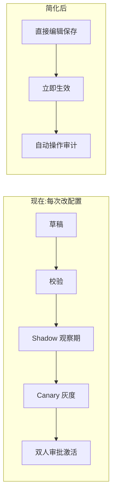
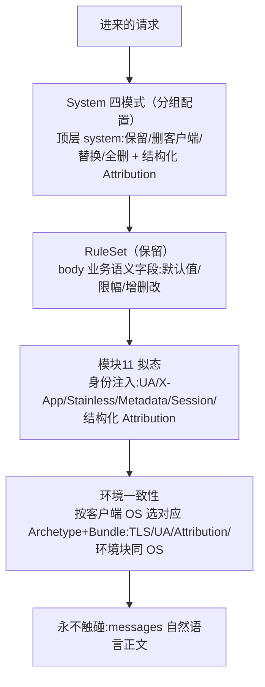

# Super Gateway 精简核心蓝图

> 本文在原 [functional-modules.md](functional-modules.md)（18 模块完整规划）基础上收敛范围，作为后续实现的范围基线。
> 三条总原则：① 保留功能主体；② 去掉贯穿全平台的操作摩擦；③ 环境一致性（拟态可信度）不但不砍、反而升级为多 OS 强一致。
> 本文只定范围与形态，不改代码；代码落地在最后一节给出分步入口，另行执行。

## 1. 精简的定位

精简 = 两件事，不是笼统"砍功能"：

1. **去操作摩擦**：把"不可变版本 + 五段发布链（draft→validate→shadow→canary→activate）+ Shadow/Canary 观察期 + 双人审批 + 强制填原因"这套企业级流程，在全平台统一改为"直接编辑保存即生效 + 自动留操作审计"。
2. **删少量整块功能**：只删确实没有服务对象的几块（通用请求改写外的治理壳、测活/后台目录、内容全文审计独立模块、Enforcement 独立工件）。

注意：**环境一致性是核心价值，本期反而强化**（见第 6 节），与"省力"目标存在张力，是有意投入。

## 2. 核心主线（原样保留）

对应原规划模块 01–05、09–15、17 的主干职责全部保留，仅按下文去掉治理壳与操作摩擦。

## 3. 逐条定稿清单

### 3.1 全平台去操作摩擦（功能保留）

| 编号 | 项目 | 精简后 |
|---|---|---|
| A1 | 分组配置 | 五段发布链 → 直接编辑保存生效 + 操作审计日志 |
| A2 | 模型与能力 | 清单/能力定义/结构化校验/Capability 工作台全保留；去 Shadow/Canary 与强制填原因；官方资料冲突审核、主动验证不实现 |
| A3 | 传输 Bundle / 环境原型 | 保留上传 + 签名验证 + 激活；去掉 canary 灰度段 |
| A4 | 双人审批 | 全部取消，高危操作只留普通确认框 |
| A5 | 强制填原因 | 改为可选备注；审计日志自动记录操作者/时间/变更 |
| A6 | 价格 | 估算展示保留；价格来源改为从 LiteLLM 目录自动同步（见 3.5） |
| A7 | RuleSet | 规则引擎、治理页"规则集"、校验/模拟保留；去发布链，改直接生效 |
| A8 | 请求/响应正文查看 | 不做独立全文审计；正文随请求记录**明文存储**，在"请求与用量 → 请求明细"点开直接看；开关/保留天数/到期清理放系统设置；取消 Audit Case 双人授权 |

### 3.2 整块删除

| 编号 | 项目 | 说明 |
|---|---|---|
| B1 | Enforcement 独立工件 | 与分组 System 配置功能重复；管线已有 `load_system_policy` fallback（[app.rs](../crates/super-gatewayd/src/app.rs) 755-756），删工件、能力并入分组配置，零损失 |
| B2 | 测活 / 流量分类 / 后台目录 | 全删。测活防不住（外部不走专用接口、直接短对话探测，启发式又会误伤真用户），自用场景无对象；标题生成等客户端后台请求本就该照常转发以保持拟态自然。删除 NORMAL/EXPLICIT_PROBE/SUSPECTED_PROBE 分类、Background Catalog、两级限速桶、7天/100样例 Shadow 门槛；所有 `/v1/messages` 一律按普通业务处理 |

### 3.3 界面与参数收敛

- **C1 分组表单**只保留：客户端类别、System 模式（默认 `preserve`）、模型范围（全部/白名单）、出口模式、并发/RPM/队列容量；其余细粒度超时收敛为后端默认值（或高级折叠）。
- **C2 治理页页签裁撤**：删 Enforcement、后台目录页签；规则集保留；价格并入"模型与能力"页。

### 3.4 延后（保留概念，本期不做）

- **分组级**额度上限；用户级并发 / RPM **聚合**上限。（说明：Key 级 `spend_limit_amount`、用户级 `credit_limit_amount` 与用户对其 Key 的 `key_max_concurrency/rpm` 天花板已由迁移 `20260824003900_user_key_limits.sql` 落地——额度在 edge `authorize_spend`（`edge.rs:299`）执行，`key_max_*` 天花板在访问投影里以 `LEAST` 折算进 Key 生效值（`app.rs:620-622`）——本期保留不删。）
- 多租户级重治理（Shadow/Canary、双人审批将来如需可作为可选模式回归）。

### 3.5 价格自动同步（A6 细化）

- 数据源：[LiteLLM 价格目录](https://raw.githubusercontent.com/BerriAI/litellm/main/model_prices_and_context_window.json)。
- 同步：定时拉取 → 按 `litellm_provider == "anthropic"` 过滤 → 把"美元/单 token"×1,000,000 换算为内部"美元/百万 token" → 映射 LiteLLM 模型名到平台 `upstream_model_id` → **直接更新当前价格表，无需人工确认**。
- 历史：既有用量记录仍按发生时价格固化，不追溯重算。

## 4. 内容治理边界（四段各管一段，不重叠）

原规划已把边界划清（[functional-modules.md](functional-modules.md) 第 716 行：body 语义只归 RuleSet；模块11 只管身份/传输不碰 body 语义；System 净化只处理结构化顶层 system、不扫 messages）。本蓝图在此基础上增加"环境一致性"一段。

**引擎级守卫**：RuleSet 的 mutation path **禁止 `/messages` 及其任何子路径**（`validate_mutation_path` 在编译期拒绝），保证"永不触碰 messages 正文"不依赖管理员自律，同时避免首条 user 消息被改动而间接破坏 `fp3`（见 §5.5）。

## 5. System 内容模式（定稿）

四模式保留：`preserve`（保留客户端 System）/ `strip_client`（删客户端 System 不注平台的）/ `replace`（替换为平台 System）/ `strip_all`（全删且禁止再注入归属）。收敛到分组配置一个字段，数据库约束从现有 `preserve/strip/replace` 放宽到四种。**`preserve` 设为分组默认。**

### 5.1 Claude Code 的请求结构（源码核实）

一条 `/v1/messages` 里和"像不像真 CLI"相关的部分：

**`system` 数组（顺序敏感）**：
1. **`system[0]` = 计费/归属块**：文本 `x-anthropic-billing-header: cc_version=<ver>.<fp3>; cc_entrypoint=cli; cch=00000;`，必须第一、且**无 cache_control**（`cch` 是字面占位符、非签名；详见 5.5）。
2. **静态段**（源码内以 `__SYSTEM_PROMPT_DYNAMIC_BOUNDARY__` 为界）：身份/工具/语气/输出规范——随 CLI 版本固定。
3. **动态段**（边界后）：`session_guidance`、`memory`（用户 CLAUDE.md）、`# Environment` 结构块（`cwd`/`git`/`Platform`/`Shell`/`OS Version`/model）、`language`、`output_style` 等。

> **边界标记不上线**：`__SYSTEM_PROMPT_DYNAMIC_BOUNDARY__` 在 CLI 发送前被滤除、不进 API（参考 [claude-code-request-reference.md](claude-code-request-reference.md) §4.4 / 附录 D.1 S8）。平台侧解析器只能**启发式定界**：静态段末 = 最后一个**包含** `# Tone and style` 标题的块（静态段通常是一个大块，该标题在块内末尾）；动态段首 = 第一个匹配 `Communicating` / `pronouns` / `session_guidance` / `# Environment` 的块；两者之间若有 `cache_control` 断点，以断点为界；无法定界时返回"未定界"并打审计标记，绝不猜。

**`messages` 数组**：对话内容；其中 tool 结果与 user 消息里由 CLI 自动插入 `<system-reminder>…</system-reminder>` 标签块（skills/todo/环境提醒）。它们是真实 CLI 行为的一部分，**平台保留不动**；但与 system 一样计入 cch。

`# Environment` 块是"固定模板 + 变量填充"，可被平台精准定位改写；它在 `system` 内、属于结构化顶层 system，处理它不违反"不扫 messages 正文"。

### 5.2 replace 默认基线

`replace` 不由管理员从零手填。采集某 CLI 版本时，连它的**静态 system 模板**一起采下，存入对应 Environment Archetype，作为 `replace` 的默认内容；管理员仅在有特殊需求时覆盖/追加。默认内容 = 真实 CLI 版本会发的 System，最不易被上游看出差异。

> **动态内容不能被采集模板冻结**：采集模板只覆盖**无运行时变量的静态段**。含动态值的部分——`# Environment` 的 OS/路径、`<system-reminder>` 的 `Today's date is YYYY-MM-DD`、WebSearch 工具描述里的 `current month`——必须运行时按真实值填或保留客户端原值，否则会发出过期日期/月份而露馅。日期注入的完整清单见 [claude-code-request-reference.md](claude-code-request-reference.md) §7.1。

### 5.3 环境块精细对齐

- **保真（功能必需）**：`cwd`、`Is a git repository` 保留客户端真实值——模型靠它判断工作目录与 git 状态，改了会破坏正常编码功能。
- **对齐（消除残留）**：`Platform`、`Shell`、`OS Version` 改写为与选中 Archetype 完全一致，消除 OS 小版本差异。
- 需为每个 CC 版本维护环境块的解析/改写规则。

### 5.4 模式与 Claude Code 功能的关系（重要）

`strip_client` / `strip_all` 删掉客户端 system → 环境块随之消失 → Claude Code 失去 cwd/git 感知、正常功能受损；`replace` 若模板不含环境块同理。因此：

- **真实 Claude Code 场景以 `preserve` + 环境块对齐为主线**（分组默认）。
- `strip_client` / `strip_all` / `replace` 面向非 Claude Code 客户端，或"就是要强制统一 System、不在乎 CC 环境感知"的特殊场景。

### 5.5 计费/归属块与 cc_version 指纹（非整体 body 签名）

**重要纠正**：早期逆向（约 2.1.37）流传"cch = `xxHash64`(整个 body)、改 body 必重算"，但**真实 CLI 2.1.220 源码显示 `cch=00000` 是字面占位符、不计算**（`Bun.hash` 只用于本地 prompt-cache 指纹），sub2api 现行实现索性不发 cch。完整证据见 [claude-code-request-reference.md](claude-code-request-reference.md) §8。

- billing 块 = `system[0]` 文本：`x-anthropic-billing-header: cc_version=<ver>.<fp3>; cc_entrypoint=cli;`（`cch`：按采集版本的常量表决定发 `00000` 或不发——2.1.220 源码里 `cch=00000` 受 `Kd()` 门控、其真值表未展开；无 cache_control）。`<ver>` 语义版本与 UA 一致。
- **真正随内容变的指纹是 `cc_version` 末尾 3 字符 `fp3`**：`SHA256("59cf53e54c78" + 首条 user 消息第 4/7/20 字符 + 版本号)` 取 hex 前 3 位——**只依赖首条 user 消息的 3 个字符**，与 system/tools/环境块无关。"首条 user 消息"= `messages[0]`（role=user）首个 `text` 块全文，**包含**前置 `<system-reminder>`（与 sub2api 一致）。

**对"改 body"的意义**：改 System / 环境块 / RuleSet 改 body **不影响** `fp3`（只要不动首条 user 消息那几个字符），因此**不存在"改 body 必须重算整体签名"的硬约束**。平台只需保证 billing 块结构正确、`<ver>` 与 UA 一致；配合 §4 的 `/messages` 守卫，平台侧不会改动首条 user 消息。三种情形：客户端已发且 `<ver>` 与所选原型版本一致 → 整块原样保留（含其 `fp3`）；客户端已发但 `<ver>` 与原型版本不一致（客户端 CLI 版本高于或低于平台采集版本）→ 替换 `<ver>` 并按上式重算 `fp3`；客户端未发 → 重建整块。

**第四层身份——`metadata.user_id`**：body 的 `metadata.user_id` 是 JSON 字串 `{device_id, account_uuid, session_id[, parent_session_id]}`（参考 §6）。它与 TLS / 头部 / 环境块并列构成第四层，必须与 `(凭据 × OS)` 设备身份、头 `X-Claude-Code-Session-Id` 同源（见 §6.1、§6.3 第 5 步），否则客户端真机的 device_id 会原样泄漏给上游。

风险：Anthropic 有 `NATIVE_CLIENT_ATTESTATION` 服务端开关（GrowthBook killswitch），未来可能引入更强签名 → 按采集版本复核，并按 §6.6 监控被判第三方的失败率。参考实现：`open-project/sub2api/backend/internal/service/gateway_billing_block.go`。

## 6. 环境一致性专项（多 OS 强一致，本期最重工程）

目标：请求内容里的 OS 信息（System 环境块的 `Platform`/`OS Version`/路径风格）、头部层的 `X-Stainless-OS` 等、传输层拟态的 OS **三者保持一致**，并与 `metadata.user_id` 里的设备/会话身份**同源**，避免上游交叉比对露馅。

### 6.1 环境信息的四层分布与处理

| 层 | 承载 | 是否暴露 OS / 设备 | 处理 | 一致性来源 |
|---|---|---|---|---|
| 传输层 | TLS ClientHello / ALPN / H1·H2 framing | 是 | Bundle 拟态 | Archetype 同源 |
| 头部层 | UA / X-App / **X-Stainless-OS**·Arch·Runtime·Runtime-Version | 是（`X-Stainless-OS` 直接写 OS） | 模块11 删真实、注入 Archetype 模板 | Archetype 同源 |
| 内容层 | Body.system 的 `# Environment` 块 | 是（Platform/OS Version/路径） | `preserve` 保留 + 环境块精细对齐 | 选对 OS 的 Archetype + 对齐 |
| 元数据层 | Body.`metadata.user_id` JSON（device_id / account_uuid / session_id） | 是（设备 id、会话 id） | 按 `(凭据 × OS)` 派生 device_id、凭据 `identified_account_uuid`、派生 session_id 整体替换 | 设备身份同源（与头 `X-Claude-Code-Session-Id` 同一派生值） |

四层最终全部指向"选中的 Archetype 的 OS + 该凭据在该 OS 上的设备"，因此自洽。

### 6.2 核心机制

- **多 OS 画像**：Windows / macOS / Linux 各维护一套 Environment Archetype + Bundle，均在对应 OS 真机/VM 用采集工具生成。**现有 Windows 2.1.241 资产也需重采集**：其 UA entrypoint 为 `sdk-cli`（应为 `cli`）、`anthropic-beta` 为字面量且缺 `oauth-2025-04-20`/`extended-cache-ttl-2025-04-11`、不含静态 system 模板。
- **凭据独立、OS 无关**：凭据（Anthropic 账号）是与 OS 无关的资源池；**决定能否为某请求拟态/调度的是"有没有该客户端 OS 的 Bundle"**，不是凭据分 OS。调度层的"OS 过滤"= 过滤 Bundle 可用性，健康凭据可被任意 OS 请求选用。
- **设备身份按 `(凭据 × OS)` 稳定派生**：一个账号对上游呈现为"同一人的多台不同 OS 设备"（Windows 设备 + Mac 设备…），每台各自稳定（device id / TLS 指纹 / session 派生一致）。存储上 `device_identity` / `credential_profile` / `egress_binding` 由"每凭据一条"改为按 `(credential_id, os_family_code)` 唯一。
- **OS 识别来源**：**主：`X-Stainless-OS` 头**（真实 CLI 每条请求恒带，值 `Windows|MacOS|Linux`）；**辅：`# Environment` 的 `Platform`**（有则交叉校核 `win32→windows`/`darwin→macos`/`linux→linux`，不一致打 `os_mismatch` 审计标记，以头为准）。UA 不含 OS，不可用；多数请求变体（count_tokens / side_query / compaction / 子代理）没有环境块，因此不能以环境块为主。
- **回退顺序（已拍板）**：头有效 → 用头（`os_resolution=Header`）；头缺失或非法但环境块 `Platform` 可归一 → 用环境块并写入会话缓存（`EnvironmentOnly`）；两者都没有 → 以客户端 `X-Claude-Code-Session-Id` 头值（即派发前的 Base Session）为键沿用同会话上次结果（`SessionSticky`）；仍无则回退到**分组配置的默认 OS**（`default_os_family`，缺省 `windows`；`GroupDefault`）。后两种打 `unknown_os` 审计标记，**不拒绝**。
- **缺对应 OS Bundle**：识别出某 OS 但没有该 OS 的 `active` Archetype + Bundle → 拒绝该请求 + 控制台告警（`bundle_missing_for_os`），不用别的 OS Bundle 凑合。注意与上一条区分："识别到但缺 Bundle"拒绝，"识别不到"回退。

### 6.3 一次请求的一致性闭环

1. 读 `X-Stainless-OS` 头 → 识别客户端真实 OS；有 `# Environment` 块则用 `Platform` 交叉校核；识别不到按 §6.2 沿用会话 / 回退分组默认 OS。
2. 选该 OS 的 Archetype；有没有对应 OS 的 Bundle 是能否调度的决定条件（缺则拒绝 + 告警）。
3. 组内选一个健康凭据（凭据 OS 无关），按 `(凭据 × OS)` 取/建稳定设备身份。
4. 拟态：TLS / UA / Stainless 用该 Archetype（传输 + 头部一致）；System 用 `preserve` 保留对话内容，环境块 `Platform`/`Shell`/`OS Version` 对齐该 Archetype、`cwd`/`git` 保真（内容层一致）。
5. 元数据与能力对称：把 `metadata.user_id` 整体替换为该设备的 device_id + 凭据 `identified_account_uuid` + 派生 session_id（与头 `X-Claude-Code-Session-Id` 同值）；删 body 内 `betas[]`；按 §6.5 对称表增删 beta 与 body 能力字段。
6. 四层全部指向同一 OS 与同一设备，发往上游 → 交叉比对无矛盾。

### 6.4 Bundle 的作用范围（wire 级，不碰 body）

Bundle 控制发往 Anthropic 的传输线级表现（见 [transport-engine.md](transport-engine.md)）：TLS ClientHello（版本/cipher/groups/扩展及顺序/ALPN/GREASE/padding/session 策略）、ALPN 协商 H1/H2、HTTP/1.1 header 顺序与大小写、HTTP/2 SETTINGS/frame ordering/pseudo-header 顺序/HPACK、连接行为。**一个字节都不改请求 JSON。** 当前 Windows cohort 固定 H1。

### 6.5 南向请求处理约束（完整枚举回填）

> 完整枚举 Claude Code 请求结构后回填的实现约束，细节见 [claude-code-request-reference.md](claude-code-request-reference.md) 附录 A–H。

- **只走 firstParty OAuth**：凭据固定为订阅 OAuth（`Authorization: Bearer` + `oauth-2025-04-20`）；bedrock/vertex/gateway/foundry/WIF 等认证分支一概不涉及。
- **对请求变体鲁棒**：真实 CLI 除主对话外还发 count_tokens / compaction / side_query / title / 子代理 等请求，body 形态各异（system 可能很短、无环境块、甚至无 billing 块）。System 净化 / 环境块对齐必须"**有则处理、无则跳过**"，绝不强行套模板，以免破坏精简请求。
- **保护 cache_control 断点**：客户端在 system/messages 块上打了缓存断点（ephemeral/ttl）。平台重组 system（插 billing 块、换静态段、改环境块）时必须正确保留/重排断点，否则缓存失效（成本、延迟上升）或断点错位。真实规则：system 若干块 + 消息 ≤2 断点，无硬编码 "max 4"。
- **anthropic-beta 用固定 Claude Code 集**：南向按采集版本发一套固定 beta（如 `claude-code-20250219, oauth-2025-04-20, interleaved-thinking-2025-05-14, prompt-caching-scope-2026-01-05, effort-2025-11-24, context-management-2025-06-27, extended-cache-ttl-2025-04-11`），忽略客户端杂散 beta。Bundle 头模板里 `anthropic-beta` 用 `{anthropic_beta}` 占位、由所选原型的固定集填充，不再取客户端值。
- **beta ↔ body 能力对称表**（双向执行，不只 `context_management`）。原型固定集是基线，对称表在其上做增删——客户端杂散 beta 被忽略，但客户端 body 确实开了的能力（如 thinking）会让对应 beta 被加回：

  | beta | body 字段 | 规则 |
  |---|---|---|
  | `context-management-2025-06-27` | `context_management` | 无 beta 则删字段 |
  | `extended-cache-ttl-2025-04-11` | 任一 `cache_control.ttl == "1h"` | 无 beta 则去掉 `ttl`（降为 5m） |
  | `effort-2025-11-24` | `output_config.effort` | 无 beta 则删字段 |
  | `fast-mode-2026-02-01` | `speed: "fast"` | 无 beta 则删字段 |
  | `interleaved-thinking-2025-05-14` | `thinking.type != "disabled"` | 无 beta 且 thinking 开 → 加 beta（thinking 是客户端功能，不删） |
  | `structured-outputs-2025-12-15` | `output_config.format` | 无 beta 则删字段 |
  | `task-budgets-2026-03-13` | `output_config.task_budget` | 无 beta 则删字段 |
  | （任意） | body 顶层 `betas[]` | **一律删除**（真实 CLI 由 SDK 转成头，不进 body） |

- **其余固定头**：`x-client-request-id` 每请求新 UUID；`stream=true` 时加 `x-stainless-helper-method: stream`；`x-app` 只放行客户端 `cli` / `cli-bg`，其余置 `cli`；`X-Claude-Code-Session-Id` 用派生 session_id（与 `metadata.user_id.session_id` 同值）。头集由签名 Bundle 模板从零渲染，客户端杂散头天然不透传。
- **JSON 键序**：真实 CLI 序列化 `system` 在 `messages` 前。平台任何重序列化必须保序——`serde_json` 需开 `preserve_order`（workspace 级，或策略/派发路径用自定义序列化器），否则默认按字母序输出会把 `messages` 排到 `system` 前。
- **派发阶段允许改写的 body 字段清单**（策略阶段之后、选定凭据/原型之后）：`system[0]` billing 块；`system[*]` 环境块的 `Platform`/`Shell`/`OS Version` 三行；`metadata.user_id`；删 `betas[]`；对称表所列字段。其余字节不动。审计口径：策略阶段的 `body_digest` 语义不变（策略产物 digest）；派发阶段最终 body 另算 `upstream_body_digest` 落请求记录，正文查看（A8）存的 `final_upstream_request` 以此为准。
- **count_tokens 路由：开放并拟态转发**：真实 CLI 在 `/context`、大输出校验、插件估算等场景会向配置的 base_url 发 `/v1/messages/count_tokens?beta=true`（偶发、非每轮；404 有软兜底、不致命）。本平台**开放该北向路由并用订阅凭据拟态转发**给 Anthropic，以完整支持真实 Claude Code。**注**：此项与原规划"count_tokens 不开放北向路由"相悖，是本次基于真实客户端行为的修订；契约里 `count_tokens_public` 门禁与 `validate_base_structure` 对 `max_tokens` 的硬要求需随之反转/放宽（count_tokens 请求无 `max_tokens`）。

### 6.6 被判第三方监控

上游对拟态失败的典型表现是 4xx 拒绝（attestation / 第三方客户端文案，或 `x-cc-*` 特征响应头）。平台按 `(凭据 × OS)` 对南向 4xx 响应做特征分类，计滑窗失败率，超阈值写 `ops.alert`（type `upstream_third_party_rejection`）并在控制台告警。这是 §5.5 风险条的落地点，也是 T7.1 抓包核对之外唯一的线上回归信号。

## 7. 用户 / Key / 分组属性定稿

| 对象 | 生命周期 | 属性 |
|---|---|---|
| 用户 | 创建 / 停用 / 归档 + MFA | 角色（platform_admin / key_owner）；对其 Key 的天花板 `key_max_concurrency` / `key_max_rpm`；可空 `credit_limit_amount`（已落地，见 §3.4） |
| 平台 Key | 创建 / 停用 / 吊销 / 过期 | 归属分组（**管理员可迁移**；owner 与 secret 不可变，见迁移 `20260824003900:27-35`）、并发上限、Messages/Models RPM、有效期、端点权限、IP allowlist、模型白名单、可空 `spend_limit_amount`。**注**：有效期、花费上限、创建时的端点权限已可在控制台设置；模型白名单与 IP allowlist 只有表结构与执行侧（新版本配置仅从上一版复制，无用户写入口），更新时不能改端点权限，`expired` 状态无写入者——由任务 T7.2 补齐 |
| 分组 | active / disabled / archived | 客户端类别、System 模式（默认 preserve）、模型范围（全部/白名单）、出口模式、并发/RPM/队列容量、**默认 OS**（`default_os_family`，未识别时回退用，缺省 windows，放高级折叠）；直接编辑生效 |

## 8. 精简后的管理台形态

- **治理页**：删除"Enforcement""后台目录"页签；保留"规则集"（去发布链）；"价格"并入"模型与能力"页并展示同步状态。
- **分组详情**：请求治理页签只留 System 模式（+ replace 内容覆盖入口）、模型能力校验、客户端类别；去掉版本发布链、审批入口；高级折叠内含"默认 OS（未识别时回退）"。
- **凭据详情**：展示多 OS profile（每个 OS 一行：原型版本 / 设备身份 / 出口绑定）。
- **平台 Key**：创建/编辑表单补模型白名单、IP allowlist 写入口，编辑时可改端点权限（有效期、花费上限已有）。
- **请求与用量**：请求明细支持点开查看请求正文（策略阶段 / 派发阶段最终）与响应正文（流式存原始 SSE 事件流，另附拼接后的最终 message）。
- **系统设置**（新增/扩展）：正文记录开关、正文保留天数与清理策略、价格同步源与状态。
- **原型 / Bundle 页**：页顶三 OS 覆盖总览，缺口链到 `bundle_missing_for_os` 告警。

## 9. 延后清单

分组级额度上限、用户级配额聚合、多租户级重治理（Shadow/Canary、双人审批）、价格自动同步之外的人工价格版本管理。（Key 级 / 用户级额度字段已落地并保留，见 §3.4。）

## 10. 后续代码落地入口（分步，另行执行）

任务级分解与完成状态以 [simplified-implementation-tasks.md](simplified-implementation-tasks.md) 为准；本节只给顺序骨架。

0. **提交阶段 0–2 基线**：步骤 1、2 的全部产物目前仍在工作区未提交（含 6 个迁移、前端源码与 `dist/`、`Cargo.lock`）；CI 要求 contracts / `dist` 无 drift 且 `--locked`，必须同批提交后再开后续步骤。`.cargo/config.toml` 是本机绝对路径 workaround，忽略不入库，README 写说明。
1. **拆治理壳**（已完成，未提交）：删 RuleSet 之外的 Enforcement 工件路由与治理页页签；删测活/后台目录（分类、Catalog、限速桶、`edge.rs` 的 `classify_traffic`/`probe_gate`）。
2. **配置去发布链**（已完成，未提交）：分组配置、能力、Bundle 改直接生效 + 操作审计；去审批与强制填原因；数据库放宽 System 模式约束到四种。
3. **billing 块 + System/环境块**：先落 Claude Code 请求测试语料；billing 块置 `system[0]`（`cc_version` 与 UA 一致、`fp3` 按首条 user 消息 SHA256 采样算、`cch` 按采集版本，参考 `sub2api/gateway_billing_block.go`）；`serde_json` 开 `preserve_order` 保证 `system` 在 `messages` 前；RuleSet 加 `/messages` 守卫；在其上实现分组四模式（默认 preserve）、启发式定界的 System 分段解析、`# Environment` 块 `Platform`/`Shell`/`OS Version` 对齐、replace 默认基线接入 Archetype 采集模板、cache_control 断点保护。改 system/环境块/tools 不影响 fp3，无需整体签名。
4. **多 OS 强一致**：三 OS 采集（**含 Windows 重采集**：修 UA entrypoint、补 oauth/extended-cache-ttl beta、导出静态 system 模板）；OS 识别以 `X-Stainless-OS` 为主、环境块校核、未知沿用会话/回退分组默认 OS；调度按客户端 OS 过滤 Bundle 可用性、缺则拒绝 + 告警；`device_identity`/`credential_profile`/`egress_binding` 改 `(凭据 × OS)` 唯一；`metadata.user_id` 按设备身份整体替换、与头 session 同源；被判第三方失败率告警。
5. **价格自动同步**：接入 LiteLLM 目录定时同步任务。
6. **正文查看**：请求记录存正文（明文；流式响应存原始 SSE）+ 请求明细查看 + 系统设置开关/保留天数。
7. **南向拟态与 count_tokens**：南向头用原型固定 beta 集 + OAuth 拟态头 + beta↔body 对称表 + `x-client-request-id`/`x-stainless-helper-method`（见 §6.5）；开放 `/v1/messages/count_tokens` 北向路由并用订阅凭据拟态转发，反转契约 `count_tokens_public` 门禁、按路由放宽 `max_tokens`；请求处理对变体鲁棒。
8. **Key 属性写入口**：模型白名单 / IP allowlist 的管理命令与表单，更新命令支持改端点权限；`expired` 到期扫描。（分组 `default_os_family` 列随步骤 4 的多 OS 迁移一起落。）
