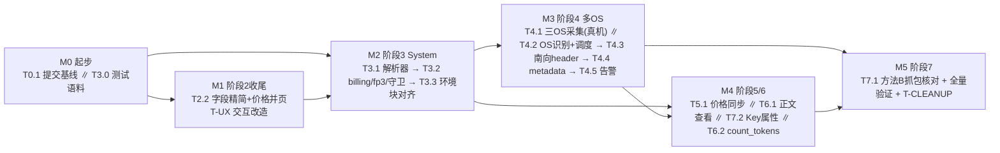

# 精简蓝图·开发任务文档

> 本文是 [simplified-blueprint.md](simplified-blueprint.md) 的执行分解:蓝图定"做什么/不做什么",本文定"按什么顺序、改哪些文件、怎么算完成"。蓝图不再承载任务清单;任务状态以本文为准,完成一项即在此打勾。
>
> 状态更新时间:2026-09-16。代码侧功能、真实数据库验证与统一回归已完成，成果随本次整体基线提交。Rust 261/261、前端 56/56、Clippy 零警告；详见 [统一回归记录](regression-2026-09-16.md)。当前待办以 §1.2 为准；其余章节保留历史开发顺序和当时证据。

## 0. 初始基线（历史记录，当前状态见 §1.2）

| 阶段 | 内容 | 验证证据 |
|---|---|---|
| 0 地基核实 | System 四模式 CHECK 约束已由迁移 `20260824001200` 放宽(`:17`);`catalog.environment_archetype` 已有 `os_family_code/architecture_code`(`20260824000200:8-9`),多 OS 表结构现成 | 读迁移确认 |
| 1 拆治理壳 | 删 Enforcement 独立工件(路由、typed-artifact 函数、`load_enforcement_artifact`),System 净化只读 `group_config.system_prompt_*`(`app.rs:625/905`);删测活/后台目录(`TrafficClass`、`BackgroundCatalog`、`classify_traffic`/`probe_gate`、两级限速桶);前端删治理页两个页签 | `admin-routes.json` grep enforcement 为 0;`crates/` grep 上述符号为 0;迁移 `20260901000100_retire_enforcement_and_background.sql` + manifest 条目;`GovernancePage.tsx` 无 enforcement/background |
| 2 去摩擦(核心) | 全平台操作原因改为可选备注(`required_action_reason` admin_backend.rs:14207,43 处调用点;`common.schema.json` ActionCommand 无 required;前端 reason 无 `required`);取消分组配置/Bundle 激活的双人审批与 step-up(`:4757-4764`、`:9653`);删 5 条 Shadow/Canary 路由;分组配置新建 draft 可直接激活(`:4747`);原型/Bundle `verified` 即可激活(`:9627`、`:10038`) | `validate_contracts.py:309` 路由 181 与 `admin.openapi.json` 一致;`admin-routes.json` 无 publish-shadow/promote-canary |

**首要遗留——全部未提交**:HEAD 为 `403f3b4`(2026-08-25),工作区 152 个改动。阶段 0–2 的全部产物(6 个迁移、4 份 planning、前端 30+ 源文件与全部 `__tests__`、`local.rs`/`local_bundle.rs`、`assets/`、`dist/`、`Cargo.lock`)都是未跟踪或未暂存。CI(`.github/workflows/ci.yml:31/57/92`)要求 `contracts/` 无 drift、`cargo --locked`、`web/admin-console/dist` 无 drift,必须**同一批**提交,否则三处红。这是 T0.1。

**其余已知遗留(有意保留,列入 T-CLEANUP):**
- `gateway.group_config.enforcement_artifact_id` 列保留为空列(避免重排四条 INSERT 的 22 个位置参数),迁移已置空并删触发器。
- 审批种类 `enforcement_activate`/`group_audit_policy`/`bundle_activation` 仍在枚举与契约中,但配置/Bundle 路径已不再消费;`i18n.tsx:624` 仍写"需双人审批单"(`api-contract.md:959/:972` 已在 2026-09-03 改正)。
- `catalog.artifact_rollout_evidence` 的 shadow 字段、各 lifecycle CHECK 中的 `shadow`/`canary` 值仍存在(无害、不再写入);激活分支仍接受 `canary` 值兼容存量行。
- 新迁移 `20260901000100` 尚未在本地库执行,服务下次启动时由 `sqlx::migrate!` 自动应用。

## 1. 剩余任务总览

17 项 + T-CLEANUP,分 6 个里程碑。M0 是提交基线与落测试语料,半天,必须最先做。M3 的采集依赖真机,可与 M2/M4 并行推进代码侧。M1 的 T2.2 与 T-UX 改同一批前端文件,必须一起做。T6.2 依赖 T4.3 的南向头,因此 M3 → M4 有边。

**各任务真实状态(2026-09-04 核对代码)**:阶段 0–2 与 T3.0-T3.3、T4.2-T4.5、T5.1、T6.1a、T6.2、T7.2 已完成代码侧实现，尚未提交；T4.1/T7.1 仍依赖真机采集与抓包核对；T-CLEANUP 保留为后续迁移。

| 编号 | 任务 | 依赖 | 规模 | 外部依赖 |
|---|---|---|---|---|
| T0.1 | 提交阶段 0–2 基线 + `.gitignore` 杂物与 `.cargo/config.toml`(不入库,README 说明) | — | 小 | 无 |
| T3.0 | Claude Code 请求测试语料落盘(主对话 / count_tokens / side_query / compaction / 子代理 / 无环境块 / 无 billing / system 为字串) | — | 小 | 无(先用 2.1.220 参考样本) |
| T2.2 | 前端分组字段精简 + 价格并入模型页 | 与 T-UX 同里程碑 | 中 | 无 |
| T-UX | 管理台交互改造(表单主视图 / 确认策略 / 导航 / 生命周期文案 / OS 覆盖) | 与 T2.2 同里程碑 | 中 | 无 |
| T3.1 | System 分段解析器(启发式定界) | T3.0 | 中 | 无 |
| T3.2 | billing 块注入 + `cc_version` fp3 + RuleSet `/messages` 守卫 | T3.1 | 小 | 无 |
| T3.3 | 环境块对齐 + 四模式落地 + cache_control 保护 + 变体鲁棒 + `preserve_order` | T3.1、T4.2(OS/原型选择) | 大 | 无 |
| T4.1 | 采集三 OS Archetype + Bundle(**含 Windows 重采集**)+ 静态 system 模板导出 | — | 中(工具侧) | **真机/VM** |
| T4.2 | 客户端 OS 识别(`X-Stainless-OS` 为主)+ 未知回退(含分组 `default_os_family` 列)+ 调度按 Bundle 可用性过滤 + 缺 Bundle 拒绝告警 + (凭据×OS) 设备身份 | T3.1 | 大 | 无(数据靠 T4.1) |
| T4.3 | 南向 header 拟态(原型固定 beta 集 + OAuth + Stainless 对齐所选 OS + beta↔body 对称表 + 固定头) | T4.2 | 中 | 无 |
| T4.4 | `metadata.user_id` 四层一致(device_id / account_uuid / session_id 与头同源) | T4.2 | 中 | 无 |
| T4.5 | 被判第三方失败率告警 | T4.3 | 小 | 无 |
| T5.1 | LiteLLM 价格定时同步 | — | 中 | 外网访问 |
| T6.1 | 请求/响应正文明文存储(含 SSE)+ 明细查看 + 系统设置;取消 Audit Case 双人授权 | T3.3(存证口径) | 大 | 无 |
| T6.2 | `count_tokens` 北向路由 + 订阅凭据拟态转发 + 契约门禁反转 | T4.3 | 小 | 无 |
| T7.1 | 方法 B 抓包逐字段核对 + 全量验证 | 全部 | 中 | **真机抓包** |
| T7.2 | 平台 Key 属性写入口 + `expired` 到期扫描 | — | 中 | 无 |
| T-CLEANUP | 遗留清理迁移 + 命名残留 + 杂物(可随任意阶段顺带) | — | 小 | 无 |

### 1.1 本轮完成证据

2026-09-07 审核后已修：分组「保存并生效 / 仅保存草稿」、高风险确认、activate 失败提示；派发不再凭空插入 `system`；采集写库失败 fail-open；digest 与截断解耦；billing 字串/畸形头原地改写；Bundle 按分组凭据；T4.2 写路径按 OS/epoch/EXISTS；SSE 累积 tool/thinking delta。

- [x] T3.0–T3.3：语料、分段、billing/fp3；engine 四模式改用分段（`gateway-policy/src/system_rewrite.rs`）：`strip_client` 只留 billing 块，`replace` 定界成功时只换静态段、保留 billing 与动态段，断点数不超过客户端原值；`replace` 内容留空 → `system_template_pending`，派发按所选原型 `system_template` 补齐（无模板则保留客户端 system 并告警）。8 个语料 × 五种模式矩阵测试在 `tests/system_segments_fixtures.rs`。原型模板数据仍依赖 T4.1 采集。
- [x] T4.3/T4.4：南向 header 与 metadata 身份。T4.2：OS 识别/回退/告警、写路径按 OS/epoch 收口；已有凭据的其它 OS profile 改为**自动补建**（`gateway-services::credential::provision_missing_os_profiles` + `gateway-storage::provision_os_profile`：dispatcher 30s 重配循环周期补建，dispatch 命中缺 profile 时按需补建并 `reconfigure_credential`），凭据详情按 OS 展示 `profiles[]`，不再需要独立产品入口。T4.5：第三方拒绝不再用过宽的 `"not supported"`；窗口/最少次数/占比改为系统设置 `third_party.*`（`/admin/v1/settings/runtime`）。
- [x] T5.1：价格同步与模型页 i18n 入口；周期改为系统设置 `price_sync.interval_hours`。
- [x] T6.1a：采集 fail-open、digest 对账、SSE 累积 `input_json_delta`/`thinking_delta`。
- [x] T6.1b：加密审计子系统整体退役——数据面删 `ContentAuditMode`/闩锁/`AuditUnavailable` 与响应侧加密旁路；`gateway-services::content_audit` 模块、`operations.rs` 的 purge/export Job、`admin_backend.rs` 的 9 个 handler 与 5 种审批种类删除；Key 创建/配置不再携带 `requested_content_audit` / `audit_mode`，分组配置不再携带 `content_audit`；路由 188→178，`step_up_purpose` 去 `content_audit_access`，`approval_kind` 只剩 `device_rebuild|key_provider_change`；迁移 `20260907000100_t6_retire_content_audit.sql` 删 7 张 `security.*` 表与 Key/Group 审计列、收窄审批与导出 CHECK（NOT VALID 容忍历史行），表基线 119→112；`GATEWAY_CONTENT_AUDIT_*` 环境变量从注册表与 Dockerfile 移除。
- [x] T6.2：`count_tokens` 北向路由与门禁反转。
- [x] T7.2：平台 Key 属性写入口；编辑表单硬编码中文已改 i18n。
- [x] T2.2/T-UX PARTIAL：分组双按钮与确认；OS 覆盖不再把未绑原型的 Bundle 算覆盖，缺口链到 `/alerts`；`default_os_family` 可编辑。
- [ ] T4.1/T7.1：仍需三 OS 真机采集、抓包逐字段核对及报告。

### 1.2 剩余事项(2026-09-16 更新;按"能否在本机完成"分组)

**A. 必须做,但需要开发者环境**

- [x] **A1 在真实 PostgreSQL 上执行新迁移**：2026-09-16 在独立 PostgreSQL 18.3 临时实例完成 50 条迁移与 112 表契约核对；11 个真实 PG 集成测试全部通过（网关共 43/43）。新增带历史数据的审计退役升级测试，以及三 OS 自动补建、重复/并发幂等检查。CI 已接入升级测试，PostgreSQL 16 的执行结果待 CI；生产部署另行进行。详见 [数据库验证记录](postgres-validation-2026-09-16.md)。
- [x] **A2 统一回归与整体基线提交**：源码、6 个新增迁移、`contracts/`、`dist/`、`Cargo.lock` 与验证记录同批提交。Rust 261/261（含 11 个真实 PG 测试）、前端 56/56、格式、Clippy 和契约检查通过；保留原有已提交迁移的 checksum，修复历史导出清理与备份授权遗漏。远程 CI 和 PostgreSQL 16 结果待推送后验证。
- [ ] **A3 部署侧清理**(迁移后):删服务器上的 `/var/lib/super-gateway/content-audit/`;systemd / compose 若仍有 `GATEWAY_CONTENT_AUDIT_KEY_FILE` / `GATEWAY_CONTENT_AUDIT_DIR` 可移除(代码已不读取,留着无害)。

**B. 依赖真机,不是代码问题**

- [ ] **B1 = T4.1** 三 OS 采集(含 Windows 重采集,原因见 T4.1 节)。没有它,`replace` 模式的 `system_template` 回退只会告警并保留客户端 system,三 OS 覆盖告警也无法消除。
- [ ] **B2 = T7.1** 方法 B 线路抓包核对。**范围已因 T6.1 缩小**:body 级(`system` / `tools` / `metadata`)可直接用请求明细里的 `original_request` vs `final_upstream_request` 离线比对,不必抓包;仍需抓包的是 ①**真实 OAuth 订阅 CLI 直连 api.anthropic.com 的基线样本**(经网关的客户端走 `ANTHROPIC_AUTH_TOKEN` 平台 Key,请求形态本就不同——无 `oauth-2025-04-20`、beta 集与 billing 块由网关重建,所以"把 CLI 指向网关"拿到的是输入而不是对照基线;T4.1 采集时顺带产出)、②网关**出站 header**(`request_body` 只存 body,不存头;可选先在派发侧加一份出站头快照到 `request_body` 以免抓包)、③**TLS ClientHello / ALPN / H2 SETTINGS / 头序大小写**——这是 Bundle 拟态的对象,只能在 CLI→Anthropic 与网关→Anthropic 两条线路上用 `tls-tap` 直通抓取后 diff、④上游拒绝特征(attestation / `x-cc-*` 响应头 / 第三方文案),供 T4.5 分类表校准。

**C. T-CLEANUP(可选,一次迁移顺带;详见 §2 末节)**

- [ ] C1 删 `group_config.enforcement_artifact_id`;step-up purpose 去 `bundle_activation`(`admin_backend.rs` 与契约 `step_up_purpose` 仍在);`artifact_rollout_evidence` 去 shadow 字段;各 lifecycle CHECK 去 `shadow/canary`;`security.encrypted_secret.provider_role_code` CHECK 与 `generate_contracts.py` 秘密信封 schema 的 `content_audit` 用途域收窄。
- [ ] C2 非迁移项:`RequestSnapshotSet.enforcement` / `struct Enforcement` 改名为 system_policy 语义;`api-contract.md:550`、`:1130` "高风险操作仍受双人审批"改为只列设备身份重建与主密钥提供方变更;`tools/r2_backup_restore.py:210` 的 `content_audit_objects` 排除类别可删。

**D. 历史规划文档仍描述加密审计旧方案**(`simplified-blueprint.md` 为当前权威;是否逐篇改写待定)

- [ ] `database-schema.md`(§22 Content Audit、ERD、`provider_role_code` 分域、119 表口径)、`domain-model.md`(`ContentAuditMode`)、`functional-modules.md`(多处 `full_encrypted` / Legal Hold 条款)、`technical-architecture.md`(content-audit preflight、Store 故障行)、`operations-runbook.md`(`content-audit/` 目录)、`implementation-gap-analysis.md`(F3)、`implementation-roadmap.md`(R9 Content Audit / Legal Hold)。`api-contract.md` 与 `admin-console.md` 已同步。

## 2. 任务详述

每项含:目标 / 改动点 / 完成标准 / 风险。文件路径均为仓库相对路径。

### T0.1 提交阶段 0–2 基线

**目标**:让 §0 声称的基线真正存在于提交历史,并让 CI 绿。

**改动点**
- `.gitignore` 追加:`web/admin-console/*.png`、`web/admin-console/galaxy_*.py`、`web/admin-console/repro-*.html`、`web/admin-console/repro-*.tsx`、`cargo-check-result.txt`、`.cursor/`;删除工作区里的 png / py / html / tsx 临时文件与 `cargo-check-result.txt`;`.cursor/` 只忽略不删(编辑器本地配置)。
- `.cargo/config.toml` **不入库**:其内容是绝对 Windows 路径 `target-dir = "C:/codex-targets/…"`(BoringSSL 在非 ASCII 路径下的 workaround),ubuntu CI 车道无 `CARGO_TARGET_DIR` 覆盖(`ci.yml:53-57/68-70/123-153`),入库会在 Linux 生成 `C:` 目录并打穿 `rust-cache`。`.gitignore` 加 `.cargo/config.toml`;`README.md` 环境准备段说明"仓库路径含非 ASCII 字符时,本地自建 `.cargo/config.toml` 设 `target-dir` 到 ASCII 路径或设环境变量 `CARGO_TARGET_DIR`"。
- 一次提交包含:6 个迁移文件、`contracts/`、`crates/`、`web/admin-console/src` 与重新构建的 `dist/`、`Cargo.lock`、`planning/`、`transport-poc/`。提交前在本地跑 `python tools/generate_contracts.py && git diff --exit-code -- contracts`、`cargo check --workspace --all-targets --locked`、`web/admin-console` 下 `npm run build && git diff --exit-code -- dist`,与 `ci.yml:31/57/92` 三处检查同口径。
- 可以拆成 2–3 个逻辑提交(迁移+后端 / 契约 / 前端),但必须连续推送。

**完成标准**:`git status --short` 只剩有意不跟踪的内容;CI 全绿。

### T3.0 Claude Code 请求测试语料

**目标**:T3.1/T3.2/T3.3/T4.2/T6.2 的单测都需要真实形态的请求样本,当前 `contracts/fixtures` 各 corpus 里没有任何 Claude Code 形态。

**改动点**
- 新建 `crates/gateway-policy/tests/fixtures/claude-code/`,每个变体一个 JSON(headers + body):`main-conversation.json`(完整 system 含 billing / 静态段 / `# Environment`,messages 含 `<system-reminder>`)、`count-tokens.json`(无 `stream`/`max_tokens`,`tools` 剥离)、`side-query.json`(短 system,`max_tokens 1024`)、`compaction.json`、`subagent.json`(`x-app: cli-bg`,`system` 含 `<env>`)、`no-environment.json`、`no-billing.json`、`system-as-string.json`。
- 首版按 [claude-code-request-reference.md](claude-code-request-reference.md) §9 样例与附录 G 手工构造,文件头注明 `source: reference-2.1.220, synthetic`;`fp3` 值用算法自算填入,不用参考里的 `a3f`(示意值)。T4.1 抓包后用真实样本替换并把 `source` 改为 `capture-<os>-<ver>`。
- 头样本按 2.1.241 Windows 资产(`X-Stainless-Package-Version 0.112.1`、`Runtime-Version v26.3.0`)与 2.1.220 参考各留一份,给 T3.1 版本表两条数据。

**完成标准**:8 个样本可被 `serde_json` 解析;T3.1 单测直接 `include_str!` 引用。

### T2.2 前端分组字段精简 + 价格并入模型页

**目标**(蓝图 C1、C2、§8):分组配置表单只留 5 组字段;价格从治理页搬到"模型与能力"页。页面结构、保存交互、确认框策略由 **T-UX** 负责,本项只改字段集合与价格区块归属。

**改动点**
- `web/admin-console/src/group-detail.tsx` `ConfigDraftForm`:7 个分节(当前 `form-section-label` 在 :416/438/446/452/462/485/493)收敛为 ① 客户端类别 ② System 模式(+`replace` 内容覆盖入口)③ 模型范围(全部/白名单)④ 出口模式 ⑤ 并发 / RPM / 队列容量。超时、亲和、配额守卫、凭据默认值、审计策略等移入"高级"折叠区(默认收起,值取后端默认或继承当前生效版本;`create_group_config_version` 对 `governance`/`model_scope` 省略即继承,其余字段仍需提交,由前端填继承值)。高级折叠区预留"默认 OS(未识别时回退)"一项,T4.2 加列后接入;T4.2 未到前只留占位不提交该字段。
- Key 表单 `spend_limit_amount` 已有(`PlatformKeys.tsx:144-151/:203`),不动;用户表单补 `credit_limit_amount`/`key_max_concurrency`/`key_max_rpm` 写入口(后端 `admin_backend.rs:3292/3429` 已支持,前端 `src/` 目前无任何匹配);蓝图 §3.4 已确认保留这些字段。
- `web/admin-console/src/GovernancePage.tsx`:删 `PricePane`/`PriceCreateDialog` 与 `prices` 页签,治理页只剩规则集;`View` 收敛为 `"rulesets"`。(单页签别扭、导航改名由 T-UX 收口。)
- `web/admin-console/src/ModelsTable.tsx`:新增"价格"区块(当前生效版本表 + 同步状态占位,T5.1 接入真实状态);`gov.price.*` 文案键迁移/改名。
- `web/admin-console/src/i18n.tsx`、`display.ts`:字段与价格相关键调整(发布链文案由 T-UX 清)。
- 测试:`__tests__/governance-page.test.tsx`(去掉价格相关期望)、`models-table.test.tsx`(新增价格区块渲染)、分组表单精简测试(只出现 5 组字段)。保存/激活请求次数以 T-UX 的主视图为准。

**完成标准**:`npx tsc -b` 净;`vitest run` 全过;治理页无价格页签,模型页可见价格;分组表单只露 5 组 + 高级折叠。

**风险**:分组表单字段多、与后端 `GroupConfigCandidateCommand` 必填项耦合;先读 `validate_group_config_candidate` 确认哪些字段后端必填,再决定"折叠"还是"前端补默认值"。

### T-UX 管理台交互改造

**目标**:去摩擦落到体验上,不只删后端按钮。与 T2.2 同改 `group-detail.tsx` / `GovernancePage.tsx` / `feedback.tsx` / `App.tsx` / `i18n.tsx`,一次做完。

**范围(已拍板的 5 项;正文查看与系统设置页形态归 T6.1)**

1. **分组页改成"当前配置"主视图**(`group-detail.tsx`)
   - 主区域是当前生效配置的可编辑表单,保存 = 创建 draft + 立即 activate(If-Match 用活动指针 revision)。
   - 版本历史 / 校验 / 模拟 / 回滚降为次级入口(折叠或独立"历史"页签),不再以版本链 + 一排动作按钮当主交互。
   - 去掉"保存并生效"这种叠在版本中心上的额外按钮;草稿入口仅作"仅保存不生效"的次级动作。
   - 清掉 `group.version.chainHint`、`group.config.formDescription`、`groups.description`(`i18n.tsx:276`)里仍写 Shadow → Canary 的说明;`systemHighRiskHint`(`i18n.tsx:624`)与 `group.version.highRiskBody`(`i18n.tsx:642`,被 `group-detail.tsx:108` 用作激活确认框正文)仍写"需携带已批准的审批单",改为"高风险模式切换会在审计中留痕";`group-detail.tsx:13` 的发布链注释、`group-detail.tsx:337` 与 `GovernancePage.tsx:72` 的审批单注释一并清。

2. **确认框只留给危险操作**(`feedback.tsx` 的 `useConfirm`,与 `resource-actions.tsx` 里 28 处 `confirm:` 声明;代码里没有叫 `confirmAction`/`openConfirm` 的东西)
   - 普通操作(保存当前配置、创建规则集草稿、校验、模拟)直接执行 + toast——即把对应 action 的 `confirm:` 去掉。
   - 仅激活(从历史回滚到某版本也算)、回滚、吊销、归档、删除保留 `confirm:`;原因栏仍可选,不挡提交。
   - 删除通用确认框里的审批单输入:`feedback.tsx` 的 `withApprovalCase` 分支与 `approvalCaseId` 字段(:93/:125-128/:158/:167)、`i18n.tsx:643-645` 的 `confirm.approvalCase*` 三键;`feedback.test.tsx` 断言不再出现审批单输入。凭据设备重建的 `credential.form.approvalCase`(`i18n.tsx:754`)因后端 `consume_device_rebuild_approval`(`admin_backend.rs:15365`)仍在,留给 T6.1b 盘点时一起决定。
   - 测:`feedback.test.tsx` 与各页测试改为:普通保存不出现确认对话框。

3. **治理导航收口**(`App.tsx`、`GovernancePage.tsx`、`i18n.tsx`)
   - T2.2 把价格搬走后,`/governance` 只剩规则集,单页签别扭。
   - **推荐**:保留独立页,侧栏 `nav.governance` 改名为"规则集",页描述去掉 Shadow 发布链(`gov.description` / `gov.ruleset.createDescription`);不把规则集塞进已经要接价格的"模型与能力"页。
   - 备选(若做时觉得规则集入口太深):规则集并入模型与能力页为一个区块,删除 `/governance` 导航项。二选一在实现时按推荐走,不必再问。

4. **清生命周期残留展示**
   - `GovernancePage.tsx` `LIFECYCLE_LABELS`、规则集表列 `shadow_started_at` / 对 `shadow`/`canary` 的动作过滤:只保留 draft / eligible / active / retired(或后端实际仍返回的值),不再展示没有对应操作的 Shadow/Canary。
   - `display.ts` 的 `shadow`/`canary` 标签、`ArchetypeBundles.tsx` `StatusPill` 对 canary 的着色与"下一步"逻辑:与阶段 2 后端(`verified` 即可激活)对齐。
   - Bundle 文案:`bundle.pageDescription` / `bundle.workflow.*` / `bundle.bundles.help` 去掉灰度/证据门禁才能调度的说法,改成"验证后可激活";`bundle.lifecycle.activateHint`(`i18n.tsx:950`)与 `rollbackHint`(`:952`)去掉"审批单 / 高敏操作授权"的说法。

5. **原型 / Bundle 页 OS 覆盖总览**(`ArchetypeBundles.tsx`)
   - 页顶固定三列:Windows / macOS / Linux,各显示是否有 `active` 原型版本 + 已绑定的 `active` Bundle。
   - 缺任一 OS 时在本页给醒目缺口,并链到告警列表(T4.2 写入的 `bundle_missing_for_os`);不新建告警页。
   - T4.2 未完成前,总览可以只读现有 catalog 数据(现在多半只有 Windows 为绿)。

**明确不在本项**
- 请求明细正文折叠视图、系统设置页:T6.1 设计并实现。
- 分组 5 组字段收敛、价格搬到模型页:T2.2。

**完成标准**:`npx tsc -b` 净;`vitest run` 全过;浏览器:打开分组详情直接改表单保存即生效、普通保存无确认框、侧栏不再叫"治理"或不再是单页签空壳、规则集/Bundle 看不到 Shadow/Canary 操作入口、原型页能看出三 OS 覆盖缺口。

**风险**:`group-detail.tsx` 版本列表与表单状态耦合深,重构时容易漏掉 activate 的 If-Match;先保 create+activate 的网络契约,再拆 UI。确认框策略要扫全库 `confirmAction`/`openConfirm`,避免漏网或误把吊销改成静默。

### T3.1 System 分段解析器

**目标**(蓝图 §5.1、§6.5):把 `system` 数组解析为结构化段,供 T3.2/T3.3/T4.2 使用;对请求变体"有则处理、无则跳过"。

**关键前提**:`__SYSTEM_PROMPT_DYNAMIC_BOUNDARY__` 标记在 CLI 发送前被滤除、**不进 API**(参考 §4.4、附录 D.1 S8),线上流量里找不到它。定界只能启发式。

**改动点**
- 新增 `crates/gateway-policy/src/system_segments.rs`(`pub mod`,在 `lib.rs` 导出):
  - `parse(system: &Value) -> SystemSegments { billing: Option<Billing>, static_blocks: Vec<usize>, boundary: Boundary, dynamic: Vec<DynamicSection>, environment: Option<EnvironmentBlock>, cache_control_points: Vec<usize>, flags: Vec<Flag> }`;`system` 为字串时整体视为单个未分类块。
  - `Billing`:识别 `system[0]` 文本以 `x-anthropic-billing-header:` 开头,解析 `cc_version`(`<ver>.<fp3>`)、`cc_entrypoint`、`cch`(可缺)。
  - `Boundary`:枚举 `Resolved { static_end, dynamic_start } | Unresolved`。启发式:静态段末 = 最后一个**包含** `# Tone and style` 标题的块(参考 §9 样例里静态段是单个大块,该标题在块内末尾,不能按"块首"匹配);动态段首 = 其后第一个匹配 `Communicating` / `pronouns` / `session_guidance` / `# Environment` 起始的块;两者之间若恰有一个 `cache_control` 断点,以断点后一块为动态段首。定不出来 → `Unresolved` + flag `boundary_unresolved`,下游按"整段保留"处理。
  - `EnvironmentBlock`:定位 `# Environment` 段,抽取 `Primary working directory` / `Is a git repository` / `Platform` / `Shell` / `OS Version` / model 行及其在块内的字节范围,便于原地改写;附 `platform_normalized: Option<OsFamily>`(`win32→windows`、`darwin→macos`、`linux→linux`)供 T4.2 与 `X-Stainless-OS` 交叉校核。
  - 版本表:`cc_version → 解析规则` 的常量表,数据源为 T3.0 语料——先覆盖 2.1.220(参考文档)与 2.1.241(资产头样本),T4.1 抓包后补真实样本;未知版本走通用启发式并打 `unknown_version`。**不要**引用 `crates/super-gatewayd/assets/windows-claude-code-2.1.241-*`——该资产只有 TLS/H1 头模板,没有 system 结构。
- 测试:`include_str!` T3.0 的 8 个样本做单测;每个样本断言 billing/boundary/environment 的 `Some/None` 与关键字段值;`main-conversation.json`(静态段单块形态)必须得到 `Resolved`。

**完成标准**:`cargo test -p gateway-policy system_segments` 通过;所有变体不 panic、缺项返回 `None`/`Unresolved` 而非错误。

**风险**:启发式依赖静态段标题随版本不变;版本表隔离规则,新版本先打 `unknown_version` 再补规则。真实样本在 T4.1 前全是合成的。

### T3.2 billing 块注入 + `cc_version` fp3 + RuleSet `/messages` 守卫

**目标**(蓝图 §4、§5.5、§10.3):平台发出的请求始终带正确 billing 块;RuleSet 在编译期就不能碰 `messages`,因此平台永不改动首条 user 消息,fp3 直接沿用客户端值,只在需要重建 billing 块时计算。

**落点(已定)**:billing 块的 `<ver>` 必须与 UA 一致,而 UA 来自派发时按 `(凭据×OS)` 选出的原型/Bundle,策略阶段拿不到。因此 `gateway-policy` 只提供**纯函数**(解析 / fp3 / 渲染),`ensure_billing_block` 的调用点在 `production_dispatcher.rs`(与环境块对齐、metadata 替换同处,属 T3.3 设计决定 2 的派发阶段改写清单)。

**改动点**
- `crates/gateway-policy/src/engine.rs` `validate_mutation_path`(:432-440,当前只拒 `*` 与 `/model`):增加拒绝 `/messages` 及 `/messages/` 前缀,返回 `CapabilityCompileError::InvalidPath`。这是蓝图"永不触碰正文"的引擎级守卫。
- `crates/gateway-policy/src/billing.rs`(新,`pub mod`):`fp3(first_user_text, ver) -> [u8; 3]`、`render_billing_block(ver, fp3, cch_policy) -> String`、`ensure_billing_block(system: &mut Value, segments, target_ver, first_user_text, cch_policy)`:
  - 客户端已发且 `<ver>` 与目标版本一致 → 原样保留(含其 fp3);`<ver>` 不一致 → 只替换 `<ver>` 并重算 fp3;完全缺失 → 重建 `x-anthropic-billing-header: cc_version=<ver>.<fp3>; cc_entrypoint=cli;[ cch=00000;]` 置于 `system[0]`,无 `cache_control`。
  - `cch_policy` 由采集版本常量表决定发 `00000` 还是不发(2.1.220 源码里 `cch=00000` 受 `Kd()` 门控,真值未展开;sub2api 不发),不硬编码。
  - `fp3 = hex(SHA256("59cf53e54c78" + c[4] + c[7] + c[20] + ver))[0..3]`,`c` = `messages[0]`(role=user)首个 `text` 块全文,**包含**前置 `<system-reminder>`;字符不足按 sub2api `gateway_billing_block.go` 补 `'0'`。
- `production_dispatcher.rs`:在 FinalUpstreamRequest 组装前调用 `ensure_billing_block`,`target_ver` 取所选原型版本的 `client_version`。
- 测试:含 `body:/messages/0/content` 的 RuleSet 编译失败;golden 用例的 fp3 由测试代码按算法自算后固定(参考 §9 的 `a3f` 是示意值,不能用);客户端已发且版本一致时逐字节不变;改 system/环境块/tools 不影响 billing 块。

**完成标准**:`cargo test -p gateway-policy billing` 与 `mutation_path` 通过;派发阶段单测(给定原型 → `system[0]` 形态正确)。

**风险**:Anthropic `NATIVE_CLIENT_ATTESTATION` 开关可能引入更强签名 → T7.1 抓包时复核,线上由 T4.5 告警兜底。

### T3.3 环境块对齐 + 四模式落地 + cache_control 保护 + 变体鲁棒

**目标**(蓝图 §5.2–5.4、§6.5):`preserve` 为默认主线并对齐环境块;`replace` 接采集模板;重组 system 时断点不丢不错位。

**现状**:四模式枚举 `SystemPolicy { Preserve, StripClient, Replace{..}, StripAll }`(engine.rs:34-42)与整体替换/删除(`apply_enforcement` engine.rs:493-527)已在;缺分段、断点保护、replace 回退、`system_template` 列、南向改写、变体鲁棒。

**设计决定(已定)**:环境块对齐依赖"所选原型的 OS 信息",而 `RequestPolicy::process` 是凭据/原型无关的通用阶段(产出 `GenericAdjustedRequest`),原型在调度/派发阶段才确定。因此拆两层:
- 通用层(gateway-policy):四模式结构处理(保留/删客户端/替换/全删)、断点保护、变体鲁棒;billing/fp3 只提供纯函数(T3.2)。
- 原型层(super-gatewayd 南向):环境块 `Platform`/`Shell`/`OS Version` 对齐所选原型、billing 块 `<ver>` 对齐所选原型(T3.2)、`metadata.user_id` 替换(T4.4),与 header 拟态同处(`production_dispatcher.rs` / `provider_http.rs` 应用 Profile 的位置),`cwd`/git 原值不动。

另三条设计决定(本次补):
1. **JSON 键序**:`Cargo.toml:48` 的 `serde_json` 未开 `preserve_order`,任何 `Value` 重序列化都按字母序输出,`messages` 会排到 `system` 前,违反蓝图 §10.3。workspace 级开 `serde_json = { features = ["preserve_order"] }`(底层换 `IndexMap`),并在 RuleSet 路径解析基准测试里确认无明显退化;若退化不可接受,改为策略/派发路径专用序列化器按固定键序输出顶层字段。
2. **派发阶段允许改写的 body 字段清单**(蓝图 §6.5):`system[0]` billing 块;`system[*]` 环境块三行;`metadata.user_id`(T4.4);删 `betas[]`、对称表字段(T4.3)。其余字节不动。清单以常量形式写在 `production_dispatcher.rs`,改写函数逐项对照。
3. **存证口径**:策略阶段 `body_digest`(engine.rs:367-370)语义不变;派发阶段 `FinalUpstreamRequest.body` 另算 `upstream_body_digest` 落 `request_record`(新列,随本项迁移);T6.1 的 `final_upstream_request` 以派发阶段最终 body 为准。

**改动点**
- `gateway-policy/src/engine.rs` `apply_enforcement`/`SystemPolicy` 应用:改用 T3.1 的分段结果;`replace` 内容为空时回退到原型采集的静态模板(见下),T4.1 之前模板列为空则回退到管理员填写内容;重排 system 后按 `cache_control_points` 重新落断点,保证"system 若干块 + 消息 ≤2 断点"。
- `validate_base_structure`(engine.rs:411-430)对 `max_tokens` 的硬要求按路由放宽:Messages 路由必填,CountTokens 路由(T6.2)可缺;`stream` 非 bool 仍拒。
- 原型静态模板存储:`catalog.environment_archetype_version` 新增 `system_template jsonb`(新迁移 + manifest sha256 + 116 表基线不变),采集工具(T4.1)写入;`admin_backend.rs` 原型创建/详情投影透出。数据源依赖 T4.1(含 Windows 重采集),现有 Windows 资产没有模板。
- 南向环境块改写:新增 `crates/super-gatewayd/src/system_env_align.rs`,输入原型 `os_family/os_build/shell`,只改三行,其余字节原样;无环境块直接返回。
- `request_record` 加 `upstream_body_digest bytea`(同一迁移)。
- 分组默认:确认 `create_group` 默认 `'preserve'`(已是),前端表单默认值同步。
- 测试:四模式 × (有/无环境块、有/无断点) 矩阵;断点数量与位置断言;南向改写前后除三行外字节相等;重序列化后顶层键序 `system` 先于 `messages`;T3.0 全部样本过 `validate_base_structure`(count_tokens 样本走 CountTokens 路由)。

**完成标准**:`cargo test -p gateway-policy`、`-p super-gatewayd system_env_align` 通过;`RuleSet` 模拟能看到对齐后的 system 且键序正确。

**风险**:最大单项;先落通用层再落原型层,中间用"原型层直通(不改写)"保持可运行。`preserve_order` 是 workspace 级行为变更,要跑全量测试。

### T4.1 采集三 OS Archetype + Bundle(含 Windows 重采集;外部依赖)

**两项问题已解决（2026-09-18）**：新增真正交互 PTY 采集并断言实际 UA 为 `cli`；TLS 重放改为完整 ClientHello 到达后返回，解除等双向 EOF 的超时。`transport-poc/var/real-capture/windows-2.1.245-cli-20260918` 已完成 20/20 配对采集、20/20 稳定性与 TLS/H1 重放、零 blocker 审计和正式签名/验签，29 项相关单测通过。尚未导入或激活；真实 OAuth beta 基线、模板导入和其他 OS 仍待完成，因此 T4.1 不标记完成。

**Windows 实采进展（2026-09-18）**：`transport-poc/var/real-capture/windows-2.1.245-20260918-v2` 已完成 2.1.245 的 20/20 组配对证据与静态模板导出，20 轮模板哈希一致。发现并适配同块静态/动态分段；正式 TLS 重放首轮超时，尚未签名或激活。实际 UA 仍为 `sdk-cli`，且采用合成认证，尚未满足下列真实 `cli`/OAuth 基线条件。详见产物目录 `CAPTURE-REPORT.md`。

**工具准备进展（2026-09-17，未开始新采集）**：已补可配置版本、本机平台检查、离线 `--preflight`、`--evidence-only`、绑定身份的续跑检查及静态 system 模板独立导出。正式签名/自动导入仍为 Windows x64 H1；合成认证证据与真实 OAuth 基线分开记录，模板仍需单独写入原型。以下三 OS 真实采集、签名、导入及激活完成标准尚未达成。

**目标**(蓝图 §6.2):三 OS 各一套原型 + 签名 Bundle + 静态 system 模板 + 真实抓包样例。

**为什么 Windows 也要重采**:现有 `crates/super-gatewayd/assets/windows-claude-code-2.1.241-h1.signed.json` 有三处与规范不符——`:93` UA 为 `claude-cli/2.1.241 (external, sdk-cli)`,真实 CLI entrypoint 是 `cli`;`:143` `anthropic-beta` 是字面量且缺 `oauth-2025-04-20`、`extended-cache-ttl-2025-04-11`(应改为 `{anthropic_beta}` 占位,值由原型固定集填充,见 T4.3);资产不含静态 system 模板。它是签名工件,改值必须走采集工具重签。

**改动点**
- 采集工具:`transport-poc/crates/claude-capture-runner`、`spike-cli`(`release_bundle.rs`、`release_orchestrator.rs`)、`tls-tap`,在三 OS 真机或 VM 上跑同一 Claude Code 版本(2.1.241 或统一升到更新版本,三 OS 必须同版本),产出:签名 Bundle(trust-store 沿用)、原型 payload(runtime/client_version/protocol_profile/capacity)、静态 system 模板(供 T3.3)、抓包样例(供 T3.0 替换合成语料、T7.1 核对)。
- `claude-capture-runner/src/main.rs:1157-1175` 已有 `#[cfg(windows)]`/`#[cfg(not(windows))]` 两套 `os_details`(`cmd /C ver` vs `uname -sr`),跨 OS 骨架现成;`release_bundle.rs` 当前无任何 system 相关代码,需新增"导出静态 system 模板"步骤:从抓包 body 取 `system`,去掉 billing 块、`# Environment`、memory、`session_guidance` 等动态段,只留身份串 + 静态段,存为 `system_template.json`(含每块的 `cache_control` 原始标注)。
- 采集时环境变量 `CLAUDE_CODE_ENTRYPOINT` 不要设,确保 UA 为 `cli`;用真实 OAuth 登录,确保 beta 集含 `oauth-2025-04-20`。
- 通过控制台上传/创建 → verify → activate(T2 已无 canary 段);旧 Windows 资产 retire。

**完成标准**:三 OS 原型均 `active`,各绑定一个 `active` Bundle;三份 Bundle 头模板 UA entrypoint=`cli`、`anthropic-beta` 为 `{anthropic_beta}` 占位;三份 `system_template.json` 已写入原型版本;T3.0 语料替换为真实样本;T3.1 版本表补齐。

**风险**:纯代码无法闭环,需要真机;代码侧可先用 Windows 资产复制为占位验证流程。三 OS 版本不一致会让静态模板与 fp3 版本号错配。

### T4.2 客户端 OS 识别 + 未知回退 + 调度按 Bundle 可用性过滤 + 缺 Bundle 拒绝告警 + (凭据×OS) 设备身份

**目标**(蓝图 §6.2、§6.3):一次请求四层 OS 自洽;凭据 OS 无关;识别到 OS 但缺对应 Bundle 拒绝并告警;识别不到则沿用会话或回退分组默认 OS。

**现状**:`classify_client`(edge.rs:528)只判是否 ClaudeCode;无 `ClientOs`、`BundleUnavailable`、`bundle_missing_for_os`。

**改动点**
- OS 识别(`gateway-api/src/edge.rs`,`classify_client` 之后):
  - **主来源 `X-Stainless-OS` 头**(`Windows|MacOS|Linux` → `ClientOs { Windows | MacOs | Linux }`)。UA 不含 OS,不能用;多数请求变体没有 `# Environment` 块,不能以它为主。
  - **辅来源** T3.1 的 `EnvironmentBlock.platform_normalized`:有则与头比对,不一致以头为准并打 `os_mismatch` 审计标记。
  - **回退顺序(已拍板)**:头有效 → `Header`;头缺失或值不在三者内但环境块 `Platform` 可归一 → `EnvironmentOnly`(并写入会话缓存);两者都没有 → 查 Base Session 级缓存(以客户端 `X-Claude-Code-Session-Id` 头值为键,即派发前的 base session,与 `derive_session_id` 的输入同源)→ `SessionSticky`;仍无则取分组配置 `default_os_family`(本项迁移加列,缺省 `windows`)→ `GroupDefault`。后两种打 `unknown_os` 审计标记,**不拒绝**。
  - `DispatchRequest` 新字段 `client_os: ClientOs` 与 `os_resolution: { Header | EnvironmentOnly | SessionSticky | GroupDefault }`;`PolicyContext` 同步带 `client_os`。
- 调度过滤:`crates/gateway-scheduler/src/engine.rs` 与 `super-gatewayd/src/production_dispatcher.rs`:按 `client_os` 查是否存在该 OS 的 `active` 原型版本 + `active` Bundle 绑定;无则返回新的 `DispatchError::BundleUnavailable`,edge 映射为稳定错误码,并调用 `upsert_critical_alert`(`ops.alert`,type `bundle_missing_for_os`,按 OS 去重)。
- 分组默认 OS(同一迁移):`gateway.group_config` 加 `default_os_family text NOT NULL DEFAULT 'windows' CHECK (default_os_family IN ('windows','macos','linux'))`;`GroupConfigCandidateCommand` 与投影透出;前端由 T2.2 预留的高级折叠接入。
- 设备身份迁移(同一迁移 + manifest):`gateway.credential_egress_binding.credential_id` 的 UNIQUE(`20260824000200:421`)、`gateway.device_identity.credential_id` 的 UNIQUE(`:448`)、`gateway.credential_profile` 的 `credential_id`/`device_identity_id`/`egress_binding_id` 三个 UNIQUE(`:463-466`)均加 `os_family_code` 列改为 `(credential_id, os_family_code)` 复合唯一;`validate_profile_components` / `credential_profile_components_match` 触发器(`:535-546`)改为同时校验 device / egress 的 `os_family_code` 与 profile 一致;存量行回填 `windows`。不改 `:421` 的话同一凭据无法为第二个 OS 新建出口绑定。
- 读写路径改造:`gateway-storage/src/credential.rs` 的 profile 读写与 egress 绑定读写、`credential_profile_change` 写入、`maintenance_operation.profile_upgrade`(升级要对该凭据的每个 OS profile 各做一次)、派发处按 (凭据×OS) 取/建 profile;device id / TLS 指纹 / session HMAC 派生输入加入 `os_family_code`。
- 调度过滤补充:候选凭据排除 `identified_account_uuid IS NULL` 者(T4.4 的 `metadata.user_id.account_uuid` 需要它),并按凭据去重写告警 `account_uuid_missing`;T4.4 处只断言不再拒绝。
- 管理台:凭据详情展示多 OS profile;告警列表已有,无需新页。三 OS 覆盖总览在原型/Bundle 页,由 T-UX 先做只读看板,本项接入真实 `bundle_missing_for_os` 告警后把缺口链过去。

**完成标准**:四条单测——带 `X-Stainless-OS: Windows` 的请求命中 Windows 原型;缺 Linux Bundle 时 Linux 请求被拒且产生一条告警;同一凭据 Windows/macOS 请求得到两个不同且各自稳定的 device identity;同一 Base Session 先带 OS 头后不带的两条请求得到同一 OS(`os_resolution=SessionSticky`)。`cargo test -p gateway-scheduler`、`-p super-gatewayd` 通过。

**风险**:`credential_profile` 结构变更面广;先读 `gateway-storage/src/credential.rs` 的 profile 读写路径再动迁移。Base Session 级 OS 缓存要有容量/过期(随会话 affinity 表一起淘汰)。

### T4.3 南向 header 拟态 + beta↔body 对称表

**目标**(蓝图 §6.5):南向头用原型固定 Claude Code beta 集 + OAuth + Stainless 对齐所选 OS;beta 与 body 能力双向对称;固定头齐全。

**现状**:头集已由签名 Bundle 模板从零渲染(`production_dispatcher.rs:3401-3436`,`render_template` :3455),客户端杂散头天然不透传——本项只改**值的来源**。问题在:`{anthropic_beta}` 占位值取自 `request.anthropic_beta`(:3401,即客户端值),而现有 Windows 资产的 `anthropic-beta` 又是字面量,占位根本没用上;没有 `x-client-request-id`、`x-stainless-helper-method`;`x-app` 固定 `cli`;body 不做对称。

**改动点**
- `crates/super-gatewayd/src/production_dispatcher.rs`(`build_final_upstream_request` 附近)与 `provider_http.rs`:
  - `anthropic-beta`:值 = 所选原型版本的固定集(存于原型 payload,随 T4.1 采集写入;缺省用蓝图 §6.5 的 7 项),不再读 `request.anthropic_beta`;Bundle 模板保留 `{anthropic_beta}` 占位。
  - **对称表**:一张常量表 `BETA_BODY_SYMMETRY: &[(beta, body_pointer, Rule)]`,内容同蓝图 §6.5(context_management / cache_control.ttl 1h / output_config.effort / speed / thinking→interleaved / output_config.format / output_config.task_budget),双向执行:无 beta 删字段(thinking 例外为加 beta);body 顶层 `betas[]` 一律删除。这是派发阶段 body 改写清单(T3.3)的一部分。
  - `Authorization: Bearer <oauth>` + 只走 firstParty OAuth 分支(`console_api_key` 分支保留给验证用途凭据)。
  - `x-client-request-id`:每请求新 UUID v4;`x-stainless-helper-method: stream` 仅 `stream=true`;`x-app`:客户端值在 `{cli, cli-bg}` 内透传,否则 `cli`;`X-Claude-Code-Session-Id`:用 T4.4 的派生 session_id(与 `metadata.user_id.session_id` 同值)。
  - `X-Stainless-OS/Arch/Runtime/Runtime-Version/Package-Version`、`User-Agent`由所选原型 Bundle 模板填充。**不要**引用 `crates/gateway-services/assets/anthropic-request-capabilities.json`——它只有 thinking_modes / effort_levels,没有 header/UA/SDK 版本字段。
  - header 顺序/大小写交给 Bundle(`gateway-transport`),本任务只管值。
- 测试:给定原型 → header 值断言;客户端多余 beta 被剔除;对称表每行一个正反用例;`betas[]` 被删;`stream=false` 无 helper-method;`x-app: foo` 被置 `cli`。

**完成标准**:`cargo test -p super-gatewayd south_headers symmetry` 通过;T7.1 抓包核对 header 逐项一致。

### T4.4 `metadata.user_id` 四层一致

**目标**(蓝图 §5.5、§6.1 元数据层、§6.3 第 5 步):body 的 `metadata.user_id` 不再透传客户端真机 device_id,而是与 `(凭据×OS)` 设备身份、头 `X-Claude-Code-Session-Id` 同源。

**现状**:body 原样透传(`production_dispatcher.rs:3450`);头 session 用 HMAC 派生(`derive_session_id` :3486-3496);两者不一致。凭据侧已有 `identified_account_uuid`(`20260824000500_credential_lifecycle.sql:100`、`gateway-domain/src/credential.rs:617`),`account_uuid` 有现成来源。

**改动点**
- `production_dispatcher.rs`:在 FinalUpstreamRequest 组装前解析 `body.metadata.user_id`——JSON 字串(`{device_id, account_uuid, session_id, parent_session_id?}`)或 legacy `user_{64hex}_account_{uuid}_session_{uuid}`;两种都识别,输出统一为 JSON 字串(≥2.1.78 格式)。
- 替换规则:`device_id` = 该 `(凭据×OS)` `device_identity` 的 `profile_seed` 派生 64hex(稳定);`account_uuid` = 凭据 `identified_account_uuid`(T4.2 调度已排除为空者,此处只断言非空);`session_id` = `derive_session_id(...)`,与头同值;`parent_session_id` 有则同法派生;`CLAUDE_CODE_EXTRA_METADATA` 带来的额外键原样保留。
- `metadata` 缺失时**不补**(count_tokens / side_query 变体可能没有)。
- 测试:头/body session 一致;同凭据两 OS 得不同 device_id 且各自稳定;legacy 格式被升格;无 metadata 不动。

**完成标准**:`cargo test -p super-gatewayd metadata_identity` 通过;T7.1 核对 `metadata.user_id` 三字段形态。

**风险**:`device_id` 派生算法一旦上线不能再改(改了等于所有设备换机);要在派生输入里带 `device_epoch`,以便将来主动"换机"。

### T4.5 被判第三方失败率告警

**目标**(蓝图 §6.6):拟态失效的线上回归信号。

**改动点**
- `crates/super-gatewayd/src/operations.rs`(或派发响应处理处):对南向 4xx 响应做特征分类——响应体含 attestation / 第三方客户端 / "not supported" 类文案、或带 `x-cc-*` 特征响应头 → 计为 `third_party_rejection`;写入 `telemetry` 现有 attempt 记录的失败分类字段。
- 按 `(credential_id, os_family_code)` 计 15 分钟滑窗失败率;超阈值(默认 20%,系统设置可调)`upsert_critical_alert(type=upstream_third_party_rejection)`,按键去重。
- 分类文案表可配置(系统设置 JSON),避免上游改文案后要发版。
- 测试:注入 3 条 403 + 特征文案 → 一条告警;普通 429 不计。

**完成标准**:`cargo test -p super-gatewayd third_party_alert` 通过;控制台告警列表可见。

### T5.1 LiteLLM 价格定时同步

**目标**(蓝图 §3.5、A6):价格自动同步、直接生效、历史固化。

**改动点**
- `crates/super-gatewayd/src/operations.rs`(已有 durable job / 定时任务框架):新增 `price_sync` 任务(默认每日一次,可配置),拉取 `https://raw.githubusercontent.com/BerriAI/litellm/main/model_prices_and_context_window.json`,过滤 `litellm_provider == "anthropic"`,`input_cost_per_token × 1_000_000` 等换算为"美元/百万 token"(input/output/cache_write/cache_read),按 `catalog.model_definition.upstream_model_id` 映射(名称规范化表:去 `anthropic/` 前缀、日期后缀别名),写入现有价格版本表(`20260824002500_price_freeze_and_management.sql`)为新版本并置为当前;已发生用量按当时价格固化不重算(现有 `PriceSnapshot` 语义已满足)。
- 同步状态:`ops` 侧记录上次同步时间/结果/映射缺失清单;失败写 `ops.alert`。
- 管理 API:`GET /admin/v1/price-sync/status`、`POST /admin/v1/price-sync:run`(契约 +2 路由 → 183,`validate_contracts.py` 同步);手工 `POST /admin/v1/price-versions` 保留为覆盖入口。
- 前端:T2.2 的模型页价格区块接入状态与"立即同步"。
- 测试:换算与映射纯函数单测(含缺失映射);job 端到端用本地 fixture JSON。

**完成标准**:任务按周期运行并更新当前价格;缺失映射在控制台可见;`validate_contracts.py` PASSED。

**风险**:外网拉取需经代理(本机已有 `127.0.0.1:7890`),运行环境要能出网——同步任务复用凭据出口的代理配置,不单独再配一套;LiteLLM 字段偶有变动,解析失败只告警不回滚现价。

### T6.1 请求/响应正文明文存储 + 明细查看 + 系统设置;取消 Audit Case 双人授权

**目标**(蓝图 A8、§8):正文随请求记录明文存储,请求明细点开即看;开关/保留天数在系统设置;不再有独立全文审计与双人授权。

**改动点**
- 迁移(新文件 + manifest sha256):`telemetry.request_body(request_id PK → request_record, original_request jsonb, policy_request jsonb, final_upstream_request jsonb, upstream_response text, upstream_response_final jsonb NULL, captured_at)`;`ops.system_setting(key PK, value jsonb, updated_by, updated_at)`(如已有等价表则复用),键 `body_capture.enabled`、`body_capture.retention_days`。116 表基线 +2 → 同步 `database-schema-manifest.valid.json` 与 `validate_contracts.py` 的 116。
- **三段请求正文**:`original_request` = 客户端原始 body;`policy_request` = 策略阶段产物(对应 `body_digest`);`final_upstream_request` = 派发阶段最终 body(对应 T3.3 的 `upstream_body_digest`,含环境块对齐 / metadata 替换 / 对称删除后的真实上行内容)。写入 `final_upstream_request` 时校验其 SHA-256 等于 `request_record.upstream_body_digest`,不等则记 `body_digest_mismatch` 标记并仍写入(便于排查)。
- **流式响应存储形态**:`stream=true` 时 `upstream_response` 存**原始 SSE 事件流文本**(`text/event-stream` 原文,含 `event:`/`data:` 行,截断上限走系统设置 `body_capture.max_bytes`,缺省 4 MiB);另由现有 SSE 解析器拼接 `message_start`→`content_block_*`→`message_delta`→`message_stop` 得到最终 message JSON 存 `upstream_response_final`(拼接失败留 NULL 并记标记)。非流式两列相同。
- `iam.platform_key_config.audit_mode_code` 的 CHECK 目前是 `IN ('metadata','full_encrypted')`(`20260824000200_catalog_gateway.sql:604`),且 `20260824001900_r8_approval_binding.sql:12-20` 用它绑定审批与 `content_audit_expires_at`——正文采集改为系统设置全局控制后,该列与 Key 创建命令里的 `requested_content_audit`(`ResourceAction.tsx:145`)废弃:迁移放宽 CHECK 为 `IN ('metadata','full_encrypted','full')`、删除 r8 的审批绑定约束,新建配置版本固定写 `'metadata'`,前端不再露出;整列删除留给 T-CLEANUP。
- 采集:`production_dispatcher.rs` 现有 `ContentAuditMode::FullEncrypted` 加密闩锁改为按系统设置写明文到 `request_body`(去掉加密与审批门);`DispatchRequest.original_body` 已在。
- 清理:`operations.rs` 新增按 `retention_days` 的定时删除。
- 管理 API:`GET /admin/v1/requests/{id}/body`、`GET/PUT /admin/v1/settings/body-capture`(+3 路由);删除内容审计的 Audit Case 相关路由(search/read/export 的审批与 step-up、legal hold 若无对象)——需先盘点 `admin_backend.rs` 中 `content_audit_*`、`legal_hold`、`ContentAudit*Command` 的使用面,决定是整块删除还是先降级为直接读取。
- 前端:请求与用量页的请求明细抽屉新增"请求正文(原始 / 策略后 / 最终上行 三页签)/ 响应正文(SSE 原文 / 拼接 message 切换)"折叠视图;系统设置页新增正文开关、保留天数、单条上限。(交互形态在本项定,不占用 T-UX。)
- 契约:`api-contract.md` 增删路由,`generate_contracts.py` 增 schema,重生成并校验。

**完成标准**:开关开启后新请求可在明细里看到三段正文;关闭后不再写入;到期清理生效;`validate_contracts.py` PASSED;前后端测试通过。

**风险**:内容审计子系统面积大(搜索会话、导出任务、法律保全、审批种类 `key_full_audit/content_read/content_export/legal_hold/manual_delete`),建议拆成 T6.1a(正文存储+查看+设置)与 T6.1b(退役审计子系统),先做 a。

**T6.1b 已完成(2026-09-07)**:上面关于「放宽 CHECK / 整列删除留给 T-CLEANUP / 降级为直接读取」的折中不再需要——`audit_mode_code`、`content_audit_approval_case_id`、`content_audit_expires_at`、`group_config.content_audit_*` 列与 7 张 `security.content_audit_*` / `legal_hold*` 表在 `20260907000100_t6_retire_content_audit.sql` 一次删除;审计子系统的路由、handler、Job、模块、契约 schema 与前端字段全部移除。`credential.form.approvalCase` 与 `consume_device_rebuild_approval` 保留(设备身份重建仍是双人审批)。

### T6.2 `count_tokens` 北向路由 + 拟态转发

**目标**(蓝图 §6.5):开放 `/v1/messages/count_tokens`,用订阅凭据拟态转发,完整支持真实 Claude Code。

**现状**:`edge.rs:383-387` 只路由 Messages/Models;契约有**反向门禁**——`data-plane.openapi.json:470 count_tokens_public: false`,`validate_contracts.py:260` 断言必须为 False("Count Tokens must remain internal");`validate_base_structure` 强制 `max_tokens`,count_tokens 请求会被当非法结构拒掉。

**改动点**
- `gateway-api/src/edge.rs`:`classify_route` 新增 `BusinessRoute::CountTokens`(`POST /v1/messages/count_tokens`,权限同 Messages);沿用鉴权、限速(独立桶 `count_tokens:{key}`)、分组模型范围校验;不入队列/不计用量,直接经 dispatcher 转发到上游 `/v1/messages/count_tokens?beta=true`,保留响应体透传。
- 策略阶段:`validate_base_structure` 按路由放宽 `max_tokens`(T3.3 已列);System 四模式与 billing 块处理同样应用于 count_tokens body(它有 system),但不做用量记录。
- `MessageDispatcher` 增加 `count_tokens(DispatchRequest)`(或在 `DispatchRequest` 加 `kind` 字段);`production_dispatcher.rs` 复用 T4.3 的 header 拟态、T4.4 的 metadata 处理与凭据选择;凭据用途枚举里已有 `count_tokens`(`validate_contracts.py:378` 的 `credential_purpose`),沿用为该路由的用途标记,允许业务凭据兼任。
- 测试:`edge.rs` 中 `route_and_method_are_auth_first_and_count_tokens_is_hidden` 改为"已鉴权则转发、未鉴权 401";新增转发 body/headers 断言;T3.0 的 `count-tokens.json` 样本端到端过 policy。
- 契约:`api-contract.md` 北向路由表加一行;`generate_contracts.py` 把 `count_tokens_public` 生成为 `true`;`validate_contracts.py:260` 断言反转为 `is True`;`generate_contracts.py` 若有北向路由计数需同步。
- 陈旧文档同步:`functional-modules.md:152/1816`、`technical-architecture.md:340/956/1325`、`credential-lifecycle.md:216` 的"count_tokens 不开放北向路由"改为引用蓝图 §6.5。

**完成标准**:真实 Claude Code 执行 `/context` 不再收到 404;`cargo test -p gateway-api` 通过;契约 PASSED。

### T7.1 方法 B 抓包逐字段核对 + 全量验证(外部依赖)

**目标**:证明平台出站请求与真实 CLI 在 header、`system`、`tools`、`metadata` 上逐字段一致(除刻意保留的客户端原值)。

**为什么不能只把 CLI 的 `ANTHROPIC_BASE_URL` 指向网关**:那样拿到的是网关的**输入**,而 T7.1 要证明的是网关的**输出**与"真实 OAuth 订阅 CLI 直连 Anthropic"一致。三点差异:① 接网关的客户端走 `ANTHROPIC_AUTH_TOKEN`(平台 Key),CLI 因此不带 `oauth-2025-04-20`、beta 集/billing 块/`X-Stainless-*` 都由网关按原型重建,所以对照基线只能来自真实 OAuth CLI 直连线路;② `telemetry.request_body` 只存 body,出站 header 与头序不在里面;③ Bundle 拟态的对象是 TLS ClientHello / ALPN / H2 SETTINGS / 头序大小写,这些只能在线路上看(`tls-tap` 直通、不终止 TLS)。body 级(`system` / `tools` / `metadata`)已可用请求明细的 `original_request` vs `final_upstream_request` 离线比对,不必抓包。

**改动点**
- 用 `transport-poc/crates/tls-tap` 同时抓真实 CLI 与经网关的出站请求,按 [claude-code-request-reference.md](claude-code-request-reference.md) 附录 A–H 逐项 diff,输出核对报告(放 `.tmp/` 或 `transport-poc/README.md` 记录方法,不入库敏感正文)。核对清单在附录基础上追加:`metadata.user_id` 三字段形态与头 `X-Claude-Code-Session-Id` 一致;`x-client-request-id` 存在且每请求不同;`stream=true` 时有 `x-stainless-helper-method`;body 顶层键序 `system` 先于 `messages`;beta↔body 对称表逐行;`betas[]` 不在 body;`cch` 是否发与采集版本一致。
- 全量验证:`cargo check --workspace --all-targets`;需要数据库的集成测试(`gateway-storage`/`gateway-services`/`super-gatewayd` 的 `*_pg` 测试)在本地 Postgres(`.super-gateway-local`)上运行;`python tools/generate_contracts.py && python tools/validate_contracts.py`;`web/admin-console` 下 `npx tsc -b && vitest run`;浏览器走一遍分组当前配置保存即生效(无多余确认框)、模型页价格、规则集导航、原型页三 OS 覆盖、请求明细正文。

**完成标准**:核对报告无未解释差异;上述命令全部通过。

### T7.2 平台 Key 属性写入口 + 到期扫描

**目标**(蓝图 §7、§8):把 Key 属性里"有表无写入口"的两项补上,并给 `expired` 状态一个写入者。

**现状(核对代码)**:表结构在 `20260824000200_catalog_gateway.sql`——`iam.platform_key.expires_at/status_code`(:565-578)、`iam.platform_key_config.messages_enabled/models_enabled`(:590-609)、子表 `iam.platform_key_model_allowlist`(:611)与 `iam.platform_key_ip_allowlist`(:617,`network cidr`)。写入口分三种情况:
- **已有**:`expires_at`、`spend_limit_amount`(创建 `admin_backend.rs:1503-1512`,更新 `:3807-3821`,前端 `PlatformKeys.tsx:143-152` 编辑表单)、创建时的 `endpoint_permissions`(`:1517-1538`,前端 `ResourceAction.tsx:140`)。
- **缺失**:模型白名单与 IP 白名单——两张子表的全部 INSERT(`:3950-3960`、`:11771-11781`)都是"新配置版本从上一版复制",创建与更新命令都不接受用户输入,前端只在配置历史里显示(`PlatformKeys.tsx:232`);更新命令不能改 `endpoint_permissions`(`:3933-3934` 直接复制旧值)。
- **无写入者**:全库没有任何代码把 `platform_key.status_code` 置为 `'expired'`(grep 只有读侧 `:4071`、`:11293`)。

**改动点**
- `PlatformKeyCreateCommand` / `PlatformKeyPatchCommand`(`admin_backend.rs:14135` `parse_platform_key_patch` 附近)加 `model_allowlist: Option<Vec<Uuid>>`、`ip_allowlist: Option<Vec<String>>`(CIDR 文本),patch 再加 `endpoint_permissions: Option<Vec<String>>`;创建与更新写新配置版本时按命令内容 INSERT 两张子表,未给出则沿用现有"从上一版复制"。校验:白名单模型必须在分组模型范围内且存在于 `catalog.model_definition`;CIDR 由 Postgres `cidr` 类型校验,非法返回 `InvalidInput`;`endpoint_permissions` 至少一项。
- 契约:`api-contract.md` 的 Key 创建/更新 DTO 加字段 → `generate_contracts.py` → 重生成;路由数不变。
- `operations.rs`:到期扫描 durable job(每分钟)把 `expires_at <= clock_timestamp()` 且 `status_code='active'` 的 Key 置 `expired`,写审计事件;`reactivate` 对 `expired` Key 要求先改 `expires_at`;edge 侧对非 `active` 的拒绝已在。
- 前端:Key 创建/编辑表单加模型白名单(多选,选项为分组模型范围)、IP 白名单(逐行 CIDR)、编辑时可改端点权限;列表状态色加 `expired`。
- 测试:命令校验单测(非法 CIDR、越界模型);到期扫描 `_pg` 测试;契约 PASSED。

**完成标准**:控制台能给 Key 设模型白名单 / IP 白名单,编辑时能改端点权限并生效;到期 Key 自动 `expired`。

### T-CLEANUP 遗留清理(可选,随任意阶段顺带)

一次迁移完成:删 `group_config.enforcement_artifact_id` 列;审批枚举去掉 `enforcement_activate/group_audit_policy/bundle_activation`(契约 `enums.json`、`audit-approval.schema.json`、前端 `ResourceAction.tsx:91/246` 同步;`admin_backend.rs:1010-1020` step-up 用途枚举去 `bundle_activation`);`artifact_rollout_evidence` 去 shadow 字段或整表退役;各 lifecycle CHECK 去 `shadow/canary`(需先确认存量行无此值),激活分支不再接受 `canary`;T6.1 废弃的 `iam.platform_key_config.audit_mode_code` 与 `content_audit_approval_case_id/content_audit_expires_at` 列删除。`postgres_r2.rs` 断言随之调整。

非迁移项:`RequestSnapshotSet.enforcement`(`gateway-domain/src/request.rs:102`)与 `struct Enforcement`(`gateway-policy/src/engine.rs:46`)改名为 `system_policy`/`SystemPolicySnapshot` 之类;`admin_backend.rs:11449-11450` 错位注释;`api-contract.md:550`("高风险操作仍受双人审批")、`:1141`("高风险生产动作 | 双人审批")的泛化表述改为只列仍保留双人审批的设备身份重建 / Legal Hold(是否保留由 T6.1b 定)。

## 3. 每项任务的收尾清单

1. 后端:`cargo check --workspace --all-targets --locked`,要求 0 错误 0 警告;`Cargo.lock` 有变则一并提交。
2. 迁移(如有):新文件命名 `YYYYMMDDHHMMSS_<name>.sql`(晚于目录里当前最新的迁移);`contracts/fixtures/migration-manifest.valid.json` 追加条目、更新 `current_version`,sha256 用与 `tools/validate_contracts.py::text_sha256` 相同的 CRLF→LF 归一化后计算;表数变化同步 `database-schema-manifest.valid.json` 与 `validate_contracts.py` 的表基线常量。改 UNIQUE 约束(T4.2)先写存量回填再加约束。
3. 契约:先改 `planning/api-contract.md` 路由表与 `tools/generate_contracts.py`,再 `python tools/generate_contracts.py`,更新 `validate_contracts.py:309` 的路由总数(**以文件当前值为准,不要抄本文的数字**),最后 `python tools/validate_contracts.py` 必须 PASSED;`git diff --exit-code -- contracts` 必须为空(与 CI 同口径)。
4. 前端:`web/admin-console` 下 `npx tsc -b`、`npm run test`、`npm run build`,`dist/` 是被跟踪的构建产物,必须与源码同批提交;涉及页面用浏览器过一遍。
5. 文档:在本文对应任务打勾并补一句证据;蓝图只在范围变化时才改。
6. 提交:每个任务至少一个提交;不要让工作区再积累到跨任务未提交。

## 4. 建议排期(单人串行估算)

| 里程碑 | 任务 | 估时 |
|---|---|---|
| M0 | T0.1 提交基线 ∥ T3.0 测试语料 | 0.5 天 |
| M1 | T2.2 + T-UX(同批前端文件) | 3 天 |
| M2 | T3.1 → T3.2 → T3.3(通用层,含 `preserve_order`) | 3–4 天 |
| M3 | T4.2(含 default_os_family 列)→ T3.3(原型层)→ T4.3 → T4.4 → T4.5;T4.1 并行(真机,含 Windows 重采集) | 5–6 天 + 采集时间 |
| M4 | T5.1 ∥ T6.1a ∥ T7.2 ∥ T6.2(依赖 M3 的 T4.3);T6.1b 视盘点结果 | 4–5 天 |
| M5 | T7.1 + T-CLEANUP | 1–2 天 + 抓包时间 |

合计约 16.5–20.5 个工作日的代码工作,外加 T4.1/T7.1 的真机采集与抓包窗口。
