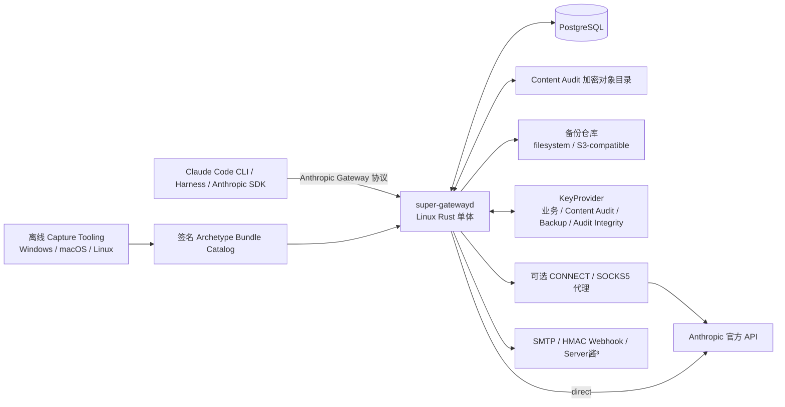
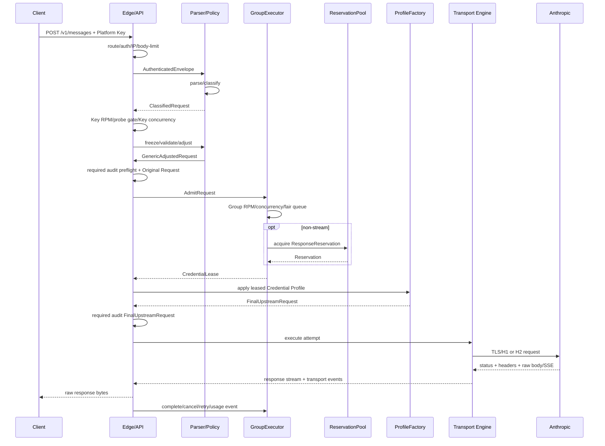

# Claude Code 企业网关技术架构

> 文档状态：详细设计基线  
> 产品基线：[Claude Code 企业网关功能模块规划](./functional-modules.md)  
> 传输基线：[Rust Transport Spike](./transport-poc.md)  
> 验收依据：[Rust Transport Spike 最终验收报告](./transport-spike-report.md)  
> 目标版本：首个可交付单实例版本

## 1. 文档目的与决策权威

本文把已经收口的 18 个产品功能模块转换为可编码的 Rust 单体架构，回答组件如何分层、状态由谁持有、请求如何流转、资源何时申请与释放，以及什么证据允许版本进入生产。

决策优先级如下：

1. [功能模块规划](./functional-modules.md)中的“已确认产品决策”和“一致性约束”定义产品语义，本文不得放宽。
2. 本文定义实现边界、运行时所有权和依赖方向；与上位规划冲突时以上位规划为准并修订本文。
3. [Transport Spike](./transport-poc.md)及其[验收报告](./transport-spike-report.md)定义当前传输层已验证能力和发布 blocker。
4. 后续数据库 Schema、API 字段和代码可以细化本文，但改变平台定位、客户端合同、安全边界或资源释放语义时，必须先回到产品规划重新确认。

本文覆盖首个单实例交付版本。多实例共享状态、Redis、owner 自动故障转移、多 Provider、模型自动切换、商业余额计费、响应 Body/SSE 改写仍按上位规划延后。

## 2. 架构结论

1. 生产部署单元为一个 Linux Rust 单体应用和 PostgreSQL；代理池、Content Audit 对象目录和外部备份仓库按功能配置接入。
2. 单体内部使用明确的领域边界，不让 HTTP Handler、SQL Repository、调度状态和传输连接互相穿透。
3. 每个 Credential Group 在进程内只有一个逻辑 `GroupExecutor` 单写者。它拥有 Credential 运行时状态、公平队列、Session/Agent affinity、Lease 和重试编排；长时间网络 IO 不在单写者事件循环内执行。
4. 每个客户端请求由独立 `RequestTask` 驱动。任务冻结配置快照，向 GroupExecutor 申请 Lease，再通过进程内唯一 `TransportCore` 调用匹配 Bundle 的 `CompiledTransportEngine`；每次连接/请求由短生命周期 `TransportTask` 执行，结果和释放事件回送 owner。
5. PostgreSQL 是配置和持久事实的权威来源；在途请求、队列位置、活跃 Lease、连接池、HPACK/TLS session 状态、临时响应缓冲和 Tokio task 不持久化。
6. 所有可热更新规则通过不可变 Snapshot 和原子 Active 指针发布。单个请求在入口冻结通用配置版本，重试和跨 Credential attempt 不切换这些版本；Credential 专属 Profile/Egress 则由每次 Attempt 按所选 Credential 独立冻结。
7. `GenericAdjustedRequest` 是跨 attempt 的稳定业务请求；`FinalUpstreamRequest` 必须按每次选中的 Credential Profile 从前者重新构造，禁止在上一凭据的最终报文上做增量替换。
8. 真正来自 Anthropic 的响应 Body/SSE 保持原始字节。平台只消费内部所需 Header 和旁路 usage，不在主响应流中解析、重排或补充事件。
9. 并发、排队、Lease、Reservation 和连接所有权全部使用类型化令牌及幂等终态，避免取消、超时和响应完成竞态导致重复释放或资源泄漏。
10. Transport Bundle、二进制和数据库迁移分别有独立的验证、激活和回滚路径；没有匹配证据时失败关闭，不回退到默认 TLS 栈冒充目标 Profile。

## 3. 系统上下文与部署拓扑



部署约束：

- 数据面、管理 API、管理控制台静态资源、Group owner Executor、Credential Maintenance、`TransportCore` 和后台任务都在同一 `super-gatewayd` 进程内。
- 上位规划中的逻辑 `Transport Worker` 在首版落地为一个进程内 `TransportCore`、多个不可变 `CompiledTransportEngine` 和按 Attempt 创建的 `TransportTask`，不是另一套常驻服务；Linux 单体加载各 OS 经采集验证的 Bundle，重放对应传输特征。
- PostgreSQL 是唯一强依赖的外部在线数据服务；首版没有 Redis、消息队列或服务发现。
- proxy Egress 是可选能力。没有代理池时，Group `auto` 为新 Credential 分配服务器 direct Binding；已经激活的 Binding 不随代理池变化。
- Windows、macOS、Linux Capture Tooling 只在研发或发布环境按需运行，生成签名 Bundle；它们不属于生产请求链，也不要求长期运行。
- Content Audit 对象目录只有在策略允许或要求全文审计时使用；普通非流式响应临时文件使用独立专用目录，二者的密钥、生命周期和恢复语义不同。
- 生产至少配置一个异机或异存储备份副本。备份仓库故障保持数据面 ready，但进入 critical 告警和灾备 SLO。

## 4. 单体内部组件

| 内部组件 | 主要职责 | 对应功能模块 |
|---|---|---|
| `DataPlaneRouter` | 北向路由、请求 ID、基础 Header 合同、连接取消信号 | 01、03 |
| `AccessService` | Platform Key 校验、端点权限、IP allowlist、Key RPM/并发 | 02 |
| `ClientClassifier` | 识别 `claude_code_cli` 与 `non_claude_code_cli`，提取 Session/Agent 线索 | 01、04 |
| `RequestParser` | 有界读取、JSON 结构解析、内部 DTO、未知路径/Method 分流 | 04 |
| `CapabilityEngine` | Model Capability Snapshot 编译、字段校验、冲突隔离 | 05、07 |
| `PolicyEngine` | Group Enforcement、RuleSet、System 策略、后台流量分类和通用调整 | 06、08 |
| `ExecutorRegistry` | Group → owner Executor 映射、生命周期、排空和不可用判定 | 03、17 |
| `GroupExecutor` | 公平队列、Credential 资格与评分、Session/Agent affinity、Lease、retry orchestration | 09、10、13 |
| `CredentialService` | Credential CRUD、全局账号去重、认证状态、Profile/Egress 激活 | 09、16 |
| `ProfileFactory` | Archetype 分配、Device Identity、Session 派生、最终上游 Header/Metadata | 11 |
| `TransportCore / CompiledTransportEngine` | BoringSSL、H1/H2、连接池、代理隧道、提交边界和取消 | 12 |
| `ResponsePipeline` | SSE 透明 relay、非流式原始缓冲、背压、客户端交付 | 14 |
| `UsageService` | usage、Price Snapshot、估算金额、订阅窗口和请求记录 | 15 |
| `CredentialMaintenance` | refresh、同账号重认证、Managed Browser Session、PLAN 采集 | 09、17 |
| `ControlPlane` | 管理 API、控制台、审批、发布、导出和手工操作 | 07、08、16 |
| `JobRuntime` | PostgreSQL 驱动的后台任务、周期扫描、幂等执行和失败重试 | 17 |
| `SecurityService` | secret envelope、内容审计、追加式审计链、权限和双人审批 | 18 |
| `ObservabilityHub` | Request/Attempt/Transport/Usage 事件、指标、日志、告警通知 | 15、18 |

组件之间只传递领域 DTO、句柄和事件，不传递数据库连接、Axum Request、SQL Row 或具体 TLS Stream。HTTP、SQL 和 BoringSSL 类型在各自适配层终止。

## 5. 代码组织与依赖方向

建议将生产工程组织为一个 Cargo workspace、一个生产二进制和少量边界清晰的 library crate。18 个产品模块不机械拆成 18 个 crate。

```text
super-gateway/
├── Cargo.toml
├── Cargo.lock
├── crates/
│   ├── gateway-domain/       # ID、值对象、状态机、事件、错误；无网络/SQL
│   ├── gateway-policy/       # 解析后的校验、Capability、RuleSet、Profile 编译
│   ├── gateway-scheduler/    # GroupExecutor、公平队列、Lease、affinity、deadline
│   ├── gateway-transport/    # 从 transport-poc 升格的 BoringSSL/H1/H2/Egress
│   ├── gateway-storage/      # SQLx Repository、事务、加密对象/临时缓冲适配器
│   ├── gateway-services/     # Credential 维护、usage、后台任务、通知
│   ├── gateway-api/          # Axum 数据面/管理面、DTO、错误映射、控制台资源
│   ├── gateway-testkit/      # 固定时钟、合成 Anthropic、代理和故障注入器
│   └── super-gatewayd/       # composition root、配置、启动、drain、systemd
├── crates/gateway-storage/migrations/
├── web/                      # 管理控制台源代码或构建产物
└── tests/                    # 契约、场景、soak 和发布门禁
```

依赖规则：

```text
gateway-domain
    ↑
gateway-policy   gateway-scheduler   gateway-transport
    ↑                 ↑                    ↑
gateway-storage  gateway-services     gateway-api
           \          |               /
                 super-gatewayd
```

- `gateway-domain` 不依赖 Tokio、Axum、SQLx、BoringSSL 或具体日志库；状态机可使用纯单测和模型化测试。
- `gateway-policy` 不读取数据库和网络，只消费已编译 Snapshot、请求 DTO 和 Profile 输入。
- `gateway-scheduler` 使用抽象时钟和事件接口；持久化通过 Repository port，网络执行通过 Transport port。
- `gateway-transport` 不查询 Group、Key、用户或价格，不决定重试，也不持久化 Credential token/Body。
- `gateway-storage` 实现 Repository 和对象存储 port，不包含业务调度判断。
- `gateway-api` 只做协议适配和请求生命周期驱动，不直接运行 SQL 调度查询或拼装 TLS 配置。
- `super-gatewayd` 是唯一 composition root，负责装配具体实现、启动顺序和生命周期。
- `transport-poc` 的验证 crate 在迁移完成前保留；可复用类型和执行路径逐步移入 `gateway-transport`，证据生成工具继续作为发布工具而非生产依赖。

## 6. 运行时所有权与并发模型

### 6.1 全局运行时

`AppRuntime` 持有只读或全局共享资源：

- PostgreSQL Pool 与 Repository 集合；
- Active 配置目录和 Snapshot Cache；
- `ExecutorRegistry`；
- Transport Engine 与按完整 Pool Key 分片的连接池；
- 全局实例缓冲 `ReservationPool`；
- Key RPM/并发、Models RPM 和 health IP limiter；
- JobRuntime、通知分发器、指标注册表和生命周期 token。

全局对象通过 `Arc` 共享。可变业务状态不得集中在一个全局 `Mutex<HashMap<...>>`；它必须归属于下述明确 owner。

### 6.2 GroupExecutor 单写者

每个 active Group 对应一个 `GroupExecutor` task 和一个有界 command channel。该 task 是下列状态的唯一写者：

- Credential eligibility、并发、RPM、cooldown、quota pressure 和 half-open；
- Owner User → Platform Key → Base Session → Agent 公平队列；
- Session Slot、Agent affinity 和迁移结果；
- Credential Lease 的发放、转移、确认释放；
- Group 级并发/RPM 和队列容量；
- 当前 Group 配置版本及 drain 状态。

`GroupExecutor` 只进行内存状态转换和短数据库写入编排，不在事件循环中等待 Anthropic、OAuth、代理或客户端 IO。取得 Lease 后，执行权交还 `RequestTask`；完成、取消、429、连接故障和 usage 通过 command 回送。

### 6.3 RequestTask

每个已接受的 Messages 请求创建一个结构化并发任务。它拥有：

- 请求级取消 token；
- 冻结的 Access/Capability/Rule/Enforcement/Profile 选择上下文；
- `pre_upstream_queue_deadline` 和可选 `upstream_total_deadline`；
- Key/Group concurrency permit、可选 SessionActivityClaim、Response Reservation 和当前 Credential Lease；
- GenericAdjustedRequest、attempt 计数和客户端 commit 状态；
- ResponseBuffer 或 SSE relay 的唯一所有权。

任务终止时通过类型化 guard 归还资源。Drop 只作为兜底；正常路径必须显式提交终态事件，使 usage、审计和 owner 状态完整。

### 6.4 类型化资源令牌

至少定义以下不可复制令牌：

```rust
KeyConcurrencyPermit
GroupConcurrencyPermit
QueueTicket
SessionActivityClaim
ResponseReservation
CredentialLease
TransportStreamHandle
ResponseBufferOwner
```

令牌包含唯一 ID、generation 和原子状态。释放 API 幂等，但第二次释放必须产生内部 invariant violation 指标；不得静默把重复释放当作正常行为。

### 6.5 阻塞工作

- SQLx、Tokio socket 和文件 IO 使用异步接口。
- 密码学、Bundle 编译、大型规则编译、压缩证据比较等有界 CPU 工作进入专用 blocking pool。
- 浏览器自动化作为由单体管理的受限子进程/上下文运行，通过内部 adapter 通信，不占 Tokio core worker。
- 每类后台任务有独立 semaphore，禁止模型同步、导出或重算耗尽数据面运行资源。

## 7. 核心请求对象与冻结快照

### 7.1 请求对象演进

```text
RawRequestEnvelope
→ AuthenticatedEnvelope
→ StructuredRequest
→ ValidatedRequest
→ GenericAdjustedRequest
→ FinalUpstreamRequest(attempt scoped)
→ RawUpstreamResponse
```

| 对象 | 内容 | 生命周期与约束 |
|---|---|---|
| `RawRequestEnvelope` | Method、path、Header 顺序、受限 Body 字节流、peer、连接取消信号 | 只在 Edge；平台 Key 仍在独立敏感字段中 |
| `AuthenticatedEnvelope` | AccessContext、Key/Group ID、端点权限、请求 ID | 已移除北向认证 Header；不包含上游 Credential |
| `StructuredRequest` | 解析后的 Anthropic Messages DTO、未知字段树、原始 Body 句柄 | 解析失败前不创建业务资源 |
| `ValidatedRequest` | 模型、stream、能力诊断结果、客户端/流量分类、Session 线索 | 绑定冻结 SnapshotSet |
| `GenericAdjustedRequest` | 已执行通用 RuleSet、Group Enforcement 和 System 策略的稳定结果；引用 RequestTask 内存中的 `RequestReplayBody` | 在所有 attempt 间不可变；持久层只保存 digest、Snapshot 引用和 change-set metadata，不保存 Generic 正文 |
| `FinalUpstreamRequest` | 当前 Credential 认证、UA/Stainless、Attribution、Metadata、派生 Session、Profile 传输约束 | 只属于一个 attempt；不得用于其他 Credential |
| `RawUpstreamResponse` | status、按线序 Header、Body/SSE 原始字节流、传输时间点 | 主链不做 JSON/SSE 语义重写 |

请求 Body 默认只驻留 RequestTask 的 `RequestReplayBody`。未发生业务调整时优先引用原始业务 Body；一旦发生调整，使用版本固定的确定性 JSON serializer 生成 replay bytes。Generic 的数据库/审计投影不含这份正文。任何 token、Session HMAC、Device secret 类型必须禁止普通 `Debug`、禁止序列化到日志，并通过 secrecy wrapper 或等价类型控制暴露。

### 7.2 RequestSnapshotSet

请求在进入业务校验前冻结：

```rust
struct RequestSnapshotSet {
    access_policy_version: VersionId,
    group_config_version: VersionId,
    client_profile_version: VersionId,
    capability_snapshot_id: SnapshotId,
    ruleset_snapshot_id: SnapshotId,
    enforcement_snapshot_id: SnapshotId,
    background_catalog_version: VersionId,
    price_snapshot_id: SnapshotId,
}
```

- Snapshot 内容由 `Arc` 指向不可变已编译对象，请求只保存 ID 和引用，不复制大型规则树。
- 管理员发布新版本只原子切换 Active 指针；已进入流水线的请求、排队请求和重试继续使用旧引用。
- Capability runtime conflict 会隔离故障版本并回滚 Active 指针，但触发冲突的当前请求直接失败，不在请求内换 Snapshot。
- Credential Lease 另行冻结 `credential_id`、`token_version`、`profile_epoch`、`bundle_version`、`egress_binding_id` 和 `egress_epoch`。跨 Credential attempt 必须取得新的冻结集合。
- Price Snapshot 按请求接受时的有效版本写入 UsageObservation，历史成本不追溯重算。

## 8. Messages 端到端调用链



正常调用步骤：

1. Edge 生成平台 `request-id`，对路径执行统一鉴权语义；删除北向 Platform Key，之后任何内部对象都不再携带原值。
2. 完成 IP、Body 上限、解析、客户端分类和流量分类；请求不合格时在业务资源申请前结束。
3. 通过 Key Messages RPM 和 Probe/Background 专用 gate；需要正常执行的请求再申请 Key concurrency permit，该 permit 覆盖 Group/缓冲队列、上游执行和客户端交付。
4. 冻结 RequestSnapshotSet，运行 Model Capability、Group Enforcement 和 RuleSet，得到 GenericAdjustedRequest。
5. 若 full encrypted 审计生效，在调度前完成存储预检并持久化已剥离认证秘密的 Original Request。
6. 将请求发送给该 Group 唯一 owner Executor，按 Group RPM、并发、可选会话槽和公平队列准入。
7. 非流式请求在取得 Credential Lease 前获得实例 ResponseReservation；流式请求绕过该预算。
8. GroupExecutor 选择 Credential 并发放 Lease；ProfileFactory 从 GenericAdjustedRequest 构建本 attempt 的 FinalUpstreamRequest。
9. full encrypted 审计在首个上游字节前保存 FinalUpstreamRequest；首次提交前失败则结束并释放资源。
10. Transport Engine 依据 Profile/Bundle/Egress 建连或取池连接，并报告连接阶段、首字节、完整提交、响应 commit 和取消事件。
11. SSE 在 2xx Header 后立即 commit 并逐字节 relay；非流式先完整缓冲，再一次性进入客户端交付。
12. RequestTask 归集 Attempt、Usage、成本和交付结果，按终态释放 Lease、Reservation、Key permit 和队列资源。

## 9. 准入、限流与公平排队

### 9.1 Gate 顺序

Messages 采用固定 Gate 顺序，前序拒绝不得创建后序资源：

```text
route classification
→ Platform Key authentication
→ method / endpoint permission / IP allowlist
→ effective request-body limit
→ parse + client/traffic classification
→ Key Messages RPM
→ Probe/Background dedicated policy gate
→ Key concurrency hard limit
→ freeze + capability/policy validation
→ content-audit preflight + Original Request
→ owner Executor availability
→ Group RPM / Group concurrency / fair queue
→ non-stream ResponseReservation
→ Credential Lease
→ FinalUpstreamRequest audit
→ upstream connection / attempt
```

特殊端点：

- `/v1/models` 使用独立每 Key 60 RPM/burst 10，不占 Messages RPM、Key 并发、Group 队列、Session/Agent 或 Lease。
- `/healthz`、`/readyz` 使用独立来源 IP 120 RPM/burst 20，不读取 Platform Key 或业务容量。
- `/v1/messages/count_tokens` 不注册路由；异常 Key 为统一 401，有效 Key 为未知路径 404。
- Body 超限发生在完整 JSON 解析前，返回 413，既不获取 Key permit，也不留下 Body。

### 9.2 Key 限制

- Messages RPM：默认 60、burst 10；超限在并发申请前立即返回 429。
- 并发硬上限：每 Key 默认 5，逐 Key 配置；计入执行中和已进入 Group/Reservation 队列的请求。
- 并发已满立即返回 429，默认 `retry-after: 2`，不进入任何平台队列。
- `KeyConcurrencyPermit` 在客户端响应交付或取消终态释放；上游 Lease 可能更早或稍晚释放，二者不得绑定为同一 permit。

### 9.3 Group 与实例队列

- Group 并发和 RPM 默认不限制；启用后由 GroupExecutor 执行。
- Credential 默认并发 5、Messages RPM 60；Credential RPM 只依据明确上游证据向下收紧。
- Group 公平队列容量默认不超过有效并发的 2 倍；满时立即返回 503、默认 `retry-after: 2`。
- Group 等待超时返回 503、默认 `retry-after: 5`；Group RPM 等待超时返回 429、默认 `retry-after: 5`。
- 非流式实例 Reservation 默认按单响应硬上限 64 MiB 记账，总预算 2 GiB，形成 32 个保障槽；等待队列默认 64。
- Reservation 等待使用独立的 Owner User → Platform Key 两级 work-conserving 队列，防止一个 Group 或 Key 占满实例缓冲；它与 Group 队列共用同一请求 deadline。
- Group RPM、Group concurrency 和 Reservation queue 共用一个绝对 `pre_upstream_queue_deadline`，默认 30 秒。进入下一队列只继承剩余时间。
- 标准实现顺序为 Group RPM → Group concurrency → Reservation。已经取得 Group concurrency slot 后等待 Reservation 的请求仍属于 Group 活跃准入，防止实例缓冲过载时继续扩大 Group 放行面；不持有 Credential Lease。

### 9.4 公平调度器

队列使用四级 deficit round-robin 或等价 work-conserving 算法：

```text
Owner User → Platform Key → Base Session → Agent
```

- 每层只在其非空子节点间轮转；空节点立即移除。
- 单请求是最小执行单元，不为历史 Session 预留并发。
- main 与 subagent 作为不同 Agent 排队，不设置单 Session 并发上限。
- 调度器必须持续利用空闲 Credential；公平不等于人为限制某 Session 只能占用固定比例。
- 取消通过 `QueueTicket queued → granted | cancelled` 原子转换，取消和授予只能一个成功。
- 固定时钟测试必须验证多用户、多 Key、多 Session、多 Agent 均无饥饿，并覆盖 3 Credential、10 客户端、每客户端 4 并发等压力场景。

## 10. Session、Agent 与 affinity

### 10.1 身份层次

```text
Platform Key
└── Base Session
    ├── main Agent
    └── subagent-1 ... subagent-N
```

- Base Session 优先从 `X-Claude-Code-Session-Id` 提取，其次使用新版 `metadata.user_id.session_id`，再兼容 legacy `_session_<UUID>`。
- Agent ID 从已验证客户端信号提取；缺失时 main 使用稳定默认 Agent，严禁通过 Prompt 内容猜测。
- 完全缺少 Session 信号时，每请求生成独立 Request Trace，同时按 `Platform Key + 客户端类别` 取得可复用 Anonymous Base Session。Trace 不作为上游 Session。
- 一个 main 加 9 个 subagent 是 1 个 Base Session、10 个 Agent、最多 10 个并发请求。

### 10.2 会话槽

- Credential 会话槽功能必须实现，默认关闭；管理员启用时设置 `max_active_sessions`。
- 槽按 Base Session 计数，main/subagent 不额外占槽；该 Session 全部活跃请求结束后空闲 30 分钟释放槽。
- 新 Session 等槽默认最多 5 秒；槽满不限制已经占槽 Session 内的 Agent 并发。
- Session 身份和 affinity 默认保留 24 小时；释放活跃槽不删除历史、派生身份或粘性记录。

### 10.3 Agent 级 affinity

键至少为：

```text
Platform Key + Base Session ID + Agent ID + model
```

- 默认 `preferred`：preferred Credential 仅因并发已满时短等 2 秒，之后可移植请求可 spill 到同 Group 其他 Credential。
- 临时 spillover、单次短 429 或普通负载均衡保持长期 affinity 原值。
- 持久故障、长窗口配额或成功迁移后才更新 affinity；原 Credential 恢复后不自动抢回。
- 同一 Base Session 的不同 Agent 可以落在不同 Credential，以提高凭据池吞吐；每个 attempt 使用所选 Credential 自己的完整 Profile 和派生 Session。

## 11. Credential 调度与 Lease

### 11.1 资格过滤

GroupExecutor 先执行硬过滤：

- Group active 且客户端类别、模型、认证大类满足 Group 约束；
- Credential active、认证有效、未处于 refresh/reauth 阻断；
- Profile active，Archetype Bundle 已加载且与 Engine 兼容；
- Egress Binding 健康，static 出口未漂移，proxy/direct 模式符合 Group；
- Credential 并发、RPM、5h/7d/model quota guard 和可选 Session Slot 有容量；
- 请求要求与 Credential thinking/cache/模型能力兼容；
- 请求不可移植时，仅保留其绑定 Credential。

所有 Credential 处于确定性不可用状态时立即返回 503，不进入无意义队列。只有存在合格 Credential 且其最早可信恢复时间落在剩余等待预算内，才排队等待；超出预算时立即返回 Group 级 429。

### 11.2 评分顺序

在同一优先级层内：

1. 命中健康 Agent affinity；
2. 新 Agent 比较 `max(5h, 7d, model)` quota pressure；
3. 比较当前并发占用与 RPM 压力；
4. 比较 Transport、Bundle 和 Egress 健康；
5. 使用管理员权重做确定性加权选择；
6. 稳定 tie-breaker 防止请求顺序造成抖动。

订阅 PLAN 只供展示、过滤和审计，调度代码的输入类型排除 PLAN 字段。

### 11.3 CredentialLease

Lease 至少包含：

```rust
struct CredentialLease {
    lease_id: LeaseId,
    request_id: RequestId,
    group_id: GroupId,
    credential_id: CredentialId,
    token_version: u64,
    profile_epoch: u64,
    bundle_version: u32,
    egress_binding_id: EgressBindingId,
    egress_epoch: u64,
    acquired_at: Instant,
    generation: u64,
}
```

- Lease 是 Credential 并发的唯一计数凭证；数据库记录不是实时锁。
- owner 发放前原子递增运行时计数，释放事件按 `lease_id + generation` 幂等处理。
- 跨 Credential 重试先结束旧 Lease，再申请新 Lease；不得同时持有两个业务 Lease 做 speculative racing。
- 流式/非流式客户端取消时 Key permit 立即释放，Lease 等待 Transport 确认关闭或默认 2 秒取消宽限到期后释放。
- 非流式 Body 完整接收后立即释放 Lease，客户端交付继续持有 Key permit 和 Reservation。

### 11.4 混合认证池

Group 默认使用同一认证大类。显式混合时 OAuth/Setup Token 为主池，Console API Key fallback 默认关闭；启用后只在订阅池容量耗尽时使用，并保持 Agent 的长期 affinity。所有切换仍受最多 3 attempts、请求可移植性和客户端未 commit 约束。

## 12. 请求治理与 Profile 应用

### 12.1 通用治理阶段

PolicyEngine 只处理与具体 Credential 无关的业务语义：

- 模型授权与 Capability 字段校验；
- Group Enforcement、RuleSet 继承和显式请求调整；
- System `preserve|strip_client|replace|strip_all` 已发布策略；
- 参数删除、默认补充或格式修正；
- Background/Probe 分类及 observe/throttle/reject；
- 请求可移植性判定。

模型 ID 首版不自动改写。未知字段在 compatible 模式透传、strict 模式拒绝；动态模型差异通过版本化 Capability Snapshot 表达，不在代码中累积模型名条件分支。

`strip_all` 的 GenericAdjustedRequest 直接省略顶层 `system`。ProfileFactory 不得随后恢复客户端 System 或擅自加入 System Attribution；任何 Attribution 是否存在必须服从冻结的 Group Enforcement 结果。

### 12.2 Profile 阶段

ProfileFactory 在每个 attempt 应用：

- Credential 类型对应的 Bearer/OAuth 或 `x-api-key`；
- 固定 Device/client ID、UA/Stainless、Metadata 结构与 Profile seed；
- 由 Credential Session HMAC 对规范化 Base Session 派生的稳定上游 Session ID；AgentId 只参与公平与 affinity，不进入上游 Session UUID；
- Environment Archetype 和 Bundle 版本；
- 固定 Egress Binding/epoch；
- Credential 级 Header、Attribution、cache/thinking 兼容要求。

Profile 只属于 Anthropic Credential。Platform Key、Client Profile、Group 和原客户端均不拥有上游 Profile。

上游 Session ID 的格式、字符集、长度、命名空间、字段位置和生命周期来自 verified Archetype 证据；HMAC 只用于把真实 Base Session 稳定映射到该合法格式，不凭空发明另一套可见规则。同一 Credential 的不同 Base Session 得到不同上游 Session，同一 Base Session 在保留期内保持稳定；main 与 subagent 仍作为不同 Agent 调度单元观测。

### 12.3 可移植性

普通自包含 Messages 请求默认可移植。请求引用 continuation、文件/容器 ID、账号绑定资源或尚未分类的扩展时标记不可移植。跨 Credential attempt 必须：

1. 继续使用同一 GenericAdjustedRequest 和 RequestSnapshotSet；
2. 获取新 Lease；
3. 从零应用新 Credential 的认证、Device Identity、Session 派生、Archetype 和 Egress；
4. 创建新的 AttemptRecord；
5. 只有在成功形成持久迁移时更新 Agent affinity。

不可移植请求在原 Credential 暂时不可用时进入有界短队列，截止后返回既定 503；不得把账号级资源 ID 发送给另一 Credential 试错。

## 13. TransportCore 与 CompiledTransportEngine

### 13.1 输入与输出合同

`TransportCore` 接收完整 attempt，不查询业务数据库；它选择不可变 `CompiledTransportEngine`，并创建 `TransportTask`：

```rust
struct TransportAttempt {
    request_id: RequestId,
    attempt_no: u8,
    profile: Arc<CompiledTransportProfile>,
    egress: EgressBindingSnapshot,
    request: FinalUpstreamRequest,
    deadlines: AttemptDeadlines,
    cancellation: CancellationToken,
}
```

输出为事件化结果：连接阶段、协商协议、首次请求字节、完整提交、响应 Header、原始 Body/SSE chunk、usage 旁路观察、取消确认、连接回池/逐出决定和结构化 TransportError。

### 13.2 协议实现

- TLS：BoringSSL，根据签名 Bundle 应用 ClientHello、Cipher、Supported Groups、KeyShare、Extension、ALPN 和 framing 约束。
- HTTP/1.1：低层有序 writer，保持请求行、Header 顺序/大小写和 Content-Length framing。
- HTTP/2：可控 transport，按 Bundle 处理 SETTINGS、WINDOW_UPDATE、pseudo-header、Stream 生命周期和取消。
- 上游仅连接 Anthropic 官方 authority；Host/SNI 重构为 `api.anthropic.com` 或官方批准的精确目标。
- proxy 先完成 CONNECT/SOCKS5，再在隧道内由 Engine 进行端到端 TLS；代理不得终止 TLS。
- 首版没有 Anthropic 南向 WebSocket，也不做 WS/SSE 互转。

### 13.3 完整 Pool Key

```text
Credential ID
+ Profile epoch
+ Archetype Bundle version
+ Egress Binding ID / egress epoch
+ destination authority / SNI
+ negotiated protocol
```

不同完整键不得共享已认证连接、TLS Session Cache、Session Ticket Store、H2 connection 或 HPACK 动态表。Base Session 和 Agent 不进入 Pool Key，因此同一 Credential 的不同会话可在容量允许时复用连接，但保留各自上层 Session Header/Metadata。

TLS Session Resumption 能力保留、默认关闭；当前不分配 Ticket Store。管理员启用前必须实现按完整 Pool Key 分域的 store，并通过同 Credential resumed 成功及跨域零恢复的 reference/replay 门禁。

### 13.4 Egress 与错误归因

- `auto|proxy_required|direct` 只在 Credential 创建或显式重绑时决定 Binding。
- 一个代理默认最多绑定 5 个 Credential；共享出口不共享连接池、并发、RPM、Profile 或 Session。
- 首版不设置代理级总并发/RPM；容量仍由 Platform Key、可选 Group 和各 Credential 的限制控制。代理健康只决定其绑定 Credential 的传输资格。
- 活动 Credential 不在单请求中临时换出口。proxy A → proxy B 或 proxy ↔ direct 必须显式重绑、同时递增 `egress_epoch` 与 `profile_epoch` 并审计；profile epoch 的变化用于淘汰旧 PoolKey，不改变 Device Identity。
- CONNECT/SOCKS5 407/认证错误归为 `proxy_authentication`，不污染 Anthropic Credential 认证状态。
- 隧道建立后发生证书替换、TLS 终止或 ALPN 破坏归为 `unhealthy_tls_passthrough`。
- DNS、connect、tunnel、TLS、Bundle 故障按 resolver/direct/proxy/Bundle/Anthropic incident 分域维护，不通过 token refresh 修复网络故障。

### 13.5 已验证基线

Windows Claude Code 2.1.241 当前 H1 cohort 已完成：

- 20/20 fresh official/controlled reference；
- 20/20 TLS Replay 与 H1 Replay；
- `ReadyForCanary / blockers=0` 联合证据审计；
- 17/17 pooled、idle、Pool Key、direct/CONNECT/SOCKS5、P06/P07 和 C01–C06 Transport Matrix。

该证据只解锁绑定的 Windows Bundle。Linux 原生发布门禁以及 macOS/Linux Archetype 证据仍按各自环境完成，不得把 Windows PASS 外推成全部 Archetype PASS。

## 14. Attempt、连接恢复与重试

### 14.1 三层记录模型

一次北向调用只创建一个 `RequestRecord`，但可以产生多条 Attempt 和连接记录：

```text
RequestRecord 1
├── 0..3 AttemptRecord              实际向 Anthropic 提交的 Messages attempt
└── 0..3 ConnectionAttemptRecord    单请求的新连接恢复预算
    └── 0..1 promoted AttemptRecord 写出首个上游请求字节后建立链接
```

- `ConnectionAttemptRecord`：DNS、代理隧道、TCP、TLS、ALPN 和 H1/H2 新建连接过程；尚未向 Anthropic 发送当前请求字节时，不消耗 Messages attempt。健康池连接复用只记录 TransportEvent，不消耗新连接恢复预算。
- `AttemptRecord`：Credential Lease 已确定，且 Engine 写出首个上游请求字节时创建；当前 ConnectionAttempt 如存在则以 `promoted_attempt_id` 链接该记录，并保存所用 Credential、Profile、Bundle、Egress 和 Snapshot 版本。
- `RequestRecord`：聚合最终状态、客户端提交状态、总耗时、总 usage、估算成本和所有子记录。

单个 Request 的新连接恢复预算总计最多 3 条 ConnectionAttemptRecord；后续 Messages retry 只使用尚余预算。连接错误必须先按 resolver、proxy、TLS、Bundle 或 Anthropic endpoint 分类；只有同一完整 Pool Key 下可安全恢复的错误才继续尝试。

### 14.2 提交点与重试边界

Transport Engine 必须发出以下单调事件：

```text
connection_ready
→ first_upstream_request_byte
→ upstream_request_complete
→ upstream_response_headers
→ first_response_body_byte
→ upstream_response_complete
```

`first_upstream_request_byte` 是实际 Messages attempt 的计数点。平台不得根据“请求可能没有到达 Anthropic”推测性回退计数；只要已写出首字节，就按一次真实 attempt 处理。

重试必须同时满足：

1. 客户端响应尚未 commit；
2. 请求分类允许重试；
3. 实际 Messages attempt 少于 3；
4. 剩余总 deadline 至少为 5 秒；
5. 下一 Credential/Bundle/Egress 处于可调度状态；
6. Body 可重放，且从冻结的 GenericAdjustedRequest 重新构造。

流式响应在 2xx Header 向客户端提交后终止重试资格。非流式响应只有在上游完整 Body 被平台接收并通过大小校验后才向客户端 commit，因此可在此前执行合规重试。

### 14.3 不同错误的处理序列

| 错误 | 默认动作 | 是否可跨 Credential |
|---|---|---|
| DNS/TCP/代理隧道/TLS，且尚未写出上游字节 | 先在当前 Attempt 内做连接恢复；耗尽后结束当前 Lease | 仅可移植请求可重新调度 |
| 401 | 对当前 Credential 发起 singleflight refresh，再用同 Credential 重试一次 | 同账号恢复仍失败且请求可移植时，最后一次可换 Credential |
| 429 | 消费可靠 `Retry-After`，标记 Credential 冷却并重新调度 | 可移植请求允许；不可移植请求等待原 Credential |
| 500/502/503/504/529 | 在总 deadline 内做有界退避 | 可移植请求允许 |
| 400/403/404/409/422 | 视为确定性响应，原样返回 | 否 |
| 已向客户端 commit 后的中断 | 关闭/复位响应通道并记录 partial | 否 |

401 的默认序列为：Attempt 1 → 同 Credential refresh → Attempt 2；若仍为 401、请求可移植且仍有 attempt 预算，Attempt 3 才可换到其他 Credential。refresh singleflight 的等待者复用同一次结果，避免一批 401 同时刷新。

429 冷却优先采用可解析且可信的上游 Header；缺失或异常时按连续次数使用 60 秒、120 秒、300 秒、900 秒的默认阶梯，单次默认最长 15 分钟。成功响应或管理员显式解除可重置连续计数；冷却状态持久化，进程重启后继续生效。

5xx/529 使用带抖动的短退避，并受 `upstream_total_deadline` 约束。平台不把模型错误、参数错误或配额永久耗尽伪装成网络重试。

### 14.4 Deadline 预算

- 建连：`upstream_connect_timeout` 默认 5 秒，Group 可配置 1–30 秒；每次 ConnectionAttempt 独立受限，同时服从总 deadline。
- 非流式上游：从第一个 Attempt 写出首个请求字节起计算共享的 `upstream_total_deadline`，默认 300 秒，所有 attempt 共用。
- 流式上游：不设总流式持续时长；相邻上游字节之间使用 `stream_upstream_idle_timeout`，默认 30 秒，可配置 5–600 秒。
- 客户端取消：向 transport 发出取消后给予默认 2 秒 `cancel_grace`，随后逐出 H1 连接或 reset H2 stream。

重试调度只使用剩余预算，不为新 Attempt 重新获得完整 300 秒。

## 15. 响应透传、缓冲与背压

### 15.1 透明原则

Anthropic 成功或错误响应的 Body/SSE 字节保持原始顺序与内容。平台只在 Header 层处理 hop-by-hop 字段、安全字段和限流可见性：

- Anthropic 的 Credential 级限流 Header 进入内部 Credential 状态与遥测，不直接暴露给客户端；
- 客户端接收平台计算的 Platform Key/Group 级限流信息；
- 上游原始 HTTP 状态码和 Body 保留；
- 平台自身错误使用 Anthropic 兼容错误包络，并带统一 `request_id`；
- 不解压、重压或重编码 `Content-Encoding` Body，避免改变原始字节。

旁路 usage 解析只能观察已透传字节，不参与 Body 构造；解析失败只把 usage 标为 unknown，不影响响应转发。

### 15.2 SSE 流式路径

```text
Anthropic socket
→ bounded pending window（默认 1 MiB）
→ client socket
```

pending window 到达上限时暂停上游读取，由 TCP/H2 flow control 形成背压，不继续无界缓存。客户端连续 120 秒没有完成任何写进度时触发 `client_stream_write_idle_timeout`：

1. 标记 Request 为 `client_delivery_timeout`；
2. 取消上游 stream；
3. H1 按污染状态逐出连接，H2 reset 当前 stream；
4. Key/Group permit 与 Session 活跃引用在请求终态立即释放；Lease 等待 Transport 取消确认或 2 秒宽限到期后释放；
5. 记录已观察 usage 为 complete、partial 或 unknown。

流式响应没有客户端总交付时长，只要持续有写进度即可继续。平台不会在已提交 SSE 后追加自定义错误事件。

### 15.3 非流式响应缓冲

非流式响应先完整接收后再向客户端提交，状态为：

```text
memory_buffer
→ encrypted_temp_file（超过 8 MiB）
→ ready_to_deliver
→ delivering
→ released
```

- 内存阈值：8 MiB；超过后迁移到本机加密临时文件。
- 单响应硬上限：64 MiB；超过即终止上游，返回平台 500，且不重试。
- 实例缓冲预算：2 GiB，以 64 MiB `ResponseReservation` 预留，默认同时 32 个 Reservation。
- Reservation 等待队列默认最多 64 个；Admission 超限或排队超时按资源拥塞返回。
- 客户端交付：写空闲默认 120 秒，总交付默认 300 秒。

Credential Lease 在上游 Body 完整落盘/落内存后释放；`ResponseReservation`、Platform Key permit 和已启用的 Group concurrency permit 持有到客户端交付结束或丢弃完成，防止慢客户端绕过实例、Key 或 Group 的硬上限。

临时文件使用每文件随机数据密钥加密，关闭后立即删除；启动时清理上次异常退出遗留文件。响应临时缓冲与内容审计是两个独立存储域，前者不得被当作审计留存。

### 15.4 Header commit

- 流式：收到可转发的上游响应 Header 并建立客户端 Body writer 后 commit。
- 非流式：上游完整 Body、长度限制和临时文件落盘完成后 commit。
- 平台在 commit 前决定全部可见 Header；commit 后不再改状态码或添加平台错误 Body。
- 客户端断开与上游中断分别记录，避免把客户端网络问题计为 Anthropic 错误率。

## 16. 取消状态机与资源释放

### 16.1 Request 生命周期

```text
accepted
→ parsed
→ key_permitted
→ queued
→ reserved
→ leased
→ connecting
→ submitting
→ submitted
→ receiving
→ ready_to_deliver
→ delivering
→ finished
```

流式响应从 `receiving` 直接进入 `delivering`；非流式必须先经过 `ready_to_deliver`。任一非终态可接收 cancel/deadline/failure 事件，并进入 `cancelling → finished`。

关键竞态使用单一所有者和 compare-and-transition 处理：

- `queued → granted | cancelled`：GroupExecutor 只有一个分支获得 QueueTicket；
- `leased → submitting | cancelled`：开始上游提交和取消只有一个分支获胜；
- `receiving → ready_to_deliver | discarding`：非流式完成和客户端断开互斥；
- `ready_to_deliver → delivering | discarding`：客户端 writer 和清理任务互斥；
- `delivering → finished | cancelling`：结束与超时只产生一个终态。

### 16.2 资源释放矩阵

| 取消/失败阶段 | QueueTicket | Reservation | Lease | Transport | Key/Group permit |
|---|---|---|---|---|---|
| Key permit 前 | 无 | 无 | 无 | 无 | 无 |
| 公平队列中 | 撤销并推进下一项 | 若已获则释放 | 无 | 无 | 请求终态释放 |
| 等 Reservation | 撤销等待 | 释放/取消等待 | 无 | 无 | 请求终态释放 |
| 已 Lease、尚未写上游字节 | 已消费 | 释放 | 归还且不计 attempt | 取消建连 | 请求终态释放 |
| 已提交、响应未 commit | 已消费 | 非流式在丢弃后释放 | 取消确认/宽限到期后归还 | H1 逐出或 H2 reset | 客户端取消终态立即释放 |
| 流式已 commit | 已消费 | 不适用 | 上游终止后归还 | 停读并取消 | 客户端 writer 终态释放 |
| 非流式交付中 | 已消费 | 交付/丢弃后释放 | 已释放 | 已结束 | 交付/丢弃终态释放 |

所有资源句柄都由 RequestTask 的 `ResourceLedger` 登记。`SessionActivityClaim` 随请求终态减少活跃引用，引用归零后由 30 分钟 idle timer 释放可选 Session Slot；它不删除 affinity。显式释放和析构兜底均为幂等；重复释放保持计数原值，但必须产生 `resource_invariant_violation` 遥测。任何 permit/Lease 都不得只靠异步日志任务释放。

### 16.3 协议级取消

- H1：若请求/响应边界尚未完整消费，连接状态视为污染并逐出；只有已确认消息边界完整时才允许回池。
- H2：发送 `RST_STREAM(CANCEL)`，保留连接；若连接级状态异常则关闭整个 connection。
- 代理隧道：关闭 tunnel socket；不得把取消当作代理健康失败。
- 已向客户端 commit：只结束连接/stream，保持已经发送的字节；不构造第二个错误响应。

### 16.4 记账终态

Request 只能写入一个终态：`succeeded | upstream_error | platform_error | cancelled_by_client | deadline_exceeded | client_delivery_timeout`。usage 使用 `complete | partial | unknown` 三态；费用只基于已确认的 usage 计算，partial/unknown 单独展示，不猜测成精确账单。

## 17. 数据归属与持久化边界

### 17.1 数据分层

| 数据域 | 权威位置 | 进程内形态 | 恢复方式 |
|---|---|---|---|
| User、Platform Key、Group、成员关系、策略版本 | PostgreSQL | 版本化只读 Snapshot | 启动/热加载重建 |
| Credential secret、refresh token、Browser Session | PostgreSQL 密文 | 最小生命周期 Secret 容器 | 解密后按需使用 |
| Profile、Device Identity、Egress Binding、epoch | PostgreSQL | Attempt 冻结 Snapshot | 版本重载 |
| Bundle 元数据、签名和证据索引 | PostgreSQL | Bundle Catalog | 从 Bundle Store 校验加载 |
| Bundle 二进制 | 本机只读 Bundle Store | `Arc<CompiledTransportProfile>` | 按 hash/签名重载 |
| GroupExecutor 队列、Lease、permit、affinity 热状态 | 内存 | 单所有者状态 | 重启后按持久事实重建/自然失效 |
| Credential 冷却、认证状态、token version | PostgreSQL | 热缓存 | CAS 加载并续用 |
| Request/Attempt/Connection/Usage 记录 | PostgreSQL | 有界异步批处理 | durable flush/outbox 补偿 |
| 非流式响应临时缓冲 | 加密临时目录 | Reservation owner | 交付后删除；启动清扫 |
| 内容审计正文 | 独立加密 Audit Store | 短暂加密 writer | 按审计策略恢复 |
| 通知、后台任务 | PostgreSQL job/outbox 表 | worker lease | 重试与租约接管 |
| Backup、Audit Integrity key | 数据库外 KeyProvider | 短生命周期句柄 | 外部密钥恢复流程 |

in-flight 请求、Socket、QueueTicket、Credential Lease 和客户端 writer 不持久化。进程异常退出后由客户端重试；平台不得从数据库推测并续接半个 SSE。

### 17.2 事务边界

- Platform Key 创建：lookup digest、可再次展示的 envelope ciphertext、owner 和 Group 绑定在同一事务提交。
- Credential 创建：全局 account UUID 去重、secret、Device Identity、Profile、Egress Binding 和初始状态原子提交。
- Profile/egress 迁移：新版本、epoch、审计事件和 active pointer 原子提交。
- token refresh：按 `token_version` compare-and-swap，防止过期刷新结果覆盖新 token。
- 管理配置发布：draft 校验通过后创建 immutable version，再原子切 active pointer。
- 业务变更和通知使用 PostgreSQL transactional outbox，避免配置已生效但通知永久丢失。

Request 主记录在接受请求后尽早落库；Attempt 在首个上游请求字节前形成记录。高吞吐字段可有界批量写入，但进程必须有 flush deadline 和丢失计数，不允许静默丢弃审计要求的记录。

### 17.3 Repository 边界

业务层只依赖按聚合定义的 Repository trait，不暴露 SQL row：

```text
AccessRepository
GroupRepository
CredentialRepository
ProfileRepository
PolicyRepository
RequestRecordRepository
AuditRepository
JobRepository
```

跨聚合操作由 service 明确开启事务；Repository 内不得隐式调用网络、Transport 或通知。具体表、索引、分区、保留期和 migration 顺序已在 [数据库设计](./database-schema.md) 中落定。

## 18. 配置、Snapshot 与热加载

### 18.1 不可变版本与 active pointer

RuleSet、Capability、Client Admission、Enforcement、Price、Background Catalog、Profile Bundle 和通知策略均使用不可变版本。编辑产生 draft，校验/编译后进入 eligible，管理员或自动 cohort 动作只切换 active pointer，不原地修改已被请求引用的版本。

每个 Request 在准入阶段冻结 `RequestSnapshotSet`；每个 Attempt 再冻结 Credential/Profile/Egress/Bundle 版本。热加载只影响之后创建的 Request/Attempt，不修改运行中的对象。

### 18.2 发布流水线

```text
draft
→ schema validation
→ semantic validation
→ compile
→ shadow
→ canary/cohort
→ active
→ retired
```

- Shadow 只记录“若生效会怎样”，请求保持原状。
- Canary 只作用于明确 Group/Platform Key/Credential cohort。
- Profile Archetype 升级只替换显式 cohort 的 Archetype 版本；Device Identity、Session 密钥和 Egress 保持稳定。
- 官方明确弃用的模型进入 `deprecated` 并停止新调用；从官方目录消失或确认失效时直接进入 `disabled`。两种状态都通知管理员且不再进入 `/v1/models` 可调用集合。
- 新发现模型先进入 `discovered`，管理员审核时进入 `reviewing`，并明确选择 `published` 或 `disabled`；系统不自动开放新模型。因消失而 `disabled` 的模型重新出现后重新走 reviewing/publish，`deprecated` 没有直接恢复边。
- 回滚切回上一个完整版本，不拼接两个版本的部分字段。

### 18.3 传播机制

PostgreSQL 是配置权威源。提交后发出 `LISTEN/NOTIFY` 作为低延迟提示，实例仍以周期性版本轮询校验权威状态，防止漏通知。Loader 完成签名、引用、兼容性和编译检查后，以 `ArcSwap`/等价原子指针发布新 Cache。

Group 相关运行时配置通过带 `config_version` 的命令送入对应 GroupExecutor；Executor 仅在版本更高且完整校验通过时替换状态。旧 Snapshot 通过引用计数自然回收，并设置最短保留期以支持 RequestRecord 回放与审计解释。

### 18.4 冲突与失败

- 管理写使用 revision/ETag 乐观锁；过期 revision 返回 409。
- Bundle 签名、目标平台或探针证据失败时保持旧 active 版本，新版本进入 quarantined。
- Profile/Egress epoch 不匹配时该 Credential 暂停调度，不以旧 Worker/新出口混搭。
- 部分配置加载失败不产生“半发布”；active pointer 仍指向上一完整版本。
- 热加载失败发通知和审计，但只要现有 serving snapshot 健康，实例继续 ready。

## 19. Credential 自动维护

### 19.1 状态与所有权

Credential 的运行时状态归 Group owner Executor；持久状态由 CredentialRepository 管理。维护动作按 Credential singleflight，保证同一时刻只有一个 refresh、重认证、PLAN 探测或 egress 健康状态转换在提交结果。

```text
pending_profile / pending_egress / pending_reauth_strategy
→ active
→ refreshing | limited/cooldown | reauth_retrying | reauth_waiting_egress | transport_unavailable
→ active | manual_recovery_required | needs_admin_reauth | auth_broken | disabled/revoked/archived
```

token refresh、同账号静默重认证和 owner 迁移均保留 Device Identity、Session HMAC、Profile seed、Archetype 与 Egress。不同账号必须走新增 Credential 流程，获得新 Profile。

### 19.2 Token refresh

- 定时维护按 expiry 提前刷新并加入随机抖动，避免同刻风暴。
- 请求触发 401 时进入高优先级 singleflight；等待者共享结果。
- 管理员手工发起重认证时复用同一维护状态机和 account UUID 校验；常规情况下由系统定时或 401 自动触发。
- 刷新结果提交前校验 account UUID、Credential ID 和 `token_version`。
- refresh 成功只递增 token version；失败按可恢复性进入退避或重认证。
- 维护流量不占 Platform Key Messages RPM/并发，也不作为 Claude Messages 测活请求。

### 19.3 Managed Browser Session 静默重认证

当 refresh token 失效而该 Credential 的 Managed Browser Session 仍有效时，平台可启动受管浏览器完成官方授权/consent，取得新 token。它是浏览器会话续权，不是保存账号密码后模拟登录。

- 浏览器 context、Cookie/storage 密文只属于该 Credential；
- Credential 有代理绑定时，浏览器全流程使用同一固定代理；未绑定时走 direct；
- 平台不自动处理密码、OTP、TOTP、Passkey 或企业 SSO challenge；遇到交互 challenge 转为提醒管理员；
- 浏览器以按需子进程/context 运行，由单体管理生命周期，不形成常驻对外服务；
- 新 token 回写仍执行 account UUID 和 token version 校验。

refresh token 与 Managed Browser Session 都失效时，Fully Managed Credential 进入 `manual_recovery_required` 并退出调度；管理员直接重新走账号添加流程。平台不在旧对象上尝试换账号。

### 19.4 去重、PLAN 与适配器

- 新增账号先对所有 Group 做全局 account UUID 查重；存在时提示现有 Credential，不重复创建，也不隐式重认证。
- Setup Token 原文只作 Enrollment bootstrap，交换终态后销毁；交换所得 access/refresh material 保留 `setup_token_subscription` auth kind，并复用 token-version/refresh/CAS 机制。只有显式同账号认证迁移才改变 auth kind。
- OAuth Credential 使用 `oauth_profile` 适配器；Setup Token 使用 `claude_cli_bootstrap`，默认 24 小时刷新、48 小时 fresh/stale 窗口。
- 订阅 PLAN/等级只展示，不进入调度权重、并发、RPM 或优先级计算。
- PLAN 探测失败不影响 Messages 可用性；上次成功值带采集时间展示。
- Console API Key 没有订阅 PLAN 语义，显示 `not_applicable`。

## 20. 后台任务架构

### 20.1 Durable Job 与执行模型

关键后台任务使用 PostgreSQL `job` 表持久化，worker 通过 `FOR UPDATE SKIP LOCKED`/租约机制领取；即使首版单实例也保留租约、heartbeat、checkpoint 和幂等键，避免重启后重复副作用。短暂的缓存清理等可重建任务可只在内存调度。

```text
scheduled
→ leased
→ running
→ succeeded
       └→ retry_wait → leased
→ dead_letter / needs_attention
```

每个 job handler 必须声明：幂等键、最大并发、超时、重试阶梯、checkpoint、死信条件、审计级别和是否影响 Credential 调度。

### 20.2 任务类别

| 类别 | 典型任务 | 并发隔离 |
|---|---|---|
| Credential maintenance | refresh、Browser reauth、PLAN/额度采集 | 按 Credential singleflight，独立 semaphore |
| Config/catalog | 官方模型/能力目录、价格、Background Catalog | 独立低并发，不占数据面 permit |
| Transport evidence | Bundle 导入、签名校验、漂移探针、cohort 观察 | 按 Bundle/Archetype 隔离 |
| Operations | 临时文件清扫、分区维护、备份校验、恢复演练 | 运维池，支持 checkpoint |
| Audit/notification | 审计封链、通知 outbox 投递 | 独立 outbox worker |
| Usage | usage 聚合、金额估算、5h/7d 压力快照 | 只读/聚合池 |

长任务按页或 checkpoint 让出执行权；单个 job 不长期持有数据库事务。不同任务池设置独立 semaphore，Browser 或备份拥塞不得占满 refresh worker。

### 20.3 健康探测边界

平台不发送合成 Messages 测活，不利用生产 Credential 周期性创建临时会话。路径探测只做 DNS、TCP、CONNECT/SOCKS5、TLS/ALPN 和官方静态端点可达性，不携带 Credential；Credential 健康主要由真实业务结果和官方授权维护结果驱动。

客户端发来的短请求由 Background Traffic Classifier 按版本化目录识别，可采用 pass、throttle、reject 或隔离预算；默认不把所有短文本当测活。Classifier 决策属于真实请求路径，仍受 Platform Key 准入和审计。

### 20.4 失败与就绪关系

普通 job 失败不直接改变实例 `/readyz`。只有其结果使某个明确 serving 前提失效时，才按对象缩小影响域，例如 Bundle 验证失败隔离对应 Archetype，refresh 失败隔离对应 Credential。任务连续失败进入死信并通知管理员，不通过无限快速重试制造上游流量。

## 21. API 与错误边界

### 21.1 北向数据面

首版公开数据面固定为：

| 路由 | 鉴权 | 进入 Group/Lease | 说明 |
|---|---|---|---|
| `POST /v1/messages` | Platform Key | 是 | Anthropic Messages 兼容入口 |
| `GET /v1/models` | Platform Key | 否 | 使用独立 60 RPM/burst 10；展示平台可用模型 |
| `GET /healthz` | 无 | 否 | 仅表示进程存活 |
| `GET /readyz` | 无 | 否 | 表示实例可接收新流量 |

`/v1/messages/count_tokens` 仅内部使用，不作为北向能力。有效 Platform Key 访问时仍返回 404，避免客户端依赖尚未承诺的接口。未知业务路由执行最小鉴权后返回统一 404，不泄露管理路由或内部拓扑。

已知 `/v1/messages`、`/v1/models` 使用错误 Method 时，同样先校验 Platform Key；有效 Key 返回 405，并且 `Allow` 只列该路径承诺的方法。`HEAD`、`OPTIONS` 首版也按 405。未注册的 Count Tokens 路径始终走未知路由 404，不进入 405，也不出现在 `Allow`。

平台接受 Anthropic/Claude Code Gateway 协议，不增加 OpenAI 兼容层、Provider 路由参数或模型自动切换语义。

### 21.2 管理面与内部端口

管理 UI 调用版本化 `/admin/v1` API；本文件只固定边界，不提前冻结每个 CRUD 路径。管理 API 与数据面共享进程但使用独立 router、认证中间件、并发预算和审计策略。

内部组件通过 typed port 交互：

```text
AccessPort           GroupExecutorPort
PolicyCompilerPort   CredentialMaintenancePort
TransportPort        Repository ports
AuditPort            NotificationPort
BundleVerifierPort   KeyProviderPort
```

业务 service 不直接持有 Axum Request、SQLx row 或 Transport socket；适配器负责协议转换。这样可对状态机做确定性测试，并在保持单体部署的同时保留内部边界。

### 21.3 错误分类与映射

内部错误先归类，再由 Edge 在唯一位置映射：

| 内部类别 | 典型状态 | 北向行为 |
|---|---:|---|
| `authentication` | 401 | Anthropic 兼容错误包络 |
| `admission_rate` / `key_concurrency` | 429 | 带平台 `retry-after` 和 Group/Key 级信息 |
| `validation` / `capability` | 400/422 | 指向客户端可修复字段 |
| `queue_timeout` / `capacity` | 503 | 平台 request_id；不泄露 Credential 数量 |
| `upstream_response` | 原状态 | Header 安全过滤后，Body 原始透传 |
| `platform_internal` | 500 | 统一包络；详细 cause 只进内部日志 |

所有平台生成错误都复用响应 Header 与 Body 中同一个 `request_id`。代理地址、Credential ID、account UUID、Profile seed、Bundle 内部路径、SQL 错误和上游 token 不进入客户端错误。

### 21.4 请求大小与解析边界

Edge 在分配大对象前执行 Content-Length 和流式累计大小限制；原始 Body 只读一次并形成 `RawRequest`。JSON 解析、Unknown 字段保留、Capability 校验和 RuleSet 调整均在内存预算内完成。后续 Attempt 复用冻结的结构化对象/可重放 Body，不回读客户端 Socket。

### 21.5 内部 Token Estimate

`TokenEstimateService` 只消费已接受 Messages 的 GenericAdjustedRequest 和冻结 Snapshot，提供两种 Group 可配模式：

- `local_estimate`：使用版本化本地 tokenizer/估算算法；
- `console_api`：使用管理员单独配置的 Anthropic Console API Key 调用官方 Count Tokens，失败时可按策略进入 `local_fallback`。

订阅 OAuth/Setup Token 不用于 Count Tokens。内部 Console 调用使用独立 Group 预算，默认 60 RPM；不占 Platform Key 并发/Messages RPM、Group 公平队列、业务 Credential Lease，也不创建 Messages Attempt。首版 TPM 只观察，不以该估算结果拒绝业务请求。估算结果记录算法/来源/版本和误差状态，供 usage 展示与容量分析使用。

## 22. 遥测、审计与通知

### 22.1 统一请求视图

管理端的“请求记录”同时承载调用状态和使用量，不另造割裂的使用记录列表。核心记录为：

- `RequestRecord`：User、Platform Key、Group、Client Type、Base Session、Agent、排队、最终状态、usage、金额估算。
- `AttemptRecord`：Credential、Profile epoch、Archetype/Bundle、Worker engine、Egress/epoch、重试原因、提交点和响应状态。
- `ConnectionAttemptRecord`：direct/proxy、DNS、TCP、TLS、ALPN、协议、新建连接和失败域；健康连接取池只记 TransportEvent。
- `CredentialMaintenanceRecord`：refresh、重认证、PLAN/配额、冷却和状态迁移。
- `TransportEvent`：Pool Key 摘要、漂移、Bundle 证据、连接逐出原因。
- `AuditEvent`：管理动作、secret reveal、Profile/Egress 迁移、策略发布和双人审批。

用户只能查询、导出自己拥有的记录；管理员可查询、导出全局。首版没有 viewer 角色。

### 22.2 指标、日志与 Trace

- Metrics 使用有界 label：route、status_class、error_class、Group tier、client class、Archetype version；原始 User/Key/Credential/Session ID 不作为高基数 label。
- 结构化日志使用内部 ID 或不可逆短摘要关联，默认 metadata-only；secret、完整 Body、Cookie、Authorization 和代理密码强制脱敏。
- Trace 以 Request 为根，Attempt 与 ConnectionAttempt 分别作为子 span；某次建连写出首个上游请求字节后，用 link 关联其 promoted Attempt。SSE 只创建生命周期 span，不按 chunk 创建 span。
- usage、成本、PLAN、5h/7d 压力和上游限流是观测字段；其中 PLAN 不影响调度。
- 成本按已用 token 与对应模型的版本化价格快照估算，明确标记 `estimated`，不冒充 Anthropic 最终账单。

Credential 级 Anthropic 限流 Header 只更新内部状态。客户端遥测与 Header 展示 Platform Key/Group 层的剩余能力，避免暴露池规模及单凭据配额。

### 22.3 内容审计

默认只保存 metadata。生效模式由 Platform Key 的 `metadata_only|full_encrypted` 与 Group 的 `allow|require|forbid` 共同计算，Key 不得放宽 Group：

1. 生效为 full encrypted 时，调度前保存 Original Request；
2. 首个上游字节前保存首次 FinalUpstreamRequest；
3. 正文使用独立 KeyProvider 和独立加密 Audit Store；
4. 查看需双管理员审批，并记录理由、范围和过期时间；
5. Original 与首次 Final 任一步在首个上游字节前失败时终止对应请求；写出上游字节后，后续 retry Final 或响应旁路审计失败只记录 `audit_gap` 并告警，不改变重试和响应合同。

响应临时缓冲不自动进入内容审计。Body/SSE 透明原则也不因审计而变化，审计 writer 只做旁路复制。

### 22.4 通知

通知由 transactional outbox 驱动，支持 Email、WebHook 和 Server酱3。默认投递退避为 1、5、15、30 分钟；相同对象/规则/状态在去重窗口内聚合，恢复时发送 recovery 通知。

通知事件包括 Credential 失效、持续 refresh 失败、固定出口漂移、Bundle 隔离、模型弃用/消失、备份或恢复演练失败、审计链异常和实例容量风险。通知失败不阻塞数据面，死信进入管理端待处理。

## 23. 安全架构

### 23.1 信任边界

```text
Untrusted Client
→ Edge validation boundary
→ Trusted domain/services
→ Secret/Key boundary
→ Transport boundary
→ Anthropic/Auth endpoints
```

管理面、数据面、受管浏览器、代理、Bundle Store、Audit Store 和 PostgreSQL 分别视为独立边界。所有外连采用 allowlist：Anthropic 官方 API、官方授权所需精确域名、配置的代理和通知目标；禁止由客户端 Header/URL 控制南向目的地。

### 23.2 Secret 存储与使用

- Platform Key 同时保存用于常数时间查找的 keyed digest 和用于管理员再次复制完整 secret 的 envelope ciphertext；任何 reveal 都需强认证、权限检查和审计。
- Platform Key 首版没有原位轮换；需要换 secret 时创建新 Key、验证客户端迁移，再禁用或吊销旧 Key。
- Anthropic access/refresh/setup token、Managed Browser Session、代理凭证和 Device Identity secret 只保存密文。
- 数据密钥按记录/用途派生，由 KeyProvider 包装；日志和错误只出现 secret reference。
- secret 解密尽量靠近使用点，置于不可随意复制的容器，使用后清零；禁止进入 Debug、panic、core dump 和 metrics。
- TransportAttempt 通过内存所有权传递临时 token，严禁写入临时文件、队列 payload 或 Bundle。

普通应用主密钥首版与 Credential、Platform Key、代理凭证等普通业务密文同库存储，并通过 KeyProvider 抽象接入；这只提供静态数据保护，不宣称具备外部 KMS 的隔离强度。Content Audit 使用独立用途域，Backup key 与 Audit Integrity key 必须位于业务数据库和备份仓库之外。密钥轮换采用新写新版本、后台重包旧密文、读取兼容旧版本的渐进流程。

### 23.3 身份与权限

- 首次运行从必需的 `GATEWAY_BOOTSTRAP_ADMIN_USERNAME/PASSWORD`（以及可选显示字段）初始化唯一管理员；空库且缺少必需值时保持 not-ready，不生成或输出随机密码。入库后按常规管理，环境值后续不覆盖已存在账号。
- 管理员登录支持 MFA，敏感操作要求近期重新认证。
- User 只管理自己的 Platform Key、查看/导出自己的请求；Key 不支持转移 User，作为未来演进点保留。
- Credential、Group、Profile、Bundle、代理、策略和全局记录由管理员管理。
- 全文审计查看、关键 KeyProvider 变更等高风险动作采用双管理员审批。

### 23.4 浏览器、代理与 Bundle

- Managed Browser 使用最小权限 profile、独立临时目录、Credential 级代理和受限下载；关闭后清理易失数据，长期 Cookie/storage 只回写加密存储。
- 代理必须为 TLS pass-through；平台验证隧道后证书、SNI 和 ALPN，发现中间终止即隔离对应绑定。
- Bundle 必须有内容 hash、签名、构建 provenance、目标平台和证据引用；载入前验证，active 后漂移仍可 quarantine。
- 采集证据在进入生产前脱敏，不包含 token、Cookie、原始用户提示词或可复用授权材料。

### 23.5 审计完整性与数据保留

AuditEvent 按日形成 HMAC hash chain 并用数据库外 Audit Integrity key 封存根值。保留、导出、删除操作本身也进入审计。各数据域使用独立保留策略；删除到期内容时保留不可逆的合规证明和聚合计数，不保留可还原正文。

## 24. 启动、就绪、排空与升级

### 24.1 启动顺序

```text
1. 读取环境与静态部署配置
2. 初始化 KeyProvider，建立 PostgreSQL 连接
3. 校验 oneshot migrator 已完成 migration、checksum 与当前二进制兼容范围；runtime 账号不执行 DDL；首次运行初始化管理员
4. 校验上次 Audit chain 状态，清理遗留响应临时文件
5. 加载 active 配置、Credential/Profile/Egress 和签名 Bundle
6. 构建 GroupExecutor、Transport Pool Catalog 和后台 worker
7. 启动数据面/管理面 listener
8. serving lifecycle 进入 ready
```

启动任何一步失败都保持 `/readyz` 非就绪，并输出结构化本地诊断。实例只有在安全接收一个新请求所需的公共前提齐全后才 ready。

### 24.2 存活与就绪

- `/healthz`：事件循环仍运行即可返回健康，不查询数据库或 Anthropic。
- `/readyz`：始终要求 PostgreSQL/migration、active 配置、Business KeyProvider、`TransportCore`、被 active Credential 引用的必要 Bundle 和 serving lifecycle 正常；冷启动/恢复完整性校验还要求 Audit Integrity KeyProvider。请求可能命中 full encrypted 时还要求 ContentAudit KeyProvider；Backup KeyProvider 故障只阻止新备份并产生 critical 告警，不撤销数据面 ready。
- 冷启动或恢复阶段发现 Audit Chain/Deletion Ledger 缺口时保持 not-ready；运行中才检测到缺口时，数据面继续 ready，但 secret reveal、全文案件、KeyProvider、权限、Group Enforcement 和备份策略等高风险管理动作冻结并告警。
- 某个 Group 队列满、Credential 全冷却、代理故障或 Anthropic 区域事故只影响相应请求，不使整个实例失去 ready。
- 普通通知、PLAN、统计或备份 job 失败时维持 ready；由告警和对象状态处理。

### 24.3 排空

收到 SIGTERM/升级命令后：

1. lifecycle 进入 draining，`/readyz` 立即失败；
2. 停止接受新 Messages，未进入 Group 的新调用返回 503；
3. 已排队请求可按管理员配置选择继续等待到原 deadline，默认继续；
4. 已提交请求和 SSE 尽量完成；后台 job 停止领取新租约并写 checkpoint；
5. 到达默认 300 秒、可配置的 drain deadline 后取消剩余请求，按第 16 章释放资源；
6. flush Request/Audit/Outbox，关闭连接池并退出。

排空不把请求迁移到另一个进程；首版单实例的短暂升级窗口由客户端重试与 systemd 快速拉起承担。

### 24.4 在线升级与迁移

核心程序由 systemd 管理：下载签名 release、验证 hash/signature、执行兼容性检查、备份当前二进制、排空、替换并启动；失败自动回滚到上一二进制。数据库 migration 采用 expand → 兼容读写 → contract，禁止新二进制启动前执行不可回滚的破坏性收缩。

Transport Bundle 独立于核心版本发布，仍须经过 draft/verified/canary/active。程序升级不得隐式更换存量 Credential 的 Profile；Bundle/Profile cohort 迁移是单独、可审计动作。

备份基线为持续 WAL（RPO 不高于 5 分钟）加每日加密全量/基线，目标 RTO 不高于 60 分钟；每周做完整性检查、每月做恢复演练，最近一次成功恢复演练不得早于 45 天。

## 25. 故障域与恢复策略

| 故障 | 影响域 | 自动动作 | Ready |
|---|---|---|---|
| PostgreSQL 失联 | 新准入、配置和必需记账 | 停止新请求；已 commit 流式尽量继续，恢复后重载 | false |
| 单个 GroupExecutor panic/卡死 | 单 Group | supervisor 重建内存状态；该 Group 短暂 503 | true |
| 单 Credential 401/refresh 失败 | 单 Credential | singleflight refresh/重认证；退出调度 | true |
| Credential 429 | 单 Credential | 持久冷却；可移植请求换 Credential | true |
| 固定代理故障/出口漂移 | 绑定该代理的 Credential | 标记 transport_unavailable；通知管理员 | true |
| Bundle 验证/漂移失败 | 引用该 Bundle 的 cohort | quarantine、回退前一 verified Bundle 或停用 cohort | 视是否仍有必需 Bundle |
| Anthropic 5xx/529/网络事故 | 相关 Group/全局 | 有界重试、熔断式冷却、错误透传 | true |
| Content Audit Store 故障 | effective full_encrypted 范围 | 首字节前门闩失败则 503；首字节后只记 audit_gap，其他 metadata-only 请求继续 | true |
| 响应临时目录故障/预算耗尽 | 需要 spill 的非流式请求 | 停止新 Reservation 或返回容量错误；SSE 不受影响 | true |
| 通知渠道故障 | 通知 | outbox 重试/死信 | true |
| Audit hash chain 异常 | 高风险管理动作 | 告警并冻结相关高风险动作；数据面继续 | true |
| 磁盘接近阈值 | 记录、spill、Bundle | 提前停止新 Reservation/审计写入并告警 | 低于安全线时 false |

### 25.1 Supervisor 边界

GroupExecutor、后台 worker、notification worker 和 Transport connection task 都由显式 supervisor 管理。Task panic 必须携带 component、object scope 和 generation；supervisor 只重建可从持久事实恢复的状态，不盲目续接旧 Lease。

GroupExecutor 重建时：拒绝旧 generation 的迟到消息，清空已失效 QueueTicket，释放孤儿计数，重新加载 Credential 可调度状态。关联 RequestTask 收到 owner unavailable 后按提交点决定重新调度或 503。

### 25.2 降级原则

降级以最小对象域为单位：Credential、Egress、Bundle、Group、功能范围、实例。平台不通过临时修改原 Credential 的 OS、Profile、代理或 token 归属恢复容量，也不在证据不足时把一个 Archetype 冒充另一个。

任何自动恢复都需要可观测的进入条件、退出条件、最大持续时间和管理员覆盖；恢复后产生 recovery 事件，而不是只删除告警。

## 26. 测试与发布门禁

### 26.1 测试层次

1. **Domain unit/property test**：状态机、限流器、DRR、公平性、Capability、RuleSet、Profile 派生和 epoch 不变量。
2. **Actor deterministic test**：虚拟时钟下覆盖 grant/cancel、Lease/timeout、Executor restart 和迟到消息。
3. **Repository/migration test**：真实 PostgreSQL，覆盖约束、CAS、outbox、expand/contract 和恢复。
4. **Transport wire test**：reference/replay、TLS ClientHello、H1 byte、H2 SETTINGS/frame、Pool Key 隔离、direct/CONNECT/SOCKS5。
5. **API contract test**：Claude Code CLI/Harness/SDK 客户端矩阵、错误包络、Header、Body/SSE 原始字节。
6. **Integration/fault test**：429/401/5xx、断流、慢客户端、代理漂移、Bundle quarantine、数据库短断和取消竞态。
7. **Load/soak test**：200 RPS、1000 SSE、32 Reservation、队列公平、24h 泄漏与资源回收。
8. **Security/operations test**：secret scan、权限、审计双批、备份恢复、升级回滚、浏览器隔离和依赖扫描。

### 26.2 当前 Transport 证据

Windows Claude Code 2.1.241 H1 cohort 当前证据：20/20 fresh reference、20/20 TLS Replay、20/20 H1 Replay、17/17 Transport Matrix；Rust 已有 74 个全功能测试，fmt 与 strict Clippy 通过。Mock 负载已覆盖 1200 SSE、2500 short，unfinished 为 0。

这组证据只批准绑定版本与绑定平台的 Windows Bundle。Linux 原生 BoringSSL 构建/运行、macOS/Linux 官方采集和各自 replay/matrix 是独立门禁。当前 Windows 主机缺少 Linux toolchain/runner，这些门禁状态保持原样。

### 26.3 Canary/GA Gate

| Gate | Canary | GA |
|---|---|---|
| 18 模块主路径 | 全部可用，允许显式 cohort | 全部可用且有运维 Runbook |
| Anthropic Body/SSE | fixture 字节级 100% 一致 | 客户端矩阵 + soak 一致 |
| 请求/取消状态机 | 无已知 permit/Lease 泄漏 | fault/soak 零泄漏 |
| Transport Bundle | 对应平台 verified | 每个 active Archetype 独立 verified |
| 安全 | secret scan、鉴权、审计路径通过 | threat review、密钥轮换与恢复通过 |
| 性能 | 目标负载短压通过 | p95 ≤20ms、p99 ≤50ms 增量及 24h soak |
| 数据恢复 | migration/backup 校验 | RPO/RTO 恢复演练达标 |
| 升级 | 测试环境回滚通过 | 生产样式 systemd 演练通过 |

三 OS Bundle 不是“一次性全部部署”的运行要求：生产仍是一台 Linux 单体；只有管理员启用某个 OS Archetype 时，该 Archetype 必须有 Linux Engine 可重放且通过证据门禁的 Bundle。

### 26.4 CI 产物

CI 产出 Rust binary、SBOM、依赖审计、migration manifest、签名 Bundle manifest、测试报告、wire diff、负载报告、secret scan 和 release provenance。任何 Gate 的版本/hash 必须可追溯到同一 release candidate，禁止拼用不同 commit 的局部 PASS。

## 27. 实施切片

实施按“可端到端验证的纵向切片”推进；每个切片都包含 domain、数据库、管理/API、遥测、测试和迁移，不把关键治理留到最后补：

### Slice 0：工程与运行底座

- Cargo workspace、错误/ID/时间抽象、配置启动、PostgreSQL migration、KeyProvider、健康/就绪、结构化日志。
- 建立 Request/Attempt/Connection 记录骨架和 CI/release provenance。

### Slice 1：入口、鉴权与通用请求治理

- `/v1/messages`、`/v1/models`、Platform Key digest+ciphertext、Client Type、Capability Snapshot、RuleSet、System preserve/strip_client/replace/strip_all。
- 验证模型不自动切换、Count Tokens 北向 404 和平台错误包络。

### Slice 2：GroupExecutor、公平队列与调度

- Key RPM/硬并发、Group 队列、Owner→Key→Session→Agent DRR、可选 Session Slot、Credential RPM/并发、Lease。
- 用虚拟时钟覆盖 10 客户端×4 并发、3 Credential、取消和公平性。

### Slice 3：Profile、Transport 与 Egress

- ProfileFactory、Device Identity、Bundle Catalog、BoringSSL/H1/H2 Engine、完整 Pool Key、direct/CONNECT/SOCKS5。
- 接入已验证 Windows Bundle；Linux/macOS Bundle 只在独立 Gate 通过后 active。

### Slice 4：Attempt、响应与取消

- ConnectionAttempt/Attempt、401/429/5xx 重试、跨 Credential 可移植性、SSE 背压、非流式加密 spill、完整取消状态机。
- 完成客户端 commit 前后故障矩阵和资源不变量测试。

### Slice 5：Credential 生命周期与管理面

- OAuth/Setup Token、refresh singleflight、Managed Browser Session、账号去重、PLAN/额度、代理/Profile cohort 管理。
- 管理 UI/API、Request 统一记录、用户/管理员导出。

### Slice 6：安全、审计、通知与运维

- 内容审计、双人审批、hash chain、outbox、Email/WebHook/Server酱3、备份恢复、systemd 排空升级。
- 完成威胁检查、恢复演练、运维 Runbook 和 release Gate。

### Slice 7：Canary 与生产准入

- 固定客户端矩阵、Transport Matrix、故障注入、200 RPS/1000 SSE/24h soak。
- 以 Group/Platform Key/Credential cohort 小流量启用；指标、回滚和通知稳定后逐步扩大。

首个正式版本仍以 18 个模块全部达到约定边界为交付条件。切片用于降低实现和验证风险，不表示把未完成治理的半成品当作完整生产版本。

## 28. 后续详细设计交付物

本文件冻结组件边界和关键状态机，下一层文档按以下顺序产出；前两项已经完成：

1. [领域模型](./domain-model.md)：聚合、实体、值对象、ID、epoch、所有状态机和不变量。
2. [数据库设计](./database-schema.md)：表、索引、分区、外键、密文格式、migration、保留和容量估算。
3. `planning/api-contract.md`：数据面/管理面 OpenAPI、错误、分页、幂等、ETag 和权限矩阵。
4. `planning/scheduler-design.md`：DRR 算法、队列结构、复杂度、permit 顺序、过载和确定性测试。
5. `planning/request-pipeline.md`：解析、校验、调整、Profile、审计提交点和响应透明合同。
6. `planning/credential-lifecycle.md`：接入、去重、refresh、重认证、迁移与恢复。
7. `planning/transport-engine.md`：Rust/BoringSSL/H1/H2 抽象、Pool、Bundle ABI、取消和 wire gate。
8. `planning/admin-console.md`：管理信息架构、页面、权限、审批和观测下钻。
9. `planning/security-design.md`：threat model、KeyProvider、secret 生命周期、内容审计和 Managed Browser 隔离。
10. `planning/operations-runbook.md`：部署、systemd、代理、备份恢复、升级、告警、故障处置。
11. `planning/test-strategy.md`：fixture、客户端矩阵、fault/load/soak、证据链和发布 checklist。
12. `planning/implementation-roadmap.md`：Slice backlog、依赖、验收条件和里程碑。

当前紧接 [数据库设计](./database-schema.md) 先完成 `planning/api-contract.md`；客户端与管理面可观察合同冻结后，再细化 Scheduler、Request Pipeline 和 Credential Lifecycle。

## 29. 架构一致性约束

以下约束视为实现 review 的硬检查项：

1. 北向只暴露已承诺的 Anthropic/Claude Code Gateway 协议；南向只访问 Anthropic 官方能力。
2. Platform Key 固定绑定一个 Credential Group；Key 不直接选择 Credential/Profile/Egress。
3. 一个 Group 同时只有一个逻辑 owner Executor；首版 owner 位于单体进程内。
4. GroupExecutor 是短状态转换的单写者，不执行长网络、磁盘、浏览器或客户端 IO。
5. Key Messages RPM 在 Key 硬并发前；Key 硬并发包含排队和运行，请求满额立即 429。
6. Group 排队使用 Owner User → Platform Key → Base Session → Agent 的 work-conserving 公平层级。
7. 默认没有单 Session 并发上限；Session Slot 功能存在但默认关闭。
8. Agent affinity 是 preferred；2 秒偏好等待后，可移植请求允许换 Credential。
9. 跨 Credential 必须从 GenericAdjustedRequest 重新应用新 Credential 的完整 Profile，禁止复用旧 FinalUpstreamRequest。
10. 账号级资源、continuation 和未知扩展默认不可移植；普通自包含 Messages 可移植。
11. Profile 只属于 Credential；Device Identity、Session secret 和 Profile seed 不跨 Credential 复用。
12. Archetype 可共享，但声明 OS、Bundle 证据与 Engine 实际传输必须一致。
13. token refresh、同账号重认证、owner 迁移均保留 Profile；Archetype 只通过显式 cohort 升级。
14. Egress 可选；一旦绑定便固定。活动 Credential 不做单请求临时公共代理回退。
15. 代理必须 TLS pass-through；共享代理不意味着共享连接池、Profile、并发或 Session。
16. Transport Pool 使用完整 Pool Key；TLS Session/H2/HPACK 状态不跨键共享。
17. 首个上游请求字节是 Messages attempt 计数点；每 Request 的新连接恢复单独记录且总计最多 3 次。
18. 实际 Messages attempt 最多 3 次，且受同一总 deadline 与客户端 commit 边界约束。
19. Anthropic Body/SSE 原始字节透明；Credential 级限流 Header 只供平台内部消费。
20. 流式 commit 后不重试、不追加平台错误事件；非流式完整缓冲后才 commit。
21. Lease 在上游使用结束后释放；正常交付时 Key/Group permit 和 ResponseReservation 持有到客户端交付/丢弃完成；客户端主动取消则 Key/Group permit 在取消终态立即释放。
22. ResourceLedger 的释放幂等且可审计；任何取消路径都必须收敛到唯一终态。
23. PLAN、订阅等级和成本是展示/观察信息，不参与调度权重。
24. 生产是一台 Linux Rust 单体加 PostgreSQL；采集器/三 OS runner 不是生产常驻依赖。
25. active Archetype 必须具备相应 Linux Engine 可重放证据；一个 OS 的 PASS 不外推到另一个 OS。
26. 配置与 Bundle 使用不可变版本和 active pointer；运行中请求持有冻结 Snapshot。
27. secret 只以 digest/reference/密文持久化；完整 reveal、迁移和解密使用均受审计。
28. PostgreSQL 是持久事实源；内存中的队列、Lease、Socket 和 in-flight SSE 重启后不续接。
29. 降级按最小故障域隔离，不临时篡改 Credential 身份、OS 或出口以恢复容量。
30. 任一发布结论都绑定代码、Bundle、平台和证据 hash；局部 PASS 不等同于系统 GA。

## 30. Reader Check

以下检查只依赖本文，不依赖历史讨论。若读者未能直接给出右侧答案，说明对应章节仍需继续细化。

| 问题 | 本文可得答案 | 定位 |
|---|---|---|
| 生产要部署几个长期服务？ | 一个 Linux Rust 单体和 PostgreSQL；代理可选，浏览器是按需子进程 | 3、19、24 |
| Group owner 会不会被慢 Anthropic 请求卡住？ | 不会；Executor 只做短状态转换，请求 IO 在 RequestTask/Transport task | 6、29 |
| 10 个 Credential 共享 Archetype 时哪些仍唯一？ | Device/client ID、Profile seed、Session secret 和 Credential 身份唯一；Egress 按绑定独立记录 | 7、12、29 |
| 同一 Credential 的五个原始会话如何表示？ | 五个 Base Session/各自 Agent 与派生 Session 表现，共享 Credential Profile 和可复用 transport pool | 10、13 |
| Key 并发 5 已满时还会进入 Group 队列吗？ | 不会，Key 硬并发含排队与运行，立即 429 | 9、29 |
| 1 main+9 subagent 是几个 Session？ | 一个 Base Session、十个 Agent/并发请求；默认无单 Session 并发上限 | 10、29 |
| 为什么换 Credential 后要重构请求？ | 认证、Device Identity、Session、Archetype 和 Egress 都属于新 Credential 的 attempt | 12、14、29 |
| Worker/代理故障会改变原 Credential 画像吗？ | 不会；只改变可调度状态，可移植请求另取新 Credential | 11、13、25 |
| 哪些请求可跨 Credential？ | 普通自包含 Messages；账号资源、continuation、文件/容器 ID和未知扩展默认保留原 Credential | 12、14、29 |
| 429 冷却多久？ | 优先可靠 Retry-After；否则 60/120/300/900 秒，默认单次最长 15 分钟 | 14 |
| 流式和非流式何时失去重试资格？ | 流式 2xx Header commit 后；非流式完整 Body commit 后 | 14、15 |
| 慢客户端占哪些资源？ | 流式持有 Lease 至上游结束；非流式落盘后释放 Lease，但 Key/Group permit 与 Reservation 到交付或丢弃结束 | 15、16 |
| `count_tokens` 是否给客户端？ | 否；只作为内部估算/Console API 能力，北向路径返回 404 | 21 |
| 管理员为何还能复制完整 Platform Key？ | 同时存 lookup digest 与 envelope ciphertext；reveal 强鉴权并审计 | 17、23 |
| macOS/Linux 环境暂缺会阻塞什么？ | 阻塞相应 Archetype active/GA 证据，不阻塞已验证 Windows cohort 与核心开发 | 13、26 |
| 下一份设计文档是什么？ | `domain-model.md`，先统一聚合、状态与不变量 | 28 |

### 30.1 尚需在详细设计中量化的问题

- Raw Request、GenericAdjustedRequest 和审计 Body 的确切最大尺寸及内存预算。
- DRR quantum、队列权重和不同错误的最终 jitter 参数。
- 管理 API 资源路径、分页、幂等键和权限矩阵。
- PostgreSQL 表结构、分区周期、数据保留期与容量模型。
- Bundle ABI、签名算法、Linux Engine 与 BoringSSL 的构建供应链。
- Managed Browser 所需官方授权域名 allowlist 与浏览器版本维护周期。
- 多模型价格快照来源、未知模型的成本展示规则。
- 后台 worker 数量与磁盘安全阈值的生产默认值；单实例 drain deadline 已冻结为默认 300 秒、可配置。

这些事项不影响本文已经冻结的平台定位、组件所有权、透明响应、Credential/Profile/Egress 关系和发布证据边界。
