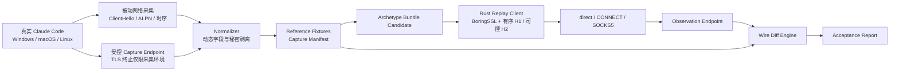

# Rust Transport Spike：Claude Code 传输拟态验证计划

> 文档状态：实施中的详细设计基线  
> 上位规划：[Claude Code 企业网关功能模块规划](./functional-modules.md)  
> 技术栈决策：Linux Rust 单体；Tokio + Axum/Hyper + SQLx；南向 BoringSSL + 有序 HTTP/1.1 writer + 可控 HTTP/2 transport  
> 本文目标：在展开完整网关开发前，证明生产单体可以基于真实采集证据稳定重放 Claude Code 的 TLS、HTTP/1.1 或 HTTP/2、Header 与连接行为

## 1. 结论与执行原则

本 Spike 是完整技术架构设计和业务开发的前置工程门槛。它不重新比较 Go 与 Rust，也不通过常规吞吐跑分判断成败；需要回答的是：Rust 生产单体能否在 Linux 上根据 Archetype Bundle，重放真实 Claude Code 的传输线级表现，并且在 direct、CONNECT、SOCKS5、SSE、连接复用和取消场景下保持一致。

固定原则如下：

- 生产语言已经确定为 Rust stable，不因单个第三方 crate 的限制退回其他语言。
- 北向应用骨架使用 Tokio + Axum/Hyper；SQLx + PostgreSQL 不进入本 Spike 的核心实现，只保留未来接口边界。
- 南向 TLS 以 BoringSSL Rust bindings 为基线；具体使用 `boring`、`tokio-boring`、`hyper-boring` 或其他封装，由 Spike 证据决定。
- HTTP/2 必须可控制初始帧、SETTINGS 值与顺序、WINDOW_UPDATE、伪 Header 顺序、连接复用和取消行为。现有库缺少必要控制点时，在“维护小型 fork”与“实现薄层 transport”之间作出受证据支持的选择。
- 默认 `rustls + reqwest/hyper` 只作为控制组；没有通过对应 Archetype 回归时，不承担拟态请求。
- JA3、JA4 或单一哈希只用于快速索引，不能代替原始 ClientHello 和 HTTP/2 逐字段、逐帧比对。
- 所有生产可用结论必须来自自动化测试向量；人工观察只能形成候选证据。

## 2. Spike 需要回答的问题

完成后必须能够明确回答：

1. BoringSSL 绑定能否表达真实 Claude Code ClientHello 的全部已观察静态字段和顺序？
2. 哪些 TLS 字段是固定 Profile 数据，哪些是每连接动态数据，哪些由 BoringSSL 内部生成？
3. 现有 Hyper/H2 能否表达真实客户端的 HTTP/2 初始帧与连接行为？
4. 若需要 fork，最小补丁面、上游同步策略和安全更新响应方式是什么？
5. Header 顺序、大小写、伪 Header 顺序和 HPACK 状态如何从 Bundle 确定性应用？
6. 同一 Credential 的多个会话、同一会话的多个 Agent 并发时，连接池与 HTTP/2 Stream 行为是否保持 Profile 一致？
7. direct、HTTP CONNECT 和 SOCKS5 是否保持相同的内层 TLS/H1/H2 Profile？
8. TLS Session Resumption、Ticket、连接复用和重新建连如何绑定到 Credential Profile，而不跨 Credential 泄漏？
9. SSE 是否按原始字节透明转发，取消是否只影响目标 Stream，并正确报告提交边界？
10. Archetype Bundle 的最小可用 Schema 是什么，哪些变化需要新 Bundle、Profile epoch 或引擎升级？
11. Linux x86_64 与 arm64 的编译、链接和运行差异是否会改变可观察指纹？
12. 第三方依赖、BoringSSL FFI、`unsafe` 边界和构建产物是否满足长期维护要求？

## 3. 范围与非目标

### 3.1 本期范围

- Windows、macOS、Linux 当前选定 Claude Code/runtime 组合的真实传输采集。
- TLS ClientHello、ALPN、Session Resumption 与证书验证行为。
- HTTP/1.1 与 HTTP/2 均按真实协商结果进入同等级验收，不预设主要协议。
- HTTP/2 初始连接帧、请求帧、流生命周期、并发 Stream 和连接级行为。
- 有序 Header、伪 Header、Header 大小写及稳定派生字段的线级表达。
- direct、HTTP CONNECT、SOCKS5 local DNS、SOCKS5 remote DNS。
- 普通非流式 Messages、SSE、工具、thinking、连接复用、并发和取消。
- Capture Manifest、Archetype Bundle 候选 Schema、规范化 diff 和验收报告。
- Rust Linux 单体内可嵌入的 Transport Engine API 原型。

### 3.2 非目标

- Platform Key、Group、公平队列、Credential 调度和完整重试策略。
- OAuth refresh、Managed Browser Session 和账号恢复。
- 管理控制台、正式数据库 Schema、商业计费和完整可观测性。
- 生成可用于生产的 Windows/macOS 可执行 Worker。
- 根据 JA3/JA4 值宣称“完全真实”。
- 复制浏览器 Profile；目标是已采集的 Claude Code/runtime Profile。
- 绕过证书验证、使用 TLS 终止代理或把采集 CA 带入生产信任链。
- 以生产 Credential 或生产业务正文生成测试 Fixture。

## 4. POC 总体结构



Spike 工程建议使用独立 Cargo workspace，未来可将经过验证的 crate 合并到生产单体：

```text
transport-poc/
├── Cargo.toml
├── Cargo.lock
├── rust-toolchain.toml
├── crates/
│   ├── capture-schema/       # Manifest、Bundle、证据与规范化类型
│   ├── capture-endpoint/     # 采集环境专用 TLS/H1/H2 观察端点
│   ├── claude-capture-runner/# 隔离启动真实 Claude Code 的自动采集编排
│   ├── transport-core/       # BoringSSL、代理、连接池和请求执行 API
│   ├── h2-profile/           # SETTINGS、帧顺序、窗口和 Header 顺序控制
│   ├── wire-normalizer/      # 动态字段归一化与秘密剥离
│   ├── wire-diff/            # TLS/H2/Header/行为比较与报告
│   ├── transport-matrix/     # pooled、代理、取消和隔离域实际套接字矩阵
│   └── spike-cli/            # capture、replay、diff、report 编排
├── fixtures/
│   ├── manifests/            # 可入库的脱敏 Manifest
│   ├── normalized/           # 可入库的规范化 Fixture
│   └── bundles/              # 未签名的 POC Bundle candidate
└── reports/                  # 本地生成，不默认提交原始捕获
```

目录名称是建议结构；最终 crate 边界以实现复杂度为准。核心要求是 Capture Schema、Transport Core 和 Wire Diff 彼此解耦，生产请求链不依赖采集端点。

## 5. 真实环境采集方案

### 5.1 两路采集

单一采集方式无法同时覆盖真实上游 TLS 和解密后的应用层协议，因此采用两路证据。应用层协议由真实客户端协商结果决定，不预设为 H2：

1. **被动实际路径采集**
   - 使用专用非生产捕获账号运行真实 Claude Code，并连接 Anthropic 官方端点。
   - 通过 pcap 记录 TCP、ClientHello、SNI、ALPN、连接建立、重连和时序。
   - ClientHello 本身可直接观察；TLS 加密后的 HTTP/1.1 或 HTTP/2 内容不从该路径推断。
   - 不保存业务正文、token、Cookie、Session Ticket 密文或可复用认证材料。

2. **受控端点采集**
   - 将真实 Claude Code 的 Gateway Base URL 指向隔离 Capture Endpoint。
   - Capture Endpoint 使用采集环境专用 CA 和合成 Gateway Token，只在研发 runner 内受信任。
   - 端点按真实客户端协商接受 HTTP/1.1 或 H2。HTTP/1.1 记录请求行、Header 顺序/大小写/形态、连接行为和 SSE；H2 额外记录帧、SETTINGS、WINDOW_UPDATE、HPACK、并发 Stream 和取消。
   - 该端点不转发生产 Credential，不连接生产数据库，也不进入生产部署包。

两路采集必须绑定同一 `capture_run_id`、客户端版本、runtime、OS、arch、逻辑场景和时间窗口；每个独立证据文件另有唯一 `capture_artifact_id`，持久化、哈希和回读均以 artifact 标识，避免同一运行的官方 TLS 路与受控协议路互相覆盖。Capture Manifest v2 的逻辑场景只包含场景 ID、fresh/pooled、并发度和 request shape，`expected_protocol` 由每条 lane 独立记录；官方被动 TLS 与受控端点协议不同不再构成配对冲突。只有两路证据在真正可比字段上相互一致，才能形成 `verified` Capture Manifest。

所有 replay 验收采用同目标成对比较：真实 Claude Code 与 Rust Replay 分别访问同一个 Anthropic 官方目标，形成被动 TLS 对；两者再分别访问同一个 Capture Endpoint，形成解密后的 HTTP/1.1 或 H2 对。SNI、Host/`:authority`、证书链和由目标名称长度引起的 framing 只在同目标对内比较，不把官方端点与 Capture Endpoint 的天然差异归类为 Profile drift。

### 5.2 Capture Matrix

首轮至少覆盖：

| 维度 | 最低覆盖 |
|---|---|
| OS | Windows、macOS、Linux 各一个当前受支持版本 |
| Architecture | Windows/Linux 至少 x86_64；macOS 至少 arm64；生产候选补 Linux arm64 构建验证 |
| Claude Code | 当前稳定版本；保留前两个兼容小版本的后续回归入口 |
| Runtime | 记录实际 Bun/Node/runtime 名称、版本和构建信息，不按 UA 猜测 |
| 网络路径 | direct、HTTP CONNECT、SOCKS5 local DNS、SOCKS5 remote DNS |
| 连接形态 | fresh、pooled、resumed、并发 streams、idle 后复用、强制重连 |
| 响应形态 | 非流式 JSON、SSE、服务端 4xx/429/5xx、慢首字节、慢流 |
| 取消阶段 | 上传前、上传中、完整提交后响应前、SSE commit 后 |

每个确定性场景至少执行 20 次 fresh connection 和 20 次 pooled request，以区分固定字段、每连接动态字段和偶发行为。出现多个稳定簇时，不取“多数值”覆盖；分别形成候选 Archetype variant，并查明分簇条件。

### 5.3 采集环境记录

每次采集至少记录：

- `capture_run_id`、每路唯一 `capture_artifact_id`、UTC 时间、操作者或 CI job；
- OS 名称、版本、build、arch、kernel；
- Claude Code 版本、runtime 名称与版本、安装来源和二进制哈希；
- 环境变量白名单及影响连接行为的显式配置；
- direct/proxy 类型、DNS 执行位置和代理软件版本，不记录代理密码；
- Capture Endpoint、证书链和 ALPN 配置版本；
- 场景 ID、请求形态摘要和预期连接复用状态；
- pcap/端点事件文件的哈希、规范化器版本和脱敏结果。

## 6. 规范化与秘密处理

### 6.1 TLS 规范化

规范化只能移除真实协议中必然动态且不表达客户端类别的值，字段是否存在、所在位置、长度和算法选择仍需比较。

默认动态字段包括：

- Client Random 的具体随机字节；
- Key Share 公钥内容，但保留 group、顺序和长度；
- Session ID、Ticket/PSK identity 的具体密文，但保留存在性、数量、长度和扩展位置；
- GREASE 的具体保留值，但保留 GREASE 出现位置、数量和所属字段；
- padding 的随机内容，但保留扩展位置和最终长度策略；
- 每连接时间、TCP source port 和序列号。

以下默认属于硬比较字段：

- TLS record 与 ClientHello legacy version；
- Cipher Suites 集合及顺序；
- Extension 类型、数量及顺序；
- supported_versions、supported_groups、signature_algorithms；
- key_share group 顺序与长度；
- ALPN 列表及顺序；
- SNI 形态；
- PSK modes、Session Ticket/Resumption 能力；
- certificate compression、ALPS/ECH GREASE 等已观察扩展的存在性和相对位置；
- ClientHello 总长度、分片和 record framing 策略。

### 6.2 HTTP/2 规范化

fresh connection 场景对初始帧序列执行规范化后精确比较：

- Client Preface；
- SETTINGS 条目、值、缺失项和发送顺序；
- SETTINGS ACK 的相对时序；
- connection-level WINDOW_UPDATE；
- PRIORITY/PRIORITY_UPDATE 等帧的存在性、顺序与字段；
- 首个请求的 Stream ID、flags 和 frame 切分策略；
- pseudo-header 顺序；
- 普通 Header 顺序与大小写策略；
- END_HEADERS、END_STREAM 的提交边界；
- PING、GOAWAY、RST_STREAM 行为。

Stream ID 可在多场景中按连接内序号归一化，但奇偶性、递增规则和帧引用关系必须保持。时间值采用区间或相对顺序比较，不以纳秒级一致作为拟态条件。

HPACK 分为两类验收：

- fresh connection 的固定场景比较动态表初始状态、索引选择、Huffman 使用和编码字节；
- pooled/multiplexed 场景比较确定性连接历史下的动态表演进和解码后 Header 顺序。只有参考客户端在相同历史下产生稳定编码时，才要求压缩字节完全一致。

### 6.3 Header 与 Body 脱敏

进入 Fixture 前必须删除或替换：

- Platform Key、Anthropic OAuth/API token、Authorization、Cookie；
- 代理账号密码；
- 完整业务 Prompt、System、工具输入输出和文件内容；
- device/client ID、原始 Session ID、Session HMAC、Profile seed；
- 可复用 Session Ticket/PSK 内容；
- 用户、账号、主机和企业网络标识。

Header 名称、顺序、是否存在、值类型、长度类别和稳定派生规则可以保留。需要比较值格式时使用不可逆占位符，例如 `TOKEN_32B`、`UUID_V4`、`HEX_64`，不得把真实值写入 Git、测试日志或报告。

## 7. Rust 候选传输实现

### 7.1 固定应用边界

Transport Engine 原型至少暴露：

```rust
pub struct TransportAttempt {
    pub profile: Arc<CompiledTransportProfile>,
    pub egress: EgressBinding,
    pub request: FinalUpstreamRequest,
    pub deadlines: AttemptDeadlines,
    pub cancellation: CancellationToken,
}

pub trait TransportEngine {
    async fn execute(
        &self,
        attempt: TransportAttempt,
        observer: &dyn TransportObserver,
    ) -> Result<UpstreamResponse, TransportError>;
}
```

示例只定义职责，不冻结最终 Rust 语法。接口必须使 Executor 能观察：连接阶段、首个上游字节、HTTP/2 `END_STREAM`、响应 Header、SSE 字节、取消确认和连接是否可回池；Transport Engine 不拥有 Credential 调度、重试和持久状态。

### 7.2 TLS 候选

基线方案：

- `boring`：BoringSSL 配置、证书验证和 TLS 状态；
- `tokio-boring`：Tokio 异步 IO 适配；
- `hyper-boring`：只作为连接器候选和控制组，不预设其 HTTP/2 输出满足目标；
- 必要时在最小封装层内调用经审计的 BoringSSL 扩展接口。

必须明确 BoringSSL 可配置字段、内部固定字段和需要补丁的字段。任何 `unsafe`/FFI 都集中在单独 crate，公开安全 API，并通过 Miri 可覆盖部分、ASan/UBSan、模糊测试和边界值测试验证。

### 7.3 HTTP/2 候选

按以下顺序评估：

1. 现有 Hyper/H2 公开配置是否已覆盖目标 Bundle；
2. 小型、可长期维护的 H2 fork 是否只需暴露顺序/窗口/帧控制点；
3. 基于现有 framing/HPACK 组件实现专用南向薄层 transport；
4. 第三方拟态客户端只作为加速候选，必须评估维护活跃度、许可证、BoringSSL 版本、安全修复响应和可测试性。

选择标准不是代码最少，而是：可精确表达、可观测、可回归、补丁面可控、依赖升级可持续。Spike 报告必须列出实际缺失控制点和补丁 diff 范围。

### 7.4 已实施的后端能力基线（2026-08-24）

`transport-core` 已固定 `cloudflare/boring 5.2 + hyperium/h2 0.4` 为当前审计对象，但这是 Probe 基线，尚不是 Canary 通过结论。

| 控制点 | 当前能力 | 门禁处理 |
|---|---|---|
| TLS 版本、ALPN、动态字段、Session Resumption | BoringSSL 有公开控制/状态 API；空 ALPN Profile 可保持不发送，非空 Profile 按顺序应用；当前 POC 安全基线不分配 Session Ticket Store，resumption 默认关闭 | Windows 2.1.241 当前 cohort 的 20 次 fresh `http/1.1` ALPN 同目标 Diff 已验证；关闭态已证明不会跨隔离域复用。未来启用 resumption 前必须以完整 Pool Key 隔离 Ticket Store，并补齐 resumed reference/replay 矩阵 |
| Cipher 顺序、Supported Groups、KeyShare | TLS 1.2 及以前 Cipher、Groups 可配；TLS 1.3 套件受库实现约束 | Windows 2.1.241 当前 cohort 的 17 个 Cipher、3 个 Group 和单 X25519 KeyShare 已连续 20 次精确通过；其他 Bundle 保持 `wire_verification_required` |
| TLS 扩展顺序、ClientHello 长度、record framing | OCSP stapling、SCT、GREASE/随机化和 Groups 可控，任意扩展顺序与 framing 没有完整公开控制 | Windows 2.1.241 当前 cohort 的 14 个扩展、512/517 字节长度已连续 20 次精确通过；其他 Bundle 保持 `wire_verification_required` |
| H1 请求行、Header 顺序/大小写、Content-Length framing | 低层有序字节 writer 可直接表达 | 受控 Wire Diff 已验证 Windows 2.1.241 |
| H2 SETTINGS 值 1–6、连接窗口 | `h2::client::Builder` 可配，已有明确映射和值域校验 | 未知/重复/非法值直接阻断 |
| SETTINGS 顺序、帧序、pseudo-header/Header 顺序 | 当前公开 Builder 不保证线级顺序 | `wire_verification_required` |
| HPACK 原始编码、取消矩阵 | C01–C06 已以实际 H1 socket 和内存 H2 双 Stream 覆盖；当前 Windows cohort 为 H1，没有真实 H2 HPACK reference | 取消门禁已通过；HPACK 原始编码在出现真实 H2 cohort 时继续保持 `evidence_missing` |

Bundle Loader 在反序列化后重新验证证据绑定、内容哈希和隐私不变量。Bundle Schema v2 使用协议判别结构，H1 保存请求行、路径形状、Body/framing，H2 保存 SETTINGS/帧；Replay Schema v4 进一步保存 Cipher、Supported Groups 与 KeyShare 组并应用到 BoringSSL，同时在审计项中记录已消费的证据哈希。`probe` 可以产生受控采集用 Replay Plan，`canary` 对尚未绑定验证证据的 wire verification、patch、evidence missing 和 unsupported 状态 fail-closed。Replay Plan 不携带 Credential、Session 或代理 Secret。

Windows 本地首次全量 BoringSSL C/ASM 构建因 NASM 处理含中文的中间路径失败；将 `CARGO_TARGET_DIR` 指向独立 ASCII 路径后，BoringSSL、`tokio-boring`、`transport-core` 和 `spike-cli` 的 C/ASM 编译、链接与严格 Clippy 均已通过。生产发布门禁仍是 Linux x86_64/arm64 的对应构建和回归。

真实无凭据探针已对 `api.anthropic.com:443` 完成证书/主机名校验、SNI、TLS 1.3、ALPN `h2` 和 H2 Client Preface/SETTINGS 发送。该探针没有发送 Messages 请求和 Credential。其结论只是“原生 TLS/H2 执行路径成立、SETTINGS 值已应用”；SETTINGS 线上顺序、服务端 SETTINGS、HPACK、帧序和取消行为没有因此解锁，继续保持 Canary blocker。

后续实施已增加受限 HTTP CONNECT pass-through TLS tap、HTTP/1.1/H2 双协议受控端点、全自动真实 Claude Runner 和 `transport-matrix`。实际 Replay 已观察到 `SETTINGS → SETTINGS ACK → HEADERS`，其中 SETTINGS 值与顺序与 Bundle 精确一致；Windows Claude Code 2.1.241 当前 cohort 已完成 20 组官方 TLS 与受控端点双路采集，每组共享独立 `capture_run_id` 并可形成 verified Manifest。官方与受控 lane 当前均表现为 HTTP/1.1；受控主请求稳定为 15,347 字节。Runner 实测识别并应答了先于主请求出现的会话标题 JSON Schema 请求，随后捕获主请求；真实子进程以退出码 0 完成，产生 `assistant/result` 且无 retry。官方 TLS lane 使用随机无效认证，仅采集到官方 authority 的 ClientHello，不要求订阅登录或产生模型响应。独立真实订阅 pass-through 验收也已完成：Runner 将本地 Tap 通过继承的上级 HTTP CONNECT 代理链式出站，保持原代理出口；Windows 2.1.241 的 `claude.ai` Pro OAuth 调用通过 `api.anthropic.com` 返回真实 Claude Opus 4.6 响应，CLI 退出码 0、无 retry，并观察到完整六类 SSE 生命周期、usage 和限流事件。

研发专用 `subscription-response-probe` 已进一步补齐原始响应 Header 语义。该探针本地终止一次性 TLS，仅在内存中转发真实 OAuth 请求；上游继续走继承的 HTTP CONNECT 出口，并把 Windows 原生根证书显式导入 BoringSSL 以严格校验 Anthropic。Windows 2.1.241 实测取得 HTTP 200、`text/event-stream`、chunked、gzip、哈希后的 `request-id`，以及 `anthropic-ratelimit-unified-*` 5h/7d status、reset、utilization、representative claim 和 overage 状态；本次 200 没有 `retry-after`，后续错误样本可沿同一安全规则采集。报告不保存请求/响应正文、OAuth、Prompt 或 completion。由于该探针改变研发采集路径的 TLS 与上游 ALPN/H1 实现，其产物只验证响应语义，不进入 ClientHello、H2 或 Archetype Bundle 证据链。

2.1.220 和 Windows 2.1.241 首条 251/256 字节证据继续作为历史样本保留。新鲜矩阵发现：OS、Claude Code 版本、runtime 版本和 Claude 可执行文件 SHA-256 均不变时，当前 20 份官方 reference 已稳定迁移为 17 个 Cipher、14 个扩展、`http/1.1` ALPN、512 字节 ClientHello 和 517 字节 Record；旧 Bundle 的 20 次 TLS Replay 因硬字段失配全部 `FAIL`，门禁没有把版本内漂移吞掉。Bundle v2 按当前 cohort 重新编译，并让 BoringSSL 按 Profile 启用 OCSP stapling/SCT；随后官方 reference 稳定性、受控 reference 稳定性、TLS Replay 和 H1 Replay 四项均为 20/20 `PASS`。历史采集中 25 次受控启动得到 20 个成功配对，5 次在完整响应后的 Windows 连接重置均失败关闭且未落盘；端点现已只在完整交换后容忍 `reset/abort/broken-pipe/not-connected/unexpected-eof` 终止关闭，修复后真实 Claude Code 受控批次为 20/20 成功、0 失败。当前 TLS 结果已封装为绑定 Bundle、Probe Plan、后端、目标和 Engine 二进制哈希的 Canary 证据；H1 `response_streaming` 取消也由真实 Transport Engine 与受控 TLS peer 双向观察。两类证据联合消费后当前 Windows Bundle 的 5 个 blocker 全部解除，审计为 `ReadyForCanary`。

Windows `transport-matrix` 已进一步完成 17/17 场景：T02 在一条实际 BoringSSL/TLS/H1 连接上连续完成 20 个等形请求；T04 idle 250 ms 后复用同连接；T06 证明当前默认关闭 resumption 时未分配 Ticket Store 且无跨隔离域恢复；ISO01 对 Credential、Profile epoch、Bundle、Egress/epoch 等不匹配键零复用；P01–P05 的 direct、CONNECT、CONNECT Basic、SOCKS5 local/remote DNS 捕获到相同内层 ClientHello，代理认证未到达 origin；P06/P07 分别归因为 `unhealthy_tls_passthrough` 与 `proxy_authentication`；C01–C05 以实际 H1 socket 覆盖连接前、上传中、完整提交后、响应 commit 后和残余响应逐出，C06 证明 H2 取消一个 Stream 后另一个 Stream 与连接继续健康。报告同时绑定 Bundle、Plan、Engine 与自身 SHA-256。该 T02 是网关 Replay 连接池证据；真实 Claude Code 单进程的 20 次 pooled reference 仍作为增强矩阵单独执行，二者不得互相冒充。macOS/Linux 双路证据按现有环境条件延后，不阻塞 Windows-only Archetype v1 的后续验证。

direct/HTTP CONNECT/SOCKS5 local DNS/SOCKS5 remote DNS 已统一为 BoringSSL 前置透明建链路径；SSE 字节透传、H1/H2 取消决策、H1 残余响应逐出、H2 双 Stream 取消隔离和完整 Pool Key 均有实际自动矩阵。实施现状和最终门禁判定见 [Rust Transport Spike 最终验收报告](./transport-spike-report.md)。

### 7.5 连接池隔离

POC 从一开始验证以下 Pool Key：

```text
Credential ID
+ Profile epoch
+ Archetype Bundle version
+ Egress binding ID / egress epoch
+ destination authority
+ negotiated protocol
```

不同 Credential、Profile epoch、Egress 或代理不得共用 TLS Session Cache、HTTP/2 connection、HPACK 动态表或 Session Ticket Store。同 Credential 的不同 Base Session/Agent 可以在容量允许时复用连接，但必须拥有独立 HTTP/2 Stream 和上层 Session Header。

## 8. 测试场景

### 8.1 基础协议场景

| ID | 场景 | 核心观察 |
|---|---|---|
| T01 | fresh TLS + 单个非流请求 | ClientHello、ALPN、HTTP/1.1 请求或初始 H2 帧、Header 顺序 |
| T02 | 同连接连续 20 请求 | H1 keep-alive 或 H2 HPACK/Stream ID、连接复用 |
| T03 | 10 个并发请求 | H1 连接分配或 H2 multiplex、窗口、取消隔离、响应乱序 |
| T04 | idle 后复用 | keepalive、PING、idle 生命周期 |
| T05 | 服务端 GOAWAY | 新连接、未提交 Stream 处理、旧连接逐出 |
| T06 | TLS resumption | Ticket 隔离、ClientHello 变化、Profile 稳定性 |
| T07 | ALPN 只提供 h1/h2 组合 | 协商选择与不支持协议错误 |
| T08 | 大 Header/多工具 Schema | CONTINUATION、HPACK、Header 限制 |

### 8.2 请求与响应场景

| ID | 场景 | 核心观察 |
|---|---|---|
| M01 | 普通非流 Messages | 完整提交边界、原始响应字节 |
| M02 | SSE Messages | TTFT、event 字节边界、ping、背压 |
| M03 | thinking 请求 | Header/Body 仅作形态验证，不修改业务语义 |
| M04 | 工具与大 Schema | Header 压缩、Body framing、响应透明 |
| M05 | 上游 400/401/429/500/529 | 状态、Header、Body 原样交给上层 |
| M06 | 慢首字节/慢 SSE | idle timer 观察事件与取消传播 |
| M07 | 非流式大 Body | 原始分块接收，不在 Transport 层重序列化 |

### 8.3 代理场景

| ID | 场景 | 核心观察 |
|---|---|---|
| P01 | direct | 控制基线 |
| P02 | HTTP CONNECT 无认证 | 内层 TLS/H2 与 direct 一致 |
| P03 | HTTP CONNECT Basic 认证 | 代理 Header 只存在于隧道建立阶段 |
| P04 | SOCKS5 local DNS | DNS、CONNECT、SNI 和失败归因 |
| P05 | SOCKS5 remote DNS | 代理侧解析与内层 SNI |
| P06 | 代理终止/替换 TLS | 必须识别为 `unhealthy_tls_passthrough` |
| P07 | 代理认证失败 | 必须形成确定性 Egress 错误，不污染 Credential 认证 |

### 8.4 取消场景

| ID | 取消阶段 | 必须观察的结果 |
|---|---|---|
| C01 | 获取连接前 | 零上游请求字节，连接尝试可取消 |
| C02 | Header/Body 上传中 | HTTP/2 RST_STREAM；记录非完整提交 |
| C03 | `END_STREAM` 后响应前 | 只取消目标 Stream，不继续排空 |
| C04 | SSE commit 后 | 保留已传字节，取消目标 Stream，不追加错误事件 |
| C05 | HTTP/1.1 上传/响应未完成 | 关闭连接并禁止回池 |
| C06 | 同 H2 连接其他 Stream 活跃 | 其他 Stream 继续完成，连接保持健康 |

## 9. Wire Diff Engine

### 9.1 比较层级

Diff 输出分为：

- `EXACT`：原始字节一致；
- `NORMALIZED_EXACT`：仅允许 Manifest 声明的动态字段不同；
- `BEHAVIORAL_MATCH`：时序/连接行为处于已验证区间；
- `UNCLASSIFIED_DRIFT`：出现未分类差异；
- `HARD_MISMATCH`：固定字段、顺序、帧或安全行为不一致。

只有指定为 `EXACT` 或 `NORMALIZED_EXACT` 的字段满足要求，并且行为项全部达到 `BEHAVIORAL_MATCH`，Archetype candidate 才能进入 Canary。`UNCLASSIFIED_DRIFT` 默认阻止发布，先回到采集分类。

### 9.2 报告最小内容

每份报告至少包含：

- reference/replay 的 Manifest、Bundle、engine build 和依赖锁哈希；
- OS/runtime/Claude Code/代理/场景矩阵；
- ClientHello 字段树 diff 和原始规范化哈希；
- HTTP/2 帧时间线、SETTINGS 顺序、窗口和 Stream 关系 diff；
- Header 顺序、值形态与 HPACK diff；
- 连接复用、resumption、取消和错误归因结果；
- 所有允许差异及其证据；
- 所有未分类差异、负责人和阻断状态；
- 最终 `PASS|FAIL|INCONCLUSIVE`，不得用总体相似度百分比替代门槛判断。

## 10. Archetype Bundle 候选 Schema

POC 至少验证以下逻辑结构：

```yaml
schema_version: 2
archetype_id: claude-code/<os>/<arch>/<runtime>/<version>
bundle_version: 1
evidence:
  manifest_ids: []
  capture_hashes: []
  verified_at: null
compatibility:
  engine_api: v1
  rust_target: []
  min_engine_build: null
tls:
  client_hello_spec: {}
  dynamic_fields: []
  alpn_order: []
  record_framing: {}
  resumption_policy: {}
application:
  protocol: http1 | http2
  profile:
    # http1: method/path_shape/version/body_bytes/content_length_framing
    # http2: settings/frame/pseudo-header/window/HPACK controls
headers:
  ordered_names: []
  casing_policy: {}
  derived_value_rules: []
connection:
  pooling: {}
  keepalive: {}
  max_concurrent_streams_behavior: {}
  idle_behavior: {}
verification:
  fixture_set: null
  expected_normalized_hashes: {}
```

Bundle 不包含 Credential token、代理密码、真实 Device Identity、Session HMAC、业务 Body 或可复用 Ticket。Credential Device Identity 和 Egress Binding 继续由 Credential Profile 管理，不写入可共享 Archetype。

## 11. 验收门槛

### 11.1 功能门槛

- Windows、macOS、Linux 各完成至少一个 verified Capture Manifest。
- 三类环境均可编译为 Bundle candidate，并由同一 Linux Rust Transport Engine 加载。
- 每个确定性场景的 20 次 fresh 与 20 次 pooled 运行无未分类稳定差异。
- ClientHello 硬字段全部达到 `NORMALIZED_EXACT`，ALPN 和 record framing 符合 Manifest。
- HTTP/2 初始帧、SETTINGS 值/缺失项/顺序、WINDOW_UPDATE、pseudo-header 顺序和提交 flags 达到规定比较级别。
- Header 名称顺序、大小写策略和动态值格式符合 Bundle；秘密字段零落盘。
- 同 Credential 多会话和多 Agent 并发不改变 Profile，同连接 Stream 相互隔离。
- 不同 Credential/Profile/Egress 的连接池、TLS Session Cache 和 HPACK 状态零复用。
- direct、CONNECT、SOCKS5 的内层 TLS/H2 结果一致；TLS 终止代理被确定性识别。
- SSE 响应按原始字节传递，取消不会产生额外 JSON/SSE，HTTP/2 其他 Stream 不受影响。
- HTTP/1.1 存在残余请求/响应时连接不回池。

### 11.2 工程门槛

- `cargo build --locked` 可复现，Rust toolchain 与依赖全部固定。
- Linux x86_64 构建、测试和打包通过；Linux arm64 至少完成交叉构建与目标机 smoke test。
- BoringSSL/FFI 的 `unsafe` 位置可枚举、可审计，ASan/UBSan 和边界测试通过。
- Fixture 与报告经过 secret scan，不包含 token、Cookie、代理密码、真实 Session/Device 标识和业务正文。
- 依赖许可证、维护状态、已知安全公告和升级路径有记录。
- Transport Core 在 mocked endpoint 下支持至少 1,200 条并发 SSE 连接和 250 RPS 的基础转发试验，无持续 task、连接和内存增长；该结果只是可行性门槛，正式 SLO 仍按上位规划验收。

### 11.3 决策门槛

Spike 结束必须选择且只选择一个南向方案：

1. **Upstream libraries**：公开 API 已满足全部 Bundle 控制项；
2. **Maintained fork**：补丁面明确、自动 rebase/regression 流程成立；
3. **Dedicated thin transport**：复用 BoringSSL、framing/HPACK 基础组件，自行控制目标线级行为；
4. **Blocked**：列出缺失能力、失败证据和需要重新决策的具体边界。

不得以“先用默认网络栈，后续再补指纹”作为通过结论。

## 12. 安全与隔离

- 采集账号、捕获代理、Capture Endpoint 和 CA 与生产完全隔离。
- 生产代码不包含采集 CA 私钥、明文 Fixture、TLS key log 或关闭证书验证的路径。
- Capture Endpoint 仅绑定隔离网络，使用来源 allowlist 和短期合成 token。
- BoringSSL 生产路径始终校验 `api.anthropic.com` 的证书链、Host 和 SNI。
- CONNECT/SOCKS5 代理只建立隧道；发现证书替换、TLS 终止或 ALPN 改写即判定失败。
- 原始 pcap、解密事件和未脱敏报告存入受控临时目录，完成规范化和 secret scan 后按采集策略销毁。
- 进入 Git 的只有脱敏 Manifest、规范化 Fixture、Bundle candidate 和不含秘密的报告摘要。
- 模糊测试输入不得来源于未脱敏生产 Body。

## 13. 实施阶段

### 阶段 A：采集与 Schema

- 搭建隔离 Capture Endpoint；
- 完成三 OS runner 的环境记录和基础场景；
- 定义 Capture Manifest、事件格式和规范化规则；
- 产出首批 reference fixtures。

### 阶段 B：TLS Replay

- 集成 BoringSSL/Tokio；
- 从 Bundle 编译 ClientHello Profile；
- 验证 fresh、resumption、direct 和代理隧道；
- 固化 TLS diff 与安全测试。

### 阶段 C：HTTP/1.1 与 HTTP/2 Replay

- 先按 Manifest 协议编译 H1/H2 Replay Plan，并枚举各自缺失控制点；
- 完成公开 API、fork 或 thin transport 三种路径的最小实验；
- 实现 SETTINGS、窗口、Header 顺序、HPACK 和 Stream 生命周期；
- 选择唯一候选方案。

### 阶段 D：SSE、取消与连接池

- 接入非流式和 SSE；
- 实现提交边界、取消确认和连接逐出；
- 验证多会话、多 Agent、多 Credential 隔离；
- 执行代理矩阵和基础负载试验。

### 阶段 E：Bundle 与报告

- 从 Manifest 生成 Bundle candidate；
- 完成 replay/diff/report 自动化；
- 对三 OS Archetype 执行完整回归；
- 输出最终依赖、fork、API、风险和维护决策。

## 14. 最终交付物

Spike 完成时必须交付：

1. 可重复执行的 Rust Cargo workspace；
2. 三 OS verified Capture Manifest；
3. 脱敏 reference fixtures；
4. 至少三个 Archetype Bundle candidate；
5. BoringSSL ClientHello replay 实现；
6. 根据真实证据选定的可控 HTTP/1.1/H2 transport 实现；
7. direct/CONNECT/SOCKS5 测试适配器；
8. Wire Normalizer 与 Wire Diff CLI；
9. SSE、取消、连接池与 resumption 测试；
10. secret scan、FFI/unsafe、许可证和依赖风险报告；
11. 性能可行性报告；
12. 最终 `PASS|FAIL|INCONCLUSIVE` 决策记录；
13. 供 `planning/technical-architecture.md` 使用的 Transport Engine API、Bundle Schema 和运行约束。

## 15. Spike 之后的顺序

通过本 Spike 后，按以下顺序继续：

1. 创建 `planning/technical-architecture.md`，确定 Rust 单体内部组件、调用方向、运行时隔离和部署关系；
2. 创建领域模型与状态机设计，覆盖 Platform Key、Group、Credential、Profile、Lease、Request、Attempt、Usage 和审计；
3. 创建 PostgreSQL Schema 与迁移设计；
4. 创建北向 API、管理 API 与错误合同；
5. 制定开发里程碑、集成测试、故障注入、性能测试和 GA 发布计划。

如果 Spike 为 `FAIL` 或 `INCONCLUSIVE`，只重新评估南向传输实现、Bundle 可表达性和拟态边界；已经确认的 Rust 单体、平台定位、请求治理、凭据体系和响应透明原则保持不变，除非失败证据明确证明其中某项产品约束需要重新决策。

## 16. 参考资料

- [Claude Code 企业网关功能模块规划](./functional-modules.md)
- [sub2api OAuth 拟态、身份、缓存与指纹一致性](../analysis-result/sub2api/05-mimicry-cache-and-fingerprints/feature.md)
- [CLIProxyAPI Cloaking、系统提示、设备画像与会话](../analysis-result/CLIProxyAPI/04-cloaking-session-fingerprint/README.md)
- [Claude Code 认证与连接](../analysis-result/ClaudeCodeAPI/04-auth-and-connection/README.md)
- [Tokio 官方文档](https://tokio.rs/)
- [Axum 官方文档](https://docs.rs/axum/latest/axum/)
- [Hyper 官方文档](https://hyper.rs/)
- [SQLx 官方仓库](https://github.com/transact-rs/sqlx)
- [Cloudflare BoringSSL Rust Bindings](https://github.com/cloudflare/boring)

## 17. Reader Check

一名没有参与本轮讨论的实现者，应能仅凭本文回答：

- 为什么单独比较 JA3/JA4 不足以验收拟态？
- 为什么真实上游 pcap 和受控 Capture Endpoint 两路证据都需要？
- 哪些 ClientHello 字段允许动态变化，哪些属于硬门槛？
- pooled HTTP/2 场景为什么不总是要求 HPACK 原始字节无条件一致？
- 同一 Credential 的不同会话是否可以复用 HTTP/2 连接？
- 不同 Credential 为什么禁止共享 TLS Session Cache 和 HPACK 状态？
- 代理如何保持内层 TLS 指纹，何时判定 TLS pass-through 失败？
- 现有 Hyper/H2 控制能力不足时按什么顺序选择 fork 或 thin transport？
- 哪些数据允许进入 Git，哪些原始采集必须在受控环境销毁？
- Spike 达到什么条件后才可以开始完整技术架构和业务开发？
